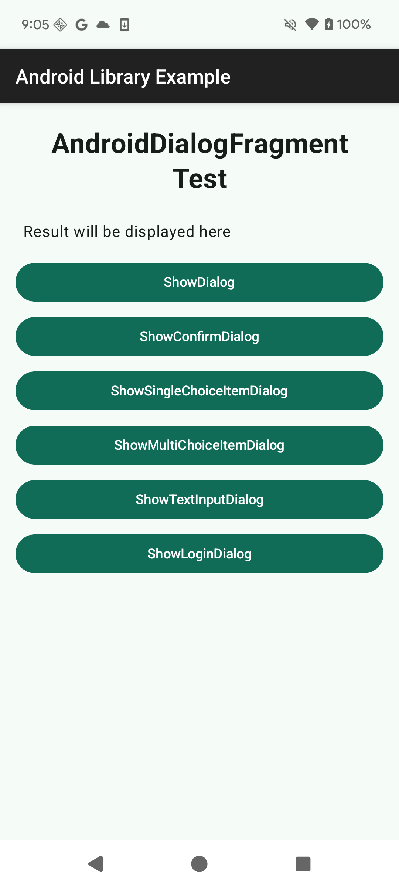
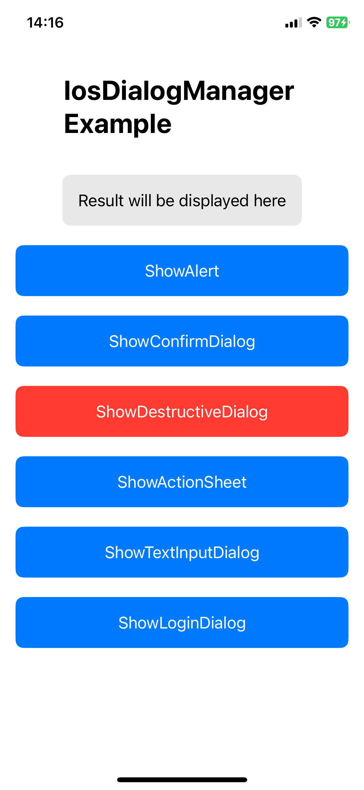
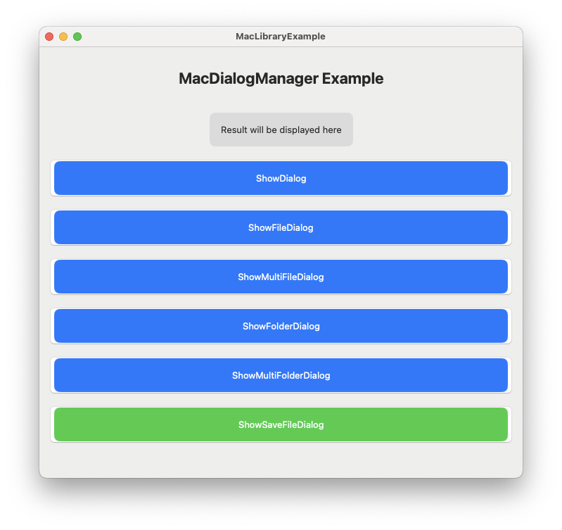
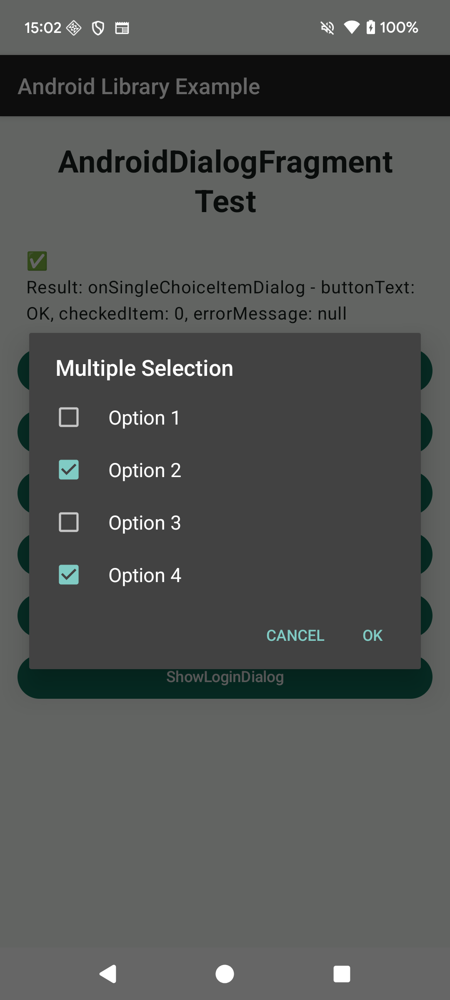
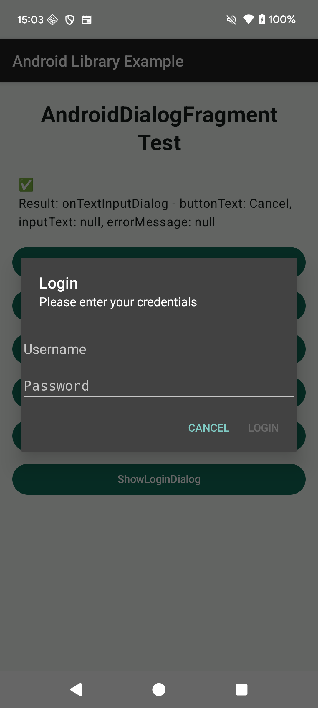
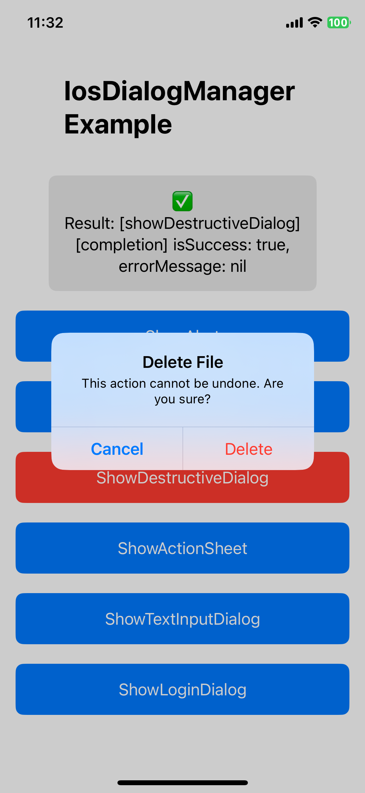
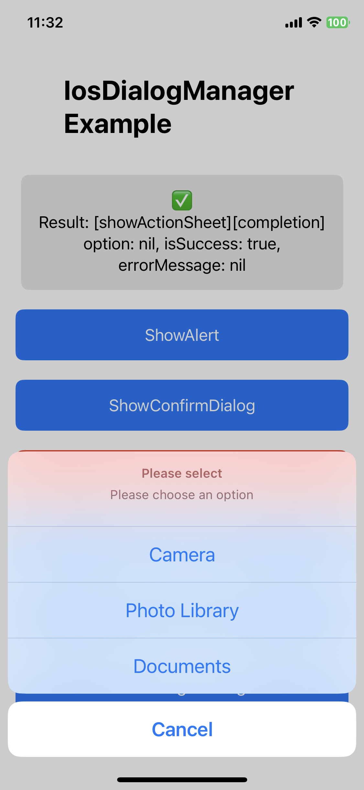
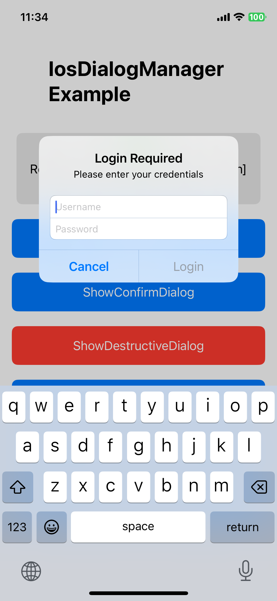
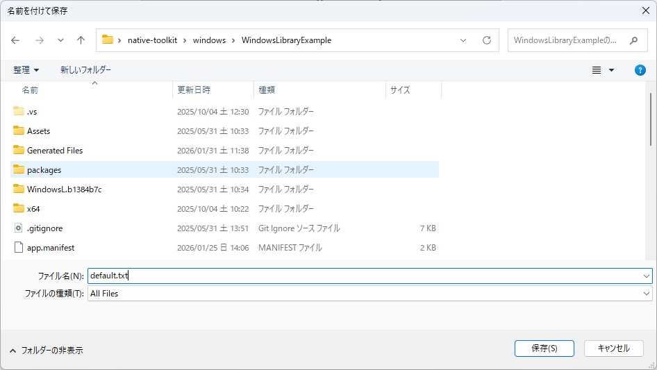
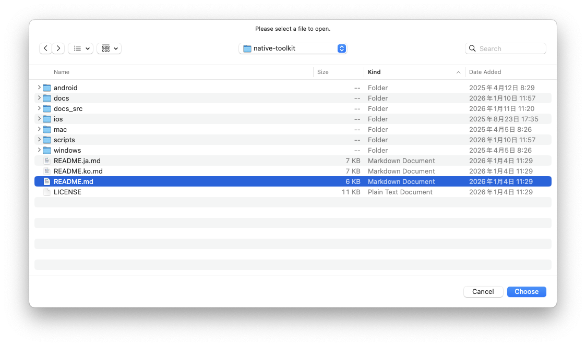

# native-toolkit 매뉴얼

언어:

- 한국어(이 페이지)
- 영어: [index.md](index.md)
- 일본어: [index.ja.md](index.ja.md)

이 디렉터리의 Markdown 파일은 버전 문서로 `docs/<version>/manual/`에 게시됩니다.

# 이 매뉴얼의 목적

- 자동 생성 문서(Dokka / DocC / Doxygen)만으로는 다루기 어려운 도입 절차와 실무 운영 포인트를 정리합니다.
- 수기 문서를 생성 산출물(`docs/`)과 분리해 publish 시 덮어쓰이지 않도록 합니다.

# 이 페이지에서 확인할 수 있는 내용

- 설치 / 도입
- 플랫폼별 설정
  - Android (Gradle)
  - iOS (Xcode)
  - Windows (Visual Studio)
  - macOS (Xcode)
- API 사용 예시

# 자동 생성 문서(API 레퍼런스)

- Android: `docs/<version>/android/`
- iOS: `docs/<version>/ios/`
- Windows: `docs/<version>/windows/`
- macOS: `docs/<version>/mac/`

# 배포 산출물 위치 (`dist/<version>/`)

- Android: `dist/<version>/android/native-toolkit-<version>.aar`
- iOS: `dist/<version>/ios/NativeToolkit-<version>.xcframework`
- Windows: `dist/<version>/windows/nuget/NativeToolkit/NativeToolkit.<version>.nupkg`
- macOS:
  - `dist/<version>/mac/NativeToolkit-<version>-xcode16.xcframework`
  - `dist/<version>/mac/NativeToolkit-<version>-xcode26.xcframework`

# Native Toolkit

- native-toolkit은 각 플랫폼의 네이티브 기능을 통합적으로 사용하기 위한 툴킷입니다.
- 패키지에는 Android / iOS / Windows / macOS용 네이티브 플러그인과 샘플이 포함되며, 다이얼로그 기능은 싱글톤 API로 사용할 수 있습니다.

# 버전

## 1.0.0

# 지원 OS 버전

- Android 12+
- iOS 18+
- Windows 11+
- macOS 15+

# 기능 목록

## Android

- 다이얼로그 기능
  - 기본 다이얼로그
  - 확인 다이얼로그
  - 단일 선택 다이얼로그
  - 다중 선택 다이얼로그
  - 입력 다이얼로그
  - 로그인 다이얼로그

## iOS

- 다이얼로그 기능
  - 기본 다이얼로그
  - 확인 다이얼로그
  - 파괴적 다이얼로그
  - 액션 시트
  - 입력 다이얼로그
  - 로그인 다이얼로그

## Windows

- 다이얼로그 기능
  - 기본 다이얼로그
  - 파일 선택 다이얼로그
  - 다중 파일 선택 다이얼로그
  - 폴더 선택 다이얼로그
  - 다중 폴더 선택 다이얼로그
  - 파일 저장 다이얼로그

## Mac

- 다이얼로그 기능
  - 기본 다이얼로그
  - 파일 선택 다이얼로그
  - 다중 파일 선택 다이얼로그
  - 폴더 선택 다이얼로그
  - 다중 폴더 선택 다이얼로그
  - 파일 저장 다이얼로그

## 추가 예정 기능

- 공유 기능
- 클립보드 연동
- 알림

## 샘플

- Android 샘플
  - Android Studio를 설치합니다.
    - <a href="https://developer.android.com/studio" target="_blank" rel="noopener noreferrer">참고 사이트</a>
  - Android Studio를 실행합니다.
  - "File" → "Open..."를 선택합니다.
  - `native-toolkit/android/AndroidLibraryExample`를 선택하고 "Open" 버튼을 클릭합니다.
  - Android 기기를 연결합니다.
  - "Run" 버튼을 클릭해 샘플 앱을 설치합니다.
    <p align="center">
        
    </p>

- iOS 샘플
  - Xcode를 설치합니다.
    - <a href="https://developer.apple.com/xcode" target="_blank" rel="noopener noreferrer">참고 사이트</a>
  - Xcode를 실행합니다.
  - "Open Existing Project..."를 선택합니다.
  - `native-toolkit/ios/IosWorkspace.xcworkspace`를 선택하고 "Open" 버튼을 클릭합니다.
  - "Run" 버튼을 클릭해 샘플 앱을 설치합니다.
    <p align="center">
        
    </p>

- Windows 샘플
  - Visual Studio 2022를 설치합니다.
    - <a href="https://visualstudio.microsoft.com/vs/" target="_blank" rel="noopener noreferrer">참고 사이트</a>
  - Visual Studio 2022를 실행합니다.
  - "Open a project or solution"을 선택합니다.
  - `native-toolkit\windows\WindowsLibraryExample\WindowsLibraryExample.sln`을 선택하고 "Open" 버튼을 클릭합니다.
  - "Debug" → "Start Debugging"을 선택해 샘플 앱을 설치합니다.
    <p align="center">
        
    </p>

- Mac 샘플
  - Xcode를 설치합니다.
    - <a href="https://developer.apple.com/xcode" target="_blank" rel="noopener noreferrer">참고 사이트</a>
  - Xcode를 실행합니다.
  - "Open Existing Project..."를 선택합니다.
  - `native-toolkit/mac/MacWorkspace.xcworkspace`를 선택하고 "Open" 버튼을 클릭합니다.
  - "Run" 버튼을 클릭해 샘플 앱을 설치합니다.
    <p align="center">
        
    </p>

## 라이브러리 통합 방법

### Android

#### 지원 플랫폼: Android（AAR / ABI 독립）

1. `native-toolkit-1.0.0.aar`를 `app/libs`에 배치합니다.
2. `settings.gradle.kts`에 AAR 참조를 위한 저장소 설정을 추가합니다.
3. `app/build.gradle.kts`에 AAR 참조를 위한 의존성을 추가합니다.
4. Gradle 동기화를 실행합니다.
5. 빌드가 정상 동작하는지 확인합니다.
   아래 설정을 추가하세요.

**settings.gradle.kts:**

```gradle

dependencyResolutionManagement {
    repositoriesMode.set(RepositoriesMode.FAIL_ON_PROJECT_REPOS)
    repositories {
        google()
        mavenCentral()

        // 로컬 AAR 파일 참조를 위해 아래 설정을 추가합니다.
        flatDir {
            dirs("app/libs")
        }
    }
}
```

**app/build.gradle.kts:**

```gradle

dependencies {
    // AAR 참조를 위해 아래 의존성을 추가합니다.
    implementation(files("libs/native-toolkit-1.0.0.aar"))
}
```

### iOS

#### 지원 플랫폼: iOS（실기기: arm64 / Simulator: arm64, x86_64）

1. `NativeToolkit-1.0.0.xcframework`를 Xcode 프로젝트 하위 `Frameworks` 폴더(없으면 생성)에 복사합니다.
2. Xcode 26.2에서 프로젝트를 열고 **Project Navigator**에서 앱 타깃을 선택합니다.
3. **General** 탭에서 **Frameworks, Libraries, and Embedded Content**의 **+**를 클릭합니다.
4. **Add Other...** → **Add Files...**를 선택하고 `Frameworks/NativeToolkit-1.0.0.xcframework`를 추가합니다.
5. `NativeToolkit-1.0.0.xcframework`의 Embed 설정을 **Embed & Sign**으로 지정합니다.
6. 같은 타깃의 **Build Settings**에서 `Framework Search Paths`에 `$(PROJECT_DIR)/Frameworks`를 추가합니다. (일반적으로 non-recursive)
7. **Signing & Capabilities**에서 Team 설정이 올바른지 확인합니다.
8. **Product** → **Clean Build Folder**를 실행한 뒤 **Run**으로 빌드/실행합니다.
9. 오류 없이 실행되면 통합이 완료된 것입니다.

### Windows

#### 지원 플랫폼: Windows x64（win-x64）

1. `NativeToolkit.1.0.0.nupkg`를 `C:\packages`에 복사합니다.
2. Visual Studio 2022에서 **Tools** → **Options** → **NuGet Package Manager** → **Package Sources**를 엽니다.
3. **+**를 눌러 다음을 입력합니다.
   - Name: LocalPackages
   - Source: C:\packages
     입력 후 **Update**를 눌러 저장합니다.
4. 대상 솔루션을 엽니다.
5. **Solution Explorer**에서 프로젝트를 우클릭하고 **Manage NuGet Packages**를 선택합니다.
6. **Package source**를 **LocalPackages**로 변경합니다.
7. **NativeToolkit**을 검색해 **Install**을 클릭합니다.
8. 라이선스 확인 창이 나오면 동의하여 설치를 완료합니다.

### macOS

#### 지원 플랫폼: macOS arm64, x86_64

1. `NativeToolkit-1.0.0-xcode[version].xcframework`를 Xcode 프로젝트 하위 `Frameworks` 폴더(없으면 생성)에 복사합니다.
2. Xcode 26.2에서 프로젝트를 열고 Project Navigator에서 앱 타깃을 선택합니다.
3. **General** 탭에서 **Frameworks, Libraries, and Embedded Content**의 `+`를 클릭합니다.
4. "Add Other..." → "Add Files..."를 선택하고 `Frameworks/NativeToolkit-1.0.0-xcode[version].xcframework`를 추가합니다.
5. `NativeToolkit-1.0.0-xcode[version].xcframework`의 Embed 설정을 **Embed & Sign**으로 지정합니다.
6. 같은 타깃의 **Build Settings**에서 `Framework Search Paths`에 `$(PROJECT_DIR)/Frameworks`를 추가합니다. (일반적으로 non-recursive)
7. **Signing & Capabilities**에서 Team 설정이 올바른지 확인합니다.
8. **Product** → **Clean Build Folder**를 실행한 뒤 **Run**으로 빌드/실행합니다.
9. 오류 없이 실행되면 통합이 완료된 것입니다.

# API 사용 방법

## 다이얼로그

## AndroidDialogFragment

### 기본 다이얼로그

- 다이얼로그를 표시합니다.

```kotlin
import android.library.dialog.AndroidDialogFragment

// 제목을 설정합니다. 필수 항목입니다.
val title = "Hello from Android";
// 메시지를 설정합니다. 필수 항목입니다.
val message = "This is a native Android dialog!";
// 버튼 텍스트를 설정합니다. 미설정 시 "OK"가 사용됩니다.
val buttonText = "OK";
// 다이얼로그 바깥 영역 터치 시 취소 가능 여부를 설정합니다. 미설정 시 true가 사용됩니다.
val cancelableOnTouchOutside = false;
// 뒤로가기 키 등으로 다이얼로그를 취소할 수 있는지 설정합니다. 미설정 시 true가 사용됩니다.
val cancelable = false;

AndroidDialogFragment.newInstance(
    title = title,
    message = message,
    buttonText = buttonText,
    cancelableOnTouchOutside = cancelableOnTouchOutside,
    cancelable = cancelable
).apply {
    // 다이얼로그 결과를 수신할 리스너를 설정합니다.
    setDialogListener(object : AndroidDialogFragment.DialogListener {
        // dialog: 다이얼로그 인스턴스
        // buttonText: 눌린 버튼 텍스트를 가져옵니다. 오류 시 null을 반환합니다.
        // isSuccessful: 다이얼로그 표시 성공 플래그를 가져옵니다. 성공 시 true를 반환합니다.
        // errorMessage: 오류가 발생한 경우 오류 내용을 가져옵니다. 성공 시 null을 반환합니다.
        override fun onDialog(
            dialog: AndroidDialogFragment,
            buttonText: String?,
            isSuccessful: Boolean,
            errorMessage: String?) {
                Log.d(TAG, "onDialog - buttonText: $buttonText, isSuccessful: $isSuccessful, errorMessage: $errorMessage")
        }
    })
    // 첫 번째 인수: FragmentManager
    // 두 번째 인수: 다이얼로그 태그 이름
    show(supportFragmentManager, "AndroidDialogFragment")
}
```

<p align="center">
    
</p>

### 확인 다이얼로그

- 다이얼로그를 표시합니다.

```kotlin
import android.library.dialog.AndroidDialogFragment

// 제목을 설정합니다. 필수 항목입니다.
val title = "Confirmation"
// 메시지를 설정합니다. 필수 항목입니다.
val message = "Do you want to proceed with this action?"
// 부정 버튼 텍스트를 설정합니다. 미설정 시 "No"가 사용됩니다.
val negativeButtonText = "No"
// 긍정 버튼 텍스트를 설정합니다. 미설정 시 "Yes"가 사용됩니다.
val positiveButtonText = "Yes"
// 다이얼로그 바깥 영역 터치 시 취소 가능 여부를 설정합니다. 미설정 시 true가 사용됩니다.
val cancelableOnTouchOutside = false
// 뒤로가기 키 등으로 다이얼로그를 취소할 수 있는지 설정합니다. 미설정 시 true가 사용됩니다.
val cancelable = false

AndroidDialogFragment.newInstance(
    title = title,
    message = message,
    negativeButtonText = negativeButtonText,
    positiveButtonText = positiveButtonText,
    cancelableOnTouchOutside = cancelableOnTouchOutside,
    cancelable = cancelable
).apply {
    // 확인 다이얼로그 결과를 수신할 리스너를 설정합니다.
    setConfirmDialogListener(object : AndroidDialogFragment.ConfirmDialogListener {
        // dialog: 다이얼로그 인스턴스
        // buttonText: 눌린 버튼 텍스트를 가져옵니다. 오류 시 null을 반환합니다.
        // isSuccessful: 다이얼로그 표시 성공 플래그를 가져옵니다. 성공 시 true를 반환합니다.
        // errorMessage: 오류가 발생한 경우 오류 내용을 가져옵니다. 성공 시 null을 반환합니다.
        override fun onConfirmDialog(
            dialog: AndroidDialogFragment,
            buttonText: String?,
            isSuccessful: Boolean,
            errorMessage: String?) {
                Log.d(TAG, "onConfirmDialog - buttonText: $buttonText, isSuccessful: $isSuccessful, errorMessage: $errorMessage")
        }
    })
    // 첫 번째 인수: FragmentManager
    // 두 번째 인수: 다이얼로그 태그 이름
    show(supportFragmentManager, "AndroidDialogFragment")
}
```

<p align="center">
    
</p>

### 단일 선택 다이얼로그

- 다이얼로그를 표시합니다.

```kotlin
import android.library.dialog.AndroidDialogFragment

// 제목을 설정합니다. 필수 항목입니다.
val title = "Please select one"
// 선택 항목을 설정합니다. 필수 항목입니다.
val singleChoiceItems = arrayOf("Option 1", "Option 2", "Option 3")
// 기본 선택 항목 인덱스를 설정합니다. 미설정 시 0이 사용됩니다.
val checkedItem = 0
// 부정 버튼 텍스트를 설정합니다. 미설정 시 "Cancel"이 사용됩니다.
val negativeButtonText = "Cancel"
// 긍정 버튼 텍스트를 설정합니다. 미설정 시 "OK"가 사용됩니다.
val positiveButtonText = "OK"
// 다이얼로그 바깥 영역 터치 시 취소 가능 여부를 설정합니다. 미설정 시 true가 사용됩니다.
val cancelableOnTouchOutside = false
// 뒤로가기 키 등으로 다이얼로그를 취소할 수 있는지 설정합니다. 미설정 시 true가 사용됩니다.
val cancelable = false

AndroidDialogFragment.newInstance(
    title = title,
    singleChoiceItems = singleChoiceItems,
    checkedItem = checkedItem,
    negativeButtonText = negativeButtonText,
    positiveButtonText = positiveButtonText,
    cancelableOnTouchOutside = cancelableOnTouchOutside,
    cancelable = cancelable
).apply {
    // 단일 선택 다이얼로그 결과를 수신할 리스너를 설정합니다.
    setSingleChoiceItemDialogListener(object : AndroidDialogFragment.SingleChoiceItemDialogListener {
        // dialog: 다이얼로그 인스턴스
        // buttonText: 눌린 버튼 텍스트를 가져옵니다. 오류 시 null을 반환합니다.
        // checkedItem: 선택된 항목 인덱스를 가져옵니다. 오류 시 null을 반환합니다.
        // isSuccessful: 다이얼로그 표시 성공 플래그를 가져옵니다. 성공 시 true를 반환합니다.
        // errorMessage: 오류가 발생한 경우 오류 내용을 가져옵니다. 성공 시 null을 반환합니다.
        override fun onSingleChoiceItemDialog(
            dialog: AndroidDialogFragment,
            buttonText: String?,
            checkedItem: Int?,
            isSuccessful: Boolean,
            errorMessage: String?) {
                Log.d(TAG, "onSingleChoiceItemDialog - buttonText: $buttonText, checkedItem: $checkedItem, isSuccessful: $isSuccessful, errorMessage: $errorMessage")
        }
    })
    // 첫 번째 인수: FragmentManager
    // 두 번째 인수: 다이얼로그 태그 이름
    show(supportFragmentManager, "AndroidDialogFragment")
}
```

<p align="center">
    
</p>

### 다중 선택 다이얼로그

- 다이얼로그를 표시합니다.

```kotlin
import android.library.dialog.AndroidDialogFragment

// 제목을 설정합니다. 필수 항목입니다.
val title = "Multiple Selection"
// 선택 항목을 설정합니다. 필수 항목입니다.
val multiChoiceItems = arrayOf("Option 1", "Option 2", "Option 3", "Option 4")
// 기본 선택 상태를 설정합니다. 미설정 시 모두 false가 사용됩니다.
val checkedItems = booleanArrayOf(false, true, false, true)
// 부정 버튼 텍스트를 설정합니다. 미설정 시 "Cancel"이 사용됩니다.
val negativeButtonText = "Cancel"
// 긍정 버튼 텍스트를 설정합니다. 미설정 시 "OK"가 사용됩니다.
val positiveButtonText = "OK"
// 다이얼로그 바깥 영역 터치 시 취소 가능 여부를 설정합니다. 미설정 시 true가 사용됩니다.
val cancelableOnTouchOutside = false
// 뒤로가기 키 등으로 다이얼로그를 취소할 수 있는지 설정합니다. 미설정 시 true가 사용됩니다.
val cancelable = false

AndroidDialogFragment.newInstance(
    title = title,
    multiChoiceItems = multiChoiceItems,
    checkedItems = checkedItems,
    negativeButtonText = negativeButtonText,
    positiveButtonText = positiveButtonText,
    cancelableOnTouchOutside = cancelableOnTouchOutside,
    cancelable = cancelable
).apply {
    // 다중 선택 다이얼로그 결과를 수신할 리스너를 설정합니다.
    setMultiChoiceItemDialogListener(object : AndroidDialogFragment.MultiChoiceItemDialogListener {
        // dialog: 다이얼로그 인스턴스
        // buttonText: 눌린 버튼 텍스트를 가져옵니다. 오류 시 null을 반환합니다.
        // checkedItems: 선택 항목 체크 상태를 가져옵니다. 선택은 true, 미선택은 false이며 오류 시 null을 반환합니다.
        // isSuccessful: 다이얼로그 표시 성공 플래그를 가져옵니다. 성공 시 true를 반환합니다.
        // errorMessage: 오류가 발생한 경우 오류 내용을 가져옵니다. 성공 시 null을 반환합니다.
        override fun onMultiChoiceItemDialog(
            dialog: AndroidDialogFragment,
            buttonText: String?,
            checkedItems: BooleanArray?,
            isSuccessful: Boolean,
            errorMessage: String?) {
                Log.d(TAG, "onMultiChoiceItemDialog - buttonText: $buttonText, checkedItems: ${checkedItems.contentToString()}, isSuccessful: $isSuccessful, errorMessage: $errorMessage")
        }
    })
    // 첫 번째 인수: FragmentManager
    // 두 번째 인수: 다이얼로그 태그 이름
    show(supportFragmentManager, "AndroidDialogFragment")
}
```

<p align="center">
    
</p>

### 입력 다이얼로그

- 다이얼로그를 표시합니다.

```kotlin
import android.library.dialog.AndroidDialogFragment

// 제목을 설정합니다. 필수 항목입니다.
val title = "Text Input"
// 메시지를 설정합니다. 필수 항목입니다.
val message = "Please enter your name"
// 플레이스홀더를 설정합니다. 미설정 시 빈 문자열이 사용됩니다.
val hint = "Enter here..."
// 부정 버튼 텍스트를 설정합니다. 미설정 시 "Cancel"이 사용됩니다.
val negativeButtonText = "Cancel"
// 긍정 버튼 텍스트를 설정합니다. 미설정 시 "OK"가 사용됩니다.
val positiveButtonText = "OK"
// 입력값이 비어 있을 때 긍정 버튼 활성화 여부를 설정합니다. 미설정 시 false가 사용됩니다.
val enablePositiveButtonWhenEmpty = false
// 다이얼로그 바깥 영역 터치 시 취소 가능 여부를 설정합니다. 미설정 시 true가 사용됩니다.
val cancelableOnTouchOutside = false
// 뒤로가기 키 등으로 다이얼로그를 취소할 수 있는지 설정합니다. 미설정 시 true가 사용됩니다.
val cancelable = false

AndroidDialogFragment.newInstance(
    title = title,
    message = message,
    hint = hint,
    negativeButtonText = negativeButtonText,
    positiveButtonText = positiveButtonText,
    enablePositiveButtonWhenEmpty = enablePositiveButtonWhenEmpty,
    cancelableOnTouchOutside = cancelableOnTouchOutside,
    cancelable = cancelable
).apply {
    // 입력 다이얼로그 결과를 수신할 리스너를 설정합니다.
    setTextInputDialogListener(object : AndroidDialogFragment.TextInputDialogListener {
        // dialog: 다이얼로그 인스턴스
        // buttonText: 눌린 버튼 텍스트를 가져옵니다. 오류 시 null을 반환합니다.
        // inputText: 입력 텍스트를 가져옵니다. 오류 시 null을 반환합니다.
        // isSuccessful: 다이얼로그 표시 성공 플래그를 가져옵니다. 성공 시 true를 반환합니다.
        // errorMessage: 오류가 발생한 경우 오류 내용을 가져옵니다. 성공 시 null을 반환합니다.
        override fun onTextInputDialog(
            dialog: AndroidDialogFragment,
            buttonText: String?,
            inputText: String?,
            isSuccessful: Boolean,
            errorMessage: String?) {
                Log.d(TAG, "onTextInputDialog - buttonText: $buttonText, inputText: $inputText, isSuccessful: $isSuccessful, errorMessage: $errorMessage")
        }
    })
    // 첫 번째 인수: FragmentManager
    // 두 번째 인수: 다이얼로그 태그 이름
    show(supportFragmentManager, "AndroidDialogFragment")
}
```

<p align="center">
    
</p>

### 로그인 다이얼로그

- 다이얼로그를 표시합니다.

```kotlin
import android.library.dialog.AndroidDialogFragment

// 제목을 설정합니다. 필수 항목입니다.
val title = "Login"
// 메시지를 설정합니다. 필수 항목입니다.
val message = "Please enter your credentials"
// 사용자명 플레이스홀더를 설정합니다. 미설정 시 "Username"이 사용됩니다.
val usernameHint = "Username"
// 비밀번호 플레이스홀더를 설정합니다. 미설정 시 "Password"가 사용됩니다.
val passwordHint = "Password"
// 부정 버튼 텍스트를 설정합니다. 미설정 시 "Cancel"이 사용됩니다.
val negativeButtonText = "Cancel"
// 긍정 버튼 텍스트를 설정합니다. 미설정 시 "Login"이 사용됩니다.
val positiveButtonText = "Login"
// 입력값이 비어 있을 때 긍정 버튼 활성화 여부를 설정합니다. 미설정 시 false가 사용됩니다.
val enablePositiveButtonWhenEmpty = false
// 다이얼로그 바깥 영역 터치 시 취소 가능 여부를 설정합니다. 미설정 시 true가 사용됩니다.
val cancelableOnTouchOutside = false
// 뒤로가기 키 등으로 다이얼로그를 취소할 수 있는지 설정합니다. 미설정 시 true가 사용됩니다.
val cancelable = false

AndroidDialogFragment.newInstance(
    title = title,
    message = message,
    usernameHint = usernameHint,
    passwordHint = passwordHint,
    negativeButtonText = negativeButtonText,
    positiveButtonText = positiveButtonText,
    enablePositiveButtonWhenEmpty = enablePositiveButtonWhenEmpty,
    cancelableOnTouchOutside = cancelableOnTouchOutside,
    cancelable = cancelable
).apply {
    // 로그인 다이얼로그 결과를 수신할 리스너를 설정합니다.
    setLoginDialogListener(object : AndroidDialogFragment.LoginDialogListener {
        // dialog: 다이얼로그 인스턴스
        // buttonText: 눌린 버튼 텍스트를 가져옵니다. 오류 시 null을 반환합니다.
        // username: 입력한 사용자명을 가져옵니다. 오류 시 null을 반환합니다.
        // password: 입력한 비밀번호를 가져옵니다. 오류 시 null을 반환합니다.
        // isSuccessful: 다이얼로그 표시 성공 플래그를 가져옵니다. 성공 시 true를 반환합니다.
        // errorMessage: 오류가 발생한 경우 오류 내용을 가져옵니다. 성공 시 null을 반환합니다.
        override fun onLoginDialog(
            dialog: AndroidDialogFragment,
            buttonText: String?,
            username: String?,
            password: String?,
            isSuccessful: Boolean,
            errorMessage: String?) {
                Log.d(TAG, "onLoginDialog - buttonText: $buttonText, username: $username, password: $password, isSuccessful: $isSuccessful, errorMessage: $errorMessage")
        }
    })
    show(supportFragmentManager, "AndroidDialogFragment")
}
```

<p align="center">
    
</p>

## iOSDialogManager

### ShowAlert - 기본 다이얼로그

- 다이얼로그를 표시합니다.

```swift
IosDialogManager.shared.showAlert(
    // 제목을 설정합니다.
    title: "Hello from iOS",
    // 메시지를 설정합니다.
    message: "This is a native iOS dialog!",
    // 버튼 텍스트를 설정합니다. 미설정 시 "OK"가 사용됩니다.
    buttonText: "OK",
    // 버튼 탭 이벤트를 설정합니다.
    onButton: { buttonText, isSuccess, errorMessage in
        // buttonText: 눌린 버튼 텍스트를 가져옵니다. 오류 시 nil을 반환합니다.
        // isSuccess: 다이얼로그 표시 성공 플래그를 가져옵니다. 성공 시 true를 반환합니다.
        // errorMessage: 오류가 발생한 경우 오류 내용을 가져옵니다. 성공 시 nil을 반환합니다.
    },
    // 다이얼로그 완료 이벤트를 설정합니다.
    completion: { isSuccess, errorMessage in
        // isSuccess: 다이얼로그 표시 성공 플래그를 가져옵니다. 성공 시 true를 반환합니다.
        // errorMessage: 오류가 발생한 경우 오류 내용을 가져옵니다. 성공 시 nil을 반환합니다.
    }
)
```

<p align="center">
    
</p>

### ShowConfirmDialog - 확인 다이얼로그

- 다이얼로그를 표시합니다.

```swift
IosDialogManager.shared.showConfirmDialog(
    // 제목을 설정합니다.
    title: "Confirm Action",
    // 메시지를 설정합니다.
    message: "Are you sure you want to proceed?",
    // 확인 버튼 텍스트를 설정합니다. 미설정 시 "OK"가 사용됩니다.
    confirmTitle: "Yes",
    // 취소 버튼 텍스트를 설정합니다. 미설정 시 "Cancel"이 사용됩니다.
    cancelTitle: "No",
    // 확인 버튼 탭 이벤트를 설정합니다.
    onConfirm: { confirmButtonText, isSuccess, errorMessage in
        // confirmButtonText: 눌린 버튼 텍스트를 가져옵니다. 오류 시 nil을 반환합니다.
        // isSuccess: 다이얼로그 표시 성공 플래그를 가져옵니다. 성공 시 true를 반환합니다.
        // errorMessage: 오류가 발생한 경우 오류 내용을 가져옵니다. 성공 시 nil을 반환합니다.
    },
    // 취소 버튼 탭 이벤트를 설정합니다.
    onCancel: { cancelButtonText, isSuccess, errorMessage in
        // cancelButtonText: 눌린 버튼 텍스트를 가져옵니다. 오류 시 nil을 반환합니다.
        // isSuccess: 다이얼로그 표시 성공 플래그를 가져옵니다. 성공 시 true를 반환합니다.
        // errorMessage: 오류가 발생한 경우 오류 내용을 가져옵니다. 성공 시 nil을 반환합니다.
    },
    // 다이얼로그 완료 이벤트를 설정합니다.
    completion: { isSuccess, errorMessage in
        // isSuccess: 다이얼로그 표시 성공 플래그를 가져옵니다. 성공 시 true를 반환합니다.
        // errorMessage: 오류가 발생한 경우 오류 내용을 가져옵니다. 성공 시 nil을 반환합니다.
    }
)
```

<p align="center">
    
</p>

### ShowDestructiveDialog - 파괴적 다이얼로그

- 다이얼로그를 표시합니다.

```swift
IosDialogManager.shared.showDestructiveDialog(
    // 제목을 설정합니다.
    title: "Delete File",
    // 메시지를 설정합니다.
    message: "This action cannot be undone. Are you sure?",
    // 파괴적 작업 버튼 텍스트를 설정합니다. 미설정 시 "Delete"가 사용됩니다.
    destructiveTitle: "Delete",
    // 취소 버튼 텍스트를 설정합니다. 미설정 시 "Cancel"이 사용됩니다.
    cancelTitle: "Cancel",
    // 파괴적 작업 버튼 탭 이벤트를 설정합니다.
    onDestructive: { destructiveButtonText, isSuccess, errorMessage in
        // destructiveButtonText: 눌린 버튼 텍스트를 가져옵니다. 오류 시 nil을 반환합니다.
        // isSuccess: 다이얼로그 표시 성공 플래그를 가져옵니다. 성공 시 true를 반환합니다.
        // errorMessage: 오류가 발생한 경우 오류 내용을 가져옵니다. 성공 시 nil을 반환합니다.
    },
    // 취소 버튼 탭 이벤트를 설정합니다.
    onCancel: { cancelButtonText, isSuccess, errorMessage in
        // cancelButtonText: 눌린 버튼 텍스트를 가져옵니다. 오류 시 nil을 반환합니다.
        // isSuccess: 다이얼로그 표시 성공 플래그를 가져옵니다. 성공 시 true를 반환합니다.
        // errorMessage: 오류가 발생한 경우 오류 내용을 가져옵니다. 성공 시 nil을 반환합니다.
    },
    // 다이얼로그 완료 이벤트를 설정합니다.
    completion: { isSuccess, errorMessage in
        // isSuccess: 다이얼로그 표시 성공 플래그를 가져옵니다. 성공 시 true를 반환합니다.
        // errorMessage: 오류가 발생한 경우 오류 내용을 가져옵니다. 성공 시 nil을 반환합니다.
    }
)
```

<p align="center">
    
</p>

### ShowActionSheet - 액션 시트

- 액션 시트를 표시합니다.

```swift
if let rootVC = IosDialogManager.shared.getRootViewController() {
    IosDialogManager.shared.showActionSheet(
        // 제목을 설정합니다.
        title: "Please select",
        // 메시지를 설정합니다.
        message: "Please choose an option",
        // 옵션을 설정합니다. 필수 항목입니다.
        options: ["Camera", "Photo Library", "Documents"],
        // 취소 버튼 텍스트를 설정합니다. 미설정 시 "Cancel"이 사용됩니다.
        cancelTitle: "Cancel",
        // 액션 시트를 표시할 sourceView를 설정합니다. 필수 항목입니다.
        sourceView: rootVC.view,
        // 표시 기준 뷰의 sourceRect를 설정합니다.
        sourceRect: nil,
        // 애니메이션 표시 여부를 설정합니다. 미설정 시 true가 사용됩니다.
        animated: true,
        // 액션 버튼 탭 이벤트를 설정합니다.
        onAction: { action, isSuccess, errorMessage in
            // action: 선택된 항목을 가져옵니다. 오류 시 nil을 반환합니다.
            // isSuccess: 다이얼로그 표시 성공 플래그를 가져옵니다. 성공 시 true를 반환합니다.
            // errorMessage: 오류가 발생한 경우 오류 내용을 가져옵니다. 성공 시 nil을 반환합니다.
        },
        completion: { isSuccess, errorMessage in
            // isSuccess: 다이얼로그 표시 성공 플래그를 가져옵니다. 성공 시 true를 반환합니다.
            // errorMessage: 오류가 발생한 경우 오류 내용을 가져옵니다. 성공 시 nil을 반환합니다.
        }
    )
}
```

<p align="center">
    
</p>

### ShowTextInputDialog - 입력 다이얼로그

- 다이얼로그를 표시합니다.

```swift
IosDialogManager.shared.showTextInputDialog(
    // 제목을 설정합니다.
    title: "Enter Name",
    // 메시지를 설정합니다.
    message: "Please enter your name",
    // 플레이스홀더를 설정합니다.
    placeholder: "Your name here",
    // 확인 버튼 텍스트를 설정합니다. 미설정 시 "OK"가 사용됩니다.
    confirmTitle: "OK",
    // 취소 버튼 텍스트를 설정합니다. 미설정 시 "Cancel"이 사용됩니다.
    cancelTitle: "Cancel",
    // 입력값이 비어 있을 때 확인 버튼 활성화 여부를 설정합니다. 미설정 시 true가 사용됩니다.
    enableConfirmWhenEmpty: false,
    // 확인 버튼 탭 이벤트를 설정합니다.
    onConfirm: { confirmButtonText, inputText, isSuccess, errorMessage in
        // confirmButtonText: 눌린 버튼 텍스트를 가져옵니다. 오류 시 nil을 반환합니다.
        // inputText: 입력 텍스트를 가져옵니다. 오류 시 nil을 반환합니다.
        // isSuccess: 다이얼로그 표시 성공 플래그를 가져옵니다. 성공 시 true를 반환합니다.
        // errorMessage: 오류가 발생한 경우 오류 내용을 가져옵니다. 성공 시 nil을 반환합니다.
    },
    // 취소 버튼 탭 이벤트를 설정합니다.
    onCancel: { cancelButtonText, isSuccess, errorMessage in
        // cancelButtonText: 눌린 버튼 텍스트를 가져옵니다. 오류 시 nil을 반환합니다.
        // inputText: 입력 텍스트를 가져옵니다. 오류 시 nil을 반환합니다.
        // isSuccess: 다이얼로그 표시 성공 플래그를 가져옵니다. 성공 시 true를 반환합니다.
        // errorMessage: 오류가 발생한 경우 오류 내용을 가져옵니다. 성공 시 nil을 반환합니다.
    },
    // 다이얼로그 완료 이벤트를 설정합니다.
    completion: { isSuccess, errorMessage in
        // isSuccess: 다이얼로그 표시 성공 플래그를 가져옵니다. 성공 시 true를 반환합니다.
        // errorMessage: 오류가 발생한 경우 오류 내용을 가져옵니다. 성공 시 nil을 반환합니다.
    }
)
```

<p align="center">
    
</p>

### ShowLoginDialog - 로그인 다이얼로그

- 다이얼로그를 표시합니다.

```swift
IosDialogManager.shared.showLoginDialog(
    // 제목을 설정합니다.
    title: "Login Required",
    // 메시지를 설정합니다.
    message: "Please enter your credentials",
    // 사용자명 플레이스홀더를 설정합니다. 미설정 시 "Username"이 사용됩니다.
    usernamePlaceholder: "Username",
    // 비밀번호 플레이스홀더를 설정합니다. 미설정 시 "Password"가 사용됩니다.
    passwordPlaceholder: "Password",
    // 로그인 버튼 텍스트를 설정합니다. 미설정 시 "Login"이 사용됩니다.
    loginTitle: "Login",
    // 취소 버튼 텍스트를 설정합니다. 미설정 시 "Cancel"이 사용됩니다.
    cancelTitle: "Cancel",
    // 입력값이 비어 있을 때 로그인 버튼 활성화 여부를 설정합니다. 미설정 시 true가 사용됩니다.
    enableLoginWhenEmpty: false,
    // 로그인 버튼 탭 이벤트를 설정합니다.
    onLogin: { loginButtonText, username, password, isSuccess, errorMessage in
        // loginButtonText: 눌린 버튼 텍스트를 가져옵니다. 오류 시 nil을 반환합니다.
        // username: 입력한 사용자명을 가져옵니다. 오류 시 nil을 반환합니다.
        // password: 입력한 비밀번호를 가져옵니다. 오류 시 nil을 반환합니다.
        // isSuccess: 다이얼로그 표시 성공 플래그를 가져옵니다. 성공 시 true를 반환합니다.
        // errorMessage: 오류가 발생한 경우 오류 내용을 가져옵니다. 성공 시 nil을 반환합니다.
    },
    // 취소 버튼 탭 이벤트를 설정합니다.
    onCancel: { cancelButtonText, isSuccess, errorMessage in
        // cancelButtonText: 눌린 버튼 텍스트를 가져옵니다. 오류 시 nil을 반환합니다.
        // isSuccess: 다이얼로그 표시 성공 플래그를 가져옵니다. 성공 시 true를 반환합니다.
        // errorMessage: 오류가 발생한 경우 오류 내용을 가져옵니다. 성공 시 nil을 반환합니다.
    },
    // 다이얼로그 완료 이벤트를 설정합니다.
    completion: { isSuccess, errorMessage in
        // isSuccess: 다이얼로그 표시 성공 플래그를 가져옵니다. 성공 시 true를 반환합니다.
        // errorMessage: 오류가 발생한 경우 오류 내용을 가져옵니다. 성공 시 nil을 반환합니다.
    }
)
```

<p align="center">
    
</p>

## WindowsDialogManager

### ShowDialog - 기본 다이얼로그

- 다이얼로그를 표시합니다.

```cpp
#include <common.h>
#include <WindowsDialogManager.h>

// 오류 코드를 받을 변수를 선언합니다. 0은 성공, 0이 아닌 값은 오류를 의미합니다.
DWORD errorCode = 0;
// result: 눌린 버튼 식별자를 가져옵니다. 오류 시 0을 반환합니다.
int result = showAlertDialog(
    // 제목을 설정합니다.
    L"Native Windows Dialog",
    // 메시지를 설정합니다.
    L"This is a native Windows dialog!",
    // 버튼 유형을 설정합니다. 여기서는 OK와 Cancel 버튼을 표시합니다.
    MB_OKCANCEL,
    // 아이콘을 설정합니다. 여기서는 정보 아이콘을 표시합니다.
    MB_ICONINFORMATION,
    // 기본 버튼을 설정합니다. 여기서는 두 번째 버튼이 기본값입니다.
    MB_DEFBUTTON2,
    // 옵션을 설정합니다. 여기서는 애플리케이션 모달을 지정합니다.
    MB_APPLMODAL,
    // 오류 코드 변수의 참조를 전달합니다.
    &errorCode
);
```

<p align="center">
    
</p>

### ShowFileDialog - 파일 선택 다이얼로그

- 다이얼로그를 표시합니다.

```cpp
#include <common.h>
#include <WindowsDialogManager.h>

// 파일 경로를 저장할 버퍼를 선언합니다.
wchar_t filePath[1024] = { 0 };
// 필터를 설정합니다. 각 필터는 널 문자(\0)로 구분되며 마지막은 이중 널 문자로 종료됩니다.
const wchar_t* filter = L"All Files\0*.*\0";
// 오류 코드를 받을 변수를 선언합니다. 0은 성공, -1은 취소, 그 외는 CommDlgExtendedError입니다.
DWORD errorCode = 0;
// result: 성공 시 TRUE를 반환합니다. 취소 시에도 TRUE를 반환하며, 실패 시 FALSE를 반환합니다.
BOOL result = showFileDialog(
    // 파일 경로 버퍼를 전달합니다.
    filePath,
    // 버퍼 크기를 전달합니다.
    1024,
    // 필터를 전달합니다.
    filter,
    // 오류 코드 변수의 참조를 전달합니다.
    &errorCode
);
```

<p align="center">
    
</p>

### ShowMultiFileDialog - 다중 파일 선택 다이얼로그

- 다이얼로그를 표시합니다.

```cpp
#include <common.h>
#include <WindowsDialogManager.h>

// 파일 경로를 저장할 버퍼를 선언합니다.
wchar_t multiBuffer[4096] = { 0 };
// 필터를 설정합니다. 각 필터는 널 문자(\0)로 구분되며 마지막은 이중 널 문자로 종료됩니다.
const wchar_t* filter = L"All Files\0*.*\0";
// 오류 코드를 받을 변수를 선언합니다. 0은 성공, -1은 취소, 그 외는 CommDlgExtendedError입니다.
DWORD errorCode = 0;
// result: 선택된 항목 수를 가져옵니다. 0은 취소, -1은 오류, 그 외는 1 이상의 값입니다.
int result = showMultiFileDialog(
    // 파일 경로 버퍼를 전달합니다.
    multiBuffer,
    // 버퍼 크기를 전달합니다.
    4096,
    // 필터를 전달합니다.
    filter,
    // 오류 코드 변수의 참조를 전달합니다.
    &errorCode
);
```

<p align="center">
    
</p>

### ShowFolderDialog - 폴더 선택 다이얼로그

- 다이얼로그를 표시합니다.

```cpp
#include <common.h>
#include <WindowsDialogManager.h>

// 폴더 경로를 저장할 버퍼를 선언합니다.
wchar_t folderPath[1024] = { 0 };
// 제목을 설정합니다.
const wchar_t* title = L"Select Folder";
// 오류 코드를 받을 변수를 선언합니다. 0은 성공, -1은 취소, 그 외는 HRESULT입니다.
DWORD errorCode = 0;
// result: 성공 시 TRUE를 반환합니다. 취소 시에도 TRUE를 반환하며, 실패 시 FALSE를 반환합니다.
BOOL result = showFolderDialog(
    // 폴더 경로 버퍼를 전달합니다.
    folderPath,
    // 버퍼 크기를 전달합니다.
    1024,
    // 제목을 전달합니다.
    title,
    // 오류 코드 변수의 참조를 전달합니다.
    &errorCode
);
```

<p align="center">
    
</p>

### ShowMultiFolderDialog - 다중 폴더 선택 다이얼로그

- 다이얼로그를 표시합니다.

```cpp
#include <common.h>
#include <WindowsDialogManager.h>

// 폴더 경로를 저장할 버퍼를 선언합니다.
wchar_t multiFolderBuffer[4096] = { 0 };
// 제목을 설정합니다.
const wchar_t* title = L"Select Folders";
// 오류 코드를 받을 변수를 선언합니다. 0은 성공, -1은 취소, 그 외는 HRESULT입니다.
DWORD errorCode = 0;
// result: 선택된 항목 수를 가져옵니다. 0은 취소, -1은 오류, 그 외는 1 이상의 값입니다.
int result = showMultiFolderDialog(
    // 폴더 경로 버퍼를 전달합니다.
    multiFolderBuffer,
    // 버퍼 크기를 전달합니다.
    4096,
    // 제목을 전달합니다.
    title,
    // 오류 코드 변수의 참조를 전달합니다.
    &errorCode
);
```

<p align="center">
    
</p>

### ShowSaveFileDialog - 파일 저장 다이얼로그

- 다이얼로그를 표시합니다.

```cpp
#include <common.h>
#include <WindowsDialogManager.h>

// 파일 경로를 저장할 버퍼를 선언합니다.
wchar_t savePath[1024] = { 0 };
// 필터를 설정합니다. 각 필터는 널 문자(\0)로 구분되며 마지막은 이중 널 문자로 종료됩니다.
const wchar_t* filter = L"All Files\0*.*\0";
// 기본 확장자를 설정합니다.
const wchar_t* def_ext = L"txt";
// 오류 코드를 받을 변수를 선언합니다. 0은 성공, -1은 취소, 그 외는 CommDlgExtendedError입니다.
DWORD errorCode = 0;
// result: 성공 시 TRUE를 반환합니다. 취소 시에도 TRUE를 반환하며, 실패 시 FALSE를 반환합니다.
BOOL result = showSaveFileDialog(
    // 파일 경로 버퍼를 전달합니다.
    savePath,
    // 버퍼 크기를 전달합니다.
    1024,
    // 필터를 전달합니다.
    filter,
    // 기본 확장자를 전달합니다.
    def_ext,
    // 오류 코드 변수의 참조를 전달합니다.
    &errorCode
);
```

<p align="center">
    
</p>

## MacDialogManager

### ShowDialog - 기본 다이얼로그

- 다이얼로그를 표시합니다.

```swift
// 제목을 설정합니다. 필수 항목입니다.
let title = "Hello from macOS"
// 메시지를 설정합니다. 생략하면 표시되지 않습니다.
let message = "This is a native macOS dialog!"
// 버튼을 설정합니다. 최소 1개의 버튼이 필요합니다.
let buttons = [
    // title: 버튼 제목을 설정합니다. 필수 항목입니다.
    // isDefault: 기본 버튼으로 설정하려면 true로 지정합니다. 기본값은 false이며, 다이얼로그당 기본 버튼은 1개만 허용됩니다.
    // keyEquivalent: 버튼 단축키를 설정합니다. 기본값은 null이며, isDefault가 true이면 Enter 키가 자동 할당됩니다.
    DialogButton(title: "OK", isDefault: true),
    DialogButton(title: "Cancel", keyEquivalent: "\u{1b}"),
    DialogButton(title: "Delete", keyEquivalent: "d")
]
// 옵션을 설정합니다. 필수 항목입니다.
let options = DialogOptions(
    // alertStyle: 다이얼로그 스타일을 설정합니다. 필수 항목입니다.
    alertStyle: .informational,
    // buttons: 다이얼로그에 표시할 버튼 배열을 설정합니다. 필수 항목입니다.
    buttons: buttons,
    // showsHelp: 도움말 버튼 표시 여부를 설정합니다. 기본값은 false입니다.
    showsHelp: true,
    // showsSuppressionButton: suppression 체크박스 표시 여부를 설정합니다. 기본값은 false입니다.
    showsSuppressionButton: true,
    // suppressionButtonTitle: suppression 체크박스 제목을 설정합니다. 생략 시 OS 기본값이 사용되며, showsSuppressionButton이 false이면 무시됩니다.
    suppressionButtonTitle: "Don't show this again",
    // icon: icon shown in the dialog.
    icon: IconConfiguration(
        // 아래는 아이콘 타입별 설정 예시입니다. 필요에 따라 설정하세요.
        ...
    ),
    // accessoryView: accessory view shown in the dialog. Defaults to nil.
    accessoryView: nil
)

// 아이콘 타입이 시스템 심볼일 때의 예시입니다.
let options = DialogOptions(
    ...
    icon: IconConfiguration(
        // type: 아이콘 타입이 시스템 심볼입니다. 필수 항목입니다.
        type: .systemSymbol,
        // value: 시스템 심볼 이름을 설정합니다. 필수 항목입니다.
        value: "info.square.fill",
        // renderingMode: 아이콘 렌더링 모드를 설정합니다. 필수 항목입니다.
        renderingMode: .palette,
        // colors: 아이콘 색상 배열을 설정합니다. Palette 모드에서는 1~3개 색상이 필요하며, Hierarchical 모드에서는 1개 색상을 지정할 수 있습니다. 색상은 #RRGGBB 또는 color name 형식을 사용합니다.
        colors: ["white", "systemblue", "systemblue"],
        // size: 아이콘 크기를 포인트 단위로 설정합니다. 생략 시 OS 기본값이 사용되며, 다이얼로그 제약으로 무시될 수 있습니다.
        size: 64,
        // weight: 아이콘 두께를 설정합니다. 생략 시 OS 기본값이 사용됩니다.
        weight: .regular,
        // scale: 아이콘 스케일을 설정합니다. 생략 시 OS 기본값이 사용되며, 다이얼로그 제약으로 무시될 수 있습니다.
        scale: .medium
    )
)

// 아이콘 타입이 파일 경로일 때의 예시입니다.
let options = DialogOptions(
    ...
    icon: IconConfiguration(
        // type: 아이콘 타입이 파일 경로입니다. 필수 항목입니다.
        type: .filePath,
        // value: 파일 경로를 설정합니다. 필수 항목입니다.
        value: "/Users/user/Downloads/test.png"
    )
);

// 아이콘 타입이 이름 이미지일 때의 예시입니다.
let options = DialogOptions(
    ...
    icon: IconConfiguration(
        // type: 아이콘 타입이 이름 이미지입니다. 필수 항목입니다.
        type: .namedImage,
        // value: 이름 이미지 식별자를 설정합니다. 필수 항목입니다.
        value: "test-image"
    )
);

// 아이콘 타입이 앱 아이콘일 때의 예시입니다.
let options = DialogOptions(
    ...
    icon: IconConfiguration(
        // type: 아이콘 타입이 앱 아이콘입니다. 필수 항목입니다.
        type: .appIcon
    )
);

// 아이콘 타입이 시스템 이미지일 때의 예시입니다.
let options = DialogOptions(
    ...
    icon: IconConfiguration(
        // type: 아이콘 타입이 시스템 이미지입니다. 필수 항목입니다.
        type: .systemImage,
        // value: 시스템 이미지 이름을 설정합니다. 필수 항목입니다.
        value: "cautionName"
    )
)

MacDialogManager.shared.showDialog(
    title: title,
    message: message,
    options: options
    // 다이얼로그 결과 수신 이벤트를 설정합니다.
) { result in
    // result: 다이얼로그 결과를 가져옵니다.
    switch result {
    // buttonIndex: 눌린 버튼 인덱스를 가져옵니다.
    // buttonTitle: 눌린 버튼 제목을 가져옵니다.
    // suppressionButtonState: suppression 체크박스 상태를 가져옵니다.
    // helpButtonPressed: 도움말 버튼 클릭 여부를 가져옵니다.
    // isSuccess: 다이얼로그 표시 성공 플래그를 가져옵니다. 성공 시 true를 반환합니다.
    case .success(let dialogResult):
        Log.d(TAG, "[ShowDialog] success: \(dialogResult)")
    // error: 오류 내용을 가져옵니다.
    case .failure(let error):
        Log.e(TAG, "[ShowDialog] error: \(error)")
    }
}
```

<p align="center">
    
</p>

### ShowFileDialog - 파일 선택 다이얼로그

- 다이얼로그를 표시합니다.

```swift
MacDialogManager.shared.showFileDialog(
    // 제목을 설정합니다. 필수 항목입니다.
    title: "Select a file",
    // 메시지를 설정합니다. 생략하면 표시되지 않습니다.
    message: "Please select a file to open.",
    // 허용할 파일 확장자를 설정합니다. 생략 시 OS 기본값이 사용됩니다.
    allowedContentTypes: ["txt", "png"],
    // 초기 디렉터리를 설정합니다. 생략 시 OS 기본값이 사용됩니다.
    directoryURL: nil
    // 파일 선택 다이얼로그 결과 수신 이벤트를 설정합니다.
) { result in
    // result: 파일 선택 결과를 가져옵니다.
    switch result {
    // filePaths: 선택된 파일 경로 배열을 가져옵니다. 취소 시 []를 반환합니다.
    // fileCount: 반환된 파일 수를 가져옵니다. 취소 시 0입니다.
    // directoryURL: 선택이 수행된 디렉터리 URL을 가져옵니다. 취소 시 ""를 반환합니다.
    // isCancelled: 다이얼로그 취소 여부를 가져옵니다.
    // isSuccess: 다이얼로그 표시 성공 플래그를 가져옵니다. 성공 시 true를 반환합니다.
    case .success(let openResult):
        Log.d(TAG, "[ShowFileDialog] success: \(openResult)")
    // error: 오류 내용을 가져옵니다.
    case .failure(let error):
        Log.e(TAG, "[ShowFileDialog] error: \(error)")
    }
}
```

<p align="center">
    
</p>

### ShowMultiFileDialog - 다중 파일 선택 다이얼로그

- 다이얼로그를 표시합니다.

```swift
MacDialogManager.shared.showMultiFileDialog(
    // 제목을 설정합니다. 필수 항목입니다.
    title: "Select files",
    // 메시지를 설정합니다. 생략하면 표시되지 않습니다.
    message: "Please select files to open.",
    // 허용할 파일 확장자를 설정합니다. 생략 시 OS 기본값이 사용됩니다.
    allowedContentTypes: ["txt", "png"],
    // 초기 디렉터리를 설정합니다. 생략 시 OS 기본값이 사용됩니다.
    directoryURL: nil
    // 다중 파일 선택 다이얼로그 결과 수신 이벤트를 설정합니다.
) { result in
    // result: 다중 파일 선택 결과를 가져옵니다.
    switch result {
    // filePaths: 선택된 파일 경로 배열을 가져옵니다. 취소 시 []를 반환합니다.
    // fileCount: 반환된 파일 수를 가져옵니다. 취소 시 0입니다.
    // directoryURL: 선택이 수행된 디렉터리 URL을 가져옵니다. 취소 시 ""를 반환합니다.
    // isCancelled: 다이얼로그 취소 여부를 가져옵니다.
    // isSuccess: 다이얼로그 표시 성공 플래그를 가져옵니다. 성공 시 true를 반환합니다.
    case .success(let openResult):
        Log.d(TAG, "[ShowMultiFileDialog] success: \(openResult)")
    // error: 오류 내용을 가져옵니다.
    case .failure(let error):
        Log.e(TAG, "[ShowMultiFileDialog] error: \(error)")
    }
}
```

<p align="center">
    
</p>

### ShowFolderDialog - 폴더 선택 다이얼로그

- 다이얼로그를 표시합니다.

```swift
MacDialogManager.shared.showFolderDialog(
    // 제목을 설정합니다. 필수 항목입니다.
    title: "Select a folder",
    // 메시지를 설정합니다. 생략하면 표시되지 않습니다.
    message: "Please select a folder to open.",
    // 초기 디렉터리를 설정합니다. 생략 시 OS 기본값이 사용됩니다.
    directoryURL: nil
    // 폴더 선택 다이얼로그 결과 수신 이벤트를 설정합니다.
) { result in
    // result: 폴더 선택 결과를 가져옵니다.
    switch result {
    // filePaths: 선택된 폴더 경로 배열을 가져옵니다. 취소 시 []를 반환합니다.
    // fileCount: 반환된 폴더 수를 가져옵니다. 취소 시 0입니다.
    // directoryURL: 선택이 수행된 디렉터리 URL을 가져옵니다. 취소 시 ""를 반환합니다.
    // isCancelled: 다이얼로그 취소 여부를 가져옵니다.
    // isSuccess: 다이얼로그 표시 성공 플래그를 가져옵니다. 성공 시 true를 반환합니다.
    case .success(let openResult):
        Log.d(TAG, "[ShowFolderDialog] success: \(openResult)")
    case .failure(let error):
        Log.e(TAG, "[ShowFolderDialog] error: \(error)")
    }
}
```

<p align="center">
    
</p>

### ShowMultiFolderDialog - 다중 폴더 선택 다이얼로그

- 다이얼로그를 표시합니다.

```swift
MacDialogManager.shared.showMultiFolderDialog(
    // 제목을 설정합니다. 필수 항목입니다.
    title: "Select folders",
    // 메시지를 설정합니다. 생략하면 표시되지 않습니다.
    message: "Please select folders to open.",
    // 초기 디렉터리를 설정합니다. 생략 시 OS 기본값이 사용됩니다.
    directoryURL: nil
    // 다중 폴더 선택 다이얼로그 결과 수신 이벤트를 설정합니다.
) { result in
    // result: 다중 폴더 선택 결과를 가져옵니다.
    switch result {
    // filePaths: 선택된 폴더 경로 배열을 가져옵니다. 취소 시 []를 반환합니다.
    // fileCount: 반환된 폴더 수를 가져옵니다. 취소 시 0입니다.
    // directoryURL: 선택이 수행된 디렉터리 URL을 가져옵니다. 취소 시 ""를 반환합니다.
    // isCancelled: 다이얼로그 취소 여부를 가져옵니다.
    // isSuccess: 다이얼로그 표시 성공 플래그를 가져옵니다. 성공 시 true를 반환합니다.
    case .success(let openResult):
        Log.d(TAG, "[ShowMultiFolderDialog] success: \(openResult)")
    // error: 오류 내용을 가져옵니다.
    case .failure(let error):
        Log.e(TAG, "[ShowMultiFolderDialog] error: \(error)")
    }
}
```

<p align="center">
    
</p>

### ShowSaveFileDialog - 파일 저장 다이얼로그

- 다이얼로그를 표시합니다.

```swift
MacDialogManager.shared.showSaveFileDialog(
    // 제목을 설정합니다. 필수 항목입니다.
    title: "Save File",
    // 메시지를 설정합니다. 생략하면 표시되지 않습니다.
    message: "Choose a destination",
    // 기본 파일명을 설정합니다. 생략 시 OS 기본값이 사용됩니다.
    nameFieldStringValue: "default",
    // 허용할 파일 확장자를 설정합니다. 생략 시 OS 기본값이 사용됩니다.
    allowedContentTypes: ["txt"],
    // 초기 디렉터리를 설정합니다. 생략 시 OS 기본값이 사용됩니다.
    directoryURL: nil
    // 파일 저장 다이얼로그 결과 수신 이벤트를 설정합니다.
) { result in
    // result: 파일 저장 결과를 가져옵니다.
    switch result {
    // filePath: 저장된 파일 경로를 가져옵니다. 취소 시 ""를 반환합니다.
    // fileCount: 반환된 경로 수를 가져옵니다. 성공 시 1, 취소 시 0입니다.
    // directoryURL: 저장이 수행된 디렉터리 URL을 가져옵니다. 취소 시 ""를 반환합니다.
    // isCancelled: 다이얼로그 취소 여부를 가져옵니다.
    // isSuccess: 다이얼로그 표시 성공 플래그를 가져옵니다. 성공 시 true를 반환합니다.
    case .success(let saveResult):
        Log.d(TAG, "[ShowSaveFileDialog] success: \(saveResult)")
    // error: 오류 내용을 가져옵니다.
    case .failure(let error):
        Log.e(TAG, "[ShowSaveFileDialog] error: \(error)")
    }
}
```

<p align="center">
    
</p>
