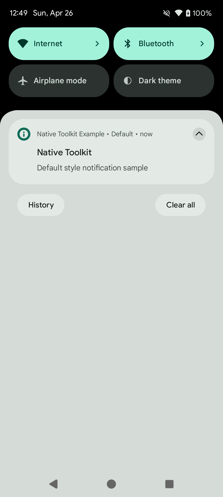
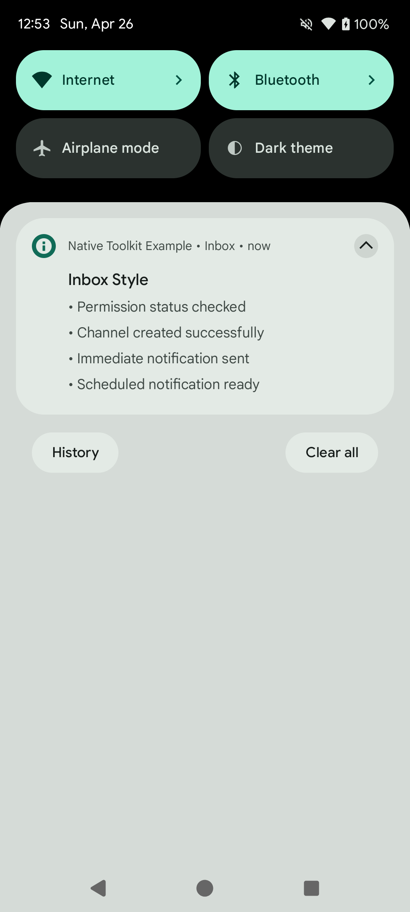
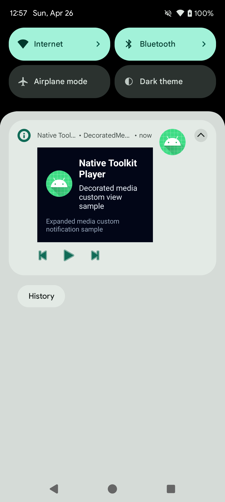
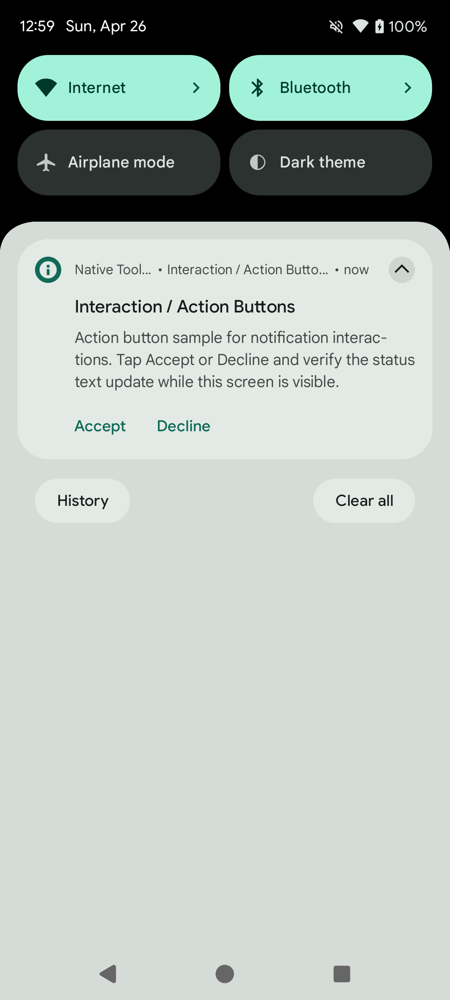
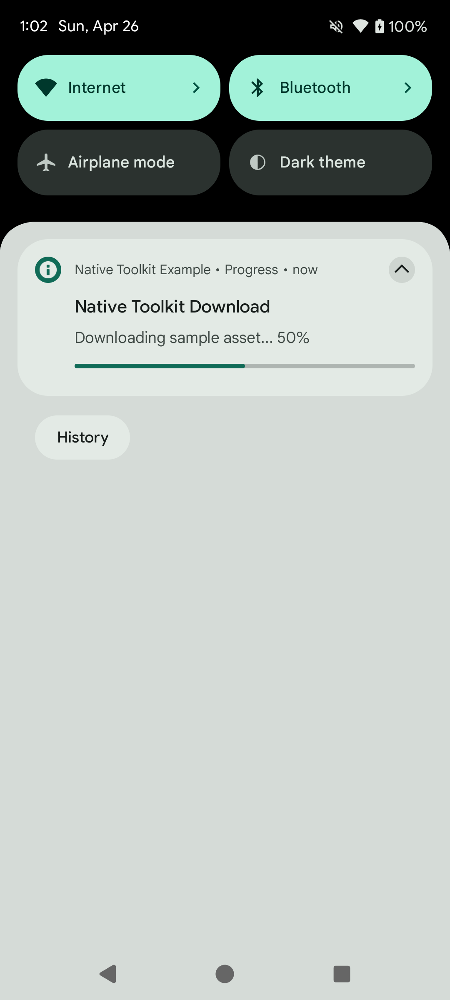

# 通知機能

言語:

- 日本語（このページ）
- English: [notification.md](notification.md)
- 한국어: [notification.ko.md](notification.ko.md)

← [マニュアルトップに戻る](index.ja.md)

---

## 目次

- [Android](#android)
  - [セットアップ](#セットアップ)
  - [パーミッション](#パーミッション)
  - [チャンネル管理](#チャンネル管理)
  - [基本的な通知操作](#基本的な通知操作)
  - [通知スタイル](#通知スタイル)
  - [プラットフォームオプション](#プラットフォームオプション)
  - [カスタムビュースタイル](#カスタムビュースタイル)
  - [グループ通知](#グループ通知)
  - [インタラクション](#インタラクション)
  - [進捗通知](#進捗通知)
  - [フォアグラウンドサービス通知](#フォアグラウンドサービス通知)
  - [スケジュール通知](#スケジュール通知)
- [iOS](#ios)
- [Windows](#windows)
- [macOS](#macos)

---

## Android

### セットアップ

#### AndroidManifest.xml

使用する機能に応じてパーミッションを追加します。

```xml
<!-- Android 13以降で通知を送信するために必要 -->
<uses-permission android:name="android.permission.POST_NOTIFICATIONS" />

<!-- スケジュール通知（正確なアラーム）を使用する場合 -->
<uses-permission android:name="android.permission.SCHEDULE_EXACT_ALARM" />
<uses-permission android:name="android.permission.RECEIVE_BOOT_COMPLETED" />

<!-- フォアグラウンドサービスを使用する場合 -->
<uses-permission android:name="android.permission.FOREGROUND_SERVICE" />
<uses-permission android:name="android.permission.FOREGROUND_SERVICE_DATA_SYNC" />
```

#### NotificationUseCases の初期化

```kotlin
import android.library.notification.data.repository.NotificationUseCases

val useCases = NotificationUseCases(context)
```

---

### パーミッション

```kotlin
import android.library.notification.presentation.permission.NotificationPermissionHelper

val permissionHelper = NotificationPermissionHelper(activity)

// 通知パーミッションが許可されているか（Android 13以降）
val hasPermission: Boolean = permissionHelper.hasPermission()

// アプリの通知が有効か
val enabled: Boolean = permissionHelper.areNotificationsEnabled()

// 正確なアラームが許可されているか
val canSchedule: Boolean = permissionHelper.canScheduleExactAlarms()

// パーミッションをリクエストする
permissionHelper.requestPermission { granted ->
    if (granted) { /* 許可された */ }
}

// 設定画面を開く
permissionHelper.openNotificationSettings()
permissionHelper.openExactAlarmSettings()
```

---

### チャンネル管理

通知を送信する前にチャンネルを作成する必要があります。

```kotlin
import android.library.notification.domain.model.NotificationChannel

val channel = NotificationChannel(
    id = "my_channel",
    name = "My Channel",
    description = "Sample notification channel"
)

// 作成
useCases.createChannel(channel)
    .onSuccess { /* 完了 */ }
    .onFailure { /* エラー処理 */ }

// 複数まとめて作成
useCases.createChannels(listOf(channel1, channel2))

// 削除
useCases.deleteChannel("my_channel")
```

---

### 基本的な通知操作

#### 表示

```kotlin
import android.library.notification.application.model.AndroidNotificationCommand
import android.library.notification.domain.model.NotificationContent

val command = AndroidNotificationCommand(
    content = NotificationContent(
        id = 1001,
        title = "タイトル",
        message = "本文",
        channel = channel
    )
)

useCases.show(command)
    .onSuccess { /* 表示完了 */ }
    .onFailure { /* エラー処理 */ }
```

#### 更新

同じ `id` / `tag` を指定することで表示中の通知を上書き更新します。

```kotlin
useCases.update(updatedCommand)
```

#### キャンセル

```kotlin
// 特定の通知をキャンセル
useCases.cancel(id = 1001)
useCases.cancel(id = 1001, tag = "my_tag")

// すべてキャンセル
useCases.cancelAll()
```

#### アクティブな通知の取得

現在表示中の通知一覧を取得します（Android 6.0以降）。

```kotlin
val activeList: List<ActiveNotification> = useCases.getActive()
activeList.forEach { it.id; it.title }
```

---

### 通知スタイル

`NotificationContent` の `style` プロパティに指定します。

#### Default（デフォルト）

```kotlin
style = NotificationStyle.Default
```

<p align="center">
    
</p>

#### BigText

展開すると長いテキストを表示します。

```kotlin
style = NotificationStyle.BigText(
    bigText = "展開後に表示される長い本文テキスト",
    summaryText = "サマリー",
    bigContentTitle = "展開時のタイトル"
)
```

<p align="center">
    
</p>

#### Inbox

展開すると複数行をリスト形式で表示します。

```kotlin
style = NotificationStyle.Inbox(
    lines = listOf("• 項目 1", "• 項目 2", "• 項目 3"),
    summaryText = "3 件",
    bigContentTitle = "展開時のタイトル"
)
```

<p align="center">
    
</p>

#### BigPicture

展開すると画像を表示します。

```kotlin
style = NotificationStyle.BigPicture(
    pictureResId = R.drawable.my_image,  // またはURIで指定: pictureUriString
    summaryText = "画像の説明",
    bigContentTitle = "展開時のタイトル"
)
```

<p align="center">
    
</p>

#### Messaging

チャット履歴形式で表示します。

```kotlin
import android.library.notification.domain.model.NotificationMessage

val now = System.currentTimeMillis()

style = NotificationStyle.Messaging(
    userDisplayName = "自分",
    conversationTitle = "グループ名",
    isGroupConversation = true,
    messages = listOf(
        NotificationMessage(
            text = "メッセージ本文",
            timestampMillis = now - 60_000L,
            senderName = "Alice"          // null = 自分のメッセージ
        )
    )
)
```

<p align="center">
    
</p>

#### Media

メディアプレイヤー形式で表示します。コンパクト表示時に見せるアクションボタンのインデックスを指定します。

```kotlin
style = NotificationStyle.Media(
    compactActionIndices = listOf(0, 1, 2)  // 最大3つ
)
```

<p align="center">
    
</p>

アクションボタンは `AndroidNotificationPlatformOptions.actions` に設定します（[プラットフォームオプション](#プラットフォームオプション) 参照）。

---

### プラットフォームオプション

`AndroidNotificationPlatformOptions` で Android 固有の動作を設定します。

```kotlin
import android.library.notification.application.model.AndroidNotificationPlatformOptions
import android.library.notification.application.model.AndroidPendingIntentRequest
import android.library.notification.application.model.AndroidNotificationAction

val command = AndroidNotificationCommand(
    content = NotificationContent( /* ... */ ),
    platformOptions = AndroidNotificationPlatformOptions(
        // 通知タップ時に起動するIntent
        contentIntent = AndroidPendingIntentRequest(
            intent = Intent(context, MainActivity::class.java),
            requestCode = 1000
        ),
        // 通知を削除（スワイプ）したときのIntent
        deleteIntent = AndroidPendingIntentRequest(
            intent = Intent(context, MyReceiver::class.java),
            requestCode = 1001,
            type = AndroidPendingIntentType.BROADCAST
        ),
        // フルスクリーン表示用Intent（端末ロック中など）
        fullScreenIntent = AndroidPendingIntentRequest(
            intent = Intent(context, FullScreenActivity::class.java),
            requestCode = 1002,
            type = AndroidPendingIntentType.ACTIVITY
        ),
        // アクションボタン
        actions = listOf(
            AndroidNotificationAction(
                title = "承認",
                pendingIntent = AndroidPendingIntentRequest(
                    intent = Intent(context, ActionReceiver::class.java).apply {
                        action = "ACTION_ACCEPT"
                    },
                    requestCode = 2000,
                    type = AndroidPendingIntentType.BROADCAST
                ),
                iconResId = android.R.drawable.ic_menu_call
            )
        )
    )
)
```

---

### カスタムビュースタイル

独自レイアウトで通知を表示します。`RemoteViewAction` を使ってビューの内容とクリックイベントを設定します。

#### DecoratedCustomView

```kotlin
import android.library.notification.application.model.AndroidNotificationCustomViewPlatformOptions
import android.library.notification.application.model.RemoteViewAction
import android.library.notification.domain.model.NotificationCustomViewStyleData

val command = AndroidNotificationCommand(
    content = NotificationContent(
        id = 1007,
        title = "タイトル",
        message = "本文",
        channel = channel,
        style = NotificationStyle.DecoratedCustomView(
            customView = NotificationCustomViewStyleData(
                layoutResId = R.layout.notification_custom,       // 通常表示
                bigLayoutResId = R.layout.notification_custom_big // 展開表示（省略可）
            )
        )
    ),
    platformOptions = AndroidNotificationPlatformOptions(
        customViewOptions = AndroidNotificationCustomViewPlatformOptions(
            viewActions = listOf(
                // テキストをセット
                RemoteViewAction.SetText(R.id.notification_title, "カスタムタイトル"),
                RemoteViewAction.SetText(R.id.notification_message, "カスタム本文"),
                // 画像をセット
                RemoteViewAction.SetImage(R.id.notification_icon, R.mipmap.ic_launcher),
                // ボタンにクリックイベントをセット
                RemoteViewAction.SetClickIntent(
                    viewId = R.id.notification_btn_dismiss,
                    pendingIntent = AndroidPendingIntentRequest(
                        intent = Intent(context, ActionReceiver::class.java).apply {
                            action = "ACTION_DISMISS"
                        },
                        requestCode = 2100,
                        type = AndroidPendingIntentType.BROADCAST
                    )
                )
            )
        )
    )
)

useCases.show(command)
```

<p align="center">
    
</p>

> **注意:** `RemoteViews` の制約上、ボタンには `Button` クラスではなく `LinearLayout` + `TextView` を使用してください。クリックイベントは `setOnClickPendingIntent` で設定されます。

#### DecoratedMediaCustomView

Media スタイルと組み合わせてカスタムビューを表示します。

```kotlin
style = NotificationStyle.DecoratedMediaCustomView(
    customView = NotificationCustomViewStyleData(
        layoutResId = R.layout.notification_media_custom
    ),
    compactActionIndices = listOf(0, 1, 2)
)
```

<p align="center">
    
</p>

`customViewOptions` の使い方は `DecoratedCustomView` と同じです。

---

### グループ通知

複数の通知をグループにまとめて表示します。

```kotlin
val GROUP_KEY = "my_group_key"

// 子通知 1
val child1 = AndroidNotificationCommand(
    content = NotificationContent(
        id = 1101,
        title = "通知 1",
        message = "グループ子通知 #1",
        channel = channel,
        groupKey = GROUP_KEY,
        groupAlertBehavior = NotificationCompat.GROUP_ALERT_SUMMARY,
        sortKey = "01"
    )
)

// 子通知 2
val child2 = AndroidNotificationCommand(
    content = NotificationContent(
        id = 1102,
        title = "通知 2",
        message = "グループ子通知 #2",
        channel = channel,
        groupKey = GROUP_KEY,
        groupAlertBehavior = NotificationCompat.GROUP_ALERT_SUMMARY,
        sortKey = "02"
    )
)

// サマリー通知（グループヘッダー）
val summary = AndroidNotificationCommand(
    content = NotificationContent(
        id = 1100,
        title = "グループサマリー",
        message = "2 件の通知",
        channel = channel,
        groupKey = GROUP_KEY,
        isGroupSummary = true,
        groupAlertBehavior = NotificationCompat.GROUP_ALERT_SUMMARY,
        sortKey = "00"
    )
)

useCases.show(child1)
useCases.show(child2)
useCases.show(summary)
```

<p align="center">
    
</p>

> **ポイント:** `groupAlertBehavior = GROUP_ALERT_SUMMARY` に設定すると、サマリーのみが音・バイブを鳴らし、子通知はサイレントになります。

---

### インタラクション

#### アクションボタン（BroadcastReceiver）

通知にボタンを追加し、タップを BroadcastReceiver で受け取ります。

```kotlin
class NotificationActionReceiver : BroadcastReceiver() {
    override fun onReceive(context: Context, intent: Intent?) {
        val actionId = intent?.getStringExtra("extra_action_id") ?: return
        // アクションの処理
    }
}
```

```kotlin
// アクションボタン付き通知
platformOptions = AndroidNotificationPlatformOptions(
    actions = listOf(
        AndroidNotificationAction(
            title = "承認",
            pendingIntent = AndroidPendingIntentRequest(
                intent = Intent(context, NotificationActionReceiver::class.java).apply {
                    putExtra("extra_action_id", "accept")
                },
                requestCode = 5000,
                type = AndroidPendingIntentType.BROADCAST
            )
        ),
        AndroidNotificationAction(
            title = "拒否",
            pendingIntent = AndroidPendingIntentRequest(
                intent = Intent(context, NotificationActionReceiver::class.java).apply {
                    putExtra("extra_action_id", "decline")
                },
                requestCode = 5001,
                type = AndroidPendingIntentType.BROADCAST
            )
        )
    )
)
```

<p align="center">
    
</p>

#### DeleteIntent（削除イベント）

通知をスワイプで削除したときのコールバックです。

```kotlin
platformOptions = AndroidNotificationPlatformOptions(
    deleteIntent = AndroidPendingIntentRequest(
        intent = Intent(context, NotificationDeleteReceiver::class.java).apply {
            action = "ACTION_NOTIFICATION_DELETED"
        },
        requestCode = 5100,
        type = AndroidPendingIntentType.BROADCAST
    )
)
```

#### FullScreenIntent（フルスクリーン）

端末ロック中や画面オフ時に全画面で起動します（アラーム・着信通知など）。

```kotlin
// 高優先度チャンネルと category の設定が必要
val content = NotificationContent(
    id = 1111,
    title = "アラーム",
    message = "起床時刻です",
    channel = highPriorityChannel,
    category = NotificationCompat.CATEGORY_ALARM,
    priority = NotificationCompat.PRIORITY_HIGH
)

platformOptions = AndroidNotificationPlatformOptions(
    fullScreenIntent = AndroidPendingIntentRequest(
        intent = Intent(context, AlarmActivity::class.java),
        requestCode = 5200,
        type = AndroidPendingIntentType.ACTIVITY,
        mutable = true
    )
)
```

<p align="center">
    
</p>

> **注意:** 端末の状態・Android ポリシーによっては、フルスクリーンではなく heads-up 通知として表示される場合があります。

---

### 進捗通知

ダウンロードや処理の進捗をプログレスバーで表示します。

```kotlin
import android.library.notification.domain.model.NotificationProgress

// 進捗バー（確定）
val command = AndroidNotificationCommand(
    content = NotificationContent(
        id = 1009,
        title = "ダウンロード中",
        message = "50% 完了",
        channel = channel,
        ongoing = true,
        autoCancel = false,
        progress = NotificationProgress(
            max = 100,
            current = 50,
            indeterminate = false
        )
    )
)

useCases.show(command)

// 不定長プログレスバー
val indeterminate = NotificationProgress(max = 0, current = 0, indeterminate = true)

// 完了時（バーを非表示にして通常通知に戻す）
val complete = NotificationContent(
    id = 1009,
    ongoing = false,
    autoCancel = true,
    progress = NotificationProgress(max = 100, current = 100, indeterminate = false),
    /* ... */
)
```

<p align="center">
    
</p>

---

### フォアグラウンドサービス通知

#### Progress FGS（長時間バックグラウンド処理）

`ProgressForegroundNotifications` を使ってフォアグラウンドサービスと連携した進捗通知を表示します。

```kotlin
import android.library.notification.presentation.progress.ProgressForegroundNotifications

// フォアグラウンドサービスを開始（通知表示も兼ねる）
ProgressForegroundNotifications.start(context, progressCommand)

// 進捗を更新
ProgressForegroundNotifications.update(context, updatedProgressCommand)

// 完了（サービスを停止して通常通知に降格）
ProgressForegroundNotifications.complete(context, completionCommand)

// 強制停止（通知も削除）
ProgressForegroundNotifications.stop(context)
```

<p align="center">
    
</p>

`AndroidManifest.xml` にサービスを宣言します。

```xml
<service
    android:name="android.library.notification.presentation.progress.ProgressForegroundService"
    android:foregroundServiceType="dataSync"
    android:exported="false" />
```

#### Call Style FGS（通話スタイル）

着信・通話中・スクリーニングの CallStyle 通知をフォアグラウンドサービスで表示します。

```kotlin
import android.library.notification.presentation.call.CallStyleForegroundService
import androidx.core.content.ContextCompat

// 着信通知を開始
ContextCompat.startForegroundService(
    context,
    CallStyleForegroundService.createIncomingStartIntent(context)
)

// 通話中通知に切り替え
ContextCompat.startForegroundService(
    context,
    CallStyleForegroundService.createOngoingStartIntent(context)
)

// 停止
context.startService(CallStyleForegroundService.createStopIntent(context))
```

<p align="center">
    
</p>

`AndroidManifest.xml` にサービスを宣言します。

```xml
<service
    android:name="android.library.notification.presentation.call.CallStyleForegroundService"
    android:foregroundServiceType="specialUse"
    android:exported="false">
    <property
        android:name="android.app.PROPERTY_SPECIAL_USE_FGS_SUBTYPE"
        android:value="call" />
</service>
```

---

### スケジュール通知

指定した時刻に通知を自動表示します。

```kotlin
import android.library.notification.domain.model.NotificationSchedule

val schedule = NotificationSchedule(
    triggerAtMillis = System.currentTimeMillis() + 15_000L, // 15秒後
    exact = true,           // 正確なアラーム（SCHEDULE_EXACT_ALARM が必要）
    allowWhileIdle = true,  // Doze モード中も起動
    persistAcrossBoot = true // 端末再起動後も復元
)

useCases.schedule(command, schedule)
    .onSuccess { /* スケジュール完了 */ }
    .onFailure { /* エラー処理 */ }
```

<p align="center">
    
</p>

#### スケジュールのキャンセル

```kotlin
useCases.cancelScheduled(id = 1010)
useCases.cancelAllScheduled()
```

#### 端末再起動後の復元

`RECEIVE_BOOT_COMPLETED` を使って再起動後にスケジュールを復元します。

```kotlin
// BroadcastReceiver の onReceive 内で呼び出す
useCases.restoreScheduled()
```

`AndroidManifest.xml` に Receiver を宣言します。

```xml
<receiver
    android:name="android.library.notification.data.repository.ScheduledNotificationBootReceiver"
    android:exported="false">
    <intent-filter>
        <action android:name="android.intent.action.BOOT_COMPLETED" />
        <action android:name="android.intent.action.LOCKED_BOOT_COMPLETED" />
        <action android:name="android.intent.action.MY_PACKAGE_REPLACED" />
    </intent-filter>
</receiver>
```

#### スケジュール済み確認

```kotlin
val isScheduled: Boolean = useCases.isScheduled(context, id = 1010)
```

---

## iOS

（準備中）

---

## Windows

（準備中）

---

## macOS

（準備中）
