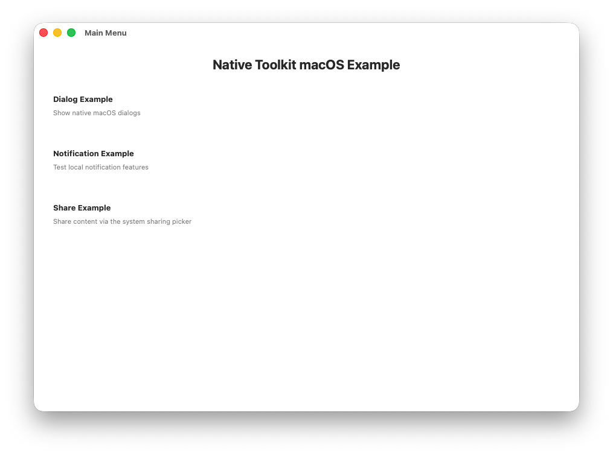

# native-toolkit 매뉴얼

언어:

- 한국어(이 페이지)
- 영어: [index.md](index.md)
- 일본어: [index.ja.md](index.ja.md)

이 디렉터리의 Markdown 파일은 버전 문서로 `docs/<version>/manual/`에 게시됩니다.

# 이 매뉴얼의 목적

- 자동 생성 문서(Dokka / DocC / Doxygen)만으로는 다루기 어려운 도입 절차와 실무 운영 포인트를 정리합니다.
- 수기 문서를 생성 산출물(`docs/`)과 분리해 publish 시 덮어쓰이지 않도록 합니다.

# 이 페이지에서 확인할 수 있는 내용

- 설치 / 도입
- 플랫폼별 설정
  - Android (Gradle)
  - iOS (Xcode)
  - Windows (Visual Studio)
  - macOS (Xcode)
- API 사용 예시

# 자동 생성 문서(API 레퍼런스)

- Android: `docs/<version>/android/`
- iOS: `docs/<version>/ios/`
- Windows: `docs/<version>/windows/`
- macOS: `docs/<version>/mac/`

# 배포 산출물 위치 (`dist/<version>/`)

- Android: `dist/1.10.0/android/android-native-toolkit-1.3.0.aar`
- iOS: `dist/1.10.0/ios/ios-native-toolkit-1.3.0.xcframework`
- Windows: `dist/1.10.0/windows/windows-native-toolkit-1.1.0.nupkg`
- macOS: `dist/1.10.0/mac/mac-native-toolkit-1.3.0.xcframework`

# Native Toolkit

- native-toolkit은 각 플랫폼의 네이티브 기능을 통합적으로 사용하기 위한 툴킷입니다.
- 패키지에는 Android / iOS / Windows / macOS용 네이티브 플러그인과 샘플이 포함되며, 각 플랫폼의 네이티브 기능을 싱글톤 API로 사용할 수 있습니다.

# 버전

## 1.10.0

# 지원 OS 버전

- Android 12+
- iOS 18+
- Windows 11+
- macOS 15+

# 기능 목록

## Android

- 다이얼로그 기능
  - 기본 다이얼로그
  - 확인 다이얼로그
  - 단일 선택 다이얼로그
  - 다중 선택 다이얼로그
  - 입력 다이얼로그
  - 로그인 다이얼로그
- 알림 기능
  - 알림 표시 / 업데이트 / 취소
  - 알림 채널 관리
  - 예약 알림
- 공유 기능
  - 텍스트 / URL 공유
  - 이미지 공유
  - 파일 공유
  - 리치 프리뷰
  - 커스텀 Chooser Action (Android 14+)
  - Direct Share Target
  - 콜백 포함 공유
  - 수신 공유 콘텐츠 처리
- 클립보드 기능
  - 복사 (일반 텍스트, HTML, URI, 여러 텍스트)
  - 민감 정보 복사 (미리보기 억제, Android 13+)
  - 읽기 / 데이터 존재 확인 / 메타데이터 확인
  - 지우기
  - 클립보드 변경 감시

## iOS

- 다이얼로그 기능
  - 기본 다이얼로그
  - 확인 다이얼로그
  - 파괴적 다이얼로그
  - 액션 시트
  - 입력 다이얼로그
  - 로그인 다이얼로그
- 알림 기능
  - 권한
  - 알림 표시 / 업데이트 / 취소
  - 예약 알림
  - 첨부 파일 포함 알림
  - 배지
  - 카테고리 및 액션
- 공유 기능
  - 텍스트 / URL 공유
  - 리치 프리뷰
  - 이미지 / 파일 공유 (단일 및 여러 개)
  - 결합 콘텐츠 (제목, 액티비티 타입 제외)
- 클립보드 기능
  - 복사 (일반 텍스트, HTML, URL, 이미지 파일 / 데이터, 색상, 커스텀 데이터, 여러 텍스트, 다중 표현)
  - 복사 옵션 (localOnly, 만료 시각)
  - 추가
  - 읽기 / 데이터 읽기 / 메타데이터 스냅샷
  - 이름 있는 / 고유 페이스트보드 수명 주기
  - 비동기 로드 (텍스트 / URL / 이미지 / 파일)
  - 패턴 감지 (11종)
  - 클립보드 변경 감시
  - 시스템 붙여넣기 버튼 (UIPasteControl)

## Windows

- 다이얼로그 기능
  - 기본 다이얼로그
  - 파일 선택 다이얼로그
  - 다중 파일 선택 다이얼로그
  - 폴더 선택 다이얼로그
  - 다중 폴더 선택 다이얼로그
  - 파일 저장 다이얼로그
- 알림 기능
  - 알림 표시 / 업데이트 / 취소
  - 예약 알림
  - 진행 알림
  - 배지 (패키지 앱)
  - 액션 버튼 및 텍스트 입력

## Mac

- 다이얼로그 기능
  - 기본 다이얼로그
  - 파일 선택 다이얼로그
  - 다중 파일 선택 다이얼로그
  - 폴더 선택 다이얼로그
  - 다중 폴더 선택 다이얼로그
  - 파일 저장 다이얼로그
- 알림 기능
  - 권한
  - 알림 표시 / 업데이트 / 취소
  - 예약 알림
  - 배지
  - 카테고리 및 액션
- Share 기능
  - 피커를 통한 텍스트 / URL / 이미지 / 파일 공유(단일 및 다중)
  - 피커에서 서비스 제외
  - 개별 서비스 직접 실행(recipients, subject)
  - 서비스 실행 가능 여부 확인
- 클립보드 기능
  - 복사 (텍스트, URL, 이미지, 여러 항목, 다중 표현)
  - 복사 옵션 (localOnly, 기본값 활성)
  - 추가
  - 읽기 / 데이터 읽기 / 타입으로 걸러낸 스냅샷
  - 이름 있는 / 고유 페이스트보드 수명 주기
  - 감지 (패턴, 값, 메타데이터. macOS 15.4 이상)
  - 클립보드 변경 감시
  - 시스템 붙여넣기 버튼 (PasteButton)
  - 지우기

## 추가 예정 기능

- Windows용 클립보드 연동 (Android / iOS / macOS는 지원됨. 위 "기능 목록" 참고)

## 샘플

- Android 샘플
  - Android Studio를 설치합니다.
    - <a href="https://developer.android.com/studio" target="_blank" rel="noopener noreferrer">참고 사이트</a>
  - Android Studio를 실행합니다.
  - "File" → "Open..."를 선택합니다.
  - `native-toolkit/android/AndroidLibraryExample`를 선택하고 "Open" 버튼을 클릭합니다.
  - Android 기기를 연결합니다.
  - "Run" 버튼을 클릭해 샘플 앱을 설치합니다.
    <p align="center">
        
    </p>

- iOS 샘플
  - Xcode를 설치합니다.
    - <a href="https://developer.apple.com/xcode" target="_blank" rel="noopener noreferrer">참고 사이트</a>
  - Xcode를 실행합니다.
  - "Open Existing Project..."를 선택합니다.
  - `native-toolkit/ios/IosWorkspace.xcworkspace`를 선택하고 "Open" 버튼을 클릭합니다.
  - "Run" 버튼을 클릭해 샘플 앱을 설치합니다.
    <p align="center">
        
    </p>

- Windows 샘플
  - Visual Studio 2022를 설치합니다.
    - <a href="https://visualstudio.microsoft.com/vs/" target="_blank" rel="noopener noreferrer">참고 사이트</a>
  - Visual Studio 2022를 실행합니다.
  - "Open a project or solution"을 선택합니다.
  - `native-toolkit\windows\WindowsLibraryExample\WindowsLibraryExample.sln`을 선택하고 "Open" 버튼을 클릭합니다.
  - "Debug" → "Start Debugging"을 선택해 샘플 앱을 설치합니다.
    <p align="center">
        
    </p>

- Mac 샘플
  - Xcode를 설치합니다.
    - <a href="https://developer.apple.com/xcode" target="_blank" rel="noopener noreferrer">참고 사이트</a>
  - Xcode를 실행합니다.
  - "Open Existing Project..."를 선택합니다.
  - `native-toolkit/mac/MacWorkspace.xcworkspace`를 선택하고 "Open" 버튼을 클릭합니다.
  - "Run" 버튼을 클릭해 샘플 앱을 설치합니다.
    <p align="center">
        
    </p>

## 라이브러리 통합 방법

### Android

#### 지원 플랫폼: Android（AAR / ABI 독립）

1. `android-native-toolkit-1.3.0.aar`를 `app/libs`에 배치합니다.
2. `settings.gradle.kts`에 AAR 참조를 위한 저장소 설정을 추가합니다.
3. `app/build.gradle.kts`에 AAR 참조를 위한 의존성을 추가합니다.
4. Gradle 동기화를 실행합니다.
5. 빌드가 정상 동작하는지 확인합니다.
   아래 설정을 추가하세요.

**settings.gradle.kts:**

```gradle

dependencyResolutionManagement {
    repositoriesMode.set(RepositoriesMode.FAIL_ON_PROJECT_REPOS)
    repositories {
        google()
        mavenCentral()

        // 로컬 AAR 파일 참조를 위해 아래 설정을 추가합니다.
        flatDir {
            dirs("app/libs")
        }
    }
}
```

**app/build.gradle.kts:**

```gradle

dependencies {
    // AAR 참조를 위해 아래 의존성을 추가합니다.
  implementation(files("libs/android-native-toolkit-1.3.0.aar"))
}
```

### iOS

#### 지원 플랫폼: iOS（실기기: arm64 / Simulator: arm64, x86_64）

1. `ios-native-toolkit-1.3.0.xcframework`를 Xcode 프로젝트 하위 `Frameworks` 폴더(없으면 생성)에 복사합니다.
2. Xcode 26.2에서 프로젝트를 열고 **Project Navigator**에서 앱 타깃을 선택합니다.
3. **General** 탭에서 **Frameworks, Libraries, and Embedded Content**의 **+**를 클릭합니다.
4. **Add Other...** → **Add Files...**를 선택하고 `Frameworks/ios-native-toolkit-1.3.0.xcframework`를 추가합니다.
5. `ios-native-toolkit-1.3.0.xcframework`의 Embed 설정을 **Embed & Sign**으로 지정합니다.
6. 같은 타깃의 **Build Settings**에서 `Framework Search Paths`에 `$(PROJECT_DIR)/Frameworks`를 추가합니다. (일반적으로 non-recursive)
7. **Signing & Capabilities**에서 Team 설정이 올바른지 확인합니다.
8. **Product** → **Clean Build Folder**를 실행한 뒤 **Run**으로 빌드/실행합니다.
9. 오류 없이 실행되면 통합이 완료된 것입니다.

### Windows

#### 지원 플랫폼: Windows x64（win-x64）

1. `windows-native-toolkit-1.1.0.nupkg`를 `C:\packages`에 복사합니다.
2. Visual Studio 2022에서 **Tools** → **Options** → **NuGet Package Manager** → **Package Sources**를 엽니다.
3. **+**를 눌러 다음을 입력합니다.
   - Name: LocalPackages
   - Source: C:\packages
     입력 후 **Update**를 눌러 저장합니다.
4. 대상 솔루션을 엽니다.
5. **Solution Explorer**에서 프로젝트를 우클릭하고 **Manage NuGet Packages**를 선택합니다.
6. **Package source**를 **LocalPackages**로 변경합니다.
7. **NativeToolkit**을 검색해 **Install**을 클릭합니다.
8. 라이선스 확인 창이 나오면 동의하여 설치를 완료합니다.

### macOS

#### 지원 플랫폼: macOS arm64, x86_64

1. `mac-native-toolkit-1.3.0.xcframework`를 Xcode 프로젝트 하위 `Frameworks` 폴더(없으면 생성)에 복사합니다.
2. Xcode 26.2에서 프로젝트를 열고 Project Navigator에서 앱 타깃을 선택합니다.
3. **General** 탭에서 **Frameworks, Libraries, and Embedded Content**의 `+`를 클릭합니다.
4. "Add Other..." → "Add Files..."를 선택하고 `Frameworks/mac-native-toolkit-1.3.0.xcframework`를 추가합니다.
5. `mac-native-toolkit-1.3.0.xcframework`의 Embed 설정을 **Embed & Sign**으로 지정합니다.
6. 같은 타깃의 **Build Settings**에서 `Framework Search Paths`에 `$(PROJECT_DIR)/Frameworks`를 추가합니다. (일반적으로 non-recursive)
7. **Signing & Capabilities**에서 Team 설정이 올바른지 확인합니다.
8. **Product** → **Clean Build Folder**를 실행한 뒤 **Run**으로 빌드/실행합니다.
9. 오류 없이 실행되면 통합이 완료된 것입니다.

# API 사용 방법

- [다이얼로그 기능](dialog.ko.md)
- [알림 기능](notification.ko.md)
- [공유 기능](share.ko.md)
- [클립보드 기능](clipboard.ko.md)
