# Notification Feature

Language:

- 日本語: [notification.ja.md](notification.ja.md)
- English (this page)
- 한국어: [notification.ko.md](notification.ko.md)

← [Back to Manual Top](index.md)

---

## Table of Contents

- [Android](#android)
  - [Setup](#setup)
  - [Permission](#permission)
  - [Channel Management](#channel-management)
  - [Basic Notification Operations](#basic-notification-operations)
  - [Notification Styles](#notification-styles)
  - [Platform Options](#platform-options)
  - [Custom View Styles](#custom-view-styles)
  - [Group Notifications](#group-notifications)
  - [Interaction](#interaction)
  - [Progress Notifications](#progress-notifications)
  - [Foreground Service Notifications](#foreground-service-notifications)
  - [Scheduled Notifications](#scheduled-notifications)
- [iOS](#ios)
  - [IosNotificationManager](#iosnotificationmanager)
  - [Setup](#setup-1)
  - [Permission](#permission-1)
    - [Request Notification Permission](#request-notification-permission)
    - [Check Permission](#check-permission)
    - [Get Authorization Status](#get-authorization-status)
    - [Open Notification Settings](#open-notification-settings)
  - [Show Notification](#show-notification)
    - [Immediate](#immediate)
    - [Immediate with Attachment](#immediate-with-attachment)
    - [Time Interval Trigger](#time-interval-trigger)
    - [Calendar Trigger](#calendar-trigger)
    - [Location Trigger](#location-trigger)
  - [Attachment](#attachment)
  - [Update Notification](#update-notification)
  - [Cancel / Remove Notification](#cancel--remove-notification)
  - [Scheduled Notifications](#scheduled-notifications-1)
    - [Cancel Scheduled](#cancel-scheduled)
  - [Query](#query)
  - [Badge](#badge)
  - [Categories and Actions](#categories-and-actions)
    - [Register Category](#register-category)
    - [Attach Category to Notification](#attach-category-to-notification)
    - [Remove Category](#remove-category)
    - [Action Received Callbacks](#action-received-callbacks)
- [Windows](#windows)
  - [WindowsNotificationManager](#windowsnotificationmanager)
  - [Setup](#setup-2)
    - [Package.appxmanifest (Packaged apps)](#packageappxmanifest-packaged-apps)
    - [Initialize](#initialize)
  - [Init / Setting](#init--setting)
    - [Get Notification Setting](#get-notification-setting)
    - [Open Notification Settings](#open-notification-settings-2)
  - [Show Notification](#show-notification-3)
    - [Basic](#basic)
    - [With Buttons](#with-buttons)
    - [With Image](#with-image)
    - [With Input](#with-input)
    - [With Progress](#with-progress)
    - [With Expiration](#with-expiration)
    - [With Audio](#with-audio)
  - [Schedule Notification](#schedule-notification)
    - [Cancel Scheduled](#cancel-scheduled)
  - [Update Progress](#update-progress)
  - [Badge](#badge-2)
  - [Remove / Query](#remove--query)
    - [Get All Notifications](#get-all-notifications)
    - [Remove by ID](#remove-by-id)
    - [Remove by Tag](#remove-by-tag)
    - [Remove All](#remove-all)
  - [Callback](#callback)
  - [Error Codes](#error-codes-1)
- [macOS](#macos)
  - [MacNotificationManager](#macnotificationmanager)
  - [Setup](#setup-2)
  - [Permission](#permission-2)
    - [Request Permission](#request-permission)
    - [Check Permission](#check-permission-1)
    - [Get Authorization Status](#get-authorization-status-1)
    - [Open Notification Settings](#open-notification-settings-1)
    - [Reset Notification Permission (macOS 26.3)](#reset-notification-permission-macos-263)
  - [Show Notification](#show-notification-2)
    - [Immediate](#immediate-1)
    - [Time Interval Trigger](#time-interval-trigger-1)
    - [Calendar Trigger](#calendar-trigger-1)
  - [Update / Cancel / Remove](#update--cancel--remove)
    - [Update by ID](#update-by-id)
    - [Cancel by ID](#cancel-by-id)
    - [Cancel All](#cancel-all)
    - [Remove Delivered by ID](#remove-delivered-by-id)
    - [Remove All Delivered](#remove-all-delivered)
  - [Schedule](#schedule)
    - [Schedule with Time Interval](#schedule-with-time-interval)
    - [Schedule with Calendar](#schedule-with-calendar)
    - [Cancel Scheduled by ID](#cancel-scheduled-by-id)
    - [Cancel All Scheduled](#cancel-all-scheduled)
  - [Query](#query-1)
    - [Get Scheduled](#get-scheduled)
    - [Get Delivered](#get-delivered)
  - [Badge](#badge-1)
  - [Category](#category)
    - [Register Category](#register-category-1)
    - [Remove Category](#remove-category-1)
  - [Error Codes](#error-codes)

---

## Android

### Setup

#### AndroidManifest.xml

Add the permissions required for the features you use.

```xml
<!-- Required to post notifications on Android 13 and above -->
<uses-permission android:name="android.permission.POST_NOTIFICATIONS" />

<!-- Required for scheduled notifications (exact alarms) -->
<uses-permission android:name="android.permission.SCHEDULE_EXACT_ALARM" />
<uses-permission android:name="android.permission.RECEIVE_BOOT_COMPLETED" />

<!-- Required for foreground services -->
<uses-permission android:name="android.permission.FOREGROUND_SERVICE" />
<uses-permission android:name="android.permission.FOREGROUND_SERVICE_DATA_SYNC" />
```

#### Initializing NotificationUseCases

```kotlin
import android.library.notification.data.repository.NotificationUseCases

val useCases = NotificationUseCases(context)
```

---

### Permission

```kotlin
import android.library.notification.presentation.permission.NotificationPermissionHelper

val permissionHelper = NotificationPermissionHelper(activity)

// Whether notification permission is granted (Android 13 and above)
val hasPermission: Boolean = permissionHelper.hasPermission()

// Whether app notifications are enabled
val enabled: Boolean = permissionHelper.areNotificationsEnabled()

// Whether exact alarm scheduling is permitted
val canSchedule: Boolean = permissionHelper.canScheduleExactAlarms()

// Request notification permission
permissionHelper.requestPermission { granted ->
    if (granted) { /* permission granted */ }
}

// Open settings screens
permissionHelper.openNotificationSettings()
permissionHelper.openExactAlarmSettings()
```

---

### Channel Management

A notification channel must be created before posting notifications.

```kotlin
import android.library.notification.domain.model.NotificationChannel

val channel = NotificationChannel(
    id = "my_channel",
    name = "My Channel",
    description = "Sample notification channel"
)

// Create
useCases.createChannel(channel)
    .onSuccess { /* done */ }
    .onFailure { /* handle error */ }

// Create multiple at once
useCases.createChannels(listOf(channel1, channel2))

// Delete
useCases.deleteChannel("my_channel")
```

---

### Basic Notification Operations

#### Show

```kotlin
import android.library.notification.application.model.AndroidNotificationCommand
import android.library.notification.domain.model.NotificationContent

val command = AndroidNotificationCommand(
    content = NotificationContent(
        id = 1001,
        title = "Title",
        message = "Body text",
        channel = channel
    )
)

useCases.show(command)
    .onSuccess { /* shown */ }
    .onFailure { /* handle error */ }
```

#### Update

Pass a command with the same `id` / `tag` to overwrite an active notification.

```kotlin
useCases.update(updatedCommand)
```

#### Cancel

```kotlin
// Cancel a specific notification
useCases.cancel(id = 1001)
useCases.cancel(id = 1001, tag = "my_tag")

// Cancel all notifications
useCases.cancelAll()
```

#### Get Active Notifications

Retrieve the list of currently displayed notifications (Android 6.0 and above).

```kotlin
val activeList: List<ActiveNotification> = useCases.getActive()
activeList.forEach { it.id; it.title }
```

---

### Notification Styles

Set the `style` property on `NotificationContent`.

#### Default

```kotlin
style = NotificationStyle.Default
```

<p align="center">
    
</p>

#### BigText

Displays long text when the notification is expanded.

```kotlin
style = NotificationStyle.BigText(
    bigText = "Long body text shown when the notification is expanded.",
    summaryText = "Summary",
    bigContentTitle = "Expanded title"
)
```

<p align="center">
    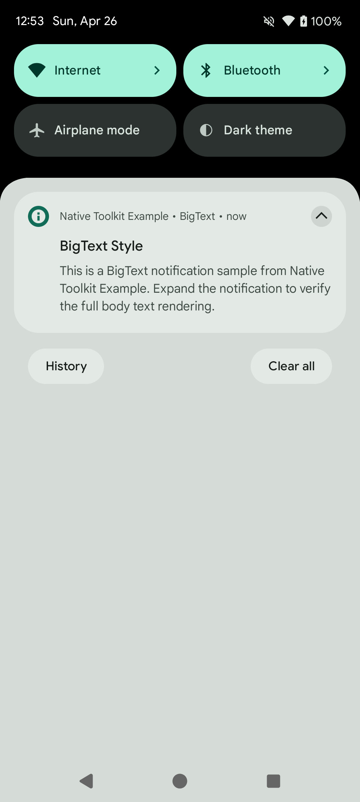
</p>

#### Inbox

Displays multiple lines in a list format when expanded.

```kotlin
style = NotificationStyle.Inbox(
    lines = listOf("• Item 1", "• Item 2", "• Item 3"),
    summaryText = "3 items",
    bigContentTitle = "Expanded title"
)
```

<p align="center">
    
</p>

#### BigPicture

Displays an image when the notification is expanded.

```kotlin
style = NotificationStyle.BigPicture(
    pictureResId = R.drawable.my_image,  // or use pictureUriString
    summaryText = "Image description",
    bigContentTitle = "Expanded title"
)
```

<p align="center">
    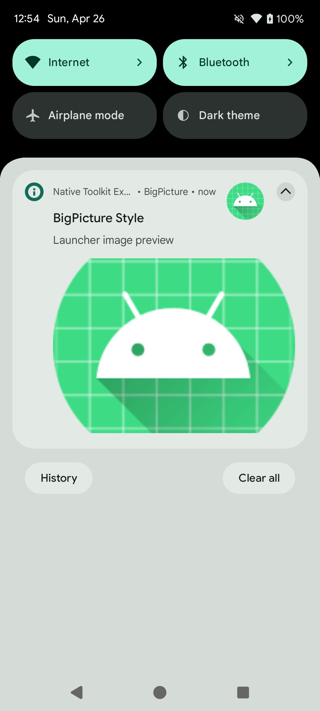
</p>

#### Messaging

Displays chat history in conversation format.

```kotlin
import android.library.notification.domain.model.NotificationMessage

val now = System.currentTimeMillis()

style = NotificationStyle.Messaging(
    userDisplayName = "You",
    conversationTitle = "Group name",
    isGroupConversation = true,
    messages = listOf(
        NotificationMessage(
            text = "Message body",
            timestampMillis = now - 60_000L,
            senderName = "Alice"          // null = local user
        )
    )
)
```

<p align="center">
    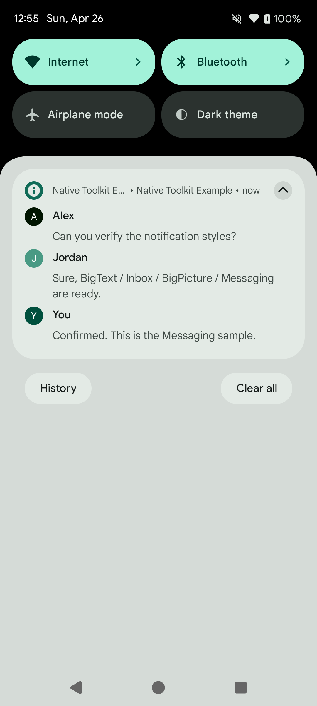
</p>

#### Media

Displays in media player format. Specify the indices of action buttons to show in compact view.

```kotlin
style = NotificationStyle.Media(
    compactActionIndices = listOf(0, 1, 2)  // up to 3
)
```

<p align="center">
    
</p>

Set action buttons via `AndroidNotificationPlatformOptions.actions` (see [Platform Options](#platform-options)).

---

### Platform Options

Use `AndroidNotificationPlatformOptions` to configure Android-specific behavior.

```kotlin
import android.library.notification.application.model.AndroidNotificationPlatformOptions
import android.library.notification.application.model.AndroidPendingIntentRequest
import android.library.notification.application.model.AndroidNotificationAction

val command = AndroidNotificationCommand(
    content = NotificationContent( /* ... */ ),
    platformOptions = AndroidNotificationPlatformOptions(
        // Intent launched when the notification is tapped
        contentIntent = AndroidPendingIntentRequest(
            intent = Intent(context, MainActivity::class.java),
            requestCode = 1000
        ),
        // Intent fired when the notification is dismissed (swiped away)
        deleteIntent = AndroidPendingIntentRequest(
            intent = Intent(context, MyReceiver::class.java),
            requestCode = 1001,
            type = AndroidPendingIntentType.BROADCAST
        ),
        // Intent for full-screen display (e.g. while the device is locked)
        fullScreenIntent = AndroidPendingIntentRequest(
            intent = Intent(context, FullScreenActivity::class.java),
            requestCode = 1002,
            type = AndroidPendingIntentType.ACTIVITY
        ),
        // Action buttons
        actions = listOf(
            AndroidNotificationAction(
                title = "Accept",
                pendingIntent = AndroidPendingIntentRequest(
                    intent = Intent(context, ActionReceiver::class.java).apply {
                        action = "ACTION_ACCEPT"
                    },
                    requestCode = 2000,
                    type = AndroidPendingIntentType.BROADCAST
                ),
                iconResId = android.R.drawable.ic_menu_call
            )
        )
    )
)
```

---

### Custom View Styles

Display notifications using a custom layout. Use `RemoteViewAction` to set view content and click events.

#### DecoratedCustomView

```kotlin
import android.library.notification.application.model.AndroidNotificationCustomViewPlatformOptions
import android.library.notification.application.model.RemoteViewAction
import android.library.notification.domain.model.NotificationCustomViewStyleData

val command = AndroidNotificationCommand(
    content = NotificationContent(
        id = 1007,
        title = "Title",
        message = "Body",
        channel = channel,
        style = NotificationStyle.DecoratedCustomView(
            customView = NotificationCustomViewStyleData(
                layoutResId = R.layout.notification_custom,       // collapsed view
                bigLayoutResId = R.layout.notification_custom_big // expanded view (optional)
            )
        )
    ),
    platformOptions = AndroidNotificationPlatformOptions(
        customViewOptions = AndroidNotificationCustomViewPlatformOptions(
            viewActions = listOf(
                // Set text
                RemoteViewAction.SetText(R.id.notification_title, "Custom title"),
                RemoteViewAction.SetText(R.id.notification_message, "Custom body"),
                // Set image
                RemoteViewAction.SetImage(R.id.notification_icon, R.mipmap.ic_launcher),
                // Set click intent on a button
                RemoteViewAction.SetClickIntent(
                    viewId = R.id.notification_btn_dismiss,
                    pendingIntent = AndroidPendingIntentRequest(
                        intent = Intent(context, ActionReceiver::class.java).apply {
                            action = "ACTION_DISMISS"
                        },
                        requestCode = 2100,
                        type = AndroidPendingIntentType.BROADCAST
                    )
                )
            )
        )
    )
)

useCases.show(command)
```

<p align="center">
    
</p>

> **Note:** Due to `RemoteViews` constraints, use `LinearLayout` + `TextView` instead of `Button` for clickable elements. Click events are set via `setOnClickPendingIntent`.

#### DecoratedMediaCustomView

Combines Media style with a custom view.

```kotlin
style = NotificationStyle.DecoratedMediaCustomView(
    customView = NotificationCustomViewStyleData(
        layoutResId = R.layout.notification_media_custom
    ),
    compactActionIndices = listOf(0, 1, 2)
)
```

<p align="center">
    
</p>

Usage of `customViewOptions` is the same as `DecoratedCustomView`.

---

### Group Notifications

Group multiple notifications together.

```kotlin
val GROUP_KEY = "my_group_key"

// Child notification 1
val child1 = AndroidNotificationCommand(
    content = NotificationContent(
        id = 1101,
        title = "Notification 1",
        message = "Group child notification #1",
        channel = channel,
        groupKey = GROUP_KEY,
        groupAlertBehavior = NotificationCompat.GROUP_ALERT_SUMMARY,
        sortKey = "01"
    )
)

// Child notification 2
val child2 = AndroidNotificationCommand(
    content = NotificationContent(
        id = 1102,
        title = "Notification 2",
        message = "Group child notification #2",
        channel = channel,
        groupKey = GROUP_KEY,
        groupAlertBehavior = NotificationCompat.GROUP_ALERT_SUMMARY,
        sortKey = "02"
    )
)

// Summary notification (group header)
val summary = AndroidNotificationCommand(
    content = NotificationContent(
        id = 1100,
        title = "Group Summary",
        message = "2 notifications",
        channel = channel,
        groupKey = GROUP_KEY,
        isGroupSummary = true,
        groupAlertBehavior = NotificationCompat.GROUP_ALERT_SUMMARY,
        sortKey = "00"
    )
)

useCases.show(child1)
useCases.show(child2)
useCases.show(summary)
```

<p align="center">
    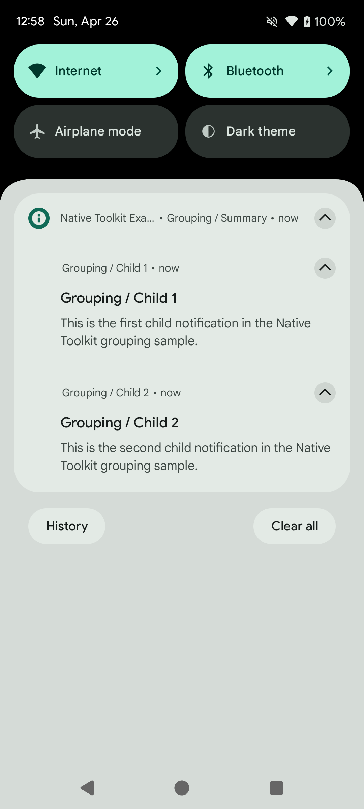
</p>

> **Tip:** Setting `groupAlertBehavior = GROUP_ALERT_SUMMARY` makes only the summary play sound and vibration; child notifications are silent.

---

### Interaction

#### Action Buttons (BroadcastReceiver)

Add buttons to a notification and receive taps via a `BroadcastReceiver`.

```kotlin
class NotificationActionReceiver : BroadcastReceiver() {
    override fun onReceive(context: Context, intent: Intent?) {
        val actionId = intent?.getStringExtra("extra_action_id") ?: return
        // Handle action
    }
}
```

```kotlin
// Notification with action buttons
platformOptions = AndroidNotificationPlatformOptions(
    actions = listOf(
        AndroidNotificationAction(
            title = "Accept",
            pendingIntent = AndroidPendingIntentRequest(
                intent = Intent(context, NotificationActionReceiver::class.java).apply {
                    putExtra("extra_action_id", "accept")
                },
                requestCode = 5000,
                type = AndroidPendingIntentType.BROADCAST
            )
        ),
        AndroidNotificationAction(
            title = "Decline",
            pendingIntent = AndroidPendingIntentRequest(
                intent = Intent(context, NotificationActionReceiver::class.java).apply {
                    putExtra("extra_action_id", "decline")
                },
                requestCode = 5001,
                type = AndroidPendingIntentType.BROADCAST
            )
        )
    )
)
```

<p align="center">
    
</p>

#### DeleteIntent (Dismiss Event)

Fired when the user swipes the notification away.

```kotlin
platformOptions = AndroidNotificationPlatformOptions(
    deleteIntent = AndroidPendingIntentRequest(
        intent = Intent(context, NotificationDeleteReceiver::class.java).apply {
            action = "ACTION_NOTIFICATION_DELETED"
        },
        requestCode = 5100,
        type = AndroidPendingIntentType.BROADCAST
    )
)
```

#### FullScreenIntent (Full-Screen Display)

Launches a full-screen activity when the device is locked or the screen is off (e.g. alarms, incoming calls).

```kotlin
// Requires a high-priority channel and an appropriate category
val content = NotificationContent(
    id = 1111,
    title = "Alarm",
    message = "Time to wake up",
    channel = highPriorityChannel,
    category = NotificationCompat.CATEGORY_ALARM,
    priority = NotificationCompat.PRIORITY_HIGH
)

platformOptions = AndroidNotificationPlatformOptions(
    fullScreenIntent = AndroidPendingIntentRequest(
        intent = Intent(context, AlarmActivity::class.java),
        requestCode = 5200,
        type = AndroidPendingIntentType.ACTIVITY,
        mutable = true
    )
)
```

<p align="center">
    
</p>

> **Note:** Depending on device state and Android policy, the notification may appear as a heads-up notification instead of full-screen.

---

### Progress Notifications

Display a progress bar for downloads or long-running operations.

```kotlin
import android.library.notification.domain.model.NotificationProgress

// Determinate progress bar
val command = AndroidNotificationCommand(
    content = NotificationContent(
        id = 1009,
        title = "Downloading",
        message = "50% complete",
        channel = channel,
        ongoing = true,
        autoCancel = false,
        progress = NotificationProgress(
            max = 100,
            current = 50,
            indeterminate = false
        )
    )
)

useCases.show(command)

// Indeterminate progress bar
val indeterminate = NotificationProgress(max = 0, current = 0, indeterminate = true)

// On completion (hide the bar and revert to a normal notification)
val complete = NotificationContent(
    id = 1009,
    ongoing = false,
    autoCancel = true,
    progress = NotificationProgress(max = 100, current = 100, indeterminate = false),
    /* ... */
)
```

<p align="center">
    
</p>

---

### Foreground Service Notifications

#### Progress FGS (Long-Running Background Tasks)

Use `ProgressForegroundNotifications` to show a progress notification tied to a foreground service.

```kotlin
import android.library.notification.presentation.progress.ProgressForegroundNotifications

// Start the foreground service (also shows the notification)
ProgressForegroundNotifications.start(context, progressCommand)

// Update progress
ProgressForegroundNotifications.update(context, updatedProgressCommand)

// Complete (stop the service and demote to a regular notification)
ProgressForegroundNotifications.complete(context, completionCommand)

// Force stop (also removes the notification)
ProgressForegroundNotifications.stop(context)
```

<p align="center">
    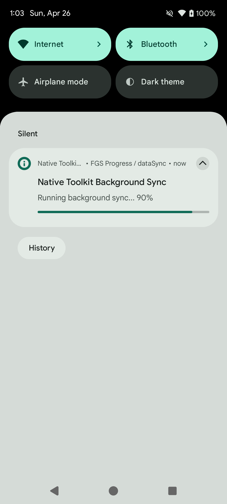
</p>

Declare the service in `AndroidManifest.xml`.

```xml
<service
    android:name="android.library.notification.presentation.progress.ProgressForegroundService"
    android:foregroundServiceType="dataSync"
    android:exported="false" />
```

#### Call Style FGS (Call Notifications)

Show CallStyle notifications (incoming, ongoing, screening) via a foreground service.

```kotlin
import android.library.notification.presentation.call.CallStyleForegroundService
import androidx.core.content.ContextCompat

// Start incoming call notification
ContextCompat.startForegroundService(
    context,
    CallStyleForegroundService.createIncomingStartIntent(context)
)

// Switch to ongoing call notification
ContextCompat.startForegroundService(
    context,
    CallStyleForegroundService.createOngoingStartIntent(context)
)

// Stop
context.startService(CallStyleForegroundService.createStopIntent(context))
```

<p align="center">
    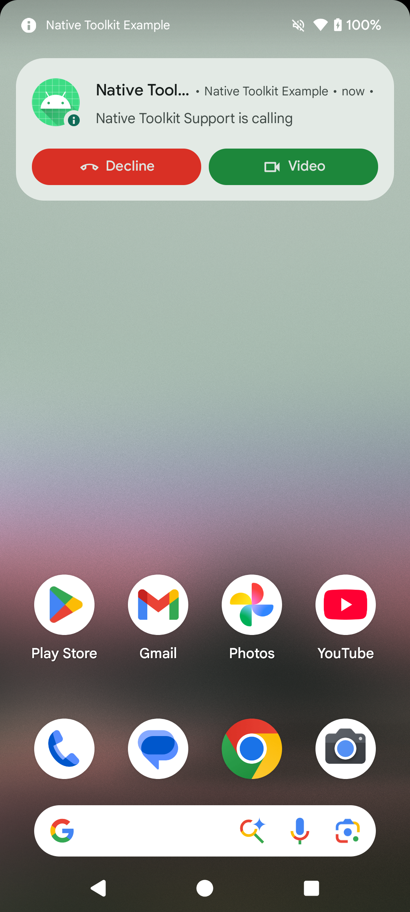
</p>

Declare the service in `AndroidManifest.xml`.

```xml
<service
    android:name="android.library.notification.presentation.call.CallStyleForegroundService"
    android:foregroundServiceType="specialUse"
    android:exported="false">
    <property
        android:name="android.app.PROPERTY_SPECIAL_USE_FGS_SUBTYPE"
        android:value="call" />
</service>
```

---

### Scheduled Notifications

Automatically show a notification at a specified time.

```kotlin
import android.library.notification.domain.model.NotificationSchedule

val schedule = NotificationSchedule(
    triggerAtMillis = System.currentTimeMillis() + 15_000L, // 15 seconds from now
    exact = true,           // exact alarm (requires SCHEDULE_EXACT_ALARM)
    allowWhileIdle = true,  // fires even in Doze mode
    persistAcrossBoot = true // restored after device reboot
)

useCases.schedule(command, schedule)
    .onSuccess { /* scheduled */ }
    .onFailure { /* handle error */ }
```

<p align="center">
    
</p>

#### Cancel Scheduled Notifications

```kotlin
useCases.cancelScheduled(id = 1010)
useCases.cancelAllScheduled()
```

#### Restore After Reboot

Use `RECEIVE_BOOT_COMPLETED` to restore schedules after a device reboot.

```kotlin
// Call inside BroadcastReceiver.onReceive
useCases.restoreScheduled()
```

Declare the receiver in `AndroidManifest.xml`.

```xml
<receiver
    android:name="android.library.notification.data.repository.ScheduledNotificationBootReceiver"
    android:exported="false">
    <intent-filter>
        <action android:name="android.intent.action.BOOT_COMPLETED" />
        <action android:name="android.intent.action.LOCKED_BOOT_COMPLETED" />
        <action android:name="android.intent.action.MY_PACKAGE_REPLACED" />
    </intent-filter>
</receiver>
```

#### Check Scheduled Status

```kotlin
val isScheduled: Boolean = useCases.isScheduled(context, id = 1010)
```

---

## iOS

### IosNotificationManager

`IosNotificationManager` is a singleton class that provides all local notification operations on iOS.

<p align="center">
    
</p>

### Setup

Call `setup()` once at app launch (e.g. in `AppDelegate.application(_:didFinishLaunchingWithOptions:)`).

```swift
import IosLibrary

IosNotificationManager.setup()
```

### Permission

#### Request Notification Permission

```swift
IosNotificationManager.shared.requestPermission { isSuccess, errorMessage in
    if isSuccess {
        // Granted
    } else {
        // Denied. User must enable manually in Settings.
    }
}
```

<p align="center">
    
</p>

#### Check Permission

```swift
IosNotificationManager.shared.hasPermission { hasPermission in
    print(hasPermission) // true / false
}
```

#### Get Authorization Status

```swift
IosNotificationManager.shared.authorizationStatus { status in
    // .notDetermined / .denied / .authorized / .provisional / .ephemeral / .unknown
    print(status)
}
```

#### Open Notification Settings

```swift
IosNotificationManager.shared.openNotificationSettings()
```

### Show Notification

Create a `NotificationContent` and call `show()`.

#### Immediate

```swift
let content = NotificationContent(
    id: "sample-notification",
    title: "Immediate Notification",
    body: "Displayed now",
    categoryIdentifier: "sample-category",
    userInfo: ["source": "IosLibraryExample", "id": "sample-notification"]
)

IosNotificationManager.shared.show(content: content) { isSuccess, errorMessage in
    print(isSuccess, errorMessage ?? "")
}
```

<p align="center">
    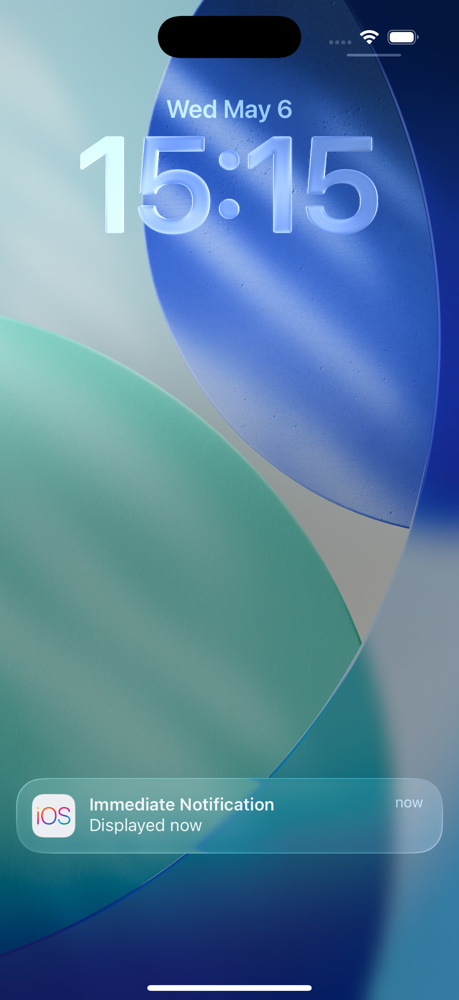
</p>

#### Immediate with Attachment

Show a notification with an image file bundled in the app.
Expand the notification (long-press) to see the attachment thumbnail.

```swift
guard let imageURL = Bundle.main.url(forResource: "app-icon-attachment", withExtension: "png") else { return }

let attachment = NotificationAttachment(identifier: "app-icon", fileURL: imageURL)
let content = NotificationContent(
    id: "sample-notification",
    title: "Immediate Notification with Attachment",
    body: "Displayed with app icon attachment",
    categoryIdentifier: "sample-category",
    userInfo: ["source": "IosLibraryExample", "id": "sample-notification"],
    attachments: [attachment]
)

IosNotificationManager.shared.show(content: content) { isSuccess, errorMessage in
    print(isSuccess, errorMessage ?? "")
}
```

<p align="center">
    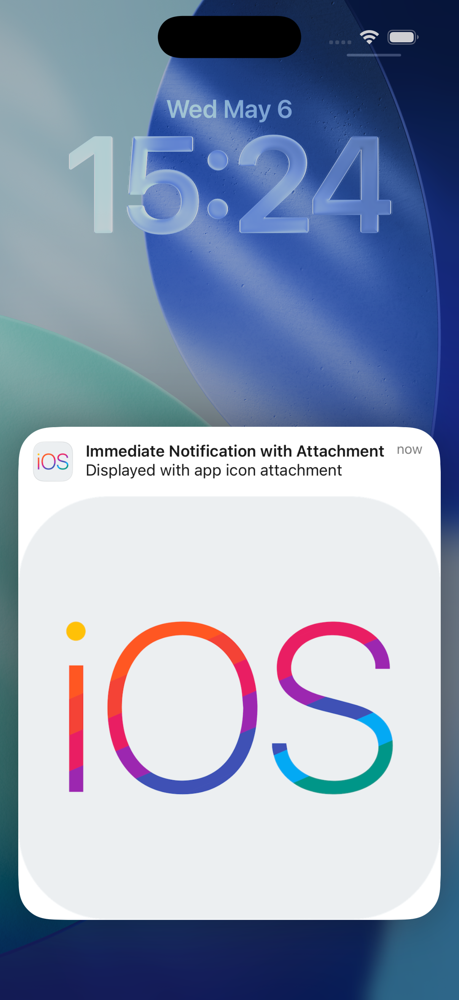
</p>

#### Time Interval Trigger

```swift
IosNotificationManager.shared.show(
    content: content,
    trigger: .timeInterval(5.0, repeats: false)
) { isSuccess, errorMessage in
    print(isSuccess, errorMessage ?? "")
}
```

#### Calendar Trigger

```swift
var components = DateComponents()
components.hour = 9
components.minute = 0

IosNotificationManager.shared.show(
    content: content,
    trigger: .calendar(components, repeats: true)
) { isSuccess, errorMessage in
    print(isSuccess, errorMessage ?? "")
}
```

#### Location Trigger

Location notifications use CoreLocation. Add a location usage description to `Info.plist`.

```swift
IosNotificationManager.shared.show(
    content: content,
    trigger: .location(
        identifier: "tokyo-station",
        latitude: 35.6812,
        longitude: 139.7671,
        radius: 100,
        notifyOnEntry: true,
        notifyOnExit: false
    )
) { isSuccess, errorMessage in
    print(isSuccess, errorMessage ?? "")
}
```

### Attachment

Use `NotificationAttachment` to attach images, audio, or video to a notification.
The attachment thumbnail is shown when the notification is expanded (long-press).

```swift
guard let imageURL = Bundle.main.url(forResource: "app-icon-attachment", withExtension: "png") else { return }

let attachment = NotificationAttachment(identifier: "app-icon", fileURL: imageURL)
let content = NotificationContent(
    id: "sample-notification",
    title: "Notification with Image",
    body: "Expand to see the image",
    attachments: [attachment]
)

IosNotificationManager.shared.show(content: content) { isSuccess, errorMessage in
    print(isSuccess, errorMessage ?? "")
}
```

### Update Notification

Update the content or trigger of a pending notification.

```swift
let updatedContent = NotificationContent(
    id: "sample-notification",
    title: "Updated Title",
    body: "Content has changed"
)

IosNotificationManager.shared.update(
    identifier: "sample-notification",
    content: updatedContent,
    trigger: nil
) { isSuccess, errorMessage in
    print(isSuccess, errorMessage ?? "")
}
```

### Cancel / Remove Notification

```swift
// Cancel a specific pending notification
IosNotificationManager.shared.cancel(identifier: "sample-notification")

// Cancel all pending notifications
IosNotificationManager.shared.cancelAll()

// Remove a specific delivered notification from Notification Center
IosNotificationManager.shared.removeDelivered(identifier: "sample-notification")

// Remove all delivered notifications from Notification Center
IosNotificationManager.shared.removeAllDelivered()
```

### Scheduled Notifications

Schedule a notification for future delivery with a specific identifier.

```swift
let content = NotificationContent(
    id: "scheduled-notification",
    title: "Scheduled Notification",
    body: "Displayed after 10 seconds"
)

IosNotificationManager.shared.schedule(
    content: content,
    trigger: .timeInterval(10.0, repeats: false),
    identifier: "scheduled-notification"
) { isSuccess, errorMessage in
    print(isSuccess, errorMessage ?? "")
}
```

#### Cancel Scheduled

```swift
// Cancel a specific scheduled notification
IosNotificationManager.shared.cancelScheduled(identifier: "scheduled-notification")

// Cancel all scheduled notifications
IosNotificationManager.shared.cancelAllScheduled()
```

### Query

```swift
// Get all pending (not yet delivered) notification requests
IosNotificationManager.shared.getScheduled { requests in
    requests.forEach { print($0.identifier) }
}

// Get all notifications visible in Notification Center
IosNotificationManager.shared.getDelivered { notifications in
    notifications.forEach { print($0.identifier) }
}
```

### Badge

```swift
// Set badge count (use 0 to clear)
IosNotificationManager.shared.setBadgeCount(1) { isSuccess, errorMessage in
    print(isSuccess, errorMessage ?? "")
}

IosNotificationManager.shared.setBadgeCount(0) { isSuccess, errorMessage in
    print(isSuccess, errorMessage ?? "")
}
```

### Category and Actions

Add action buttons or text input to notifications.

#### Register Category

```swift
let category = NotificationCategory(
    identifier: "sample-category",
    actions: [
        NotificationAction(
            identifier: "open",
            title: "Open",
            options: [.foreground]
        ),
        NotificationAction(
            identifier: "delete",
            title: "Delete",
            options: [.destructive]
        )
    ],
    textInputActions: [
        TextInputNotificationAction(
            identifier: "reply",
            title: "Reply",
            buttonTitle: "Send",
            textInputPlaceholder: "Type a message"
        )
    ],
    options: [.customDismissAction, .allowAnnouncement]
)

IosNotificationManager.shared.registerCategory(category)
```

#### Attach Category to Notification

Set the `categoryIdentifier` in `NotificationContent`.
Long-press the notification to see the action buttons.

```swift
let content = NotificationContent(
    id: "sample-notification",
    title: "Notification with Actions",
    body: "Long-press to see actions",
    categoryIdentifier: "sample-category"
)
```

#### Remove Category

```swift
IosNotificationManager.shared.removeCategory(identifier: "sample-category")
```

<p align="center">
    
</p>

#### Action Received Callbacks

```swift
// Receive action button taps
IosNotificationManager.shared.onActionReceived = { notificationId, actionId, userInfo in
    print("notification: \(notificationId), action: \(actionId)")
}

// Receive text input action submissions
IosNotificationManager.shared.onTextInputActionReceived = { notificationId, actionId, userText, userInfo in
    print("notification: \(notificationId), action: \(actionId), text: \(userText)")
}
```

---

## Windows

### WindowsNotificationManager

`WindowsNotificationManager` provides a C bridge API (`extern "C"`) for Windows Toast notifications.
It supports both **packaged** (MSIX) and **unpackaged** (plain Win32) apps, and requires Windows 11 or later.

The library is distributed as `windows-native-toolkit-1.1.0.nupkg`.

---

### Setup

#### Package.appxmanifest (Packaged apps)

Add the following extensions inside the `<Application>` element to enable toast activation:

```xml
<Extensions>
  <com:Extension Category="windows.comServer">
    <com:ComServer>
      <com:ExeServer Executable="YourApp.exe"
                     DisplayName="Native Toolkit Notification Activator"
                     Arguments="----AppNotificationActivated:">
        <com:Class Id="5F6A1B27-7C0B-4E1B-9070-6F1966502BAF"
                   DisplayName="Toast Activator"/>
      </com:ExeServer>
    </com:ComServer>
  </com:Extension>
  <desktop:Extension Category="windows.toastNotificationActivation">
    <desktop:ToastNotificationActivation
        ToastActivatorCLSID="5F6A1B27-7C0B-4E1B-9070-6F1966502BAF"/>
  </desktop:Extension>
</Extensions>
```

Replace the CLSID with the one registered in your own manifest. The sample app uses `5F6A1B27-7C0B-4E1B-9070-6F1966502BAF`.

#### Initialize

**Packaged app (MSIX):**

```cpp
#include "WindowsNotificationManager.h"

void OnNotificationInvokedThunk(const wchar_t* argsJson)
{
    // Called when a notification or action button is clicked.
    // Dispatch to the UI thread before touching UI elements.
}

DWORD err = 0;
initNotificationManager(&OnNotificationInvokedThunk, TRUE, nullptr, nullptr, &err);
// err == 0: success. err == 2: notifications are disabled for this app.
```

**Unpackaged app (plain Win32 / Unity):**

```cpp
DWORD err = 0;

// Step 1: Bootstrap the Windows App SDK runtime (once at startup)
initWinAppSdk(0x00010007, &err); // 0x00010007 = WinAppSDK 1.7

// Step 2: Initialize with display name and icon path
initNotificationManager(
    &OnNotificationInvokedThunk,
    FALSE,                          // isPackaged = FALSE
    L"MyApp",                       // display name shown in Notification Center
    L"C:\\path\\to\\app-icon.png", // icon path (required, must exist)
    &err
);
```

**Uninitialize:**

```cpp
uninitNotificationManager();
```

---

### Init / Setting

#### Get Notification Setting

```cpp
int setting = getNotificationSetting();
// 0: Enabled
// 1: DisabledForApplication
// 2: DisabledForUser
// 3: DisabledByGroupPolicy
// 4: DisabledByManifest
// -1: Error (WinRT exception)
```

#### Open Notification Settings

Opens the Windows system Notifications Settings page. Use this when `getNotificationSetting()` returns 1–4 to guide the user to re-enable notifications.

```cpp
DWORD err = 0;
openNotificationSettings(&err);
```

---

### Show Notification

#### Basic

```cpp
DWORD err = 0;
const wchar_t* payload = LR"({"title":"Hello","body":"Basic toast","tag":"sample"})";
showNotification(payload, &err);
```

<p align="center">
    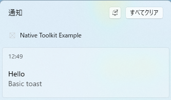
</p>

#### With Buttons

Action button clicks are delivered via `NotificationInvokedCallback` with the button's `args` as JSON.

```cpp
DWORD err = 0;
const wchar_t* payload =
    LR"({"title":"Actionable","body":"Toast with buttons","tag":"sample",)"
    LR"("buttons":[{"label":"Open","args":{"action":"open"}},{"label":"Dismiss","args":{"action":"dismiss"}}]})";
showNotification(payload, &err);
```

<p align="center">
    
</p>

#### With Image

```cpp
DWORD err = 0;
const wchar_t* payload =
    LR"({"title":"With Image","body":"Toast with hero image","tag":"sample",)"
    LR"("heroImage":"ms-appx:///Assets/StoreLogo.png"})";
showNotification(payload, &err);
```

<p align="center">
    
</p>

#### With Input

Text box and combo box values are included in the callback's `argsJson`.

```cpp
DWORD err = 0;
const wchar_t* payload =
    LR"({"title":"Reply","body":"Type a reply and pick an option","tag":"sample",)"
    LR"("textBoxes":[{"id":"reply","placeholder":"Type a message"}],)"
    LR"("comboBoxes":[{"id":"opt","title":"Status","defaultSelection":"busy",)"
    LR"("items":[{"id":"free","label":"Free"},{"id":"busy","label":"Busy"}]}],)"
    LR"("buttons":[{"label":"Send","args":{"action":"send"}}]})";
showNotification(payload, &err);
```

<p align="center">
    
</p>

#### With Progress

Displays a progress bar. Use the same `tag` with `updateNotificationProgress` to update it later.

```cpp
DWORD err = 0;
const wchar_t* payload =
    LR"({"title":"Downloading","body":"In progress","tag":"progress-sample",)"
    LR"("progress":{"title":"Toolkit.zip","value":0.3,"valueStr":"30%","status":"Downloading"}})";
showNotification(payload, &err);
```

<p align="center">
    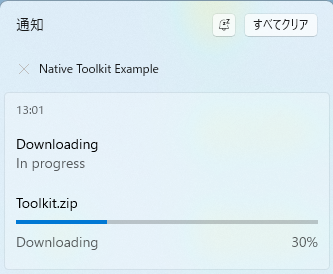
</p>

#### With Expiration

The notification is automatically removed from Notification Center after `expiration` seconds.

```cpp
DWORD err = 0;
const wchar_t* payload =
    LR"({"title":"Expires","body":"This toast expires in 10 seconds","tag":"sample","expiration":10})";
showNotification(payload, &err);
```

#### With Audio

```cpp
DWORD err = 0;
const wchar_t* payload =
    LR"({"title":"Reminder","body":"Toast with reminder sound","tag":"sample",)"
    LR"("audio":{"type":"event","event":"reminder"}})";
showNotification(payload, &err);
```

---

### Schedule Notification

Pass the target time as a Unix timestamp in milliseconds.

```cpp
#include <chrono>

DWORD err = 0;
auto now = std::chrono::system_clock::now();
auto ms = std::chrono::duration_cast<std::chrono::milliseconds>(
    (now + std::chrono::seconds(60)).time_since_epoch()).count();

const wchar_t* payload =
    LR"({"title":"Scheduled","body":"Fires in ~1 minute","tag":"scheduled"})";
scheduleNotification(payload, static_cast<int64_t>(ms), &err);
```

> **Note:** Notifications scheduled more than 5 minutes in the past may be discarded by the OS if the app was not running at delivery time.

#### Cancel Scheduled

```cpp
DWORD err = 0;
cancelScheduledNotification(L"scheduled", L"", &err);
```

---

### Update Progress

Updates the progress bar of an existing notification. Call `showNotification` with a `progress` payload first.
Returns `NOTIFICATION_ERROR_PROGRESS_NOT_FOUND (4)` if no matching notification is in Notification Center.

```cpp
DWORD err = 0;
static uint32_t seq = 1;
updateNotificationProgress(
    L"progress-sample",  // tag (must match showNotification)
    L"",                 // group
    0.6,                 // progress value (0.0 – 1.0)
    L"60%",             // display string override
    L"Downloading",      // status label
    seq++,               // sequence number (must increase each call)
    &err
);
```

<p align="center">
    
</p>

---

### Badge

Sets the badge on the taskbar icon. Requires a packaged (MSIX) app.
Returns `NOTIFICATION_ERROR_NOT_SUPPORTED (8)` for unpackaged apps.

```cpp
DWORD err = 0;

setBadge(5,  &err);   // numeric badge
setBadge(-1, &err);   // glyph: alert
setBadge(0,  &err);   // clear badge
```

**Glyph values:** `-1`=alert, `-2`=activity, `-3`=newMessage, `-4`=available, `-5`=busy, `-6`=away

<p align="center">
    
</p>

---

### Remove / Query

#### Get All Notifications

Returns a JSON array of active notifications in Notification Center. Each element contains `id`, `tag`, and `group`.
Returns `NOTIFICATION_ERROR_NOT_SUPPORTED (8)` for unpackaged apps.

```cpp
DWORD err = 0;
wchar_t buf[4096] = {};
getAllNotifications(buf, 4096, &err);
// buf: [{"id":1,"tag":"sample","group":""},...]
```

#### Remove by ID

Removes a specific notification by its numeric ID (obtained from `getAllNotifications`).
Returns `NOTIFICATION_ERROR_NOT_SUPPORTED (8)` for unpackaged apps.

```cpp
DWORD err = 0;
removeNotificationById(notificationId, &err);
```

#### Remove by Tag

```cpp
DWORD err = 0;
removeNotificationsByTag(L"sample", L"", &err);
```

#### Remove All

```cpp
DWORD err = 0;
removeAllNotifications(&err);
```

---

### Callback

`NotificationInvokedCallback` is invoked when the user clicks the notification body or an action button.
`argsJson` contains the action arguments and any user input (text box / combo box values) as a JSON string.

The sample app uses a static forwarding hub to route the callback to the active UI page safely:

```cpp
namespace
{
    std::function<void(winrt::hstring)> g_notificationHandler;

    void OnNotificationInvokedThunk(const wchar_t* argsJson)
    {
        if (g_notificationHandler)
            g_notificationHandler(winrt::hstring{ argsJson ? argsJson : L"" });
    }
}

// In OnNavigatedTo — register handler
auto weakText = winrt::make_weak(ResultTextBlock());
auto dq = DispatcherQueue();
g_notificationHandler = [weakText, dq](winrt::hstring args)
{
    dq.TryEnqueue([weakText, args]()
    {
        if (auto text = weakText.get())
            text.Text(L"\U0001F514 Notification invoked:\n" + args);
    });
};

// In OnNavigatedFrom — unregister
g_notificationHandler = nullptr;
```

---

### Error Codes

| Code | Name | Description |
|---|---|---|
| 0 | `NOTIFICATION_SUCCESS` | Success |
| 1 | `NOTIFICATION_ERROR_NOT_INITIALIZED` | `initNotificationManager` has not been called |
| 2 | `NOTIFICATION_ERROR_DISABLED` | Notifications are disabled for this app in OS settings |
| 3 | `NOTIFICATION_ERROR_INVALID_PAYLOAD` | Malformed JSON payload |
| 4 | `NOTIFICATION_ERROR_PROGRESS_NOT_FOUND` | No matching progress notification in Notification Center |
| 5 | `NOTIFICATION_ERROR_HRESULT_FAILURE` | WinRT / COM internal error |
| 6 | `NOTIFICATION_ERROR_BADGE_FAILED` | Badge update failed |
| 7 | `NOTIFICATION_ERROR_INVALID_PARAMETER` | Invalid parameter value |
| 8 | `NOTIFICATION_ERROR_NOT_SUPPORTED` | Feature not available for this app type (e.g. `removeNotificationById` / `getAllNotifications` / `setBadge` for unpackaged apps) |

---

## macOS

### MacNotificationManager

`MacNotificationManager` is a singleton class that provides all local notification operations on macOS.

**Requirements:** macOS 15+. Calls on earlier OS versions return `unsupportedOS` (error code 1001).

**Thread safety:** Public APIs can be called from any thread. All completion callbacks are dispatched to the **main queue**.

<p align="center">
    
</p>

### Setup

Call `setup()` once at app launch (e.g. in `applicationDidFinishLaunching`). Register action callbacks here.

```swift
import MacLibrary

MacNotificationManager.shared.setup()

// Receive action button taps
MacNotificationManager.shared.setActionReceivedHandler { notificationId, actionId, userInfoJson in
    print("Action received: \(notificationId), \(actionId)")
}

// Receive text input action submissions
MacNotificationManager.shared.setTextInputActionReceivedHandler { notificationId, actionId, userText, userInfoJson in
    print("Text input received: \(userText)")
}
```

### Permission

#### Request Permission

```swift
MacNotificationManager.shared.requestPermission { result in
    // runs on main queue
    switch result {
    case .success:
        print("Notification permission granted")
    case .failure(let error):
        if error.errorCode == 1002 || error.errorCode == 1003 {
            // denied — user must enable notifications manually in Settings
            print("Permission denied. Please enable notifications in Settings.")
        } else {
            print("Error \(error.errorCode): \(error.errorMessage)")
        }
    }
}
```

<p align="center">
    
</p>

#### Check Permission

Returns a boolean indicating whether notifications are allowed.

```swift
MacNotificationManager.shared.getAuthorizationStatus { result in
    switch result {
    case .success(let status):
        let hasPermission = status == .authorized || status == .provisional
        print("Has permission: \(hasPermission)")
    case .failure(let error):
        print("Error \(error.errorCode): \(error.errorMessage)")
    }
}
```

<p align="center">
    
</p>

#### Get Authorization Status

Returns the detailed authorization status.

```swift
MacNotificationManager.shared.getAuthorizationStatus { result in
    switch result {
    case .success(let status):
        // .notDetermined / .denied / .authorized / .provisional / .unsupported
        print(status)
    case .failure(let error):
        print("Error \(error.errorCode): \(error.errorMessage)")
    }
}
```

<p align="center">
    
</p>

#### Open Notification Settings

```swift
MacNotificationManager.shared.openNotificationSettings { result in
    if case .failure(let error) = result {
        print("Error \(error.errorCode): \(error.errorMessage)")
    }
}
```

<p align="center">
    
</p>

#### Reset Notification Permission (macOS 26.3)

Use this procedure during development to reset a previously denied permission.

1. Open **System Settings** → **Notifications**
2. **Right-click** the target app in the app list
3. Select **"Reset Notifications..."**
4. Press **"Reset Notifications"** in the confirmation dialog
5. The permission dialog will appear again on the next app launch

### Show Notification

Create a `NotificationContent` and call `show()`.

**`NotificationContent` constraints:**
- `id`: 1–128 chars (`[A-Za-z0-9\-_]`)
- `title`: 1–128 chars
- `body`: 0–1024 chars (optional)

#### Immediate

```swift
import MacLibrary

let content = NotificationContent(
    id: "mac-sample-notification",
    title: "Immediate Notification",
    body: "Displayed now",
    subtitle: "MacLibraryExample",
    categoryIdentifier: "mac-sample-category",
    userInfo: ["source": "MacLibraryExample", "id": "mac-sample-notification"],
    badge: nil
)

MacNotificationManager.shared.show(content: content) { result in
    // runs on main queue
    switch result {
    case .success:
        print("Notification shown")
    case .failure(let error):
        print("Error \(error.errorCode): \(error.errorMessage)")
    }
}
```

<p align="center">
    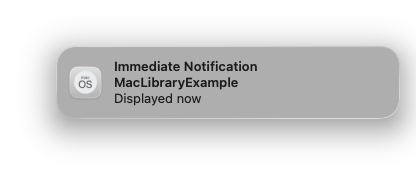
</p>

#### Time Interval Trigger

```swift
MacNotificationManager.shared.show(
    content: content,
    trigger: .timeInterval(seconds: 10, repeats: false)
) { result in
    switch result {
    case .success:
        print("Scheduled for 10 seconds")
    case .failure(let error):
        print("Error \(error.errorCode): \(error.errorMessage)")
    }
}
```

<p align="center">
    
</p>

#### Calendar Trigger

```swift
let nextDate = Calendar.current.date(byAdding: .minute, value: 1, to: Date()) ?? Date()
var components = Calendar.current.dateComponents([.year, .month, .day, .hour, .minute], from: nextDate)
components.second = 0

MacNotificationManager.shared.show(
    content: content,
    trigger: .calendar(dateComponents: components, repeats: false)
) { result in
    switch result {
    case .success:
        print("Scheduled for 1 minute later")
    case .failure(let error):
        print("Error \(error.errorCode): \(error.errorMessage)")
    }
}
```

<p align="center">
    
</p>

### Update / Cancel / Remove

#### Update by ID

Replaces a pending notification with new content.

```swift
let updatedContent = NotificationContent(
    id: "mac-sample-notification",
    title: "Updated Notification",
    body: "This content was updated",
    subtitle: "MacLibraryExample",
    categoryIdentifier: "mac-sample-category",
    userInfo: ["source": "MacLibraryExample", "id": "mac-sample-notification"],
    badge: nil
)

MacNotificationManager.shared.update(
    identifier: "mac-sample-notification",
    content: updatedContent,
    trigger: .immediate
) { result in
    switch result {
    case .success:
        print("Updated")
    case .failure(let error):
        // error code 1104 if notification not found
        print("Error \(error.errorCode): \(error.errorMessage)")
    }
}
```

<p align="center">
    
</p>

#### Cancel by ID

```swift
MacNotificationManager.shared.cancelScheduled(identifier: "mac-sample-notification")
```

#### Cancel All

```swift
MacNotificationManager.shared.cancelAllScheduled()
```

<p align="center">
    
</p>

#### Remove Delivered by ID

Removes a specific notification from Notification Center.

```swift
MacNotificationManager.shared.removeDelivered(identifier: "mac-sample-notification")
```

#### Remove All Delivered

```swift
MacNotificationManager.shared.removeAllDelivered()
```

<p align="center">
    
</p>

### Schedule

Use `schedule()` to register a future notification. The trigger must not be `.immediate`.

#### Schedule with Time Interval

```swift
let content = NotificationContent(
    id: "mac-sample-scheduled",
    title: "Scheduled Notification",
    body: "Scheduled in 10 seconds",
    subtitle: "MacLibraryExample",
    categoryIdentifier: "mac-sample-category",
    userInfo: ["source": "MacLibraryExample", "id": "mac-sample-scheduled"],
    badge: nil
)

MacNotificationManager.shared.schedule(
    content: content,
    trigger: .timeInterval(seconds: 10, repeats: false)
) { result in
    switch result {
    case .success:
        print("Scheduled")
    case .failure(let error):
        print("Error \(error.errorCode): \(error.errorMessage)")
    }
}
```

<p align="center">
    
</p>

#### Schedule with Calendar

```swift
let nextDate = Calendar.current.date(byAdding: .minute, value: 1, to: Date()) ?? Date()
var components = Calendar.current.dateComponents([.year, .month, .day, .hour, .minute], from: nextDate)
components.second = 0

MacNotificationManager.shared.schedule(
    content: content,
    trigger: .calendar(dateComponents: components, repeats: false)
) { result in
    switch result {
    case .success:
        print("Calendar scheduled")
    case .failure(let error):
        print("Error \(error.errorCode): \(error.errorMessage)")
    }
}
```

<p align="center">
    
</p>

#### Cancel Scheduled by ID

```swift
MacNotificationManager.shared.cancelScheduled(identifier: "mac-sample-scheduled")
```

#### Cancel All Scheduled

```swift
MacNotificationManager.shared.cancelAllScheduled()
```

### Query

#### Get Scheduled

```swift
MacNotificationManager.shared.getScheduled { result in
    switch result {
    case .success(let items):
        let ids = items.map { $0.identifier }.joined(separator: ", ")
        print("Scheduled: \(items.count) item(s), ids=[\(ids)]")
    case .failure(let error):
        print("Error \(error.errorCode): \(error.errorMessage)")
    }
}
```

<p align="center">
    
</p>

#### Get Delivered

```swift
MacNotificationManager.shared.getDelivered { result in
    switch result {
    case .success(let items):
        let ids = items.map { $0.identifier }.joined(separator: ", ")
        print("Delivered: \(items.count) item(s), ids=[\(ids)]")
    case .failure(let error):
        print("Error \(error.errorCode): \(error.errorMessage)")
    }
}
```

<p align="center">
    
</p>

### Badge

#### Set Badge Count (1)

```swift
MacNotificationManager.shared.setBadgeCount(1) { result in
    switch result {
    case .success:
        print("Badge set to 1")
    case .failure(let error):
        print("Error \(error.errorCode): \(error.errorMessage)")
    }
}
```

<p align="center">
    
</p>

#### Clear Badge (0)

```swift
MacNotificationManager.shared.setBadgeCount(0) { result in
    switch result {
    case .success:
        print("Badge cleared")
    case .failure(let error):
        print("Error \(error.errorCode): \(error.errorMessage)")
    }
}
```

<p align="center">
    
</p>

### Category

#### Register Category

```swift
let category = NotificationCategory(
    id: "mac-sample-category",
    actions: [
        NotificationAction(id: "open", title: "Open", isForeground: true),
        NotificationAction(id: "reply", title: "Reply", isTextInput: true, textInputPlaceholder: "Type message")
    ]
)

MacNotificationManager.shared.registerCategory(category) { result in
    switch result {
    case .success:
        // Send a notification and right-click to see the actions (Open, Reply)
        print("Category registered")
    case .failure(let error):
        print("Error \(error.errorCode): \(error.errorMessage)")
    }
}
```

Attach the category to a notification by setting `categoryIdentifier` in `NotificationContent`.

```swift
let content = NotificationContent(
    id: "mac-sample-notification",
    title: "Notification with Actions",
    body: "Right-click to see actions",
    subtitle: "MacLibraryExample",
    categoryIdentifier: "mac-sample-category",
    userInfo: ["source": "MacLibraryExample", "id": "mac-sample-notification"],
    badge: nil
)
```

<p align="center">
    
</p>

#### Remove Category

```swift
MacNotificationManager.shared.removeCategory(identifier: "mac-sample-category") { result in
    if case .failure(let error) = result {
        print("Error \(error.errorCode): \(error.errorMessage)")
    }
}
```

<p align="center">
    
</p>

### Error Codes

| Code | Case | Description |
|---|---|---|
| 1001 | `unsupportedOS` | macOS 15+ required |
| 1002 | `permissionDenied` | User denied notification permission |
| 1003 | `permissionRequestFailed` | Failed to request permission |
| 1101 | `invalidContent` | Invalid id, title, or body |
| 1102 | `invalidTrigger` | Invalid trigger (e.g. `timeInterval` < 1 second) |
| 1103 | `invalidCategory` | Invalid category |
| 1104 | `notificationNotFound` | No pending notification for the given identifier |
| 1201 | `addFailed` | Failed to add notification request |
| 1202 | `removeFailed` | Failed to remove notification |
| 1203 | `queryFailed` | Failed to query notifications |
| 1204 | `setBadgeFailed` | Failed to set badge count |
| 1205 | `openSettingsFailed` | Failed to open notification settings |
| 1999 | `unknown` | Unknown error |
