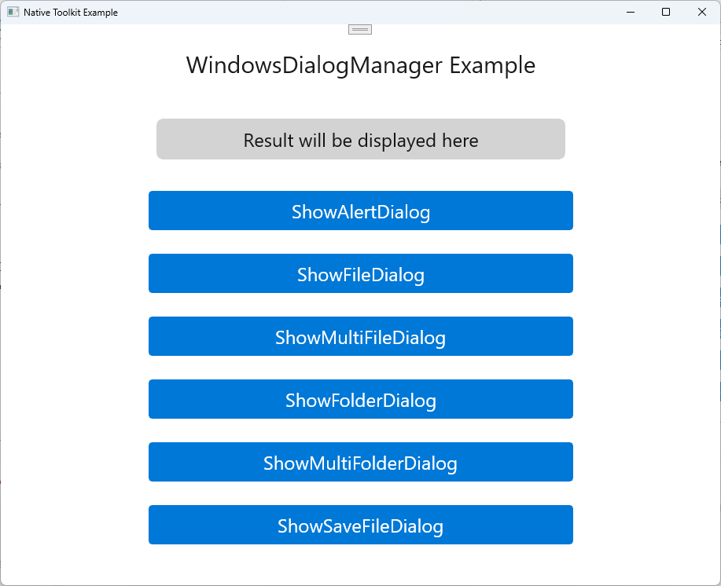

# native-toolkit Manual

Language:

- English (this page)
- Korean: [index.ko.md](index.ko.md)
- Japanese: [index.ja.md](index.ja.md)

Markdown files in this directory are published as versioned documents under `docs/<version>/manual/`.

# Purpose of this manual

- Summarize setup steps and practical operation notes that are hard to cover with generated docs alone (Dokka / DocC / Doxygen)
- Keep hand-written docs separate from generated output (`docs/`) so they are not overwritten during publish

# What you can learn on this page

- Installation / onboarding
- Platform-specific setup
  - Android (Gradle)
  - iOS (Xcode)
  - Windows (Visual Studio)
  - macOS (Xcode)
- API usage examples

# Generated documentation (API references)

- Android: `docs/<version>/android/`
- iOS: `docs/<version>/ios/`
- Windows: `docs/<version>/windows/`
- macOS: `docs/<version>/mac/`

# Artifact locations (`dist/<version>/`)

- Android: `dist/1.3.0/android/android-native-toolkit-1.1.0.aar`
- iOS: `dist/1.3.0/ios/ios-native-toolkit-1.1.0.xcframework`
- Windows: `dist/1.3.0/windows/nuget/NativeToolkit/NativeToolkit.1.0.0.nupkg`
- macOS: `dist/1.3.0/mac/mac-native-toolkit-1.1.0.xcframework`

# Native Toolkit

- native-toolkit is a toolkit for using native platform features in a unified way.
- The package includes native plugins and samples for Android / iOS / Windows / macOS, and native platform features are available through singleton APIs.

# Version

## 1.3.0

# Supported OS versions

- Android 12+
- iOS 18+
- Windows 11+
- macOS 15+

# Feature list

## Android

- Dialog features
  - Basic dialog
  - Confirmation dialog
  - Single-choice dialog
  - Multi-choice dialog
  - Text input dialog
  - Login dialog
- Notification features
  - Show / update / cancel notifications
  - Manage notification channels
  - Schedule notifications

## iOS

- Dialog features
  - Basic dialog
  - Confirmation dialog
  - Destructive dialog
  - Action sheet
  - Text input dialog
  - Login dialog
- Notification features
  - Permission
  - Show / update / cancel notifications
  - Scheduled notifications
  - Notifications with attachment
  - Badge
  - Categories and actions

## Windows

- Dialog features
  - Basic dialog
  - File picker dialog
  - Multi-file picker dialog
  - Folder picker dialog
  - Multi-folder picker dialog
  - Save file dialog

## Mac

- Dialog features
  - Basic dialog
  - File picker dialog
  - Multi-file picker dialog
  - Folder picker dialog
  - Multi-folder picker dialog
  - Save file dialog
- Notification features
  - Permission
  - Show / update / cancel notifications
  - Scheduled notifications
  - Badge
  - Categories and actions

## Planned features

- Share
- Clipboard integration
- Notifications (Windows)

## Samples

- Android sample
  - Install Android Studio.
    - <a href="https://developer.android.com/studio" target="_blank" rel="noopener noreferrer">Reference site</a>
  - Launch Android Studio.
  - Select "File" → "Open...".
  - Select `native-toolkit/android/AndroidLibraryExample` and click "Open".
  - Connect an Android device.
  - Click "Run" to install the sample app.
    <p align="center">
        
    </p>

- iOS sample
  - Install Xcode.
    - <a href="https://developer.apple.com/xcode" target="_blank" rel="noopener noreferrer">Reference site</a>
  - Launch Xcode.
  - Select "Open Existing Project...".
  - Select `native-toolkit/ios/IosWorkspace.xcworkspace` and click "Open".
  - Click "Run" to install the sample app.
    <p align="center">
        
    </p>

- Windows sample
  - Install Visual Studio 2022.
    - <a href="https://visualstudio.microsoft.com/vs/" target="_blank" rel="noopener noreferrer">Reference site</a>
  - Launch Visual Studio 2022.
  - Select "Open a project or solution".
  - Select `native-toolkit\windows\WindowsLibraryExample\WindowsLibraryExample.sln` and click "Open".
  - Select "Debug" → "Start Debugging" to install the sample app.
    <p align="center">
        
    </p>

- Mac sample
  - Install Xcode.
    - <a href="https://developer.apple.com/xcode" target="_blank" rel="noopener noreferrer">Reference site</a>
  - Launch Xcode.
  - Select "Open Existing Project...".
  - Select `native-toolkit/mac/MacWorkspace.xcworkspace` and click "Open".
  - Click "Run" to install the sample app.
    <p align="center">
        
    </p>

## Library integration

### Android

#### Supported platform: Android (AAR / ABI-independent)

1. Place `android-native-toolkit-1.1.0.aar` in `app/libs`.
2. Add repository settings in `settings.gradle.kts` to resolve the AAR.
3. Add dependency settings in `app/build.gradle.kts` to reference the AAR.
4. Run Gradle sync.
5. Verify that the build succeeds.
   Add the following settings:

**settings.gradle.kts:**

```gradle

dependencyResolutionManagement {
    repositoriesMode.set(RepositoriesMode.FAIL_ON_PROJECT_REPOS)
    repositories {
        google()
        mavenCentral()

        // Add this to resolve local AAR files.
        flatDir {
            dirs("app/libs")
        }
    }
}
```

**app/build.gradle.kts:**

```gradle

dependencies {
    // Add this dependency to reference the AAR.
  implementation(files("libs/android-native-toolkit-1.1.0.aar"))
}
```

### iOS

#### Supported platform: iOS (Device: arm64 / Simulator: arm64, x86_64)

1. Copy `ios-native-toolkit-1.1.0.xcframework` to the `Frameworks` folder (create it if needed) under your Xcode project.
2. Open the target project in Xcode 26.2 and select your app target in **Project Navigator**.
3. Open the **General** tab and click **+** in **Frameworks, Libraries, and Embedded Content**.
4. Select **Add Other...** → **Add Files...** and add `Frameworks/ios-native-toolkit-1.1.0.xcframework`.
5. Set the embed option of `ios-native-toolkit-1.1.0.xcframework` to **Embed & Sign**.
6. Open **Build Settings** of the same target and add `$(PROJECT_DIR)/Frameworks` to `Framework Search Paths`. (Usually non-recursive)
7. Verify that Team is correctly configured in **Signing & Capabilities**.
8. Run **Product** → **Clean Build Folder**, then build and run with **Run**.
9. Integration is complete if the app launches without errors.

### Windows

#### Supported platform: Windows x64 (win-x64)

1. Copy `NativeToolkit.1.0.0.nupkg` to `C:\packages`.
2. Launch Visual Studio 2022 and open **Tools** → **Options** → **NuGet Package Manager** → **Package Sources**.
3. Click **+** and enter:
   - Name: LocalPackages
   - Source: C:\packages
     Then click **Update** to save.
4. Open your target solution.
5. In **Solution Explorer**, right-click your project and select **Manage NuGet Packages**.
6. Change **Package source** to **LocalPackages**.
7. Search for **NativeToolkit** and click **Install**.
8. If a license prompt appears, accept it to complete installation.

### macOS

#### Supported platform: macOS arm64, x86_64

1. Copy `NativeToolkit-1.0.0-xcode[version].xcframework` to the `Frameworks` folder (create it if needed) under your Xcode project.
2. Open the target project in Xcode 26.2 and select your app target in Project Navigator.
3. Open the **General** tab and click `+` in **Frameworks, Libraries, and Embedded Content**.
4. Select "Add Other..." → "Add Files..." and add `Frameworks/NativeToolkit-1.0.0-xcode[version].xcframework`.
5. Set the embed option of `NativeToolkit-1.0.0-xcode[version].xcframework` to **Embed & Sign**.
6. Open **Build Settings** of the same target and add `$(PROJECT_DIR)/Frameworks` to `Framework Search Paths`. (Usually non-recursive)
7. Verify that Team is correctly configured in **Signing & Capabilities**.
8. Run **Product** → **Clean Build Folder**, then build and run with **Run**.
9. Integration is complete if the app launches without errors.

# API usage

- [Dialog](dialog.md)
- [Notification](notification.md)
