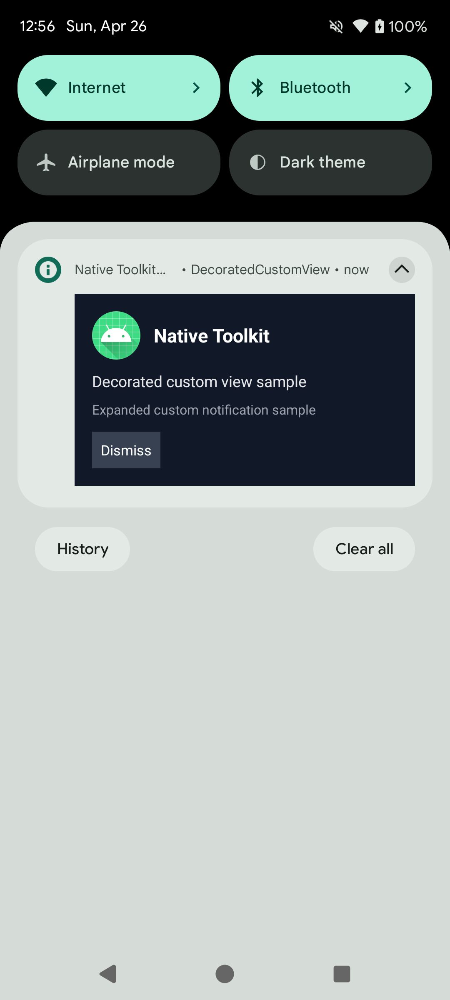
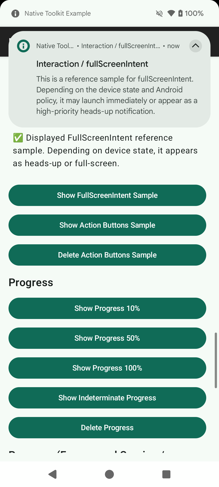
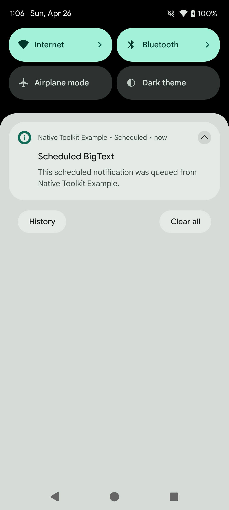
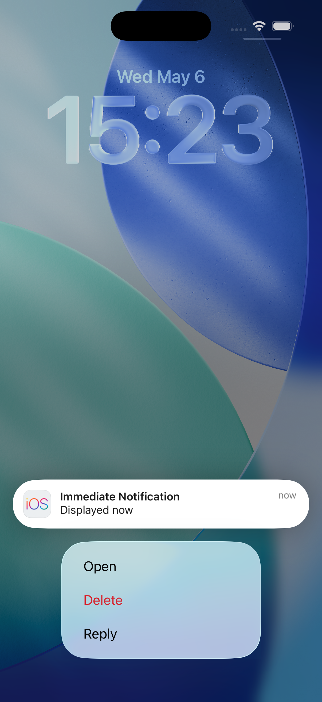

# 通知機能

言語:

- 日本語（このページ）
- English: [notification.md](notification.md)
- 한국어: [notification.ko.md](notification.ko.md)

← [マニュアルトップに戻る](index.ja.md)

---

## 目次

- [Android](#android)
  - [セットアップ](#セットアップ)
  - [パーミッション](#パーミッション)
  - [チャンネル管理](#チャンネル管理)
  - [基本的な通知操作](#基本的な通知操作)
  - [通知スタイル](#通知スタイル)
  - [プラットフォームオプション](#プラットフォームオプション)
  - [カスタムビュースタイル](#カスタムビュースタイル)
  - [グループ通知](#グループ通知)
  - [インタラクション](#インタラクション)
  - [進捗通知](#進捗通知)
  - [フォアグラウンドサービス通知](#フォアグラウンドサービス通知)
  - [スケジュール通知](#スケジュール通知)
- [iOS](#ios)
  - [IosNotificationManager](#iosnotificationmanager)
  - [セットアップ](#セットアップ-1)
  - [パーミッション](#パーミッション-1)
    - [通知権限をリクエストする](#通知権限をリクエストする)
    - [権限の確認](#権限の確認)
    - [認証ステータスの取得](#認証ステータスの取得)
    - [通知設定を開く](#通知設定を開く)
  - [通知の表示](#通知の表示-1)
    - [即時表示](#即時表示)
    - [添付ファイル付き即時表示](#添付ファイル付き即時表示)
    - [時間間隔トリガー](#時間間隔トリガー)
    - [カレンダートリガー](#カレンダートリガー)
    - [位置情報トリガー](#位置情報トリガー)
  - [添付ファイル](#添付ファイル)
  - [通知の更新](#通知の更新)
  - [通知のキャンセル / 削除](#通知のキャンセル--削除)
  - [スケジュール通知](#スケジュール通知-1)
    - [スケジュールのキャンセル](#スケジュールのキャンセル)
  - [クエリ](#クエリ)
  - [バッジ](#バッジ)
  - [カテゴリとアクション](#カテゴリとアクション)
    - [カテゴリの登録](#カテゴリの登録)
    - [カテゴリを通知に紐づける](#カテゴリを通知に紐づける)
    - [カテゴリの削除](#カテゴリの削除)
    - [アクション受信コールバック](#アクション受信コールバック)
- [Windows](#windows)
- [macOS](#macos)
  - [MacNotificationManager](#macnotificationmanager)
  - [セットアップ](#セットアップ-2)
  - [パーミッション](#パーミッション-2)
    - [権限のリクエスト](#権限のリクエスト)
    - [認証ステータスの取得](#認証ステータスの取得)
    - [通知設定を開く](#通知設定を開く)
  - [通知の表示](#通知の表示-1)
    - [即時表示](#即時表示)
    - [時間間隔トリガー](#時間間隔トリガー)
    - [カレンダートリガー](#カレンダートリガー)
  - [通知の更新](#通知の更新)
  - [スケジュール](#スケジュール)
    - [将来の通知をスケジュール](#将来の通知をスケジュール)
    - [スケジュール済みの取り消し](#スケジュール済みの取り消し)
    - [スケジュール済みの取得](#スケジュール済みの取得)
  - [配信済み通知](#配信済み通知)
  - [カテゴリとアクション](#カテゴリとアクション-1)
    - [カテゴリの登録](#カテゴリの登録-1)
    - [カテゴリの削除](#カテゴリの削除-1)
    - [アクション受信コールバック](#アクション受信コールバック-1)
  - [バッジ](#バッジ-1)
  - [エラーコード](#エラーコード)

---

## Android

### セットアップ

#### AndroidManifest.xml

使用する機能に応じてパーミッションを追加します。

```xml
<!-- Android 13以降で通知を送信するために必要 -->
<uses-permission android:name="android.permission.POST_NOTIFICATIONS" />

<!-- スケジュール通知（正確なアラーム）を使用する場合 -->
<uses-permission android:name="android.permission.SCHEDULE_EXACT_ALARM" />
<uses-permission android:name="android.permission.RECEIVE_BOOT_COMPLETED" />

<!-- フォアグラウンドサービスを使用する場合 -->
<uses-permission android:name="android.permission.FOREGROUND_SERVICE" />
<uses-permission android:name="android.permission.FOREGROUND_SERVICE_DATA_SYNC" />
```

#### NotificationUseCases の初期化

```kotlin
import android.library.notification.data.repository.NotificationUseCases

val useCases = NotificationUseCases(context)
```

---

### パーミッション

```kotlin
import android.library.notification.presentation.permission.NotificationPermissionHelper

val permissionHelper = NotificationPermissionHelper(activity)

// 通知パーミッションが許可されているか（Android 13以降）
val hasPermission: Boolean = permissionHelper.hasPermission()

// アプリの通知が有効か
val enabled: Boolean = permissionHelper.areNotificationsEnabled()

// 正確なアラームが許可されているか
val canSchedule: Boolean = permissionHelper.canScheduleExactAlarms()

// パーミッションをリクエストする
permissionHelper.requestPermission { granted ->
    if (granted) { /* 許可された */ }
}

// 設定画面を開く
permissionHelper.openNotificationSettings()
permissionHelper.openExactAlarmSettings()
```

---

### チャンネル管理

通知を送信する前にチャンネルを作成する必要があります。

```kotlin
import android.library.notification.domain.model.NotificationChannel

val channel = NotificationChannel(
    id = "my_channel",
    name = "My Channel",
    description = "Sample notification channel"
)

// 作成
useCases.createChannel(channel)
    .onSuccess { /* 完了 */ }
    .onFailure { /* エラー処理 */ }

// 複数まとめて作成
useCases.createChannels(listOf(channel1, channel2))

// 削除
useCases.deleteChannel("my_channel")
```

---

### 基本的な通知操作

#### 表示

```kotlin
import android.library.notification.application.model.AndroidNotificationCommand
import android.library.notification.domain.model.NotificationContent

val command = AndroidNotificationCommand(
    content = NotificationContent(
        id = 1001,
        title = "タイトル",
        message = "本文",
        channel = channel
    )
)

useCases.show(command)
    .onSuccess { /* 表示完了 */ }
    .onFailure { /* エラー処理 */ }
```

#### 更新

同じ `id` / `tag` を指定することで表示中の通知を上書き更新します。

```kotlin
useCases.update(updatedCommand)
```

#### キャンセル

```kotlin
// 特定の通知をキャンセル
useCases.cancel(id = 1001)
useCases.cancel(id = 1001, tag = "my_tag")

// すべてキャンセル
useCases.cancelAll()
```

#### アクティブな通知の取得

現在表示中の通知一覧を取得します（Android 6.0以降）。

```kotlin
val activeList: List<ActiveNotification> = useCases.getActive()
activeList.forEach { it.id; it.title }
```

---

### 通知スタイル

`NotificationContent` の `style` プロパティに指定します。

#### Default（デフォルト）

```kotlin
style = NotificationStyle.Default
```

<p align="center">
    
</p>

#### BigText

展開すると長いテキストを表示します。

```kotlin
style = NotificationStyle.BigText(
    bigText = "展開後に表示される長い本文テキスト",
    summaryText = "サマリー",
    bigContentTitle = "展開時のタイトル"
)
```

<p align="center">
    
</p>

#### Inbox

展開すると複数行をリスト形式で表示します。

```kotlin
style = NotificationStyle.Inbox(
    lines = listOf("• 項目 1", "• 項目 2", "• 項目 3"),
    summaryText = "3 件",
    bigContentTitle = "展開時のタイトル"
)
```

<p align="center">
    
</p>

#### BigPicture

展開すると画像を表示します。

```kotlin
style = NotificationStyle.BigPicture(
    pictureResId = R.drawable.my_image,  // またはURIで指定: pictureUriString
    summaryText = "画像の説明",
    bigContentTitle = "展開時のタイトル"
)
```

<p align="center">
    
</p>

#### Messaging

チャット履歴形式で表示します。

```kotlin
import android.library.notification.domain.model.NotificationMessage

val now = System.currentTimeMillis()

style = NotificationStyle.Messaging(
    userDisplayName = "自分",
    conversationTitle = "グループ名",
    isGroupConversation = true,
    messages = listOf(
        NotificationMessage(
            text = "メッセージ本文",
            timestampMillis = now - 60_000L,
            senderName = "Alice"          // null = 自分のメッセージ
        )
    )
)
```

<p align="center">
    
</p>

#### Media

メディアプレイヤー形式で表示します。コンパクト表示時に見せるアクションボタンのインデックスを指定します。

```kotlin
style = NotificationStyle.Media(
    compactActionIndices = listOf(0, 1, 2)  // 最大3つ
)
```

<p align="center">
    
</p>

アクションボタンは `AndroidNotificationPlatformOptions.actions` に設定します（[プラットフォームオプション](#プラットフォームオプション) 参照）。

---

### プラットフォームオプション

`AndroidNotificationPlatformOptions` で Android 固有の動作を設定します。

```kotlin
import android.library.notification.application.model.AndroidNotificationPlatformOptions
import android.library.notification.application.model.AndroidPendingIntentRequest
import android.library.notification.application.model.AndroidNotificationAction

val command = AndroidNotificationCommand(
    content = NotificationContent( /* ... */ ),
    platformOptions = AndroidNotificationPlatformOptions(
        // 通知タップ時に起動するIntent
        contentIntent = AndroidPendingIntentRequest(
            intent = Intent(context, MainActivity::class.java),
            requestCode = 1000
        ),
        // 通知を削除（スワイプ）したときのIntent
        deleteIntent = AndroidPendingIntentRequest(
            intent = Intent(context, MyReceiver::class.java),
            requestCode = 1001,
            type = AndroidPendingIntentType.BROADCAST
        ),
        // フルスクリーン表示用Intent（端末ロック中など）
        fullScreenIntent = AndroidPendingIntentRequest(
            intent = Intent(context, FullScreenActivity::class.java),
            requestCode = 1002,
            type = AndroidPendingIntentType.ACTIVITY
        ),
        // アクションボタン
        actions = listOf(
            AndroidNotificationAction(
                title = "承認",
                pendingIntent = AndroidPendingIntentRequest(
                    intent = Intent(context, ActionReceiver::class.java).apply {
                        action = "ACTION_ACCEPT"
                    },
                    requestCode = 2000,
                    type = AndroidPendingIntentType.BROADCAST
                ),
                iconResId = android.R.drawable.ic_menu_call
            )
        )
    )
)
```

---

### カスタムビュースタイル

独自レイアウトで通知を表示します。`RemoteViewAction` を使ってビューの内容とクリックイベントを設定します。

#### DecoratedCustomView

```kotlin
import android.library.notification.application.model.AndroidNotificationCustomViewPlatformOptions
import android.library.notification.application.model.RemoteViewAction
import android.library.notification.domain.model.NotificationCustomViewStyleData

val command = AndroidNotificationCommand(
    content = NotificationContent(
        id = 1007,
        title = "タイトル",
        message = "本文",
        channel = channel,
        style = NotificationStyle.DecoratedCustomView(
            customView = NotificationCustomViewStyleData(
                layoutResId = R.layout.notification_custom,       // 通常表示
                bigLayoutResId = R.layout.notification_custom_big // 展開表示（省略可）
            )
        )
    ),
    platformOptions = AndroidNotificationPlatformOptions(
        customViewOptions = AndroidNotificationCustomViewPlatformOptions(
            viewActions = listOf(
                // テキストをセット
                RemoteViewAction.SetText(R.id.notification_title, "カスタムタイトル"),
                RemoteViewAction.SetText(R.id.notification_message, "カスタム本文"),
                // 画像をセット
                RemoteViewAction.SetImage(R.id.notification_icon, R.mipmap.ic_launcher),
                // ボタンにクリックイベントをセット
                RemoteViewAction.SetClickIntent(
                    viewId = R.id.notification_btn_dismiss,
                    pendingIntent = AndroidPendingIntentRequest(
                        intent = Intent(context, ActionReceiver::class.java).apply {
                            action = "ACTION_DISMISS"
                        },
                        requestCode = 2100,
                        type = AndroidPendingIntentType.BROADCAST
                    )
                )
            )
        )
    )
)

useCases.show(command)
```

<p align="center">
    
</p>

> **注意:** `RemoteViews` の制約上、ボタンには `Button` クラスではなく `LinearLayout` + `TextView` を使用してください。クリックイベントは `setOnClickPendingIntent` で設定されます。

#### DecoratedMediaCustomView

Media スタイルと組み合わせてカスタムビューを表示します。

```kotlin
style = NotificationStyle.DecoratedMediaCustomView(
    customView = NotificationCustomViewStyleData(
        layoutResId = R.layout.notification_media_custom
    ),
    compactActionIndices = listOf(0, 1, 2)
)
```

<p align="center">
    
</p>

`customViewOptions` の使い方は `DecoratedCustomView` と同じです。

---

### グループ通知

複数の通知をグループにまとめて表示します。

```kotlin
val GROUP_KEY = "my_group_key"

// 子通知 1
val child1 = AndroidNotificationCommand(
    content = NotificationContent(
        id = 1101,
        title = "通知 1",
        message = "グループ子通知 #1",
        channel = channel,
        groupKey = GROUP_KEY,
        groupAlertBehavior = NotificationCompat.GROUP_ALERT_SUMMARY,
        sortKey = "01"
    )
)

// 子通知 2
val child2 = AndroidNotificationCommand(
    content = NotificationContent(
        id = 1102,
        title = "通知 2",
        message = "グループ子通知 #2",
        channel = channel,
        groupKey = GROUP_KEY,
        groupAlertBehavior = NotificationCompat.GROUP_ALERT_SUMMARY,
        sortKey = "02"
    )
)

// サマリー通知（グループヘッダー）
val summary = AndroidNotificationCommand(
    content = NotificationContent(
        id = 1100,
        title = "グループサマリー",
        message = "2 件の通知",
        channel = channel,
        groupKey = GROUP_KEY,
        isGroupSummary = true,
        groupAlertBehavior = NotificationCompat.GROUP_ALERT_SUMMARY,
        sortKey = "00"
    )
)

useCases.show(child1)
useCases.show(child2)
useCases.show(summary)
```

<p align="center">
    
</p>

> **ポイント:** `groupAlertBehavior = GROUP_ALERT_SUMMARY` に設定すると、サマリーのみが音・バイブを鳴らし、子通知はサイレントになります。

---

### インタラクション

#### アクションボタン（BroadcastReceiver）

通知にボタンを追加し、タップを BroadcastReceiver で受け取ります。

```kotlin
class NotificationActionReceiver : BroadcastReceiver() {
    override fun onReceive(context: Context, intent: Intent?) {
        val actionId = intent?.getStringExtra("extra_action_id") ?: return
        // アクションの処理
    }
}
```

```kotlin
// アクションボタン付き通知
platformOptions = AndroidNotificationPlatformOptions(
    actions = listOf(
        AndroidNotificationAction(
            title = "承認",
            pendingIntent = AndroidPendingIntentRequest(
                intent = Intent(context, NotificationActionReceiver::class.java).apply {
                    putExtra("extra_action_id", "accept")
                },
                requestCode = 5000,
                type = AndroidPendingIntentType.BROADCAST
            )
        ),
        AndroidNotificationAction(
            title = "拒否",
            pendingIntent = AndroidPendingIntentRequest(
                intent = Intent(context, NotificationActionReceiver::class.java).apply {
                    putExtra("extra_action_id", "decline")
                },
                requestCode = 5001,
                type = AndroidPendingIntentType.BROADCAST
            )
        )
    )
)
```

<p align="center">
    
</p>

#### DeleteIntent（削除イベント）

通知をスワイプで削除したときのコールバックです。

```kotlin
platformOptions = AndroidNotificationPlatformOptions(
    deleteIntent = AndroidPendingIntentRequest(
        intent = Intent(context, NotificationDeleteReceiver::class.java).apply {
            action = "ACTION_NOTIFICATION_DELETED"
        },
        requestCode = 5100,
        type = AndroidPendingIntentType.BROADCAST
    )
)
```

#### FullScreenIntent（フルスクリーン）

端末ロック中や画面オフ時に全画面で起動します（アラーム・着信通知など）。

```kotlin
// 高優先度チャンネルと category の設定が必要
val content = NotificationContent(
    id = 1111,
    title = "アラーム",
    message = "起床時刻です",
    channel = highPriorityChannel,
    category = NotificationCompat.CATEGORY_ALARM,
    priority = NotificationCompat.PRIORITY_HIGH
)

platformOptions = AndroidNotificationPlatformOptions(
    fullScreenIntent = AndroidPendingIntentRequest(
        intent = Intent(context, AlarmActivity::class.java),
        requestCode = 5200,
        type = AndroidPendingIntentType.ACTIVITY,
        mutable = true
    )
)
```

<p align="center">
    
</p>

> **注意:** 端末の状態・Android ポリシーによっては、フルスクリーンではなく heads-up 通知として表示される場合があります。

---

### 進捗通知

ダウンロードや処理の進捗をプログレスバーで表示します。

```kotlin
import android.library.notification.domain.model.NotificationProgress

// 進捗バー（確定）
val command = AndroidNotificationCommand(
    content = NotificationContent(
        id = 1009,
        title = "ダウンロード中",
        message = "50% 完了",
        channel = channel,
        ongoing = true,
        autoCancel = false,
        progress = NotificationProgress(
            max = 100,
            current = 50,
            indeterminate = false
        )
    )
)

useCases.show(command)

// 不定長プログレスバー
val indeterminate = NotificationProgress(max = 0, current = 0, indeterminate = true)

// 完了時（バーを非表示にして通常通知に戻す）
val complete = NotificationContent(
    id = 1009,
    ongoing = false,
    autoCancel = true,
    progress = NotificationProgress(max = 100, current = 100, indeterminate = false),
    /* ... */
)
```

<p align="center">
    
</p>

---

### フォアグラウンドサービス通知

#### Progress FGS（長時間バックグラウンド処理）

`ProgressForegroundNotifications` を使ってフォアグラウンドサービスと連携した進捗通知を表示します。

```kotlin
import android.library.notification.presentation.progress.ProgressForegroundNotifications

// フォアグラウンドサービスを開始（通知表示も兼ねる）
ProgressForegroundNotifications.start(context, progressCommand)

// 進捗を更新
ProgressForegroundNotifications.update(context, updatedProgressCommand)

// 完了（サービスを停止して通常通知に降格）
ProgressForegroundNotifications.complete(context, completionCommand)

// 強制停止（通知も削除）
ProgressForegroundNotifications.stop(context)
```

<p align="center">
    
</p>

`AndroidManifest.xml` にサービスを宣言します。

```xml
<service
    android:name="android.library.notification.presentation.progress.ProgressForegroundService"
    android:foregroundServiceType="dataSync"
    android:exported="false" />
```

#### Call Style FGS（通話スタイル）

着信・通話中・スクリーニングの CallStyle 通知をフォアグラウンドサービスで表示します。

```kotlin
import android.library.notification.presentation.call.CallStyleForegroundService
import androidx.core.content.ContextCompat

// 着信通知を開始
ContextCompat.startForegroundService(
    context,
    CallStyleForegroundService.createIncomingStartIntent(context)
)

// 通話中通知に切り替え
ContextCompat.startForegroundService(
    context,
    CallStyleForegroundService.createOngoingStartIntent(context)
)

// 停止
context.startService(CallStyleForegroundService.createStopIntent(context))
```

<p align="center">
    
</p>

`AndroidManifest.xml` にサービスを宣言します。

```xml
<service
    android:name="android.library.notification.presentation.call.CallStyleForegroundService"
    android:foregroundServiceType="specialUse"
    android:exported="false">
    <property
        android:name="android.app.PROPERTY_SPECIAL_USE_FGS_SUBTYPE"
        android:value="call" />
</service>
```

---

### スケジュール通知

指定した時刻に通知を自動表示します。

```kotlin
import android.library.notification.domain.model.NotificationSchedule

val schedule = NotificationSchedule(
    triggerAtMillis = System.currentTimeMillis() + 15_000L, // 15秒後
    exact = true,           // 正確なアラーム（SCHEDULE_EXACT_ALARM が必要）
    allowWhileIdle = true,  // Doze モード中も起動
    persistAcrossBoot = true // 端末再起動後も復元
)

useCases.schedule(command, schedule)
    .onSuccess { /* スケジュール完了 */ }
    .onFailure { /* エラー処理 */ }
```

<p align="center">
    
</p>

#### スケジュールのキャンセル

```kotlin
useCases.cancelScheduled(id = 1010)
useCases.cancelAllScheduled()
```

#### 端末再起動後の復元

`RECEIVE_BOOT_COMPLETED` を使って再起動後にスケジュールを復元します。

```kotlin
// BroadcastReceiver の onReceive 内で呼び出す
useCases.restoreScheduled()
```

`AndroidManifest.xml` に Receiver を宣言します。

```xml
<receiver
    android:name="android.library.notification.data.repository.ScheduledNotificationBootReceiver"
    android:exported="false">
    <intent-filter>
        <action android:name="android.intent.action.BOOT_COMPLETED" />
        <action android:name="android.intent.action.LOCKED_BOOT_COMPLETED" />
        <action android:name="android.intent.action.MY_PACKAGE_REPLACED" />
    </intent-filter>
</receiver>
```

#### スケジュール済み確認

```kotlin
val isScheduled: Boolean = useCases.isScheduled(context, id = 1010)
```

---

## iOS

### IosNotificationManager

`IosNotificationManager` は iOS ローカル通知のすべての操作を提供するシングルトンクラスです。

<p align="center">
    
</p>

### セットアップ

アプリ起動時（例: `AppDelegate.application(_:didFinishLaunchingWithOptions:)`）に `setup()` を一度だけ呼び出します。

```swift
import IosLibrary

IosNotificationManager.setup()
```

### パーミッション

#### 通知権限をリクエストする

```swift
IosNotificationManager.shared.requestPermission { isSuccess, errorMessage in
    if isSuccess {
        // 許可された
    } else {
        // 拒否された。設定アプリから手動で有効化が必要
    }
}
```

<p align="center">
    
</p>

#### 権限の確認

```swift
IosNotificationManager.shared.hasPermission { hasPermission in
    print(hasPermission) // true / false
}
```

#### 認証ステータスの取得

```swift
IosNotificationManager.shared.authorizationStatus { status in
    // .notDetermined / .denied / .authorized / .provisional / .ephemeral / .unknown
    print(status)
}
```

#### 通知設定を開く

```swift
IosNotificationManager.shared.openNotificationSettings()
```

### 通知の表示

`NotificationContent` を作成して `show()` を呼び出します。

#### 即時表示

```swift
let content = NotificationContent(
    id: "sample-notification",
    title: "Immediate Notification",
    body: "Displayed now",
    categoryIdentifier: "sample-category",
    userInfo: ["source": "IosLibraryExample", "id": "sample-notification"]
)

IosNotificationManager.shared.show(content: content) { isSuccess, errorMessage in
    print(isSuccess, errorMessage ?? "")
}
```

<p align="center">
    
</p>

#### 添付ファイル付き即時表示

Bundle に含めた画像ファイルを添付として通知を表示します。
通知を長押し（展開表示）するとサムネイルが表示されます。

```swift
guard let imageURL = Bundle.main.url(forResource: "app-icon-attachment", withExtension: "png") else { return }

let attachment = NotificationAttachment(identifier: "app-icon", fileURL: imageURL)
let content = NotificationContent(
    id: "sample-notification",
    title: "Immediate Notification with Attachment",
    body: "Displayed with app icon attachment",
    categoryIdentifier: "sample-category",
    userInfo: ["source": "IosLibraryExample", "id": "sample-notification"],
    attachments: [attachment]
)

IosNotificationManager.shared.show(content: content) { isSuccess, errorMessage in
    print(isSuccess, errorMessage ?? "")
}
```

<p align="center">
    
</p>

#### 時間間隔トリガー

```swift
IosNotificationManager.shared.show(
    content: content,
    trigger: .timeInterval(5.0, repeats: false)
) { isSuccess, errorMessage in
    print(isSuccess, errorMessage ?? "")
}
```

#### カレンダートリガー

```swift
var components = DateComponents()
components.hour = 9
components.minute = 0

IosNotificationManager.shared.show(
    content: content,
    trigger: .calendar(components, repeats: true)
) { isSuccess, errorMessage in
    print(isSuccess, errorMessage ?? "")
}
```

#### 位置情報トリガー

位置情報通知は CoreLocation を使用します。`Info.plist` に位置情報の利用説明文を追加してください。

```swift
IosNotificationManager.shared.show(
    content: content,
    trigger: .location(
        identifier: "tokyo-station",
        latitude: 35.6812,
        longitude: 139.7671,
        radius: 100,
        notifyOnEntry: true,
        notifyOnExit: false
    )
) { isSuccess, errorMessage in
    print(isSuccess, errorMessage ?? "")
}
```

### 添付ファイル

`NotificationAttachment` を使って通知に画像・音声・動画を添付できます。
通知を長押し（展開表示）するとサムネイルが表示されます。

```swift
guard let imageURL = Bundle.main.url(forResource: "app-icon-attachment", withExtension: "png") else { return }

let attachment = NotificationAttachment(identifier: "app-icon", fileURL: imageURL)
let content = NotificationContent(
    id: "sample-notification",
    title: "画像付き通知",
    body: "展開して画像を確認してください",
    attachments: [attachment]
)

IosNotificationManager.shared.show(content: content) { isSuccess, errorMessage in
    print(isSuccess, errorMessage ?? "")
}
```

### 通知の更新

保留中の通知の内容やトリガーを更新します。

```swift
let updatedContent = NotificationContent(
    id: "sample-notification",
    title: "更新されたタイトル",
    body: "内容が変わりました"
)

IosNotificationManager.shared.update(
    identifier: "sample-notification",
    content: updatedContent,
    trigger: nil
) { isSuccess, errorMessage in
    print(isSuccess, errorMessage ?? "")
}
```

### 通知のキャンセル / 削除

```swift
// 特定の保留中通知をキャンセル
IosNotificationManager.shared.cancel(identifier: "sample-notification")

// 保留中通知をすべてキャンセル
IosNotificationManager.shared.cancelAll()

// 配信済み通知を通知センターから削除
IosNotificationManager.shared.removeDelivered(identifier: "sample-notification")

// 配信済み通知をすべて削除
IosNotificationManager.shared.removeAllDelivered()
```

### スケジュール通知

特定の ID で将来の通知をスケジュールします。

```swift
let content = NotificationContent(
    id: "scheduled-notification",
    title: "スケジュール通知",
    body: "10 秒後に表示されます"
)

IosNotificationManager.shared.schedule(
    content: content,
    trigger: .timeInterval(10.0, repeats: false),
    identifier: "scheduled-notification"
) { isSuccess, errorMessage in
    print(isSuccess, errorMessage ?? "")
}
```

#### スケジュールのキャンセル

```swift
// 特定のスケジュールをキャンセル
IosNotificationManager.shared.cancelScheduled(identifier: "scheduled-notification")

// すべてのスケジュールをキャンセル
IosNotificationManager.shared.cancelAllScheduled()
```

### クエリ

```swift
// 保留中（未配信）の通知リストを取得
IosNotificationManager.shared.getScheduled { requests in
    requests.forEach { print($0.identifier) }
}

// 配信済み通知リストを取得
IosNotificationManager.shared.getDelivered { notifications in
    notifications.forEach { print($0.identifier) }
}
```

### バッジ

```swift
// バッジ数を設定（0 でクリア）
IosNotificationManager.shared.setBadgeCount(1) { isSuccess, errorMessage in
    print(isSuccess, errorMessage ?? "")
}

IosNotificationManager.shared.setBadgeCount(0) { isSuccess, errorMessage in
    print(isSuccess, errorMessage ?? "")
}
```

### カテゴリとアクション

通知にアクションボタンやテキスト入力を追加します。

#### カテゴリの登録

```swift
let category = NotificationCategory(
    identifier: "sample-category",
    actions: [
        NotificationAction(
            identifier: "open",
            title: "開く",
            options: [.foreground]
        ),
        NotificationAction(
            identifier: "delete",
            title: "削除",
            options: [.destructive]
        )
    ],
    textInputActions: [
        TextInputNotificationAction(
            identifier: "reply",
            title: "返信",
            buttonTitle: "送信",
            textInputPlaceholder: "メッセージを入力"
        )
    ],
    options: [.customDismissAction, .allowAnnouncement]
)

IosNotificationManager.shared.registerCategory(category)
```

#### カテゴリを通知に紐づける

`NotificationContent` の `categoryIdentifier` にカテゴリ ID を指定します。
通知を長押しするとアクションボタンが表示されます。

```swift
let content = NotificationContent(
    id: "sample-notification",
    title: "アクション付き通知",
    body: "長押ししてアクションを確認",
    categoryIdentifier: "sample-category"
)
```

#### カテゴリの削除

```swift
IosNotificationManager.shared.removeCategory(identifier: "sample-category")
```

<p align="center">
    
</p>

#### アクション受信コールバック

```swift
// アクションボタンのタップを受け取る
IosNotificationManager.shared.onActionReceived = { notificationId, actionId, userInfo in
    print("notification: \(notificationId), action: \(actionId)")
}

// テキスト入力アクションの送信を受け取る
IosNotificationManager.shared.onTextInputActionReceived = { notificationId, actionId, userText, userInfo in
    print("notification: \(notificationId), action: \(actionId), text: \(userText)")
}
```

---

## Windows

（準備中）

---

## macOS

### MacNotificationManager

`MacNotificationManager` は、macOS のローカル通知操作をすべて提供するシングルトンクラスです。

**要件:** macOS 15 以上。それ以前の OS バージョンでの呼び出しは `unsupportedOS`（エラーコード 1001）を返します。

**スレッド安全性:** 公開 API はどのスレッドからでも呼び出せます。すべての completion コールバックは **メインキュー** で実行されます。

### セットアップ

アプリ起動時（例: `applicationDidFinishLaunching`）に一度だけ `setup()` を呼び出します。

```swift
import MacLibrary

MacNotificationManager.shared.setup()

// アクションコールバックの設定（任意）
MacNotificationManager.shared.setActionReceivedHandler { notificationId, actionId, userInfoJson in
    print("アクション受信: \(notificationId), \(actionId)")
}

MacNotificationManager.shared.setTextInputActionReceivedHandler { notificationId, actionId, userText, userInfoJson in
    print("テキスト入力受信: \(userText)")
}
```

### パーミッション

#### 権限のリクエスト

```swift
MacNotificationManager.shared.requestPermission { result in
    // メインキューで実行
    switch result {
    case .success(let granted):
        print("許可: \(granted)")
    case .failure(let error):
        print("エラー \(error.errorCode): \(error.errorMessage)")
    }
}
```


> 注意: スクリーンショットは手動で追加が必要です。

#### 認証ステータスの取得

```swift
MacNotificationManager.shared.getAuthorizationStatus { result in
    switch result {
    case .success(let status):
        // .notDetermined / .denied / .authorized / .provisional / .unsupported
        print(status)
    case .failure(let error):
        print("エラー \(error.errorCode): \(error.errorMessage)")
    }
}
```

#### 通知設定を開く

```swift
MacNotificationManager.shared.openNotificationSettings { result in
    if case .failure(let error) = result {
        print("エラー \(error.errorCode): \(error.errorMessage)")
    }
}
```

### 通知の表示

`NotificationContent` を作成して `show()` を呼び出します。

**`NotificationContent` の制約:**
- `id`: 1〜128 文字（`[A-Za-z0-9\-_]`）
- `title`: 1〜128 文字
- `body`: 0〜1024 文字（省略可）

#### 即時表示

```swift
import MacLibrary

let content = NotificationContent(
    id: "hello-notification",
    title: "こんにちは",
    body: "即時通知のサンプルです。",
    categoryIdentifier: "sample-category"
)

MacNotificationManager.shared.show(content: content) { result in
    // メインキューで実行
    switch result {
    case .success:
        print("通知を表示しました")
    case .failure(let error):
        print("エラー \(error.errorCode): \(error.errorMessage)")
    }
}
```


> 注意: スクリーンショットは手動で追加が必要です。

#### 時間間隔トリガー

```swift
MacNotificationManager.shared.show(
    content: content,
    trigger: .timeInterval(seconds: 10, repeats: false)
) { result in
    switch result {
    case .success:
        print("10秒後にスケジュール済み")
    case .failure(let error):
        print("エラー \(error.errorCode): \(error.errorMessage)")
    }
}
```

#### カレンダートリガー

```swift
var components = DateComponents()
components.hour = 9
components.minute = 0

MacNotificationManager.shared.show(
    content: content,
    trigger: .calendar(dateComponents: components, repeats: true)
) { result in
    switch result {
    case .success:
        print("毎日 09:00 にスケジュール済み")
    case .failure(let error):
        print("エラー \(error.errorCode): \(error.errorMessage)")
    }
}
```

### 通知の更新

保留中の通知を新しい内容に置き換えます。

```swift
let updatedContent = NotificationContent(
    id: "hello-notification",
    title: "更新されたタイトル",
    body: "内容が更新されました。"
)

MacNotificationManager.shared.update(
    identifier: "hello-notification",
    content: updatedContent,
    trigger: .timeInterval(seconds: 5, repeats: false)
) { result in
    switch result {
    case .success:
        print("更新しました")
    case .failure(let error):
        // 通知が見つからない場合はエラーコード 1104
        print("エラー \(error.errorCode): \(error.errorMessage)")
    }
}
```

### スケジュール

`schedule()` を使って将来の通知を登録します。トリガーは `.immediate` 以外を指定してください。

#### 将来の通知をスケジュール

```swift
let content = NotificationContent(
    id: "scheduled-notification",
    title: "スケジュール通知",
    body: "30秒後に配信されます。"
)

MacNotificationManager.shared.schedule(
    content: content,
    trigger: .timeInterval(seconds: 30, repeats: false)
) { result in
    switch result {
    case .success:
        print("スケジュール済み")
    case .failure(let error):
        print("エラー \(error.errorCode): \(error.errorMessage)")
    }
}
```

#### スケジュール済みの取り消し

```swift
// 特定の保留中通知を取り消す
MacNotificationManager.shared.cancelScheduled(identifier: "scheduled-notification")

// すべての保留中通知を取り消す
MacNotificationManager.shared.cancelAllScheduled()
```

#### スケジュール済みの取得

```swift
MacNotificationManager.shared.getScheduled { result in
    switch result {
    case .success(let notifications):
        notifications.forEach { print($0.identifier, $0.title) }
    case .failure(let error):
        print("エラー \(error.errorCode): \(error.errorMessage)")
    }
}
```

### 配信済み通知

```swift
// 配信済み通知をすべて取得
MacNotificationManager.shared.getDelivered { result in
    switch result {
    case .success(let notifications):
        notifications.forEach { print($0.identifier, $0.date) }
    case .failure(let error):
        print("エラー \(error.errorCode): \(error.errorMessage)")
    }
}

// 特定の配信済み通知を削除
MacNotificationManager.shared.removeDelivered(identifier: "hello-notification")

// 配信済み通知をすべて削除
MacNotificationManager.shared.removeAllDelivered()
```

### カテゴリとアクション

#### カテゴリの登録

```swift
let category = NotificationCategory(
    id: "sample-category",
    actions: [
        NotificationAction(
            id: "open",
            title: "開く",
            isForeground: true
        ),
        NotificationAction(
            id: "delete",
            title: "削除",
            isForeground: false
        ),
        NotificationAction(
            id: "reply",
            title: "返信",
            isTextInput: true,
            textInputPlaceholder: "メッセージを入力"
        )
    ]
)

MacNotificationManager.shared.registerCategory(category) { result in
    switch result {
    case .success:
        print("カテゴリを登録しました")
    case .failure(let error):
        print("エラー \(error.errorCode): \(error.errorMessage)")
    }
}
```

`NotificationContent` の `categoryIdentifier` に設定することでカテゴリを通知に紐づけます。

```swift
let content = NotificationContent(
    id: "action-notification",
    title: "アクション付き通知",
    body: "長押しするとアクションが表示されます",
    categoryIdentifier: "sample-category"
)
```


> 注意: スクリーンショットは手動で追加が必要です。

#### カテゴリの削除

```swift
MacNotificationManager.shared.removeCategory(identifier: "sample-category") { result in
    if case .failure(let error) = result {
        print("エラー \(error.errorCode): \(error.errorMessage)")
    }
}
```

#### アクション受信コールバック

```swift
// アクションボタンのタップを受信
MacNotificationManager.shared.setActionReceivedHandler { notificationId, actionId, userInfoJson in
    print("通知: \(notificationId), アクション: \(actionId)")
}

// テキスト入力アクションの送信を受信
MacNotificationManager.shared.setTextInputActionReceivedHandler { notificationId, actionId, userText, userInfoJson in
    print("通知: \(notificationId), アクション: \(actionId), テキスト: \(userText)")
}
```

### バッジ

```swift
// バッジカウントを設定
MacNotificationManager.shared.setBadgeCount(1) { result in
    switch result {
    case .success:
        print("バッジを 1 に設定しました")
    case .failure(let error):
        print("エラー \(error.errorCode): \(error.errorMessage)")
    }
}

// バッジをクリア
MacNotificationManager.shared.setBadgeCount(0) { result in
    switch result {
    case .success:
        print("バッジをクリアしました")
    case .failure(let error):
        print("エラー \(error.errorCode): \(error.errorMessage)")
    }
}
```


> 注意: スクリーンショットは手動で追加が必要です。

### エラーコード

| コード | ケース | 説明 |
|---|---|---|
| 1001 | `unsupportedOS` | macOS 15 以上が必要 |
| 1002 | `permissionDenied` | ユーザーが通知権限を拒否 |
| 1003 | `permissionRequestFailed` | 権限リクエストに失敗 |
| 1101 | `invalidContent` | id、title、または body が無効 |
| 1102 | `invalidTrigger` | トリガーが無効（例: timeInterval が 1 秒未満） |
| 1103 | `invalidCategory` | カテゴリが無効 |
| 1104 | `notificationNotFound` | 指定した識別子の保留中通知が見つからない |
| 1201 | `addFailed` | 通知リクエストの追加に失敗 |
| 1202 | `removeFailed` | 通知の削除に失敗 |
| 1203 | `queryFailed` | 通知の取得に失敗 |
| 1204 | `setBadgeFailed` | バッジカウントの設定に失敗 |
| 1205 | `openSettingsFailed` | 通知設定を開くのに失敗 |
| 1999 | `unknown` | 不明なエラー |
