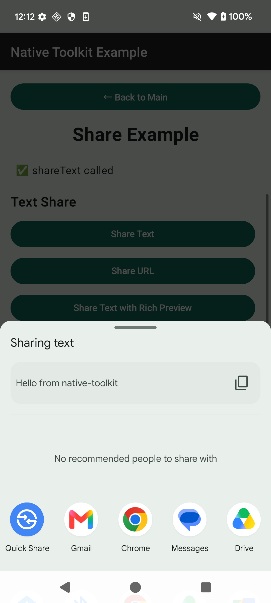
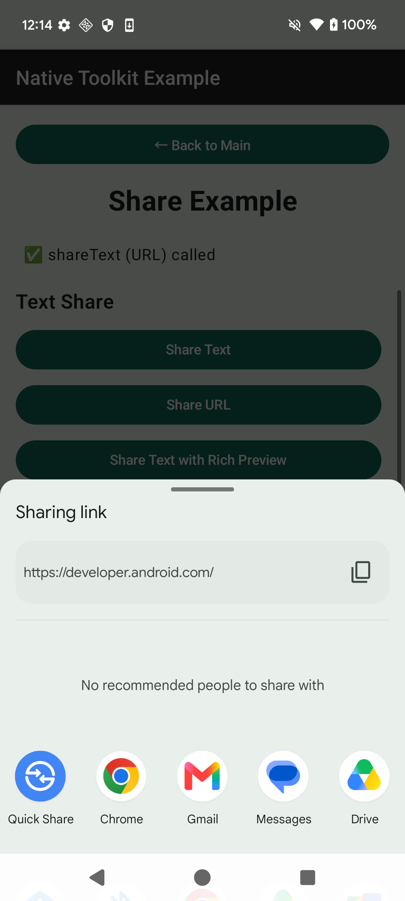
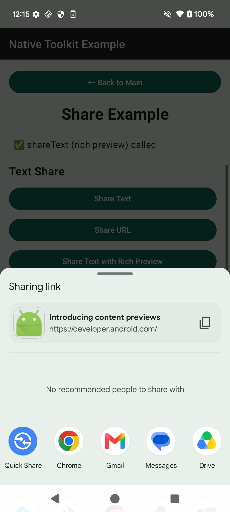
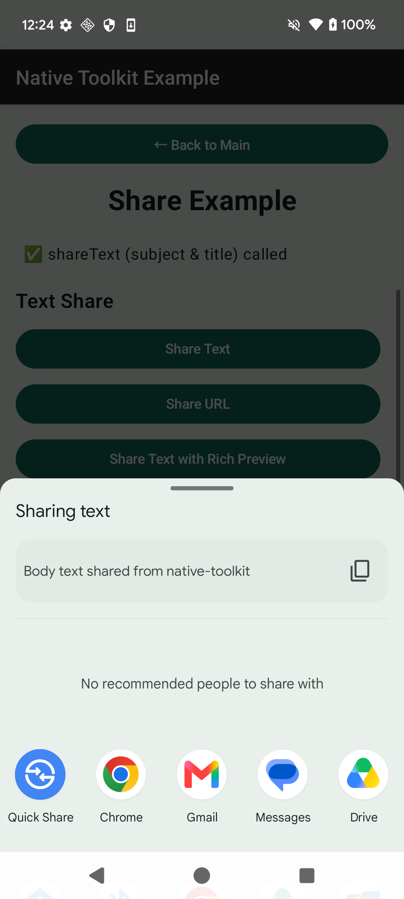
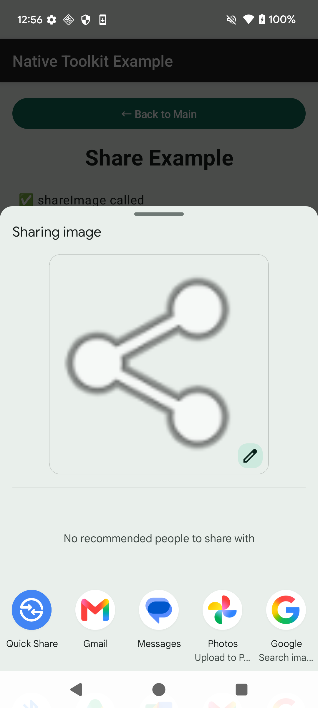
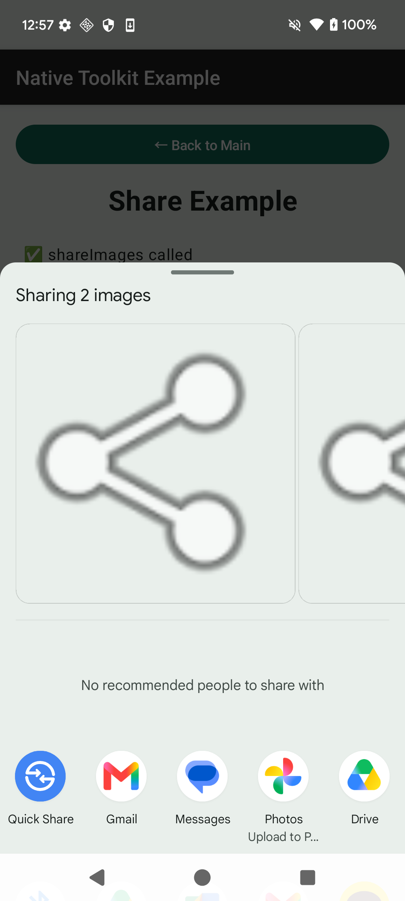
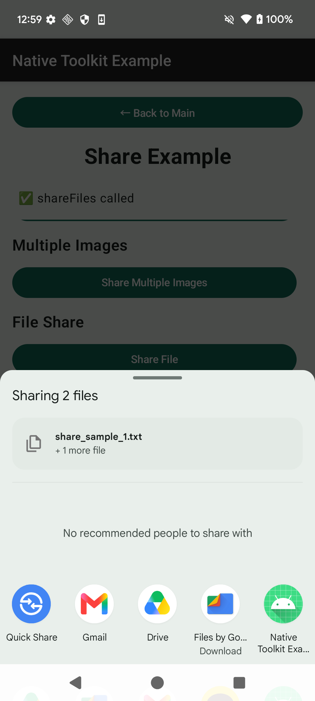
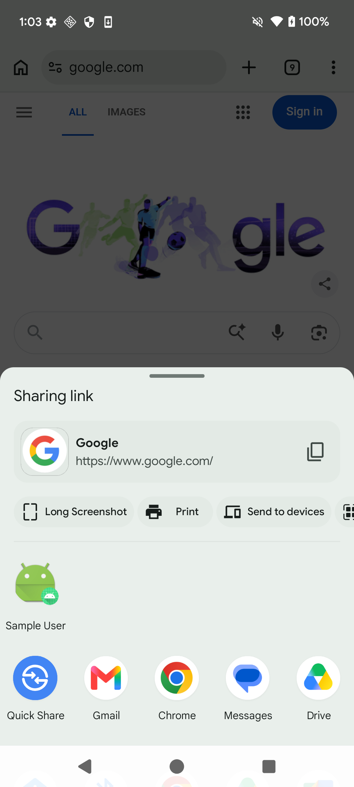

# Share 機能

Language:

- 日本語（このページ）
- English: [share.md](share.md)
- 한국어: [share.ko.md](share.ko.md)

← [マニュアルトップへ戻る](index.ja.md)

---

## 目次

- [Android](#android)
  - [セットアップ](#セットアップ)
  - [テキスト共有](#テキスト共有)
    - [テキストを共有](#テキストを共有)
    - [URL を共有](#url-を共有)
    - [リッチプレビュー付きテキスト共有](#リッチプレビュー付きテキスト共有)
    - [カスタムチューザーアクション付きテキスト共有](#カスタムチューザーアクション付きテキスト共有)
    - [チューザーアクションコールバック](#チューザーアクションコールバック)
    - [件名・タイトル付き共有](#件名タイトル付き共有)
  - [画像共有](#画像共有)
  - [複数画像の共有](#複数画像の共有)
  - [ファイル共有](#ファイル共有)
  - [複数ファイルの共有](#複数ファイルの共有)
  - [Direct Share Target](#direct-share-target)
    - [Direct Share Target を登録](#direct-share-target-を登録)
    - [Direct Share Target を削除](#direct-share-target-を削除)
  - [コールバック付き共有](#コールバック付き共有)
    - [基本コールバック](#基本コールバック)
    - [リッチプレビュー付きコールバック](#リッチプレビュー付きコールバック)
    - [保留中のコールバックをキャンセル](#保留中のコールバックをキャンセル)
  - [受信した共有コンテンツの処理](#受信した共有コンテンツの処理)
  - [エラー処理](#エラー処理)

---

## Android

- ライブラリ: `android-native-toolkit-1.2.0.aar`
- 最小 SDK: Android 12 (API 31)
- カスタムチューザーアクション: Android 14 (API 34) 以上

### セットアップ

#### Android ネイティブ（AAR）

1. `android-native-toolkit-1.2.0.aar` を `app/libs` に配置する。
2. `app/build.gradle.kts` に依存関係を追加する:

```kotlin
dependencies {
    implementation(files("libs/android-native-toolkit-1.2.0.aar"))
}
```

3. ファイル・画像共有のために `AndroidManifest.xml` に `FileProvider` を宣言する:

```xml
<provider
    android:name="androidx.core.content.FileProvider"
    android:authorities="${applicationId}.fileprovider"
    android:exported="false"
    android:grantUriPermissions="true">
    <meta-data
        android:name="android.support.FILE_PROVIDER_PATHS"
        android:resource="@xml/file_paths" />
</provider>
```

4. `res/xml/file_paths.xml` を作成する:

```xml
<?xml version="1.0" encoding="utf-8"?>
<paths>
    <cache-path name="share_cache" path="." />
    <external-cache-path name="share_external_cache" path="." />
    <files-path name="share_files" path="." />
</paths>
```

---

### テキスト共有

#### テキストを共有

```kotlin
val shareUseCases = ShareUseCases(activity)

try {
    shareUseCases.shareText(
        ShareContent(text = "Hello from native-toolkit"),
        chooserActionsJson = "[]"
    )
} catch (e: ShareDomainError) {
    // エラー処理
}
```

<p align="center">
    
</p>

#### URL を共有

```kotlin
shareUseCases.shareText(
    ShareContent(
        text = "https://developer.android.com/",
        mimeType = "text/plain"
    ),
    chooserActionsJson = "[]"
)
```

<p align="center">
    
</p>

#### リッチプレビュー付きテキスト共有

リッチプレビューには Android 31 以上と有効なサムネイルファイルパスが必要です。

```kotlin
val bmp = BitmapFactory.decodeResource(context.resources, android.R.mipmap.sym_def_app_icon)
val file = File(context.cacheDir, "share_preview.png")
file.outputStream().use { bmp.compress(Bitmap.CompressFormat.PNG, 100, it) }

shareUseCases.shareText(
    ShareContent(
        text = "https://developer.android.com/",
        mimeType = "text/plain"
    ),
    chooserActionsJson = "[]",
    SharePreviewOptions(
        title = "Introducing content previews",
        thumbnailPath = file.absolutePath
    )
)
```

<p align="center">
    
</p>

#### カスタムチューザーアクション付きテキスト共有

カスタムチューザーアクションは Android 14 (API 34) 以上でのみ有効です。それ以前のデバイスでは `chooserActionsJson` パラメータは無視されます。

- `intentAction` は**一意・非空**であり、`android.intent.action.SEND` は使用できません。
- 推奨 namespace: `${applicationId}.share.action.<name>`

```kotlin
val bmp = BitmapFactory.decodeResource(context.resources, android.R.drawable.ic_menu_edit)
val iconBase64 = ByteArrayOutputStream().use { baos ->
    bmp.compress(Bitmap.CompressFormat.PNG, 100, baos)
    Base64.encodeToString(baos.toByteArray(), Base64.NO_WRAP)
}

val chooserActionsJson = JSONArray().put(
    JSONObject().apply {
        put("label", "Custom")
        put("iconBase64", iconBase64)
        put("intentAction", "com.example.myapp.share.action.CUSTOM")
    }
).toString()

shareUseCases.shareText(
    ShareContent(
        text = "Shared with a custom chooser action",
        mimeType = "text/plain"
    ),
    chooserActionsJson = chooserActionsJson
)
```

<p align="center">
    
</p>

カスタムアクションがタップされたときにコールバックを受け取るには、[チューザーアクションコールバック](#チューザーアクションコールバック) を参照してください。

#### チューザーアクションコールバック

`AndroidManifest.xml` に `BroadcastReceiver` を宣言します。`<action>` の `android:name` は `chooserActionsJson` に渡した `intentAction` と一致させる必要があります。

```xml
<receiver
    android:name=".ShareChooserActionReceiver"
    android:exported="false">
    <intent-filter>
        <action android:name="com.example.myapp.share.action.CUSTOM" />
    </intent-filter>
</receiver>
```

レシーバーを実装します:

```kotlin
class ShareChooserActionReceiver : BroadcastReceiver() {
    override fun onReceive(context: Context?, intent: Intent?) {
        if (context != null) {
            Toast.makeText(context, "Custom chooser action tapped", Toast.LENGTH_SHORT).show()
        }
    }

    companion object {
        const val ACTION_CUSTOM_CHOOSER = "com.example.myapp.share.action.CUSTOM"
    }
}
```

<p align="center">
    
</p>

#### 件名・タイトル付き共有

`subject` はメールの件名を設定します。`title` は Sharesheet のタイトルを設定します。

```kotlin
shareUseCases.shareText(
    ShareContent(
        text = "Body text shared from native-toolkit",
        title = "Choose an app",
        subject = "Sample subject line",
        mimeType = "text/plain"
    ),
    chooserActionsJson = "[]"
)
```

<p align="center">
    
</p>

---

### 画像共有

```kotlin
val bmp = BitmapFactory.decodeResource(context.resources, android.R.drawable.ic_menu_share)
val file = File(context.cacheDir, "share_sample.png")
file.outputStream().use { bmp.compress(Bitmap.CompressFormat.PNG, 100, it) }

shareUseCases.shareImage(file.absolutePath, "image/png")
```

<p align="center">
    
</p>

---

### 複数画像の共有

```kotlin
val bmp = BitmapFactory.decodeResource(context.resources, android.R.drawable.ic_menu_share)
val file1 = File(context.cacheDir, "share_sample_1.png")
val file2 = File(context.cacheDir, "share_sample_2.png")
file1.outputStream().use { bmp.compress(Bitmap.CompressFormat.PNG, 100, it) }
file2.outputStream().use { bmp.compress(Bitmap.CompressFormat.PNG, 100, it) }

shareUseCases.shareImages(listOf(file1.absolutePath, file2.absolutePath))
```

<p align="center">
    
</p>

---

### ファイル共有

```kotlin
val file = File(context.cacheDir, "share_sample.txt")
    .apply { writeText("Share sample from native-toolkit") }

shareUseCases.shareFile(file.absolutePath)
```

<p align="center">
    
</p>

---

### 複数ファイルの共有

```kotlin
val file1 = File(context.cacheDir, "share_sample_1.txt")
    .apply { writeText("Share sample 1 from native-toolkit") }
val file2 = File(context.cacheDir, "share_sample_2.txt")
    .apply { writeText("Share sample 2 from native-toolkit") }

shareUseCases.shareFiles(listOf(file1.absolutePath, file2.absolutePath))
```

<p align="center">
    
</p>

---

### Direct Share Target

Direct Share Target は、ユーザーがアプリを選択しなくても Sharesheet に候補として表示されるショートカットです。

#### Direct Share Target を登録

```kotlin
val bmp = BitmapFactory.decodeResource(context.resources, android.R.mipmap.sym_def_app_icon)
val baos = ByteArrayOutputStream()
bmp.compress(Bitmap.CompressFormat.PNG, 100, baos)
val iconBytes = baos.toByteArray()

shareUseCases.registerDirectShareTarget(
    DirectShareTarget(
        id = "sample_1",
        label = "Sample User",
        category = "android.shortcut.conversation"
    ),
    iconBytes
)
```

<p align="center">
    
</p>

#### Direct Share Target を削除

```kotlin
shareUseCases.removeDirectShareTargets(listOf("sample_1"))
```

<p align="center">
    
</p>

---

### コールバック付き共有

`shareWithCallback` は Sharesheet を開き、ユーザーが選択したアプリのパッケージ名を `onResult` で通知します。`onFinished` は選択の有無にかかわらず Sharesheet が閉じられたときに呼ばれます。

#### 基本コールバック

```kotlin
shareUseCases.shareWithCallback(
    ShareContent(text = "Hello with callback from native-toolkit")
) { pkg ->
    // pkg == null の場合、選択されたがパッケージ名が取得できなかった
    val status = if (pkg != null) "Selected: $pkg" else "Shared (package unavailable)"
}
```

<p align="center">
    
</p>

ユーザーが選択する前にキャンセルする場合は `cancelPendingCallback()` を呼びます。

#### リッチプレビュー付きコールバック

```kotlin
val bmp = BitmapFactory.decodeResource(context.resources, android.R.mipmap.sym_def_app_icon)
val file = File(context.cacheDir, "callback_preview.png")
file.outputStream().use { bmp.compress(Bitmap.CompressFormat.PNG, 100, it) }

shareUseCases.shareWithCallback(
    ShareContent(
        text = "https://developer.android.com/",
        mimeType = "text/plain"
    ),
    SharePreviewOptions(
        title = "Callback with rich preview",
        thumbnailPath = file.absolutePath
    ),
    onResult = { pkg ->
        val status = if (pkg != null) "Selected: $pkg" else "Shared (package unavailable)"
    },
    onFinished = {
        // Sharesheet が閉じられた
    }
)
```

<p align="center">
    
</p>

#### 保留中のコールバックをキャンセル

保留中の `shareWithCallback` BroadcastReceiver をキャンセルします。画面終了時に呼び出してレシーバーのリークを防いでください。

```kotlin
shareUseCases.cancelPendingCallback()
```

Composable 画面が破棄されたときに自動でキャンセルする場合:

```kotlin
DisposableEffect(shareUseCases) {
    onDispose { shareUseCases.cancelPendingCallback() }
}
```

---

### 受信した共有コンテンツの処理

サンプルアプリでは、他アプリから `ACTION_SEND` / `ACTION_SEND_MULTIPLE` で送られた共有コンテンツの受信も示しています。

受信するには `AndroidManifest.xml` の Activity に intent-filter を追加し、`onCreate` / `onNewIntent` で処理します:

```xml
<activity
    android:name=".MainActivity"
    android:launchMode="singleTop">
    <intent-filter>
        <action android:name="android.intent.action.SEND" />
        <category android:name="android.intent.category.DEFAULT" />
        <data android:mimeType="text/*" />
    </intent-filter>
    <intent-filter>
        <action android:name="android.intent.action.SEND" />
        <category android:name="android.intent.category.DEFAULT" />
        <data android:mimeType="image/*" />
    </intent-filter>
    <intent-filter>
        <action android:name="android.intent.action.SEND_MULTIPLE" />
        <category android:name="android.intent.category.DEFAULT" />
        <data android:mimeType="image/*" />
    </intent-filter>
</activity>
```

---

### エラー処理

`ShareUseCases` は `ShareDomainError` のサブタイプをスローします。

| エラー | 原因 | エラーメッセージ |
|---|---|---|
| `EmptyContent` | `text` が空白 | `"Share content is empty. Please provide text or a file path."` |
| `FileNotFound` | ファイルパスが存在しない | `"File not found: <path>"` |
| `IllegalFileAccess` | アクセス可能なディレクトリ外のファイル | `"File cannot be shared: <path>. Ensure the file is in a supported directory."` |
| `InvalidMimeType` | 未対応の MIME タイプ | `"Invalid MIME type: <mimeType>"` |
| `NoShareTarget` | 共有 Intent を処理できるアプリがない | `"No app available to handle this share request."` |
| `DirectShareRegistrationFailed` | ショートカット登録失敗 | `"Failed to register Direct Share target: <reason>"` |
| `EmptyIdList` | `removeDirectShareTargets` の `ids` が空 | `"No shortcut IDs provided for removal."` |
| `EmptyFileList` | `shareFiles` / `shareImages` の `filePaths` が空 | `"No file paths provided for share."` |
| `InvalidBase64Icon` | アイコンの Base64 デコード失敗 | `"Invalid icon data for Direct Share target: <id>"` |

```kotlin
try {
    shareUseCases.shareText(ShareContent(text = "Hello"), chooserActionsJson = "[]")
} catch (e: ShareDomainError.NoShareTarget) {
    // 共有できるアプリがない
} catch (e: ShareDomainError.EmptyContent) {
    // テキストが空白
} catch (e: ShareDomainError) {
    // その他のドメインエラー
}
```
