# Share Feature

Language:

- 日本語: [share.ja.md](share.ja.md)
- English (this page)
- 한국어: [share.ko.md](share.ko.md)

← [Back to Manual Top](index.md)

---

## Table of Contents

- [Android](#android)
  - [Setup](#setup)
  - [Text Share](#text-share)
    - [Share Text](#share-text)
    - [Share URL](#share-url)
    - [Share Text with Rich Preview](#share-text-with-rich-preview)
    - [Share Text with Custom Chooser Action](#share-text-with-custom-chooser-action)
    - [Chooser Action Callback](#chooser-action-callback)
    - [Share with Subject and Title](#share-with-subject-and-title)
  - [Image Share](#image-share)
  - [Multiple Images](#multiple-images)
  - [File Share](#file-share)
  - [Multiple Files](#multiple-files)
  - [Direct Share Target](#direct-share-target)
    - [Register Direct Share Target](#register-direct-share-target)
    - [Remove Direct Share Target](#remove-direct-share-target)
  - [Share with Callback](#share-with-callback)
    - [Basic Callback](#basic-callback)
    - [Callback with Rich Preview](#callback-with-rich-preview)
    - [Cancel Pending Callback](#cancel-pending-callback)
  - [Receiving Incoming Shares](#receiving-incoming-shares)
  - [Error Handling](#error-handling)
- [iOS](#ios)
  - [IosShareManager](#iossharemanager)
  - [Setup](#setup-1)
  - [Text Share](#text-share-1)
    - [Share Text](#share-text-1)
    - [Share URL](#share-url-1)
    - [Share URL with Preview](#share-url-with-preview)
  - [Image Share](#image-share-1)
    - [Share Image](#share-image)
    - [Share Multiple Images](#share-multiple-images)
  - [File Share](#file-share-1)
    - [Share File](#share-file)
    - [Share Multiple Files](#share-multiple-files)
  - [Combined Content](#combined-content)
    - [Share Multiple Items](#share-multiple-items)
    - [Share with Subject](#share-with-subject)
    - [Exclude Activity Types](#exclude-activity-types)
  - [Error Handling](#error-handling-1)
- [macOS](#macos)
  - [MacShareManager](#macsharemanager)
  - [Setup](#setup-2)
  - [Picker - Basic](#picker---basic)
    - [Share Text](#share-text-2)
    - [Share URL](#share-url-2)
    - [Share Image](#share-image-1)
    - [Share File](#share-file-1)
  - [Picker - Multiple](#picker---multiple)
    - [Share Multiple Images](#share-multiple-images-1)
    - [Share Multiple Files](#share-multiple-files-1)
    - [Share Text and URL](#share-text-and-url)
  - [Picker - Filter](#picker---filter)
    - [Share Excluding Services](#share-excluding-services)
  - [Direct Service](#direct-service)
    - [Share via Mail](#share-via-mail)
    - [Check if a Service Can Perform](#check-if-a-service-can-perform)
  - [Error Handling](#error-handling-2)

---

## Android

- Library: `android-native-toolkit-1.2.0.aar`
- Minimum SDK: Android 12 (API 31)
- Custom Chooser Actions: Android 14 (API 34)+

### Setup

#### Android native (AAR)

1. Place `android-native-toolkit-1.2.0.aar` in `app/libs`.
2. Add dependency in `app/build.gradle.kts`:

```kotlin
dependencies {
    implementation(files("libs/android-native-toolkit-1.2.0.aar"))
}
```

3. Declare a `FileProvider` in `AndroidManifest.xml` for file/image sharing:

```xml
<provider
    android:name="androidx.core.content.FileProvider"
    android:authorities="${applicationId}.fileprovider"
    android:exported="false"
    android:grantUriPermissions="true">
    <meta-data
        android:name="android.support.FILE_PROVIDER_PATHS"
        android:resource="@xml/file_paths" />
</provider>
```

4. Create `res/xml/file_paths.xml`:

```xml
<?xml version="1.0" encoding="utf-8"?>
<paths>
    <cache-path name="share_cache" path="." />
    <external-cache-path name="share_external_cache" path="." />
    <files-path name="share_files" path="." />
</paths>
```

---

### Text Share

#### Share Text

```kotlin
val shareUseCases = ShareUseCases(activity)

try {
    shareUseCases.shareText(
        ShareContent(text = "Hello from native-toolkit"),
        chooserActionsJson = "[]"
    )
} catch (e: ShareDomainError) {
    // handle error
}
```

<p align="center">
    
</p>

#### Share URL

```kotlin
shareUseCases.shareText(
    ShareContent(
        text = "https://developer.android.com/",
        mimeType = "text/plain"
    ),
    chooserActionsJson = "[]"
)
```

<p align="center">
    
</p>

#### Share Text with Rich Preview

Rich preview requires Android 31+ and a valid thumbnail file path.

```kotlin
val bmp = BitmapFactory.decodeResource(context.resources, android.R.mipmap.sym_def_app_icon)
val file = File(context.cacheDir, "share_preview.png")
file.outputStream().use { bmp.compress(Bitmap.CompressFormat.PNG, 100, it) }

shareUseCases.shareText(
    ShareContent(
        text = "https://developer.android.com/",
        mimeType = "text/plain"
    ),
    chooserActionsJson = "[]",
    SharePreviewOptions(
        title = "Introducing content previews",
        thumbnailPath = file.absolutePath
    )
)
```

<p align="center">
    
</p>

#### Share Text with Custom Chooser Action

Custom chooser actions require Android 14 (API 34)+. On older devices the `chooserActionsJson` parameter is ignored.

- `intentAction` must be **unique, non-blank**, and must not be `android.intent.action.SEND`.
- Recommended namespace: `${applicationId}.share.action.<name>`

```kotlin
val bmp = BitmapFactory.decodeResource(context.resources, android.R.drawable.ic_menu_edit)
val iconBase64 = ByteArrayOutputStream().use { baos ->
    bmp.compress(Bitmap.CompressFormat.PNG, 100, baos)
    Base64.encodeToString(baos.toByteArray(), Base64.NO_WRAP)
}

val chooserActionsJson = JSONArray().put(
    JSONObject().apply {
        put("label", "Custom")
        put("iconBase64", iconBase64)
        put("intentAction", "com.example.myapp.share.action.CUSTOM")
    }
).toString()

shareUseCases.shareText(
    ShareContent(
        text = "Shared with a custom chooser action",
        mimeType = "text/plain"
    ),
    chooserActionsJson = chooserActionsJson
)
```

<p align="center">
    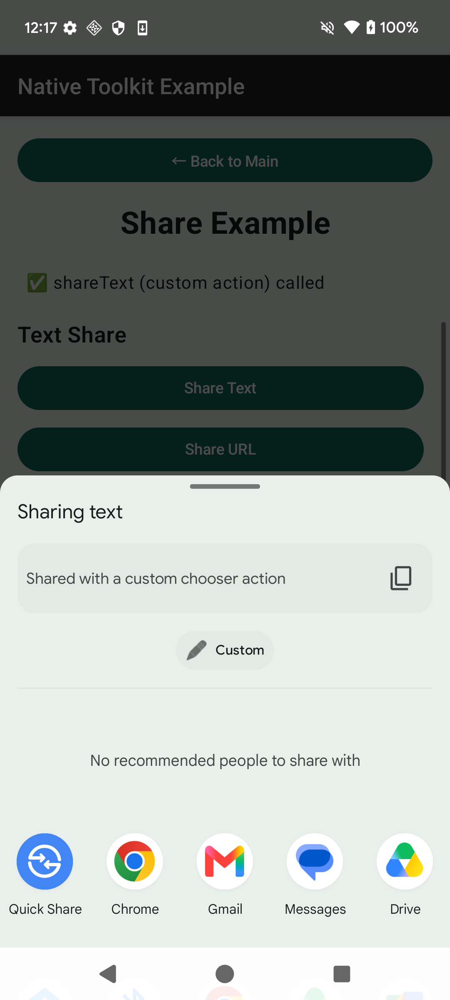
</p>

To receive a callback when the custom action is tapped, see [Chooser Action Callback](#chooser-action-callback).

#### Chooser Action Callback

Declare a `BroadcastReceiver` in `AndroidManifest.xml`. The `android:name` of the `<action>` must match the `intentAction` passed in `chooserActionsJson`.

```xml
<receiver
    android:name=".ShareChooserActionReceiver"
    android:exported="false">
    <intent-filter>
        <action android:name="com.example.myapp.share.action.CUSTOM" />
    </intent-filter>
</receiver>
```

Implement the receiver:

```kotlin
class ShareChooserActionReceiver : BroadcastReceiver() {
    override fun onReceive(context: Context?, intent: Intent?) {
        if (context != null) {
            Toast.makeText(context, "Custom chooser action tapped", Toast.LENGTH_SHORT).show()
        }
    }

    companion object {
        const val ACTION_CUSTOM_CHOOSER = "com.example.myapp.share.action.CUSTOM"
    }
}
```

<p align="center">
    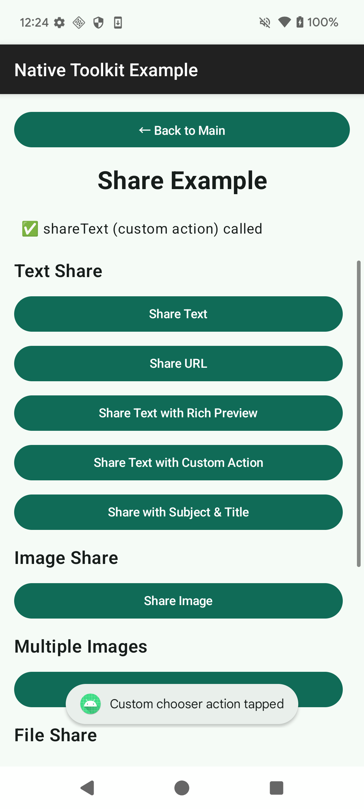
</p>

#### Share with Subject and Title

`subject` sets the email subject line. `title` sets the Sharesheet title.

```kotlin
shareUseCases.shareText(
    ShareContent(
        text = "Body text shared from native-toolkit",
        title = "Choose an app",
        subject = "Sample subject line",
        mimeType = "text/plain"
    ),
    chooserActionsJson = "[]"
)
```

<p align="center">
    
</p>

---

### Image Share

```kotlin
val bmp = BitmapFactory.decodeResource(context.resources, android.R.drawable.ic_menu_share)
val file = File(context.cacheDir, "share_sample.png")
file.outputStream().use { bmp.compress(Bitmap.CompressFormat.PNG, 100, it) }

shareUseCases.shareImage(file.absolutePath, "image/png")
```

<p align="center">
    
</p>

---

### Multiple Images

```kotlin
val bmp = BitmapFactory.decodeResource(context.resources, android.R.drawable.ic_menu_share)
val file1 = File(context.cacheDir, "share_sample_1.png")
val file2 = File(context.cacheDir, "share_sample_2.png")
file1.outputStream().use { bmp.compress(Bitmap.CompressFormat.PNG, 100, it) }
file2.outputStream().use { bmp.compress(Bitmap.CompressFormat.PNG, 100, it) }

shareUseCases.shareImages(listOf(file1.absolutePath, file2.absolutePath))
```

<p align="center">
    
</p>

---

### File Share

```kotlin
val file = File(context.cacheDir, "share_sample.txt")
    .apply { writeText("Share sample from native-toolkit") }

shareUseCases.shareFile(file.absolutePath)
```

<p align="center">
    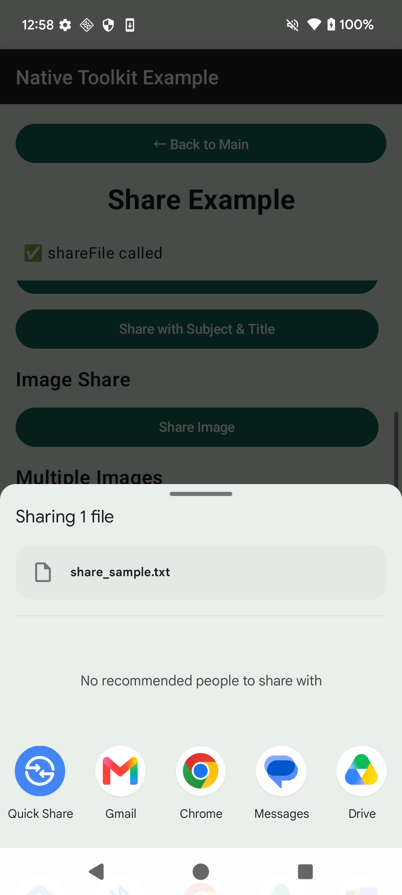
</p>

---

### Multiple Files

```kotlin
val file1 = File(context.cacheDir, "share_sample_1.txt")
    .apply { writeText("Share sample 1 from native-toolkit") }
val file2 = File(context.cacheDir, "share_sample_2.txt")
    .apply { writeText("Share sample 2 from native-toolkit") }

shareUseCases.shareFiles(listOf(file1.absolutePath, file2.absolutePath))
```

<p align="center">
    
</p>

---

### Direct Share Target

Direct Share Targets appear in the Sharesheet as suggested recipients without requiring the user to select an app first.

#### Register Direct Share Target

```kotlin
val bmp = BitmapFactory.decodeResource(context.resources, android.R.mipmap.sym_def_app_icon)
val baos = ByteArrayOutputStream()
bmp.compress(Bitmap.CompressFormat.PNG, 100, baos)
val iconBytes = baos.toByteArray()

shareUseCases.registerDirectShareTarget(
    DirectShareTarget(
        id = "sample_1",
        label = "Sample User",
        category = "android.shortcut.conversation"
    ),
    iconBytes
)
```

<p align="center">
    
</p>

#### Remove Direct Share Target

```kotlin
shareUseCases.removeDirectShareTargets(listOf("sample_1"))
```

<p align="center">
    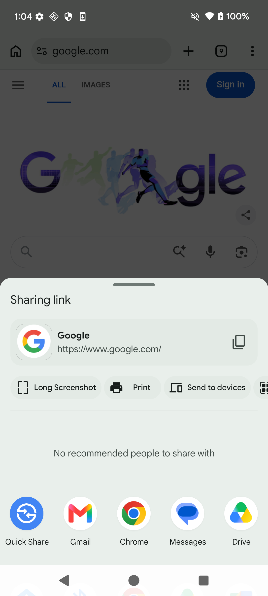
</p>

---

### Share with Callback

`shareWithCallback` opens the Sharesheet and reports the selected app package name via `onResult`. `onFinished` is called when the Sharesheet is dismissed regardless of selection.

#### Basic Callback

```kotlin
shareUseCases.shareWithCallback(
    ShareContent(text = "Hello with callback from native-toolkit")
) { pkg ->
    // pkg == null if selected but the package was unavailable
    val status = if (pkg != null) "Selected: $pkg" else "Shared (package unavailable)"
}
```

<p align="center">
    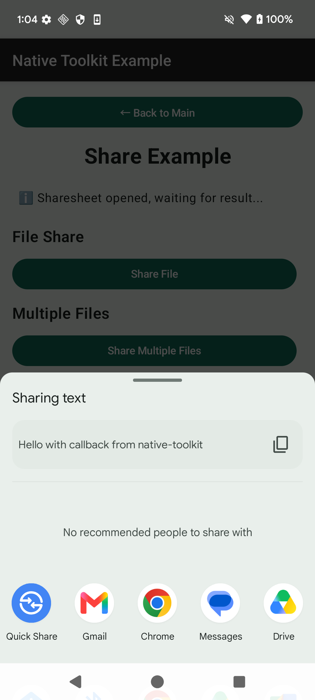
</p>

To cancel the pending receiver before the user selects, call `cancelPendingCallback()`.

#### Callback with Rich Preview

```kotlin
val bmp = BitmapFactory.decodeResource(context.resources, android.R.mipmap.sym_def_app_icon)
val file = File(context.cacheDir, "callback_preview.png")
file.outputStream().use { bmp.compress(Bitmap.CompressFormat.PNG, 100, it) }

shareUseCases.shareWithCallback(
    ShareContent(
        text = "https://developer.android.com/",
        mimeType = "text/plain"
    ),
    SharePreviewOptions(
        title = "Callback with rich preview",
        thumbnailPath = file.absolutePath
    ),
    onResult = { pkg ->
        val status = if (pkg != null) "Selected: $pkg" else "Shared (package unavailable)"
    },
    onFinished = {
        // Sharesheet dismissed
    }
)
```

<p align="center">
    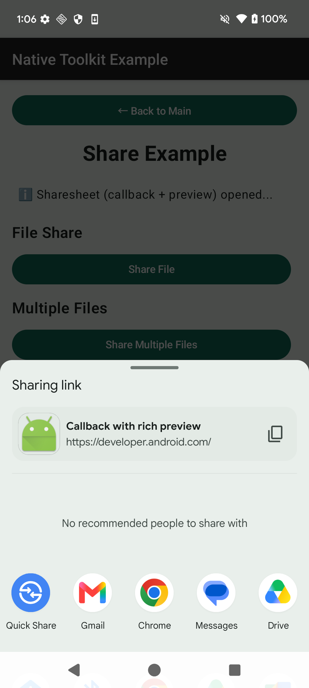
</p>

#### Cancel Pending Callback

Cancels the pending `shareWithCallback` BroadcastReceiver. Call this when the current screen is being torn down to avoid leaking the receiver.

```kotlin
shareUseCases.cancelPendingCallback()
```

To cancel automatically when a composable screen is removed:

```kotlin
DisposableEffect(shareUseCases) {
    onDispose { shareUseCases.cancelPendingCallback() }
}
```

---

### Receiving Incoming Shares

The sample app also demonstrates receiving content shared from other apps via `ACTION_SEND` and `ACTION_SEND_MULTIPLE`.

To receive incoming shares, declare intent filters in `AndroidManifest.xml` on the receiving `Activity` and handle them in `onCreate` / `onNewIntent`:

```xml
<activity
    android:name=".MainActivity"
    android:launchMode="singleTop">
    <intent-filter>
        <action android:name="android.intent.action.SEND" />
        <category android:name="android.intent.category.DEFAULT" />
        <data android:mimeType="text/*" />
    </intent-filter>
    <intent-filter>
        <action android:name="android.intent.action.SEND" />
        <category android:name="android.intent.category.DEFAULT" />
        <data android:mimeType="image/*" />
    </intent-filter>
    <intent-filter>
        <action android:name="android.intent.action.SEND_MULTIPLE" />
        <category android:name="android.intent.category.DEFAULT" />
        <data android:mimeType="image/*" />
    </intent-filter>
</activity>
```

---

### Error Handling

`ShareUseCases` throws `ShareDomainError` subtypes.

| Error | Cause | Error message |
|---|---|---|
| `EmptyContent` | `text` is blank | `"Share content is empty. Please provide text or a file path."` |
| `FileNotFound` | File path does not exist | `"File not found: <path>"` |
| `IllegalFileAccess` | File is outside accessible directories | `"File cannot be shared: <path>. Ensure the file is in a supported directory."` |
| `InvalidMimeType` | Unsupported MIME type | `"Invalid MIME type: <mimeType>"` |
| `NoShareTarget` | No app can handle the share intent | `"No app available to handle this share request."` |
| `DirectShareRegistrationFailed` | Shortcut registration failed | `"Failed to register Direct Share target: <reason>"` |
| `EmptyIdList` | `ids` list is empty in removeDirectShareTargets | `"No shortcut IDs provided for removal."` |
| `EmptyFileList` | `filePaths` list is empty in shareFiles / shareImages | `"No file paths provided for share."` |
| `InvalidBase64Icon` | Base64 decoding failed for icon | `"Invalid icon data for Direct Share target: <id>"` |

```kotlin
try {
    shareUseCases.shareText(ShareContent(text = "Hello"), chooserActionsJson = "[]")
} catch (e: ShareDomainError.NoShareTarget) {
    // No app can handle this share
} catch (e: ShareDomainError.EmptyContent) {
    // Text was blank
} catch (e: ShareDomainError) {
    // Other domain error
}
```

---

## iOS

- Library: `ios-native-toolkit-1.2.0.xcframework`
- Minimum Deployment Target: iOS 18
- Scope: sending only (presenting the system share sheet via `UIActivityViewController`). Receiving incoming shares (Share Extension) is not included.

### IosShareManager

`IosShareManager` is a singleton class that presents the system share sheet on iOS.

<p align="center">
    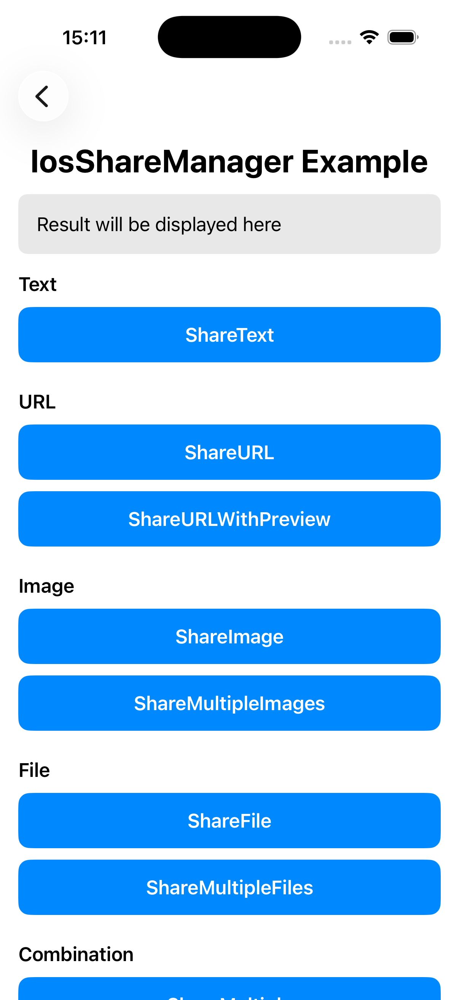
</p>

### Setup

1. Add `ios-native-toolkit-1.2.0.xcframework` to your Xcode project (drag it into the project and set "Embed & Sign" in the target's Frameworks, Libraries, and Embedded Content).
2. Import the library where you present the share sheet:

```swift
import IosLibrary
```

No additional initialization is required.

`IosShareManager.share` offers two calling styles:

- `async throws` (preferred for native Swift callers): returns a typed `ShareResult` and throws `ShareError` on failure.
- Callback (used by the Unity Bridge, also available in Swift): `(isSuccess, completed, activityType, errorMessage)`.

```swift
// async throws (recommended for Swift callers)
Task {
    do {
        let result = try await IosShareManager.shared.share(
            content: ShareContent(items: [.text("Hello")])
        )
        // result.completed == false means the user cancelled (not an error)
        print(result.completed, result.activityType ?? "nil")
    } catch {
        print(error.localizedDescription)
    }
}

// callback (equivalent)
IosShareManager.shared.share(
    content: ShareContent(items: [.text("Hello")])
) { isSuccess, completed, activityType, errorMessage in
    print(isSuccess, completed, activityType ?? "nil", errorMessage ?? "nil")
}
```

The examples below use the `async throws` style. Because SwiftUI `Button` actions are synchronous, each call is wrapped in `Task { ... }`.

### Text Share

#### Share Text

```swift
Task {
    let result = try await IosShareManager.shared.share(
        content: ShareContent(items: [.text("Shared from IosLibraryExample")])
    )
    print(result.completed, result.activityType ?? "nil")
}
```

<p align="center">
    
</p>

#### Share URL

A URL is passed as a raw string. It is validated in the library: only `http`, `https`, and `file` schemes with a valid host are accepted (otherwise `ShareError.invalidURL` is thrown).

```swift
Task {
    let result = try await IosShareManager.shared.share(
        content: ShareContent(items: [.url("https://www.apple.com")])
    )
    print(result.completed, result.activityType ?? "nil")
}
```

<p align="center">
    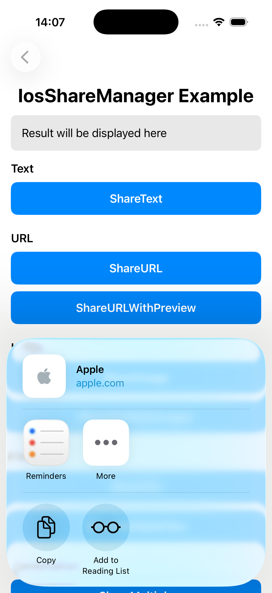
</p>

#### Share URL with Preview

Set `previewTitle` to show a rich link preview in the share sheet header immediately, without waiting for a network fetch.

```swift
Task {
    let result = try await IosShareManager.shared.share(
        content: ShareContent(
            items: [.url("https://www.apple.com")],
            previewTitle: "Apple"
        )
    )
    print(result.completed, result.activityType ?? "nil")
}
```

<p align="center">
    
</p>

### Image Share

#### Share Image

Pass the local file path of an image with `.imageFile(path:)`. The library loads it as a `UIImage` (throws `ShareError.imageLoadFailed` if it cannot be read).

```swift
guard let imagePath = Bundle.main.url(forResource: "app-icon-attachment", withExtension: "png")?.path else {
    return
}

Task {
    let result = try await IosShareManager.shared.share(
        content: ShareContent(items: [.imageFile(path: imagePath)])
    )
    print(result.completed, result.activityType ?? "nil")
}
```

<p align="center">
    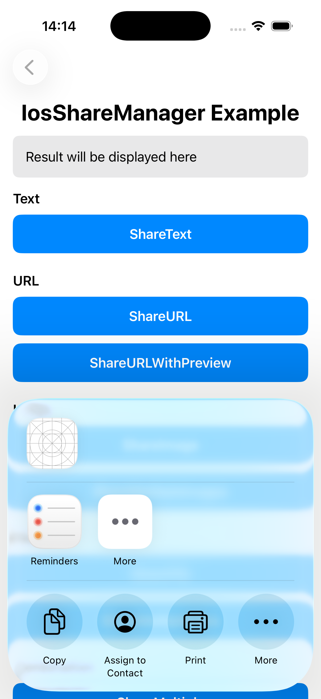
</p>

#### Share Multiple Images

`ShareContent.items` accepts multiple entries, so several images can be shared at once.

```swift
let imagePaths: [String] = /* local image file paths */

Task {
    let result = try await IosShareManager.shared.share(
        content: ShareContent(items: imagePaths.map { .imageFile(path: $0) })
    )
    print(result.completed, result.activityType ?? "nil")
}
```

<p align="center">
    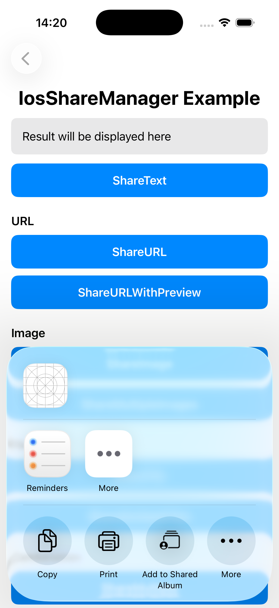
</p>

### File Share

#### Share File

Pass the local file path with `.file(path:)`. The library checks that the file exists (throws `ShareError.fileNotFound` otherwise).

```swift
let fileURL = FileManager.default.temporaryDirectory.appendingPathComponent("share-sample.txt")
try "Shared from IosLibraryExample.".write(to: fileURL, atomically: true, encoding: .utf8)

Task {
    let result = try await IosShareManager.shared.share(
        content: ShareContent(items: [.file(path: fileURL.path)])
    )
    print(result.completed, result.activityType ?? "nil")
}
```

<p align="center">
    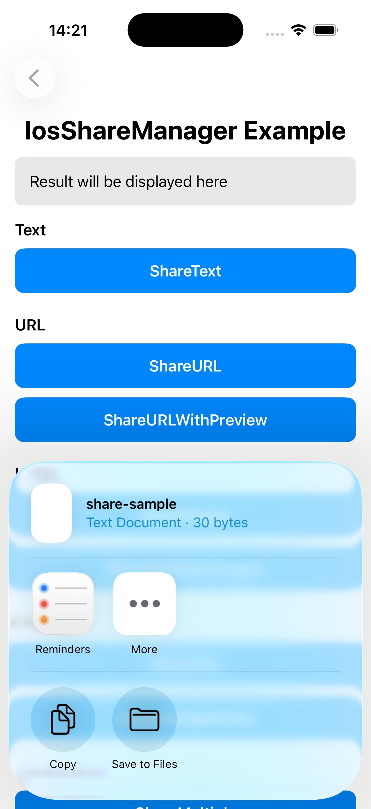
</p>

#### Share Multiple Files

```swift
let fileURLs: [URL] = /* local file URLs */

Task {
    let result = try await IosShareManager.shared.share(
        content: ShareContent(items: fileURLs.map { .file(path: $0.path) })
    )
    print(result.completed, result.activityType ?? "nil")
}
```

<p align="center">
    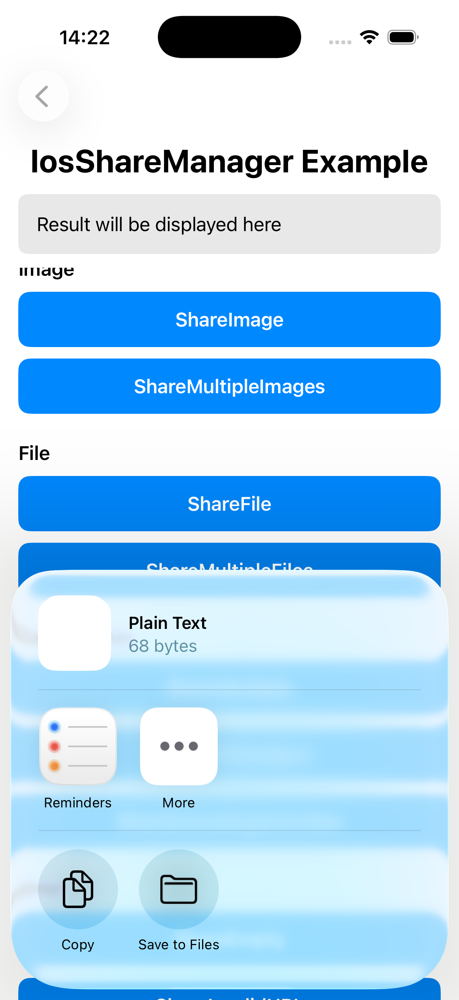
</p>

### Combined Content

#### Share Multiple Items

Mix different item types (text, URL, image, file) in a single share.

```swift
Task {
    let result = try await IosShareManager.shared.share(
        content: ShareContent(items: [
            .text("Check this out"),
            .url("https://www.apple.com")
        ])
    )
    print(result.completed, result.activityType ?? "nil")
}
```

<p align="center">
    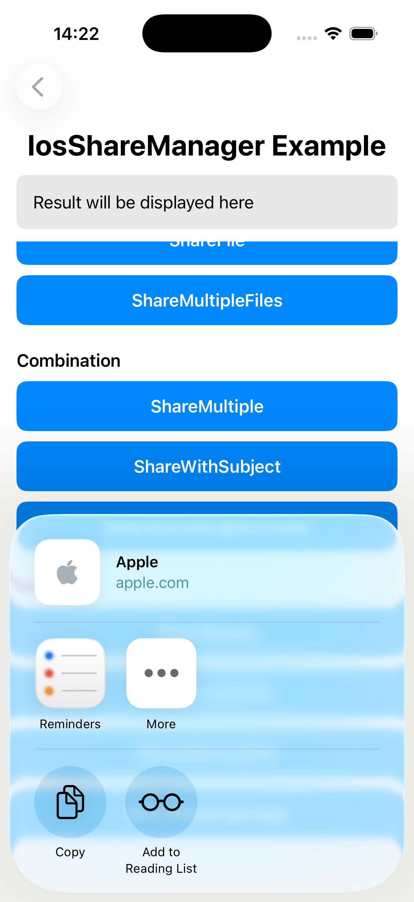
</p>

#### Share with Subject

`subject` is used by activities that support it (for example, the subject line in Mail).

```swift
Task {
    let result = try await IosShareManager.shared.share(
        content: ShareContent(
            items: [.text("Body text")],
            subject: "Sample Subject"
        )
    )
    print(result.completed, result.activityType ?? "nil")
}
```

<p align="center">
    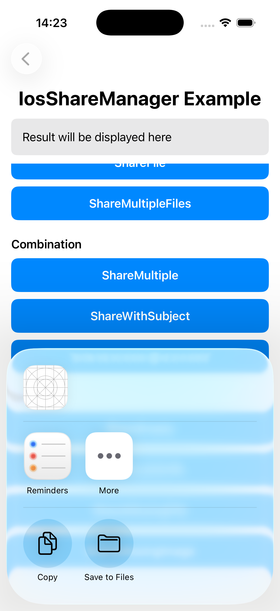
</p>

#### Exclude Activity Types

Pass raw activity type identifiers in `excludedActivityTypes` to hide them from the share sheet.

```swift
Task {
    let result = try await IosShareManager.shared.share(
        content: ShareContent(
            items: [.url("https://www.apple.com")],
            excludedActivityTypes: [
                "com.apple.UIKit.activity.CopyToPasteboard",
                "com.apple.UIKit.activity.PostToFacebook"
            ]
        )
    )
    print(result.completed, result.activityType ?? "nil")
}
```

<p align="center">
    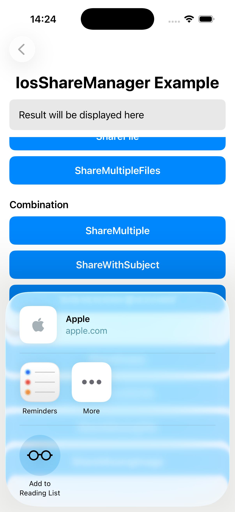
</p>

### Error Handling

The `async throws` API throws `ShareError` on failure. User cancellation is not an error: it is reported as `ShareResult.completed == false`.

| Error | Cause | Error message |
|---|---|---|
| `noValidItems` | `items` is empty | `"No shareable items were provided."` |
| `invalidURL(String)` | URL string is not a valid `http`/`https`/`file` URL | `"Invalid URL: <value>."` |
| `imageLoadFailed(path:)` | Image at the path could not be loaded | `"Failed to load image at path: <path>."` |
| `fileNotFound(path:)` | File at the path does not exist | `"File not found at path: <path>."` |
| `noRootViewController` | No root view controller available to present | `"No root view controller available to present the share sheet."` |
| `presentationFailed(Error)` | Presentation failed or the system reported an error | `"Failed to present the share sheet: <detail>."` |
| `unknown(Error)` | An unexpected error occurred | `"An unknown error occurred: <detail>."` |

```swift
Task {
    do {
        let result = try await IosShareManager.shared.share(
            content: ShareContent(items: [.text("Hello")])
        )
        if result.completed {
            // Shared successfully via result.activityType
        } else {
            // User cancelled
        }
    } catch let error as ShareError {
        // Typed error (e.g. .noValidItems, .invalidURL, .fileNotFound)
        print(error.localizedDescription)
    } catch {
        // Other error
    }
}
```

When using the callback API, failures are delivered as `isSuccess == false` with a non-nil `errorMessage`:

```swift
IosShareManager.shared.share(
    content: ShareContent(items: [])
) { isSuccess, completed, activityType, errorMessage in
    // isSuccess == false, errorMessage == "No shareable items were provided."
}
```

---

## macOS

- Library: `mac-native-toolkit-1.2.0.xcframework`
- Minimum Deployment Target: macOS 15
- Scope: sending only, via `NSSharingServicePicker` (picker) and `NSSharingService` (direct service execution). Receiving incoming shares is not included.
- macOS offers two ways to share: a **picker** that lets the user choose a service (`NSSharingServicePicker`), and **direct service execution** that runs a single named service without showing the picker (`NSSharingService`, for example launching Mail with prefilled `recipients`/`subject`).

### MacShareManager

`MacShareManager` is a singleton class that presents the system sharing service picker and performs individual sharing services on macOS.

**Important:** Present the picker only in response to a user-initiated action (for example, a button click). `NSSharingServicePicker.show(...)` requires a `mouseDown` event context, and the picker call path hops through `Task { @MainActor in ... }` internally, which does not formally guarantee that context is preserved. In the sample app included with this toolkit, the picker was confirmed to appear correctly and resolve (appear / cancel / complete) when triggered by a real click. Direct service execution (`shareViaService`, `share(content:serviceName:completion:)`) does not depend on `mouseDown` context and is the more robust path when reliability matters.

<p align="center">
    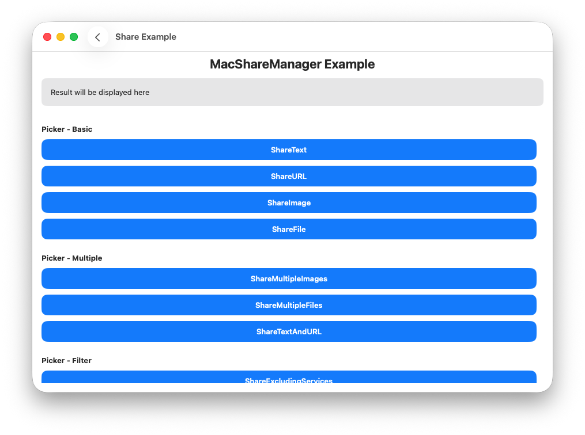
</p>

### Setup

1. Add `mac-native-toolkit-1.2.0.xcframework` to your Xcode project (drag it into the project and set "Embed & Sign" in the target's Frameworks, Libraries, and Embedded Content).
2. Import the library where you present the share picker or run a service:

```swift
import MacLibrary
```

No additional initialization is required.

`MacShareManager` offers two calling styles for each operation:

- `async throws` (preferred for native Swift callers): returns a typed `ShareResult` and throws `ShareError` on failure.
- Callback (used by the Unity Bridge, also available in Swift): `(isSuccess, completed, serviceName, errorMessage)`.

```swift
// async throws (recommended for Swift callers)
Task {
    do {
        let result = try await MacShareManager.shared.share(
            content: ShareContent(items: [.text("Hello")])
        )
        // result.completed == false means the user cancelled (not an error)
        print(result.completed, result.serviceName ?? "nil")
    } catch {
        print(error.localizedDescription)
    }
}

// callback (equivalent)
MacShareManager.shared.share(
    content: ShareContent(items: [.text("Hello")])
) { isSuccess, completed, serviceName, errorMessage in
    print(isSuccess, completed, serviceName ?? "nil", errorMessage ?? "nil")
}
```

The examples below use the `async throws` style. Because SwiftUI `Button` actions are synchronous, each call is wrapped in `Task { ... }`.

### Picker - Basic

#### Share Text

```swift
Task {
    let result = try await MacShareManager.shared.share(
        content: ShareContent(items: [.text("Shared from MacLibraryExample")])
    )
    print(result.completed, result.serviceName ?? "nil")
}
```

<p align="center">
    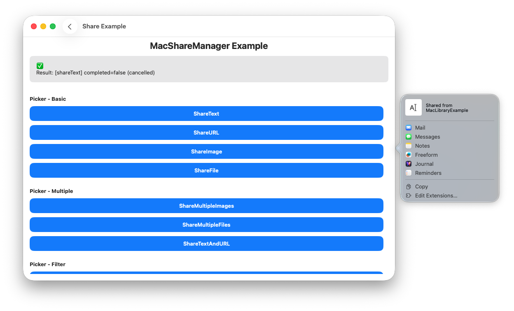
</p>

#### Share URL

A URL is passed as a raw string. It is validated in the library: only `http`, `https`, and `file` schemes with a valid host are accepted (otherwise `ShareError.invalidURL` is thrown).

```swift
Task {
    let result = try await MacShareManager.shared.share(
        content: ShareContent(items: [.url("https://www.apple.com")])
    )
    print(result.completed, result.serviceName ?? "nil")
}
```

<p align="center">
    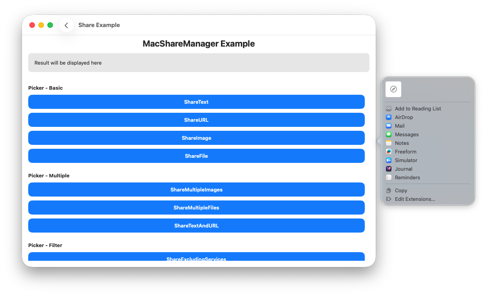
</p>

#### Share Image

Pass the local file path of an image with `.imageFile(path:)`. The library loads it as an `NSImage` (throws `ShareError.imageLoadFailed` if it cannot be read).

```swift
guard let image = NSImage(named: "test-image") else { return }
guard let tiffData = image.tiffRepresentation,
      let bitmap = NSBitmapImageRep(data: tiffData),
      let pngData = bitmap.representation(using: .png, properties: [:])
else { return }

let imageURL = FileManager.default.temporaryDirectory.appendingPathComponent("share-sample-image.png")
try pngData.write(to: imageURL)

Task {
    let result = try await MacShareManager.shared.share(
        content: ShareContent(items: [.imageFile(path: imageURL.path)])
    )
    print(result.completed, result.serviceName ?? "nil")
}
```

<p align="center">
    
</p>

#### Share File

Pass the local file path with `.file(path:)`. The library checks that the file exists (throws `ShareError.fileNotFound` otherwise).

```swift
let fileURL = FileManager.default.temporaryDirectory.appendingPathComponent("share-sample.txt")
try "Shared from MacLibraryExample.".write(to: fileURL, atomically: true, encoding: .utf8)

Task {
    let result = try await MacShareManager.shared.share(
        content: ShareContent(items: [.file(path: fileURL.path)])
    )
    print(result.completed, result.serviceName ?? "nil")
}
```

<p align="center">
    
</p>

### Picker - Multiple

#### Share Multiple Images

`ShareContent.items` accepts multiple entries, so several images can be shared at once (there is only one bundled sample image, so it is copied to distinct temporary files).

```swift
let imagePaths: [String] = /* local image file paths */

Task {
    let result = try await MacShareManager.shared.share(
        content: ShareContent(items: imagePaths.map { .imageFile(path: $0) })
    )
    print(result.completed, result.serviceName ?? "nil")
}
```

<p align="center">
    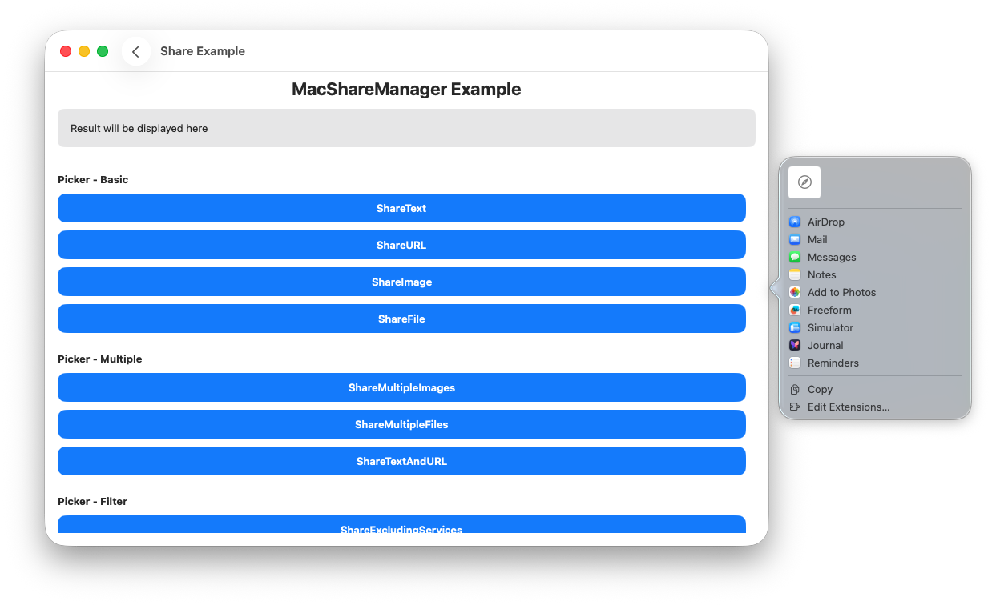
</p>

#### Share Multiple Files

```swift
let fileURLs: [URL] = /* local file URLs */

Task {
    let result = try await MacShareManager.shared.share(
        content: ShareContent(items: fileURLs.map { .file(path: $0.path) })
    )
    print(result.completed, result.serviceName ?? "nil")
}
```

<p align="center">
    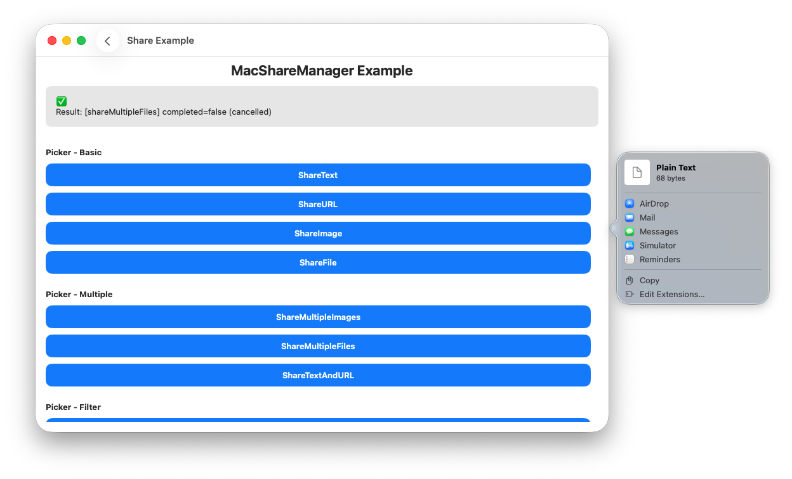
</p>

#### Share Text and URL

Mix different item types (text, URL, image, file) in a single share.

```swift
Task {
    let result = try await MacShareManager.shared.share(
        content: ShareContent(items: [
            .text("Check this out"),
            .url("https://www.apple.com")
        ])
    )
    print(result.completed, result.serviceName ?? "nil")
}
```

<p align="center">
    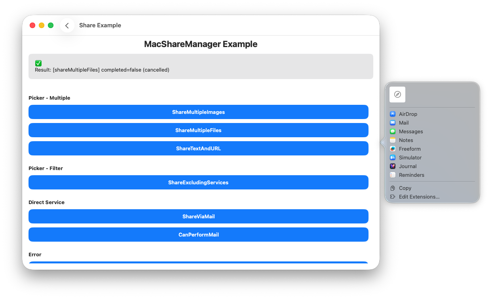
</p>

### Picker - Filter

#### Share Excluding Services

Pass service display titles in `excludedServiceTitles` to hide them from the picker. This is **best-effort**: `NSSharingService` does not expose a stable raw identifier to the caller, so the match is against the service's display `title`, which can be localized and may not match in every environment. Where reliable control is required, use direct service execution (`shareViaService`) instead.

```swift
Task {
    let result = try await MacShareManager.shared.share(
        content: ShareContent(
            items: [.url("https://www.apple.com")],
            excludedServiceTitles: ["Add to Reading List"]
        )
    )
    print(result.completed, result.serviceName ?? "nil")
}
```

<p align="center">
    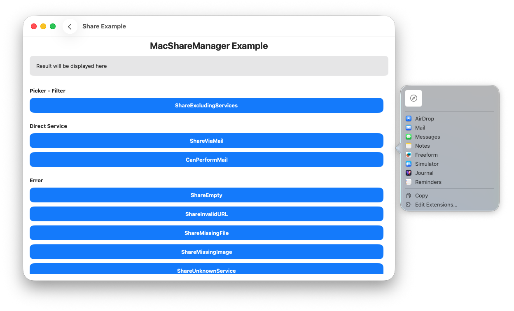
</p>

### Direct Service

#### Share via Mail

Run a single named service directly, bypassing the picker. `serviceName` is a raw `NSSharingService.Name` value (for example `"com.apple.share.Mail.compose"`). `recipients` and `subject` are applied to the service before it runs; they have no effect in picker mode.

```swift
Task {
    let result = try await MacShareManager.shared.shareViaService(
        content: ShareContent(
            items: [.text("Body text")],
            recipients: ["test@example.com"],
            subject: "Sample Subject"
        ),
        serviceName: "com.apple.share.Mail.compose"
    )
    print(result.completed, result.serviceName ?? "nil")
}
```

<p align="center">
    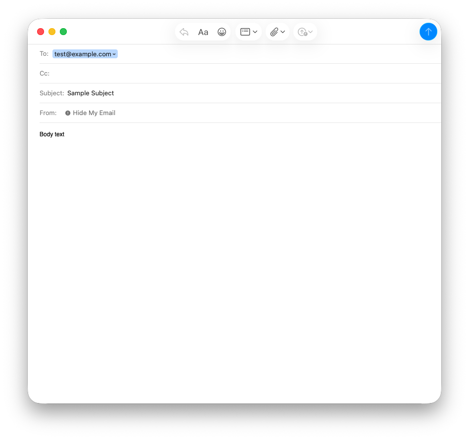
</p>

#### Check if a Service Can Perform

Query whether a named service can share the given content, for example to enable/disable a button before the user taps it.

```swift
Task {
    let canPerform = try await MacShareManager.shared.canPerform(
        content: ShareContent(items: [.text("Body text")]),
        serviceName: "com.apple.share.Mail.compose"
    )
    print(canPerform)
}
```

### Error Handling

The `async throws` API throws `ShareError` on failure. User cancellation is not an error: it is reported as `ShareResult.completed == false`.

| Error | Cause | Error message |
|---|---|---|
| `noValidItems` | `items` is empty | `"No shareable items were provided."` |
| `invalidURL(String)` | URL string is not a valid `http`/`https`/`file` URL | `"Invalid URL: <value>."` |
| `imageLoadFailed(path:)` | Image at the path could not be loaded | `"Failed to load image at path: <path>."` |
| `fileNotFound(path:)` | File at the path does not exist | `"File not found at path: <path>."` |
| `noAnchorView` | No key window was available to anchor the picker | `"No key window available to anchor the sharing picker."` |
| `serviceUnavailable(name:)` | The named service is unknown or cannot share the content | `"Sharing service unavailable: <name>."` |
| `alreadyInProgress` | Another share operation is already in progress | `"A share operation is already in progress."` |
| `presentationFailed(Error)` | Presentation failed or the system reported an error | `"Failed to share: <detail>."` |
| `unknown(Error)` | An unexpected error occurred | `"An unknown share error occurred: <detail>."` |

```swift
Task {
    do {
        let result = try await MacShareManager.shared.share(
            content: ShareContent(items: [.text("Hello")])
        )
        if result.completed {
            // Shared successfully via result.serviceName
        } else {
            // User cancelled
        }
    } catch let error as ShareError {
        // Typed error with errorCode / errorMessage (e.g. .noValidItems, .invalidURL, .fileNotFound)
        print(error.errorCode, error.errorMessage)
    } catch {
        // Other error
    }
}
```

When using the callback API, failures are delivered as `isSuccess == false` with a non-nil `errorMessage`:

```swift
MacShareManager.shared.share(
    content: ShareContent(items: [])
) { isSuccess, completed, serviceName, errorMessage in
    // isSuccess == false, errorMessage == "No shareable items were provided."
}
```
