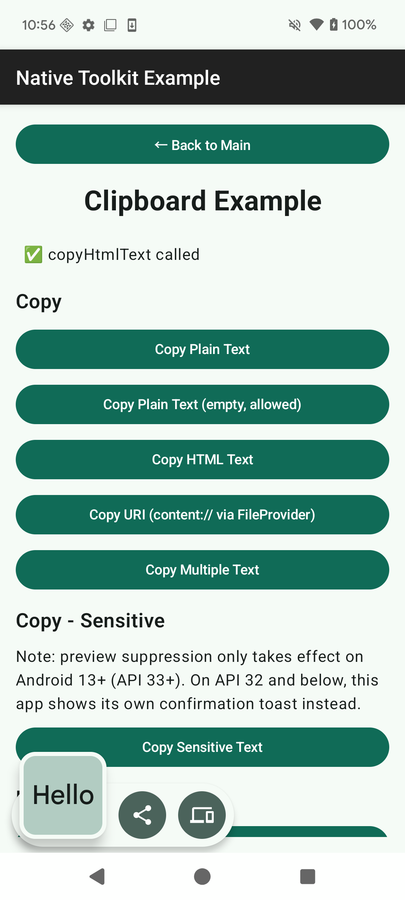
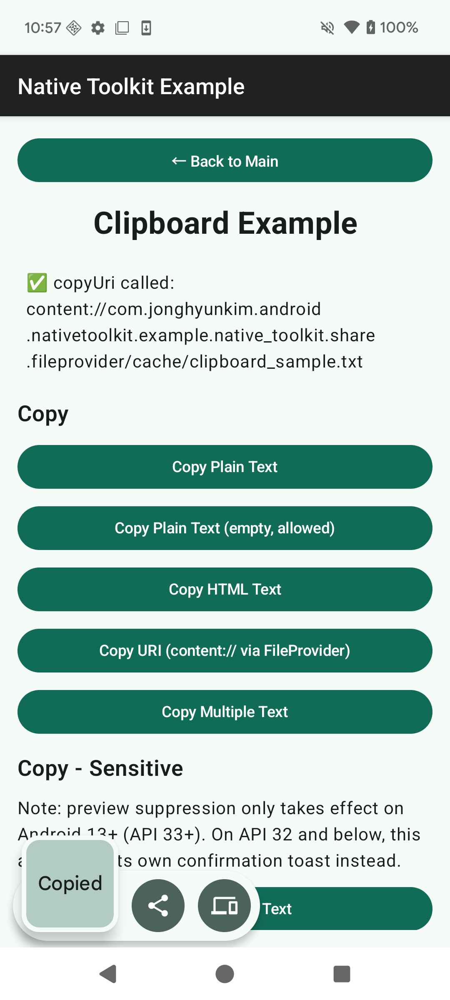

# Clipboard 기능

Language:

- 日本語: [clipboard.ja.md](clipboard.ja.md)
- English: [clipboard.md](clipboard.md)
- 한국어（이 페이지）

← [매뉴얼 홈으로 돌아가기](index.ko.md)

---

## 목차

- [Android](#android)
  - [설정](#설정)
  - [복사](#복사)
    - [일반 텍스트 복사](#일반-텍스트-복사)
    - [일반 텍스트 복사（빈 문자열）](#일반-텍스트-복사빈-문자열)
    - [HTML 텍스트 복사](#html-텍스트-복사)
    - [URI 복사](#uri-복사)
    - [여러 텍스트 복사](#여러-텍스트-복사)
  - [복사 - 민감 정보](#복사---민감-정보)
    - [민감 정보 텍스트 복사](#민감-정보-텍스트-복사)
  - [읽기 / 확인](#읽기--확인)
    - [클립보드 읽기](#클립보드-읽기)
    - [데이터 존재 여부 확인](#데이터-존재-여부-확인)
    - [메타데이터 가져오기](#메타데이터-가져오기)
  - [지우기](#지우기)
    - [클립보드 지우기](#클립보드-지우기)
  - [변경 감시](#변경-감시)
    - [감시 시작](#감시-시작)
    - [감시 중지](#감시-중지)
  - [에러 처리](#에러-처리)

---

## Android

- 라이브러리: `android-native-toolkit-1.3.0.aar`
- 최소 SDK: Android 12 (API 31)
- 민감한 콘텐츠 미리보기 억제: Android 13 (API 33) 이상
- 지원 범위: 복사, 읽기, 메타데이터 확인, 지우기, 클립보드 변경 감시를 `android_library`（네이티브）를 통해 제공한다. 모든 작업에 Unity Bridge 의존성이 필요하지 않다.

### 설정

#### Android 네이티브（AAR）

1. `android-native-toolkit-1.3.0.aar`를 `app/libs`에 배치한다.
2. `app/build.gradle.kts`에 의존성을 추가한다:

```kotlin
dependencies {
    implementation(files("libs/android-native-toolkit-1.3.0.aar"))
}
```

클립보드 작업에는 추가적인 매니페스트 설정이 필요하지 않다. `content://` URI를 복사하려면（[URI 복사](#uri-복사) 참고）공유하려는 파일의 URI를 해석할 수 있는 `FileProvider`가 별도로 필요하다. AAR 자체는 범용 목적의 `FileProvider`를 선언하지 않는다.

---

### 복사

`ClipboardUseCases`는 `Context`를 받는 팩토리 함수로 가져온다:

```kotlin
val clipboardUseCases = ClipboardUseCases(context)
```

#### 일반 텍스트 복사

```kotlin
try {
    clipboardUseCases.copyPlainText(
        ClipContent.PlainText(text = "Hello from native-toolkit", label = "sample")
    )
} catch (e: ClipboardDomainError) {
    // 에러 처리
}
```

<p align="center">
    
</p>

#### 일반 텍스트 복사（빈 문자열）

빈 문자열은 허용되며 예외가 발생하지 않는다.

```kotlin
clipboardUseCases.copyPlainText(ClipContent.PlainText(text = ""))
```

<p align="center">
    
</p>

#### HTML 텍스트 복사

```kotlin
clipboardUseCases.copyHtmlText(
    ClipContent.HtmlText(plainText = "Hello", htmlText = "<b>Hello</b>")
)
```

<p align="center">
    
</p>

#### URI 복사

`content://`（또는 `file://`）URI를 복사한다. `content` / `file` 스킴만 허용되며, 그 외 스킴은 `ClipboardDomainError.InvalidUri`를 발생시킨다.

```kotlin
val file = File(context.cacheDir, "clipboard_sample.txt")
file.writeText("Clipboard sample file content")
val uri = FileProvider.getUriForFile(
    context,
    "${context.packageName}.native_toolkit.share.fileprovider",
    file
)

clipboardUseCases.copyUri(ClipContent.UriContent(uri = uri.toString()))
```

<p align="center">
    
</p>

#### 여러 텍스트 복사

동일한 형식의 여러 일반 텍스트 항목（하나의 `ClipData`에 여러 항목을 저장）.

```kotlin
clipboardUseCases.copyMultipleText(
    ClipContent.MultipleText(texts = listOf("first", "second", "third"))
)
```

<p align="center">
    
</p>

---

### 복사 - 민감 정보

`isSensitive = true`를 지정하면 복사한 내용이 민감 정보（비밀번호, 일회용 코드 등）임을 시스템에 알릴 수 있다.

- Android 13 (API 33) 이상에서는 시스템 표준 복사 확인 UI가 콘텐츠 미리보기를 억제한다.
- Android 12L (API 32) 이하에서는 시스템 확인 UI 자체가 없으므로, 복사 후 직접 피드백（`Toast` 등）을 표시해야 한다.

#### 민감 정보 텍스트 복사

```kotlin
clipboardUseCases.copyPlainText(
    ClipContent.PlainText(text = "P@ssw0rd-sample", isSensitive = true)
)

if (Build.VERSION.SDK_INT <= Build.VERSION_CODES.S_V2) {
    Toast.makeText(context, "Copied (sensitive)", Toast.LENGTH_SHORT).show()
}
```

<p align="center">
    
</p>

---

### 읽기 / 확인

#### 클립보드 읽기

빈 클립보드는 **정상 케이스**이며 에러가 아니다. `read()`는 `null`을 반환한다.

```kotlin
val result = clipboardUseCases.read()
if (result != null) {
    // result.label, result.mimeTypes, result.items（각 항목의 text / htmlText / uri / coercedText）
} else {
    // 클립보드가 비어 있음（정상）
}
```

<p align="center">
    
</p>

#### 데이터 존재 여부 확인

```kotlin
val hasClip: Boolean = clipboardUseCases.hasClip()
```

<p align="center">
    
</p>

#### 메타데이터 가져오기

본문 데이터에 접근하지 않고 메타데이터만 가져온다（Android 12+ 의 "클립보드에서 붙여넣었습니다" 접근 알림을 피할 수 있다）. 클립보드가 비어 있을 때도 `null`（정상 케이스）을 반환한다.

```kotlin
val info = clipboardUseCases.getDescription()
if (info != null) {
    // info.label, info.mimeTypes
    // info.isStyledText: 서식이 있는（리치） 텍스트인지 여부
    // info.classificationStatus: ClipDescription.CLASSIFICATION_* 원시 값. 가져올 수 없으면 null
}
```

<p align="center">
    
</p>

---

### 지우기

#### 클립보드 지우기

```kotlin
clipboardUseCases.clear()
```

<p align="center">
    
</p>

---

### 변경 감시

`ClipboardChangeMonitor`는 시스템 클립보드 변경 리스너를 소유하는 클래스로, `android_library`（Unity Bridge가 아닌 네이티브 쪽）에 위치하므로 네이티브 코드에서 직접 사용할 수 있다.

감시는 앱이 포그라운드에 있는 동안에만 확실히 동작한다（Android 10+ 는 백그라운드에서의 클립보드 읽기를 제한한다）.

```kotlin
val monitor = ClipboardChangeMonitor()
```

#### 감시 시작

`onChange`는 시스템 리스너의 콜백 스레드에서 호출된다. UI 상태를 업데이트하는 경우 직접 메인 스레드로 전달해야 한다.

```kotlin
monitor.start(context) {
    // 시스템 리스너의 콜백 스레드에서 호출됨
    mainHandler.post {
        // 여기서 UI 상태 업데이트
    }
}

val isObserving: Boolean = monitor.isObserving()
```

감시 중에 `start`를 다시 호출해도 no-op（시스템 리스너가 중복 등록되지 않음）.

#### 감시 중지

```kotlin
monitor.stop()
```

감시 중인 화면/컴포넌트가 해제될 때 `stop()`을 호출하여 시스템 리스너 누수를 방지한다:

```kotlin
DisposableEffect(monitor) {
    onDispose { monitor.stop() }
}
```

---

### 에러 처리

`ClipboardUseCases`는 `ClipboardDomainError`의 서브타입을 발생시킨다.

| 에러 | 원인 | 에러 메시지 |
|---|---|---|
| `EmptyContent` | `copyHtmlText`에서 `htmlText`가 비어 있음 | `"Clipboard content is empty. Please provide text or HTML."` |
| `EmptyItemList` | `copyMultipleText`에서 `texts` 리스트가 비어 있음 | `"No items provided for clipboard copy."` |
| `InvalidUri` | `uri`가 비어 있거나 scheme이 `content`/`file`이 아님 | `"Invalid URI: <uri>"` |
| `ClipboardUnavailable` | 시스템 `ClipboardManager`를 가져올 수 없음 | `"Clipboard service is unavailable."` |
| `ReadNotAllowed` | `read()`가 시스템에 의해 거부됨（`SecurityException`）. 앱이 포그라운드에 있지 않을 가능성이 높음 | `"Clipboard read is not allowed. The app must be in the foreground."` |

빈 클립보드는 이러한 에러에 **포함되지 않는다**: `read()` / `getDescription()`은 정상 케이스로 `null`을 반환한다.

```kotlin
try {
    clipboardUseCases.copyUri(ClipContent.UriContent(uri = ""))
} catch (e: ClipboardDomainError.InvalidUri) {
    // URI가 비어 있거나 지원되지 않는 scheme
} catch (e: ClipboardDomainError) {
    // 기타 도메인 에러
}
```
