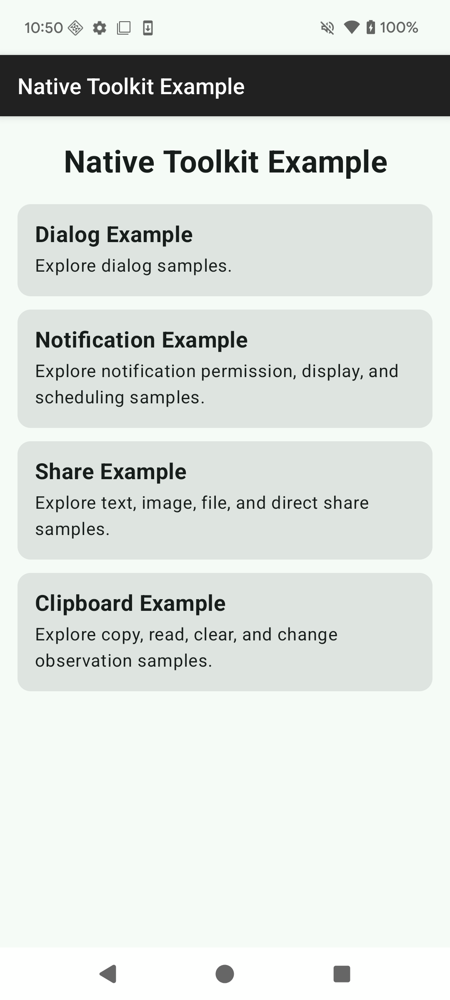
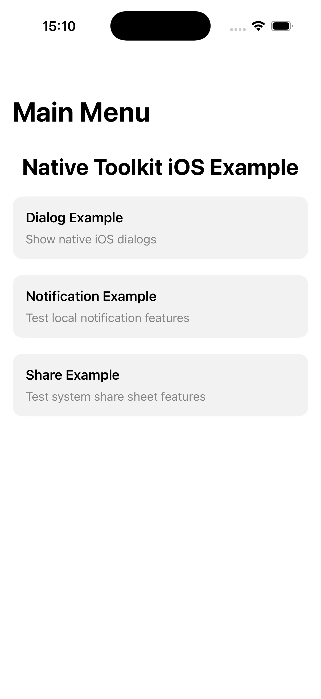
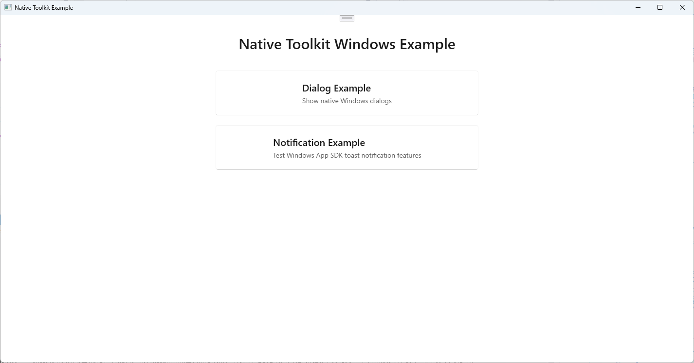

# native-toolkit マニュアル

言語:

- 日本語（このページ）
- English: [index.md](index.md)
- 한국어: [index.ko.md](index.ko.md)

このディレクトリの Markdown は、バージョン付きドキュメントとして `docs/<version>/manual/` に公開されます。

# このマニュアルの目的

- 自動生成ドキュメント（Dokka / DocC / Doxygen）だけでは補いにくい、導入手順や実運用のポイントをまとめる
- 手書きドキュメントを生成物（`docs/`）と分離し、publish 時に上書きされないようにする

# このページで分かること

- インストール / 導入
- プラットフォーム別セットアップ
  - Android (Gradle)
  - iOS (Xcode)
  - Windows (Visual Studio)
  - macOS (Xcode)
- API 使用例

# 自動生成ドキュメント（API リファレンス）

- Android: `docs/<version>/android/`
- iOS: `docs/<version>/ios/`
- Windows: `docs/<version>/windows/`
- macOS: `docs/<version>/mac/`

# 配布物の場所（`dist/<version>/`）

- Android: `dist/1.8.0/android/android-native-toolkit-1.3.0.aar`
- iOS: `dist/1.8.0/ios/ios-native-toolkit-1.2.0.xcframework`
- Windows: `dist/1.8.0/windows/windows-native-toolkit-1.1.0.nupkg`
- macOS: `dist/1.8.0/mac/mac-native-toolkit-1.2.0.xcframework`

# Native Toolkit

- native-toolkit は、各プラットフォームのネイティブ機能を統一的に扱うためのツールキットです。
- パッケージには Android / iOS / Windows / macOS 向けのネイティブプラグインとサンプルが含まれ、各プラットフォームのネイティブ機能をシングルトン API で利用できます。

# バージョン

## 1.8.0

# 対応 OS バージョン

- Android 12 以降
- iOS 18 以降
- Windows 11 以降
- macOS 15 以降

# 機能一覧

## Android

- ダイアログ機能
  - 基本ダイアログ
  - 確認ダイアログ
  - シングル選択ダイアログ
  - マルチ選択ダイアログ
  - 入力ダイアログ
  - ログインダイアログ
- 通知機能
  - 通知の表示 / 更新 / 取り消し
  - 通知チャンネル管理
  - スケジュール通知
- シェア機能
  - テキスト / URL シェア
  - 画像シェア
  - ファイルシェア
  - リッチプレビュー
  - カスタム Chooser Action（Android 14 以降）
  - Direct Share Target
  - コールバック付きシェア
  - 共有コンテンツの受信
- クリップボード機能
  - コピー（プレーンテキスト・HTML・URI・複数テキスト）
  - 機微情報コピー（プレビュー抑止、Android 13 以降）
  - 読み取り / データ有無確認 / メタデータ確認
  - クリア
  - クリップボード変更監視

## iOS

- ダイアログ機能
  - 基本ダイアログ
  - 確認ダイアログ
  - ディストラクティブなダイアログ
  - アクションシート
  - 入力ダイアログ
  - ログインダイアログ
- 通知機能
  - パーミッション
  - 通知の表示 / 更新 / 取り消し
  - スケジュール通知
  - 添付ファイル付き通知
  - バッジ
  - カテゴリとアクション
- 共有機能
  - テキスト / URL 共有
  - リッチプレビュー
  - 画像 / ファイル共有（単一・複数）
  - 組み合わせコンテンツ（件名、アクティビティタイプの除外）

## Windows

- ダイアログ機能
  - 基本ダイアログ
  - ファイル選択ダイアログ
  - 複数ファイル選択ダイアログ
  - フォルダ選択ダイアログ
  - 複数フォルダ選択ダイアログ
  - ファイル保存ダイアログ
- 通知機能
  - 通知の表示 / 更新 / 取り消し
  - スケジュール通知
  - 進捗通知
  - バッジ（パッケージ済みアプリ）
  - アクションボタンとテキスト入力

## Mac

- ダイアログ機能
  - 基本ダイアログ
  - ファイル選択ダイアログ
  - 複数ファイル選択ダイアログ
  - フォルダ選択ダイアログ
  - 複数フォルダ選択ダイアログ
  - ファイル保存ダイアログ
- 通知機能
  - パーミッション
  - 通知の表示 / 更新 / 取り消し
  - スケジュール通知
  - バッジ
  - カテゴリとアクション
- Share 機能
  - ピッカー経由のテキスト / URL / 画像 / ファイル共有（単数・複数）
  - ピッカーからのサービス除外
  - 個別サービスの直接実行（recipients、subject）
  - サービスが実行可能かの確認

## 追加予定機能

- iOS / macOS / Windows 向けクリップボード連携（Android は対応済み。上記「機能一覧」参照）

## サンプル

- Android サンプル
  - Android Studio をインストールします。
    - <a href="https://developer.android.com/studio?hl=ja" target="_blank" rel="noopener noreferrer">参考サイト</a>
  - Android Studio を起動します。
  - 「File」→「Open...」 を選択します。
  - 「native-toolkit/android/AndroidLibraryExample」を選択して「開く」ボタンをクリックします。
  - Android 端末を接続します。
  - 「Run」ボタンをクリックして、サンプルアプリをインストールします。
    <p align="center">
        
    </p>

- iOS サンプル
  - Xcode をインストールしてください。
    - <a href="https://developer.apple.com/jp/xcode" target="_blank" rel="noopener noreferrer">参考サイト</a>
  - Xcode を起動します。
  - 「Open Existing Project...」 を選択します。
  - 「native-toolkit/ios/IosWorkspace.xcworkspace」を選択して「Open」ボタンをクリックします。
  - 「Run」ボタンをクリックして、サンプルアプリをインストールします。
    <p align="center">
        
    </p>

- Windows サンプル
  - Visual Studio 2022 をインストールしてください。
    - <a href="https://visualstudio.microsoft.com/ja/vs/" target="_blank" rel="noopener noreferrer">参考サイト</a>
  - Visual Studio 2022 を起動します。
  - 「プロジェクトやソリューションを開く(P)」 を選択します。
  - 「native-toolkit\windows\WindowsLibraryExample\WindowsLibraryExample.sln」を選択して「開く」ボタンをクリックします。
  - 「デバッグ(D)」→「デバッグ開始(S)」 を選択して、サンプルアプリをインストールします。
    <p align="center">
        
    </p>

- Mac サンプル
  - Xcode をインストールしてください。
    - <a href="https://developer.apple.com/jp/xcode" target="_blank" rel="noopener noreferrer">参考サイト</a>
  - Xcode を起動します。
  - 「Open Existing Project...」 を選択します。
  - 「native-toolkit/mac/MacWorkspace.xcworkspace」を選択して「Open」ボタンをクリックします。
  - 「Run」ボタンをクリックして、サンプルアプリをインストールします。
    <p align="center">
        
    </p>

## ライブラリ組み込み方法

### Android

#### 対応プラットフォーム: Android（AAR / ABI 非依存）

1. `android-native-toolkit-1.3.0.aar` を `app/libs` に配置します。
2. `settings.gradle.kts` に AAR を参照するためのリポジトリ設定を追加します。
3. `app/build.gradle.kts` に AAR を参照するための依存関係を追加します。
4. Gradle 同期を実行します。
5. ビルドが通ることを確認します。
   追加する設定は以下です。

**settings.gradle.kts:**

```gradle

dependencyResolutionManagement {
    repositoriesMode.set(RepositoriesMode.FAIL_ON_PROJECT_REPOS)
    repositories {
        google()
        mavenCentral()

        // ローカルの AAR ファイルを参照するための設定です。こちらを追加してください。
        flatDir {
            dirs("app/libs")
        }
    }
}
```

**app/build.gradle.kts:**

```gradle

dependencies {
    // AAR を参照するための依存関係を追加します。こちらを追加してください。
  implementation(files("libs/android-native-toolkit-1.3.0.aar"))
}
```

### iOS

#### 対応プラットフォーム: iOS（実機: arm64 / Simulator: arm64, x86_64）

1. `ios-native-toolkit-1.2.0.xcframework` を、作成した Xcode プロジェクト直下の `Frameworks` フォルダ（なければ作成）にコピーします。
2. Xcode 26.2 で対象プロジェクトを開き、**Project Navigator** でアプリのターゲットを選択します。
3. **General** タブを開き、**Frameworks, Libraries, and Embedded Content** の **+** を押します。
4. **Add Other...** → **Add Files...** を選択し、`Frameworks/ios-native-toolkit-1.2.0.xcframework` を追加します。
5. 追加後、`ios-native-toolkit-1.2.0.xcframework` の Embed 設定を **Embed & Sign** に変更します。
6. 同じターゲットの **Build Settings** を開き、`Framework Search Paths` に `$(PROJECT_DIR)/Frameworks` を追加します。（通常は non-recursive）
7. **Signing & Capabilities** で Team が正しく設定されていることを確認します。
8. **Product** → **Clean Build Folder** を実行してから、**Run** でビルド・起動します。
9. エラーなく起動できれば組み込み完了です。

### Windows

#### 対応プラットフォーム: Windows x64（win-x64）

1. `windows-native-toolkit-1.1.0.nupkg` を `C:\packages` にコピーします。
2. Visual Studio 2022 を起動し、**ツール** → **オプション** → **NuGet パッケージ マネージャー** → **パッケージ ソース** を開きます。
3. 右上の **+** を押し、次の内容を入力します。
   - 名前: LocalPackages
   - ソース: C:\packages  
     入力後、**更新** ボタンを押して保存します。
4. 対象のソリューションを開きます。
5. **ソリューション エクスプローラー** でプロジェクトを右クリックし、**NuGet パッケージの管理** を選択します。
6. 右上の **パッケージ ソース** を **LocalPackages** に切り替えます。
7. 検索欄で **NativeToolkit** を検索し、**インストール** をクリックします。
8. ライセンス確認が表示された場合は承諾し、インストール完了です。

### macOS

#### 対応プラットフォーム: macOS arm64, x86_64

1. `mac-native-toolkit-1.2.0.xcframework` を、作成した Xcode プロジェクト直下の `Frameworks` フォルダ（なければ作成）にコピーします。
2. Xcode 26.2 で対象プロジェクトを開き、Project Navigator でアプリのターゲットを選択します。
3. **General** タブを開き、**Frameworks, Libraries, and Embedded Content** の `+` を押します。
4. 「Add Other...」→「Add Files...」を選択し、`Frameworks/mac-native-toolkit-1.2.0.xcframework` を追加します。
5. 追加後、`mac-native-toolkit-1.2.0.xcframework` の Embed 設定を **Embed & Sign** に変更します。
6. 同じターゲットの **Build Settings** を開き、`Framework Search Paths` に `$(PROJECT_DIR)/Frameworks` を追加します。（通常は non-recursive）
7. **Signing & Capabilities** で Team が正しく設定されていることを確認します。
8. **Product** → **Clean Build Folder** を実行してから、**Run** でビルド・起動します。
9. エラーなく起動できれば組み込み完了です。

# API 使用方法

- [ダイアログ機能](dialog.ja.md)
- [通知機能](notification.ja.md)
- [シェア機能](share.ja.md)
- [クリップボード機能](clipboard.ja.md)
