# Clipboard 機能

Language:

- 日本語（このページ）
- English: [clipboard.md](clipboard.md)
- 한국어: [clipboard.ko.md](clipboard.ko.md)

← [マニュアルトップへ戻る](index.ja.md)

---

## 目次

- [Android](#android)
  - [セットアップ](#セットアップ)
  - [コピー](#コピー)
    - [プレーンテキストをコピー](#プレーンテキストをコピー)
    - [プレーンテキストをコピー（空文字）](#プレーンテキストをコピー空文字)
    - [HTML テキストをコピー](#html-テキストをコピー)
    - [URI をコピー](#uri-をコピー)
    - [複数テキストをコピー](#複数テキストをコピー)
  - [コピー - 機微情報](#コピー---機微情報)
    - [機微情報テキストをコピー](#機微情報テキストをコピー)
  - [読み取り / 確認](#読み取り--確認)
    - [クリップボードを読み取る](#クリップボードを読み取る)
    - [データ有無を確認](#データ有無を確認)
    - [メタデータを取得](#メタデータを取得)
  - [クリア](#クリア)
    - [クリップボードをクリア](#クリップボードをクリア)
  - [変更監視](#変更監視)
    - [監視を開始](#監視を開始)
    - [監視を停止](#監視を停止)
  - [エラー処理](#エラー処理)
- [iOS](#ios)
  - [IosClipboardManager](#iosclipboardmanager)
  - [セットアップ](#セットアップ-1)
    - [スレッド](#スレッド)
    - [2 つの呼び出し方式](#2-つの呼び出し方式)
    - [既定値](#既定値)
  - [スコープ](#スコープ)
    - [一般ペーストボードを使う](#一般ペーストボードを使う)
    - [名前付きペーストボードを作成](#名前付きペーストボードを作成)
    - [名前付きスコープを参照（作成しない）](#名前付きスコープを参照作成しない)
    - [ユニークペーストボードを作成](#ユニークペーストボードを作成)
    - [アクティブなペーストボードを削除](#アクティブなペーストボードを削除)
    - [名前付き / ユニークペーストボードは永続ストアではありません](#名前付き--ユニークペーストボードは永続ストアではありません)
  - [コピー](#コピー-1)
    - [プレーンテキストをコピー](#プレーンテキストをコピー-1)
    - [プレーンテキストをコピー（空文字）](#プレーンテキストをコピー空文字-1)
    - [HTML テキストをコピー](#html-テキストをコピー-1)
    - [URL をコピー](#url-をコピー)
    - [画像ファイルをコピー](#画像ファイルをコピー)
    - [画像データをコピー](#画像データをコピー)
    - [色をコピー](#色をコピー)
    - [カスタムデータをコピー](#カスタムデータをコピー)
    - [複数テキストをコピー](#複数テキストをコピー-1)
    - [複数表現をコピー](#複数表現をコピー)
  - [コピーオプション](#コピーオプション)
    - [localOnly を指定してコピー](#localonly-を指定してコピー)
    - [expirationDate を指定してコピー](#expirationdate-を指定してコピー)
  - [追記](#追記)
    - [プレーンテキストを追記](#プレーンテキストを追記)
    - [URL を追記](#url-を追記)
    - [追記はプライバシーオプションを引き継ぎません](#追記はプライバシーオプションを引き継ぎません)
  - [読み取り / 確認](#読み取り--確認-1)
    - [読み取り](#読み取り)
    - [データを読み取り](#データを読み取り)
    - [スナップショット](#スナップショット)
    - [スナップショット（型を指定）](#スナップショット型を指定)
    - [プライバシー: 確認ダイアログと通知](#プライバシー-確認ダイアログと通知)
  - [非同期ロード](#非同期ロード)
    - [テキストをロード](#テキストをロード)
    - [URL をロード](#url-をロード)
    - [画像をロード](#画像をロード)
    - [ファイルをロード](#ファイルをロード)
    - [すべてのロードをキャンセル](#すべてのロードをキャンセル)
  - [検出](#検出)
    - [パターンを検出](#パターンを検出)
    - [値を検出](#値を検出)
    - [number と probableWebSearch はクリップボード全体を分類します](#number-と-probablewebsearch-はクリップボード全体を分類します)
    - [検出にキャンセルトークンはありません](#検出にキャンセルトークンはありません)
  - [変更監視](#変更監視-1)
    - [監視を開始](#監視を開始-1)
    - [監視を停止](#監視を停止-1)
    - [フォアグラウンド復帰時の変更確認](#フォアグラウンド復帰時の変更確認)
  - [ペーストコントロール](#ペーストコントロール)
    - [ペーストコントロールを作成](#ペーストコントロールを作成)
  - [クリア](#クリア-1)
  - [エラー処理](#エラー処理-1)

---

## Android

- ライブラリ: `android-native-toolkit-1.3.0.aar`
- 最小 SDK: Android 12 (API 31)
- 機微情報プレビュー抑止: Android 13 (API 33) 以上
- 対応範囲: コピー・読み取り・メタデータ確認・クリア・クリップボード変更監視を `android_library`（ネイティブ）経由で提供します。いずれの操作も Unity Bridge への依存は不要です。

### セットアップ

#### Android ネイティブ（AAR）

1. `android-native-toolkit-1.3.0.aar` を `app/libs` に配置します。
2. `app/build.gradle.kts` に依存関係を追加します:

```kotlin
dependencies {
    implementation(files("libs/android-native-toolkit-1.3.0.aar"))
}
```

クリップボード操作に追加のマニフェスト設定は不要です。`content://` URI をコピーする場合（[URI をコピー](#uri-をコピー)参照）は、共有したいファイルの URI を解決できる `FileProvider` が別途必要です。AAR 自体は汎用目的の `FileProvider` を宣言していません。

---

### コピー

`ClipboardUseCases` は `Context` を受け取るファクトリ関数で取得します:

```kotlin
val clipboardUseCases = ClipboardUseCases(context)
```

#### プレーンテキストをコピー

```kotlin
try {
    clipboardUseCases.copyPlainText(
        ClipContent.PlainText(text = "Hello from native-toolkit", label = "sample")
    )
} catch (e: ClipboardDomainError) {
    // エラー処理
}
```

<p align="center">
    
</p>

#### プレーンテキストをコピー（空文字）

空文字は許容され、例外は発生しません。

```kotlin
clipboardUseCases.copyPlainText(ClipContent.PlainText(text = ""))
```

<p align="center">
    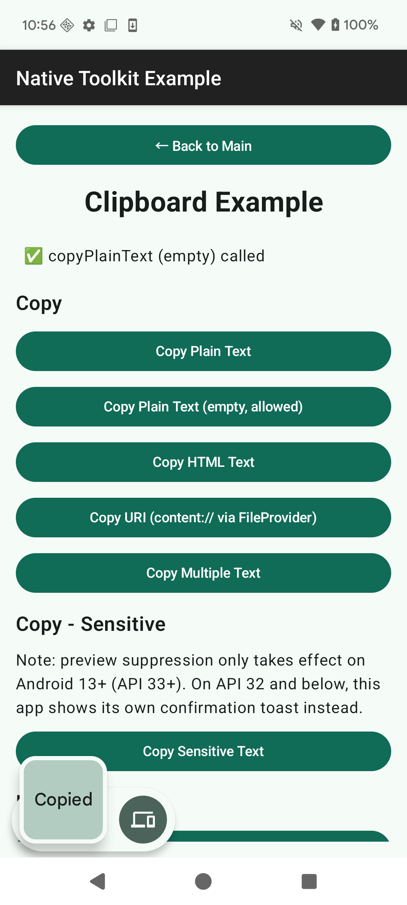
</p>

#### HTML テキストをコピー

```kotlin
clipboardUseCases.copyHtmlText(
    ClipContent.HtmlText(plainText = "Hello", htmlText = "<b>Hello</b>")
)
```

<p align="center">
    
</p>

#### URI をコピー

`content://`（または `file://`）URI をコピーします。`content` / `file` スキームのみが許容され、それ以外のスキームは `ClipboardDomainError.InvalidUri` を送出します。

```kotlin
val file = File(context.cacheDir, "clipboard_sample.txt")
file.writeText("Clipboard sample file content")
val uri = FileProvider.getUriForFile(
    context,
    "${context.packageName}.native_toolkit.share.fileprovider",
    file
)

clipboardUseCases.copyUri(ClipContent.UriContent(uri = uri.toString()))
```

<p align="center">
    
</p>

#### 複数テキストをコピー

同一形式の複数プレーンテキストアイテムです（1つの `ClipData` に複数アイテムを格納します）。

```kotlin
clipboardUseCases.copyMultipleText(
    ClipContent.MultipleText(texts = listOf("first", "second", "third"))
)
```

<p align="center">
    
</p>

---

### コピー - 機微情報

`isSensitive = true` を指定すると、コピーした内容が機微情報（パスワード・ワンタイムコードなど）であることをシステムに示唆できます。

- Android 13 (API 33) 以上では、システム標準のコピー確認 UI が内容のプレビュー表示を抑止します。
- Android 12L (API 32) 以下ではシステム確認 UI 自体が存在しないため、コピー後に自前でフィードバック（`Toast` など）を表示してください。

#### 機微情報テキストをコピー

```kotlin
clipboardUseCases.copyPlainText(
    ClipContent.PlainText(text = "P@ssw0rd-sample", isSensitive = true)
)

if (Build.VERSION.SDK_INT <= Build.VERSION_CODES.S_V2) {
    Toast.makeText(context, "Copied (sensitive)", Toast.LENGTH_SHORT).show()
}
```

<p align="center">
    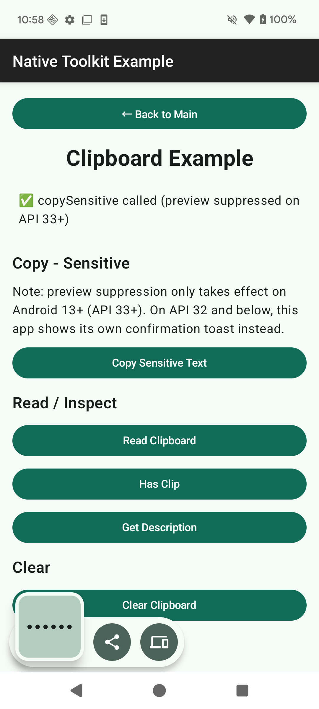
</p>

---

### 読み取り / 確認

#### クリップボードを読み取る

空のクリップボードは**正常系**であり、エラーではありません。`read()` は `null` を返します。

```kotlin
val result = clipboardUseCases.read()
if (result != null) {
    // result.label, result.mimeTypes, result.items（各アイテムの text / htmlText / uri / coercedText）
} else {
    // クリップボードは空（正常系）
}
```

<p align="center">
    
</p>

#### データ有無を確認

```kotlin
val hasClip: Boolean = clipboardUseCases.hasClip()
```

<p align="center">
    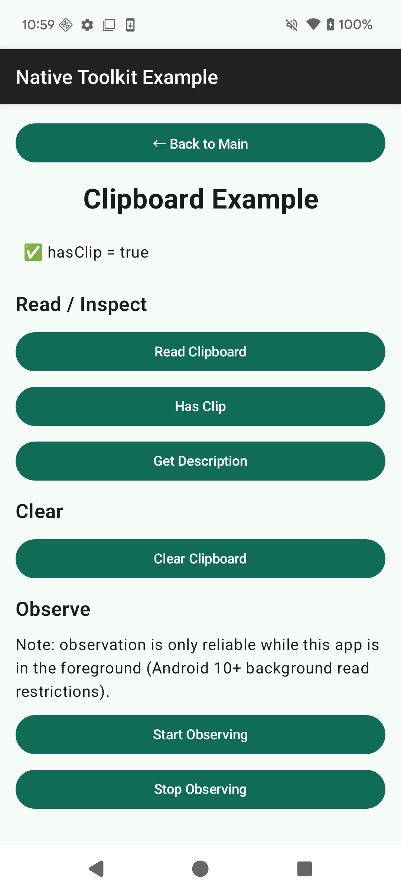
</p>

#### メタデータを取得

本体データに触れずメタデータのみ取得します（Android 12+ の「クリップボードから貼り付けました」アクセス通知を回避できます）。こちらもクリップボードが空の場合は `null`（正常系）を返します。

```kotlin
val info = clipboardUseCases.getDescription()
if (info != null) {
    // info.label, info.mimeTypes
    // info.isStyledText: 書式付き（リッチ）テキストかどうか
    // info.classificationStatus: ClipDescription.CLASSIFICATION_* の生値。取得不可時は null
}
```

<p align="center">
    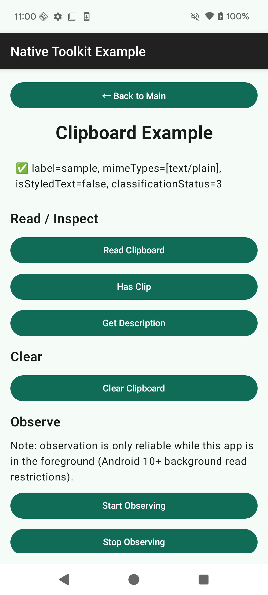
</p>

---

### クリア

#### クリップボードをクリア

```kotlin
clipboardUseCases.clear()
```

<p align="center">
    
</p>

---

### 変更監視

`ClipboardChangeMonitor` はシステムのクリップボード変更リスナーを所有するクラスで、`android_library`（Unity Bridge ではなくネイティブ側）に配置されているため、ネイティブコードから直接利用できます。

監視はアプリが前面にある間のみ確実に動作します（Android 10+ はバックグラウンドでのクリップボード読み取りを制限するためです）。

```kotlin
val monitor = ClipboardChangeMonitor()
```

#### 監視を開始

`onChange` はシステムリスナーのコールバックスレッドで呼び出されます。UI 状態を更新する場合は自分でメインスレッドへ橋渡ししてください。

```kotlin
monitor.start(context) {
    // システムリスナーのコールバックスレッドで呼ばれる
    mainHandler.post {
        // ここで UI 状態を更新
    }
}

val isObserving: Boolean = monitor.isObserving()
```

監視中に `start` を再度呼んでも no-op です（system listener の二重登録は発生しません）。

#### 監視を停止

```kotlin
monitor.stop()
```

監視中の画面・コンポーネントが破棄されるタイミングで `stop()` を呼び、system listener のリークを防いでください:

```kotlin
DisposableEffect(monitor) {
    onDispose { monitor.stop() }
}
```

---

### エラー処理

`ClipboardUseCases` は `ClipboardDomainError` のサブタイプを送出します。

| エラー | 原因 | エラーメッセージ |
|---|---|---|
| `EmptyContent` | `copyHtmlText` で `htmlText` が空 | `"Clipboard content is empty. Please provide text or HTML."` |
| `EmptyItemList` | `copyMultipleText` で `texts` リストが空 | `"No items provided for clipboard copy."` |
| `InvalidUri` | `uri` が空、または scheme が `content`/`file` 以外 | `"Invalid URI: <uri>"` |
| `ClipboardUnavailable` | システムの `ClipboardManager` を取得できない | `"Clipboard service is unavailable."` |
| `ReadNotAllowed` | `read()` がシステムに拒否された（`SecurityException`）。アプリが前面にない可能性が高い | `"Clipboard read is not allowed. The app must be in the foreground."` |

空のクリップボードはこれらのエラーに**含まれません**: `read()` / `getDescription()` は正常系として `null` を返します。

```kotlin
try {
    clipboardUseCases.copyUri(ClipContent.UriContent(uri = ""))
} catch (e: ClipboardDomainError.InvalidUri) {
    // URI が空、または未対応の scheme
} catch (e: ClipboardDomainError) {
    // その他のドメインエラー
}
```

---

## iOS

- ライブラリ: `ios-native-toolkit-1.3.0.xcframework`
- 最小デプロイメントターゲット: iOS 18
- 対応範囲: コピー / 追記、同期読み取り、メタデータのスナップショット、名前付き・ユニークペーストボードのライフサイクル、`NSItemProvider` による非同期ロード、パターン検出、変更監視、そして配置するだけで使える `UIPasteControl` ペーストボタンを提供します。

### IosClipboardManager

`IosClipboardManager` は、`UIPasteboard` をラップするシングルトンクラスです。

### セットアップ

1. `ios-native-toolkit-1.3.0.xcframework` を Xcode プロジェクトに追加します（プロジェクトにドラッグし、ターゲットの Frameworks, Libraries, and Embedded Content で "Embed & Sign" に設定します）。
2. クリップボードを使用するファイルでライブラリをインポートします。

```swift
import IosLibrary
```

追加の初期化も `Info.plist` への記載も不要です。

#### スレッド

`IosClipboardManager` は `@MainActor` に隔離されています。メインアクター上（SwiftUI / UIKit のコードは既にメインアクター上です）から呼び出してください。メインアクター以外から呼び出す場合は `await MainActor.run { ... }` を使用します。

#### 2 つの呼び出し方式

値を扱うすべての操作に、次の 2 つの形式があります。

- `async throws`（ネイティブ Swift 呼び出し元に推奨）: 型付きの値を返し、失敗時は `ClipboardError` を throw します。
- コールバック: `(isSuccess, value?, errorCode?, errorMessage?)`。戻り値のない操作は `(isSuccess, errorCode?, errorMessage?)` です。

```swift
// async throws（Swift 呼び出し元に推奨）
Task {
    do {
        try await IosClipboardManager.shared.copy(.plainText("Hello"))
    } catch let error as ClipboardError {
        print(error.errorCode, error.errorDescription ?? "nil")
    }
}

// コールバック（同等）
IosClipboardManager.shared.copy(.plainText("Hello")) { isSuccess, errorCode, errorMessage in
    print(isSuccess, errorCode ?? "nil", errorMessage ?? "nil")
}
```

`cancelAllLoads` / `startObserving` / `stopObserving` / `checkForegroundChange` / `makePasteControl` は同期的に完了するため、同期形式のみを提供します。

以降の例は `async throws` 形式を使用します。SwiftUI の `Button` アクションは同期のため、各呼び出しを `Task { ... }` で包んでいます。

#### 既定値

| 設定 | 既定値 |
|---|---|
| コピーの最大サイズ | 64 MiB |
| ロードの最大サイズ | 64 MiB |
| 画像の最大ピクセル数 | 100,000,000 |
| 検出のタイムアウト | 5 秒 |
| プロバイダロードのタイムアウト | 15 秒 |
| 画像エンコードのタイムアウト | 10 秒 |

別の値を使う場合は `IosClipboardManager(timeouts:limits:)` でインスタンスを生成します。通常は `shared` を使用してください。

---

### スコープ

すべての操作は `scope: PasteboardScope` パラメータを受け取り、既定値は `.general` です。一般ペーストボードはすべてのアプリと共有され、起動をまたいで保持されます。名前付き・ユニークペーストボードは、起動中のアプリ同士でデータを受け渡すためのものです。

```swift
public enum PasteboardScope {
    case general
    case named(String)   // 同一 Team ID のアプリと共有
    case unique(String)  // withUniqueName() で作成。名前は出力値
}
```

#### 一般ペーストボードを使う

`.general` は既定値のため、省略もできます。

```swift
let scope: PasteboardScope = .general
```

#### 名前付きペーストボードを作成

`createPasteboard(.named(_:))` は、その名前のペーストボードが存在すれば解決し、なければ作成します。戻り値の `PasteboardScope` を以降の呼び出しに渡してください。

```swift
Task {
    let scope = try await IosClipboardManager.shared.createPasteboard(
        .named("com.jonghyunkim.nativetoolkit.example.sample")
    )
    // scope == .named("com.jonghyunkim.nativetoolkit.example.sample")
}
```

<p align="center">
    
</p>

#### 名前付きスコープを参照（作成しない）

作成せずに名前を参照することもできますが、何かが作成するまでは、その名前に対する操作はすべて `CLIPBOARD_UNAVAILABLE` で失敗します。

```swift
let scope = PasteboardScope.named("com.jonghyunkim.nativetoolkit.example.sample")
```

#### ユニークペーストボードを作成

`.unique` は名前の生成をシステムに任せます。生成された名前は戻り値のスコープに含まれるため、そのペーストボードを再度使う場合は保持しておく必要があります。

```swift
Task {
    let scope = try await IosClipboardManager.shared.createPasteboard(.unique)
    // scope == .unique("<システムが生成した名前>")
}
```

<p align="center">
    
</p>

#### アクティブなペーストボードを削除

```swift
Task {
    try await IosClipboardManager.shared.removePasteboard(scope)
}
```

`.general` を削除しようとすると `ClipboardError.cannotRemoveGeneralPasteboard` を throw します。

<p align="center">
    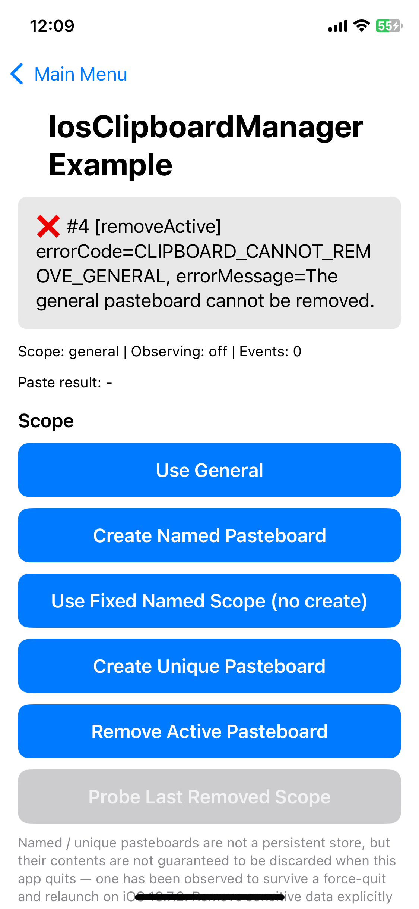
</p>

#### 名前付き / ユニークペーストボードは永続ストアではありません

`createPasteboard(.named(_:))` や `.unique` で作成したペーストボードは永続化を意図したものではありませんが、**作成したアプリの終了時に内容が破棄される保証もありません**。iOS 18.7.2 での実測では、アプリを強制終了して再起動した後も、終了前に書き込んだ名前付きペーストボードを読み取れました。システムは、そうしたペーストボードがいつ回収されるかを規定していません。

これらのスコープは起動中のアプリ同士でデータを受け渡す用途にのみ使用し、**機微データは `removePasteboard(_:)` で明示的に削除してください**。アプリの終了に破棄を期待しないでください。強制終了では `deinit` が実行されないため、ライブラリが終了時にクリーンアップを行っても、この状況には対処できません。

設計上、作成元アプリより長く存続させる必要がある共有には、App Group の共有コンテナを使用してください。これは本ライブラリの対応範囲外です。

---

### コピー

`copy` はペーストボードの内容を置き換えます。`ClipboardContent` が、対応するすべての形式を表します。

#### プレーンテキストをコピー

```swift
Task {
    try await IosClipboardManager.shared.copy(
        .plainText("Hello from IosLibraryExample"),
        scope: scope
    )
}
```

<p align="center">
    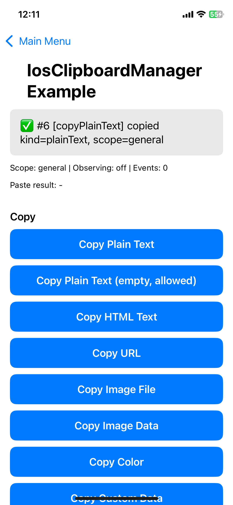
</p>

#### プレーンテキストをコピー（空文字）

空文字も許容され、throw しません。

```swift
Task {
    try await IosClipboardManager.shared.copy(.plainText(""), scope: scope)
}
```

<p align="center">
    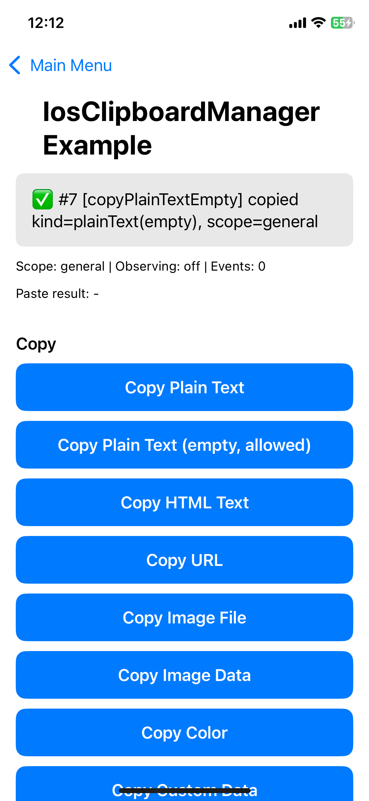
</p>

#### HTML テキストをコピー

2 つの表現を持つ 1 つのアイテムとして書き込まれるため、HTML を扱えないアプリでもプレーンテキストのフォールバックを取得できます。

```swift
Task {
    try await IosClipboardManager.shared.copy(
        .htmlText(plain: "plain body", html: "<b>html body</b>"),
        scope: scope
    )
}
```

<p align="center">
    
</p>

#### URL をコピー

URL は文字列として渡し、ライブラリ内で検証します。`http` / `https` / `file` スキームのみを受け付け、それ以外は `ClipboardError.invalidURL` を throw します。

```swift
Task {
    try await IosClipboardManager.shared.copy(.url("https://www.apple.com"), scope: scope)
}
```

<p align="center">
    
</p>

#### 画像ファイルをコピー

ファイルパスから画像を読み込みます。パスが存在しない場合は `ClipboardError.fileNotFound`、画像としてデコードできない場合は `ClipboardError.imageLoadFailed` を throw します。

```swift
Task {
    guard let path = Bundle.main.url(forResource: "app-icon-attachment", withExtension: "png")?.path else { return }
    try await IosClipboardManager.shared.copy(.imageFile(path: path), scope: scope)
}
```

<p align="center">
    
</p>

#### 画像データをコピー

画像のバイト列を、既知の画像 UTI を明示して書き込みます。画像としてデコードできないデータは `ClipboardError.invalidImageData` を throw します。

```swift
Task {
    guard let url = Bundle.main.url(forResource: "app-icon-attachment", withExtension: "png"),
          let data = try? Data(contentsOf: url) else { return }
    try await IosClipboardManager.shared.copy(
        .imageData(data, utType: "public.png"),
        scope: scope
    )
}
```

<p align="center">
    
</p>

#### 色をコピー

RGBA の各成分は有限値かつ `0.0...1.0` の範囲である必要があります。範囲外の場合は `ClipboardError.invalidColor` を throw します。

```swift
Task {
    try await IosClipboardManager.shared.copy(
        .color(red: 0.2, green: 0.4, blue: 0.8, alpha: 1.0),
        scope: scope
    )
}
```

<p align="center">
    
</p>

#### カスタムデータをコピー

アプリ定義の UTI で任意のバイト列を書き込みます。UTI は構文が検証され、不正な場合は `ClipboardError.invalidTypeIdentifier` を throw します。

```swift
Task {
    try await IosClipboardManager.shared.copy(
        .customData(Data([0xCA, 0xFE]), utType: "com.jonghyunkim.nativetoolkit.example.custom"),
        scope: scope
    )
}
```

<p align="center">
    
</p>

アプリの `Info.plist` に宣言していないカスタム UTI は `public.data` に適合しないため、`public.data` としてのファイルロードでは見つかりません。汎用ファイルとしてロードさせたい場合は、`public.data` 自体を指定してください。

```swift
Task {
    try await IosClipboardManager.shared.copy(
        .customData(Data(repeating: 0x41, count: 64), utType: "public.data"),
        scope: scope
    )
}
```

<p align="center">
    
</p>

#### 複数テキストをコピー

同じ形式のプレーンテキストを複数書き込みます。空配列は `ClipboardError.emptyItemList` を throw します。

```swift
Task {
    try await IosClipboardManager.shared.copy(
        .multipleText(["first", "second", "third"]),
        scope: scope
    )
}
```

<p align="center">
    
</p>

#### 複数表現をコピー

1 つのアイテムに複数の表現を UTI をキーとして持たせます。受け取る側のアプリが解釈できる表現を選びます。空の辞書は `ClipboardError.emptyItemList` を throw します。

```swift
Task {
    try await IosClipboardManager.shared.copy(
        .multiRepresentation([
            "public.plain-text": Data("multi representation".utf8),
            "public.utf8-plain-text": Data("multi representation".utf8)
        ]),
        scope: scope
    )
}
```

<p align="center">
    
</p>

---

### コピーオプション

`ClipboardCopyOptions` は `copy` のプライバシー設定を表します。既定値は `localOnly: true`、有効期限なしです。

```swift
public struct ClipboardCopyOptions {
    public let localOnly: Bool       // 近くのデバイスへ転送しない（ユニバーサルクリップボード）
    public let expirationDate: Date? // この時刻を過ぎるとシステムがアイテムを破棄する
    public static let `default` = ClipboardCopyOptions(localOnly: true, expirationDate: nil)
}
```

#### localOnly を指定してコピー

`localOnly: true` は、ユニバーサルクリップボードで近くのデバイスへアイテムを渡さないようシステムに要求します。デバイス間の転送を意図する場合にのみ `false` を指定してください。

```swift
Task {
    try await IosClipboardManager.shared.copy(
        .plainText("LOCALONLY-BODY"),
        options: ClipboardCopyOptions(localOnly: true, expirationDate: nil),
        scope: scope
    )
}
```

<p align="center">
    
</p>

#### expirationDate を指定してコピー

指定する日時は未来である必要があります。過去の日時は `ClipboardError.invalidExpirationDate` を throw します。

```swift
Task {
    try await IosClipboardManager.shared.copy(
        .plainText("expiring body"),
        options: ClipboardCopyOptions(
            localOnly: true,
            expirationDate: Date().addingTimeInterval(30)
        ),
        scope: scope
    )
}
```

<p align="center">
    
</p>

---

### 追記

`append` は、既にペーストボードにある内容を置き換えずにアイテムを追加します。

#### プレーンテキストを追記

```swift
Task {
    try await IosClipboardManager.shared.append(.plainText("appended item"), scope: scope)
}
```

<p align="center">
    
</p>

#### URL を追記

```swift
Task {
    try await IosClipboardManager.shared.append(.url("https://developer.apple.com"), scope: scope)
}
```

<p align="center">
    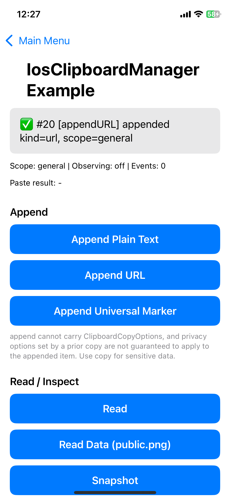
</p>

#### 追記はプライバシーオプションを引き継ぎません

`append` は `ClipboardCopyOptions` を受け取れず、直前の `copy` で指定した `localOnly` / `expirationDate` が追記したアイテムに適用される保証もありません。**機微データには必ず `copy(_:options:)` を使用してください。**

---

### 読み取り / 確認

#### 読み取り

ペーストボードを同期的に読み取ります。大きなペイロード（画像のバイト列）は結果に含まれず、UTI のみが報告されます。空のペーストボードはエラーではなく**正常な状態**で、`numberOfItems` が `0` になります。

```swift
Task {
    let result = try await IosClipboardManager.shared.read(scope: scope)
    print(result.numberOfItems)
    for item in result.items {
        // item.typeIdentifiers, item.text, item.urlString, item.imageDataUTType
    }
}
```

<p align="center">
    
</p>

#### データを読み取り

指定した UTI で登録されたバイト列を返します。一致するアイテムがない場合は `nil` を返します。

```swift
Task {
    let data = try await IosClipboardManager.shared.readData(utType: "public.png", scope: scope)
    print(data?.count ?? 0)
}
```

<p align="center">
    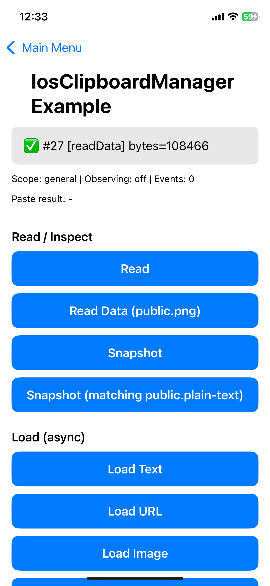
</p>

#### スナップショット

本文に触れず、メタデータのみを読み取ります。事前確認にはこちらを使用してください。iOS 16 以降の許可ダイアログと iOS 14 以降のアクセス通知のいずれも発生させないと Apple が明記している API のみで構成しています。

```swift
Task {
    let snapshot = try await IosClipboardManager.shared.snapshot(scope: scope)
    // snapshot.hasStrings, snapshot.hasURLs, snapshot.hasImages, snapshot.hasColors
    // snapshot.numberOfItems, snapshot.typeIdentifiers, snapshot.allTypeIdentifiers
    if snapshot.hasStrings {
        // ペースト用の UI を表示する
    }
}
```

<p align="center">
    
</p>

`hasStrings` では、特定の型としてのペーストが成功するかどうかは判断できません。たとえば `public.vcard` は `public.plain-text` のサブタイプではなく兄弟型のため、`hasStrings` を満たしていてもプレーンテキストとしてはロードできません。受け付ける型は明示的に宣言してください（[ペーストコントロール](#ペーストコントロール)を参照）。

#### スナップショット（型を指定）

`matchingTypes` を渡すと、指定した型を持つアイテムのインデックスも取得できます。`matchingTypes` を指定しなかった場合、`matchingItemIndexes` は `nil` になります。

```swift
Task {
    let snapshot = try await IosClipboardManager.shared.snapshot(
        matchingTypes: ["public.plain-text"],
        scope: scope
    )
    print(snapshot.matchingItemIndexes ?? [])
}
```

<p align="center">
    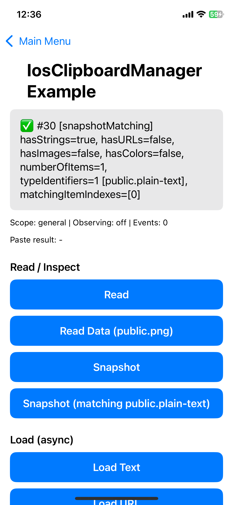
</p>

#### プライバシー: 確認ダイアログと通知

`read` / `readData` / `loadItem` はペーストボードからデータを取得するため、システムの判断により iOS 16 以降の許可ダイアログや iOS 14 以降のアクセス通知が表示されることがあります。事前確認には `snapshot` を使用してください。

`UIPasteControl`（`makePasteControl` 経由）は iOS 16 以降の許可ダイアログを回避しますが、iOS 14 以降のアクセス通知も回避すると Apple は明記していません。いずれかが表示されないことを前提にする場合は、対象 OS バージョンの実機で確認してください。

---

### 非同期ロード

`loadItem` は `NSItemProvider` 経由でアイテムを解決します。表現の変換や、メインスレッド外での画像デコードが可能です。`read` だけでは足りない場合に使用してください。

#### テキストをロード

```swift
Task {
    let item = try await IosClipboardManager.shared.loadItem(.text, scope: scope)
    if case .text(let value) = item {
        print(value.count)
    }
}
```

<p align="center">
    
</p>

#### URL をロード

```swift
Task {
    let item = try await IosClipboardManager.shared.loadItem(.url, scope: scope)
    if case .url(let value) = item {
        print(value)
    }
}
```

<p align="center">
    
</p>

#### 画像をロード

画像はバックグラウンドの executor 上で PNG に再エンコードされるため、戻り値の UTI は常に `public.png` になります。

```swift
Task {
    let item = try await IosClipboardManager.shared.loadItem(.image, scope: scope)
    if case .imageData(let data, let utType) = item {
        print(data.count, utType)
    }
}
```

<p align="center">
    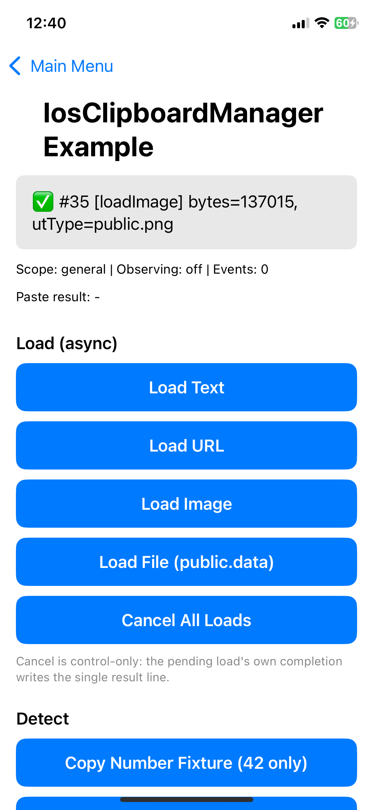
</p>

#### ファイルをロード

アイテムを一時ファイルにコピーし、その URL を引き渡します。**戻り値の URL とその親ディレクトリの所有権は呼び出し元に移る**ため、使い終わったら削除してください。引き渡されなかったファイル（失敗・キャンセル・タイムアウト）は、ライブラリ内部でクリーンアップします。

```swift
Task {
    let item = try await IosClipboardManager.shared.loadItem(
        .file(utType: "public.data"),
        scope: scope
    )
    if case .file(let url) = item {
        let size = (try? url.resourceValues(forKeys: [.fileSizeKey]).fileSize) ?? -1
        print(size)
        // ファイル単体ではなく、ライブラリが引き渡したディレクトリを削除します。
        try? FileManager.default.removeItem(at: url.deletingLastPathComponent())
    }
}
```

<p align="center">
    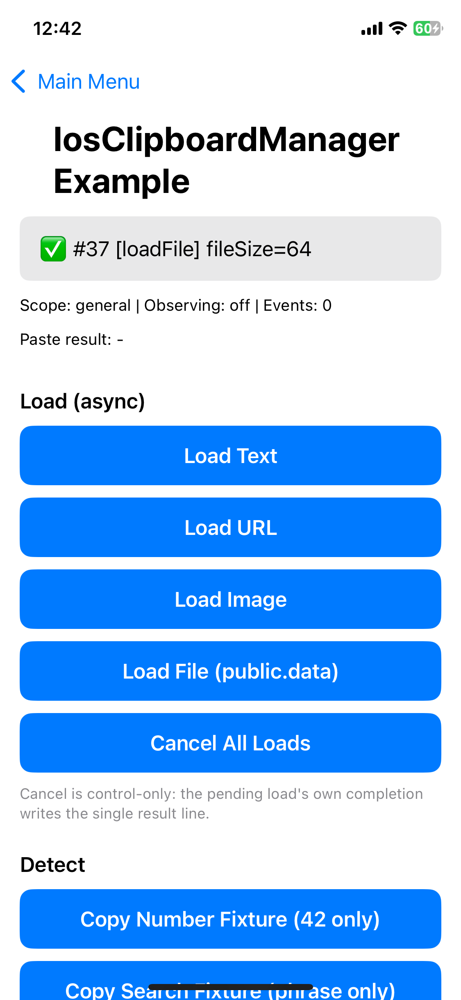
</p>

#### すべてのロードをキャンセル

保留中のロードをすべてキャンセルします。キャンセルされたロードは、`async throws` 形式では `ClipboardError.cancelled`（`CLIPBOARD_CANCELLED`）を throw し、コールバック形式では同じコードとともに `isSuccess == false` を報告します。呼び出し元は、これを無視してよい正常な結果として扱えます。

```swift
IosClipboardManager.shared.cancelAllLoads()
```

コールバック形式は `ClipboardLoadToken` を返すため、個別のロードだけをキャンセルすることもできます。

```swift
let token = IosClipboardManager.shared.loadItem(.image, scope: scope) { isSuccess, item, errorCode, errorMessage in
    print(isSuccess, errorCode ?? "nil")
}
token.cancel()
```

---

### 検出

データ検出は、本文を読み取らずに（したがって許可ダイアログを出さずに）、ペーストボードが何を含むかを報告します。

```swift
public enum ClipboardDetectionPattern: String, CaseIterable {
    case probableWebURL, probableWebSearch, number, link, emailAddress, phoneNumber
    case postalAddress, calendarEvent, flightNumber, moneyAmount, shipmentTrackingNumber
}
```

#### パターンを検出

要求したパターンのうち、検出されたものを返します。空のパターン集合を渡すと `ClipboardError.emptyDetectionPatterns` を throw します。

```swift
Task {
    let patterns = try await IosClipboardManager.shared.detectPatterns(
        Set(ClipboardDetectionPattern.allCases),
        scope: scope
    )
    print(patterns.map(\.rawValue).sorted())
}
```

<p align="center">
    
</p>

#### 値を検出

検出された値そのものを返します。この操作は内容を読み取るため、プライバシー上は `read` と同じ扱いにしてください。

```swift
Task {
    let values = try await IosClipboardManager.shared.detectValues(
        Set(ClipboardDetectionPattern.allCases),
        scope: scope
    )
    print(values.detectedPatterns.count)
    // values.links, values.emailAddresses, values.phoneNumbers, values.postalAddresses,
    // values.calendarEvents, values.flightNumbers, values.moneyAmounts,
    // values.shipmentTrackingNumbers, values.number, values.probableWebURL, values.probableWebSearch
}
```

<p align="center">
    
</p>

#### number と probableWebSearch はクリップボード全体を分類します

`number` と `probableWebSearch` は、内容から出現箇所を抽出するのではなく、クリップボード**全体**を分類します。数値に言及しているだけの文章は、数値でも検索語句でもありません。そのため、混在した内容ではこの 2 つのパターンは検出されません。これらを確認する場合は、値だけを単独でコピーしてください。

```swift
try await IosClipboardManager.shared.copy(.plainText("42"), scope: scope)                 // number
try await IosClipboardManager.shared.copy(.plainText("swift concurrency"), scope: scope)  // probableWebSearch
```

#### 検出にキャンセルトークンはありません

`detectPatterns` / `detectValues` は `UIPasteboard` の `async` 検出 API をラップしていますが、この API はキャンセルに対応していません。Task のキャンセルや内部の 5 秒タイムアウトは直ちに呼び出し元へ制御を返しますが、その裏でシステム呼び出しが動き続ける可能性があります。その結果は破棄されます。

---

### 変更監視

#### 監視を開始

1 つのスコープについて変更の監視を開始します。2 回目の呼び出し（同じスコープでも別のスコープでも）は、まず直前の監視を停止するため、同時に有効な購読は常に 1 つだけです。

イベントはメインスレッド上で配信されます。

```swift
do {
    try IosClipboardManager.shared.startObserving(scope: scope) { event in
        switch event.kind {
        case .changed(let typesAdded, let typesRemoved):
            print(typesAdded, typesRemoved)
        case .changedDetectedOnForeground:
            // フォアグラウンド復帰時の changeCount 比較で検出された変更
            break
        case .removed:
            // 名前付きペーストボード自体が削除された
            break
        }
    }
} catch let error as ClipboardError {
    // pasteboardUnavailable: スコープを解決できず、監視は開始されていません
    print(error.errorCode)
}
```

`UIPasteboard.changedNotification` は、**このアプリがフォアグラウンドにある間にこのアプリが行った変更**に対してのみ通知されます。他のアプリによる変更や、バックグラウンド中の変更では通知が発生しません。その場合は `checkForegroundChange` を使用してください。

#### 監視を停止

```swift
IosClipboardManager.shared.stopObserving()
```

監視を行っている画面を破棄するときに呼び出してください。

```swift
.onDisappear {
    IosClipboardManager.shared.stopObserving()
}
```

#### フォアグラウンド復帰時の変更確認

ペーストボードの `changeCount` を、このマネージャーが最後に記録した値と比較し、変化したかどうかを返します。通知が発生しない変更を拾うため、アプリがフォアグラウンドへ復帰したときに呼び出してください。

```swift
let changed = IosClipboardManager.shared.checkForegroundChange(scope: scope)
```

あるスコープに対する最初の呼び出しは基準値を確立するため、必ず `false` を返します。基準値は `startObserving` や変更通知の受信によっても更新されます。戻り値の `Bool` では「解決できて変化がない」と「解決できない」を区別できません。その違いが必要な場合は `snapshot` を使用してください。

---

### ペーストコントロール

`UIPasteControl` はシステムのペーストボタンです。ユーザーのタップ自体が同意にあたるため、iOS 16 以降の許可ダイアログを回避できます。

#### ペーストコントロールを作成

`makePasteControl` は、配置するだけで使える 1 つのビューを返します。内部のレシーバーは自動的にレスポンダチェーンへ加わるため、返されたビューをそのままビュー階層に追加してください。

`acceptedTypes` は空にできず（`ClipboardError.invalidRequest`）、各要素は有効な UTI である必要があります（`ClipboardError.invalidTypeIdentifier`）。

```swift
let pasteView = try IosClipboardManager.shared.makePasteControl(
    acceptedTypes: ["public.plain-text", "public.url", "public.image"],
    onPaste: { items in
        print(items.count)
    },
    onPartialFailure: { errors in
        // ペーストされたアイテムの一部をロードできなかった場合
        print(errors.map(\.errorCode))
    },
    onPasteFailure: { error in
        // ペースト自体が失敗した場合
        print(error.errorCode)
    }
)
```

`displayMode` の既定値は `.iconAndLabel` です。ボタンの見た目を変える場合は `.iconOnly` / `.labelOnly` / `.arrowAndLabel` を指定します。ペーストの動作はどのモードでも同じです。

SwiftUI では `UIViewRepresentable` でラップします。

```swift
struct ClipboardPasteControlView: UIViewRepresentable {
    let acceptedTypes: [String]
    let onPaste: ([ClipboardLoadedItem]) -> Void
    let onPartialFailure: ([ClipboardError]) -> Void
    let onPasteFailure: (ClipboardError) -> Void
    let onCreationFailure: (ClipboardError) -> Void

    func makeUIView(context: Context) -> UIView {
        do {
            return try IosClipboardManager.shared.makePasteControl(
                acceptedTypes: acceptedTypes,
                onPaste: onPaste,
                onPartialFailure: onPartialFailure,
                onPasteFailure: onPasteFailure
            )
        } catch let error as ClipboardError {
            // makeUIView 内で同期的に報告すると "Modifying state during view update" が発生する
            // ため、次のメインアクターのターンへ遅延させます。
            Task { @MainActor in onCreationFailure(error) }
            return UIView()
        } catch {
            Task { @MainActor in onCreationFailure(.unknown(ClipboardFailureDetail(systemError: error))) }
            return UIView()
        }
    }

    func updateUIView(_ uiView: UIView, context: Context) {}
}
```

<p align="center">
    
</p>

ペーストボタンは、他の箇所で使用している `scope` とは無関係に、常にシステムの一般ペーストボードを対象とします。

保留中のペーストがキャンセルされた場合（新しいペーストが発生した場合や、ビューが破棄された場合）、`onPaste` / `onPartialFailure` / `onPasteFailure` は**呼び出されません**。キャンセルは呼び出し元が起点であり、ペースト結果としては通知しません。

ボタンとレシーバーを個別に配置する必要がある高度なケースには `PasteControlFactory.makeComponents` を使用できます。その場合、レシーバーの保持と配置は**呼び出し元の責任**になります。

---

### クリア

スコープからすべてのアイテムを削除します。ペーストボード自体は残ります。

```swift
Task {
    try await IosClipboardManager.shared.clear(scope: scope)
}
```

<p align="center">
    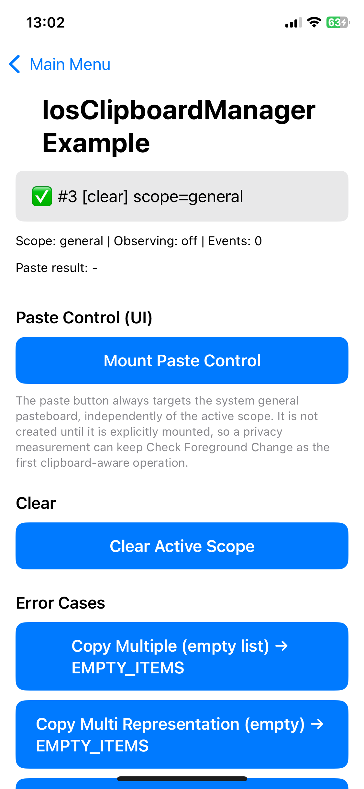
</p>

---

### エラー処理

`async throws` 形式は `ClipboardError` を throw します。コールバック形式は同じ失敗を `errorCode` / `errorMessage` で報告し、成功時はいずれも `nil` になります。

`errorMessage` はケースごとに固定の英語文字列で、**入力値を埋め込みません**。そのままログに出力しても安全です。

| `errorCode` | ケース | 原因 | エラーメッセージ |
|---|---|---|---|
| `CLIPBOARD_EMPTY_CONTENT` | `emptyContent` | テキストも HTML も含まない内容 | `"Clipboard content is empty. Please provide text or HTML."` |
| `CLIPBOARD_EMPTY_ITEMS` | `emptyItemList` | `.multipleText([])` または `.multiRepresentation([:])` | `"No items provided for clipboard copy."` |
| `CLIPBOARD_EMPTY_PATTERNS` | `emptyDetectionPatterns` | 空のパターン集合で検出を呼び出した | `"No detection patterns were specified."` |
| `CLIPBOARD_INVALID_URL` | `invalidURL` | URL が空、またはスキームが `http` / `https` / `file` 以外 | `"The URL is invalid."` |
| `CLIPBOARD_INVALID_TYPE` | `invalidTypeIdentifier` | UTI の構文が不正 | `"The uniform type identifier is invalid."` |
| `CLIPBOARD_INVALID_NAME` | `invalidPasteboardName` | ペーストボード名が空、または使用できない | `"The pasteboard name is invalid."` |
| `CLIPBOARD_INVALID_COLOR` | `invalidColor` | RGBA の成分が有限値でない、または `0.0...1.0` の範囲外 | `"Color components must be finite and within 0.0...1.0."` |
| `CLIPBOARD_INVALID_IMAGE_DATA` | `invalidImageData` | 渡されたバイト列を画像としてデコードできない | `"The provided image data could not be decoded."` |
| `CLIPBOARD_INVALID_EXPIRATION` | `invalidExpirationDate` | `expirationDate` が未来ではない | `"expirationDate must be in the future."` |
| `CLIPBOARD_INVALID_REQUEST` | `invalidRequest` | リクエストが不正（`acceptedTypes` が空など） | `"The request is invalid."` |
| `CLIPBOARD_CONTENT_TOO_LARGE` | `contentTooLarge` | ペイロードが上限（既定 64 MiB）を超えた | `"The clipboard content exceeds the configured size limit."` |
| `CLIPBOARD_FILE_NOT_FOUND` | `fileNotFound` | `.imageFile(path:)` のパスが存在しない | `"The requested file was not found."` |
| `CLIPBOARD_IMAGE_LOAD_FAILED` | `imageLoadFailed` | ファイルは存在するが画像としてデコードできない | `"Failed to load the image."` |
| `CLIPBOARD_IMAGE_ENCODE_FAILED` | `imageEncodingFailed` | ペーストされた画像を PNG に再エンコードできない | `"Failed to encode the pasted image."` |
| `CLIPBOARD_UNAVAILABLE` | `pasteboardUnavailable` | 名前付き / ユニークペーストボードを解決できない | `"The requested pasteboard is unavailable."` |
| `CLIPBOARD_CANNOT_REMOVE_GENERAL` | `cannotRemoveGeneralPasteboard` | `removePasteboard(.general)` を呼び出した | `"The general pasteboard cannot be removed."` |
| `CLIPBOARD_NO_MATCHING_ITEM` | `noMatchingItem` | 要求した型を持つアイテムがない | `"No clipboard item matches the requested type."` |
| `CLIPBOARD_LOAD_FAILED` | `providerLoadFailed` | `NSItemProvider` がアイテムのロードに失敗した | `"Failed to load the clipboard item."` |
| `CLIPBOARD_UNEXPECTED_TYPE` | `unexpectedType` | アイテムを要求した型へ変換できない | `"The clipboard item could not be converted to the requested type."` |
| `CLIPBOARD_FILE_COPY_FAILED` | `fileCopyFailed` | ペーストされたファイルの一時領域へのコピーに失敗した | `"Failed to copy the pasted file."` |
| `CLIPBOARD_CANCELLED` | `cancelled` | 呼び出し元がロードをキャンセルした | `"The clipboard load was cancelled."` |
| `CLIPBOARD_TIMED_OUT` | `timedOut` | 操作がタイムアウトした | `"The clipboard operation timed out."` |
| `CLIPBOARD_DETECTION_FAILED` | `detectionFailed` | データ検出システムが失敗を報告した | `"Pattern detection failed."` |
| `CLIPBOARD_UNKNOWN` | `unknown` | 分類できないシステムエラー | `"An unknown error occurred."` |

空のクリップボードは、これらのエラーには**該当しません**。`read` は `numberOfItems == 0` を返し、`readData` は `nil` を返します。いずれも正常な状態です。

```swift
Task {
    do {
        try await IosClipboardManager.shared.copy(.url("example.com"), scope: scope)
    } catch ClipboardError.invalidURL {
        // スキームがない
    } catch let error as ClipboardError {
        print(error.errorCode, error.errorDescription ?? "nil")
    }
}
```
