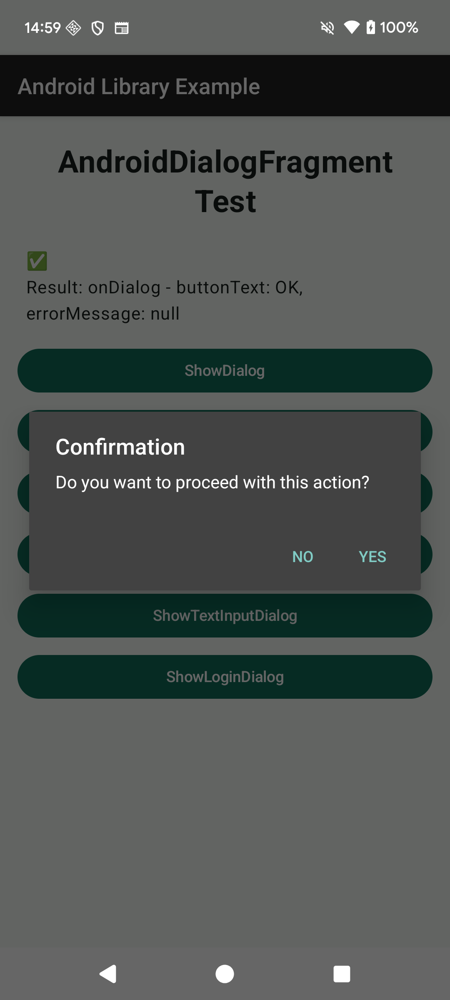
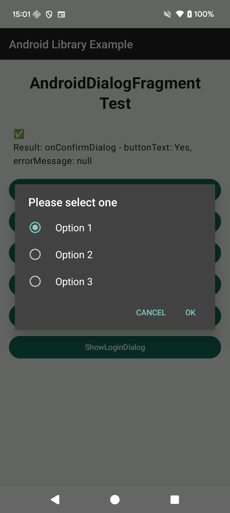
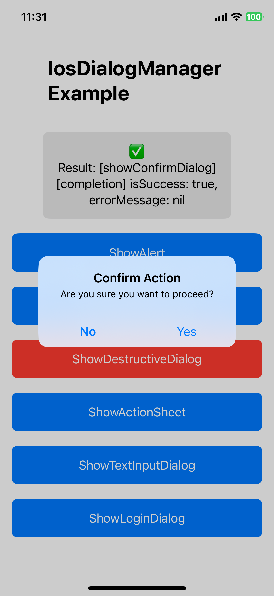
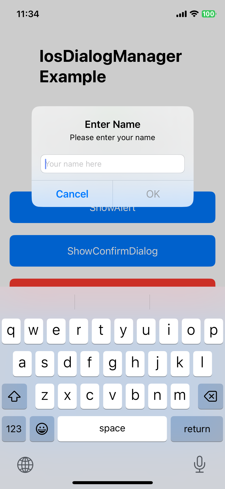
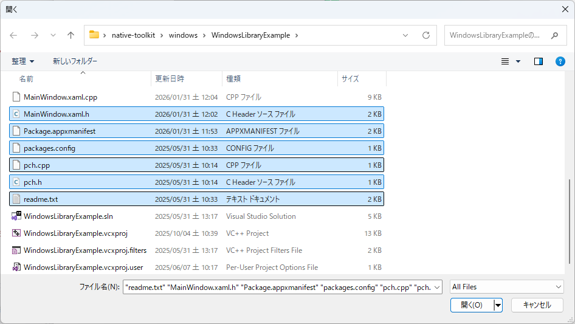
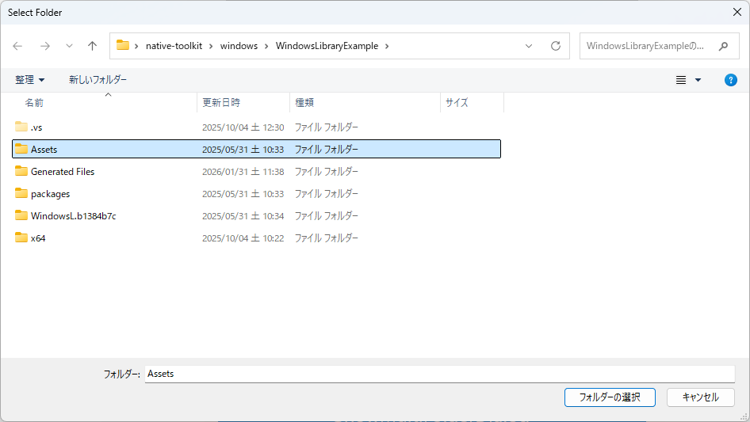
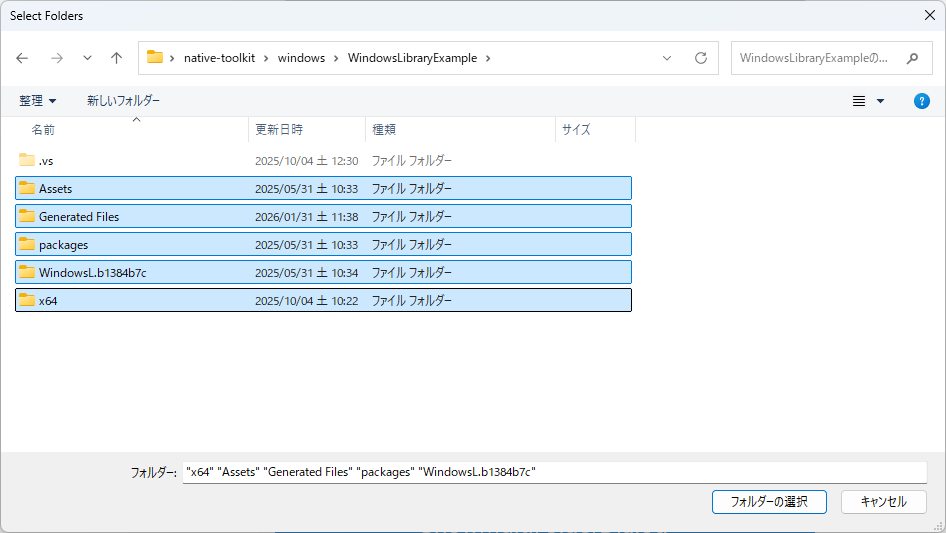
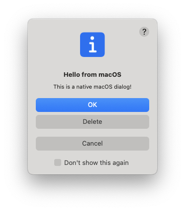
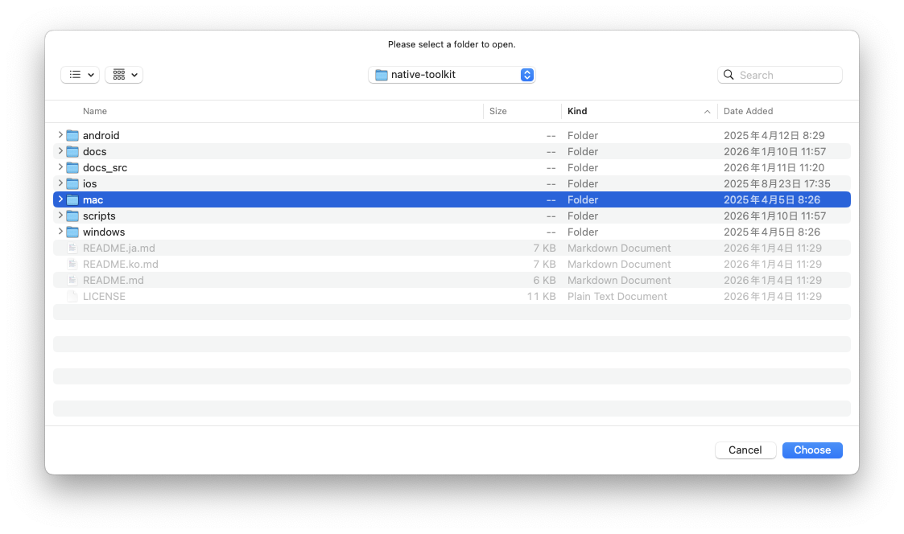
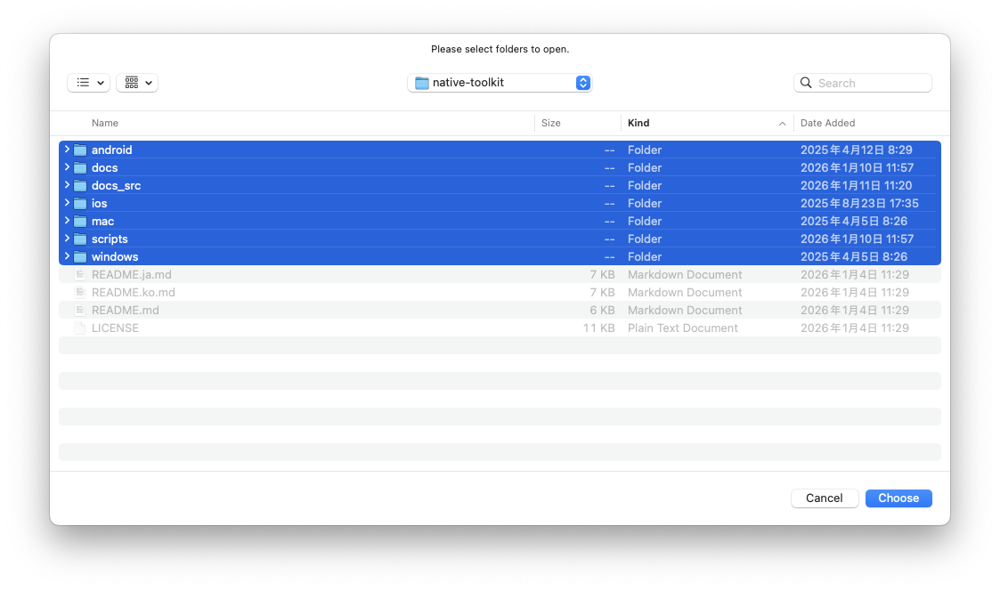

# native-toolkit マニュアル

言語:

- English: [index.md](index.md)
- 日本語（このページ）
- 한국어: [index.ko.md](index.ko.md)

このディレクトリの Markdown は、バージョン付きドキュメントとして `docs/<version>/manual/` に公開されます。

# 目的

- 自動生成（Dokka / DocC / Doxygen）では補いにくい「使い方」「FAQ」などをまとめる
- 生成物の `docs/` と分離して、publish 時に上書きされないようにする

# 目次（例）

- インストール / 導入（Unity 向け）
- プラットフォーム別セットアップ
  - Android (Gradle)
  - iOS (Xcode)
  - macOS (Xcode)
  - Windows (Visual Studio)
- よくあるエラー
- API 使用例（C#）

# 自動生成ドキュメントへのリンク

- Android: `docs/<version>/android/`
- iOS: `docs/<version>/ios/`
- macOS: `docs/<version>/mac/`
- Windows: `docs/<version>/windows/`

# Native Toolkit

- ネイティブ機能を提供するツールキットです。
- パッケージには Android/iOS/Windows/macOS 用のネイティブプラグインとサンプルシーンが含まれ、各プラットフォームのダイアログ操作をシングルトン API で扱えます。

# バージョン

## 1.0.0

# 対応 OS バージョン

- Android 12 以降
- iOS 18 以降
- Windows 11 以降
- macOS 15 以降

# 機能一覧

## Android

- ダイアログ機能
  - 基本ダイアログ
  - 確認ダイアログ
  - シングル選択ダイアログ
  - マルチ選択ダイアログ
  - 入力ダイアログ
  - ログインダイアログ

## iOS

- ダイアログ機能
  - 基本ダイアログ
  - 確認ダイアログ
  - ディストラクティブなダイアログ
  - アクションシート
  - 入力ダイアログ
  - ログインダイアログ

## Windows

- ダイアログ機能
  - 基本ダイアログ
  - ファイル選択ダイアログ
  - 複数ファイル選択ダイアログ
  - フォルダ選択ダイアログ
  - 複数フォルダ選択ダイアログ
  - ファイル保存ダイアログ

## Mac

- ダイアログ機能
  - 基本ダイアログ
  - ファイル選択ダイアログ
  - 複数ファイル選択ダイアログ
  - フォルダ選択ダイアログ
  - 複数フォルダ選択ダイアログ
  - ファイル保存ダイアログ

## 追加予定機能

- シェア機能
- クリップボード連携
- 通知

## サンプル

- Android サンプル
  - Android Studio をインストールします。
    - <a href="https://developer.android.com/studio?hl=ja" target="_blank" rel="noopener noreferrer">参考サイト</a>
  - Android Studio を起動します。
  - 「File」→「Open...」 を選択します。
  - 「native-toolkit/android/AndroidLibraryExample」を選択して「開く」ボタンをクリックします。
  - Android 端末を接続します。
  - 「Run」ボタンをクリックして、サンプルアプリをインストールします。
    

- iOS サンプル
  - Xcode をインストールしてください。
    - <a href="https://developer.apple.com/jp/xcode" target="_blank" rel="noopener noreferrer">参考サイト</a>
  - Xcode を起動します。
  - 「Open Existing Project...」 を選択します。
  - 「native-toolkit/ios/IosWorkspace.xcworkspace」を選択して「Open」ボタンをクリックします。
  - 「Run」ボタンをクリックして、サンプルアプリをインストールします。
    

- Windows サンプル
  - Visual Studio 2022 をインストールしてください。
    - <a href="https://visualstudio.microsoft.com/ja/vs/" target="_blank" rel="noopener noreferrer">参考サイト</a>
  - Visual Studio 2022 を起動します。
  - 「プロジェクトやソリューションを開く(P)」 を選択します。
  - 「native-toolkit\windows\WindowsLibraryExample\WindowsLibraryExample.sln」を選択して「開く」ボタンをクリックします。
  - 「デバッグ(D)」→「デバッグ開始(S)」 を選択して、サンプルアプリをインストールします。
    

- Mac サンプル
  - Xcode をインストールしてください。
    - <a href="https://developer.apple.com/jp/xcode" target="_blank" rel="noopener noreferrer">参考サイト</a>
  - Xcode を起動します。
  - 「Open Existing Project...」 を選択します。
  - 「native-toolkit/mac/MacWorkspace.xcworkspace」を選択して「Open」ボタンをクリックします。
  - 「Run」ボタンをクリックして、サンプルアプリをインストールします。
    

## ライブラリ組み込み方法

### Windows（NuGet ローカルパッケージ）

#### 対応プラットフォーム: Windows x64

1. 「NativeToolkit.1.0.0.nupkg」を 「C:\packages」にコピーします。
2. Visual Studio 2022 を起動し、ツール → オプション → NuGet パッケージ マネージャー → パッケージ ソース を開きます。
3. 右上の + を押し、次の内容を入力します。  
   - 名前: LocalPackages  
   - ソース: C:\packages  
   入力後、「更新」ボタンを押して保存します。
4. 対象のソリューションを開きます。
5. ソリューション エクスプローラーでプロジェクトを右クリックし、「NuGet パッケージの管理」を選択します。
6. 右上の 「パッケージ ソース」を LocalPackages に切り替えます。
7. 検索欄で NativeToolkit を検索し、インストール をクリックします。
8. ライセンス確認が表示された場合は承諾し、インストール完了です。

# API 使用方法

## ダイアログ

## AndroidDialogFragment

### 基本ダイアログ

- ダイアログを表示します。

```kotlin
// タイトルを設定します。必須項目です。
val title = "Hello from Android";
// メッセージを設定します。必須項目です。
val message = "This is a native Android dialog!";
// ボタンのテキストを設定します。未設定の場合、"OK" が使用されます。
val buttonText = "OK";
// ダイアログの外をタップした場合、キャンセル可能かを設定します。未設定の場合、true が使用されます。
val cancelableOnTouchOutside = false;
// バックキーなどでダイアログがキャンセル可能かを設定します。未設定の場合、true が使用されます。
val cancelable = false;

AndroidDialogFragment.newInstance(
    title = title,
    message = message,
    buttonText = buttonText,
    cancelableOnTouchOutside = cancelableOnTouchOutside,
    cancelable = cancelable
).apply {
    // ダイアログの結果を受け取るリスナーを設定します。
    setDialogListener(object : AndroidDialogFragment.DialogListener {
        // dialog: ダイアログインスタンス
        // buttonText:　押下したボタンのテキストを取得します。エラーの場合、null を返します。
        // isSuccessful: ダイアログ表示成功のプラグを取得します。成功の場合、true を返します。
        // errorMessage: エラーが発生した場合、エラー内容を取得します。成功の場合、null を返します。
        override fun onDialog(
            dialog: AndroidDialogFragment,
            buttonText: String?,
            isSuccessful: Boolean,
            errorMessage: String?) {
                Log.d(TAG, "onDialog - buttonText: $buttonText, isSuccessful: $isSuccessful, errorMessage: $errorMessage")
        }
    })
    // 第1引数は FragmentManager を指定します。
    // 第2引数はダイアログのタグ名を指定します。
    show(supportFragmentManager, "AndroidDialogFragment")
}
```


### 確認ダイアログ

- ダイアログを表示します。

```kotlin
// タイトルを設定します。必須項目です。
val title = "Confirmation"
// メッセージを設定します。必須項目です。
val message = "Do you want to proceed with this action?"
// 否定ボタンのテキストを設定します。未設定の場合、"No" が使用されます。
val negativeButtonText = "No"
// 肯定ボタンのテキストを設定します。未設定の場合、"Yes" が使用されます。
val positiveButtonText = "Yes"
// ダイアログの外をタップした場合、キャンセル可能かを設定します。未設定の場合、true が使用されます。
val cancelableOnTouchOutside = false
// バックキーなどでダイアログがキャンセル可能かを設定します。未設定の場合、true が使用されます。
val cancelable = false

AndroidDialogFragment.newInstance(
    title = title,
    message = message,
    negativeButtonText = negativeButtonText,
    positiveButtonText = positiveButtonText,
    cancelableOnTouchOutside = cancelableOnTouchOutside,
    cancelable = cancelable
).apply {
    // 確認ダイアログの結果を受け取るリスナーを設定します。
    setConfirmDialogListener(object : AndroidDialogFragment.ConfirmDialogListener {
        // dialog: ダイアログインスタンス
        // buttonText:　押下したボタンのテキストを取得します。エラーの場合、null を返します。
        // isSuccessful: ダイアログ表示成功のプラグを取得します。成功の場合、true を返します。
        // errorMessage: エラーが発生した場合、エラー内容を取得します。成功の場合、null を返します。
        override fun onConfirmDialog(
            dialog: AndroidDialogFragment,
            buttonText: String?,
            isSuccessful: Boolean,
            errorMessage: String?) {
                Log.d(TAG, "onConfirmDialog - buttonText: $buttonText, isSuccessful: $isSuccessful, errorMessage: $errorMessage")
        }
    })
    // 第1引数は FragmentManager を指定します。
    // 第2引数はダイアログのタグ名を指定します。
    show(supportFragmentManager, "AndroidDialogFragment")
}
```



### シングル選択ダイアログ

- ダイアログを表示します。

```kotlin
// タイトルを設定します。必須項目です。
val title = "Please select one"
// 選択肢を設定します。必須項目です。
val singleChoiceItems = arrayOf("Option 1", "Option 2", "Option 3")
// デフォルト選択項目のindex番号を設定します。未設定の場合、0 が使用されます。
val checkedItem = 0
// 否定ボタンのテキストを設定します。未設定の場合、"Cancel" が使用されます。
val negativeButtonText = "Cancel"
// 肯定ボタンのテキストを設定します。未設定の場合、"OK" が使用されます。
val positiveButtonText = "OK"
// ダイアログの外をタップした場合、キャンセル可能かを設定します。未設定の場合、true が使用されます。
val cancelableOnTouchOutside = false
// バックキーなどでダイアログがキャンセル可能かを設定します。未設定の場合、true が使用されます。
val cancelable = false

AndroidDialogFragment.newInstance(
    title = title,
    singleChoiceItems = singleChoiceItems,
    checkedItem = checkedItem,
    negativeButtonText = negativeButtonText,
    positiveButtonText = positiveButtonText,
    cancelableOnTouchOutside = cancelableOnTouchOutside,
    cancelable = cancelable
).apply {
    // シングル選択ダイアログの結果を受け取るリスナーを設定します。
    setSingleChoiceItemDialogListener(object : AndroidDialogFragment.SingleChoiceItemDialogListener {
        // dialog: ダイアログインスタンス
        // buttonText:　押下したボタンのテキストを取得します。エラーの場合、null を返します。
        // checkedItem: 選択された項目のindex番号を取得します。エラーの場合、null を返します。
        // isSuccessful: ダイアログ表示成功のプラグを取得します。成功の場合、true を返します。
        // errorMessage: エラーが発生した場合、エラー内容を取得します。成功の場合、null を返します。
        override fun onSingleChoiceItemDialog(
            dialog: AndroidDialogFragment,
            buttonText: String?,
            checkedItem: Int?,
            isSuccessful: Boolean,
            errorMessage: String?) {
                Log.d(TAG, "onSingleChoiceItemDialog - buttonText: $buttonText, checkedItem: $checkedItem, isSuccessful: $isSuccessful, errorMessage: $errorMessage")
        }
    })
    // 第1引数は FragmentManager を指定します。
    // 第2引数はダイアログのタグ名を指定します。
    show(supportFragmentManager, "AndroidDialogFragment")
}
```



### マルチ選択ダイアログ

- ダイアログを表示します。

```kotlin
// タイトルを設定します。必須項目です。
val title = "Multiple Selection"
// 選択肢を設定します。必須項目です。
val multiChoiceItems = arrayOf("Option 1", "Option 2", "Option 3", "Option 4")
// デフォルト選択項目の選択状態を設定します。未設定の場合、すべて false が使用されます。
val checkedItems = booleanArrayOf(false, true, false, true)
// 否定ボタンのテキストを設定します。未設定の場合、"Cancel" が使用されます。
val negativeButtonText = "Cancel"
// 肯定ボタンのテキストを設定します。未設定の場合、"OK" が使用されます。
val positiveButtonText = "OK"
// ダイアログの外をタップした場合、キャンセル可能かを設定します。未設定の場合、true が使用されます。
val cancelableOnTouchOutside = false
// バックキーなどでダイアログがキャンセル可能かを設定します。未設定の場合、true が使用されます。
val cancelable = false

AndroidDialogFragment.newInstance(
    title = title,
    multiChoiceItems = multiChoiceItems,
    checkedItems = checkedItems,
    negativeButtonText = negativeButtonText,
    positiveButtonText = positiveButtonText,
    cancelableOnTouchOutside = cancelableOnTouchOutside,
    cancelable = cancelable
).apply {
    // マルチ選択ダイアログの結果を受け取るリスナーを設定します。
    setMultiChoiceItemDialogListener(object : AndroidDialogFragment.MultiChoiceItemDialogListener {
        // dialog: ダイアログインスタンス
        // buttonText:　押下したボタンのテキストを取得します。エラーの場合、null を返します。
        // checkedItems: 選択された項目の選択状態を取得します。選択はtrue, 未選択はfalse。エラーの場合、null を返します。
        // isSuccessful: ダイアログ表示成功のプラグを取得します。成功の場合、true を返します。
        // errorMessage: エラーが発生した場合、エラー内容を取得します。成功の場合、null を返します。
        override fun onMultiChoiceItemDialog(
            dialog: AndroidDialogFragment,
            buttonText: String?,
            checkedItems: BooleanArray?,
            isSuccessful: Boolean,
            errorMessage: String?) {
                Log.d(TAG, "onMultiChoiceItemDialog - buttonText: $buttonText, checkedItems: ${checkedItems.contentToString()}, isSuccessful: $isSuccessful, errorMessage: $errorMessage")
        }
    })
    // 第1引数は FragmentManager を指定します。
    // 第2引数はダイアログのタグ名を指定します。
    show(supportFragmentManager, "AndroidDialogFragment")
}
```


### 入力ダイアログ

- ダイアログを表示します。

```kotlin
// タイトルを設定します。必須項目です。
val title = "Text Input"
// メッセージを設定します。必須項目です。
val message = "Please enter your name"
// プレースホルダーを設定します。未設定の場合、空文字列が使用されます。
val hint = "Enter here..."
// 否定ボタンのテキストを設定します。未設定の場合、"Cancel" が使用されます。
val negativeButtonText = "Cancel"
// 肯定ボタンのテキストを設定します。未設定の場合、"OK" が使用されます。
val positiveButtonText = "OK"
// 入力値が空の場合、肯定ボタンが有効になるかを設定します。未設定の場合、false が使用されます。
val enablePositiveButtonWhenEmpty = false
// ダイアログの外をタップした場合、キャンセル可能かを設定します。未設定の場合、true が使用されます。
val cancelableOnTouchOutside = false
// バックキーなどでダイアログがキャンセル可能かを設定します。未設定の場合、true が使用されます。
val cancelable = false

AndroidDialogFragment.newInstance(
    title = title,
    message = message,
    hint = hint,
    negativeButtonText = negativeButtonText,
    positiveButtonText = positiveButtonText,
    enablePositiveButtonWhenEmpty = enablePositiveButtonWhenEmpty,
    cancelableOnTouchOutside = cancelableOnTouchOutside,
    cancelable = cancelable
).apply {
    // 入力ダイアログの結果を受け取るリスナーを設定します。
    setTextInputDialogListener(object : AndroidDialogFragment.TextInputDialogListener {
        // dialog: ダイアログインスタンス
        // buttonText:　押下したボタンのテキストを取得します。エラーの場合、null を返します。
        // inputText: 入力されたテキストを取得します。エラーの場合、null を返します。
        // isSuccessful: ダイアログ表示成功のプラグを取得します。成功の場合、true を返します。
        // errorMessage: エラーが発生した場合、エラー内容を取得します。成功の場合、null を返します。
        override fun onTextInputDialog(
            dialog: AndroidDialogFragment,
            buttonText: String?,
            inputText: String?,
            isSuccessful: Boolean,
            errorMessage: String?) {
                Log.d(TAG, "onTextInputDialog - buttonText: $buttonText, inputText: $inputText, isSuccessful: $isSuccessful, errorMessage: $errorMessage")
        }
    })
    // 第1引数は FragmentManager を指定します。
    // 第2引数はダイアログのタグ名を指定します。
    show(supportFragmentManager, "AndroidDialogFragment")
}
```


### ログインダイアログ

- ダイアログを表示します。

```kotlin
// タイトルを設定します。必須項目です。
val title = "Login"
// メッセージを設定します。必須項目です。
val message = "Please enter your credentials"
// ユーザ名のプレースホルダーを設定します。未設定の場合、"Username" が使用されます。
val usernameHint = "Username"
// パスワードのプレースホルダーを設定します。未設定の場合、"Password" が使用されます。
val passwordHint = "Password"
// 否定ボタンのテキストを設定します。未設定の場合、"Cancel" が使用されます。
val negativeButtonText = "Cancel"
// 肯定ボタンのテキストを設定します。未設定の場合、"Login" が使用されます。
val positiveButtonText = "Login"
// 入力値が空の場合、肯定ボタンが有効になるかを設定します。未設定の場合、false が使用されます。
val enablePositiveButtonWhenEmpty = false
// ダイアログの外をタップした場合、キャンセル可能かを設定します。未設定の場合、true が使用されます。
val cancelableOnTouchOutside = false
// バックキーなどでダイアログがキャンセル可能かを設定します。未設定の場合、true が使用されます。
val cancelable = false

AndroidDialogFragment.newInstance(
    title = title,
    message = message,
    usernameHint = usernameHint,
    passwordHint = passwordHint,
    negativeButtonText = negativeButtonText,
    positiveButtonText = positiveButtonText,
    enablePositiveButtonWhenEmpty = enablePositiveButtonWhenEmpty,
    cancelableOnTouchOutside = cancelableOnTouchOutside,
    cancelable = cancelable
).apply {
    // ログインダイアログの結果を受け取るリスナーを設定します。
    setLoginDialogListener(object : AndroidDialogFragment.LoginDialogListener {
        // dialog: ダイアログインスタンス
        // buttonText:　押下したボタンのテキストを取得します。エラーの場合、null を返します。
        // username: 入力されたユーザ名を取得します。エラーの場合、null を返します。
        // password: 入力されたパスワードを取得します。エラーの場合、null を返します。
        // isSuccessful: ダイアログ表示成功のプラグを取得します。成功の場合、true を返します。
        // errorMessage: エラーが発生した場合、エラー内容を取得します。成功の場合、null を返します。
        override fun onLoginDialog(
            dialog: AndroidDialogFragment,
            buttonText: String?,
            username: String?,
            password: String?,
            isSuccessful: Boolean,
            errorMessage: String?) {
                Log.d(TAG, "onLoginDialog - buttonText: $buttonText, username: $username, password: $password, isSuccessful: $isSuccessful, errorMessage: $errorMessage")
        }
    })
    show(supportFragmentManager, "AndroidDialogFragment")
}
```


## iOSDialogManager

### ShowAlert - 基本ダイアログ

- ダイアログを表示します。

```swift
IosDialogManager.shared.showAlert(
    // タイトルを設定します。
    title: "Hello from iOS",
    // メッセージを設定します。
    message: "This is a native iOS dialog!",
    // ボタンのテキストを設定します。未設定の場合、"OK" が使用されます。
    buttonText: "OK",
    // ボタン押下時のイベントを設定します。
    onButton: { buttonText, isSuccess, errorMessage in
        // buttonText:　押下したボタンのテキストを取得します。エラーの場合、nil を返します。
        // isSuccess: ダイアログ表示成功のプラグを取得します。成功の場合、true を返します。
        // errorMessage: エラーが発生した場合、エラー内容を取得します。成功の場合、nil を返します。
    },
    // ダイアログ表示完了時のイベントを設定します。
    completion: { isSuccess, errorMessage in
        // isSuccess: ダイアログ表示成功のプラグを取得します。成功の場合、true を返します。
        // errorMessage: エラーが発生した場合、エラー内容を取得します。成功の場合、nil を返します。
    }
)
```


### ShowConfirmDialog - 確認ダイアログ

- ダイアログを表示します。

```swift
IosDialogManager.shared.showConfirmDialog(
    // タイトルを設定します。
    title: "Confirm Action",
    // メッセージを設定します。
    message: "Are you sure you want to proceed?",
    // 確認ボタンのテキストを設定します。未設定の場合、"OK" が使用されます。
    confirmTitle: "Yes",
    // キャンセルボタンのテキストを設定します。未設定の場合、"Cancel" が使用されます。
    cancelTitle: "No",
    // 確認ボタン押下時のイベントを設定します。
    onConfirm: { confirmButtonText, isSuccess, errorMessage in
        // confirmButtonText:　押下したボタンのテキストを取得します。エラーの場合、nil を返します。
        // isSuccess: ダイアログ表示成功のプラグを取得します。成功の場合、true を返します。
        // errorMessage: エラーが発生した場合、エラー内容を取得します。成功の場合、nil を返します。
    },
    // キャンセルボタン押下時のイベントを設定します。
    onCancel: { cancelButtonText, isSuccess, errorMessage in
        // cancelButtonText:　押下したボタンのテキストを取得します。エラーの場合、nil を返します。
        // isSuccess: ダイアログ表示成功のプラグを取得します。成功の場合、true を返します。
        // errorMessage: エラーが発生した場合、エラー内容を取得します。成功の場合、nil を返します。
    },
    // ダイアログ表示完了時のイベントを設定します。
    completion: { isSuccess, errorMessage in
        // isSuccess: ダイアログ表示成功のプラグを取得します。成功の場合、true を返します。
        // errorMessage: エラーが発生した場合、エラー内容を取得します。成功の場合、nil を返します。
    }
)
```



### ShowDestructiveDialog - ディストラクティブなダイアログ

- ダイアログを表示します。

```swift
IosDialogManager.shared.showDestructiveDialog(
    // タイトルを設定します。
    title: "Delete File",
    // メッセージを設定します。
    message: "This action cannot be undone. Are you sure?",
    // 破壊的操作の確認ボタンのテキストを設定します。未設定の場合、"Delete" が使用されます。
    destructiveTitle: "Delete",
    // キャンセルボタンのテキストを設定します。未設定の場合、"Cancel" が使用されます。
    cancelTitle: "Cancel",
    // 破壊的操作の確認ボタン押下時のイベントを設定します。
    onDestructive: { destructiveButtonText, isSuccess, errorMessage in
        // destructiveButtonText:　押下したボタンのテキストを取得します。エラーの場合、nil を返します。
        // isSuccess: ダイアログ表示成功のプラグを取得します。成功の場合、true を返します。
        // errorMessage: エラーが発生した場合、エラー内容を取得します。成功の場合、nil を返します。
    },
    // キャンセルボタン押下時のイベントを設定します。
    onCancel: { cancelButtonText, isSuccess, errorMessage in
        // cancelButtonText:　押下したボタンのテキストを取得します。エラーの場合、nil を返します。
        // isSuccess: ダイアログ表示成功のプラグを取得します。成功の場合、true を返します。
        // errorMessage: エラーが発生した場合、エラー内容を取得します。成功の場合、nil を返します。
    },
    // ダイアログ表示完了時のイベントを設定します。
    completion: { isSuccess, errorMessage in
        // isSuccess: ダイアログ表示成功のプラグを取得します。成功の場合、true を返します。
        // errorMessage: エラーが発生した場合、エラー内容を取得します。成功の場合、nil を返します。
    }
)
```


### ShowActionSheet - アクションシート

- アクションシートを表示します。

```swift
if let rootVC = IosDialogManager.shared.getRootViewController() {
    IosDialogManager.shared.showActionSheet(
        // タイトルを設定します。
        title: "Please select",
        // メッセージを設定します。
        message: "Please choose an option",
        // 選択肢を設定します。必須項目です。
        options: ["Camera", "Photo Library", "Documents"],
        // キャンセルボタンのテキストを設定します。未設定の場合、"Cancel" が使用されます。
        cancelTitle: "Cancel",
        // アクションシートを表示するビューを設定します。必須項目です。
        sourceView: rootVC.view,
        // アクションシートを表示するビューの矩形領域を設定します。
        sourceRect: nil,
        // アニメーション表示するかを設定します。未設定の場合、true が使用されます。
        animated: true,
        // Actionボタン押下時のイベントを設定します。
        onAction: { action, isSuccess, errorMessage in
            // action: 選択された項目を取得します。エラーの場合、nil を返します。
            // isSuccess: ダイアログ表示成功のプラグを取得します。成功の場合、true を返します。
            // errorMessage: エラーが発生した場合、エラー内容を取得します。成功の場合、nil を返します。
        },
        completion: { isSuccess, errorMessage in
            // isSuccess: ダイアログ表示成功のプラグを取得します。成功の場合、true を返します。
            // errorMessage: エラーが発生した場合、エラー内容を取得します。成功の場合、nil を返します。
        }
    )
}
```


### ShowTextInputDialog - 入力ダイアログ

- ダイアログを表示します。

```swift
IosDialogManager.shared.showTextInputDialog(
    // タイトルを設定します。
    title: "Enter Name",
    // メッセージを設定します。
    message: "Please enter your name",
    // プレースホルダーを設定します。
    placeholder: "Your name here",
    // 確認ボタンのテキストを設定します。未設定の場合、"OK" が使用されます。
    confirmTitle: "OK",
    // キャンセルボタンのテキストを設定します。未設定の場合、"Cancel" が使用されます。
    cancelTitle: "Cancel",
    // 入力値が空の場合、確認ボタンが有効になるかを設定します。未設定の場合、true が使用されます。
    enableConfirmWhenEmpty: false,
    // 確認ボタン押下時のイベントを設定します。
    onConfirm: { confirmButtonText, inputText, isSuccess, errorMessage in
        // confirmButtonText:　押下したボタンのテキストを取得します。エラーの場合、nil を返します。
        // inputText: 入力されたテキストを取得します。エラーの場合、nil を返します。
        // isSuccess: ダイアログ表示成功のプラグを取得します。成功の場合、true を返します。
        // errorMessage: エラーが発生した場合、エラー内容を取得します。成功の場合、nil を返します。
    },
    // キャンセルボタン押下時のイベントを設定します。
    onCancel: { cancelButtonText, isSuccess, errorMessage in
        // cancelButtonText:　押下したボタンのテキストを取得します。エラーの場合、nil を返します。
        // inputText: 入力されたテキストを取得します。エラーの場合、nil を返します。
        // isSuccess: ダイアログ表示成功のプラグを取得します。成功の場合、true を返します。
        // errorMessage: エラーが発生した場合、エラー内容を取得します。成功の場合、nil を返します。
    },
    // ダイアログ表示完了時のイベントを設定します。
    completion: { isSuccess, errorMessage in
        // isSuccess: ダイアログ表示成功のプラグを取得します。成功の場合、true を返します。
        // errorMessage: エラーが発生した場合、エラー内容を取得します。成功の場合、nil を返します。
    }
)
```



### ShowLoginDialog - ログインダイアログ

- ダイアログを表示します。

```swift
IosDialogManager.shared.showLoginDialog(
    // タイトルを設定します。
    title: "Login Required",
    // メッセージを設定します。
    message: "Please enter your credentials",
    // ユーザ名のプレースホルダーを設定します。未設定の場合、"Username" が使用されます。
    usernamePlaceholder: "Username",
    // パスワードのプレースホルダーを設定します。未設定の場合、"Password" が使用されます。
    passwordPlaceholder: "Password",
    // ログインボタンのテキストを設定します。未設定の場合、"Login" が使用されます。
    loginTitle: "Login",
    // キャンセルボタンのテキストを設定します。未設定の場合、"Cancel" が使用されます。
    cancelTitle: "Cancel",
    // 入力値が空の場合、ログインボタンが有効になるかを設定します。未設定の場合、true が使用されます。
    enableLoginWhenEmpty: false,
    // ログインボタン押下時のイベントを設定します。
    onLogin: { loginButtonText, username, password, isSuccess, errorMessage in
        // loginButtonText:　押下したボタンのテキストを取得します。エラーの場合、nil を返します。
        // username: 入力されたユーザ名を取得します。エラーの場合、nil を返します。
        // password: 入力されたパスワードを取得します。エラーの場合、nil を返します。
        // isSuccess: ダイアログ表示成功のプラグを取得します。成功の場合、true を返します。
        // errorMessage: エラーが発生した場合、エラー内容を取得します。成功の場合、nil を返します。
    },
    // キャンセルボタン押下時のイベントを設定します。
    onCancel: { cancelButtonText, isSuccess, errorMessage in
        // cancelButtonText:　押下したボタンのテキストを取得します。エラーの場合、nil を返します。
        // isSuccess: ダイアログ表示成功のプラグを取得します。成功の場合、true を返します。
        // errorMessage: エラーが発生した場合、エラー内容を取得します。成功の場合、nil を返します。
    },
    // ダイアログ表示完了時のイベントを設定します。
    completion: { isSuccess, errorMessage in
        // isSuccess: ダイアログ表示成功のプラグを取得します。成功の場合、true を返します。
        // errorMessage: エラーが発生した場合、エラー内容を取得します。成功の場合、nil を返します。
    }
)
```


## WindowsDialogManager

### ShowDialog - 基本ダイアログ

- ダイアログを表示します。

```cpp
#include <common.h>
#include <WindowsDialogManager.h>

// エラーコードを受け取る変数を宣言します。0 は成功、0 以外はエラーが発生しています。
DWORD errorCode = 0;
// result: 押下したボタンの識別子を取得します。エラーの場合、0 を返します。
int result = showAlertDialog(
    // タイトルを設定します。
    L"Native Windows Dialog", 
    // メッセージを設定します。
    L"This is a native Windows dialog!",
    // ボタンの種類を設定します。ここでは OK と キャンセル ボタンを表示します。
    MB_OKCANCEL,
    // アイコンを設定します。ここでは情報アイコンを表示します。
    MB_ICONINFORMATION,
    // デフォルトボタンを設定します。ここでは2番目のボタンをデフォルトにします。
    MB_DEFBUTTON2,
    // オプションを設定します。ここではアプリケーションモーダルを指定します。
    MB_APPLMODAL,
    // エラーコードを受け取る変数の参照を渡します。
    &errorCode
);
```


### ShowFileDialog - ファイル選択ダイアログ

- ダイアログを表示します。

```cpp
#include <common.h>
#include <WindowsDialogManager.h>

// ファイルパスを格納するバッファを宣言します。
wchar_t filePath[1024] = { 0 };
// フィルタを設定します。各フィルタはヌル文字 (\0) で区切り、最後に二重のヌル文字で終了します。
const wchar_t* filter = L"All Files\0*.*\0";
// エラーコードを受け取る変数を宣言します。0 は成功、-1 はキャンセル、その他は CommDlgExtendedError を返します。
DWORD errorCode = 0;
// result: 成功した場合、TRUE を返します。キャンセルされた場合も TRUE を返します。失敗した場合、FALSE を返します。
BOOL result = showFileDialog(
    // ファイルパスを格納するバッファを渡します。
    filePath,
    // バッファサイズを渡します。
    1024,
    // フィルタを渡します。
    filter,
    // エラーコードを受け取る変数の参照を渡します。
    &errorCode
);
```


### ShowMultiFileDialog - 複数ファイル選択ダイアログ

- ダイアログを表示します。

```cpp
#include <common.h>
#include <WindowsDialogManager.h>

// ファイルパスを格納するバッファを宣言します。
wchar_t multiBuffer[4096] = { 0 };
// フィルタを設定します。各フィルタはヌル文字 (\0) で区切り、最後に二重のヌル文字で終了します。
const wchar_t* filter = L"All Files\0*.*\0";
// エラーコードを受け取る変数を宣言します。0 は成功、-1 はキャンセル、その他は CommDlgExtendedError を返します。
DWORD errorCode = 0;
// result: 選択されたアイテム数を取得します。0 はキャンセル、-1 はエラー、その他は 1 以上の数値を返します。
int result = showMultiFileDialog(
    // ファイルパスを格納するバッファを渡します。
    multiBuffer,
    // バッファサイズを渡します。
    4096,
    // フィルタを渡します。
    filter,
    // エラーコードを受け取る変数の参照を渡します。
    &errorCode
);
```



### ShowFolderDialog - フォルダ選択ダイアログ

- ダイアログを表示します。

```cpp
#include <common.h>
#include <WindowsDialogManager.h>

// フォルダパスを格納するバッファを宣言します。
wchar_t folderPath[1024] = { 0 };
// タイトルを設定します。
const wchar_t* title = L"Select Folder";
// エラーコードを受け取る変数を宣言します。0 は成功、-1 はキャンセル、その他は HRESULT を返します。
DWORD errorCode = 0;
// result: 成功した場合、TRUE を返します。キャンセルされた場合も TRUE を返します。失敗した場合、FALSE を返します。
BOOL result = showFolderDialog(
    // フォルダパスを格納するバッファを渡します。
    folderPath,
    // バッファサイズを渡します。
    1024,
    // タイトルを渡します。
    title,
    // エラーコードを受け取る変数の参照を渡します。
    &errorCode
);
```



### ShowMultiFolderDialog - 複数フォルダ選択ダイアログ

- ダイアログを表示します。

```cpp
#include <common.h>
#include <WindowsDialogManager.h>

// フォルダパスを格納するバッファを宣言します。
wchar_t multiFolderBuffer[4096] = { 0 };
// タイトルを設定します。
const wchar_t* title = L"Select Folders";
// エラーコードを受け取る変数を宣言します。0 は成功、-1 はキャンセル、その他は HRESULT を返します。
DWORD errorCode = 0;
// result: 選択されたアイテム数を取得します。0 はキャンセル、-1 はエラー、その他は 1 以上の数値を返します。
int result = showMultiFolderDialog(
    // フォルダパスを格納するバッファを渡します。
    multiFolderBuffer,
    // バッファサイズを渡します。
    4096,
    // タイトルを渡します。
    title,
    // エラーコードを受け取る変数の参照を渡します。
    &errorCode
);
```



### ShowSaveFileDialog - ファイル保存ダイアログ

- ダイアログを表示します。

```cpp
#include <common.h>
#include <WindowsDialogManager.h>

// ファイルパスを格納するバッファを宣言します。
wchar_t savePath[1024] = { 0 };
// フィルタを設定します。各フィルタはヌル文字 (\0) で区切り、最後に二重のヌル文字で終了します。
const wchar_t* filter = L"All Files\0*.*\0";
// デフォルトの拡張子を設定します。
const wchar_t* def_ext = L"txt";
// エラーコードを受け取る変数を宣言します。0 は成功、-1 はキャンセル、その他は CommDlgExtendedError を返します。
DWORD errorCode = 0;
// result: 成功した場合、TRUE を返します。キャンセルされた場合も TRUE を返します。失敗した場合、FALSE を返します。
BOOL result = showSaveFileDialog(
    // ファイルパスを格納するバッファを渡します。
    savePath,
    // バッファサイズを渡します。
    1024,
    // フィルタを渡します。
    filter,
    // デフォルトの拡張子を渡します。
    def_ext,
    // エラーコードを受け取る変数の参照を渡します。
    &errorCode
);
```


## MacDialogManager

### ShowDialog - 基本ダイアログ

- ダイアログを表示します。

```swift
// タイトルを設定します。必須項目です。
let title = "Hello from macOS"
// メッセージを設定します。未設定の場合、表示されません。
let message = "This is a native macOS dialog!"
// ボタンを設定します。最低1個のボタンが必要です。
let buttons = [
    // title: ボタンのタイトルを設定します。必須項目です。
    // isDefault: デフォルトボタンに設定する場合、true を指定します。省略時は false です。1個のダイアログにつき、1つのデフォルトボタンのみ設定可能です。
    // keyEquivalent: ボタンのキーショートカットを設定します。省略時は null です。isDefault が true の場合、自動的に Enter キーが割り当てられます。
    DialogButton(title: "OK", isDefault: true),
    DialogButton(title: "Cancel", keyEquivalent: "\u{1b}"),
    DialogButton(title: "Delete", keyEquivalent: "d")
]
// オプションを設定します。必須項目です。
let options = DialogOptions(
    // alertStyle: ダイアログのスタイルを設定します。必須項目です。
    alertStyle: .informational,
    // buttons: ダイアログに表示するボタンの配列を設定します。必須項目です。
    buttons: buttons,
    // showsHelp: ヘルプボタンを表示する場合、true を指定します。省略時は false です。
    showsHelp: true,
    // showsSuppressionButton: サプレッションチェックボックスを表示する場合、true を指定します。省略時は false です。
    showsSuppressionButton: true,
    // suppressionButtonTitle: サプレッションチェックボックスのタイトルを設定します。省略時は OSデフォルトのタイトルが使用されます。showsSuppressionButton が false の場合、無視されます。
    suppressionButtonTitle: "Don't show this again",
    // icon: ダイアログに表示するアイコンを設定します。
    icon: IconConfiguration(
        // 以下はアイコンのタイプごとの設定方法例です。必要に応じて設定してください。
        ...
    ),
    // accessoryView: ダイアログに表示するアクセサリービューを設定します。省略時は nil です。
    accessoryView: nil
)

// アイコンのタイプがシステムシンボルアイコンの例です。
let options = DialogOptions(
    ...
    icon: IconConfiguration(
        // type: アイコンのタイプがシステムシンボルです。必須項目です。
        type: .systemSymbol,
        // value: システムシンボルの名前を設定します。必須項目です。
        value: "info.square.fill",
        // renderingMode: アイコンのレンダリングモードを設定します。必須項目です。
        renderingMode: .palette,
        // colors: アイコンのカラー配列を設定します。レンダリングモードが Palette の場合、1～3色を指定可能で必須です。レンダリングモードが Hierarchical の場合、1色が指定可能です。色は #RRGGBB または colorname 形式で指定します。
        colors: ["white", "systemblue", "systemblue"],
        // size: アイコンのサイズをポイント単位で設定します。省略時は OSデフォルト値が使用されます。ダイアログでは制限により設定しても無効です。
        size: 64,
        // weight: アイコンのウェイトを設定します。省略時は OSデフォルト値が使用されます。
        weight: .regular,
        // scale: アイコンのスケールを設定します。省略時は OSデフォルト値が使用されます。ダイアログでは制限により設定しても無効です。
        scale: .medium
    )
)

// アイコンのタイプがファイルパスの場合の例です。
let options = DialogOptions(
    ...
    icon: IconConfiguration(
        // type: アイコンのタイプがファイルパスです。必須項目です。
        type: .filePath,
        // value: ファイルパスを設定します。必須項目です。
        value: "/Users/user/Downloads/test.png"
    )
);

// アイコンのタイプが名前付き画像の場合の例です。
let options = DialogOptions(
    ...
    icon: IconConfiguration(
        // type: アイコンのタイプが名前付き画像です。必須項目です。
        type: .namedImage,
        // value: 名前付き画像の名前を設定します。必須項目です。
        value: "test-image"
    )
);

// アイコンのタイプがアプリアイコンの場合の例です。
let options = DialogOptions(
    ...
    icon: IconConfiguration(
        // type: アイコンのタイプがアプリアイコンです。必須項目です。
        type: .appIcon
    )
);

// アイコンのタイプがシステム画像の場合の例です。
let options = DialogOptions(
    ...
    icon: IconConfiguration(
        // type: アイコンのタイプがシステム画像です。必須項目です。
        type: .systemImage,
        // value: システム画像の名前を設定します。必須項目です。
        value: "cautionName"
    )
)

MacDialogManager.shared.showDialog(
    title: title,
    message: message,
    options: options
    // ダイアログの結果を受け取るイベントを設定します。
) { result in
    // result: ダイアログの結果を取得します。
    switch result {
    // buttonIndex: 押下したボタンの index を取得します。
    // buttonTitle: 押下したボタンのタイトルを取得します。
    // suppressionButtonState: サプレッションチェックボックスの状態を取得します。
    // helpButtonPressed: ヘルプボタンが押下されたかを取得します。
    // isSuccess: ダイアログ表示成功のフラグを取得します。成功の場合、true を返します。
    case .success(let dialogResult):
        Log.d(TAG, "[ShowDialog] success: \(dialogResult)")
    // error: エラー内容を取得します。
    case .failure(let error):
        Log.e(TAG, "[ShowDialog] error: \(error)")
    }
}
```



### ShowFileDialog - ファイル選択ダイアログ

- ダイアログを表示します。

```swift
MacDialogManager.shared.showFileDialog(
    // タイトルを設定します。必須項目です。
    title: "Select a file",
    // メッセージを設定します。未設定の場合、表示されません。
    message: "Please select a file to open.",
    // 許可するファイルの拡張子を設定します。未設定の場合、OS規定の値が使用されます。
    allowedContentTypes: ["txt", "png"],
    // 初期ディレクトリを設定します。未設定の場合、OS規定の値が使用されます。
    directoryURL: nil
    // ファイル選択ダイアログの結果を受け取るイベントを設定します。
) { result in
    // result: ファイル選択ダイアログの結果を取得します。
    switch result {
    // filePaths: 選択されたファイルパスの配列を取得します。キャンセルされた場合、空配列([]) を返します。
    // fileCount: 返却されたファイル数を取得します。キャンセルされた場合は 0 です。
    // directoryURL: 選択が行われたディレクトリ URL を取得します。キャンセルの場合は 空文字列("") を返します。
    // isCancelled: ユーザがダイアログをキャンセルしたかどうかを取得します。
    // isSuccess: ダイアログ表示成功のフラグを取得します。成功の場合、true を返します。
    case .success(let openResult):
        Log.d(TAG, "[ShowFileDialog] success: \(openResult)")
    // error: エラー内容を取得します。
    case .failure(let error):
        Log.e(TAG, "[ShowFileDialog] error: \(error)")
    }
}
```


### ShowMultiFileDialog - 複数ファイル選択ダイアログ

- ダイアログを表示します。

```swift
MacDialogManager.shared.showMultiFileDialog(
    // タイトルを設定します。必須項目です。
    title: "Select files",
    // メッセージを設定します。未設定の場合、表示されません。
    message: "Please select files to open.",
    // 許可するファイルの拡張子を設定します。未設定の場合、OS規定の値が使用されます。
    allowedContentTypes: ["txt", "png"],
    // 初期ディレクトリを設定します。未設定の場合、OS規定の値が使用されます。
    directoryURL: nil
    // 複数ファイル選択ダイアログの結果を受け取るイベントを設定します。
) { result in
    // result: 複数ファイル選択ダイアログの結果を取得します。
    switch result {
    // filePaths: 選択されたファイルパスの配列を取得します。キャンせルの場合、空配列([]) を返します。
    // fileCount: 返却されたファイル数を取得します。キャンセルされた場合は 0 です。
    // directoryURL: 選択が行われたディレクトリ URL を取得します。キャンセルの場合は 空文字列("") を返します。
    // isCancelled: ユーザがダイアログをキャンセルしたかどうかを取得します。
    // isSuccess: ダイアログ表示成功のフラグを取得します。成功の場合、true を返します。
    case .success(let openResult):
        Log.d(TAG, "[ShowMultiFileDialog] success: \(openResult)")
    // error: エラー内容を取得します。
    case .failure(let error):
        Log.e(TAG, "[ShowMultiFileDialog] error: \(error)")
    }
}
```


### ShowFolderDialog - フォルダ選択ダイアログ

- ダイアログを表示します。

```swift
MacDialogManager.shared.showFolderDialog(
    // タイトルを設定します。必須項目です。
    title: "Select a folder",
    // メッセージを設定します。未設定の場合、表示されません。
    message: "Please select a folder to open.",
    // 初期ディレクトリを設定します。未設定の場合、OS規定の値が使用されます。
    directoryURL: nil
    // フォルダ選択ダイアログの結果を受け取るイベントを設定します。
) { result in
    // result: フォルダ選択ダイアログの結果を取得します。
    switch result {
    // filePaths: 選択されたフォルダパスの配列を取得します。キャンせルの場合、空配列([]) を返します。
    // fileCount: 返却されたフォルダ数を取得します。キャンセルされた場合は 0 です。
    // directoryURL: 選択が行われたディレクトリ URL を取得します。キャンセルの場合は 空文字列("") を返します。
    // isCancelled: ユーザがダイアログをキャンセルしたかどうかを取得します。
    // isSuccess: ダイアログ表示成功のフラグを取得します。成功の場合、true を返します。
    case .success(let openResult):
        Log.d(TAG, "[ShowFolderDialog] success: \(openResult)")
    case .failure(let error):
        Log.e(TAG, "[ShowFolderDialog] error: \(error)")
    }
}
```



### ShowMultiFolderDialog - 複数フォルダ選択ダイアログ

- ダイアログを表示します。

```swift
MacDialogManager.shared.showMultiFolderDialog(
    // タイトルを設定します。必須項目です。
    title: "Select folders",
    // メッセージを設定します。未設定の場合、表示されません。
    message: "Please select folders to open.",
    // 初期ディレクトリを設定します。未設定の場合、OS規定の値が使用されます。
    directoryURL: nil
    // 複数フォルダ選択ダイアログの結果を受け取るイベントを設定します。
) { result in
    // result: 複数フォルダ選択ダイアログの結果を取得します。
    switch result {
    // filePaths: 選択されたフォルダパスの配列を取得します。キャンせルの場合、空配列([]) を返します。
    // fileCount: 返却されたフォルダ数を取得します。キャンセルされた場合は 0 です。
    // directoryURL: 選択が行われたディレクトリ URL を取得します。キャンセルの場合は 空文字列("") を返します。
    // isCancelled: ユーザがダイアログをキャンセルしたかどうかを取得します。
    // isSuccess: ダイアログ表示成功のフラグを取得します。成功の場合、true を返します。
    case .success(let openResult):
        Log.d(TAG, "[ShowMultiFolderDialog] success: \(openResult)")
    // error: エラー内容を取得します。
    case .failure(let error):
        Log.e(TAG, "[ShowMultiFolderDialog] error: \(error)")
    }
}
```



### ShowSaveFileDialog - ファイル保存ダイアログ

- ダイアログを表示します。

```swift
MacDialogManager.shared.showSaveFileDialog(
    // タイトルを設定します。必須項目です。
    title: "Save File",
    // メッセージを設定します。未設定の場合、表示されません。
    message: "Choose a destination",
    // デフォルトのファイル名を設定します。未設定の場合、OS規定の値が使用されます。
    nameFieldStringValue: "default",
    // 許可するファイルの拡張子を設定します。未設定の場合、OS規定の値が使用されます。
    allowedContentTypes: ["txt"],
    // 初期ディレクトリを設定します。未設定の場合、OS規定の値が使用されます。
    directoryURL: nil
    // ファイル保存ダイアログの結果を受け取るイベントを設定します。
) { result in
    // result: ファイル保存ダイアログの結果を取得します。
    switch result {
    // filePath: 保存先のファイルパスを取得します。キャンセルの場合は 空文字列("") を返します。
    // fileCount: 返却されたパス数を取得します。成功時は 1、キャンセル時は 0 です。
    // directoryURL: 保存が行われたディレクトリ URL を取得します。キャンセルの場合は 空文字列("") を返します。
    // isCancelled: ユーザがダイアログをキャンセルしたかどうかを取得します。
    // isSuccess: ダイアログ表示成功のフラグを取得します。成功の場合、true を返します。
    case .success(let saveResult):
        Log.d(TAG, "[ShowSaveFileDialog] success: \(saveResult)")
    // error: エラー内容を取得します。
    case .failure(let error):
        Log.e(TAG, "[ShowSaveFileDialog] error: \(error)")
    }
}
```


