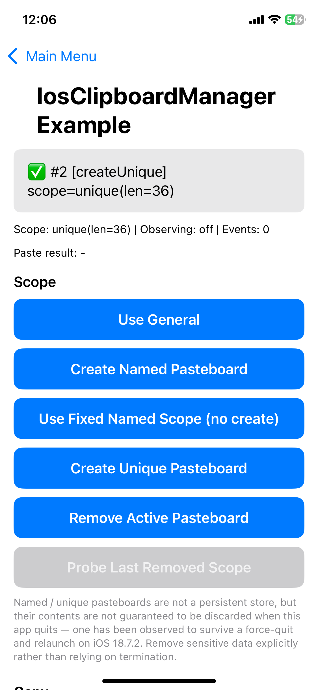
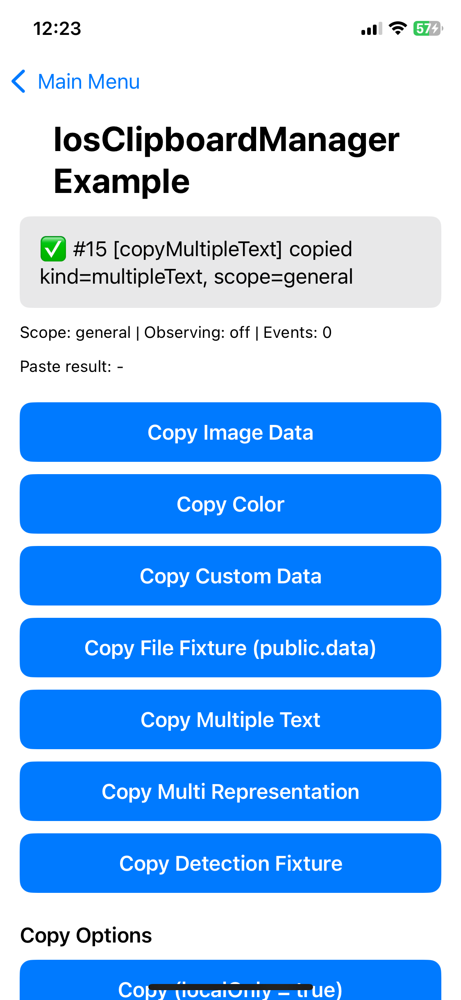
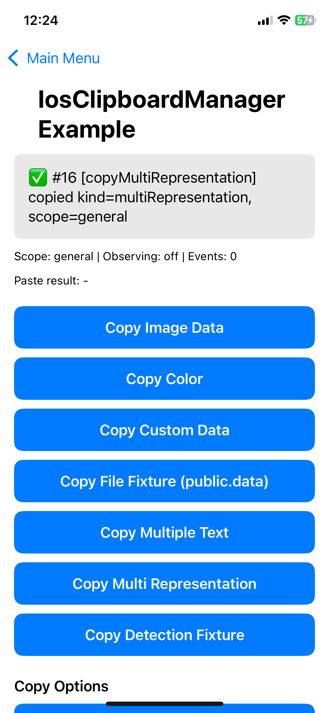
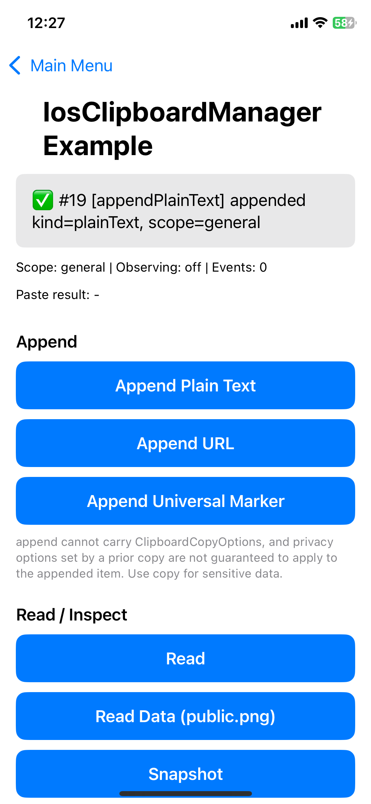
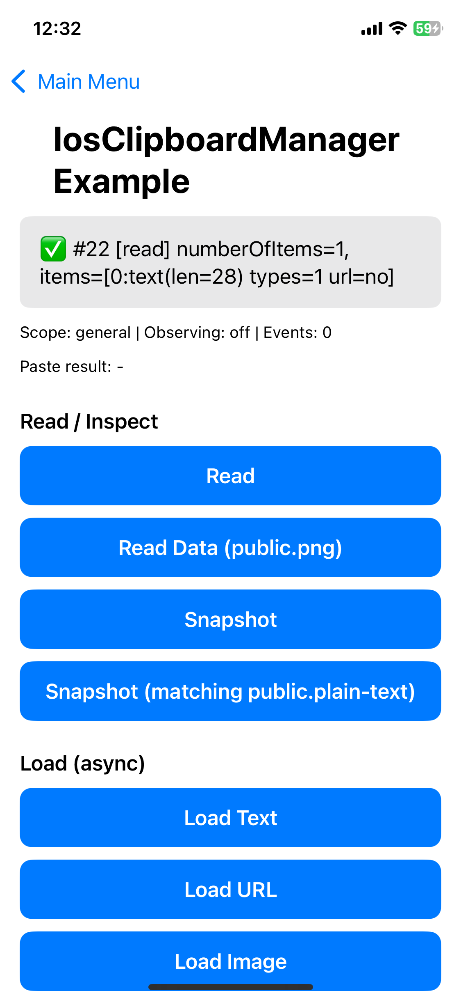
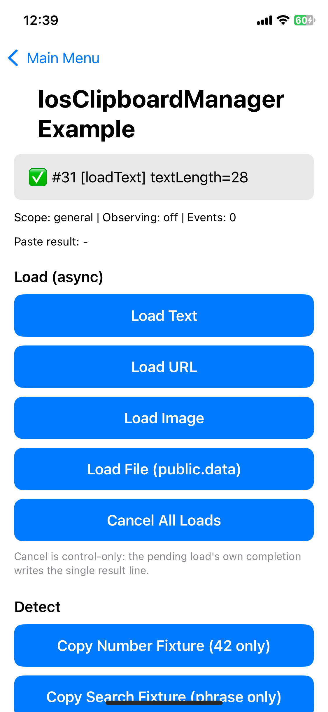
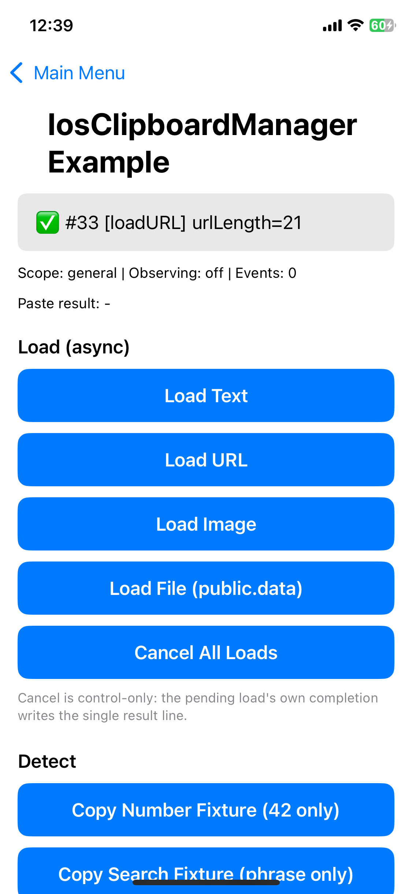
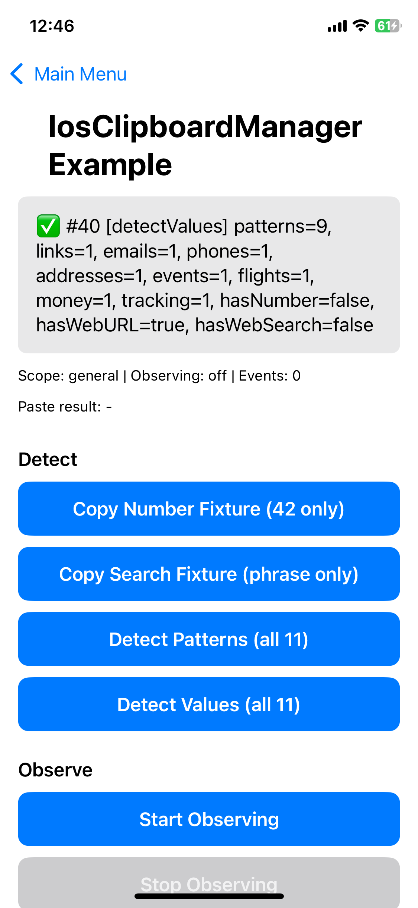
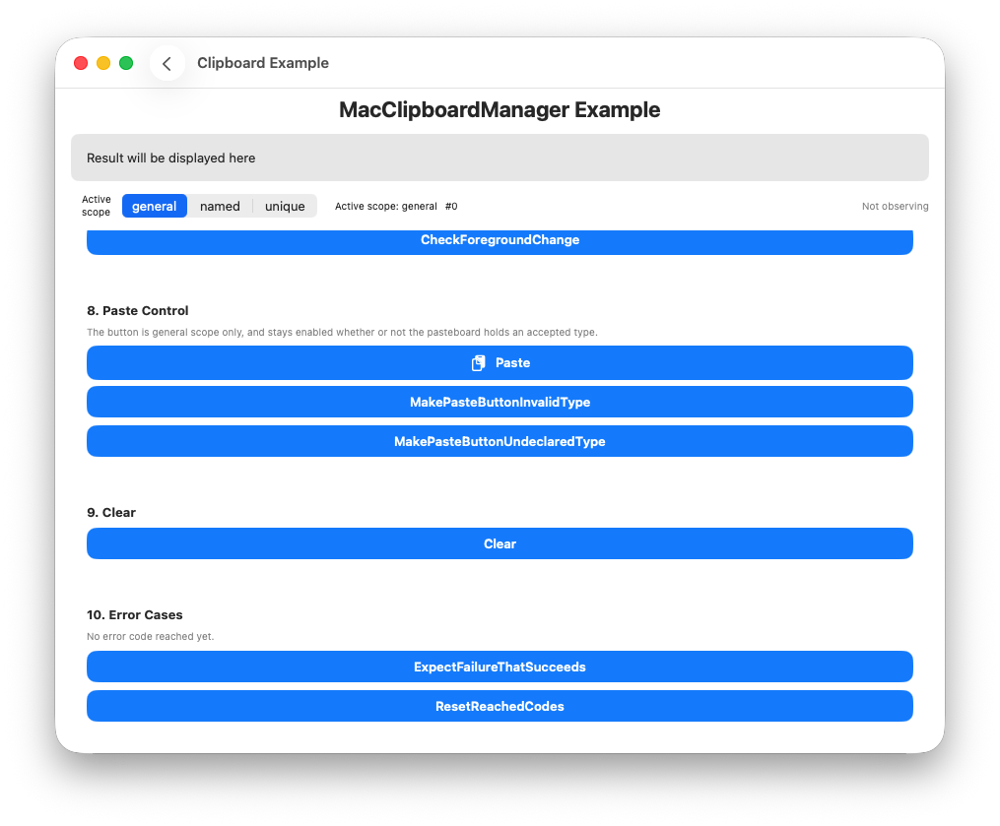
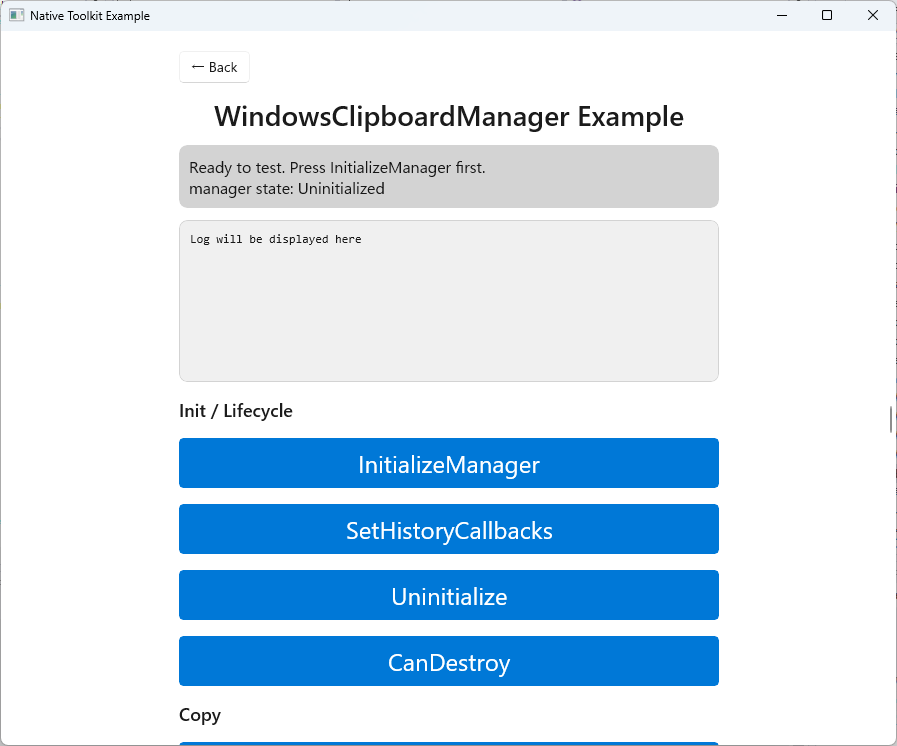

# Clipboard 기능

Language:

- 日本語: [clipboard.ja.md](clipboard.ja.md)
- English: [clipboard.md](clipboard.md)
- 한국어（이 페이지）

← [매뉴얼 홈으로 돌아가기](index.ko.md)

---

## 목차

- [Android](#android)
  - [설정](#설정)
  - [복사](#복사)
    - [일반 텍스트 복사](#일반-텍스트-복사)
    - [일반 텍스트 복사（빈 문자열）](#일반-텍스트-복사빈-문자열)
    - [HTML 텍스트 복사](#html-텍스트-복사)
    - [URI 복사](#uri-복사)
    - [여러 텍스트 복사](#여러-텍스트-복사)
  - [복사 - 민감 정보](#복사---민감-정보)
    - [민감 정보 텍스트 복사](#민감-정보-텍스트-복사)
  - [읽기 / 확인](#읽기--확인)
    - [클립보드 읽기](#클립보드-읽기)
    - [데이터 존재 여부 확인](#데이터-존재-여부-확인)
    - [메타데이터 가져오기](#메타데이터-가져오기)
  - [지우기](#지우기)
    - [클립보드 지우기](#클립보드-지우기)
  - [변경 감시](#변경-감시)
    - [감시 시작](#감시-시작)
    - [감시 중지](#감시-중지)
  - [에러 처리](#에러-처리)
- [iOS](#ios)
  - [IosClipboardManager](#iosclipboardmanager)
  - [설정](#설정-1)
    - [스레드](#스레드)
    - [두 가지 호출 방식](#두-가지-호출-방식)
    - [기본값](#기본값)
  - [스코프](#스코프)
    - [일반 페이스트보드 사용](#일반-페이스트보드-사용)
    - [이름 있는 페이스트보드 생성](#이름-있는-페이스트보드-생성)
    - [이름만 참조(생성하지 않음)](#이름만-참조생성하지-않음)
    - [고유 페이스트보드 생성](#고유-페이스트보드-생성)
    - [활성 페이스트보드 삭제](#활성-페이스트보드-삭제)
    - [이름 있는 / 고유 페이스트보드는 영속 저장소가 아닙니다](#이름-있는--고유-페이스트보드는-영속-저장소가-아닙니다)
  - [복사](#복사-1)
    - [일반 텍스트 복사](#일반-텍스트-복사-1)
    - [일반 텍스트 복사(빈 문자열)](#일반-텍스트-복사빈-문자열-1)
    - [HTML 텍스트 복사](#html-텍스트-복사-1)
    - [URL 복사](#url-복사)
    - [이미지 파일 복사](#이미지-파일-복사)
    - [이미지 데이터 복사](#이미지-데이터-복사)
    - [색상 복사](#색상-복사)
    - [커스텀 데이터 복사](#커스텀-데이터-복사)
    - [여러 텍스트 복사](#여러-텍스트-복사-1)
    - [다중 표현 복사](#다중-표현-복사)
  - [복사 옵션](#복사-옵션)
    - [localOnly 를 지정해 복사](#localonly-를-지정해-복사)
    - [expirationDate 를 지정해 복사](#expirationdate-를-지정해-복사)
  - [추가](#추가)
    - [일반 텍스트 추가](#일반-텍스트-추가)
    - [URL 추가](#url-추가)
    - [추가는 개인정보 옵션을 이어받지 않습니다](#추가는-개인정보-옵션을-이어받지-않습니다)
  - [읽기 / 확인](#읽기--확인-1)
    - [읽기](#읽기)
    - [데이터 읽기](#데이터-읽기)
    - [스냅샷](#스냅샷)
    - [스냅샷(타입 지정)](#스냅샷타입-지정)
    - [개인정보: 권한 요청과 접근 알림](#개인정보-권한-요청과-접근-알림)
  - [비동기 로드](#비동기-로드)
    - [텍스트 로드](#텍스트-로드)
    - [URL 로드](#url-로드)
    - [이미지 로드](#이미지-로드)
    - [파일 로드](#파일-로드)
    - [모든 로드 취소](#모든-로드-취소)
  - [감지](#감지)
    - [패턴 감지](#패턴-감지)
    - [값 감지](#값-감지)
    - [number 와 probableWebSearch 는 클립보드 전체를 분류합니다](#number-와-probablewebsearch-는-클립보드-전체를-분류합니다)
    - [감지에는 취소 토큰이 없습니다](#감지에는-취소-토큰이-없습니다)
  - [변경 감시](#변경-감시-1)
    - [감시 시작](#감시-시작-1)
    - [감시 중지](#감시-중지-1)
    - [포그라운드 복귀 시 변경 확인](#포그라운드-복귀-시-변경-확인)
  - [붙여넣기 컨트롤](#붙여넣기-컨트롤)
    - [붙여넣기 컨트롤 생성](#붙여넣기-컨트롤-생성)
  - [지우기](#지우기-1)
  - [에러 처리](#에러-처리-1)
- [macOS](#macos)
  - [MacClipboardManager](#macclipboardmanager)
  - [설정](#설정-2)
    - [스레드](#스레드-1)
    - [두 가지 호출 방식](#두-가지-호출-방식-1)
    - [콘텐츠는 타입 식별자와 바이트의 딕셔너리입니다](#콘텐츠는-타입-식별자와-바이트의-딕셔너리입니다)
    - [기본값](#기본값-1)
  - [스코프](#스코프-1)
    - [이름 있는 페이스트보드 생성](#이름-있는-페이스트보드-생성-1)
    - [고유 페이스트보드 생성](#고유-페이스트보드-생성-1)
    - [현재 페이스트보드 삭제](#현재-페이스트보드-삭제)
    - [general 삭제(에러 1508)](#general-삭제에러-1508)
    - [빈 이름으로 페이스트보드 생성(에러 1505)](#빈-이름으로-페이스트보드-생성에러-1505)
  - [복사](#복사-2)
    - [텍스트 복사](#텍스트-복사)
    - [URL 복사](#url-복사-1)
    - [이미지 복사](#이미지-복사)
    - [여러 item 복사](#여러-item-복사)
    - [여러 representation 복사](#여러-representation-복사)
    - [빈 복사(에러 1501)](#빈-복사에러-1501)
    - [representation 이 빈 item 복사(에러 1502)](#representation-이-빈-item-복사에러-1502)
  - [복사 옵션](#복사-옵션-1)
    - [localOnly 의 기본값은 true 입니다](#localonly-의-기본값은-true-입니다)
  - [추가](#추가-1)
    - [복사한 뒤 추가](#복사한-뒤-추가)
    - [append 는 추가 대상의 프라이버시 설정을 이어받습니다](#append-는-추가-대상의-프라이버시-설정을-이어받습니다)
    - [소유권을 잃은 상태에서의 추가(에러 1511)](#소유권을-잃은-상태에서의-추가에러-1511)
  - [읽기 / 검사](#읽기--검사)
    - [Read](#read)
    - [특정 타입 읽기](#특정-타입-읽기)
    - [Snapshot](#snapshot)
    - [타입 필터가 있는 Snapshot](#타입-필터가-있는-snapshot)
    - [빈 필터로 Snapshot(에러 1512)](#빈-필터로-snapshot에러-1512)
    - [Access Behavior](#access-behavior)
  - [감지](#감지-1)
    - [패턴 감지](#패턴-감지-1)
    - [값 감지](#값-감지-1)
    - [메타데이터 감지](#메타데이터-감지)
    - [패턴을 지정하지 않은 감지(에러 1503)](#패턴을-지정하지-않은-감지에러-1503)
  - [감시](#감시)
    - [감시 시작](#감시-시작-2)
    - [잘못된 간격(에러 1523)](#잘못된-간격에러-1523)
    - [감시 중지](#감시-중지-2)
    - [포그라운드 복귀 시 변경 확인](#포그라운드-복귀-시-변경-확인-1)
  - [붙여넣기 컨트롤](#붙여넣기-컨트롤-1)
    - [잘못된 타입 식별자(에러 1504)](#잘못된-타입-식별자에러-1504)
  - [지우기](#지우기-2)
  - [에러 처리](#에러-처리-2)
    - [1514 에 대하여](#1514-에-대하여)
    - [일반적인 사용에서는 발생하지 않는 에러 코드](#일반적인-사용에서는-발생하지-않는-에러-코드)

- [Windows](#windows)
  - [설정](#설정-3)
    - [소유자 STA 스레드](#소유자-sta-스레드)
    - [동기와 비동기 작업](#동기와-비동기-작업)
    - [쓰기 옵션](#쓰기-옵션)
  - [초기화 / 라이프사이클](#초기화--라이프사이클)
    - [세션 생성](#세션-생성)
    - [히스토리 이벤트 핸들러](#히스토리-이벤트-핸들러)
    - [종료 처리](#종료-처리)
    - [파기 가능 여부 확인](#파기-가능-여부-확인)
  - [복사](#복사-3)
    - [일반 텍스트 복사](#일반-텍스트-복사-2)
    - [빈 문자열 복사](#빈-문자열-복사)
    - [HTML 복사](#html-복사)
    - [파일 복사](#파일-복사)
    - [이미지 복사](#이미지-복사-1)
    - [사용자 정의 형식 복사](#사용자-정의-형식-복사)
    - [여러 형식 동시 복사](#여러-형식-동시-복사)
  - [쓰기 옵션](#쓰기-옵션-1)
  - [붙여넣기](#붙여넣기)
    - [일반 텍스트 붙여넣기](#일반-텍스트-붙여넣기)
    - [HTML 붙여넣기](#html-붙여넣기)
    - [파일 붙여넣기](#파일-붙여넣기)
    - [이미지 붙여넣기](#이미지-붙여넣기)
    - [사용자 정의 형식 붙여넣기](#사용자-정의-형식-붙여넣기)
  - [검사 / 지우기](#검사--지우기)
    - [형식 존재 여부](#형식-존재-여부)
    - [형식 목록 가져오기](#형식-목록-가져오기)
    - [우선 형식 가져오기](#우선-형식-가져오기)
    - [클립보드 지우기](#클립보드-지우기-1)
  - [지연 렌더링](#지연-렌더링)
    - [형식 예약](#형식-예약)
    - [부분 상태 복구](#부분-상태-복구)
  - [히스토리](#히스토리)
    - [히스토리 사용 가능 여부](#히스토리-사용-가능-여부)
    - [히스토리 목록 가져오기](#히스토리-목록-가져오기)
    - [히스토리 항목 복원](#히스토리-항목-복원)
    - [히스토리 항목 삭제](#히스토리-항목-삭제)
    - [고정되지 않은 히스토리 지우기](#고정되지-않은-히스토리-지우기)
    - [요청 취소](#요청-취소)
  - [에러 처리](#에러-처리-3)
  - [C ABI](#c-abi)
    - [세션, 리스너, 종료](#세션-리스너-종료)
    - [쓰기](#쓰기)
    - [읽기와 검사](#읽기와-검사)
    - [지연 렌더링](#지연-렌더링-1)
    - [클립보드 히스토리](#클립보드-히스토리)

---

## Android

- 라이브러리: `android-native-toolkit-1.3.0.aar`
- 최소 SDK: Android 12 (API 31)
- 민감한 콘텐츠 미리보기 억제: Android 13 (API 33) 이상
- 지원 범위: 복사, 읽기, 메타데이터 확인, 지우기, 클립보드 변경 감시를 `android_library`（네이티브）를 통해 제공합니다. 모든 작업에 Unity Bridge 의존성이 필요하지 않습니다.

### 설정

#### Android 네이티브（AAR）

1. `android-native-toolkit-1.3.0.aar`를 `app/libs`에 배치합니다.
2. `app/build.gradle.kts`에 의존성을 추가합니다:

```kotlin
dependencies {
    implementation(files("libs/android-native-toolkit-1.3.0.aar"))
}
```

클립보드 작업에는 추가적인 매니페스트 설정이 필요하지 않습니다. `content://` URI를 복사하려면（[URI 복사](#uri-복사) 참고）공유하려는 파일의 URI를 해석할 수 있는 `FileProvider`가 별도로 필요합니다. AAR 자체는 범용 목적의 `FileProvider`를 선언하지 않습니다.

---

### 복사

`ClipboardUseCases`는 `Context`를 받는 팩토리 함수로 가져옵니다:

```kotlin
val clipboardUseCases = ClipboardUseCases(context)
```

#### 일반 텍스트 복사

```kotlin
try {
    clipboardUseCases.copyPlainText(
        ClipContent.PlainText(text = "Hello from native-toolkit", label = "sample")
    )
} catch (e: ClipboardDomainError) {
    // 에러 처리
}
```

<p align="center">
    
</p>

#### 일반 텍스트 복사（빈 문자열）

빈 문자열은 허용되며 예외가 발생하지 않습니다.

```kotlin
clipboardUseCases.copyPlainText(ClipContent.PlainText(text = ""))
```

<p align="center">
    
</p>

#### HTML 텍스트 복사

```kotlin
clipboardUseCases.copyHtmlText(
    ClipContent.HtmlText(plainText = "Hello", htmlText = "<b>Hello</b>")
)
```

<p align="center">
    
</p>

#### URI 복사

`content://`（또는 `file://`）URI를 복사합니다. `content` / `file` 스킴만 허용되며, 그 외 스킴은 `ClipboardDomainError.InvalidUri`를 발생시킵니다.

```kotlin
val file = File(context.cacheDir, "clipboard_sample.txt")
file.writeText("Clipboard sample file content")
val uri = FileProvider.getUriForFile(
    context,
    "${context.packageName}.native_toolkit.share.fileprovider",
    file
)

clipboardUseCases.copyUri(ClipContent.UriContent(uri = uri.toString()))
```

<p align="center">
    
</p>

#### 여러 텍스트 복사

동일한 형식의 여러 일반 텍스트 항목입니다（하나의 `ClipData`에 여러 항목을 저장합니다）.

```kotlin
clipboardUseCases.copyMultipleText(
    ClipContent.MultipleText(texts = listOf("first", "second", "third"))
)
```

<p align="center">
    
</p>

---

### 복사 - 민감 정보

`isSensitive = true`를 지정하면 복사한 내용이 민감 정보（비밀번호, 일회용 코드 등）임을 시스템에 알릴 수 있습니다.

- Android 13 (API 33) 이상에서는 시스템 표준 복사 확인 UI가 콘텐츠 미리보기를 억제합니다.
- Android 12L (API 32) 이하에서는 시스템 확인 UI 자체가 없으므로, 복사 후 직접 피드백（`Toast` 등）을 표시해야 합니다.

#### 민감 정보 텍스트 복사

```kotlin
clipboardUseCases.copyPlainText(
    ClipContent.PlainText(text = "P@ssw0rd-sample", isSensitive = true)
)

if (Build.VERSION.SDK_INT <= Build.VERSION_CODES.S_V2) {
    Toast.makeText(context, "Copied (sensitive)", Toast.LENGTH_SHORT).show()
}
```

<p align="center">
    
</p>

---

### 읽기 / 확인

#### 클립보드 읽기

빈 클립보드는 **정상 케이스**이며 에러가 아닙니다. `read()`는 `null`을 반환합니다.

```kotlin
val result = clipboardUseCases.read()
if (result != null) {
    // result.label, result.mimeTypes, result.items（각 항목의 text / htmlText / uri / coercedText）
} else {
    // 클립보드가 비어 있음（정상）
}
```

<p align="center">
    
</p>

#### 데이터 존재 여부 확인

```kotlin
val hasClip: Boolean = clipboardUseCases.hasClip()
```

<p align="center">
    
</p>

#### 메타데이터 가져오기

본문 데이터에 접근하지 않고 메타데이터만 가져옵니다（Android 12+ 의 "클립보드에서 붙여넣었습니다" 접근 알림을 피할 수 있습니다）. 클립보드가 비어 있을 때도 `null`（정상 케이스）을 반환합니다.

```kotlin
val info = clipboardUseCases.getDescription()
if (info != null) {
    // info.label, info.mimeTypes
    // info.isStyledText: 서식이 있는（리치） 텍스트인지 여부
    // info.classificationStatus: ClipDescription.CLASSIFICATION_* 원시 값. 가져올 수 없으면 null
}
```

<p align="center">
    
</p>

---

### 지우기

#### 클립보드 지우기

```kotlin
clipboardUseCases.clear()
```

<p align="center">
    
</p>

---

### 변경 감시

`ClipboardChangeMonitor`는 시스템 클립보드 변경 리스너를 소유하는 클래스로, `android_library`（Unity Bridge가 아닌 네이티브 쪽）에 위치하므로 네이티브 코드에서 직접 사용할 수 있습니다.

감시는 앱이 포그라운드에 있는 동안에만 확실히 동작합니다（Android 10+ 는 백그라운드에서의 클립보드 읽기를 제한합니다）.

```kotlin
val monitor = ClipboardChangeMonitor()
```

#### 감시 시작

`onChange`는 시스템 리스너의 콜백 스레드에서 호출됩니다. UI 상태를 업데이트하는 경우 직접 메인 스레드로 전달해야 합니다.

```kotlin
monitor.start(context) {
    // 시스템 리스너의 콜백 스레드에서 호출됨
    mainHandler.post {
        // 여기서 UI 상태 업데이트
    }
}

val isObserving: Boolean = monitor.isObserving()
```

감시 중에 `start`를 다시 호출해도 no-op입니다（시스템 리스너가 중복 등록되지 않습니다）.

#### 감시 중지

```kotlin
monitor.stop()
```

감시 중인 화면/컴포넌트가 해제될 때 `stop()`을 호출하여 시스템 리스너 누수를 방지하세요:

```kotlin
DisposableEffect(monitor) {
    onDispose { monitor.stop() }
}
```

---

### 에러 처리

`ClipboardUseCases`는 `ClipboardDomainError`의 서브타입을 발생시킵니다.

| 에러 | 원인 | 에러 메시지 |
|---|---|---|
| `EmptyContent` | `copyHtmlText`에서 `htmlText`가 비어 있음 | `"Clipboard content is empty. Please provide text or HTML."` |
| `EmptyItemList` | `copyMultipleText`에서 `texts` 리스트가 비어 있음 | `"No items provided for clipboard copy."` |
| `InvalidUri` | `uri`가 비어 있거나 scheme이 `content`/`file`이 아님 | `"Invalid URI: <uri>"` |
| `ClipboardUnavailable` | 시스템 `ClipboardManager`를 가져올 수 없음 | `"Clipboard service is unavailable."` |
| `ReadNotAllowed` | `read()`가 시스템에 의해 거부됨（`SecurityException`）. 앱이 포그라운드에 있지 않을 가능성이 높음 | `"Clipboard read is not allowed. The app must be in the foreground."` |

빈 클립보드는 이러한 에러에 **포함되지 않습니다**: `read()` / `getDescription()`은 정상 케이스로 `null`을 반환합니다.

```kotlin
try {
    clipboardUseCases.copyUri(ClipContent.UriContent(uri = ""))
} catch (e: ClipboardDomainError.InvalidUri) {
    // URI가 비어 있거나 지원되지 않는 scheme
} catch (e: ClipboardDomainError) {
    // 기타 도메인 에러
}
```

---

## iOS

- 라이브러리: `ios-native-toolkit-1.3.0.xcframework`
- 최소 배포 타깃: iOS 18
- 지원 범위: 복사 / 추가, 동기 읽기, 메타데이터 스냅샷, 이름 있는 페이스트보드와 고유 페이스트보드의 수명 주기, `NSItemProvider` 기반 비동기 로드, 패턴 감지, 변경 감시, 그리고 배치만 하면 바로 동작하는 `UIPasteControl` 붙여넣기 버튼을 제공합니다.

### IosClipboardManager

`IosClipboardManager` 는 `UIPasteboard` 를 감싸는 싱글턴 클래스입니다.

### 설정

1. `ios-native-toolkit-1.3.0.xcframework` 를 Xcode 프로젝트에 추가합니다(프로젝트로 드래그한 뒤 타깃의 Frameworks, Libraries, and Embedded Content에서 "Embed & Sign"으로 설정).
2. 클립보드를 사용하는 파일에서 라이브러리를 임포트합니다.

```swift
import IosLibrary
```

추가 초기화나 `Info.plist` 설정은 필요하지 않습니다.

#### 스레드

`IosClipboardManager` 는 `@MainActor` 로 격리되어 있습니다. 메인 액터에서 호출하십시오(SwiftUI / UIKit 코드는 이미 메인 액터에 있습니다). 메인 액터가 아닌 곳에서 호출할 때는 `await MainActor.run { ... }` 을 사용합니다.

#### 두 가지 호출 방식

값을 다루는 모든 작업은 다음 두 가지 형식을 제공합니다.

- `async throws`(네이티브 Swift 호출자에게 권장): 타입이 지정된 값을 반환하며, 실패 시 `ClipboardError` 를 throw 합니다.
- 콜백: `(isSuccess, value?, errorCode?, errorMessage?)`. 반환값이 없는 작업은 `(isSuccess, errorCode?, errorMessage?)` 입니다.

```swift
// async throws(Swift 호출자에게 권장)
Task {
    do {
        try await IosClipboardManager.shared.copy(.plainText("Hello"))
    } catch let error as ClipboardError {
        print(error.errorCode, error.errorDescription ?? "nil")
    }
}

// 콜백(동일한 동작)
IosClipboardManager.shared.copy(.plainText("Hello")) { isSuccess, errorCode, errorMessage in
    print(isSuccess, errorCode ?? "nil", errorMessage ?? "nil")
}
```

`cancelAllLoads` / `startObserving` / `stopObserving` / `checkForegroundChange` / `makePasteControl` 은 동기적으로 완료되므로 동기 형식만 제공합니다.

아래 예제는 `async throws` 형식을 사용합니다. SwiftUI 의 `Button` 액션은 동기이므로 각 호출을 `Task { ... }` 로 감쌉니다.

#### 기본값

| 설정 | 기본값 |
|---|---|
| 복사 최대 크기 | 64 MiB |
| 로드 최대 크기 | 64 MiB |
| 이미지 최대 픽셀 수 | 100,000,000 |
| 감지 타임아웃 | 5초 |
| 프로바이더 로드 타임아웃 | 15초 |
| 이미지 인코딩 타임아웃 | 10초 |

다른 값을 사용하려면 `IosClipboardManager(timeouts:limits:)` 로 인스턴스를 생성합니다. 일반적인 용도에는 `shared` 를 사용하십시오.

---

### 스코프

모든 작업은 `scope: PasteboardScope` 매개변수를 받으며 기본값은 `.general` 입니다. 일반 페이스트보드는 모든 앱과 공유되고 실행을 넘어 유지됩니다. 이름 있는 페이스트보드와 고유 페이스트보드는 실행 중인 앱 사이에서 데이터를 주고받기 위한 것입니다.

```swift
public enum PasteboardScope {
    case general
    case named(String)   // 동일한 Team ID 앱과 공유
    case unique(String)  // withUniqueName() 으로 생성. 이름은 출력값
}
```

#### 일반 페이스트보드 사용

`.general` 은 기본값이므로 생략할 수도 있습니다.

```swift
let scope: PasteboardScope = .general
```

#### 이름 있는 페이스트보드 생성

`createPasteboard(.named(_:))` 는 해당 이름의 페이스트보드가 있으면 해석하고, 없으면 생성합니다. 반환된 `PasteboardScope` 를 이후 호출에 전달하십시오.

```swift
Task {
    let scope = try await IosClipboardManager.shared.createPasteboard(
        .named("com.jonghyunkim.nativetoolkit.example.sample")
    )
    // scope == .named("com.jonghyunkim.nativetoolkit.example.sample")
}
```

<p align="center">
    
</p>

#### 이름만 참조(생성하지 않음)

생성하지 않고 이름만 참조할 수도 있지만, 무언가가 생성하기 전까지는 해당 이름에 대한 모든 작업이 `CLIPBOARD_UNAVAILABLE` 로 실패합니다.

```swift
let scope = PasteboardScope.named("com.jonghyunkim.nativetoolkit.example.sample")
```

#### 고유 페이스트보드 생성

`.unique` 는 이름 생성을 시스템에 맡깁니다. 생성된 이름은 반환된 스코프에 담겨 오므로, 그 페이스트보드를 다시 사용하려면 보관해야 합니다.

```swift
Task {
    let scope = try await IosClipboardManager.shared.createPasteboard(.unique)
    // scope == .unique("<시스템이 생성한 이름>")
}
```

<p align="center">
    
</p>

#### 활성 페이스트보드 삭제

```swift
Task {
    try await IosClipboardManager.shared.removePasteboard(scope)
}
```

`.general` 을 삭제하려고 하면 `ClipboardError.cannotRemoveGeneralPasteboard` 를 throw 합니다.

<p align="center">
    
</p>

#### 이름 있는 / 고유 페이스트보드는 영속 저장소가 아닙니다

`createPasteboard(.named(_:))` 나 `.unique` 로 만든 페이스트보드는 영속을 의도한 것이 아니지만, **생성한 앱이 종료될 때 내용이 폐기된다는 보장도 없습니다**. iOS 18.7.2 에서 측정한 결과, 앱을 강제 종료한 뒤 다시 실행해도 종료 전에 기록한 이름 있는 페이스트보드를 읽을 수 있었습니다. 시스템은 그러한 페이스트보드가 언제 회수되는지 규정하지 않습니다.

이 스코프들은 실행 중인 앱 사이에서 데이터를 주고받는 용도로만 사용하고, **민감한 데이터는 `removePasteboard(_:)` 로 명시적으로 삭제하십시오**. 앱 종료에 폐기를 의존하지 마십시오. 강제 종료에서는 `deinit` 이 실행되지 않으므로, 라이브러리가 종료 시점에 정리를 수행하더라도 이 상황에는 도움이 되지 않습니다.

설계상 생성한 앱보다 오래 유지되어야 하는 공유에는 App Group 공유 컨테이너를 사용하십시오. 이는 본 라이브러리의 범위를 벗어납니다.

---

### 복사

`copy` 는 페이스트보드의 내용을 교체합니다. `ClipboardContent` 가 지원하는 모든 형식을 표현합니다.

#### 일반 텍스트 복사

```swift
Task {
    try await IosClipboardManager.shared.copy(
        .plainText("Hello from IosLibraryExample"),
        scope: scope
    )
}
```

<p align="center">
    
</p>

#### 일반 텍스트 복사(빈 문자열)

빈 문자열도 허용되며 throw 하지 않습니다.

```swift
Task {
    try await IosClipboardManager.shared.copy(.plainText(""), scope: scope)
}
```

<p align="center">
    
</p>

#### HTML 텍스트 복사

두 가지 표현을 가진 하나의 항목으로 기록되므로, HTML 을 처리하지 못하는 앱도 일반 텍스트 대체값을 얻을 수 있습니다.

```swift
Task {
    try await IosClipboardManager.shared.copy(
        .htmlText(plain: "plain body", html: "<b>html body</b>"),
        scope: scope
    )
}
```

<p align="center">
    
</p>

#### URL 복사

URL 은 문자열로 전달하며 라이브러리 내부에서 검증합니다. `http` / `https` / `file` 스킴만 허용하고, 그 외에는 `ClipboardError.invalidURL` 을 throw 합니다.

```swift
Task {
    try await IosClipboardManager.shared.copy(.url("https://www.apple.com"), scope: scope)
}
```

<p align="center">
    
</p>

#### 이미지 파일 복사

파일 경로에서 이미지를 읽어들입니다. 경로가 없으면 `ClipboardError.fileNotFound`, 이미지로 디코딩할 수 없으면 `ClipboardError.imageLoadFailed` 를 throw 합니다.

```swift
Task {
    guard let path = Bundle.main.url(forResource: "app-icon-attachment", withExtension: "png")?.path else { return }
    try await IosClipboardManager.shared.copy(.imageFile(path: path), scope: scope)
}
```

<p align="center">
    
</p>

#### 이미지 데이터 복사

이미지 바이트를 알려진 이미지 UTI 와 함께 명시적으로 기록합니다. 이미지로 디코딩할 수 없는 데이터는 `ClipboardError.invalidImageData` 를 throw 합니다.

```swift
Task {
    guard let url = Bundle.main.url(forResource: "app-icon-attachment", withExtension: "png"),
          let data = try? Data(contentsOf: url) else { return }
    try await IosClipboardManager.shared.copy(
        .imageData(data, utType: "public.png"),
        scope: scope
    )
}
```

<p align="center">
    
</p>

#### 색상 복사

RGBA 각 성분은 유한한 값이면서 `0.0...1.0` 범위여야 합니다. 범위를 벗어나면 `ClipboardError.invalidColor` 를 throw 합니다.

```swift
Task {
    try await IosClipboardManager.shared.copy(
        .color(red: 0.2, green: 0.4, blue: 0.8, alpha: 1.0),
        scope: scope
    )
}
```

<p align="center">
    
</p>

#### 커스텀 데이터 복사

앱이 정의한 UTI 로 임의의 바이트를 기록합니다. UTI 는 구문이 검증되며, 잘못된 경우 `ClipboardError.invalidTypeIdentifier` 를 throw 합니다.

```swift
Task {
    try await IosClipboardManager.shared.copy(
        .customData(Data([0xCA, 0xFE]), utType: "com.jonghyunkim.nativetoolkit.example.custom"),
        scope: scope
    )
}
```

<p align="center">
    
</p>

앱의 `Info.plist` 에 선언하지 않은 커스텀 UTI 는 `public.data` 에 적합하지 않으므로, `public.data` 로 파일을 로드할 때 찾을 수 없습니다. 범용 파일로 로드하려면 `public.data` 자체를 지정하십시오.

```swift
Task {
    try await IosClipboardManager.shared.copy(
        .customData(Data(repeating: 0x41, count: 64), utType: "public.data"),
        scope: scope
    )
}
```

<p align="center">
    
</p>

#### 여러 텍스트 복사

같은 형식의 일반 텍스트를 여러 개 기록합니다. 빈 배열은 `ClipboardError.emptyItemList` 를 throw 합니다.

```swift
Task {
    try await IosClipboardManager.shared.copy(
        .multipleText(["first", "second", "third"]),
        scope: scope
    )
}
```

<p align="center">
    
</p>

#### 다중 표현 복사

하나의 항목에 여러 표현을 UTI 를 키로 담습니다. 받는 앱이 해석할 수 있는 표현을 선택합니다. 빈 딕셔너리는 `ClipboardError.emptyItemList` 를 throw 합니다.

```swift
Task {
    try await IosClipboardManager.shared.copy(
        .multiRepresentation([
            "public.plain-text": Data("multi representation".utf8),
            "public.utf8-plain-text": Data("multi representation".utf8)
        ]),
        scope: scope
    )
}
```

<p align="center">
    
</p>

---

### 복사 옵션

`ClipboardCopyOptions` 는 `copy` 의 개인정보 설정을 담습니다. 기본값은 `localOnly: true` 이고 만료 시각은 없습니다.

```swift
public struct ClipboardCopyOptions {
    public let localOnly: Bool       // 근처 기기로 전송하지 않음(유니버설 클립보드)
    public let expirationDate: Date? // 이 시각이 지나면 시스템이 항목을 폐기함
    public static let `default` = ClipboardCopyOptions(localOnly: true, expirationDate: nil)
}
```

#### localOnly 를 지정해 복사

`localOnly: true` 는 유니버설 클립보드를 통해 근처 기기로 항목을 전달하지 말 것을 시스템에 요청합니다. 기기 간 전송을 의도할 때만 `false` 로 설정하십시오.

```swift
Task {
    try await IosClipboardManager.shared.copy(
        .plainText("LOCALONLY-BODY"),
        options: ClipboardCopyOptions(localOnly: true, expirationDate: nil),
        scope: scope
    )
}
```

<p align="center">
    
</p>

#### expirationDate 를 지정해 복사

지정하는 시각은 미래여야 하며, 그렇지 않으면 `ClipboardError.invalidExpirationDate` 를 throw 합니다.

```swift
Task {
    try await IosClipboardManager.shared.copy(
        .plainText("expiring body"),
        options: ClipboardCopyOptions(
            localOnly: true,
            expirationDate: Date().addingTimeInterval(30)
        ),
        scope: scope
    )
}
```

<p align="center">
    
</p>

---

### 추가

`append` 는 이미 페이스트보드에 있는 내용을 교체하지 않고 항목을 추가합니다.

#### 일반 텍스트 추가

```swift
Task {
    try await IosClipboardManager.shared.append(.plainText("appended item"), scope: scope)
}
```

<p align="center">
    
</p>

#### URL 추가

```swift
Task {
    try await IosClipboardManager.shared.append(.url("https://developer.apple.com"), scope: scope)
}
```

<p align="center">
    
</p>

#### 추가는 개인정보 옵션을 이어받지 않습니다

`append` 는 `ClipboardCopyOptions` 를 받을 수 없으며, 직전 `copy` 에서 지정한 `localOnly` / `expirationDate` 가 추가된 항목에 적용된다는 보장도 없습니다. **민감한 데이터에는 반드시 `copy(_:options:)` 를 사용하십시오.**

---

### 읽기 / 확인

#### 읽기

페이스트보드를 동기적으로 읽습니다. 큰 페이로드(이미지 바이트)는 결과에 포함되지 않고 UTI 만 보고됩니다. 빈 페이스트보드는 에러가 아니라 **정상 상태**이며 `numberOfItems` 가 `0` 이 됩니다.

```swift
Task {
    let result = try await IosClipboardManager.shared.read(scope: scope)
    print(result.numberOfItems)
    for item in result.items {
        // item.typeIdentifiers, item.text, item.urlString, item.imageDataUTType
    }
}
```

<p align="center">
    
</p>

#### 데이터 읽기

지정한 UTI 로 등록된 바이트를 반환합니다. 일치하는 항목이 없으면 `nil` 을 반환합니다.

```swift
Task {
    let data = try await IosClipboardManager.shared.readData(utType: "public.png", scope: scope)
    print(data?.count ?? 0)
}
```

<p align="center">
    
</p>

#### 스냅샷

본문을 건드리지 않고 메타데이터만 읽습니다. 사전 확인에는 이 API 를 사용하십시오. iOS 16 이상의 권한 요청과 iOS 14 이상의 접근 알림 중 어느 것도 발생시키지 않는다고 Apple 이 명시한 API 만으로 구성되어 있습니다.

```swift
Task {
    let snapshot = try await IosClipboardManager.shared.snapshot(scope: scope)
    // snapshot.hasStrings, snapshot.hasURLs, snapshot.hasImages, snapshot.hasColors
    // snapshot.numberOfItems, snapshot.typeIdentifiers, snapshot.allTypeIdentifiers
    if snapshot.hasStrings {
        // 붙여넣기 UI 를 표시합니다
    }
}
```

<p align="center">
    
</p>

`hasStrings` 로는 특정 타입에 대한 붙여넣기가 성공할지 판단할 수 없습니다. 예를 들어 `public.vcard` 는 `public.plain-text` 의 하위 타입이 아니라 형제 타입이므로, `hasStrings` 를 만족해도 일반 텍스트로는 로드할 수 없습니다. 허용할 타입을 명시적으로 선언하십시오([붙여넣기 컨트롤](#붙여넣기-컨트롤) 참고).

#### 스냅샷(타입 지정)

`matchingTypes` 를 전달하면 해당 타입을 가진 항목의 인덱스도 알 수 있습니다. `matchingTypes` 를 지정하지 않으면 `matchingItemIndexes` 는 `nil` 입니다.

```swift
Task {
    let snapshot = try await IosClipboardManager.shared.snapshot(
        matchingTypes: ["public.plain-text"],
        scope: scope
    )
    print(snapshot.matchingItemIndexes ?? [])
}
```

<p align="center">
    
</p>

#### 개인정보: 권한 요청과 접근 알림

`read` / `readData` / `loadItem` 은 페이스트보드에서 데이터를 가져오므로, 시스템의 판단에 따라 iOS 16 이상의 권한 요청이나 iOS 14 이상의 접근 알림이 표시될 수 있습니다. 사전 확인에는 `snapshot` 을 사용하십시오.

`UIPasteControl`(`makePasteControl` 경유)은 iOS 16 이상의 권한 요청을 피하지만, iOS 14 이상의 접근 알림까지 피한다고 Apple 이 명시하지는 않았습니다. 어느 쪽이든 표시되지 않는다고 전제하기 전에 대상 OS 버전의 실기기에서 확인하십시오.

---

### 비동기 로드

`loadItem` 은 `NSItemProvider` 를 통해 항목을 해석합니다. 표현 간 변환이나 메인 스레드 밖에서의 이미지 디코딩이 가능합니다. `read` 만으로 부족할 때 사용하십시오.

#### 텍스트 로드

```swift
Task {
    let item = try await IosClipboardManager.shared.loadItem(.text, scope: scope)
    if case .text(let value) = item {
        print(value.count)
    }
}
```

<p align="center">
    
</p>

#### URL 로드

```swift
Task {
    let item = try await IosClipboardManager.shared.loadItem(.url, scope: scope)
    if case .url(let value) = item {
        print(value)
    }
}
```

<p align="center">
    
</p>

#### 이미지 로드

이미지는 백그라운드 executor 에서 PNG 로 다시 인코딩되므로, 반환되는 UTI 는 항상 `public.png` 입니다.

```swift
Task {
    let item = try await IosClipboardManager.shared.loadItem(.image, scope: scope)
    if case .imageData(let data, let utType) = item {
        print(data.count, utType)
    }
}
```

<p align="center">
    
</p>

#### 파일 로드

항목을 임시 파일로 복사하고 그 URL 을 넘겨줍니다. **반환된 URL 과 그 상위 디렉터리의 소유권은 호출자에게 넘어가므로**, 사용이 끝나면 삭제해야 합니다. 전달되지 못한 파일(실패, 취소, 타임아웃)은 라이브러리 내부에서 정리합니다.

```swift
Task {
    let item = try await IosClipboardManager.shared.loadItem(
        .file(utType: "public.data"),
        scope: scope
    )
    if case .file(let url) = item {
        let size = (try? url.resourceValues(forKeys: [.fileSizeKey]).fileSize) ?? -1
        print(size)
        // 파일 하나가 아니라, 라이브러리가 넘겨준 디렉터리를 삭제합니다.
        try? FileManager.default.removeItem(at: url.deletingLastPathComponent())
    }
}
```

<p align="center">
    
</p>

#### 모든 로드 취소

대기 중인 로드를 모두 취소합니다. 취소된 로드는 `async throws` 형식에서 `ClipboardError.cancelled`(`CLIPBOARD_CANCELLED`)를 throw 하고, 콜백 형식에서는 같은 코드와 함께 `isSuccess == false` 를 보고합니다. 호출자는 이를 무시해도 되는 정상적인 결과로 다룰 수 있습니다.

```swift
IosClipboardManager.shared.cancelAllLoads()
```

콜백 형식은 `ClipboardLoadToken` 을 반환하므로 개별 로드만 취소할 수도 있습니다.

```swift
let token = IosClipboardManager.shared.loadItem(.image, scope: scope) { isSuccess, item, errorCode, errorMessage in
    print(isSuccess, errorCode ?? "nil")
}
token.cancel()
```

---

### 감지

데이터 감지는 본문을 읽지 않고(따라서 권한 요청 없이) 페이스트보드가 무엇을 담고 있는지 보고합니다.

```swift
public enum ClipboardDetectionPattern: String, CaseIterable {
    case probableWebURL, probableWebSearch, number, link, emailAddress, phoneNumber
    case postalAddress, calendarEvent, flightNumber, moneyAmount, shipmentTrackingNumber
}
```

#### 패턴 감지

요청한 패턴 중 발견된 것을 반환합니다. 빈 패턴 집합을 전달하면 `ClipboardError.emptyDetectionPatterns` 를 throw 합니다.

```swift
Task {
    let patterns = try await IosClipboardManager.shared.detectPatterns(
        Set(ClipboardDetectionPattern.allCases),
        scope: scope
    )
    print(patterns.map(\.rawValue).sorted())
}
```

<p align="center">
    
</p>

#### 값 감지

감지된 값 자체를 반환합니다. 이 작업은 내용을 읽으므로 개인정보 측면에서는 `read` 와 동일하게 다루십시오.

```swift
Task {
    let values = try await IosClipboardManager.shared.detectValues(
        Set(ClipboardDetectionPattern.allCases),
        scope: scope
    )
    print(values.detectedPatterns.count)
    // values.links, values.emailAddresses, values.phoneNumbers, values.postalAddresses,
    // values.calendarEvents, values.flightNumbers, values.moneyAmounts,
    // values.shipmentTrackingNumbers, values.number, values.probableWebURL, values.probableWebSearch
}
```

<p align="center">
    
</p>

#### number 와 probableWebSearch 는 클립보드 전체를 분류합니다

`number` 와 `probableWebSearch` 는 내용에서 등장 위치를 추출하는 것이 아니라 클립보드 **전체**를 분류합니다. 숫자를 언급하기만 한 문단은 숫자도 검색어도 아니므로, 혼합된 내용에서는 이 두 패턴이 감지되지 않습니다. 확인하려면 값만 단독으로 복사하십시오.

```swift
try await IosClipboardManager.shared.copy(.plainText("42"), scope: scope)                 // number
try await IosClipboardManager.shared.copy(.plainText("swift concurrency"), scope: scope)  // probableWebSearch
```

#### 감지에는 취소 토큰이 없습니다

`detectPatterns` / `detectValues` 는 `UIPasteboard` 의 `async` 감지 API 를 감싸고 있으며, 이 API 는 취소를 지원하지 않습니다. Task 취소나 내부의 5초 타임아웃은 즉시 호출자에게 제어를 돌려주지만, 그 뒤에서 시스템 호출이 계속 실행될 수 있습니다. 그 결과는 폐기됩니다.

---

### 변경 감시

#### 감시 시작

하나의 스코프에 대해 변경 감시를 시작합니다. 두 번째 호출은(같은 스코프든 다른 스코프든) 먼저 이전 감시를 중지하므로, 동시에 유효한 구독은 항상 하나뿐입니다.

이벤트는 메인 스레드에서 전달됩니다.

```swift
do {
    try IosClipboardManager.shared.startObserving(scope: scope) { event in
        switch event.kind {
        case .changed(let typesAdded, let typesRemoved):
            print(typesAdded, typesRemoved)
        case .changedDetectedOnForeground:
            // 포그라운드 복귀 시 changeCount 비교로 감지된 변경
            break
        case .removed:
            // 이름 있는 페이스트보드 자체가 삭제됨
            break
        }
    }
} catch let error as ClipboardError {
    // pasteboardUnavailable: 스코프를 해석할 수 없어 감시가 시작되지 않았습니다
    print(error.errorCode)
}
```

`UIPasteboard.changedNotification` 은 **이 앱이 포그라운드에 있는 동안 이 앱이 수행한 변경**에 대해서만 전달됩니다. 다른 앱의 변경이나 백그라운드 중의 변경에는 알림이 발생하지 않으므로, 그 경우에는 `checkForegroundChange` 를 사용하십시오.

#### 감시 중지

```swift
IosClipboardManager.shared.stopObserving()
```

감시하는 화면을 해제할 때 호출하십시오.

```swift
.onDisappear {
    IosClipboardManager.shared.stopObserving()
}
```

#### 포그라운드 복귀 시 변경 확인

페이스트보드의 `changeCount` 를 이 매니저가 마지막으로 기록한 값과 비교해 변했는지 반환합니다. 알림이 발생하지 않는 변경을 잡기 위해, 앱이 포그라운드로 복귀했을 때 호출하십시오.

```swift
let changed = IosClipboardManager.shared.checkForegroundChange(scope: scope)
```

특정 스코프에 대한 첫 호출은 기준값을 확립하므로 항상 `false` 를 반환합니다. 기준값은 `startObserving` 이나 변경 알림 수신으로도 갱신됩니다. 반환되는 `Bool` 로는 "해석되었고 변경이 없음"과 "해석할 수 없음"을 구분할 수 없습니다. 그 차이가 필요하면 `snapshot` 을 사용하십시오.

---

### 붙여넣기 컨트롤

`UIPasteControl` 은 시스템 붙여넣기 버튼입니다. 사용자의 탭 자체가 동의에 해당하므로 iOS 16 이상의 권한 요청을 피할 수 있습니다.

#### 붙여넣기 컨트롤 생성

`makePasteControl` 은 배치만 하면 바로 동작하는 하나의 뷰를 반환합니다. 내부 리시버가 자동으로 리스폰더 체인에 참여하므로, 반환된 뷰를 그대로 뷰 계층에 추가하십시오.

`acceptedTypes` 는 비어 있을 수 없으며(`ClipboardError.invalidRequest`), 각 요소는 유효한 UTI 여야 합니다(`ClipboardError.invalidTypeIdentifier`).

```swift
let pasteView = try IosClipboardManager.shared.makePasteControl(
    acceptedTypes: ["public.plain-text", "public.url", "public.image"],
    onPaste: { items in
        print(items.count)
    },
    onPartialFailure: { errors in
        // 붙여넣은 항목 중 일부를 로드하지 못한 경우
        print(errors.map(\.errorCode))
    },
    onPasteFailure: { error in
        // 붙여넣기 자체가 실패한 경우
        print(error.errorCode)
    }
)
```

`displayMode` 의 기본값은 `.iconAndLabel` 입니다. 버튼의 모양을 바꾸려면 `.iconOnly` / `.labelOnly` / `.arrowAndLabel` 을 지정합니다. 붙여넣기 동작은 어느 모드에서나 동일합니다.

SwiftUI 에서는 `UIViewRepresentable` 로 감쌉니다.

```swift
struct ClipboardPasteControlView: UIViewRepresentable {
    let acceptedTypes: [String]
    let onPaste: ([ClipboardLoadedItem]) -> Void
    let onPartialFailure: ([ClipboardError]) -> Void
    let onPasteFailure: (ClipboardError) -> Void
    let onCreationFailure: (ClipboardError) -> Void

    func makeUIView(context: Context) -> UIView {
        do {
            return try IosClipboardManager.shared.makePasteControl(
                acceptedTypes: acceptedTypes,
                onPaste: onPaste,
                onPartialFailure: onPartialFailure,
                onPasteFailure: onPasteFailure
            )
        } catch let error as ClipboardError {
            // makeUIView 안에서 동기적으로 보고하면 "Modifying state during view update" 가
            // 발생하므로, 다음 메인 액터 턴으로 미룹니다.
            Task { @MainActor in onCreationFailure(error) }
            return UIView()
        } catch {
            Task { @MainActor in onCreationFailure(.unknown(ClipboardFailureDetail(systemError: error))) }
            return UIView()
        }
    }

    func updateUIView(_ uiView: UIView, context: Context) {}
}
```

<p align="center">
    
</p>

붙여넣기 버튼은 다른 곳에서 사용하는 `scope` 와 무관하게 항상 시스템 일반 페이스트보드를 대상으로 합니다.

대기 중인 붙여넣기가 취소된 경우(새 붙여넣기가 발생하거나 뷰가 해제된 경우) `onPaste` / `onPartialFailure` / `onPasteFailure` 는 **호출되지 않습니다**. 취소는 호출자가 시작한 것이며 붙여넣기 결과로 전달하지 않습니다.

버튼과 리시버를 각각 따로 배치해야 하는 고급 사례에는 `PasteControlFactory.makeComponents` 를 사용할 수 있습니다. 그 경우 리시버의 보유와 배치는 **호출자의 책임**입니다.

---

### 지우기

스코프에서 모든 항목을 삭제합니다. 페이스트보드 자체는 남습니다.

```swift
Task {
    try await IosClipboardManager.shared.clear(scope: scope)
}
```

<p align="center">
    
</p>

---

### 에러 처리

`async throws` 형식은 `ClipboardError` 를 throw 합니다. 콜백 형식은 같은 실패를 `errorCode` / `errorMessage` 로 보고하며, 성공 시에는 둘 다 `nil` 입니다.

`errorMessage` 는 케이스별로 고정된 영어 문자열이며 **입력값을 포함하지 않습니다**. 그대로 로그에 남겨도 안전합니다.

| `errorCode` | 케이스 | 원인 | 에러 메시지 |
|---|---|---|---|
| `CLIPBOARD_EMPTY_CONTENT` | `emptyContent` | 텍스트도 HTML 도 없는 콘텐츠 | `"Clipboard content is empty. Please provide text or HTML."` |
| `CLIPBOARD_EMPTY_ITEMS` | `emptyItemList` | `.multipleText([])` 또는 `.multiRepresentation([:])` | `"No items provided for clipboard copy."` |
| `CLIPBOARD_EMPTY_PATTERNS` | `emptyDetectionPatterns` | 빈 패턴 집합으로 감지를 호출 | `"No detection patterns were specified."` |
| `CLIPBOARD_INVALID_URL` | `invalidURL` | URL 이 비었거나 스킴이 `http` / `https` / `file` 이 아님 | `"The URL is invalid."` |
| `CLIPBOARD_INVALID_TYPE` | `invalidTypeIdentifier` | UTI 구문이 올바르지 않음 | `"The uniform type identifier is invalid."` |
| `CLIPBOARD_INVALID_NAME` | `invalidPasteboardName` | 페이스트보드 이름이 비었거나 사용할 수 없음 | `"The pasteboard name is invalid."` |
| `CLIPBOARD_INVALID_COLOR` | `invalidColor` | RGBA 성분이 유한하지 않거나 `0.0...1.0` 범위를 벗어남 | `"Color components must be finite and within 0.0...1.0."` |
| `CLIPBOARD_INVALID_IMAGE_DATA` | `invalidImageData` | 전달된 바이트를 이미지로 디코딩할 수 없음 | `"The provided image data could not be decoded."` |
| `CLIPBOARD_INVALID_EXPIRATION` | `invalidExpirationDate` | `expirationDate` 가 미래가 아님 | `"expirationDate must be in the future."` |
| `CLIPBOARD_INVALID_REQUEST` | `invalidRequest` | 요청이 올바르지 않음(`acceptedTypes` 가 비어 있는 등) | `"The request is invalid."` |
| `CLIPBOARD_CONTENT_TOO_LARGE` | `contentTooLarge` | 페이로드가 설정된 크기 상한(기본 64 MiB)을 초과 | `"The clipboard content exceeds the configured size limit."` |
| `CLIPBOARD_FILE_NOT_FOUND` | `fileNotFound` | `.imageFile(path:)` 의 경로가 존재하지 않음 | `"The requested file was not found."` |
| `CLIPBOARD_IMAGE_LOAD_FAILED` | `imageLoadFailed` | 파일은 있으나 이미지로 디코딩할 수 없음 | `"Failed to load the image."` |
| `CLIPBOARD_IMAGE_ENCODE_FAILED` | `imageEncodingFailed` | 붙여넣은 이미지를 PNG 로 다시 인코딩할 수 없음 | `"Failed to encode the pasted image."` |
| `CLIPBOARD_UNAVAILABLE` | `pasteboardUnavailable` | 이름 있는 / 고유 페이스트보드를 해석할 수 없음 | `"The requested pasteboard is unavailable."` |
| `CLIPBOARD_CANNOT_REMOVE_GENERAL` | `cannotRemoveGeneralPasteboard` | `removePasteboard(.general)` 을 호출 | `"The general pasteboard cannot be removed."` |
| `CLIPBOARD_NO_MATCHING_ITEM` | `noMatchingItem` | 요청한 타입을 가진 항목이 없음 | `"No clipboard item matches the requested type."` |
| `CLIPBOARD_LOAD_FAILED` | `providerLoadFailed` | `NSItemProvider` 가 항목 로드에 실패 | `"Failed to load the clipboard item."` |
| `CLIPBOARD_UNEXPECTED_TYPE` | `unexpectedType` | 항목을 요청한 타입으로 변환할 수 없음 | `"The clipboard item could not be converted to the requested type."` |
| `CLIPBOARD_FILE_COPY_FAILED` | `fileCopyFailed` | 붙여넣은 파일을 임시 위치로 복사하지 못함 | `"Failed to copy the pasted file."` |
| `CLIPBOARD_CANCELLED` | `cancelled` | 호출자가 로드를 취소함 | `"The clipboard load was cancelled."` |
| `CLIPBOARD_TIMED_OUT` | `timedOut` | 작업이 타임아웃됨 | `"The clipboard operation timed out."` |
| `CLIPBOARD_DETECTION_FAILED` | `detectionFailed` | 데이터 감지 시스템이 실패를 보고 | `"Pattern detection failed."` |
| `CLIPBOARD_UNKNOWN` | `unknown` | 분류되지 않은 시스템 에러 | `"An unknown error occurred."` |

빈 클립보드는 이 에러들에 **해당하지 않습니다**. `read` 는 `numberOfItems == 0` 을, `readData` 는 `nil` 을 반환하며 둘 다 정상 상태입니다.

```swift
Task {
    do {
        try await IosClipboardManager.shared.copy(.url("example.com"), scope: scope)
    } catch ClipboardError.invalidURL {
        // 스킴이 없음
    } catch let error as ClipboardError {
        print(error.errorCode, error.errorDescription ?? "nil")
    }
}
```

---

## macOS

- 라이브러리: `mac-native-toolkit-1.3.0.xcframework`
- 최소 배포 타깃: macOS 15
- 지원 범위: 복사 / 추가, 읽기와 스냅샷, 이름 있는 페이스트보드와 고유 페이스트보드의 수명 주기, 패턴 감지(macOS 15.4 이상), 변경 감시, 그리고 배치만 하면 바로 동작하는 `PasteButton` 을 제공합니다.

### MacClipboardManager

`MacClipboardManager` 는 `NSPasteboard` 를 감싸는 싱글턴 클래스입니다.

이 절의 스크린샷은 `MacLibraryExample` 의 것입니다. 이 앱의 Clipboard 화면은 아래 절과 같은 순서로 작업을 묶어 두었습니다.

<p align="center">
    
</p>

### 설정

1. `mac-native-toolkit-1.3.0.xcframework` 를 Xcode 프로젝트에 추가합니다(프로젝트로 드래그한 뒤 타깃의 Frameworks, Libraries, and Embedded Content 에서 "Embed & Sign" 으로 설정합니다).
2. 클립보드를 사용하는 파일에서 라이브러리를 임포트합니다.

```swift
import MacLibrary
```

추가 초기화나 entitlement 는 필요하지 않습니다.

#### 스레드

모든 작업은 메인 액터에서 `NSPasteboard` 에 도달합니다. 비동기 메서드는 `async throws` 이므로 `Task` 에서 호출해 주십시오. 즉시 완료되는 네 가지 작업은 동기 메서드입니다: `accessBehavior(scope:)`, `startObserving(scope:interval:onEvent:)`, `stopObserving()`, `checkForegroundChange(scope:)`, 그리고 `makePasteButton` 팩토리입니다.

#### 두 가지 호출 방식

각 비동기 작업에는 두 가지 형태가 있습니다. `async throws` 형태는 Swift 호출자를 위한 것입니다. `completion:` 형태는 Unity 브리지를 위한 것으로, C ABI 를 넘어 Swift 의 에러 처리를 전달할 수 없기 때문에 `(isSuccess, value, errorCode, errorMessage)` 로 결과를 알립니다.

```swift
// Swift
let ownership = try await MacClipboardManager.shared.copy(content)

// 콜백
MacClipboardManager.shared.copy(content) { isSuccess, ownership, errorCode, errorMessage in
    // 메인 액터에서 정확히 한 번만 실행됩니다
}
```

#### 콘텐츠는 타입 식별자와 바이트의 딕셔너리입니다

`ClipboardContent` 는 순서가 있는 item 목록을 가지며, 각 item 은 uniform type identifier 에서 바이트로 가는 딕셔너리를 가집니다. `.plainText` 같은 편의 case 는 없습니다. **작성한 그대로 페이스트보드에 실립니다.**

```swift
let content = ClipboardContent(items: [
    ClipboardItemData(representations: [
        "public.utf8-plain-text": Data("Copied from MacLibraryExample.".utf8)
    ])
])
```

#### 기본값

| 파라미터 | 기본값 | 의미 |
|---|---|---|
| `scope` | `.general` | 시스템 페이스트보드 |
| `options` | `.default` | `localOnly: true` |
| `interval`(감시) | `0.5` 초 | 폴링 간격. 0 보다 크고 60 초 이하 |
| `timeout`(붙여넣기 버튼) | `15` 초 | 붙여넣은 item 을 로드하는 기한 |

### 스코프

스코프는 `.general`, `.named(String)`, `.unique(String)` 중 하나입니다. general 페이스트보드는 항상 존재합니다. 이름 있는 페이스트보드와 고유 페이스트보드는 생성해야 하며, **앱을 종료해도 해제되지 않습니다.** `removePasteboard(_:)` 로 해제해 주십시오.

#### 이름 있는 페이스트보드 생성

`createPasteboard` 는 페이스트보드를 생성하지만, **같은 이름이 이미 있으면 그것을 가져옵니다.** 따라서 같은 이름으로 두 번 호출해도 내용을 유지한 채 같은 페이스트보드가 반환됩니다.

```swift
Task {
    let scope = try await MacClipboardManager.shared.createPasteboard(.named("nt-sample"))
}
```

#### 고유 페이스트보드 생성

고유 페이스트보드에는 매번 새로운 시스템 이름이 부여됩니다. 두 번째를 생성하면 첫 번째를 가리킬 이름이 사라지므로, 새로 만들기 전에 이전 것을 해제해 주십시오.

```swift
Task {
    let scope = try await MacClipboardManager.shared.createPasteboard(.unique)
}
```

#### 현재 페이스트보드 삭제

```swift
Task {
    try await MacClipboardManager.shared.removePasteboard(scope)
}
```

#### general 삭제(에러 1508)

표준 페이스트보드는 해제할 수 없습니다.

```swift
Task {
    do {
        try await MacClipboardManager.shared.removePasteboard(.general)
    } catch let error as ClipboardError {
        print(error.errorCode)   // 1508
    }
}
```

#### 빈 이름으로 페이스트보드 생성(에러 1505)

빈 이름은 거부됩니다.

```swift
Task {
    do {
        _ = try await MacClipboardManager.shared.createPasteboard(.named(""))
    } catch let error as ClipboardError {
        print(error.errorCode)   // 1505
    }
}
```

### 복사

`copy` 는 페이스트보드의 소유권을 얻어 내용을 교체하고, 이후 `append` 가 필요로 하는 `PasteboardOwnership` 을 반환합니다.

#### 텍스트 복사

```swift
Task {
    let ownership = try await MacClipboardManager.shared.copy(
        ClipboardContent(items: [
            ClipboardItemData(representations: [
                "public.utf8-plain-text": Data("Copied from MacLibraryExample.".utf8)
            ])
        ]),
        scope: scope
    )
}
```

#### URL 복사

```swift
Task {
    _ = try await MacClipboardManager.shared.copy(
        ClipboardContent(items: [
            ClipboardItemData(representations: [
                "public.url": Data("https://www.apple.com".utf8)
            ])
        ]),
        scope: scope
    )
}
```

#### 이미지 복사

```swift
Task {
    _ = try await MacClipboardManager.shared.copy(
        ClipboardContent(items: [
            ClipboardItemData(representations: ["public.png": pngData])
        ]),
        scope: scope
    )
}
```

#### 여러 item 복사

모든 item 이 페이스트보드에 실립니다. **그중 무엇을 사용할지는 받는 쪽 앱이 결정합니다.** 예를 들어 TextEdit 은 전부 붙여넣습니다.

```swift
Task {
    _ = try await MacClipboardManager.shared.copy(
        ClipboardContent(items: [
            ClipboardItemData(representations: ["public.utf8-plain-text": Data("first".utf8)]),
            ClipboardItemData(representations: ["public.utf8-plain-text": Data("second".utf8)]),
        ]),
        scope: scope
    )
}
```

#### 여러 representation 복사

하나의 item 이 같은 내용을 두 가지 형식으로 가집니다. 한쪽을 읽지 못하는 앱도 다른 쪽을 찾을 수 있습니다.

```swift
Task {
    _ = try await MacClipboardManager.shared.copy(
        ClipboardContent(items: [
            ClipboardItemData(representations: [
                "public.utf8-plain-text": Data(text.utf8),
                "public.rtf": Data(rtf.utf8),
            ])
        ]),
        scope: scope
    )
}
```

#### 빈 복사(에러 1501)

```swift
Task {
    do {
        _ = try await MacClipboardManager.shared.copy(ClipboardContent(items: []), scope: scope)
    } catch let error as ClipboardError {
        print(error.errorCode)   // 1501
    }
}
```

#### representation 이 빈 item 복사(에러 1502)

representation 이 없는 item 은 거부됩니다.

```swift
Task {
    do {
        _ = try await MacClipboardManager.shared.copy(
            ClipboardContent(items: [ClipboardItemData(representations: [:])]),
            scope: scope
        )
    } catch let error as ClipboardError {
        print(error.errorCode)   // 1502
    }
}
```

### 복사 옵션

`ClipboardCopyOptions(localOnly:)` 는 내용을 Universal Clipboard 를 통해 다른 기기에 제공할지를 결정합니다.

#### localOnly 의 기본값은 true 입니다

**명시적으로 지정하지 않는 한, 복사한 내용은 다른 기기로 공유되지 않습니다.** `ClipboardCopyOptions.default` 는 `localOnly: true` 이며, options 를 전달하지 않는 `copy` 는 이 값을 사용합니다. 내용을 다른 기기로 보내려면 `localOnly: false` 를 명시적으로 지정해 주십시오.

```swift
Task {
    let ownership = try await MacClipboardManager.shared.copy(
        content,
        options: ClipboardCopyOptions(localOnly: false),   // 다른 기기와 공유합니다
        scope: scope
    )
}
```

2026-09-03 에 macOS 26.3 과 iOS 18.7.2 사이에서 Handoff 를 통해 측정했습니다. `localOnly: false` 에서는 약 1 초 만에 상대 기기에 도달했고, `localOnly: true` 에서는 도달하지 않았으며 상대 기기는 자신의 클립보드를 그대로 유지했습니다. 이는 한 조합의 기기에서 측정한 결과이므로, 모든 기기와 OS 에 대한 보장이 아니라 해당 조합에서의 근거로 다뤄 주십시오.

### 추가

`append` 는 **ownership 이 가리키는 페이스트보드**에 item 을 추가합니다. `append` 자체는 scope 를 받지 않습니다. ownership 이 scope 를 전달합니다.

#### 복사한 뒤 추가

```swift
Task {
    let ownership = try await MacClipboardManager.shared.copy(content, scope: scope)
    let appended = try await MacClipboardManager.shared.append(more, ownership: ownership)
}
```

#### append 는 추가 대상의 프라이버시 설정을 이어받습니다

`localOnly: true` 로 복사한 내용에 추가해도 페이스트보드가 다시 공개되지 않습니다. 원래 내용도 추가한 item 도 다른 기기에 도달하지 않습니다. 위와 같은 기기 조합으로 2026-09-03 에 측정했습니다.

#### 소유권을 잃은 상태에서의 추가(에러 1511)

다른 앱을 포함해 무언가가 페이스트보드에 쓰는 순간 소유권은 사라집니다. `append` 는 먼저 changeCount 를 대조하고, 쓰지 않은 채 throw 합니다.

```swift
Task {
    do {
        _ = try await MacClipboardManager.shared.append(late, ownership: stale)
    } catch let error as ClipboardError {
        print(error.errorCode)   // 1511
    }
}
```

자신의 앱이 소유권을 가져간 경우에도, 다른 앱이 가져간 경우에도 에러는 같습니다. 라이브러리는 "소유권이 더 이상 성립하지 않는다" 는 사실을 알릴 뿐, 누가 가져갔는지는 알리지 않습니다.

### 읽기 / 검사

#### Read

`read` 는 모든 item 을 그 전체 representation 과 함께 반환합니다.

```swift
Task {
    let result = try await MacClipboardManager.shared.read(scope: scope)
    for (index, item) in result.items.enumerated() {
        print(index, item.totalBytes, item.representations.keys.sorted())
    }
}
```

반환되는 내용에 대해, 코드를 작성하기 전에 알아 두어야 할 것이 두 가지 있습니다.

**item 은 작성한 쪽이 지정한 것보다 많은 representation 을 가집니다.** AppKit 이 자체적으로 텍스트 형식을 추가하기 때문입니다. TextEdit 에서 서식 있는 텍스트를 복사하면 `public.rtf`, `public.utf8-plain-text`, `public.utf16-external-plain-text` 가 함께 실립니다. 필요한 타입을 대조해 주십시오. 타입 집합을 완전 일치로 비교하지 말아 주십시오.

**`totalBytes` 는 모든 item, 모든 representation 의 합계이며 복사한 대상의 크기가 아닙니다.** Finder 에서 텍스트 파일 하나를 복사하니 약 850 KB 였습니다. 페이스트보드가 파일 아이콘을 `com.apple.icns` 로 함께 전달하기 때문입니다.

#### 특정 타입 읽기

`readData` 는 한 타입의 바이트를 반환하고, 해당 타입이 없으면 `nil` 을 반환합니다. **타입이 없는 것은 일반적인 결과이며 에러가 아닙니다.**

```swift
Task {
    let data = try await MacClipboardManager.shared.readData(
        utType: "public.utf8-plain-text",
        scope: scope
    )
    print(data?.count ?? -1)   // 일반 텍스트가 없으면 nil
}
```

Finder 에서 복사한 파일은 `public.utf8-plain-text` 를 가지며, 그 바이트는 일반적으로 파일의 전체 경로입니다. 읽어 들인 내용은 사용자가 전달할 의도가 없었을 수 있는 정보를 포함한다고 보고 다뤄 주십시오.

#### Snapshot

`snapshot` 은 내용을 읽지 않고 타입과 changeCount 를 알립니다.

```swift
Task {
    let snapshot = try await MacClipboardManager.shared.snapshot(scope: scope)
    print(snapshot.itemTypes.count, snapshot.changeCount)
}
```

#### 타입 필터가 있는 Snapshot

```swift
Task {
    let snapshot = try await MacClipboardManager.shared.snapshot(
        matchingTypes: ["public.utf8-plain-text"],
        scope: scope
    )
    print(snapshot.matchingItemIndexes)
}
```

#### 빈 필터로 Snapshot(에러 1512)

빈 필터는 아무것도 일치시키지 않습니다. 그것은 호출하는 쪽에서 보면 "페이스트보드가 비어 있다" 와 구분되지 않으므로 거부됩니다.

```swift
Task {
    do {
        _ = try await MacClipboardManager.shared.snapshot(matchingTypes: [], scope: scope)
    } catch let error as ClipboardError {
        print(error.errorCode)   // 1512
    }
}
```

#### Access Behavior

동기 메서드입니다. 시스템이 이 페이스트보드에 대한 프로그램적 읽기를 어떻게 다루는지 알립니다.

```swift
let behavior = try MacClipboardManager.shared.accessBehavior(scope: scope)
```

### 감지

감지에는 **macOS 15.4 이상**이 필요합니다. 그 미만에서는 내용을 읽지 않고 `detectionUnavailable`(1513) 을 throw 합니다.

#### 패턴 감지

내용을 읽지 않고 어떤 패턴이 일치하는지 알립니다.

```swift
Task {
    let found = try await MacClipboardManager.shared.detectPatterns(
        [.probableWebURL, .links, .emailAddresses],
        scope: scope
    )
}
```

#### 값 감지

일치한 값을 반환합니다. **이 작업은 내용을 읽으므로**, 사용자 조작을 기점으로 호출해 주십시오.

```swift
Task {
    let values = try await MacClipboardManager.shared.detectValues(
        [.probableWebURL, .links, .emailAddresses],
        scope: scope
    )
    print(values.links.count, values.emailAddresses.count)
}
```

#### 메타데이터 감지

```swift
Task {
    let metadata = try await MacClipboardManager.shared.detectMetadata(scope: scope)
}
```

#### 패턴을 지정하지 않은 감지(에러 1503)

```swift
Task {
    do {
        _ = try await MacClipboardManager.shared.detectPatterns([], scope: scope)
    } catch let error as ClipboardError {
        print(error.errorCode)   // 1503
    }
}
```

### 감시

#### 감시 시작

동기 메서드입니다. `onEvent` 는 페이스트보드가 변경될 때마다 메인 액터에서 실행됩니다.

```swift
try MacClipboardManager.shared.startObserving(scope: scope) { event in
    print(event.changeCount)
}
```

앱이 비활성 상태인 동안 감시는 멈추고, 복귀할 때 대조합니다. **백그라운드에 있는 동안 세 번 변경되어도 도달하는 이벤트는 한 번입니다.** 페이스트보드는 과거에 담고 있던 내용의 이력을 갖지 않기 때문입니다.

#### 잘못된 간격(에러 1523)

간격은 0 보다 크고 60 초 이하여야 합니다.

```swift
do {
    try MacClipboardManager.shared.startObserving(scope: scope, interval: 0) { _ in }
} catch let error as ClipboardError {
    print(error.errorCode)   // 1523
}
```

#### 감시 중지

멱등하며 throw 하지 않습니다. 화면이 사라질 때 호출해 주십시오. 매니저는 공유되므로, 호출하지 않으면 폴링이 계속됩니다.

```swift
MacClipboardManager.shared.stopObserving()
```

#### 포그라운드 복귀 시 변경 확인

동기 메서드입니다. 이 앱이 마지막으로 확인한 시점 이후 페이스트보드가 변경되었는지 알리며, 해당 스코프의 첫 호출에서는 `true` 를 반환합니다.

```swift
let changed = try MacClipboardManager.shared.checkForegroundChange(scope: scope)
```

**감시와 함께 쓰지 말고, 감시 대신 사용해 주십시오.** 두 기능은 같은 기준을 공유하므로, 감시가 동작하는 동안 이 호출은 거의 항상 `false` 를 반환합니다. 폴링이 이미 변경을 확인하고 `onEvent` 로 알렸기 때문입니다.

### 붙여넣기 컨트롤

`makePasteButton` 은 시스템 붙여넣기 버튼을 `NSView` 로 반환합니다. 동기 메서드입니다. 뷰 생성은 즉시 완료되는 팩토리 작업이며, 눌렀을 때 시작되는 로드는 `onPaste` 로 알립니다.

```swift
let button = try MacClipboardManager.shared.makePasteButton(
    acceptedTypes: ["public.utf8-plain-text", "public.png"],
    timeout: 5
) { result in
    print(result.items.count, result.failures.count, result.isPartial)
}
```

SwiftUI 에서는 `NSViewRepresentable` 로 호스팅하고, **생성은 한 번만** 해 주십시오. 호출할 때마다 로더가 등록됩니다.

```swift
struct PasteButtonHost: NSViewRepresentable {
    let view: NSView
    func makeNSView(context: Context) -> NSView { view }
    func updateNSView(_ nsView: NSView, context: Context) {}
}
```

<p align="center">
    
</p>

시스템 컨트롤의 동작에서 다음 세 가지가 따라 나옵니다.

**이 버튼은 general 스코프 전용입니다.** 다른 호출이 어떤 스코프를 쓰든 시스템 페이스트보드에서 붙여넣습니다.

**시스템은 `acceptedTypes` 에 일치하는 것만 로더에 전달합니다.** 받아들이지 않은 타입의 item 은 도달하지 않습니다. 받아들이는 item 과 받아들이지 않는 item 을 하나씩 담은 페이스트보드를 붙여넣어도 결과는 item 한 건이며, 부분 실패가 되지 않습니다.

**버튼은 항상 누를 수 있는 상태입니다.** 받아들이는 타입이 페이스트보드에 없어도 비활성화되지 않습니다.

#### 잘못된 타입 식별자(에러 1504)

시스템이 해석할 수 없는 타입 식별자는 누를 때가 아니라 버튼을 만들 때 거부됩니다.

```swift
do {
    _ = try MacClipboardManager.shared.makePasteButton(acceptedTypes: ["not a uti"]) { _ in }
} catch let error as ClipboardError {
    print(error.errorCode)   // 1504
}
```

### 지우기

`clear` 는 페이스트보드를 비우고 **페이스트보드의 새로운 changeCount** 를 반환합니다. 이는 `clearContents()` 가 반환하는 값이며, 삭제한 item 의 개수가 아닙니다.

```swift
Task {
    let changeCount = try await MacClipboardManager.shared.clear(scope: scope)
}
```

### 에러 처리

모든 작업은 `ClipboardError` 를 throw 합니다. 이 에러는 `errorCode` 와 `errorMessage` 를 가집니다.

```swift
Task {
    do {
        _ = try await MacClipboardManager.shared.copy(content, scope: scope)
    } catch let error as ClipboardError {
        print(error.errorCode, error.errorMessage)
    }
}
```

| 코드 | 케이스 | 발생 조건 |
|---|---|---|
| 1501 | `emptyContent` | item 이 0 건인 `copy` / `append` |
| 1502 | `emptyRepresentations` | representation 이 없는 item |
| 1503 | `emptyDetectionPatterns` | 패턴 집합이 빈 감지 |
| 1504 | `invalidTypeIdentifier` | 시스템이 해석할 수 없는 타입 식별자 |
| 1505 | `invalidPasteboardName` | 비어 있거나 잘못된 페이스트보드 이름 |
| 1506 | `contentTooLarge` | 내용이 크기 상한을 넘음 |
| 1507 | `pasteboardUnavailable` | 이름 있는 페이스트보드를 해석할 수 없음 |
| 1508 | `cannotReleaseStandardPasteboard` | 표준 페이스트보드에 대한 `removePasteboard` |
| 1509 | `writeRejected` | 페이스트보드가 쓰기를 거부함 |
| 1510 | `appendRejected` | 소유권은 유효하지만 페이스트보드가 추가를 거부함 |
| 1511 | `ownershipLost` | 복사 이후 다른 무언가가 페이스트보드에 씀 |
| 1512 | `emptyTypeFilter` | 필터가 빈 `snapshot` |
| 1513 | `detectionUnavailable` | macOS 15.4 미만에서의 감지 |
| 1514 | `detectionDenied` | 감지 중 사용자가 접근을 거부함(아래 참조) |
| 1515 | `detectionFailed` | 그 밖의 이유로 감지가 실패함 |
| 1521 | `pasteLoadFailed` | 붙여넣기 후 item 을 로드하지 못함 |
| 1522 | `pasteLoadTimedOut` | 붙여넣기 로드가 기한을 넘김 |
| 1523 | `invalidConfiguration` | 감시 간격이 0~60 초 범위 밖 |
| 1524 | `cancelled` | 작업이 취소됨 |
| 1599 | `unknown` | 그 밖의 경우 |

#### 1514 에 대하여

1514 는 감지 중 사용자가 페이스트보드 내용에 대한 접근을 거부했음을 나타냅니다. **다만 macOS 에서 이 경로가 발생하는지는 확인되지 않았습니다.** 검증 과정에서 감지 프롬프트는 한 번도 표시되지 않았으며, 거부가 1515 로 도달할 가능성이 있습니다.

**1514 만으로 분기하지 말아 주십시오.** 거부와 일반적인 감지 실패를 같은 방식으로 다루어, 둘 다 "내용을 감지할 수 없었다" 로 처리해 주십시오. 이렇게 하면 어느 쪽이든 올바르게 동작합니다.

#### 일반적인 사용에서는 발생하지 않는 에러 코드

1506, 1507, 1509, 1510, 1521, 1522, 1524 는 API 가 알릴 수 있지만 애플리케이션에서 의도적으로 만들어 내기 어려운 조건을 나타냅니다. 받은 코드를 찾아볼 수 있도록 목록에 실었을 뿐이며, 각각에 대해 분기를 작성할 필요는 없습니다.

---

## Windows

Win32 클립보드와 WinRT 클립보드 히스토리입니다. Windows 11 이상이 필요합니다. Windows 라이브러리는 하나의 구현을 두 가지 공개 API로 제공하며, 샘플 앱은 C++ API를 사용합니다.

| API | 이름 | 헤더 | NuGet 패키지 |
|---|---|---|---|
| C++ API | `NativeToolkit::Clipboard` | `<NativeToolkit/Clipboard.h>` | `NativeToolkit` |
| C ABI | `ntk_clipboard_*` | `<NativeToolkitC/Clipboard.h>` | `NativeToolkit.CApi` |

- 범위: 텍스트, HTML, 파일, 이미지, 사용자 정의 형식의 복사와 붙여넣기, 여러 형식 동시 쓰기, 내용 검사, 변경 감시, 지연 렌더링, 클립보드 히스토리입니다.

이 절의 스크린샷은 `WindowsLibraryExample`의 것입니다. 샘플의 클립보드 화면은 아래 절과 같은 순서로 작업을 배치하고 있습니다.

<p align="center">
    
</p>

---

### 설정

```cpp
#include <NativeToolkit/Clipboard.h>

namespace Clipboard = NativeToolkit::Clipboard;
```

#### 소유자 STA 스레드

`Clipboard::Session::Create`를 호출한 스레드가 세션의 소유자가 되며, 두 가지 의무를 집니다.

1. 세션이 살아 있는 동안 메시지 루프를 계속 돌려야 합니다. 런타임에 확인할 수 없으므로 오류가 아니라 호출하는 쪽과의 약속입니다.
2. 이미 STA(단일 스레드 아파트먼트)여야 합니다(`CoInitializeEx`에 `COINIT_APARTMENTTHREADED`, 또는 `winrt::init_apartment(winrt::apartment_type::single_threaded)`). 이쪽은 **확인합니다**. MTA이거나 초기화되지 않은 스레드에서는 `ErrorCode::WrongApartment`가 되고 세션은 만들어지지 않습니다.

아파트먼트의 초기화와 해제는 툴킷이 하지 않습니다. 호스트의 몫입니다.

클립보드는 프로세스마다 하나이므로 두 번째 `Create`는 실패합니다. 소유 스레드에서는 `ErrorCode::NotSupported`, 다른 스레드에서는 `ErrorCode::WrongThread`입니다.

프로세스 전체 상태를 다루는 작업은 소유 스레드 전용이며, 다른 스레드에서는 `ErrorCode::WrongThread`가 됩니다: `SetHistoryHandlers`, `Close`, `ReserveDeferred`, `RecoverDeferredState`입니다. 모든 핸들러는 소유 스레드에서 호출됩니다.

핸들러 안에서 세션을 파기하지 마시고, `Close`와 `SetHistoryHandlers`도 호출하지 마세요. 세션에 건네는 핸들러가 세션을 캡처하는 것도 순환이 되므로 피해 주세요.

#### 동기와 비동기 작업

| 형식 | 결과 | 대상 |
|---|---|---|
| 동기 | 반환 전에 `Clipboard::Result<T>` | 복사, 붙여넣기, 검사 전부 |
| 비동기 요청 | `Clipboard::Result<RequestId>`. 핸들러는 정확히 한 번 | 히스토리 작업 5가지 |

접수된 요청은 `RequestId`를 반환하고, 그 핸들러는 소유 스레드에서 정확히 한 번 호출됩니다. 접수되지 않으면 실패가 반환되고 핸들러는 호출되지 않습니다.

값에는 타입이 있습니다. 읽기는 `std::wstring`이나 `std::vector<std::byte>`를 그대로 반환하므로 크기를 묻는 호출도, 버퍼 관리도 없습니다.

#### 쓰기 옵션

모든 복사 작업은 `Clipboard::WriteOptions`를 받습니다. Windows가 내용을 어디까지 퍼뜨려도 되는지를 지정합니다. 두 항목 모두 기본값은 허용입니다.

| 항목 | 효과 |
|---|---|
| 아무것도 설정하지 않음 | 제한하지 않습니다 |
| `excludeFromHistory` | 클립보드 히스토리(Win+V)에 남기지 않습니다 |
| `excludeFromRoaming` | 다른 기기로 동기화하지 않습니다 |
| 둘 다 | C ABI가 SENSITIVE라고 부르는 상태입니다 |

이 옵션은 히스토리와 동기화에만 영향을 줍니다. 어느 옵션으로 쓴 내용이든 Ctrl+V로는 평소대로 붙여넣어집니다. 마커 설정은 최선 노력이 아닙니다. 실패하면 쓰기 전체가 되돌려집니다.

---

### 초기화 / 라이프사이클

#### 세션 생성

```cpp
#include <optional>

// 이동 전용이며, 생성한 화면보다 오래 삽니다.
std::optional<Clipboard::Session> g_session;

void OnClipboardChanged()
{
    // 이 세션이 아닌 다른 쪽이 클립보드에 썼습니다.
    // 소유 스레드에서 호출되며, 원인이 된 호출 안에서는 호출되지 않습니다.
}

Clipboard::SessionOptions options;
// 비워 두면 리스너 등록 자체를 하지 않습니다.
options.onClipboardChanged = &OnClipboardChanged;

auto created = Clipboard::Session::Create(options);
if (created.has_value())
{
    g_session.emplace(std::move(created).value());
}
else
{
    // WrongApartment: 호출한 스레드가 초기화된 STA가 아닙니다.
    const Clipboard::ErrorCode code = created.error().code;
}
```

#### 히스토리 이벤트 핸들러

소유 스레드 전용입니다. 기본 생성한 `HistoryHandlers`를 전달하면 모든 등록이 해제됩니다. `onHistoryChanged`는 항목이 추가될 때 호출되며, 삭제나 전체 지우기에서는 호출되지 않습니다.

```cpp
Clipboard::HistoryHandlers handlers;
handlers.onHistoryChanged = &OnHistoryChanged;                  // void()
handlers.onHistoryEnabledChanged = &OnHistoryEnabledChanged;    // void(bool)
handlers.onRoamingEnabledChanged = &OnRoamingEnabledChanged;    // void(bool)

const auto result = g_session->SetHistoryHandlers(std::move(handlers));
// 실패하면 이전 핸들러가 그대로 남습니다.
```

#### 종료 처리

소유 스레드 전용입니다. 닫는 일은 호출하는 쪽의 책임입니다. `Close`는 끝내지 못한 이유를 반환하므로, 받은 쪽에서 처리한 뒤 다시 시도해 주세요.

```cpp
const auto closed = g_session->Close();
if (closed.has_value())
{
    g_session.reset();
}
else
{
    // Busy: 다른 스레드가 작업 중입니다. 끝나기를 기다렸다가 다시 시도합니다.
}
```

닫기에 성공하지 못한 채 파기하면 세션은 **포기**됩니다. 윈도우, 리스너, 처리 중인 요청이 프로세스 종료까지 남고, 이후 `Create`는 계속 실패하며 되돌릴 방법이 없습니다.

#### 파기 가능 여부 확인

지금 `Close`를 끝낼 수 있는지, 즉 처리 중인 작업이 없는지를 알려 줍니다. 작업 중에는 false이고, 열려 있으면서 아무것도 처리하지 않는 세션은 true를 반환합니다.

```cpp
const bool canClose = !g_session.has_value() || g_session->CanClose();
```

---

### 복사

#### 일반 텍스트 복사

```cpp
const auto result = g_session->CopyText(L"Hello from native-toolkit", Clipboard::WriteOptions{});
```

#### 빈 문자열 복사

빈 문자열은 올바른 값이며 오류가 아닙니다.

```cpp
const auto result = g_session->CopyText(L"", Clipboard::WriteOptions{});
```

#### HTML 복사

CF_HTML 헤더는 라이브러리 안에서 만듭니다. 두 번째 인수는 함께 쓰는 일반 텍스트 대체본입니다.

```cpp
const auto result = g_session->CopyHtml(
    L"<b>Hello</b> from native-toolkit",   // HTML 조각
    L"Hello from native-toolkit",          // 일반 텍스트 대체본
    Clipboard::WriteOptions{});
```

#### 파일 복사

각 경로는 전체 경로이며, 목록을 비울 수 없습니다.

```cpp
const std::vector<std::wstring> paths{ firstFilePath, secondFilePath };
const auto result = g_session->CopyFiles(paths, Clipboard::WriteOptions{});
```

#### 이미지 복사

바이트열은 패킹된 DIB(`BITMAPINFOHEADER`, 있다면 컬러 테이블, 픽셀)입니다. 헤더는 라이브러리가 검사합니다.

```cpp
const std::vector<std::byte> dib = BuildSampleDib();  // 8x8, 32bpp, BI_RGB
const auto result = g_session->CopyDib(dib, Clipboard::WriteOptions{});
```

#### 사용자 정의 형식 복사

표준 형식 이름이 아니면 Windows에 등록됩니다.

```cpp
const std::vector<std::byte> blob = ToBytes("native-toolkit-sample-payload");
const auto result = g_session->CopyCustom(L"NativeToolkitSample", blob, Clipboard::WriteOptions{});
```

#### 여러 형식 동시 복사

한 번의 쓰기로 여러 형식을 배치합니다. 한 항목은 텍스트, HTML, 바이트열 중 하나이며 섞이지 않습니다. 배치 순서는 받는 앱이 보는 정보이므로 가장 풍부한 형식을 앞에 둡니다.

```cpp
const std::vector<Clipboard::FormatPayload> items{
    Clipboard::HtmlPayload{ L"HTML Format", L"<b>Hello</b> from native-toolkit" },
    Clipboard::TextPayload{ L"CF_UNICODETEXT", L"Hello from native-toolkit" },
    Clipboard::BytesPayload{ L"CF_DIB", BuildSampleDib() },
};
const auto result = g_session->CopyMultiple(items, Clipboard::WriteOptions{});
```

형식 이름이 중복되거나 형식에 맞지 않는 값을 담은 항목이 있으면 `ErrorCode::InvalidParameter`가 되고 아무것도 쓰이지 않습니다.

---

### 쓰기 옵션

```cpp
// 두 가지 제외를 동시에 지정합니다. C ABI가 SENSITIVE라고 부르는 상태입니다.
const Clipboard::WriteOptions sensitive{ true, true };
const auto result = g_session->CopyText(L"Sensitive sample value", sensitive);

// 하나씩 지정할 수도 있습니다.
const Clipboard::WriteOptions excludeHistory{ true, false };
const Clipboard::WriteOptions excludeRoaming{ false, true };
```

---

### 붙여넣기

#### 일반 텍스트 붙여넣기

```cpp
const auto text = g_session->PasteText();
if (text.has_value())
{
    const std::wstring& value = text.value();
}
else if (text.error().code == Clipboard::ErrorCode::FormatUnavailable)
{
    // 클립보드에 텍스트가 없습니다.
}
```

#### HTML 붙여넣기

CF_HTML 헤더를 제거한 조각을 반환합니다.

```cpp
const auto html = g_session->PasteHtml();
```

#### 파일 붙여넣기

```cpp
const auto files = g_session->PasteFiles();
if (files.has_value())
{
    for (const std::wstring& path : files.value())
    {
        // 받은 파일 한 건입니다.
    }
}
```

#### 이미지 붙여넣기

클립보드에 있는 패킹된 DIB를 그대로 반환합니다.

```cpp
const auto pasted = g_session->PasteDib();
if (pasted.has_value())
{
    const std::vector<std::byte>& dib = pasted.value();
}
```

#### 사용자 정의 형식 붙여넣기

```cpp
const auto pasted = g_session->PasteCustom(L"NativeToolkitSample");
```

---

### 검사 / 지우기

#### 형식 존재 여부

```cpp
const auto present = g_session->HasFormat(L"CF_UNICODETEXT");
const bool yes = present.has_value() && present.value();
```

#### 형식 목록 가져오기

지금 클립보드에 있는 형식을 이름으로 반환합니다.

```cpp
const auto formats = g_session->GetFormats();
```

#### 우선 형식 가져오기

Windows가 가장 먼저 건네줄 형식입니다. 빈 문자열은 후보가 없다는 뜻입니다.

```cpp
const auto name = g_session->GetPreferredFormat();
```

#### 클립보드 지우기

```cpp
const auto result = g_session->Clear();
```

---

### 지연 렌더링

바이트열을 준비하지 않은 채 형식만 제시하고, 다른 앱이 붙여넣을 때 비로소 제공자에게 요청합니다.

#### 형식 예약

소유 스레드 전용입니다. 제공자는 소유 스레드에서, 데이터를 모으는 메시지 안에서 호출됩니다. 그래서 세 가지 제약이 있습니다. 클립보드 작업을 전혀 호출할 수 없고, 블로킹해서는 안 되며, 세션을 캡처해서도 안 됩니다.

```cpp
Clipboard::Result<std::vector<std::byte>> RenderDeferredFormat(std::wstring_view formatName)
{
    const auto it = g_deferredPayloads.find(std::wstring(formatName));
    if (it == g_deferredPayloads.end())
    {
        return NativeToolkit::Unexpected{ Clipboard::Error{ Clipboard::ErrorCode::FormatUnavailable } };
    }
    return it->second;   // 형식을 제시한 시점에 확정한 바이트열입니다.
}

const std::vector<std::wstring> formats{ L"HTML Format", L"CF_UNICODETEXT" };
const auto result = g_session->ReserveDeferred(formats, &RenderDeferredFormat);
```

실패를 반환하거나 예외를 던지면 그 형식은 빈 값으로 전달됩니다. 그 시점에 상대 앱은 붙여넣는 중이어서 보고할 상대가 없기 때문입니다. 둘 다 로그에는 남습니다.

#### 부분 상태 복구

소유 스레드 전용입니다. `ErrorCode::PartialState` 이후에 반쯤 배치된 예약을 정리합니다.

```cpp
const auto result = g_session->RecoverDeferredState();
```

---

### 히스토리

히스토리 작업 5가지는 비동기입니다. `RequestId`를 반환하고 핸들러를 소유 스레드에서 정확히 한 번 호출합니다. `ErrorCode::HistoryDisabled`는 Windows 설정에서 히스토리가 꺼져 있다는 뜻입니다.

#### 히스토리 사용 가능 여부

```cpp
const auto accepted = g_session->GetHistoryAvailability(
    [](Clipboard::RequestId id, Clipboard::Result<Clipboard::HistoryAvailability> result)
    {
        if (result.has_value())
        {
            const bool historyEnabled = result.value().historyEnabled;
            const bool roamingEnabled = result.value().roamingEnabled;
        }
    });
```

#### 히스토리 목록 가져오기

```cpp
const auto accepted = g_session->GetHistory(
    [](Clipboard::RequestId id, Clipboard::Result<std::vector<Clipboard::HistoryItem>> result)
    {
        if (!result.has_value()) return;
        for (const Clipboard::HistoryItem& item : result.value())
        {
            const std::wstring& id = item.id;                    // 복원, 삭제에 사용합니다
            const std::optional<std::wstring>& text = item.text;  // 텍스트가 없는 항목에서는 비어 있습니다
            const std::vector<std::wstring>& types = item.contentTypes;
            const int64_t ticks = item.timestampTicks;
        }
    });
```

#### 히스토리 항목 복원

항목을 클립보드에 되돌립니다. id는 `GetHistory`에서 얻은 값입니다.

```cpp
const auto accepted = g_session->RestoreHistoryItem(itemId,
    [](Clipboard::RequestId id, Clipboard::Result<void> result) { /* ... */ });
```

#### 히스토리 항목 삭제

`ErrorCode::ItemDeleted`는 그 항목이 이미 없다는 뜻입니다.

```cpp
const auto accepted = g_session->DeleteHistoryItem(itemId,
    [](Clipboard::RequestId id, Clipboard::Result<void> result) { /* ... */ });
```

#### 고정되지 않은 히스토리 지우기

사용자가 고정하지 않은 항목을 모두 삭제합니다.

```cpp
const auto accepted = g_session->ClearUnpinnedHistory(
    [](Clipboard::RequestId id, Clipboard::Result<void> result) { /* ... */ });
```

#### 요청 취소

완료되지 않은 요청을 취소합니다. 핸들러는 `ErrorCode::Canceled`로 한 번 호출됩니다.

```cpp
if (accepted.has_value())
{
    const auto result = g_session->CancelRequest(accepted.value());
}
```

---

### 에러 처리

동기 작업은 반환된 `Result`로, 비동기 요청은 핸들러가 받는 `Result`로 보고합니다. `Clipboard::Error`는 구분과 OS의 원래 값인 `systemCode`를 가집니다.

```cpp
const auto result = g_session->CopyText(text, Clipboard::WriteOptions{});
if (!result.has_value())
{
    const Clipboard::ErrorCode code = result.error().code;
    const uint32_t systemCode = result.error().systemCode;
}
```

`Clipboard::ErrorCode`(`NativeToolkit::ClipboardError`)입니다. 같은 숫자가 C ABI의 `NTK_CLIPBOARD_ERROR_*`입니다.

| 코드 | 이름 | 발생하는 경우 |
|---|---|---|
| 0 | `None` | 성공 |
| 1 | `InvalidParameter` | 잘못된 인수, 빈 파일 목록, 여러 형식 항목의 중복 또는 불일치, `CF_BITMAP` |
| 2 | `NotInitialized` | `Create` 전 또는 `Close` 후에 사용했습니다 |
| 3 | `Busy` | 클립보드를 열지 못했거나 `Close` 작업이 아직 남아 있습니다 |
| 4 | `Empty` | 형식은 있지만 데이터가 비어 있습니다 |
| 5 | `FormatUnavailable` | 요청한 형식이 클립보드에 없습니다 |
| 6 | `InvalidData` | 구조 검사에 실패했습니다(잘못된 DIB 등) |
| 7 | `BufferTooSmall` | 예약된 값으로 반환되지 않습니다. 1.x C ABI에서 호출자의 버퍼가 작았을 때의 값입니다 |
| 8 | `OutOfMemory` | 할당에 실패했습니다 |
| 9 | `AccessDenied` | 시스템이 작업을 거부했습니다 |
| 10 | `HistoryDisabled` | Windows 설정에서 클립보드 히스토리가 꺼져 있습니다 |
| 11 | `ItemDeleted` | 해당 히스토리 항목이 이미 없습니다 |
| 12 | `MonitorRegisterFailed` | 리스너나 이벤트 토큰을 등록 또는 해제하지 못했습니다 |
| 13 | `PartialState` | 배치에 실패했고 롤백도 실패했습니다. `RecoverDeferredState`를 호출해 주세요 |
| 14 | `WrongThread` | 소유 스레드 전용 작업을 다른 스레드에서 호출했습니다 |
| 15 | `Canceled` | 취소되었거나 `Close`로 정리되었습니다 |
| 16 | `NotSupported` | Windows에 대응하는 기능이 없거나 두 번째 세션입니다 |
| 17 | `NotForeground` | 이 프로세스가 포그라운드가 아닙니다. 콜백으로 보고됩니다 |
| 18 | `WrongApartment` | 호출한 스레드가 STA가 아닙니다 |
| 19 | `Unknown` | 그 밖의 경우 |

### C ABI

- C에서, 그리고 C DLL을 호출할 수 있는 언어에서 같은 클립보드를 사용하기 위한 API입니다.
- 세션은 핸들입니다. 메시지 루프를 도는 STA 스레드에서 `ntk_clipboard_session_create`를 호출하고, 같은 스레드에서 `ntk_clipboard_session_close`를 호출한 뒤 `ntk_clipboard_session_free`합니다.
- `ntk_clipboard_reserve_deferred`는 `user_data`와 `release`를 받습니다. `release`는 호출 결과와 무관하게 반드시 한 번 호출되며, 바인딩이 할당한 것을 여기서 해제합니다. 세션 옵션과 히스토리 핸들러는 `user_data`만 가지며 세션과 같은 기간 동안 유지됩니다.
- 읽기는 핸들로 반환됩니다. `ntk_string`, `ntk_bytes`, `ntk_string_list`가 있으며 각각 대응하는 `_free`로 해제합니다. 핸들에서 꺼낸 포인터는 그 핸들을 해제할 때까지 유효합니다.
- 쓰기 플래그는 `NTK_CLIPBOARD_WRITE_DEFAULT`, `_EXCLUDE_HISTORY`, `_EXCLUDE_ROAMING`, `_SENSITIVE`(두 가지 제외)입니다.

#### 세션, 리스너, 종료

```c
#include <string.h>
#include <NativeToolkitC/Common.h>
#include <NativeToolkitC/Clipboard.h>

static void NTK_CALL on_clipboard_changed(void* user_data)
{
    /* 소유 스레드에서 호출되며, 원인이 된 호출 안에서는 호출되지 않습니다.
       이 세션이 직접 한 쓰기는 통지되지 않습니다. */
    (void)user_data;
}

static void NTK_CALL on_history_changed(void* user_data)         { (void)user_data; }
static void NTK_CALL on_history_enabled(void* user_data, int32_t enabled) { (void)user_data; (void)enabled; }
static void NTK_CALL on_roaming_enabled(void* user_data, int32_t enabled) { (void)user_data; (void)enabled; }

/* 호출하는 스레드는 STA여야 하고 메시지 루프를 돌려야 합니다. */
ntk_clipboard_session_options options;
memset(&options, 0, sizeof(options));
options.struct_size = (uint32_t)sizeof(options);
options.on_clipboard_changed = &on_clipboard_changed;   /* NULL이면 리스너 없음 */
options.user_data = NULL;

ntk_clipboard_session* session = NULL;
ntk_clipboard_error error = ntk_clipboard_session_create(&options, &session);
if (error != NTK_CLIPBOARD_ERROR_NONE) {
    return;   /* STA가 아닌 스레드라면 WRONG_APARTMENT입니다 */
}

/* 히스토리 이벤트입니다. 소유 스레드 전용이며, 0으로 채운 구조체를 전달하면
   세 가지 등록이 모두 해제됩니다. */
ntk_clipboard_history_handlers handlers;
memset(&handlers, 0, sizeof(handlers));
handlers.struct_size = (uint32_t)sizeof(handlers);
handlers.on_history_changed = &on_history_changed;
handlers.on_history_enabled_changed = &on_history_enabled;
handlers.on_roaming_enabled_changed = &on_roaming_enabled;
handlers.user_data = NULL;
error = ntk_clipboard_set_history_handlers(session, &handlers);

/* 닫는 일은 호출하는 쪽의 책임이며 실패할 수 있습니다(다른 스레드가 작업
   중이면 BUSY). can_close는 지금 닫기를 끝낼 수 있는지 알려 줍니다. */
if (ntk_clipboard_session_can_close(session)) {
    error = ntk_clipboard_session_close(session);
}
ntk_clipboard_session_free(session);
```

#### 쓰기

```c
#include <NativeToolkitC/Common.h>
#include <NativeToolkitC/Clipboard.h>

/* 텍스트입니다. 빈 문자열도 올바른 값입니다. */
ntk_clipboard_error error =
    ntk_clipboard_copy_text(session, "Hello from native-toolkit", NTK_CLIPBOARD_WRITE_DEFAULT);

/* SENSITIVE: 히스토리에 남기지 않고 다른 기기로도 동기화하지 않습니다. */
error = ntk_clipboard_copy_text(session, "Sensitive sample value", NTK_CLIPBOARD_WRITE_SENSITIVE);

/* HTML입니다. CF_HTML 헤더는 라이브러리 안에서 만듭니다. 두 번째 문자열은
   함께 쓰는 일반 텍스트 대체본입니다. */
error = ntk_clipboard_copy_html(session, "<b>Hello</b> from native-toolkit",
                                "Hello from native-toolkit", NTK_CLIPBOARD_WRITE_DEFAULT);

/* 파일입니다. 각 경로는 전체 경로이며 목록을 비울 수 없습니다. */
const char* paths[2];
paths[0] = "C:\\temp\\native-toolkit-1.txt";
paths[1] = "C:\\temp\\native-toolkit-2.txt";
error = ntk_clipboard_copy_files(session, paths, 2, NTK_CLIPBOARD_WRITE_DEFAULT);

/* 이미지입니다. 패킹된 DIB이며 헤더는 검사합니다. */
error = ntk_clipboard_copy_dib(session, dib_bytes, dib_size, NTK_CLIPBOARD_WRITE_DEFAULT);

/* 사용자 정의 형식입니다. 표준 이름이 아니면 Windows에 등록됩니다. */
error = ntk_clipboard_copy_custom(session, "NativeToolkitSample",
                                  payload_bytes, payload_size, NTK_CLIPBOARD_WRITE_DEFAULT);

/* 한 번의 쓰기로 여러 형식을 배치합니다. 목록을 만든 뒤 복사합니다.
   배치 순서는 받는 앱이 보므로 가장 풍부한 형식을 앞에 둡니다. */
ntk_clipboard_items* items = NULL;
if (ntk_clipboard_items_create(&items) == NTK_CLIPBOARD_ERROR_NONE) {
    ntk_clipboard_items_add_html(items, "HTML Format", "<b>Hello</b> from native-toolkit");
    ntk_clipboard_items_add_text(items, "CF_UNICODETEXT", "Hello from native-toolkit");
    ntk_clipboard_items_add_bytes(items, "CF_DIB", dib_bytes, dib_size);
    error = ntk_clipboard_copy_multiple(session, items, NTK_CLIPBOARD_WRITE_DEFAULT);
    ntk_clipboard_items_free(items);
}

/* 클립보드를 비웁니다. */
error = ntk_clipboard_clear(session);
```

#### 읽기와 검사

```c
#include <NativeToolkitC/Common.h>
#include <NativeToolkitC/Clipboard.h>

/* 텍스트와 HTML은 ntk_string으로 반환됩니다. */
ntk_string* text = NULL;
ntk_clipboard_error error = ntk_clipboard_paste_text(session, &text);
if (error == NTK_CLIPBOARD_ERROR_NONE) {
    const char* utf8 = ntk_string_data(text);   /* ntk_string_free 전까지 유효 */
    size_t size = ntk_string_size(text);
    (void)utf8; (void)size;
    ntk_string_free(text);
} else if (error == NTK_CLIPBOARD_ERROR_FORMAT_UNAVAILABLE) {
    /* 클립보드에 텍스트가 없습니다. */
}

ntk_string* html = NULL;
if (ntk_clipboard_paste_html(session, &html) == NTK_CLIPBOARD_ERROR_NONE) {
    ntk_string_free(html);   /* CF_HTML 헤더를 제거한 조각입니다 */
}

/* 파일은 목록으로 반환됩니다. */
ntk_string_list* files = NULL;
if (ntk_clipboard_paste_files(session, &files) == NTK_CLIPBOARD_ERROR_NONE) {
    size_t count = ntk_string_list_count(files);
    size_t i;
    for (i = 0; i < count; ++i) {
        const char* path = ntk_string_list_at(files, i, NULL);
        (void)path;
    }
    ntk_string_list_free(files);
}

/* 이미지와 사용자 정의 형식은 바이트열로 반환됩니다. */
ntk_bytes* dib = NULL;
if (ntk_clipboard_paste_dib(session, &dib) == NTK_CLIPBOARD_ERROR_NONE) {
    const uint8_t* data = ntk_bytes_data(dib);
    size_t size = ntk_bytes_size(dib);
    (void)data; (void)size;
    ntk_bytes_free(dib);
}

ntk_bytes* custom = NULL;
if (ntk_clipboard_paste_custom(session, "NativeToolkitSample", &custom) == NTK_CLIPBOARD_ERROR_NONE) {
    ntk_bytes_free(custom);
}

/* 클립보드 내용 검사입니다. 특정 형식의 유무, 형식 목록, 우선 형식. */
int32_t present = 0;
error = ntk_clipboard_has_format(session, "CF_UNICODETEXT", &present);

ntk_string_list* formats = NULL;
if (ntk_clipboard_get_formats(session, &formats) == NTK_CLIPBOARD_ERROR_NONE) {
    ntk_string_list_free(formats);
}

ntk_string* preferred = NULL;
if (ntk_clipboard_get_preferred_format(session, &preferred) == NTK_CLIPBOARD_ERROR_NONE) {
    /* 빈 문자열은 후보가 없다는 뜻입니다. */
    ntk_string_free(preferred);
}
```

#### 지연 렌더링

소유 스레드 전용입니다. 제공자는 소유 스레드에서, 데이터를 모으는 메시지 안에서 호출됩니다. 클립보드 함수를 전혀 호출할 수 없고 블로킹해서도 안 되며, 바이트열은 `ntk_clipboard_render_target_set`으로 한 번만 전달합니다.

```c
#include <NativeToolkitC/Common.h>
#include <NativeToolkitC/Clipboard.h>

static ntk_clipboard_error NTK_CALL render(void* user_data, const char* format_name,
                                           ntk_clipboard_render_target* target)
{
    const uint8_t* bytes = NULL;
    size_t size = 0;
    if (!lookup_payload(user_data, format_name, &bytes, &size)) {
        return NTK_CLIPBOARD_ERROR_FORMAT_UNAVAILABLE;   /* 빈 값으로 전달됩니다 */
    }
    return ntk_clipboard_render_target_set(target, bytes, size);
}

static void NTK_CALL release_payloads(void* user_data)
{
    /* 정확히 한 번 호출됩니다. 예약이 끝날 때(다음 예약, 쓰기, 지우기, 다른
       프로그램이 클립보드를 비웠을 때, 복구, close 성공, free)와, 호출이
       실패했을 때는 반환 전에 호출됩니다. */
    (void)user_data;
}

const char* formats[2];
formats[0] = "HTML Format";
formats[1] = "CF_UNICODETEXT";

ntk_clipboard_error error =
    ntk_clipboard_reserve_deferred(session, formats, 2, &render, payloads, &release_payloads);

/* PARTIAL_STATE 이후에는 실패한 예약이 남긴 것을 정리합니다. */
if (error == NTK_CLIPBOARD_ERROR_PARTIAL_STATE) {
    error = ntk_clipboard_recover_deferred_state(session);
}
```

#### 클립보드 히스토리

다섯 가지 모두 비동기입니다. 호출은 요청이 접수되었는지를 반환하고, 완료는 나중에 소유 스레드에서 정확히 한 번 전달되며, 시작한 호출 안에서는 호출되지 않습니다. `NTK_CLIPBOARD_ERROR_HISTORY_DISABLED`는 사용자가 히스토리를 꺼 두었다는 뜻입니다.

```c
#include <NativeToolkitC/Common.h>
#include <NativeToolkitC/Clipboard.h>

static void NTK_CALL on_availability(void* user_data, uint32_t request_id,
                                     ntk_clipboard_error error, uint32_t system_code,
                                     int32_t history_enabled, int32_t roaming_enabled)
{
    (void)user_data; (void)request_id; (void)system_code;
    if (error == NTK_CLIPBOARD_ERROR_NONE) {
        (void)history_enabled; (void)roaming_enabled;
    }
}

static void NTK_CALL on_history(void* user_data, uint32_t request_id,
                                ntk_clipboard_error error, uint32_t system_code,
                                const ntk_clipboard_history* history)
{
    (void)user_data; (void)request_id; (void)system_code;
    if (error != NTK_CLIPBOARD_ERROR_NONE) {
        return;   /* 실패일 때는 history가 NULL입니다 */
    }
    /* 이 호출 동안만 유효합니다. */
    size_t count = ntk_clipboard_history_count(history);
    size_t i;
    for (i = 0; i < count; ++i) {
        const char* id = ntk_clipboard_history_item_id(history, i, NULL);
        const char* text = ntk_clipboard_history_item_text(history, i, NULL);  /* 없는 항목은 NULL */
        int64_t when = ntk_clipboard_history_item_timestamp_unix_ms(history, i);
        size_t types = ntk_clipboard_history_item_content_type_count(history, i);
        size_t t;
        for (t = 0; t < types; ++t) {
            const char* type = ntk_clipboard_history_item_content_type_at(history, i, t, NULL);
            (void)type;
        }
        (void)id; (void)text; (void)when;
    }
}

static void NTK_CALL on_done(void* user_data, uint32_t request_id,
                             ntk_clipboard_error error, uint32_t system_code)
{
    /* 취소되었거나 close로 정리되었을 때는 CANCELED입니다. */
    (void)user_data; (void)request_id; (void)error; (void)system_code;
}

uint32_t request = 0;
ntk_clipboard_error error =
    ntk_clipboard_get_history_availability(session, &on_availability, NULL, &request);

error = ntk_clipboard_get_history(session, &on_history, NULL, &request);

/* item_id는 ntk_clipboard_history_item_id의 값을 콜백 안에서 복사해 둔
   것입니다. */
error = ntk_clipboard_restore_history_item(session, item_id, &on_done, NULL, &request);
error = ntk_clipboard_delete_history_item(session, item_id, &on_done, NULL, &request);
error = ntk_clipboard_clear_unpinned_history(session, &on_done, NULL, &request);

/* 완료되지 않은 요청을 취소합니다. 완료는 CANCELED로 한 번 호출됩니다. */
error = ntk_clipboard_cancel_request(session, request);
```

| C++ API | C ABI |
|---|---|
| `Session::Create` | `ntk_clipboard_session_create` |
| `Session::Close` / 소멸자 | `ntk_clipboard_session_close` / `ntk_clipboard_session_free` |
| `Session::CanClose` | `ntk_clipboard_session_can_close` |
| `Session::SetHistoryHandlers` | `ntk_clipboard_set_history_handlers` |
| `CopyText` / `CopyHtml` / `CopyFiles` / `CopyDib` / `CopyCustom` | `ntk_clipboard_copy_text` / `_copy_html` / `_copy_files` / `_copy_dib` / `_copy_custom` |
| `CopyMultiple`과 `FormatPayload` | `ntk_clipboard_items_create`와 `_add_text` / `_add_html` / `_add_bytes`, 그리고 `ntk_clipboard_copy_multiple` |
| `PasteText` / `PasteHtml` / `PasteFiles` / `PasteDib` / `PasteCustom` | `ntk_clipboard_paste_text` / `_paste_html` / `_paste_files` / `_paste_dib` / `_paste_custom` |
| `HasFormat` / `GetFormats` / `GetPreferredFormat` / `Clear` | `ntk_clipboard_has_format` / `_get_formats` / `_get_preferred_format` / `_clear` |
| `ReserveDeferred` / `RecoverDeferredState` | `ntk_clipboard_reserve_deferred`(`ntk_clipboard_render_target_set`과 함께) / `_recover_deferred_state` |
| `GetHistory` / `RestoreHistoryItem` / `DeleteHistoryItem` / `ClearUnpinnedHistory` / `GetHistoryAvailability` | `ntk_clipboard_get_history` / `_restore_history_item` / `_delete_history_item` / `_clear_unpinned_history` / `_get_history_availability` |
| `HistoryItem` | `ntk_clipboard_history_count` / `_item_id` / `_item_text` / `_item_content_type_at` / `_item_timestamp_unix_ms` |
| `CancelRequest` | `ntk_clipboard_cancel_request` |
| `WriteOptions` | `flags` 인수: `NTK_CLIPBOARD_WRITE_DEFAULT` / `_EXCLUDE_HISTORY` / `_EXCLUDE_ROAMING` / `_SENSITIVE` |
