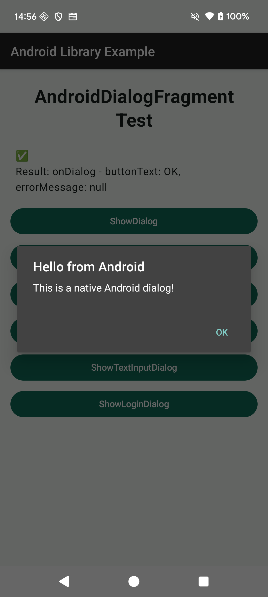
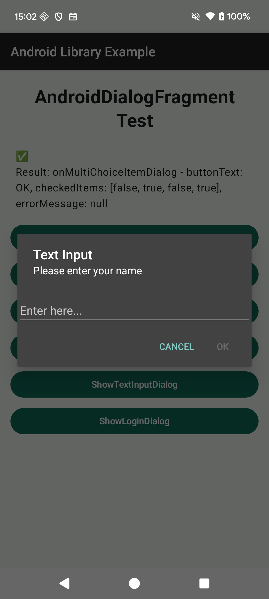
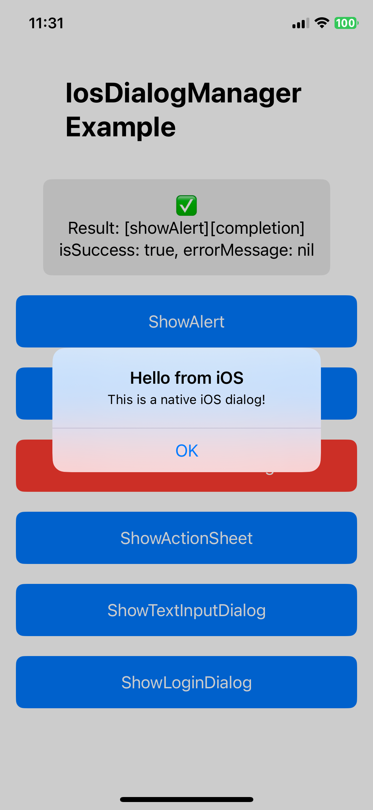
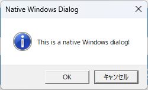
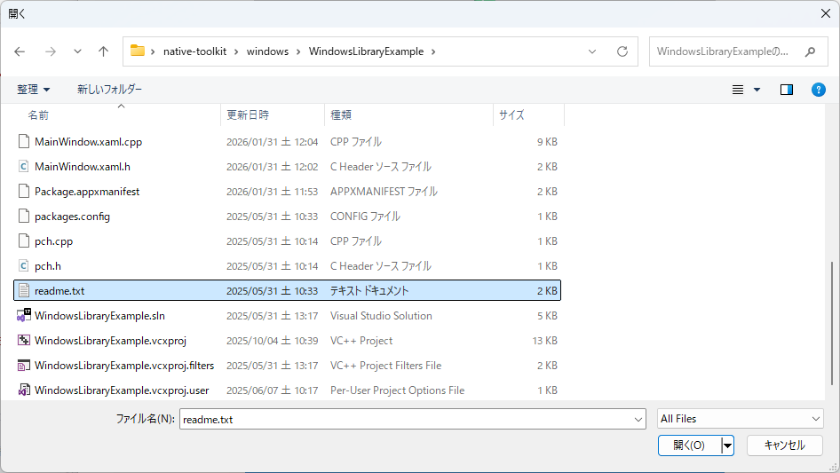
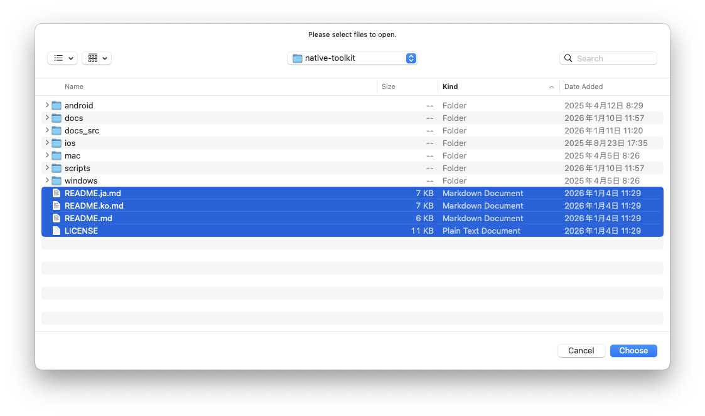
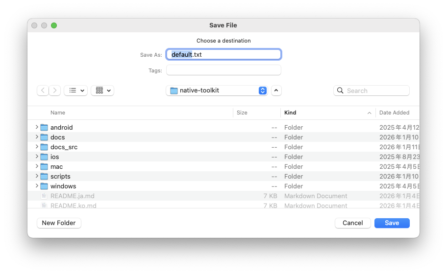

# 다이얼로그 기능

언어:

- 한국어 (이 페이지)
- 日本語: [dialog.ja.md](dialog.ja.md)
- English: [dialog.md](dialog.md)

← [매뉴얼 상단으로 돌아가기](index.ko.md)

---

## 목차

- [Android](#android)
  - [AndroidDialogFragment](#androiddialogfragment)
- [iOS](#ios)
  - [iOSDialogManager](#iosdialogmanager)
- [Windows](#windows)
  - [NativeToolkit::Dialog](#nativetoolkitdialog)
    - [ShowAlert - 기본 다이얼로그](#showalert---기본-다이얼로그-1)
    - [ShowOpenFile - 파일 선택 다이얼로그](#showopenfile---파일-선택-다이얼로그)
    - [ShowOpenFiles - 다중 파일 선택 다이얼로그](#showopenfiles---다중-파일-선택-다이얼로그)
    - [ShowPickFolder - 폴더 선택 다이얼로그](#showpickfolder---폴더-선택-다이얼로그)
    - [ShowPickFolders - 다중 폴더 선택 다이얼로그](#showpickfolders---다중-폴더-선택-다이얼로그)
    - [ShowSaveFile - 저장 다이얼로그](#showsavefile---저장-다이얼로그)
  - [C ABI](#c-abi)
- [macOS](#macos)
  - [MacDialogManager](#macdialogmanager)

---

## Android

### AndroidDialogFragment

#### 기본 다이얼로그

- 다이얼로그를 표시합니다.

```kotlin
import android.library.dialog.AndroidDialogFragment

// 제목을 설정합니다. 필수 항목입니다.
val title = "Hello from Android";
// 메시지를 설정합니다. 필수 항목입니다.
val message = "This is a native Android dialog!";
// 버튼 텍스트를 설정합니다. 미설정 시 "OK"가 사용됩니다.
val buttonText = "OK";
// 다이얼로그 바깥 영역 터치 시 취소 가능 여부를 설정합니다. 미설정 시 true가 사용됩니다.
val cancelableOnTouchOutside = false;
// 뒤로가기 키 등으로 다이얼로그를 취소할 수 있는지 설정합니다. 미설정 시 true가 사용됩니다.
val cancelable = false;

AndroidDialogFragment.newInstance(
    title = title,
    message = message,
    buttonText = buttonText,
    cancelableOnTouchOutside = cancelableOnTouchOutside,
    cancelable = cancelable
).apply {
    // 다이얼로그 결과를 수신할 리스너를 설정합니다.
    setDialogListener(object : AndroidDialogFragment.DialogListener {
        // dialog: 다이얼로그 인스턴스
        // buttonText: 눌린 버튼 텍스트를 가져옵니다. 오류 시 null을 반환합니다.
        // isSuccessful: 다이얼로그 표시 성공 플래그를 가져옵니다. 성공 시 true를 반환합니다.
        // errorMessage: 오류가 발생한 경우 오류 내용을 가져옵니다. 성공 시 null을 반환합니다.
        override fun onDialog(
            dialog: AndroidDialogFragment,
            buttonText: String?,
            isSuccessful: Boolean,
            errorMessage: String?) {
                Log.d(TAG, "onDialog - buttonText: $buttonText, isSuccessful: $isSuccessful, errorMessage: $errorMessage")
        }
    })
    // 첫 번째 인수: FragmentManager
    // 두 번째 인수: 다이얼로그 태그 이름
    show(supportFragmentManager, "AndroidDialogFragment")
}
```

<p align="center">
    
</p>

#### 확인 다이얼로그

- 다이얼로그를 표시합니다.

```kotlin
import android.library.dialog.AndroidDialogFragment

// 제목을 설정합니다. 필수 항목입니다.
val title = "Confirmation"
// 메시지를 설정합니다. 필수 항목입니다.
val message = "Do you want to proceed with this action?"
// 부정 버튼 텍스트를 설정합니다. 미설정 시 "No"가 사용됩니다.
val negativeButtonText = "No"
// 긍정 버튼 텍스트를 설정합니다. 미설정 시 "Yes"가 사용됩니다.
val positiveButtonText = "Yes"
// 다이얼로그 바깥 영역 터치 시 취소 가능 여부를 설정합니다. 미설정 시 true가 사용됩니다.
val cancelableOnTouchOutside = false
// 뒤로가기 키 등으로 다이얼로그를 취소할 수 있는지 설정합니다. 미설정 시 true가 사용됩니다.
val cancelable = false

AndroidDialogFragment.newInstance(
    title = title,
    message = message,
    negativeButtonText = negativeButtonText,
    positiveButtonText = positiveButtonText,
    cancelableOnTouchOutside = cancelableOnTouchOutside,
    cancelable = cancelable
).apply {
    // 확인 다이얼로그 결과를 수신할 리스너를 설정합니다.
    setConfirmDialogListener(object : AndroidDialogFragment.ConfirmDialogListener {
        // dialog: 다이얼로그 인스턴스
        // buttonText: 눌린 버튼 텍스트를 가져옵니다. 오류 시 null을 반환합니다.
        // isSuccessful: 다이얼로그 표시 성공 플래그를 가져옵니다. 성공 시 true를 반환합니다.
        // errorMessage: 오류가 발생한 경우 오류 내용을 가져옵니다. 성공 시 null을 반환합니다.
        override fun onConfirmDialog(
            dialog: AndroidDialogFragment,
            buttonText: String?,
            isSuccessful: Boolean,
            errorMessage: String?) {
                Log.d(TAG, "onConfirmDialog - buttonText: $buttonText, isSuccessful: $isSuccessful, errorMessage: $errorMessage")
        }
    })
    // 첫 번째 인수: FragmentManager
    // 두 번째 인수: 다이얼로그 태그 이름
    show(supportFragmentManager, "AndroidDialogFragment")
}
```

<p align="center">
    
</p>

#### 단일 선택 다이얼로그

- 다이얼로그를 표시합니다.

```kotlin
import android.library.dialog.AndroidDialogFragment

// 제목을 설정합니다. 필수 항목입니다.
val title = "Please select one"
// 선택 항목을 설정합니다. 필수 항목입니다.
val singleChoiceItems = arrayOf("Option 1", "Option 2", "Option 3")
// 기본 선택 항목 인덱스를 설정합니다. 미설정 시 0이 사용됩니다.
val checkedItem = 0
// 부정 버튼 텍스트를 설정합니다. 미설정 시 "Cancel"이 사용됩니다.
val negativeButtonText = "Cancel"
// 긍정 버튼 텍스트를 설정합니다. 미설정 시 "OK"가 사용됩니다.
val positiveButtonText = "OK"
// 다이얼로그 바깥 영역 터치 시 취소 가능 여부를 설정합니다. 미설정 시 true가 사용됩니다.
val cancelableOnTouchOutside = false
// 뒤로가기 키 등으로 다이얼로그를 취소할 수 있는지 설정합니다. 미설정 시 true가 사용됩니다.
val cancelable = false

AndroidDialogFragment.newInstance(
    title = title,
    singleChoiceItems = singleChoiceItems,
    checkedItem = checkedItem,
    negativeButtonText = negativeButtonText,
    positiveButtonText = positiveButtonText,
    cancelableOnTouchOutside = cancelableOnTouchOutside,
    cancelable = cancelable
).apply {
    // 단일 선택 다이얼로그 결과를 수신할 리스너를 설정합니다.
    setSingleChoiceItemDialogListener(object : AndroidDialogFragment.SingleChoiceItemDialogListener {
        // dialog: 다이얼로그 인스턴스
        // buttonText: 눌린 버튼 텍스트를 가져옵니다. 오류 시 null을 반환합니다.
        // checkedItem: 선택된 항목 인덱스를 가져옵니다. 오류 시 null을 반환합니다.
        // isSuccessful: 다이얼로그 표시 성공 플래그를 가져옵니다. 성공 시 true를 반환합니다.
        // errorMessage: 오류가 발생한 경우 오류 내용을 가져옵니다. 성공 시 null을 반환합니다.
        override fun onSingleChoiceItemDialog(
            dialog: AndroidDialogFragment,
            buttonText: String?,
            checkedItem: Int?,
            isSuccessful: Boolean,
            errorMessage: String?) {
                Log.d(TAG, "onSingleChoiceItemDialog - buttonText: $buttonText, checkedItem: $checkedItem, isSuccessful: $isSuccessful, errorMessage: $errorMessage")
        }
    })
    // 첫 번째 인수: FragmentManager
    // 두 번째 인수: 다이얼로그 태그 이름
    show(supportFragmentManager, "AndroidDialogFragment")
}
```

<p align="center">
    
</p>

#### 다중 선택 다이얼로그

- 다이얼로그를 표시합니다.

```kotlin
import android.library.dialog.AndroidDialogFragment

// 제목을 설정합니다. 필수 항목입니다.
val title = "Multiple Selection"
// 선택 항목을 설정합니다. 필수 항목입니다.
val multiChoiceItems = arrayOf("Option 1", "Option 2", "Option 3", "Option 4")
// 기본 선택 상태를 설정합니다. 미설정 시 모두 false가 사용됩니다.
val checkedItems = booleanArrayOf(false, true, false, true)
// 부정 버튼 텍스트를 설정합니다. 미설정 시 "Cancel"이 사용됩니다.
val negativeButtonText = "Cancel"
// 긍정 버튼 텍스트를 설정합니다. 미설정 시 "OK"가 사용됩니다.
val positiveButtonText = "OK"
// 다이얼로그 바깥 영역 터치 시 취소 가능 여부를 설정합니다. 미설정 시 true가 사용됩니다.
val cancelableOnTouchOutside = false
// 뒤로가기 키 등으로 다이얼로그를 취소할 수 있는지 설정합니다. 미설정 시 true가 사용됩니다.
val cancelable = false

AndroidDialogFragment.newInstance(
    title = title,
    multiChoiceItems = multiChoiceItems,
    checkedItems = checkedItems,
    negativeButtonText = negativeButtonText,
    positiveButtonText = positiveButtonText,
    cancelableOnTouchOutside = cancelableOnTouchOutside,
    cancelable = cancelable
).apply {
    // 다중 선택 다이얼로그 결과를 수신할 리스너를 설정합니다.
    setMultiChoiceItemDialogListener(object : AndroidDialogFragment.MultiChoiceItemDialogListener {
        // dialog: 다이얼로그 인스턴스
        // buttonText: 눌린 버튼 텍스트를 가져옵니다. 오류 시 null을 반환합니다.
        // checkedItems: 선택 항목 체크 상태를 가져옵니다. 선택은 true, 미선택은 false이며 오류 시 null을 반환합니다.
        // isSuccessful: 다이얼로그 표시 성공 플래그를 가져옵니다. 성공 시 true를 반환합니다.
        // errorMessage: 오류가 발생한 경우 오류 내용을 가져옵니다. 성공 시 null을 반환합니다.
        override fun onMultiChoiceItemDialog(
            dialog: AndroidDialogFragment,
            buttonText: String?,
            checkedItems: BooleanArray?,
            isSuccessful: Boolean,
            errorMessage: String?) {
                Log.d(TAG, "onMultiChoiceItemDialog - buttonText: $buttonText, checkedItems: ${checkedItems.contentToString()}, isSuccessful: $isSuccessful, errorMessage: $errorMessage")
        }
    })
    // 첫 번째 인수: FragmentManager
    // 두 번째 인수: 다이얼로그 태그 이름
    show(supportFragmentManager, "AndroidDialogFragment")
}
```

<p align="center">
    
</p>

#### 입력 다이얼로그

- 다이얼로그를 표시합니다.

```kotlin
import android.library.dialog.AndroidDialogFragment

// 제목을 설정합니다. 필수 항목입니다.
val title = "Text Input"
// 메시지를 설정합니다. 필수 항목입니다.
val message = "Please enter your name"
// 플레이스홀더를 설정합니다. 미설정 시 빈 문자열이 사용됩니다.
val hint = "Enter here..."
// 부정 버튼 텍스트를 설정합니다. 미설정 시 "Cancel"이 사용됩니다.
val negativeButtonText = "Cancel"
// 긍정 버튼 텍스트를 설정합니다. 미설정 시 "OK"가 사용됩니다.
val positiveButtonText = "OK"
// 입력값이 비어 있을 때 긍정 버튼 활성화 여부를 설정합니다. 미설정 시 false가 사용됩니다.
val enablePositiveButtonWhenEmpty = false
// 다이얼로그 바깥 영역 터치 시 취소 가능 여부를 설정합니다. 미설정 시 true가 사용됩니다.
val cancelableOnTouchOutside = false
// 뒤로가기 키 등으로 다이얼로그를 취소할 수 있는지 설정합니다. 미설정 시 true가 사용됩니다.
val cancelable = false

AndroidDialogFragment.newInstance(
    title = title,
    message = message,
    hint = hint,
    negativeButtonText = negativeButtonText,
    positiveButtonText = positiveButtonText,
    enablePositiveButtonWhenEmpty = enablePositiveButtonWhenEmpty,
    cancelableOnTouchOutside = cancelableOnTouchOutside,
    cancelable = cancelable
).apply {
    // 입력 다이얼로그 결과를 수신할 리스너를 설정합니다.
    setTextInputDialogListener(object : AndroidDialogFragment.TextInputDialogListener {
        // dialog: 다이얼로그 인스턴스
        // buttonText: 눌린 버튼 텍스트를 가져옵니다. 오류 시 null을 반환합니다.
        // inputText: 입력 텍스트를 가져옵니다. 오류 시 null을 반환합니다.
        // isSuccessful: 다이얼로그 표시 성공 플래그를 가져옵니다. 성공 시 true를 반환합니다.
        // errorMessage: 오류가 발생한 경우 오류 내용을 가져옵니다. 성공 시 null을 반환합니다.
        override fun onTextInputDialog(
            dialog: AndroidDialogFragment,
            buttonText: String?,
            inputText: String?,
            isSuccessful: Boolean,
            errorMessage: String?) {
                Log.d(TAG, "onTextInputDialog - buttonText: $buttonText, inputText: $inputText, isSuccessful: $isSuccessful, errorMessage: $errorMessage")
        }
    })
    // 첫 번째 인수: FragmentManager
    // 두 번째 인수: 다이얼로그 태그 이름
    show(supportFragmentManager, "AndroidDialogFragment")
}
```

<p align="center">
    
</p>

#### 로그인 다이얼로그

- 다이얼로그를 표시합니다.

```kotlin
import android.library.dialog.AndroidDialogFragment

// 제목을 설정합니다. 필수 항목입니다.
val title = "Login"
// 메시지를 설정합니다. 필수 항목입니다.
val message = "Please enter your credentials"
// 사용자명 플레이스홀더를 설정합니다. 미설정 시 "Username"이 사용됩니다.
val usernameHint = "Username"
// 비밀번호 플레이스홀더를 설정합니다. 미설정 시 "Password"가 사용됩니다.
val passwordHint = "Password"
// 부정 버튼 텍스트를 설정합니다. 미설정 시 "Cancel"이 사용됩니다.
val negativeButtonText = "Cancel"
// 긍정 버튼 텍스트를 설정합니다. 미설정 시 "Login"이 사용됩니다.
val positiveButtonText = "Login"
// 입력값이 비어 있을 때 긍정 버튼 활성화 여부를 설정합니다. 미설정 시 false가 사용됩니다.
val enablePositiveButtonWhenEmpty = false
// 다이얼로그 바깥 영역 터치 시 취소 가능 여부를 설정합니다. 미설정 시 true가 사용됩니다.
val cancelableOnTouchOutside = false
// 뒤로가기 키 등으로 다이얼로그를 취소할 수 있는지 설정합니다. 미설정 시 true가 사용됩니다.
val cancelable = false

AndroidDialogFragment.newInstance(
    title = title,
    message = message,
    usernameHint = usernameHint,
    passwordHint = passwordHint,
    negativeButtonText = negativeButtonText,
    positiveButtonText = positiveButtonText,
    enablePositiveButtonWhenEmpty = enablePositiveButtonWhenEmpty,
    cancelableOnTouchOutside = cancelableOnTouchOutside,
    cancelable = cancelable
).apply {
    // 로그인 다이얼로그 결과를 수신할 리스너를 설정합니다.
    setLoginDialogListener(object : AndroidDialogFragment.LoginDialogListener {
        // dialog: 다이얼로그 인스턴스
        // buttonText: 눌린 버튼 텍스트를 가져옵니다. 오류 시 null을 반환합니다.
        // username: 입력한 사용자명을 가져옵니다. 오류 시 null을 반환합니다.
        // password: 입력한 비밀번호를 가져옵니다. 오류 시 null을 반환합니다.
        // isSuccessful: 다이얼로그 표시 성공 플래그를 가져옵니다. 성공 시 true를 반환합니다.
        // errorMessage: 오류가 발생한 경우 오류 내용을 가져옵니다. 성공 시 null을 반환합니다.
        override fun onLoginDialog(
            dialog: AndroidDialogFragment,
            buttonText: String?,
            username: String?,
            password: String?,
            isSuccessful: Boolean,
            errorMessage: String?) {
                Log.d(TAG, "onLoginDialog - buttonText: $buttonText, username: $username, password: $password, isSuccessful: $isSuccessful, errorMessage: $errorMessage")
        }
    })
    show(supportFragmentManager, "AndroidDialogFragment")
}
```

<p align="center">
    
</p>

---

## iOS

### iOSDialogManager

#### ShowAlert - 기본 다이얼로그

- 다이얼로그를 표시합니다.

```swift
IosDialogManager.shared.showAlert(
    // 제목을 설정합니다.
    title: "Hello from iOS",
    // 메시지를 설정합니다.
    message: "This is a native iOS dialog!",
    // 버튼 텍스트를 설정합니다. 미설정 시 "OK"가 사용됩니다.
    buttonText: "OK",
    // 버튼 탭 이벤트를 설정합니다.
    onButton: { buttonText, isSuccess, errorMessage in
        // buttonText: 눌린 버튼 텍스트를 가져옵니다. 오류 시 nil을 반환합니다.
        // isSuccess: 다이얼로그 표시 성공 플래그를 가져옵니다. 성공 시 true를 반환합니다.
        // errorMessage: 오류가 발생한 경우 오류 내용을 가져옵니다. 성공 시 nil을 반환합니다.
    },
    // 다이얼로그 완료 이벤트를 설정합니다.
    completion: { isSuccess, errorMessage in
        // isSuccess: 다이얼로그 표시 성공 플래그를 가져옵니다. 성공 시 true를 반환합니다.
        // errorMessage: 오류가 발생한 경우 오류 내용을 가져옵니다. 성공 시 nil을 반환합니다.
    }
)
```

<p align="center">
    
</p>

#### ShowConfirmDialog - 확인 다이얼로그

- 다이얼로그를 표시합니다.

```swift
IosDialogManager.shared.showConfirmDialog(
    // 제목을 설정합니다.
    title: "Confirm Action",
    // 메시지를 설정합니다.
    message: "Are you sure you want to proceed?",
    // 확인 버튼 텍스트를 설정합니다. 미설정 시 "OK"가 사용됩니다.
    confirmTitle: "Yes",
    // 취소 버튼 텍스트를 설정합니다. 미설정 시 "Cancel"이 사용됩니다.
    cancelTitle: "No",
    // 확인 버튼 탭 이벤트를 설정합니다.
    onConfirm: { confirmButtonText, isSuccess, errorMessage in
        // confirmButtonText: 눌린 버튼 텍스트를 가져옵니다. 오류 시 nil을 반환합니다.
        // isSuccess: 다이얼로그 표시 성공 플래그를 가져옵니다. 성공 시 true를 반환합니다.
        // errorMessage: 오류가 발생한 경우 오류 내용을 가져옵니다. 성공 시 nil을 반환합니다.
    },
    // 취소 버튼 탭 이벤트를 설정합니다.
    onCancel: { cancelButtonText, isSuccess, errorMessage in
        // cancelButtonText: 눌린 버튼 텍스트를 가져옵니다. 오류 시 nil을 반환합니다.
        // isSuccess: 다이얼로그 표시 성공 플래그를 가져옵니다. 성공 시 true를 반환합니다.
        // errorMessage: 오류가 발생한 경우 오류 내용을 가져옵니다. 성공 시 nil을 반환합니다.
    },
    // 다이얼로그 완료 이벤트를 설정합니다.
    completion: { isSuccess, errorMessage in
        // isSuccess: 다이얼로그 표시 성공 플래그를 가져옵니다. 성공 시 true를 반환합니다.
        // errorMessage: 오류가 발생한 경우 오류 내용을 가져옵니다. 성공 시 nil을 반환합니다.
    }
)
```

<p align="center">
    
</p>

#### ShowDestructiveDialog - 파괴적 다이얼로그

- 다이얼로그를 표시합니다.

```swift
IosDialogManager.shared.showDestructiveDialog(
    // 제목을 설정합니다.
    title: "Delete File",
    // 메시지를 설정합니다.
    message: "This action cannot be undone. Are you sure?",
    // 파괴적 작업 버튼 텍스트를 설정합니다. 미설정 시 "Delete"가 사용됩니다.
    destructiveTitle: "Delete",
    // 취소 버튼 텍스트를 설정합니다. 미설정 시 "Cancel"이 사용됩니다.
    cancelTitle: "Cancel",
    // 파괴적 작업 버튼 탭 이벤트를 설정합니다.
    onDestructive: { destructiveButtonText, isSuccess, errorMessage in
        // destructiveButtonText: 눌린 버튼 텍스트를 가져옵니다. 오류 시 nil을 반환합니다.
        // isSuccess: 다이얼로그 표시 성공 플래그를 가져옵니다. 성공 시 true를 반환합니다.
        // errorMessage: 오류가 발생한 경우 오류 내용을 가져옵니다. 성공 시 nil을 반환합니다.
    },
    // 취소 버튼 탭 이벤트를 설정합니다.
    onCancel: { cancelButtonText, isSuccess, errorMessage in
        // cancelButtonText: 눌린 버튼 텍스트를 가져옵니다. 오류 시 nil을 반환합니다.
        // isSuccess: 다이얼로그 표시 성공 플래그를 가져옵니다. 성공 시 true를 반환합니다.
        // errorMessage: 오류가 발생한 경우 오류 내용을 가져옵니다. 성공 시 nil을 반환합니다.
    },
    // 다이얼로그 완료 이벤트를 설정합니다.
    completion: { isSuccess, errorMessage in
        // isSuccess: 다이얼로그 표시 성공 플래그를 가져옵니다. 성공 시 true를 반환합니다.
        // errorMessage: 오류가 발생한 경우 오류 내용을 가져옵니다. 성공 시 nil을 반환합니다.
    }
)
```

<p align="center">
    
</p>

#### ShowActionSheet - 액션 시트

- 액션 시트를 표시합니다.

```swift
if let rootVC = IosDialogManager.shared.getRootViewController() {
    IosDialogManager.shared.showActionSheet(
        // 제목을 설정합니다.
        title: "Please select",
        // 메시지를 설정합니다.
        message: "Please choose an option",
        // 옵션을 설정합니다. 필수 항목입니다.
        options: ["Camera", "Photo Library", "Documents"],
        // 취소 버튼 텍스트를 설정합니다. 미설정 시 "Cancel"이 사용됩니다.
        cancelTitle: "Cancel",
        // 액션 시트를 표시할 sourceView를 설정합니다. 필수 항목입니다.
        sourceView: rootVC.view,
        // 표시 기준 뷰의 sourceRect를 설정합니다.
        sourceRect: nil,
        // 애니메이션 표시 여부를 설정합니다. 미설정 시 true가 사용됩니다.
        animated: true,
        // 액션 버튼 탭 이벤트를 설정합니다.
        onAction: { action, isSuccess, errorMessage in
            // action: 선택된 항목을 가져옵니다. 오류 시 nil을 반환합니다.
            // isSuccess: 다이얼로그 표시 성공 플래그를 가져옵니다. 성공 시 true를 반환합니다.
            // errorMessage: 오류가 발생한 경우 오류 내용을 가져옵니다. 성공 시 nil을 반환합니다.
        },
        completion: { isSuccess, errorMessage in
            // isSuccess: 다이얼로그 표시 성공 플래그를 가져옵니다. 성공 시 true를 반환합니다.
            // errorMessage: 오류가 발생한 경우 오류 내용을 가져옵니다. 성공 시 nil을 반환합니다.
        }
    )
}
```

<p align="center">
    
</p>

#### ShowTextInputDialog - 입력 다이얼로그

- 다이얼로그를 표시합니다.

```swift
IosDialogManager.shared.showTextInputDialog(
    // 제목을 설정합니다.
    title: "Enter Name",
    // 메시지를 설정합니다.
    message: "Please enter your name",
    // 플레이스홀더를 설정합니다.
    placeholder: "Your name here",
    // 확인 버튼 텍스트를 설정합니다. 미설정 시 "OK"가 사용됩니다.
    confirmTitle: "OK",
    // 취소 버튼 텍스트를 설정합니다. 미설정 시 "Cancel"이 사용됩니다.
    cancelTitle: "Cancel",
    // 입력값이 비어 있을 때 확인 버튼 활성화 여부를 설정합니다. 미설정 시 true가 사용됩니다.
    enableConfirmWhenEmpty: false,
    // 확인 버튼 탭 이벤트를 설정합니다.
    onConfirm: { confirmButtonText, inputText, isSuccess, errorMessage in
        // confirmButtonText: 눌린 버튼 텍스트를 가져옵니다. 오류 시 nil을 반환합니다.
        // inputText: 입력 텍스트를 가져옵니다. 오류 시 nil을 반환합니다.
        // isSuccess: 다이얼로그 표시 성공 플래그를 가져옵니다. 성공 시 true를 반환합니다.
        // errorMessage: 오류가 발생한 경우 오류 내용을 가져옵니다. 성공 시 nil을 반환합니다.
    },
    // 취소 버튼 탭 이벤트를 설정합니다.
    onCancel: { cancelButtonText, isSuccess, errorMessage in
        // cancelButtonText: 눌린 버튼 텍스트를 가져옵니다. 오류 시 nil을 반환합니다.
        // inputText: 입력 텍스트를 가져옵니다. 오류 시 nil을 반환합니다.
        // isSuccess: 다이얼로그 표시 성공 플래그를 가져옵니다. 성공 시 true를 반환합니다.
        // errorMessage: 오류가 발생한 경우 오류 내용을 가져옵니다. 성공 시 nil을 반환합니다.
    },
    // 다이얼로그 완료 이벤트를 설정합니다.
    completion: { isSuccess, errorMessage in
        // isSuccess: 다이얼로그 표시 성공 플래그를 가져옵니다. 성공 시 true를 반환합니다.
        // errorMessage: 오류가 발생한 경우 오류 내용을 가져옵니다. 성공 시 nil을 반환합니다.
    }
)
```

<p align="center">
    
</p>

#### ShowLoginDialog - 로그인 다이얼로그

- 다이얼로그를 표시합니다.

```swift
IosDialogManager.shared.showLoginDialog(
    // 제목을 설정합니다.
    title: "Login Required",
    // 메시지를 설정합니다.
    message: "Please enter your credentials",
    // 사용자명 플레이스홀더를 설정합니다. 미설정 시 "Username"이 사용됩니다.
    usernamePlaceholder: "Username",
    // 비밀번호 플레이스홀더를 설정합니다. 미설정 시 "Password"가 사용됩니다.
    passwordPlaceholder: "Password",
    // 로그인 버튼 텍스트를 설정합니다. 미설정 시 "Login"이 사용됩니다.
    loginTitle: "Login",
    // 취소 버튼 텍스트를 설정합니다. 미설정 시 "Cancel"이 사용됩니다.
    cancelTitle: "Cancel",
    // 입력값이 비어 있을 때 로그인 버튼 활성화 여부를 설정합니다. 미설정 시 true가 사용됩니다.
    enableLoginWhenEmpty: false,
    // 로그인 버튼 탭 이벤트를 설정합니다.
    onLogin: { loginButtonText, username, password, isSuccess, errorMessage in
        // loginButtonText: 눌린 버튼 텍스트를 가져옵니다. 오류 시 nil을 반환합니다.
        // username: 입력한 사용자명을 가져옵니다. 오류 시 nil을 반환합니다.
        // password: 입력한 비밀번호를 가져옵니다. 오류 시 nil을 반환합니다.
        // isSuccess: 다이얼로그 표시 성공 플래그를 가져옵니다. 성공 시 true를 반환합니다.
        // errorMessage: 오류가 발생한 경우 오류 내용을 가져옵니다. 성공 시 nil을 반환합니다.
    },
    // 취소 버튼 탭 이벤트를 설정합니다.
    onCancel: { cancelButtonText, isSuccess, errorMessage in
        // cancelButtonText: 눌린 버튼 텍스트를 가져옵니다. 오류 시 nil을 반환합니다.
        // isSuccess: 다이얼로그 표시 성공 플래그를 가져옵니다. 성공 시 true를 반환합니다.
        // errorMessage: 오류가 발생한 경우 오류 내용을 가져옵니다. 성공 시 nil을 반환합니다.
    },
    // 다이얼로그 완료 이벤트를 설정합니다.
    completion: { isSuccess, errorMessage in
        // isSuccess: 다이얼로그 표시 성공 플래그를 가져옵니다. 성공 시 true를 반환합니다.
        // errorMessage: 오류가 발생한 경우 오류 내용을 가져옵니다. 성공 시 nil을 반환합니다.
    }
)
```

<p align="center">
    
</p>

---

## Windows

Windows 라이브러리는 같은 다이얼로그를 두 가지 공개 API로 제공합니다. 구현은 하나이며, 샘플 앱은 C++ API를 사용합니다.

| API | 이름 | 헤더 | NuGet 패키지 |
|---|---|---|---|
| C++ API | `NativeToolkit::Dialog` | `<NativeToolkit/Dialog.h>` | `NativeToolkit` |
| C ABI | `ntk_dialog_*` | `<NativeToolkitC/Dialog.h>` | `NativeToolkit.CApi` |

### NativeToolkit::Dialog

- 모든 다이얼로그는 모달이며 호출한 스레드를 블로킹합니다. UI 스레드에서 호출해 주세요.
- 반환값은 `Dialog::Result<T>`입니다. `has_value()`로 성공과 실패를 구분하고, 성공이면 `value()`, 실패면 `error()`(`Dialog::Error`)를 참조합니다. `Dialog::Error`는 정의된 구분인 `code`와 OS가 보고한 원래 값인 `systemCode`를 가집니다.
- 사용자가 다이얼로그를 닫은 경우는 호출의 실패도 값도 아니므로 `Dialog::ErrorCode::Canceled`로 돌아옵니다.
- 공개 헤더는 `<windows.h>`를 include하지 않습니다. `request.owner`는 `NativeToolkit::WindowHandle`(`HWND`와 같은 타입)을 받습니다.

#### ShowAlert - 기본 다이얼로그

- 메시지 박스를 표시하고 눌린 버튼을 반환합니다.

```cpp
#include <NativeToolkit/Dialog.h>

namespace Dialog = NativeToolkit::Dialog;

Dialog::AlertRequest request;
// 제목을 설정합니다.
request.title = L"Native Windows Dialog";
// 메시지를 설정합니다.
request.message = L"This is a native Windows dialog!";
// 표시할 버튼을 설정합니다. 여기서는 OK와 Cancel입니다.
request.buttons = Dialog::AlertButtons::OkCancel;
// 아이콘을 설정합니다. 여기서는 정보 아이콘입니다.
request.icon = Dialog::AlertIcon::Information;
// 처음에 포커스를 받을 버튼을 설정합니다. 여기서는 두 번째입니다.
request.defaultButton = Dialog::AlertDefaultButton::Second;
// 선택: 소유자 윈도우, MB_TOPMOST, MB_HELP도 지정할 수 있습니다.
// request.owner = hwnd;
// request.topMost = true;
// request.showHelpButton = true;

const auto result = Dialog::ShowAlert(request);
if (result.has_value())
{
    // Cancel도 하나의 버튼이므로 실패가 아니라
    // AlertResult::Cancel로 돌아옵니다.
    const Dialog::AlertResult pressed = result.value();
    if (pressed == Dialog::AlertResult::Ok)
    {
        // OK를 눌렀을 때의 처리입니다.
    }
}
else
{
    // code가 정의된 구분, systemCode가 OS의 원래 값입니다.
    const Dialog::ErrorCode code = result.error().code;
    const uint32_t systemCode = result.error().systemCode;
}
```

<p align="center">
    
</p>

#### ShowOpenFile - 파일 선택 다이얼로그

- 기존 파일을 하나 선택하게 하고 전체 경로를 반환합니다.

```cpp
#include <NativeToolkit/Dialog.h>

namespace Dialog = NativeToolkit::Dialog;

Dialog::FileRequest request;
// 제목을 설정합니다.
request.title = L"Open File";
// 종류 목록을 설정합니다. 한 항목은 설명과 패턴의 쌍입니다.
// 필터를 하나도 설정하지 않으면 모든 파일이 대상이 됩니다.
request.filters = { Dialog::FileFilter{ L"All Files", { L"*.*" } } };
// 선택하는 파일이 실제로 존재하도록 요구합니다(OFN_FILEMUSTEXIST). 기본값입니다.
request.fileMustExist = true;

const auto result = Dialog::ShowOpenFile(request);
if (result.has_value())
{
    // 전체 경로입니다.
    const std::wstring& filePath = result.value();
}
else if (result.error().code == Dialog::ErrorCode::Canceled)
{
    // 사용자가 다이얼로그를 닫았습니다.
}
else
{
    const uint32_t systemCode = result.error().systemCode;
}
```

<p align="center">
    
</p>

#### ShowOpenFiles - 다중 파일 선택 다이얼로그

- 기존 파일을 하나 이상, 다이얼로그가 반환한 순서대로 가져옵니다.

```cpp
#include <NativeToolkit/Dialog.h>

namespace Dialog = NativeToolkit::Dialog;

Dialog::FileRequest request;
// 제목을 설정합니다.
request.title = L"Open Files";
// 종류 목록을 설정합니다.
request.filters = { Dialog::FileFilter{ L"All Files", { L"*.*" } } };

const auto result = Dialog::ShowOpenFiles(request);
if (result.has_value())
{
    // 각 항목은 전체 경로이며, 폴더 자체는 항목에 포함되지 않습니다.
    const std::vector<std::wstring>& paths = result.value();
    for (const std::wstring& path : paths)
    {
        // 선택된 파일 하나입니다.
    }
}
else if (result.error().code == Dialog::ErrorCode::Canceled)
{
    // 사용자가 다이얼로그를 닫았습니다.
}
```

<p align="center">
    
</p>

#### ShowPickFolder - 폴더 선택 다이얼로그

- 폴더를 하나 선택하게 합니다.

```cpp
#include <NativeToolkit/Dialog.h>

namespace Dialog = NativeToolkit::Dialog;

Dialog::FolderRequest request;
// 제목을 설정합니다. 비워 두면 OS의 기본 제목이 사용됩니다.
request.title = L"Select Folder";

const auto result = Dialog::ShowPickFolder(request);
if (result.has_value())
{
    const std::wstring& folderPath = result.value();
}
else if (result.error().code == Dialog::ErrorCode::Canceled)
{
    // 사용자가 다이얼로그를 닫았습니다.
}
```

<p align="center">
    
</p>

#### ShowPickFolders - 다중 폴더 선택 다이얼로그

- 폴더를 하나 이상 선택하게 합니다.

```cpp
#include <NativeToolkit/Dialog.h>

namespace Dialog = NativeToolkit::Dialog;

Dialog::FolderRequest request;
// 제목을 설정합니다.
request.title = L"Select Folders";

const auto result = Dialog::ShowPickFolders(request);
if (result.has_value())
{
    // 각 항목은 전체 경로입니다.
    const std::vector<std::wstring>& paths = result.value();
}
else if (result.error().code == Dialog::ErrorCode::Canceled)
{
    // 사용자가 다이얼로그를 닫았습니다.
}
```

<p align="center">
    
</p>

#### ShowSaveFile - 저장 다이얼로그

- 저장할 위치를 선택하게 합니다. 파일 자체는 만들어지지 않습니다.

```cpp
#include <NativeToolkit/Dialog.h>

namespace Dialog = NativeToolkit::Dialog;

Dialog::SaveFileRequest request;
// 제목을 설정합니다.
request.title = L"Save File";
// 종류 목록을 설정합니다.
request.filters = { Dialog::FileFilter{ L"All Files", { L"*.*" } } };
// 확장자를 입력하지 않았을 때 붙일 확장자를 설정합니다.
request.defaultExtension = L"txt";
// 기존 파일을 선택했을 때 확인합니다(OFN_OVERWRITEPROMPT). 기본값입니다.
request.overwritePrompt = true;

const auto result = Dialog::ShowSaveFile(request);
if (result.has_value())
{
    const std::wstring& savePath = result.value();
}
else if (result.error().code == Dialog::ErrorCode::Canceled)
{
    // 사용자가 다이얼로그를 닫았습니다.
}
```

<p align="center">
    
</p>

### C ABI

- C에서, 그리고 C DLL을 호출할 수 있는 언어에서 사용하기 위한 API입니다. 헤더는 C99이며 `<stddef.h>`와 `<stdint.h>` 외에는 include하지 않습니다.
- 문자열은 입출력 모두 NUL로 끝나는 UTF-8입니다. `NULL`은 빈 문자열을 의미합니다.
- 요청 구조체는 0으로 채우고 `struct_size`에 자신의 `sizeof`를 넣습니다. 0이 기본값입니다.
- 오류는 반환값으로 보고됩니다. OS가 돌려준 원래 값은 같은 스레드에서 실패 직후에 `ntk_last_system_code()`로 읽습니다.
- 라이브러리가 돌려주는 것은 핸들이며, 대응하는 `_free`로 해제합니다. 핸들에서 꺼낸 포인터는 그 핸들을 해제할 때까지 유효합니다.

```c
#include <string.h>
#include <NativeToolkitC/Common.h>
#include <NativeToolkitC/Dialog.h>

/* 0으로 채운 상태가 기본값입니다. struct_size는 이 구조체가 어느 버전인지
   DLL에 알려 줍니다. */
ntk_dialog_alert_request request;
memset(&request, 0, sizeof(request));
request.struct_size = (uint32_t)sizeof(request);
request.title = "Native Windows Dialog";
request.message = "This is a native Windows dialog!";
request.buttons = NTK_DIALOG_ALERT_BUTTONS_OK_CANCEL;
request.icon = NTK_DIALOG_ALERT_ICON_INFORMATION;
request.default_button = NTK_DIALOG_ALERT_DEFAULT_BUTTON_SECOND;

ntk_dialog_alert_result pressed = 0;
ntk_dialog_error error = ntk_dialog_show_alert(&request, &pressed);
if (error == NTK_DIALOG_ERROR_NONE) {
    /* Cancel도 버튼이므로 여기서는 NTK_DIALOG_ALERT_RESULT_CANCEL입니다. */
} else if (error == NTK_DIALOG_ERROR_SYSTEM_ERROR) {
    uint32_t system_code = ntk_last_system_code();
    (void)system_code;
}
```

선택 계열은 경로를 핸들로 반환합니다.

```c
#include <string.h>
#include <NativeToolkitC/Common.h>
#include <NativeToolkitC/Dialog.h>

ntk_dialog_file_request request;
memset(&request, 0, sizeof(request));
request.struct_size = (uint32_t)sizeof(request);
request.title = "Open File";

/* 종류 목록의 한 항목입니다. 패턴은 ';'로 구분합니다. */
ntk_dialog_filter filters[1];
filters[0].name = "All Files";
filters[0].patterns = "*.*";

ntk_string* path = NULL;
ntk_dialog_error error = ntk_dialog_show_open_file(&request, filters, 1, &path);
if (error == NTK_DIALOG_ERROR_NONE) {
    /* 빌린 포인터입니다. ntk_string_free 전까지 유효합니다. */
    const char* utf8 = ntk_string_data(path);
    size_t size = ntk_string_size(path);
    (void)utf8; (void)size;
    ntk_string_free(path);
} else if (error == NTK_DIALOG_ERROR_CANCELED) {
    /* 사용자가 다이얼로그를 닫았습니다. path는 NULL 그대로입니다. */
}
```

| C++ API | C ABI |
|---|---|
| `Dialog::ShowAlert` | `ntk_dialog_show_alert` |
| `Dialog::ShowOpenFile` | `ntk_dialog_show_open_file` |
| `Dialog::ShowOpenFiles` | `ntk_dialog_show_open_files` |
| `Dialog::ShowSaveFile` | `ntk_dialog_show_save_file` |
| `Dialog::ShowPickFolder` | `ntk_dialog_show_pick_folder` |
| `Dialog::ShowPickFolders` | `ntk_dialog_show_pick_folders` |
---

## macOS

### MacDialogManager

#### ShowDialog - 기본 다이얼로그

- 다이얼로그를 표시합니다.

```swift
// 제목을 설정합니다. 필수 항목입니다.
let title = "Hello from macOS"
// 메시지를 설정합니다. 생략하면 표시되지 않습니다.
let message = "This is a native macOS dialog!"
// 버튼을 설정합니다. 최소 1개의 버튼이 필요합니다.
let buttons = [
    // title: 버튼 제목을 설정합니다. 필수 항목입니다.
    // isDefault: 기본 버튼으로 설정하려면 true로 지정합니다. 기본값은 false이며, 다이얼로그당 기본 버튼은 1개만 허용됩니다.
    // keyEquivalent: 버튼 단축키를 설정합니다. 기본값은 null이며, isDefault가 true이면 Enter 키가 자동 할당됩니다.
    DialogButton(title: "OK", isDefault: true),
    DialogButton(title: "Cancel", keyEquivalent: "\u{1b}"),
    DialogButton(title: "Delete", keyEquivalent: "d")
]
// 옵션을 설정합니다. 필수 항목입니다.
let options = DialogOptions(
    // alertStyle: 다이얼로그 스타일을 설정합니다. 필수 항목입니다.
    alertStyle: .informational,
    // buttons: 다이얼로그에 표시할 버튼 배열을 설정합니다. 필수 항목입니다.
    buttons: buttons,
    // showsHelp: 도움말 버튼 표시 여부를 설정합니다. 기본값은 false입니다.
    showsHelp: true,
    // showsSuppressionButton: suppression 체크박스 표시 여부를 설정합니다. 기본값은 false입니다.
    showsSuppressionButton: true,
    // suppressionButtonTitle: suppression 체크박스 제목을 설정합니다. 생략 시 OS 기본값이 사용되며, showsSuppressionButton이 false이면 무시됩니다.
    suppressionButtonTitle: "Don't show this again",
    // icon: icon shown in the dialog.
    icon: IconConfiguration(
        // 아래는 아이콘 타입별 설정 예시입니다. 필요에 따라 설정하세요.
        ...
    ),
    // accessoryView: accessory view shown in the dialog. Defaults to nil.
    accessoryView: nil
)

// 아이콘 타입이 시스템 심볼일 때의 예시입니다.
let options = DialogOptions(
    ...
    icon: IconConfiguration(
        // type: 아이콘 타입이 시스템 심볼입니다. 필수 항목입니다.
        type: .systemSymbol,
        // value: 시스템 심볼 이름을 설정합니다. 필수 항목입니다.
        value: "info.square.fill",
        // renderingMode: 아이콘 렌더링 모드를 설정합니다. 필수 항목입니다.
        renderingMode: .palette,
        // colors: 아이콘 색상 배열을 설정합니다. Palette 모드에서는 1~3개 색상이 필요하며, Hierarchical 모드에서는 1개 색상을 지정할 수 있습니다. 색상은 #RRGGBB 또는 color name 형식을 사용합니다.
        colors: ["white", "systemblue", "systemblue"],
        // size: 아이콘 크기를 포인트 단위로 설정합니다. 생략 시 OS 기본값이 사용되며, 다이얼로그 제약으로 무시될 수 있습니다.
        size: 64,
        // weight: 아이콘 두께를 설정합니다. 생략 시 OS 기본값이 사용됩니다.
        weight: .regular,
        // scale: 아이콘 스케일을 설정합니다. 생략 시 OS 기본값이 사용되며, 다이얼로그 제약으로 무시될 수 있습니다.
        scale: .medium
    )
)

// 아이콘 타입이 파일 경로일 때의 예시입니다.
let options = DialogOptions(
    ...
    icon: IconConfiguration(
        // type: 아이콘 타입이 파일 경로입니다. 필수 항목입니다.
        type: .filePath,
        // value: 파일 경로를 설정합니다. 필수 항목입니다.
        value: "/Users/user/Downloads/test.png"
    )
);

// 아이콘 타입이 이름 이미지일 때의 예시입니다.
let options = DialogOptions(
    ...
    icon: IconConfiguration(
        // type: 아이콘 타입이 이름 이미지입니다. 필수 항목입니다.
        type: .namedImage,
        // value: 이름 이미지 식별자를 설정합니다. 필수 항목입니다.
        value: "test-image"
    )
);

// 아이콘 타입이 앱 아이콘일 때의 예시입니다.
let options = DialogOptions(
    ...
    icon: IconConfiguration(
        // type: 아이콘 타입이 앱 아이콘입니다. 필수 항목입니다.
        type: .appIcon
    )
);

// 아이콘 타입이 시스템 이미지일 때의 예시입니다.
let options = DialogOptions(
    ...
    icon: IconConfiguration(
        // type: 아이콘 타입이 시스템 이미지입니다. 필수 항목입니다.
        type: .systemImage,
        // value: 시스템 이미지 이름을 설정합니다. 필수 항목입니다.
        value: "cautionName"
    )
)

MacDialogManager.shared.showDialog(
    title: title,
    message: message,
    options: options
    // 다이얼로그 결과 수신 이벤트를 설정합니다.
) { result in
    // result: 다이얼로그 결과를 가져옵니다.
    switch result {
    // buttonIndex: 눌린 버튼 인덱스를 가져옵니다.
    // buttonTitle: 눌린 버튼 제목을 가져옵니다.
    // suppressionButtonState: suppression 체크박스 상태를 가져옵니다.
    // helpButtonPressed: 도움말 버튼 클릭 여부를 가져옵니다.
    // isSuccess: 다이얼로그 표시 성공 플래그를 가져옵니다. 성공 시 true를 반환합니다.
    case .success(let dialogResult):
        Log.d(TAG, "[ShowDialog] success: \(dialogResult)")
    // error: 오류 내용을 가져옵니다.
    case .failure(let error):
        Log.e(TAG, "[ShowDialog] error: \(error)")
    }
}
```

<p align="center">
    
</p>

#### ShowFileDialog - 파일 선택 다이얼로그

- 다이얼로그를 표시합니다.

```swift
MacDialogManager.shared.showFileDialog(
    // 제목을 설정합니다. 필수 항목입니다.
    title: "Select a file",
    // 메시지를 설정합니다. 생략하면 표시되지 않습니다.
    message: "Please select a file to open.",
    // 허용할 파일 확장자를 설정합니다. 생략 시 OS 기본값이 사용됩니다.
    allowedContentTypes: ["txt", "png"],
    // 초기 디렉터리를 설정합니다. 생략 시 OS 기본값이 사용됩니다.
    directoryURL: nil
    // 파일 선택 다이얼로그 결과 수신 이벤트를 설정합니다.
) { result in
    // result: 파일 선택 결과를 가져옵니다.
    switch result {
    // filePaths: 선택된 파일 경로 배열을 가져옵니다. 취소 시 []를 반환합니다.
    // fileCount: 반환된 파일 수를 가져옵니다. 취소 시 0입니다.
    // directoryURL: 선택이 수행된 디렉터리 URL을 가져옵니다. 취소 시 ""를 반환합니다.
    // isCancelled: 다이얼로그 취소 여부를 가져옵니다.
    // isSuccess: 다이얼로그 표시 성공 플래그를 가져옵니다. 성공 시 true를 반환합니다.
    case .success(let openResult):
        Log.d(TAG, "[ShowFileDialog] success: \(openResult)")
    // error: 오류 내용을 가져옵니다.
    case .failure(let error):
        Log.e(TAG, "[ShowFileDialog] error: \(error)")
    }
}
```

<p align="center">
    
</p>

#### ShowMultiFileDialog - 다중 파일 선택 다이얼로그

- 다이얼로그를 표시합니다.

```swift
MacDialogManager.shared.showMultiFileDialog(
    // 제목을 설정합니다. 필수 항목입니다.
    title: "Select files",
    // 메시지를 설정합니다. 생략하면 표시되지 않습니다.
    message: "Please select files to open.",
    // 허용할 파일 확장자를 설정합니다. 생략 시 OS 기본값이 사용됩니다.
    allowedContentTypes: ["txt", "png"],
    // 초기 디렉터리를 설정합니다. 생략 시 OS 기본값이 사용됩니다.
    directoryURL: nil
    // 다중 파일 선택 다이얼로그 결과 수신 이벤트를 설정합니다.
) { result in
    // result: 다중 파일 선택 결과를 가져옵니다.
    switch result {
    // filePaths: 선택된 파일 경로 배열을 가져옵니다. 취소 시 []를 반환합니다.
    // fileCount: 반환된 파일 수를 가져옵니다. 취소 시 0입니다.
    // directoryURL: 선택이 수행된 디렉터리 URL을 가져옵니다. 취소 시 ""를 반환합니다.
    // isCancelled: 다이얼로그 취소 여부를 가져옵니다.
    // isSuccess: 다이얼로그 표시 성공 플래그를 가져옵니다. 성공 시 true를 반환합니다.
    case .success(let openResult):
        Log.d(TAG, "[ShowMultiFileDialog] success: \(openResult)")
    // error: 오류 내용을 가져옵니다.
    case .failure(let error):
        Log.e(TAG, "[ShowMultiFileDialog] error: \(error)")
    }
}
```

<p align="center">
    
</p>

#### ShowFolderDialog - 폴더 선택 다이얼로그

- 다이얼로그를 표시합니다.

```swift
MacDialogManager.shared.showFolderDialog(
    // 제목을 설정합니다. 필수 항목입니다.
    title: "Select a folder",
    // 메시지를 설정합니다. 생략하면 표시되지 않습니다.
    message: "Please select a folder to open.",
    // 초기 디렉터리를 설정합니다. 생략 시 OS 기본값이 사용됩니다.
    directoryURL: nil
    // 폴더 선택 다이얼로그 결과 수신 이벤트를 설정합니다.
) { result in
    // result: 폴더 선택 결과를 가져옵니다.
    switch result {
    // filePaths: 선택된 폴더 경로 배열을 가져옵니다. 취소 시 []를 반환합니다.
    // fileCount: 반환된 폴더 수를 가져옵니다. 취소 시 0입니다.
    // directoryURL: 선택이 수행된 디렉터리 URL을 가져옵니다. 취소 시 ""를 반환합니다.
    // isCancelled: 다이얼로그 취소 여부를 가져옵니다.
    // isSuccess: 다이얼로그 표시 성공 플래그를 가져옵니다. 성공 시 true를 반환합니다.
    case .success(let openResult):
        Log.d(TAG, "[ShowFolderDialog] success: \(openResult)")
    case .failure(let error):
        Log.e(TAG, "[ShowFolderDialog] error: \(error)")
    }
}
```

<p align="center">
    
</p>

#### ShowMultiFolderDialog - 다중 폴더 선택 다이얼로그

- 다이얼로그를 표시합니다.

```swift
MacDialogManager.shared.showMultiFolderDialog(
    // 제목을 설정합니다. 필수 항목입니다.
    title: "Select folders",
    // 메시지를 설정합니다. 생략하면 표시되지 않습니다.
    message: "Please select folders to open.",
    // 초기 디렉터리를 설정합니다. 생략 시 OS 기본값이 사용됩니다.
    directoryURL: nil
    // 다중 폴더 선택 다이얼로그 결과 수신 이벤트를 설정합니다.
) { result in
    // result: 다중 폴더 선택 결과를 가져옵니다.
    switch result {
    // filePaths: 선택된 폴더 경로 배열을 가져옵니다. 취소 시 []를 반환합니다.
    // fileCount: 반환된 폴더 수를 가져옵니다. 취소 시 0입니다.
    // directoryURL: 선택이 수행된 디렉터리 URL을 가져옵니다. 취소 시 ""를 반환합니다.
    // isCancelled: 다이얼로그 취소 여부를 가져옵니다.
    // isSuccess: 다이얼로그 표시 성공 플래그를 가져옵니다. 성공 시 true를 반환합니다.
    case .success(let openResult):
        Log.d(TAG, "[ShowMultiFolderDialog] success: \(openResult)")
    // error: 오류 내용을 가져옵니다.
    case .failure(let error):
        Log.e(TAG, "[ShowMultiFolderDialog] error: \(error)")
    }
}
```

<p align="center">
    
</p>

#### ShowSaveFileDialog - 파일 저장 다이얼로그

- 다이얼로그를 표시합니다.

```swift
MacDialogManager.shared.showSaveFileDialog(
    // 제목을 설정합니다. 필수 항목입니다.
    title: "Save File",
    // 메시지를 설정합니다. 생략하면 표시되지 않습니다.
    message: "Choose a destination",
    // 기본 파일명을 설정합니다. 생략 시 OS 기본값이 사용됩니다.
    nameFieldStringValue: "default",
    // 허용할 파일 확장자를 설정합니다. 생략 시 OS 기본값이 사용됩니다.
    allowedContentTypes: ["txt"],
    // 초기 디렉터리를 설정합니다. 생략 시 OS 기본값이 사용됩니다.
    directoryURL: nil
    // 파일 저장 다이얼로그 결과 수신 이벤트를 설정합니다.
) { result in
    // result: 파일 저장 결과를 가져옵니다.
    switch result {
    // filePath: 저장된 파일 경로를 가져옵니다. 취소 시 ""를 반환합니다.
    // fileCount: 반환된 경로 수를 가져옵니다. 성공 시 1, 취소 시 0입니다.
    // directoryURL: 저장이 수행된 디렉터리 URL을 가져옵니다. 취소 시 ""를 반환합니다.
    // isCancelled: 다이얼로그 취소 여부를 가져옵니다.
    // isSuccess: 다이얼로그 표시 성공 플래그를 가져옵니다. 성공 시 true를 반환합니다.
    case .success(let saveResult):
        Log.d(TAG, "[ShowSaveFileDialog] success: \(saveResult)")
    // error: 오류 내용을 가져옵니다.
    case .failure(let error):
        Log.e(TAG, "[ShowSaveFileDialog] error: \(error)")
    }
}
```

<p align="center">
    
</p>
