# 通知機能

言語:

- 日本語（このページ）
- English: [notification.md](notification.md)
- 한국어: [notification.ko.md](notification.ko.md)

← [マニュアルトップに戻る](index.ja.md)

---

## 目次

- [Android](#android)
  - [セットアップ](#セットアップ)
  - [パーミッション](#パーミッション)
  - [チャンネル管理](#チャンネル管理)
  - [基本的な通知操作](#基本的な通知操作)
  - [通知スタイル](#通知スタイル)
  - [プラットフォームオプション](#プラットフォームオプション)
  - [カスタムビュースタイル](#カスタムビュースタイル)
  - [グループ通知](#グループ通知)
  - [インタラクション](#インタラクション)
  - [進捗通知](#進捗通知)
  - [フォアグラウンドサービス通知](#フォアグラウンドサービス通知)
  - [スケジュール通知](#スケジュール通知)
- [iOS](#ios)
  - [IosNotificationManager](#iosnotificationmanager)
  - [セットアップ](#セットアップ-1)
  - [パーミッション](#パーミッション-1)
    - [通知権限をリクエストする](#通知権限をリクエストする)
    - [権限の確認](#権限の確認)
    - [認証ステータスの取得](#認証ステータスの取得)
    - [通知設定を開く](#通知設定を開く)
  - [通知の表示](#通知の表示-1)
    - [即時表示](#即時表示)
    - [添付ファイル付き即時表示](#添付ファイル付き即時表示)
    - [時間間隔トリガー](#時間間隔トリガー)
    - [カレンダートリガー](#カレンダートリガー)
    - [位置情報トリガー](#位置情報トリガー)
  - [添付ファイル](#添付ファイル)
  - [通知の更新](#通知の更新)
  - [通知のキャンセル / 削除](#通知のキャンセル--削除)
  - [スケジュール通知](#スケジュール通知-1)
    - [スケジュールのキャンセル](#スケジュールのキャンセル)
  - [クエリ](#クエリ)
  - [バッジ](#バッジ)
  - [カテゴリとアクション](#カテゴリとアクション)
    - [カテゴリの登録](#カテゴリの登録)
    - [カテゴリを通知に紐づける](#カテゴリを通知に紐づける)
    - [カテゴリの削除](#カテゴリの削除)
    - [アクション受信コールバック](#アクション受信コールバック)
- [Windows](#windows)
  - [NativeToolkit::Notification](#nativetoolkitnotification)
  - [セットアップ](#セットアップ-2)
    - [Package.appxmanifest（パッケージ済みアプリ）](#packageappxmanifestパッケージ済みアプリ)
    - [Manager の作成 パッケージ済みアプリ](#manager-の作成-パッケージ済みアプリ)
    - [Manager の作成 パッケージ無しアプリ](#manager-の作成-パッケージ無しアプリ)
    - [終了](#終了)
  - [初期化 / 設定](#初期化--設定)
    - [通知設定の取得](#通知設定の取得)
    - [通知設定を開く](#通知設定を開く-1)
  - [通知の表示](#通知の表示-1)
    - [基本](#基本)
    - [ボタン付き](#ボタン付き)
    - [画像付き](#画像付き)
    - [入力付き](#入力付き)
    - [進捗バー付き](#進捗バー付き)
    - [有効期限付き](#有効期限付き)
    - [サウンド付き](#サウンド付き)
  - [スケジュール通知](#スケジュール通知-2)
    - [スケジュールのキャンセル](#スケジュールのキャンセル-2)
  - [進捗の更新](#進捗の更新)
  - [バッジ](#バッジ-1)
  - [削除 / クエリ](#削除--クエリ)
    - [全通知の取得](#全通知の取得)
    - [ID 指定削除](#id-指定削除)
    - [タグ指定削除](#タグ指定削除)
    - [全削除](#全削除)
  - [活性化ハンドラー](#活性化ハンドラー)
  - [エラーコード](#エラーコード)
  - [C ABI](#c-abi)
    - [ランタイム・マネージャー・活性化](#ランタイムマネージャー活性化)
    - [内容の組み立て・表示・予約](#内容の組み立て表示予約)
    - [進捗・バッジ・OS の設定](#進捗バッジos-の設定)
    - [一覧と削除](#一覧と削除)
- [macOS](#macos)
  - [MacNotificationManager](#macnotificationmanager)
  - [セットアップ](#セットアップ-2)
  - [パーミッション](#パーミッション-2)
    - [権限のリクエスト](#権限のリクエスト)
    - [パーミッション確認](#パーミッション確認)
    - [認証ステータスの取得](#認証ステータスの取得)
    - [通知設定を開く](#通知設定を開く)
    - [通知権限のリセット（macOS 26.3）](#通知権限のリセットmacos-263)
  - [通知の表示](#通知の表示-2)
    - [即時表示](#即時表示)
    - [時間間隔トリガー](#時間間隔トリガー)
    - [カレンダートリガー](#カレンダートリガー)
  - [更新 / キャンセル / 削除](#更新--キャンセル--削除)
    - [IDで更新](#idで更新)
    - [IDでキャンセル](#idでキャンセル)
    - [すべてキャンセル](#すべてキャンセル)
    - [配信済み通知の削除](#配信済み通知の削除)
    - [配信済み通知をすべて削除](#配信済み通知をすべて削除)
  - [スケジュール](#スケジュール)
    - [時間間隔でスケジュール](#時間間隔でスケジュール)
    - [カレンダーでスケジュール](#カレンダーでスケジュール)
    - [IDでキャンセル（スケジュール）](#idでキャンセルスケジュール)
    - [すべてキャンセル（スケジュール）](#すべてキャンセルスケジュール)
  - [クエリ](#クエリ)
    - [スケジュール済みを取得](#スケジュール済みを取得)
    - [配信済みを取得](#配信済みを取得)
  - [バッジ](#バッジ-1)
  - [カテゴリ](#カテゴリ)
    - [カテゴリの登録](#カテゴリの登録-1)
    - [カテゴリの削除](#カテゴリの削除-1)
  - [エラーコード](#エラーコード)

---

## Android

### セットアップ

#### AndroidManifest.xml

使用する機能に応じてパーミッションを追加します。

```xml
<!-- Android 13以降で通知を送信するために必要 -->
<uses-permission android:name="android.permission.POST_NOTIFICATIONS" />

<!-- スケジュール通知（正確なアラーム）を使用する場合 -->
<uses-permission android:name="android.permission.SCHEDULE_EXACT_ALARM" />
<uses-permission android:name="android.permission.RECEIVE_BOOT_COMPLETED" />

<!-- フォアグラウンドサービスを使用する場合 -->
<uses-permission android:name="android.permission.FOREGROUND_SERVICE" />
<uses-permission android:name="android.permission.FOREGROUND_SERVICE_DATA_SYNC" />
```

#### NotificationUseCases の初期化

```kotlin
import android.library.notification.data.repository.NotificationUseCases

val useCases = NotificationUseCases(context)
```

---

### パーミッション

```kotlin
import android.library.notification.presentation.permission.NotificationPermissionHelper

val permissionHelper = NotificationPermissionHelper(activity)

// 通知パーミッションが許可されているか（Android 13以降）
val hasPermission: Boolean = permissionHelper.hasPermission()

// アプリの通知が有効か
val enabled: Boolean = permissionHelper.areNotificationsEnabled()

// 正確なアラームが許可されているか
val canSchedule: Boolean = permissionHelper.canScheduleExactAlarms()

// パーミッションをリクエストする
permissionHelper.requestPermission { granted ->
    if (granted) { /* 許可された */ }
}

// 設定画面を開く
permissionHelper.openNotificationSettings()
permissionHelper.openExactAlarmSettings()
```

---

### チャンネル管理

通知を送信する前にチャンネルを作成する必要があります。

```kotlin
import android.library.notification.domain.model.NotificationChannel

val channel = NotificationChannel(
    id = "my_channel",
    name = "My Channel",
    description = "Sample notification channel"
)

// 作成
useCases.createChannel(channel)
    .onSuccess { /* 完了 */ }
    .onFailure { /* エラー処理 */ }

// 複数まとめて作成
useCases.createChannels(listOf(channel1, channel2))

// 削除
useCases.deleteChannel("my_channel")
```

---

### 基本的な通知操作

#### 表示

```kotlin
import android.library.notification.application.model.AndroidNotificationCommand
import android.library.notification.domain.model.NotificationContent

val command = AndroidNotificationCommand(
    content = NotificationContent(
        id = 1001,
        title = "タイトル",
        message = "本文",
        channel = channel
    )
)

useCases.show(command)
    .onSuccess { /* 表示完了 */ }
    .onFailure { /* エラー処理 */ }
```

#### 更新

同じ `id` / `tag` を指定することで表示中の通知を上書き更新します。

```kotlin
useCases.update(updatedCommand)
```

#### キャンセル

```kotlin
// 特定の通知をキャンセル
useCases.cancel(id = 1001)
useCases.cancel(id = 1001, tag = "my_tag")

// すべてキャンセル
useCases.cancelAll()
```

#### アクティブな通知の取得

現在表示中の通知一覧を取得します（Android 6.0以降）。

```kotlin
val activeList: List<ActiveNotification> = useCases.getActive()
activeList.forEach { it.id; it.title }
```

---

### 通知スタイル

`NotificationContent` の `style` プロパティに指定します。

#### Default（デフォルト）

```kotlin
style = NotificationStyle.Default
```

<p align="center">
    
</p>

#### BigText

展開すると長いテキストを表示します。

```kotlin
style = NotificationStyle.BigText(
    bigText = "展開後に表示される長い本文テキスト",
    summaryText = "サマリー",
    bigContentTitle = "展開時のタイトル"
)
```

<p align="center">
    
</p>

#### Inbox

展開すると複数行をリスト形式で表示します。

```kotlin
style = NotificationStyle.Inbox(
    lines = listOf("• 項目 1", "• 項目 2", "• 項目 3"),
    summaryText = "3 件",
    bigContentTitle = "展開時のタイトル"
)
```

<p align="center">
    
</p>

#### BigPicture

展開すると画像を表示します。

```kotlin
style = NotificationStyle.BigPicture(
    pictureResId = R.drawable.my_image,  // またはURIで指定: pictureUriString
    summaryText = "画像の説明",
    bigContentTitle = "展開時のタイトル"
)
```

<p align="center">
    
</p>

#### Messaging

チャット履歴形式で表示します。

```kotlin
import android.library.notification.domain.model.NotificationMessage

val now = System.currentTimeMillis()

style = NotificationStyle.Messaging(
    userDisplayName = "自分",
    conversationTitle = "グループ名",
    isGroupConversation = true,
    messages = listOf(
        NotificationMessage(
            text = "メッセージ本文",
            timestampMillis = now - 60_000L,
            senderName = "Alice"          // null = 自分のメッセージ
        )
    )
)
```

<p align="center">
    
</p>

#### Media

メディアプレイヤー形式で表示します。コンパクト表示時に見せるアクションボタンのインデックスを指定します。

```kotlin
style = NotificationStyle.Media(
    compactActionIndices = listOf(0, 1, 2)  // 最大3つ
)
```

<p align="center">
    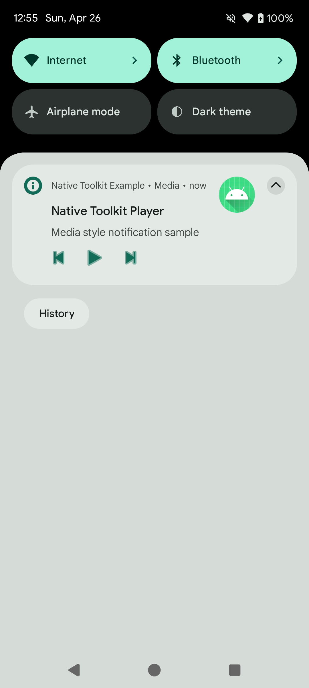
</p>

アクションボタンは `AndroidNotificationPlatformOptions.actions` に設定します（[プラットフォームオプション](#プラットフォームオプション) 参照）。

---

### プラットフォームオプション

`AndroidNotificationPlatformOptions` で Android 固有の動作を設定します。

```kotlin
import android.library.notification.application.model.AndroidNotificationPlatformOptions
import android.library.notification.application.model.AndroidPendingIntentRequest
import android.library.notification.application.model.AndroidNotificationAction

val command = AndroidNotificationCommand(
    content = NotificationContent( /* ... */ ),
    platformOptions = AndroidNotificationPlatformOptions(
        // 通知タップ時に起動するIntent
        contentIntent = AndroidPendingIntentRequest(
            intent = Intent(context, MainActivity::class.java),
            requestCode = 1000
        ),
        // 通知を削除（スワイプ）したときのIntent
        deleteIntent = AndroidPendingIntentRequest(
            intent = Intent(context, MyReceiver::class.java),
            requestCode = 1001,
            type = AndroidPendingIntentType.BROADCAST
        ),
        // フルスクリーン表示用Intent（端末ロック中など）
        fullScreenIntent = AndroidPendingIntentRequest(
            intent = Intent(context, FullScreenActivity::class.java),
            requestCode = 1002,
            type = AndroidPendingIntentType.ACTIVITY
        ),
        // アクションボタン
        actions = listOf(
            AndroidNotificationAction(
                title = "承認",
                pendingIntent = AndroidPendingIntentRequest(
                    intent = Intent(context, ActionReceiver::class.java).apply {
                        action = "ACTION_ACCEPT"
                    },
                    requestCode = 2000,
                    type = AndroidPendingIntentType.BROADCAST
                ),
                iconResId = android.R.drawable.ic_menu_call
            )
        )
    )
)
```

---

### カスタムビュースタイル

独自レイアウトで通知を表示します。`RemoteViewAction` を使ってビューの内容とクリックイベントを設定します。

#### DecoratedCustomView

```kotlin
import android.library.notification.application.model.AndroidNotificationCustomViewPlatformOptions
import android.library.notification.application.model.RemoteViewAction
import android.library.notification.domain.model.NotificationCustomViewStyleData

val command = AndroidNotificationCommand(
    content = NotificationContent(
        id = 1007,
        title = "タイトル",
        message = "本文",
        channel = channel,
        style = NotificationStyle.DecoratedCustomView(
            customView = NotificationCustomViewStyleData(
                layoutResId = R.layout.notification_custom,       // 通常表示
                bigLayoutResId = R.layout.notification_custom_big // 展開表示（省略可）
            )
        )
    ),
    platformOptions = AndroidNotificationPlatformOptions(
        customViewOptions = AndroidNotificationCustomViewPlatformOptions(
            viewActions = listOf(
                // テキストをセット
                RemoteViewAction.SetText(R.id.notification_title, "カスタムタイトル"),
                RemoteViewAction.SetText(R.id.notification_message, "カスタム本文"),
                // 画像をセット
                RemoteViewAction.SetImage(R.id.notification_icon, R.mipmap.ic_launcher),
                // ボタンにクリックイベントをセット
                RemoteViewAction.SetClickIntent(
                    viewId = R.id.notification_btn_dismiss,
                    pendingIntent = AndroidPendingIntentRequest(
                        intent = Intent(context, ActionReceiver::class.java).apply {
                            action = "ACTION_DISMISS"
                        },
                        requestCode = 2100,
                        type = AndroidPendingIntentType.BROADCAST
                    )
                )
            )
        )
    )
)

useCases.show(command)
```

<p align="center">
    
</p>

> **注意:** `RemoteViews` の制約上、ボタンには `Button` クラスではなく `LinearLayout` + `TextView` を使用してください。クリックイベントは `setOnClickPendingIntent` で設定されます。

#### DecoratedMediaCustomView

Media スタイルと組み合わせてカスタムビューを表示します。

```kotlin
style = NotificationStyle.DecoratedMediaCustomView(
    customView = NotificationCustomViewStyleData(
        layoutResId = R.layout.notification_media_custom
    ),
    compactActionIndices = listOf(0, 1, 2)
)
```

<p align="center">
    
</p>

`customViewOptions` の使い方は `DecoratedCustomView` と同じです。

---

### グループ通知

複数の通知をグループにまとめて表示します。

```kotlin
val GROUP_KEY = "my_group_key"

// 子通知 1
val child1 = AndroidNotificationCommand(
    content = NotificationContent(
        id = 1101,
        title = "通知 1",
        message = "グループ子通知 #1",
        channel = channel,
        groupKey = GROUP_KEY,
        groupAlertBehavior = NotificationCompat.GROUP_ALERT_SUMMARY,
        sortKey = "01"
    )
)

// 子通知 2
val child2 = AndroidNotificationCommand(
    content = NotificationContent(
        id = 1102,
        title = "通知 2",
        message = "グループ子通知 #2",
        channel = channel,
        groupKey = GROUP_KEY,
        groupAlertBehavior = NotificationCompat.GROUP_ALERT_SUMMARY,
        sortKey = "02"
    )
)

// サマリー通知（グループヘッダー）
val summary = AndroidNotificationCommand(
    content = NotificationContent(
        id = 1100,
        title = "グループサマリー",
        message = "2 件の通知",
        channel = channel,
        groupKey = GROUP_KEY,
        isGroupSummary = true,
        groupAlertBehavior = NotificationCompat.GROUP_ALERT_SUMMARY,
        sortKey = "00"
    )
)

useCases.show(child1)
useCases.show(child2)
useCases.show(summary)
```

<p align="center">
    
</p>

> **ポイント:** `groupAlertBehavior = GROUP_ALERT_SUMMARY` に設定すると、サマリーのみが音・バイブを鳴らし、子通知はサイレントになります。

---

### インタラクション

#### アクションボタン（BroadcastReceiver）

通知にボタンを追加し、タップを BroadcastReceiver で受け取ります。

```kotlin
class NotificationActionReceiver : BroadcastReceiver() {
    override fun onReceive(context: Context, intent: Intent?) {
        val actionId = intent?.getStringExtra("extra_action_id") ?: return
        // アクションの処理
    }
}
```

```kotlin
// アクションボタン付き通知
platformOptions = AndroidNotificationPlatformOptions(
    actions = listOf(
        AndroidNotificationAction(
            title = "承認",
            pendingIntent = AndroidPendingIntentRequest(
                intent = Intent(context, NotificationActionReceiver::class.java).apply {
                    putExtra("extra_action_id", "accept")
                },
                requestCode = 5000,
                type = AndroidPendingIntentType.BROADCAST
            )
        ),
        AndroidNotificationAction(
            title = "拒否",
            pendingIntent = AndroidPendingIntentRequest(
                intent = Intent(context, NotificationActionReceiver::class.java).apply {
                    putExtra("extra_action_id", "decline")
                },
                requestCode = 5001,
                type = AndroidPendingIntentType.BROADCAST
            )
        )
    )
)
```

<p align="center">
    
</p>

#### DeleteIntent（削除イベント）

通知をスワイプで削除したときのコールバックです。

```kotlin
platformOptions = AndroidNotificationPlatformOptions(
    deleteIntent = AndroidPendingIntentRequest(
        intent = Intent(context, NotificationDeleteReceiver::class.java).apply {
            action = "ACTION_NOTIFICATION_DELETED"
        },
        requestCode = 5100,
        type = AndroidPendingIntentType.BROADCAST
    )
)
```

#### FullScreenIntent（フルスクリーン）

端末ロック中や画面オフ時に全画面で起動します（アラーム・着信通知など）。

```kotlin
// 高優先度チャンネルと category の設定が必要
val content = NotificationContent(
    id = 1111,
    title = "アラーム",
    message = "起床時刻です",
    channel = highPriorityChannel,
    category = NotificationCompat.CATEGORY_ALARM,
    priority = NotificationCompat.PRIORITY_HIGH
)

platformOptions = AndroidNotificationPlatformOptions(
    fullScreenIntent = AndroidPendingIntentRequest(
        intent = Intent(context, AlarmActivity::class.java),
        requestCode = 5200,
        type = AndroidPendingIntentType.ACTIVITY,
        mutable = true
    )
)
```

<p align="center">
    
</p>

> **注意:** 端末の状態・Android ポリシーによっては、フルスクリーンではなく heads-up 通知として表示される場合があります。

---

### 進捗通知

ダウンロードや処理の進捗をプログレスバーで表示します。

```kotlin
import android.library.notification.domain.model.NotificationProgress

// 進捗バー（確定）
val command = AndroidNotificationCommand(
    content = NotificationContent(
        id = 1009,
        title = "ダウンロード中",
        message = "50% 完了",
        channel = channel,
        ongoing = true,
        autoCancel = false,
        progress = NotificationProgress(
            max = 100,
            current = 50,
            indeterminate = false
        )
    )
)

useCases.show(command)

// 不定長プログレスバー
val indeterminate = NotificationProgress(max = 0, current = 0, indeterminate = true)

// 完了時（バーを非表示にして通常通知に戻す）
val complete = NotificationContent(
    id = 1009,
    ongoing = false,
    autoCancel = true,
    progress = NotificationProgress(max = 100, current = 100, indeterminate = false),
    /* ... */
)
```

<p align="center">
    
</p>

---

### フォアグラウンドサービス通知

#### Progress FGS（長時間バックグラウンド処理）

`ProgressForegroundNotifications` を使ってフォアグラウンドサービスと連携した進捗通知を表示します。

```kotlin
import android.library.notification.presentation.progress.ProgressForegroundNotifications

// フォアグラウンドサービスを開始（通知表示も兼ねる）
ProgressForegroundNotifications.start(context, progressCommand)

// 進捗を更新
ProgressForegroundNotifications.update(context, updatedProgressCommand)

// 完了（サービスを停止して通常通知に降格）
ProgressForegroundNotifications.complete(context, completionCommand)

// 強制停止（通知も削除）
ProgressForegroundNotifications.stop(context)
```

<p align="center">
    
</p>

`AndroidManifest.xml` にサービスを宣言します。

```xml
<service
    android:name="android.library.notification.presentation.progress.ProgressForegroundService"
    android:foregroundServiceType="dataSync"
    android:exported="false" />
```

#### Call Style FGS（通話スタイル）

着信・通話中・スクリーニングの CallStyle 通知をフォアグラウンドサービスで表示します。

```kotlin
import android.library.notification.presentation.call.CallStyleForegroundService
import androidx.core.content.ContextCompat

// 着信通知を開始
ContextCompat.startForegroundService(
    context,
    CallStyleForegroundService.createIncomingStartIntent(context)
)

// 通話中通知に切り替え
ContextCompat.startForegroundService(
    context,
    CallStyleForegroundService.createOngoingStartIntent(context)
)

// 停止
context.startService(CallStyleForegroundService.createStopIntent(context))
```

<p align="center">
    
</p>

`AndroidManifest.xml` にサービスを宣言します。

```xml
<service
    android:name="android.library.notification.presentation.call.CallStyleForegroundService"
    android:foregroundServiceType="specialUse"
    android:exported="false">
    <property
        android:name="android.app.PROPERTY_SPECIAL_USE_FGS_SUBTYPE"
        android:value="call" />
</service>
```

---

### スケジュール通知

指定した時刻に通知を自動表示します。

```kotlin
import android.library.notification.domain.model.NotificationSchedule

val schedule = NotificationSchedule(
    triggerAtMillis = System.currentTimeMillis() + 15_000L, // 15秒後
    exact = true,           // 正確なアラーム（SCHEDULE_EXACT_ALARM が必要）
    allowWhileIdle = true,  // Doze モード中も起動
    persistAcrossBoot = true // 端末再起動後も復元
)

useCases.schedule(command, schedule)
    .onSuccess { /* スケジュール完了 */ }
    .onFailure { /* エラー処理 */ }
```

<p align="center">
    
</p>

#### スケジュールのキャンセル

```kotlin
useCases.cancelScheduled(id = 1010)
useCases.cancelAllScheduled()
```

#### 端末再起動後の復元

`RECEIVE_BOOT_COMPLETED` を使って再起動後にスケジュールを復元します。

```kotlin
// BroadcastReceiver の onReceive 内で呼び出す
useCases.restoreScheduled()
```

`AndroidManifest.xml` に Receiver を宣言します。

```xml
<receiver
    android:name="android.library.notification.data.repository.ScheduledNotificationBootReceiver"
    android:exported="false">
    <intent-filter>
        <action android:name="android.intent.action.BOOT_COMPLETED" />
        <action android:name="android.intent.action.LOCKED_BOOT_COMPLETED" />
        <action android:name="android.intent.action.MY_PACKAGE_REPLACED" />
    </intent-filter>
</receiver>
```

#### スケジュール済み確認

```kotlin
val isScheduled: Boolean = useCases.isScheduled(context, id = 1010)
```

---

## iOS

### IosNotificationManager

`IosNotificationManager` は iOS ローカル通知のすべての操作を提供するシングルトンクラスです。

<p align="center">
    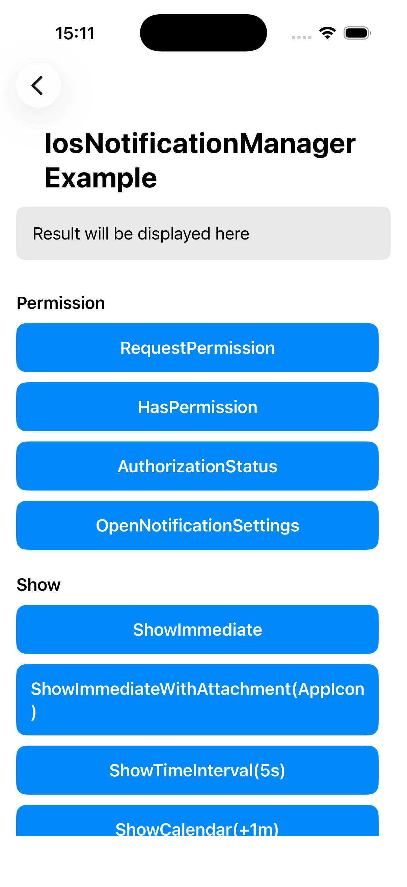
</p>

### セットアップ

アプリ起動時（例: `AppDelegate.application(_:didFinishLaunchingWithOptions:)`）に `setup()` を一度だけ呼び出します。

```swift
import IosLibrary

IosNotificationManager.setup()
```

### パーミッション

#### 通知権限をリクエストする

```swift
IosNotificationManager.shared.requestPermission { isSuccess, errorMessage in
    if isSuccess {
        // 許可された
    } else {
        // 拒否された。設定アプリから手動で有効化が必要
    }
}
```

<p align="center">
    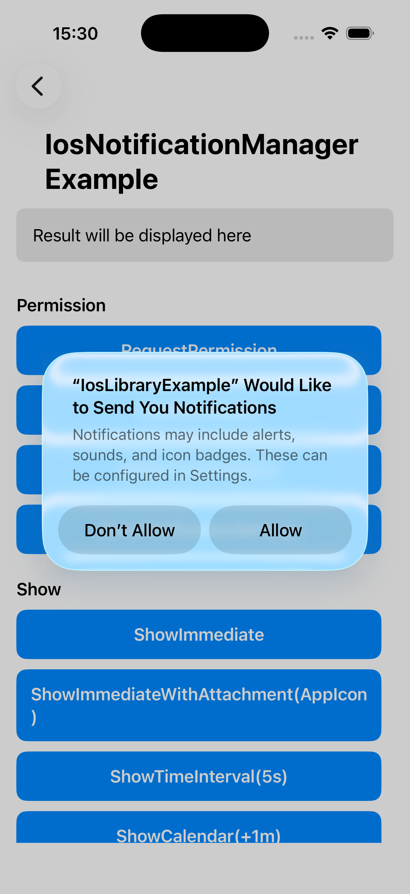
</p>

#### 権限の確認

```swift
IosNotificationManager.shared.hasPermission { hasPermission in
    print(hasPermission) // true / false
}
```

#### 認証ステータスの取得

```swift
IosNotificationManager.shared.authorizationStatus { status in
    // .notDetermined / .denied / .authorized / .provisional / .ephemeral / .unknown
    print(status)
}
```

#### 通知設定を開く

```swift
IosNotificationManager.shared.openNotificationSettings()
```

### 通知の表示

`NotificationContent` を作成して `show()` を呼び出します。

#### 即時表示

```swift
let content = NotificationContent(
    id: "sample-notification",
    title: "Immediate Notification",
    body: "Displayed now",
    categoryIdentifier: "sample-category",
    userInfo: ["source": "IosLibraryExample", "id": "sample-notification"]
)

IosNotificationManager.shared.show(content: content) { isSuccess, errorMessage in
    print(isSuccess, errorMessage ?? "")
}
```

<p align="center">
    
</p>

#### 添付ファイル付き即時表示

Bundle に含めた画像ファイルを添付として通知を表示します。
通知を長押し（展開表示）するとサムネイルが表示されます。

```swift
guard let imageURL = Bundle.main.url(forResource: "app-icon-attachment", withExtension: "png") else { return }

let attachment = NotificationAttachment(identifier: "app-icon", fileURL: imageURL)
let content = NotificationContent(
    id: "sample-notification",
    title: "Immediate Notification with Attachment",
    body: "Displayed with app icon attachment",
    categoryIdentifier: "sample-category",
    userInfo: ["source": "IosLibraryExample", "id": "sample-notification"],
    attachments: [attachment]
)

IosNotificationManager.shared.show(content: content) { isSuccess, errorMessage in
    print(isSuccess, errorMessage ?? "")
}
```

<p align="center">
    
</p>

#### 時間間隔トリガー

```swift
IosNotificationManager.shared.show(
    content: content,
    trigger: .timeInterval(5.0, repeats: false)
) { isSuccess, errorMessage in
    print(isSuccess, errorMessage ?? "")
}
```

#### カレンダートリガー

```swift
var components = DateComponents()
components.hour = 9
components.minute = 0

IosNotificationManager.shared.show(
    content: content,
    trigger: .calendar(components, repeats: true)
) { isSuccess, errorMessage in
    print(isSuccess, errorMessage ?? "")
}
```

#### 位置情報トリガー

位置情報通知は CoreLocation を使用します。`Info.plist` に位置情報の利用説明文を追加してください。

```swift
IosNotificationManager.shared.show(
    content: content,
    trigger: .location(
        identifier: "tokyo-station",
        latitude: 35.6812,
        longitude: 139.7671,
        radius: 100,
        notifyOnEntry: true,
        notifyOnExit: false
    )
) { isSuccess, errorMessage in
    print(isSuccess, errorMessage ?? "")
}
```

### 添付ファイル

`NotificationAttachment` を使って通知に画像・音声・動画を添付できます。
通知を長押し（展開表示）するとサムネイルが表示されます。

```swift
guard let imageURL = Bundle.main.url(forResource: "app-icon-attachment", withExtension: "png") else { return }

let attachment = NotificationAttachment(identifier: "app-icon", fileURL: imageURL)
let content = NotificationContent(
    id: "sample-notification",
    title: "画像付き通知",
    body: "展開して画像を確認してください",
    attachments: [attachment]
)

IosNotificationManager.shared.show(content: content) { isSuccess, errorMessage in
    print(isSuccess, errorMessage ?? "")
}
```

### 通知の更新

保留中の通知の内容やトリガーを更新します。

```swift
let updatedContent = NotificationContent(
    id: "sample-notification",
    title: "更新されたタイトル",
    body: "内容が変わりました"
)

IosNotificationManager.shared.update(
    identifier: "sample-notification",
    content: updatedContent,
    trigger: nil
) { isSuccess, errorMessage in
    print(isSuccess, errorMessage ?? "")
}
```

### 通知のキャンセル / 削除

```swift
// 特定の保留中通知をキャンセル
IosNotificationManager.shared.cancel(identifier: "sample-notification")

// 保留中通知をすべてキャンセル
IosNotificationManager.shared.cancelAll()

// 配信済み通知を通知センターから削除
IosNotificationManager.shared.removeDelivered(identifier: "sample-notification")

// 配信済み通知をすべて削除
IosNotificationManager.shared.removeAllDelivered()
```

### スケジュール通知

特定の ID で将来の通知をスケジュールします。

```swift
let content = NotificationContent(
    id: "scheduled-notification",
    title: "スケジュール通知",
    body: "10 秒後に表示されます"
)

IosNotificationManager.shared.schedule(
    content: content,
    trigger: .timeInterval(10.0, repeats: false),
    identifier: "scheduled-notification"
) { isSuccess, errorMessage in
    print(isSuccess, errorMessage ?? "")
}
```

#### スケジュールのキャンセル

```swift
// 特定のスケジュールをキャンセル
IosNotificationManager.shared.cancelScheduled(identifier: "scheduled-notification")

// すべてのスケジュールをキャンセル
IosNotificationManager.shared.cancelAllScheduled()
```

### クエリ

```swift
// 保留中（未配信）の通知リストを取得
IosNotificationManager.shared.getScheduled { requests in
    requests.forEach { print($0.identifier) }
}

// 配信済み通知リストを取得
IosNotificationManager.shared.getDelivered { notifications in
    notifications.forEach { print($0.identifier) }
}
```

### バッジ

```swift
// バッジ数を設定（0 でクリア）
IosNotificationManager.shared.setBadgeCount(1) { isSuccess, errorMessage in
    print(isSuccess, errorMessage ?? "")
}

IosNotificationManager.shared.setBadgeCount(0) { isSuccess, errorMessage in
    print(isSuccess, errorMessage ?? "")
}
```

### カテゴリとアクション

通知にアクションボタンやテキスト入力を追加します。

#### カテゴリの登録

```swift
let category = NotificationCategory(
    identifier: "sample-category",
    actions: [
        NotificationAction(
            identifier: "open",
            title: "開く",
            options: [.foreground]
        ),
        NotificationAction(
            identifier: "delete",
            title: "削除",
            options: [.destructive]
        )
    ],
    textInputActions: [
        TextInputNotificationAction(
            identifier: "reply",
            title: "返信",
            buttonTitle: "送信",
            textInputPlaceholder: "メッセージを入力"
        )
    ],
    options: [.customDismissAction, .allowAnnouncement]
)

IosNotificationManager.shared.registerCategory(category)
```

#### カテゴリを通知に紐づける

`NotificationContent` の `categoryIdentifier` にカテゴリ ID を指定します。
通知を長押しするとアクションボタンが表示されます。

```swift
let content = NotificationContent(
    id: "sample-notification",
    title: "アクション付き通知",
    body: "長押ししてアクションを確認",
    categoryIdentifier: "sample-category"
)
```

#### カテゴリの削除

```swift
IosNotificationManager.shared.removeCategory(identifier: "sample-category")
```

<p align="center">
    
</p>

#### アクション受信コールバック

```swift
// アクションボタンのタップを受け取る
IosNotificationManager.shared.onActionReceived = { notificationId, actionId, userInfo in
    print("notification: \(notificationId), action: \(actionId)")
}

// テキスト入力アクションの送信を受け取る
IosNotificationManager.shared.onTextInputActionReceived = { notificationId, actionId, userText, userInfo in
    print("notification: \(notificationId), action: \(actionId), text: \(userText)")
}
```

---

## Windows

**パッケージ済み**（MSIX）アプリと**パッケージ無し**（通常の Win32）アプリの両方に対応したトースト通知です。Windows 11 以降が必要です。Windows ライブラリは、1 つの実装を 2 つの公開 API から提供します。サンプルアプリは C++ API を使用しています。

| API | 名前 | ヘッダー | NuGet パッケージ |
|---|---|---|---|
| C++ API | `NativeToolkit::Notification` | `<NativeToolkit/Notification.h>` | `NativeToolkit` |
| C ABI | `ntk_notification_*` | `<NativeToolkitC/Notification.h>` | `NativeToolkit.CApi` |

### NativeToolkit::Notification

- `Notification::Manager` はプロセスの通知サービスです。Windows はプロセスごとに 1 つの活性化ハンドラーしか登録しないため、`Manager` は同時に 1 つだけです。2 つ目の `Create` は `ErrorCode::NotSupported` で失敗します。
- すべての操作は同期で、呼び出したスレッドをブロックします。
- 戻り値は `Notification::Result<T>` です。`has_value()` で成否を判定し、失敗時の `error()` は `Notification::ErrorCode` と OS の生の値 `systemCode` を持ちます。
- `Manager::Create` は呼び出したスレッドを MTA（マルチスレッドアパートメント）にします。MTA になったスレッドでは、STA を必要とする `Clipboard::Session` を作れません。同じスレッドで両方を使う場合は、先にそのスレッドを STA で初期化してください。
- パッケージ無しのアプリでは、`SetBadge`、`RemoveById`、`GetAll` が `ErrorCode::NotSupported` になります。これらはプラットフォームがパッケージ済みアプリにのみ提供している機能です。

---

### セットアップ

#### Package.appxmanifest（パッケージ済みアプリ）

トーストの活性化を有効にするため、`<Application>` 要素の中に次の拡張を追加します。

```xml
<Extensions>
  <com:Extension Category="windows.comServer">
    <com:ComServer>
      <com:ExeServer Executable="YourApp.exe"
                     DisplayName="Native Toolkit Notification Activator"
                     Arguments="----AppNotificationActivated:">
        <com:Class Id="5F6A1B27-7C0B-4E1B-9070-6F1966502BAF"
                   DisplayName="Toast Activator"/>
      </com:ExeServer>
    </com:ComServer>
  </com:Extension>
  <desktop:Extension Category="windows.toastNotificationActivation">
    <desktop:ToastNotificationActivation
        ToastActivatorCLSID="5F6A1B27-7C0B-4E1B-9070-6F1966502BAF"/>
  </desktop:Extension>
</Extensions>
```

CLSID は、ご自身のマニフェストに登録したものに置き換えてください。サンプルアプリは `5F6A1B27-7C0B-4E1B-9070-6F1966502BAF` を使用しています。

#### Manager の作成 パッケージ済みアプリ

```cpp
#include <NativeToolkit/Notification.h>

#include <optional>

namespace Notification = NativeToolkit::Notification;

// このプロセスで唯一の Manager です。ムーブ専用なので、
// 作成した画面より長く生きる場所に置きます。
std::optional<Notification::Manager> g_manager;

void OnNotificationInvoked(Notification::ActivationArgs const& args)
{
    // OS が選んだスレッドで呼ばれます。UI を触る前に UI スレッドへ移してください。
    // 「活性化ハンドラー」を参照してください。
}

Notification::ManagerOptions options;
// 利用者が通知を操作したときに呼ばれます。空のままにすると活性化は捨てられます。
options.onInvoked = &OnNotificationInvoked;
// パッケージ済み（MSIX）アプリでは、表示名もアイコンも不要です。
options.isPackaged = true;

auto created = Notification::Manager::Create(options);
if (created.has_value())
{
    g_manager.emplace(std::move(created).value());
}
else
{
    // NotSupported: このプロセスにはすでに Manager があります。
    const Notification::ErrorCode code = created.error().code;
}
```

#### Manager の作成 パッケージ無しアプリ

パッケージ識別子を持たないアプリでは、先に Windows App SDK のランタイムを読み込み、通知を使う間そのトークンを保持し続けます。

```cpp
#include <NativeToolkit/Notification.h>

namespace Notification = NativeToolkit::Notification;

// 手順 1: Windows App SDK のランタイムを読み込みます。0x00010007 は 1.7 です。
auto runtime = Notification::Runtime::Initialize(Notification::RuntimeVersion{ 0x00010007 });
if (!runtime.has_value())
{
    // HResultFailure: systemCode にブートストラッパーの HRESULT が入ります。
    return;
}
// 破棄するとランタイムが下りるため、値を保持し続けます。
Notification::Runtime held = std::move(runtime).value();

// 手順 2: 表示名とアイコン（どちらも必須）を指定して Manager を作ります。
Notification::ManagerOptions options;
options.onInvoked = &OnNotificationInvoked;
options.isPackaged = false;
options.displayName = L"MyApp";
options.iconUri = L"C:\\path\\to\\app-icon.png";

auto created = Notification::Manager::Create(options);
```

#### 終了

```cpp
// 登録を解除し、活性化を止めます。2 回呼んでも何も起きません。
g_manager->Close();
g_manager.reset();
```

---

### 初期化 / 設定

#### 通知設定の取得

```cpp
const auto setting = g_manager->GetSetting();
if (setting.has_value())
{
    switch (setting.value())
    {
    case Notification::NotificationSetting::Enabled:                break; // 0
    case Notification::NotificationSetting::DisabledForApplication: break; // 1
    case Notification::NotificationSetting::DisabledForUser:        break; // 2
    case Notification::NotificationSetting::DisabledByGroupPolicy:  break; // 3
    case Notification::NotificationSetting::DisabledByManifest:     break; // 4
    }
}
```

#### 通知設定を開く

Windows の通知設定の画面を開きます。`GetSetting` が `Enabled` 以外を返したときに、利用者に通知を有効化してもらうために使用します。

```cpp
const auto result = g_manager->OpenSettings();
```

---

### 通知の表示

トーストに載せられる内容はすべて `NotificationContent` にあります。サンプルはタイトル・本文・タグを入れ、そこから 1 つずつ足していきます。

```cpp
Notification::NotificationContent MakeContent(std::wstring title, std::wstring body, std::wstring tag)
{
    Notification::NotificationContent content;
    content.title = std::move(title);
    content.body = std::move(body);
    content.tag = std::move(tag);
    return content;
}
```

#### 基本

```cpp
const auto content = MakeContent(L"Hello", L"Basic toast", L"sample");
const auto result = g_manager->Show(content);
```

<p align="center">
    
</p>

#### ボタン付き

ボタンは自身の引数を持ち、押されたときに活性化ハンドラーへ届きます。ボタンは最大 5 個です。

```cpp
Notification::Button MakeButton(std::wstring label, std::wstring action)
{
    Notification::Button button;
    button.label = std::move(label);
    // キーは任意です。ActivationArgs::values で戻ってきます。
    button.args = Notification::ArgumentPairs{ { L"action", std::move(action) } };
    return button;
}

auto content = MakeContent(L"Actionable", L"Toast with buttons", L"sample");
content.buttons = { MakeButton(L"Open", L"open"), MakeButton(L"Dismiss", L"dismiss") };
const auto result = g_manager->Show(content);
```

<p align="center">
    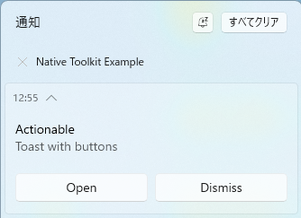
</p>

#### 画像付き

```cpp
auto content = MakeContent(L"With Image", L"Toast with hero image", L"sample");
// パッケージ済みアプリでは ms-appx:/// が使えます。file:/// や http(s):// も使えます。
content.heroImage = L"ms-appx:///Assets/StoreLogo.png";
const auto result = g_manager->Show(content);
```

<p align="center">
    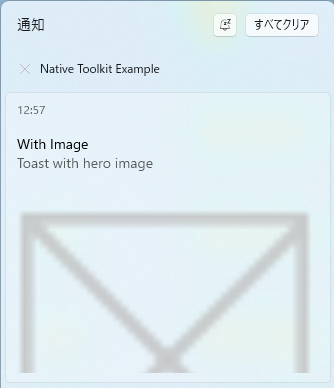
</p>

#### 入力付き

利用者が入力・選択した値は、フィールドの id をキーとして活性化ハンドラーに届きます。

```cpp
auto content = MakeContent(L"Reply", L"Type a reply and pick an option", L"sample");

Notification::TextInput reply;
reply.id = L"reply";
reply.placeholder = L"Type a message";
content.textInputs = { reply };

Notification::ComboInput status;
status.id = L"opt";
status.title = L"Status";
// items との突き合わせは行いません。存在しない id を指定すると未選択になります。
status.defaultSelection = L"busy";
status.items = { { L"free", L"Free" }, { L"busy", L"Busy" } };
content.comboInputs = { status };

content.buttons = { MakeButton(L"Send", L"send") };
const auto result = g_manager->Show(content);
```

<p align="center">
    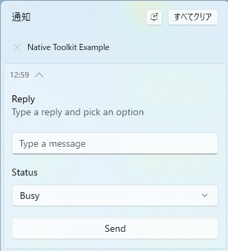
</p>

#### 進捗バー付き

進捗バーを表示します。あとから同じタグで `UpdateProgress` を呼ぶと更新できます。

```cpp
auto content = MakeContent(L"Downloading", L"In progress", L"progress-sample");

Notification::ProgressSpec progress;
progress.title = L"Toolkit.zip";
// 0.0 〜 1.0 です。ここでは範囲の検査はしません。
progress.value = 0.3;
progress.valueStr = L"30%";
progress.status = L"Downloading";
content.progress = progress;

const auto result = g_manager->Show(content);
```

<p align="center">
    
</p>

#### 有効期限付き

指定した時間が過ぎると、通知は通知センターから消えます。配信からの相対時間で、`Schedule` では無視されます。

```cpp
auto content = MakeContent(L"Expires", L"This toast expires in 10 seconds", L"sample");
content.expiration = std::chrono::seconds(10);
const auto result = g_manager->Show(content);
```

#### サウンド付き

```cpp
auto content = MakeContent(L"Reminder", L"Toast with reminder sound", L"sample");

Notification::AudioSpec audio;
// Event: 名前付きのシステム音。Mute: 無音。Uri: audio.uri の音。
audio.kind = Notification::AudioKind::Event;
audio.eventName = L"reminder";
content.audio = audio;

const auto result = g_manager->Show(content);
```

---

### スケジュール通知

`Schedule` は絶対時刻を `std::chrono::system_clock::time_point` で受け取ります。予約では `expiration` と `progress` は無視されます。

```cpp
#include <chrono>

const auto when = std::chrono::system_clock::now() + std::chrono::seconds(60);
const auto content = MakeContent(L"Scheduled", L"Fires in ~1 minute", L"scheduled");
const auto result = g_manager->Schedule(content, when);
```

> **注意:** 5 分以上過去の時刻を指定した通知は、配信時刻にアプリが起動していなかった場合、OS に破棄されることがあります。

#### スケジュールのキャンセル

```cpp
// 予約した通知のタグとグループを指定します。
const auto result = g_manager->CancelScheduled(L"scheduled", L"");
```

---

### 進捗の更新

進捗バーを表示している通知を更新します。`ErrorCode::ProgressNotFound` は、該当する通知が通知センターに無いか、シーケンス番号が古いことを意味します。

```cpp
Notification::ProgressUpdate update;
// Show に渡したタグ・グループと一致させます。
update.tag = L"progress-sample";
update.group = L"";
update.value = 0.6;
update.valueString = L"60%";
update.status = L"Downloading";
// 呼び出し側が増やします。逆戻りした更新は OS が捨てます。
update.sequenceNumber = seq++;

const auto result = g_manager->UpdateProgress(update);
if (!result.has_value() && result.error().code == Notification::ErrorCode::ProgressNotFound)
{
    // 更新対象がありません。先に進捗付きの通知を表示してください。
}
```

<p align="center">
    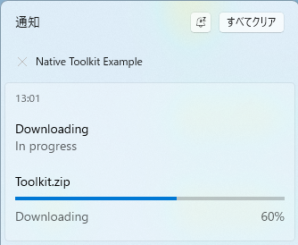
</p>

---

### バッジ

タスクバーのアイコンにバッジを付けます。パッケージ済みアプリ専用で、パッケージ無しのアプリでは `ErrorCode::NotSupported` になります。

```cpp
g_manager->SetBadge(5);   // 数字のバッジ
g_manager->SetBadge(-1);  // グリフ: alert
g_manager->SetBadge(0);   // バッジを消す
```

**グリフの値:** `-1`=alert、`-2`=activity、`-3`=newMessage、`-4`=available、`-5`=busy、`-6`=away。-6 より小さい値は `ErrorCode::InvalidParameter` です。

<p align="center">
    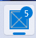
</p>

---

### 削除 / クエリ

#### 全通知の取得

通知センターにあるものを一覧します。パッケージ済みアプリ専用です。

```cpp
const auto result = g_manager->GetAll();
if (result.has_value())
{
    for (const Notification::NotificationRef& notification : result.value())
    {
        const uint32_t id = notification.id;
        const std::wstring& tag = notification.tag;
        const std::wstring& group = notification.group;
    }
}
```

#### ID 指定削除

`GetAll` が返した id を指定して 1 件だけ削除します。パッケージ済みアプリ専用です。

```cpp
const auto result = g_manager->RemoveById(notificationId);
```

#### タグ指定削除

```cpp
const auto result = g_manager->RemoveByTag(L"sample", L"");
```

#### 全削除

```cpp
const auto result = g_manager->RemoveAll();
```

---

### 活性化ハンドラー

ハンドラーは OS が活性化を配信したスレッドで動き、呼び出し側のスレッドへは移されません。`ActivationArgs::values` には、押されたボタンの引数と、すべてのテキスト欄・選択欄の内容が id をキーとしてまとめて入ります。`rawArguments` は手を加えていない引数の文字列です。

パッケージ無しのアプリがトーストのクリックで起動した場合、その最初の活性化は `Manager::Create` の中から、呼び出したスレッドで配信されます。ハンドラーは、自分が属する Manager がすでに存在していると想定してはいけません。

サンプルアプリでは、ハンドラーを作成時に 1 回だけ登録し、そのときに画面に出ているページへ転送しています。

```cpp
namespace
{
    std::function<void(winrt::hstring)> g_notificationHandler;

    void OnNotificationInvoked(Notification::ActivationArgs const& args)
    {
        if (g_notificationHandler)
        {
            g_notificationHandler(winrt::hstring{ args.rawArguments });
        }
    }
}

// OnNavigatedTo で登録し、UI スレッドへ移します。
auto weakText = winrt::make_weak(ResultTextBlock());
auto dq = DispatcherQueue();
g_notificationHandler = [weakText, dq](winrt::hstring args)
{
    dq.TryEnqueue([weakText, args]()
    {
        if (auto text = weakText.get())
            text.Text(L"\U0001F514 Notification invoked:\n" + args);
    });
};

// OnNavigatedFrom で解除します。
g_notificationHandler = nullptr;
```

---

### エラーコード

`Notification::ErrorCode`（`NativeToolkit::NotificationError`）です。同じ数値が C ABI の `NTK_NOTIFICATION_ERROR_*` になります。

| コード | 名前 | 説明 |
|---|---|---|
| 0 | `None` | 成功 |
| 1 | `NotInitialized` | `Create` の前、または `Close` の後に使用しました |
| 2 | `Disabled` | このアプリまたは利用者に対して通知が無効です |
| 3 | `InvalidPayload` | 予約済みで返りません。1.x の C ABI で JSON が解析できなかった場合の値です |
| 4 | `ProgressNotFound` | 更新対象の通知が無いか、シーケンス番号が古いです |
| 5 | `HResultFailure` | 登録、ショートカット、またはランタイムの読み込みに失敗しました |
| 6 | `BadgeFailed` | バッジの更新に失敗しました |
| 7 | `InvalidParameter` | 引数が不正です（-6 より小さいバッジ値など） |
| 8 | `NotSupported` | このアプリの種類では使用できません（パッケージ無しでの `SetBadge` / `RemoveById` / `GetAll`）、または 2 つ目の Manager です |

### C ABI

- C から、そして C の DLL を呼べる言語から同じ通知を使うための API です。
- 内容は構造体ではなくハンドルで組み立てます。セッターを 1 つずつ呼び、`ntk_notification_content_free` で解放します。
- 登録は `user_data` と `release` を伴います。`release` は登録ごとに必ず 1 回呼ばれます（登録した関数が失敗したときも呼ばれます）。バインディングが確保したものは、ここで解放します。
- ハンドルは `ntk_notification_manager_free`、`ntk_notification_runtime_free`、`ntk_notification_list_free` で解放します。
- すべての関数はどのスレッドからでも呼べます。活性化は OS が選んだスレッドで届き、そこで受け取るものはその呼び出しの間だけ有効です。

#### ランタイム・マネージャー・活性化

```c
#include <string.h>
#include <NativeToolkitC/Common.h>
#include <NativeToolkitC/Notification.h>

static void NTK_CALL on_invoked(void* user_data, const ntk_notification_activation* activation)
{
    /* OS が選んだスレッドで呼ばれます。ここで読んだものは呼び出しの外では使えません。 */
    size_t size = 0;
    const char* raw = ntk_notification_activation_raw_arguments(activation, &size);
    (void)raw; (void)user_data;

    /* 押されたボタンの引数と利用者の入力が、id をキーとしてまとまっています。 */
    size_t count = ntk_notification_activation_value_count(activation);
    size_t i;
    for (i = 0; i < count; ++i) {
        const char* key = ntk_notification_activation_key_at(activation, i, NULL);
        const char* value = ntk_notification_activation_value_at(activation, i, NULL);
        (void)key; (void)value;
    }
}

static void NTK_CALL release_user_data(void* user_data)
{
    /* 登録した関数が失敗したときも含め、ちょうど 1 回呼ばれます。 */
    (void)user_data;
}

/* パッケージ識別子を持たないアプリは、先に Windows App SDK のランタイムを
   読み込み、通知を使う間ハンドルを保持します。0x00010007 は 1.7 です。
   パッケージ済みアプリでは不要です。 */
ntk_notification_runtime* runtime = NULL;
ntk_notification_error error = ntk_notification_runtime_initialize(0x00010007u, &runtime);
if (error != NTK_NOTIFICATION_ERROR_NONE) {
    return;
}

ntk_notification_manager_options options;
memset(&options, 0, sizeof(options));
options.struct_size = (uint32_t)sizeof(options);
options.on_invoked = &on_invoked;
options.user_data = NULL;
options.release = &release_user_data;
options.is_unpackaged = 1;                 /* パッケージ済み（MSIX）アプリでは 0 */
options.display_name = "MyApp";            /* パッケージ無しのときは必須 */
options.icon_uri = "C:\\path\\to\\app-icon.png";

ntk_notification_manager* manager = NULL;
error = ntk_notification_manager_create(&options, &manager);
if (error != NTK_NOTIFICATION_ERROR_NONE) {
    ntk_notification_runtime_free(runtime);
    return;
}

/* あとからハンドラーを差し替える場合。前の登録の release は、その登録で
   走っている活性化がすべて戻ってから呼ばれます。 */
error = ntk_notification_manager_set_invoked_handler(manager, &on_invoked, NULL, &release_user_data);

/* 終了時は close → マネージャーの解放 → ランタイムの解放の順です。 */
ntk_notification_manager_close(manager);
ntk_notification_manager_free(manager);
ntk_notification_runtime_free(runtime);
```

#### 内容の組み立て・表示・予約

OS が必須とするもの以外、セッターはすべて任意です。`add_button` と `add_combo` は追加したものの添字を返し、引数や項目のセッターはその添字を指定します。

```c
#include <NativeToolkitC/Common.h>
#include <NativeToolkitC/Notification.h>

ntk_notification_content* content = NULL;
if (ntk_notification_content_create(&content) != NTK_NOTIFICATION_ERROR_NONE) {
    return;
}

/* 文言と識別子です。すべて UTF-8 です。 */
ntk_notification_content_set_title(content, "Hello");
ntk_notification_content_set_body(content, "Basic toast");
ntk_notification_content_set_tag(content, "sample");
ntk_notification_content_set_group(content, "");
ntk_notification_content_set_attribution(content, "native-toolkit");
ntk_notification_content_set_scenario(content, NTK_NOTIFICATION_SCENARIO_DEFAULT);
ntk_notification_content_set_duration(content, NTK_NOTIFICATION_DURATION_SHORT);

/* 画像です。 */
ntk_notification_content_set_hero_image(content, "ms-appx:///Assets/StoreLogo.png");
ntk_notification_content_set_inline_image(content, NULL);   /* NULL で取り消し */
ntk_notification_content_set_app_logo(content, "ms-appx:///Assets/StoreLogo.png",
                                      NTK_NOTIFICATION_LOGO_CROP_CIRCLE);

/* 音です。名前付きのシステム音で、繰り返しはしません。 */
ntk_notification_content_set_audio(content, NTK_NOTIFICATION_AUDIO_KIND_EVENT,
                                   "reminder", NULL, 0);

/* ボタンです。with_arguments を 0 以外にすると、引数の一覧が用意されます。 */
size_t button = 0;
ntk_notification_content_add_button(content, "Open", NULL, 1, &button);
ntk_notification_content_add_button_argument(content, button, "action", "open");

/* テキスト欄と選択欄です。 */
ntk_notification_content_add_text_input(content, "reply", "Type a message", NULL);

size_t combo = 0;
ntk_notification_content_add_combo(content, "opt", "Status", "busy", &combo);
ntk_notification_content_add_combo_item(content, combo, "free", "Free");
ntk_notification_content_add_combo_item(content, combo, "busy", "Busy");

/* 進捗バーと時刻です。どちらも予約では無視されます。 */
ntk_notification_content_set_progress(content, "Toolkit.zip", 0.3, "30%", "Downloading");
ntk_notification_content_set_expiration(content, 10);            /* 配信からの秒数 */
ntk_notification_content_set_expires_on_reboot(content, 0);      /* パッケージ済みアプリのみ */
ntk_notification_content_set_timestamp(content, 1758585600000);  /* Unix ミリ秒 */

/* いま表示する場合。 */
ntk_notification_error error = ntk_notification_show(manager, content);

/* 絶対時刻を指定して予約する場合。時刻は Unix ミリ秒です。 */
error = ntk_notification_schedule(manager, content, 1758585660000);

ntk_notification_content_free(content);

/* 予約した通知は、タグとグループで取り消します。 */
error = ntk_notification_cancel_scheduled(manager, "scheduled", "");
```

#### 進捗・バッジ・OS の設定

```c
#include <string.h>
#include <NativeToolkitC/Common.h>
#include <NativeToolkitC/Notification.h>

/* 進捗バーを表示している通知を更新します。 */
ntk_notification_progress_update update;
memset(&update, 0, sizeof(update));
update.struct_size = (uint32_t)sizeof(update);
update.tag = "progress-sample";      /* ntk_notification_show に渡したもの */
update.group = "";
update.value = 0.6;
update.value_string = "60%";
update.status = "Downloading";
update.sequence_number = 2;          /* 呼び出し側が増やします */

ntk_notification_error error = ntk_notification_update_progress(manager, &update);
if (error == NTK_NOTIFICATION_ERROR_PROGRESS_NOT_FOUND) {
    /* 更新対象が無いか、シーケンス番号が古いです。 */
}

/* タスクバーのアイコンのバッジです。パッケージ済みアプリ専用で、それ以外は
   NOT_SUPPORTED です。5 は数字、-1 は alert のグリフ、0 は消去です。 */
error = ntk_notification_set_badge(manager, 5);

/* OS の設定の状態と、それを変える画面です。 */
ntk_notification_setting setting = NTK_NOTIFICATION_SETTING_ENABLED;
error = ntk_notification_get_setting(manager, &setting);
if (setting != NTK_NOTIFICATION_SETTING_ENABLED) {
    error = ntk_notification_open_settings(manager);
}
```

#### 一覧と削除

```c
#include <NativeToolkitC/Common.h>
#include <NativeToolkitC/Notification.h>

/* 通知センターにあるものです。パッケージ済みアプリ専用です。 */
ntk_notification_list* list = NULL;
ntk_notification_error error = ntk_notification_get_all(manager, &list);
if (error == NTK_NOTIFICATION_ERROR_NONE) {
    size_t count = ntk_notification_list_count(list);
    size_t i;
    for (i = 0; i < count; ++i) {
        uint32_t id = ntk_notification_list_id_at(list, i);
        const char* tag = ntk_notification_list_tag_at(list, i, NULL);
        const char* group = ntk_notification_list_group_at(list, i, NULL);
        (void)id; (void)tag; (void)group;
    }
    /* 上のポインターは、この呼び出しまで有効です。 */
    ntk_notification_list_free(list);
}

/* 削除は、get_all が返した id（パッケージ済みアプリ専用）、タグとグループ、
   またはこのアプリが出したものすべて、の 3 通りです。 */
error = ntk_notification_remove_by_id(manager, 1u);
error = ntk_notification_remove_by_tag(manager, "sample", "");
error = ntk_notification_remove_all(manager);
```

| C++ API | C ABI |
|---|---|
| `Runtime::Initialize` / デストラクター | `ntk_notification_runtime_initialize` / `ntk_notification_runtime_free` |
| `Manager::Create` | `ntk_notification_manager_create` |
| `Manager::SetInvokedHandler` | `ntk_notification_manager_set_invoked_handler` |
| `Manager::Close` | `ntk_notification_manager_close` / `ntk_notification_manager_free` |
| `NotificationContent` | `ntk_notification_content_create` と 22 個のセッター |
| `ActivationArgs` | `ntk_notification_activation_raw_arguments` / `_value_count` / `_key_at` / `_value_at` |
| `Manager::Show` | `ntk_notification_show` |
| `Manager::Schedule` | `ntk_notification_schedule`（時刻は Unix ミリ秒） |
| `Manager::CancelScheduled` | `ntk_notification_cancel_scheduled` |
| `Manager::UpdateProgress` | `ntk_notification_update_progress` |
| `Manager::SetBadge` | `ntk_notification_set_badge` |
| `Manager::GetAll` | `ntk_notification_get_all` と `ntk_notification_list_*` |
| `Manager::RemoveById` / `RemoveByTag` / `RemoveAll` | `ntk_notification_remove_by_id` / `_by_tag` / `_all` |
| `Manager::GetSetting` | `ntk_notification_get_setting` |
| `Manager::OpenSettings` | `ntk_notification_open_settings` |

---

## macOS

### MacNotificationManager

`MacNotificationManager` は、macOS のローカル通知操作をすべて提供するシングルトンクラスです。

**要件:** macOS 15 以上。それ以前の OS バージョンでの呼び出しは `unsupportedOS`（エラーコード 1001）を返します。

**スレッド安全性:** 公開 API はどのスレッドからでも呼び出せます。すべての completion コールバックは **メインキュー** で実行されます。

<p align="center">
    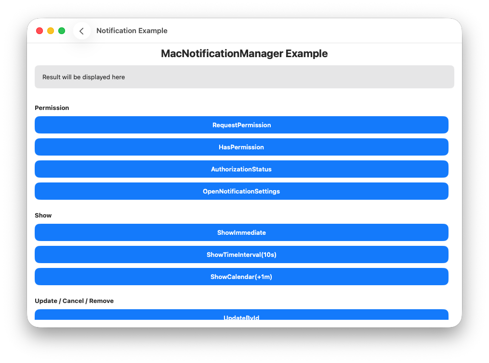
</p>

### セットアップ

アプリ起動時（例: `applicationDidFinishLaunching`）に一度だけ `setup()` を呼び出します。アクション受信コールバックはここで登録します。

```swift
import MacLibrary

MacNotificationManager.shared.setup()

// アクションボタンのタップを受信
MacNotificationManager.shared.setActionReceivedHandler { notificationId, actionId, userInfoJson in
    print("アクション受信: \(notificationId), \(actionId)")
}

// テキスト入力アクションの送信を受信
MacNotificationManager.shared.setTextInputActionReceivedHandler { notificationId, actionId, userText, userInfoJson in
    print("テキスト入力受信: \(userText)")
}
```

### パーミッション

#### 権限のリクエスト

```swift
MacNotificationManager.shared.requestPermission { result in
    // メインキューで実行
    switch result {
    case .success:
        print("通知権限が許可されました")
    case .failure(let error):
        if error.errorCode == 1002 || error.errorCode == 1003 {
            // 拒否済み - 設定アプリから手動で有効化が必要
            print("権限が拒否されています。設定から通知を有効にしてください。")
        } else {
            print("エラー \(error.errorCode): \(error.errorMessage)")
        }
    }
}
```

<p align="center">
    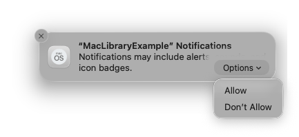
</p>

#### パーミッション確認

許可済みかどうかを真偽値で確認します。

```swift
MacNotificationManager.shared.getAuthorizationStatus { result in
    switch result {
    case .success(let status):
        let hasPermission = status == .authorized || status == .provisional
        print("通知許可: \(hasPermission)")
    case .failure(let error):
        print("エラー \(error.errorCode): \(error.errorMessage)")
    }
}
```

#### 認証ステータスの取得

詳細なステータス値を取得します。

```swift
MacNotificationManager.shared.getAuthorizationStatus { result in
    switch result {
    case .success(let status):
        // .notDetermined / .denied / .authorized / .provisional / .unsupported
        print(status)
    case .failure(let error):
        print("エラー \(error.errorCode): \(error.errorMessage)")
    }
}
```

#### 通知設定を開く

```swift
MacNotificationManager.shared.openNotificationSettings { result in
    if case .failure(let error) = result {
        print("エラー \(error.errorCode): \(error.errorMessage)")
    }
}
```

#### 通知権限のリセット（macOS 26.3）

一度拒否した権限を開発中にリセットする手順です。

1. **システム設定** → **通知** を開く
2. アプリ一覧から対象アプリを**右クリック**
3. **「通知をリセット...」** を選択
4. 確認ダイアログで **「通知をリセット」** ボタンを押す
5. 次回アプリ起動時に権限ダイアログが再表示される

### 通知の表示

`NotificationContent` を作成して `show()` を呼び出します。

**`NotificationContent` の制約:**

- `id`: 1〜128 文字（`[A-Za-z0-9\-_]`）
- `title`: 1〜128 文字
- `body`: 0〜1024 文字（省略可）

#### 即時表示

```swift
import MacLibrary

let content = NotificationContent(
    id: "mac-sample-notification",
    title: "Immediate Notification",
    body: "Displayed now",
    subtitle: "MacLibraryExample",
    categoryIdentifier: "mac-sample-category",
    userInfo: ["source": "MacLibraryExample", "id": "mac-sample-notification"],
    badge: nil
)

MacNotificationManager.shared.show(content: content) { result in
    // メインキューで実行
    switch result {
    case .success:
        print("通知を表示しました")
    case .failure(let error):
        print("エラー \(error.errorCode): \(error.errorMessage)")
    }
}
```

<p align="center">
    
</p>

#### 時間間隔トリガー

```swift
MacNotificationManager.shared.show(
    content: content,
    trigger: .timeInterval(seconds: 10, repeats: false)
) { result in
    switch result {
    case .success:
        print("10秒後にスケジュール済み")
    case .failure(let error):
        print("エラー \(error.errorCode): \(error.errorMessage)")
    }
}
```

#### カレンダートリガー

```swift
let nextDate = Calendar.current.date(byAdding: .minute, value: 1, to: Date()) ?? Date()
var components = Calendar.current.dateComponents([.year, .month, .day, .hour, .minute], from: nextDate)
components.second = 0

MacNotificationManager.shared.show(
    content: content,
    trigger: .calendar(dateComponents: components, repeats: false)
) { result in
    switch result {
    case .success:
        print("1分後にスケジュール済み")
    case .failure(let error):
        print("エラー \(error.errorCode): \(error.errorMessage)")
    }
}
```

### 更新 / キャンセル / 削除

#### IDで更新

保留中の通知を新しい内容に置き換えます。

```swift
let updatedContent = NotificationContent(
    id: "mac-sample-notification",
    title: "Updated Notification",
    body: "This content was updated",
    subtitle: "MacLibraryExample",
    categoryIdentifier: "mac-sample-category",
    userInfo: ["source": "MacLibraryExample", "id": "mac-sample-notification"],
    badge: nil
)

MacNotificationManager.shared.update(
    identifier: "mac-sample-notification",
    content: updatedContent,
    trigger: .immediate
) { result in
    switch result {
    case .success:
        print("更新しました")
    case .failure(let error):
        // 通知が見つからない場合はエラーコード 1104
        print("エラー \(error.errorCode): \(error.errorMessage)")
    }
}
```

<p align="center">
    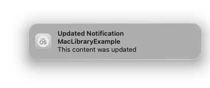
</p>

#### IDでキャンセル

```swift
MacNotificationManager.shared.cancelScheduled(identifier: "mac-sample-notification")
```

#### すべてキャンセル

```swift
MacNotificationManager.shared.cancelAllScheduled()
```

#### 配信済み通知の削除

通知センターから特定の通知を削除します。

```swift
MacNotificationManager.shared.removeDelivered(identifier: "mac-sample-notification")
```

#### 配信済み通知をすべて削除

```swift
MacNotificationManager.shared.removeAllDelivered()
```

### スケジュール

`schedule()` を使って将来の通知を登録します。トリガーは `.immediate` 以外を指定してください。

#### 時間間隔でスケジュール

```swift
let content = NotificationContent(
    id: "mac-sample-scheduled",
    title: "Scheduled Notification",
    body: "Scheduled in 10 seconds",
    subtitle: "MacLibraryExample",
    categoryIdentifier: "mac-sample-category",
    userInfo: ["source": "MacLibraryExample", "id": "mac-sample-scheduled"],
    badge: nil
)

MacNotificationManager.shared.schedule(
    content: content,
    trigger: .timeInterval(seconds: 10, repeats: false)
) { result in
    switch result {
    case .success:
        print("スケジュール済み")
    case .failure(let error):
        print("エラー \(error.errorCode): \(error.errorMessage)")
    }
}
```

#### カレンダーでスケジュール

```swift
let nextDate = Calendar.current.date(byAdding: .minute, value: 1, to: Date()) ?? Date()
var components = Calendar.current.dateComponents([.year, .month, .day, .hour, .minute], from: nextDate)
components.second = 0

MacNotificationManager.shared.schedule(
    content: content,
    trigger: .calendar(dateComponents: components, repeats: false)
) { result in
    switch result {
    case .success:
        print("カレンダースケジュール済み")
    case .failure(let error):
        print("エラー \(error.errorCode): \(error.errorMessage)")
    }
}
```

#### IDでキャンセル（スケジュール）

```swift
MacNotificationManager.shared.cancelScheduled(identifier: "mac-sample-scheduled")
```

#### すべてキャンセル（スケジュール）

```swift
MacNotificationManager.shared.cancelAllScheduled()
```

### クエリ

#### スケジュール済みを取得

```swift
MacNotificationManager.shared.getScheduled { result in
    switch result {
    case .success(let items):
        let ids = items.map { $0.identifier }.joined(separator: ", ")
        print("スケジュール済み: \(items.count) 件, ids=[\(ids)]")
    case .failure(let error):
        print("エラー \(error.errorCode): \(error.errorMessage)")
    }
}
```

#### 配信済みを取得

```swift
MacNotificationManager.shared.getDelivered { result in
    switch result {
    case .success(let items):
        let ids = items.map { $0.identifier }.joined(separator: ", ")
        print("配信済み: \(items.count) 件, ids=[\(ids)]")
    case .failure(let error):
        print("エラー \(error.errorCode): \(error.errorMessage)")
    }
}
```

### バッジ

#### バッジカウントを設定（1）

```swift
MacNotificationManager.shared.setBadgeCount(1) { result in
    switch result {
    case .success:
        print("バッジを 1 に設定しました")
    case .failure(let error):
        print("エラー \(error.errorCode): \(error.errorMessage)")
    }
}
```

#### バッジをクリア（0）

```swift
MacNotificationManager.shared.setBadgeCount(0) { result in
    switch result {
    case .success:
        print("バッジをクリアしました")
    case .failure(let error):
        print("エラー \(error.errorCode): \(error.errorMessage)")
    }
}
```

### カテゴリ

#### カテゴリの登録

```swift
let category = NotificationCategory(
    id: "mac-sample-category",
    actions: [
        NotificationAction(id: "open", title: "Open", isForeground: true),
        NotificationAction(id: "reply", title: "Reply", isTextInput: true, textInputPlaceholder: "Type message")
    ]
)

MacNotificationManager.shared.registerCategory(category) { result in
    switch result {
    case .success:
        // 通知を送信して右クリックするとアクション（Open, Reply）が表示される
        print("カテゴリを登録しました")
    case .failure(let error):
        print("エラー \(error.errorCode): \(error.errorMessage)")
    }
}
```

`NotificationContent` の `categoryIdentifier` に設定することでカテゴリを通知に紐づけます。

```swift
let content = NotificationContent(
    id: "mac-sample-notification",
    title: "アクション付き通知",
    body: "右クリックするとアクションが表示されます",
    subtitle: "MacLibraryExample",
    categoryIdentifier: "mac-sample-category",
    userInfo: ["source": "MacLibraryExample", "id": "mac-sample-notification"],
    badge: nil
)
```

<p align="center">
    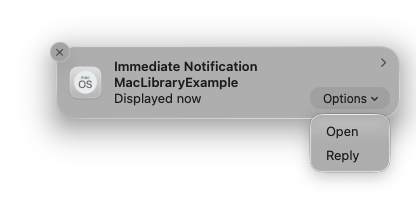
</p>

#### カテゴリの削除

```swift
MacNotificationManager.shared.removeCategory(identifier: "mac-sample-category") { result in
    if case .failure(let error) = result {
        print("エラー \(error.errorCode): \(error.errorMessage)")
    }
}
```

### エラーコード

| コード | ケース                    | 説明                                           |
| ------ | ------------------------- | ---------------------------------------------- |
| 1001   | `unsupportedOS`           | macOS 15 以上が必要                            |
| 1002   | `permissionDenied`        | ユーザーが通知権限を拒否                       |
| 1003   | `permissionRequestFailed` | 権限リクエストに失敗                           |
| 1101   | `invalidContent`          | id、title、または body が無効                  |
| 1102   | `invalidTrigger`          | トリガーが無効（例: timeInterval が 1 秒未満） |
| 1103   | `invalidCategory`         | カテゴリが無効                                 |
| 1104   | `notificationNotFound`    | 指定した識別子の保留中通知が見つからない       |
| 1201   | `addFailed`               | 通知リクエストの追加に失敗                     |
| 1202   | `removeFailed`            | 通知の削除に失敗                               |
| 1203   | `queryFailed`             | 通知の取得に失敗                               |
| 1204   | `setBadgeFailed`          | バッジカウントの設定に失敗                     |
| 1205   | `openSettingsFailed`      | 通知設定を開くのに失敗                         |
| 1999   | `unknown`                 | 不明なエラー                                   |
