# Clipboard 機能

Language:

- 日本語（このページ）
- English: [clipboard.md](clipboard.md)
- 한국어: [clipboard.ko.md](clipboard.ko.md)

← [マニュアルトップへ戻る](index.ja.md)

---

## 目次

- [Android](#android)
  - [AndroidClipboardManager](#androidclipboardmanager)
    - [スレッドとコールバック](#スレッドとコールバック)
  - [セットアップ](#セットアップ)
    - [Gradle の依存関係](#gradle-の依存関係)
  - [コピー](#コピー)
    - [プレーンテキストをコピー](#プレーンテキストをコピー)
    - [プレーンテキストをコピー（空文字）](#プレーンテキストをコピー空文字)
    - [HTML テキストをコピー](#html-テキストをコピー)
    - [URI をコピー](#uri-をコピー)
    - [複数テキストをコピー](#複数テキストをコピー)
  - [コピー - 機微情報](#コピー---機微情報)
    - [機微情報テキストをコピー](#機微情報テキストをコピー)
  - [読み取り / 確認](#読み取り--確認)
    - [クリップボードを読み取る](#クリップボードを読み取る)
    - [データ有無を確認](#データ有無を確認)
    - [メタデータを取得](#メタデータを取得)
  - [クリア](#クリア)
    - [クリップボードをクリア](#クリップボードをクリア)
  - [変更監視](#変更監視)
    - [監視を開始](#監視を開始)
    - [監視を停止](#監視を停止)
  - [エラー処理](#エラー処理)
  - [C ABI](#c-abi)
    - [ビルド](#ビルド)
    - [初期化](#初期化)
    - [コピーとクリア](#コピーとクリア)
    - [読み取りと問い合わせ](#読み取りと問い合わせ)
    - [変更イベント](#変更イベント)
    - [エラー値](#エラー値)
- [iOS](#ios)
  - [IosClipboardManager](#iosclipboardmanager)
  - [セットアップ](#セットアップ-1)
    - [スレッド](#スレッド)
    - [2 つの呼び出し方式](#2-つの呼び出し方式)
    - [既定値](#既定値)
  - [スコープ](#スコープ)
    - [一般ペーストボードを使う](#一般ペーストボードを使う)
    - [名前付きペーストボードを作成](#名前付きペーストボードを作成)
    - [名前付きスコープを参照（作成しない）](#名前付きスコープを参照作成しない)
    - [ユニークペーストボードを作成](#ユニークペーストボードを作成)
    - [アクティブなペーストボードを削除](#アクティブなペーストボードを削除)
    - [名前付き / ユニークペーストボードは永続ストアではありません](#名前付き--ユニークペーストボードは永続ストアではありません)
  - [コピー](#コピー-1)
    - [プレーンテキストをコピー](#プレーンテキストをコピー-1)
    - [プレーンテキストをコピー（空文字）](#プレーンテキストをコピー空文字-1)
    - [HTML テキストをコピー](#html-テキストをコピー-1)
    - [URL をコピー](#url-をコピー)
    - [画像ファイルをコピー](#画像ファイルをコピー)
    - [画像データをコピー](#画像データをコピー)
    - [色をコピー](#色をコピー)
    - [カスタムデータをコピー](#カスタムデータをコピー)
    - [複数テキストをコピー](#複数テキストをコピー-1)
    - [複数表現をコピー](#複数表現をコピー)
  - [コピーオプション](#コピーオプション)
    - [localOnly を指定してコピー](#localonly-を指定してコピー)
    - [expirationDate を指定してコピー](#expirationdate-を指定してコピー)
  - [追記](#追記)
    - [プレーンテキストを追記](#プレーンテキストを追記)
    - [URL を追記](#url-を追記)
    - [追記はプライバシーオプションを引き継ぎません](#追記はプライバシーオプションを引き継ぎません)
  - [読み取り / 確認](#読み取り--確認-1)
    - [読み取り](#読み取り)
    - [データを読み取り](#データを読み取り)
    - [スナップショット](#スナップショット)
    - [スナップショット（型を指定）](#スナップショット型を指定)
    - [プライバシー: 確認ダイアログと通知](#プライバシー-確認ダイアログと通知)
  - [非同期ロード](#非同期ロード)
    - [テキストをロード](#テキストをロード)
    - [URL をロード](#url-をロード)
    - [画像をロード](#画像をロード)
    - [ファイルをロード](#ファイルをロード)
    - [すべてのロードをキャンセル](#すべてのロードをキャンセル)
  - [検出](#検出)
    - [パターンを検出](#パターンを検出)
    - [値を検出](#値を検出)
    - [number と probableWebSearch はクリップボード全体を分類します](#number-と-probablewebsearch-はクリップボード全体を分類します)
    - [検出にキャンセルトークンはありません](#検出にキャンセルトークンはありません)
  - [変更監視](#変更監視-1)
    - [監視を開始](#監視を開始-1)
    - [監視を停止](#監視を停止-1)
    - [フォアグラウンド復帰時の変更確認](#フォアグラウンド復帰時の変更確認)
  - [ペーストコントロール](#ペーストコントロール)
    - [ペーストコントロールを作成](#ペーストコントロールを作成)
  - [クリア](#クリア-1)
  - [エラー処理](#エラー処理-1)
- [macOS](#macos)
  - [MacClipboardManager](#macclipboardmanager)
    - [2 つの呼び出し形式](#2-つの呼び出し形式)
    - [コンテンツは型識別子とバイト列の辞書です](#コンテンツは型識別子とバイト列の辞書です)
    - [名前付きペーストボードの作成](#名前付きペーストボードの作成)
    - [ユニークペーストボードの作成](#ユニークペーストボードの作成)
    - [現在のペーストボードの削除](#現在のペーストボードの削除)
    - [general の削除（エラー 1508）](#general-の削除エラー-1508)
    - [空の名前でのペーストボード作成（エラー 1505）](#空の名前でのペーストボード作成エラー-1505)
    - [テキストのコピー](#テキストのコピー)
    - [URL のコピー](#url-のコピー)
    - [画像のコピー](#画像のコピー)
    - [複数 item のコピー](#複数-item-のコピー)
    - [複数 representation のコピー](#複数-representation-のコピー)
    - [空のコピー（エラー 1501）](#空のコピーエラー-1501)
    - [representation が空の item のコピー（エラー 1502）](#representation-が空の-item-のコピーエラー-1502)
    - [localOnly の既定値は true です](#localonly-の既定値は-true-です)
    - [コピーしてから追記する](#コピーしてから追記する)
    - [append は追記先のプライバシー設定を引き継ぎます](#append-は追記先のプライバシー設定を引き継ぎます)
    - [所有権を失った状態での追記（エラー 1511）](#所有権を失った状態での追記エラー-1511)
  - [読み取り / 検査](#読み取り--検査)
    - [Read](#read)
    - [特定の型の読み取り](#特定の型の読み取り)
    - [Snapshot](#snapshot)
    - [型フィルタ付きの Snapshot](#型フィルタ付きの-snapshot)
    - [空フィルタでの Snapshot（エラー 1512）](#空フィルタでの-snapshotエラー-1512)
    - [Access Behavior](#access-behavior)
    - [パターンの検出](#パターンの検出)
    - [値の検出](#値の検出)
    - [メタデータの検出](#メタデータの検出)
    - [パターンを指定しない検出（エラー 1503）](#パターンを指定しない検出エラー-1503)
  - [監視](#監視)
    - [監視の開始](#監視の開始)
    - [不正な間隔（エラー 1523）](#不正な間隔エラー-1523)
    - [監視の停止](#監視の停止)
    - [前面復帰時の変更確認](#前面復帰時の変更確認)
    - [不正な型識別子（エラー 1504）](#不正な型識別子エラー-1504)
    - [1514 について](#1514-について)
    - [通常の利用では発生しないエラーコード](#通常の利用では発生しないエラーコード)

- [Windows](#windows)
  - [セットアップ](#セットアップ-3)
    - [オーナー STA スレッド](#オーナー-sta-スレッド)
    - [同期と非同期の操作](#同期と非同期の操作)
    - [書き込みオプション](#書き込みオプション)
  - [初期化 / ライフサイクル](#初期化--ライフサイクル)
    - [セッションの作成](#セッションの作成)
    - [履歴イベントのハンドラー](#履歴イベントのハンドラー)
    - [終了処理](#終了処理)
    - [破棄可能かの確認](#破棄可能かの確認)
  - [コピー](#コピー-3)
    - [プレーンテキストのコピー](#プレーンテキストのコピー)
    - [空文字列のコピー](#空文字列のコピー)
    - [HTML のコピー](#html-のコピー)
    - [ファイルのコピー](#ファイルのコピー)
    - [画像のコピー](#画像のコピー-1)
    - [独自形式のコピー](#独自形式のコピー)
    - [複数形式の同時コピー](#複数形式の同時コピー)
  - [書き込みオプション](#書き込みオプション-1)
  - [貼り付け](#貼り付け)
    - [プレーンテキストの貼り付け](#プレーンテキストの貼り付け)
    - [HTML の貼り付け](#html-の貼り付け)
    - [ファイルの貼り付け](#ファイルの貼り付け)
    - [画像の貼り付け](#画像の貼り付け)
    - [独自形式の貼り付け](#独自形式の貼り付け)
  - [検査 / クリア](#検査--クリア)
    - [形式の有無](#形式の有無)
    - [形式一覧の取得](#形式一覧の取得)
    - [優先形式の取得](#優先形式の取得)
    - [クリップボードのクリア](#クリップボードのクリア)
  - [遅延レンダリング](#遅延レンダリング)
    - [形式の予約](#形式の予約)
    - [部分状態からの復旧](#部分状態からの復旧)
  - [履歴](#履歴)
    - [履歴の利用可否](#履歴の利用可否)
    - [履歴一覧の取得](#履歴一覧の取得)
    - [履歴項目の復元](#履歴項目の復元)
    - [履歴項目の削除](#履歴項目の削除)
    - [未固定履歴のクリア](#未固定履歴のクリア)
    - [リクエストのキャンセル](#リクエストのキャンセル)
  - [エラー処理](#エラー処理-3)
  - [C ABI](#c-abi-1)
    - [セッション・リスナー・終了](#セッションリスナー終了)
    - [書き込み](#書き込み)
    - [読み取りと検査](#読み取りと検査)
    - [遅延レンダリング](#遅延レンダリング-1)
    - [クリップボード履歴](#クリップボード履歴)

---

## Android

Android 12 (API 31) 以降のシステムクリップボード（`ClipboardManager`）です。Android ライブラリは、1 つの実装を 2 つの公開 API から提供します。サンプルアプリは Kotlin API を使用しています。

| API | 名前 | ヘッダー / パッケージ | 成果物 |
|---|---|---|---|
| Kotlin API | `AndroidClipboardManager` | `com.jonghyunkim.nativetoolkit.clipboard` | `android-native-toolkit-2.0.0.aar` |
| C ABI | `ntk_clipboard_*` | `<NativeToolkitC/Clipboard.h>` | `android-native-toolkit-capi-2.0.0.aar` |

- 最小 SDK: Android 12 (API 31)
- 機微情報プレビュー抑止: Android 13 (API 33) 以上
- 対応範囲: コピー（プレーンテキスト・HTML・URI・複数テキスト）、機微情報のコピー、読み取り、メタデータの確認、クリア、クリップボード変更の監視です。

Android ライブラリの 2.0.0 では、Kotlin のパッケージが `android.library.*` から `com.jonghyunkim.nativetoolkit.*` に変わり、Unity ブリッジの AAR がなくなりました。1.x 向けに書いたコードはそのままではコンパイルできません。[Android ライブラリを 2.0.0 へ移行する](index.ja.md#android-ライブラリを-200-へ移行する)を参照してください。

### AndroidClipboardManager

`AndroidClipboardManager` はクリップボードの入口です。`getInstance(context)` はプロセスで 1 つのインスタンスを返します。保持するのは Application Context だけなので、どの `Context` を渡しても構いません。

```kotlin
import com.jonghyunkim.nativetoolkit.clipboard.AndroidClipboardManager
import com.jonghyunkim.nativetoolkit.clipboard.domain.error.ClipboardDomainError
import com.jonghyunkim.nativetoolkit.clipboard.domain.model.ClipContent

// サンプルアプリと同じくコンポーザブルの中で取得します。それ以外の場所では getInstance を直接呼びます。
val context = LocalContext.current
val clipboardManager = remember(context) { AndroidClipboardManager.getInstance(context) }
```

コピー・読み取り・確認・クリアの操作は同期です。結果を返すか、`ClipboardDomainError` を送出します（[エラー処理](#エラー処理)を参照）。1.x の入口である `ClipboardUseCases(context)` と `ClipboardChangeMonitor` も引き続き公開されていますが、推奨する入口は `AndroidClipboardManager` です。C ABI が呼び出すのもこちらです。

#### スレッドとコールバック

| 操作 | スレッド |
|---|---|
| `copyPlainText`、`copyHtmlText`、`copyUri`、`copyMultipleText`、`clear`、`read`、`hasClip`、`getDescription`、`errorCodeOf` | 任意のスレッドです。呼び出したスレッドで実行し、システムの呼び出しが戻った時点で戻ります |
| `startObserving`、`stopObserving`、`isObserving` | メインスレッド専用です。それ以外のスレッドでは `IllegalStateException` になります |
| `changes.addListener`、`EventHub.Registration.remove` | メインスレッド専用です。それ以外のスレッドでは `IllegalStateException` になります |
| `changes` のリスナー | メインスレッドで呼ばれます。リスナーが送出した例外は捕捉してログに出力し、ほかのリスナーはそのまま呼ばれます |

---

### セットアップ

#### Gradle の依存関係

`dist/1.13.0/android/` には、AAR と、それを POM とともに収めたファイルベースの Maven リポジトリ `m2/` があります。`m2/` からライブラリを解決することを推奨します。Gradle が、ライブラリの依存する androidx ライブラリも合わせて解決するためです。

**settings.gradle.kts:**

```kotlin
dependencyResolutionManagement {
    repositoriesMode.set(RepositoriesMode.FAIL_ON_PROJECT_REPOS)
    repositories {
        google()
        mavenCentral()
        // dist/1.13.0/android/m2 をプロジェクトにコピーしたもの
        maven { url = uri("third_party/native-toolkit-m2") }
    }
}
```

**app/build.gradle.kts:**

```kotlin
dependencies {
    implementation("io.github.kimjh4941:android-native-toolkit:2.0.0")
}
```

代わりに `android-native-toolkit-2.0.0.aar` をファイルとして追加すると、Gradle はその依存関係を知ることができないため、自分で宣言する必要があります。両方の方法の手順、依存関係の一覧、ライブラリがマニフェストに加える権限は[ライブラリ組み込み方法](index.ja.md#ライブラリ組み込み方法)にまとめています。

| 要件 | 値 |
|---|---|
| `minSdk` | 31 以上 |
| `compileSdk` | 36 以上 |
| Kotlin コンパイラ（Kotlin から呼び出す場合） | 2.1 以上 |

ライブラリは初期化処理を androidx.startup（`InitializationProvider`）に登録します。クリップボードはこれに依存しません。androidx.startup を無効にしたアプリでも、クリップボードの操作はすべて動作します。そのようなアプリは、ほかの機能のために `LibraryRuntime.ensureInitialized(activity)`（`com.jonghyunkim.nativetoolkit.common.runtime`）に現在の Activity を渡してライブラリを初期化します。[ライブラリ組み込み方法](index.ja.md#ライブラリ組み込み方法)を参照してください。

クリップボードに権限とマニフェストの設定は不要です。`content://` URI をコピーする場合（[URI をコピー](#uri-をコピー)を参照）は、そのファイルを提供できる `FileProvider` が必要です。サンプルアプリは、ライブラリが Share 機能のために宣言しているものを流用しています。その authority は `<applicationId>.native_toolkit.share.fileprovider` で、アプリの files・cache・外部 files ディレクトリを提供します。独自のプロバイダーを使いたいアプリは、`FileProvider` のサブクラス（たとえば `class ClipboardFileProvider : FileProvider()`）を独自の authority で宣言します。`androidx.core.content.FileProvider` そのものを改めて宣言すると、マニフェストのマージでライブラリのエントリと衝突します。

---

### コピー

コピーするたびに、クリップボード全体が 1 つのクリップに置き換わります。どの `ClipContent` も、省略可能な `label`（既定値 `""`）と `isSensitive`（既定値 `false`。[コピー - 機微情報](#コピー---機微情報)を参照）を受け取ります。

#### プレーンテキストをコピー

```kotlin
try {
    clipboardManager.copyPlainText(
        ClipContent.PlainText(text = "Hello from native-toolkit", label = "sample")
    )
} catch (e: ClipboardDomainError) {
    // エラー処理（エラー処理の節を参照）
}
```

<p align="center">
    
</p>

#### プレーンテキストをコピー（空文字）

空文字は許容され、例外は発生しません。

```kotlin
clipboardManager.copyPlainText(ClipContent.PlainText(text = ""))
```

<p align="center">
    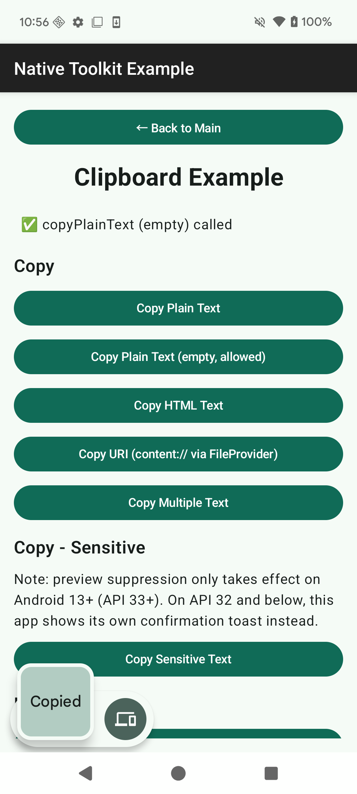
</p>

#### HTML テキストをコピー

`htmlText` は空にできません（`ClipboardDomainError.EmptyContent`）。`plainText` は、HTML に対応していないアプリが貼り付けるプレーンテキストの代替です。

```kotlin
clipboardManager.copyHtmlText(
    ClipContent.HtmlText(plainText = "Hello", htmlText = "<b>Hello</b>")
)
```

<p align="center">
    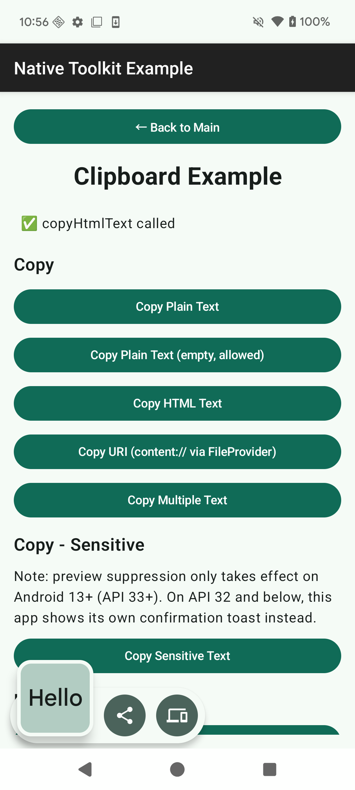
</p>

#### URI をコピー

URI の文字列をコピーします。受け付けるのは `content` と `file` のスキームだけです。空の URI やそれ以外のスキームは `ClipboardDomainError.InvalidUri` を送出します。貼り付けたアプリがファイルを読めるように、`FileProvider` の `content://` URI を使ってください。

サンプルアプリは、バックグラウンドスレッドでファイルを書き込んでから、その URI をコピーします。

```kotlin
private fun prepareSampleUri(context: Context): String {
    val file = File(context.cacheDir, "clipboard_sample.txt")
    file.writeText("Clipboard sample file content")
    val uri = FileProvider.getUriForFile(
        context,
        "${context.packageName}.native_toolkit.share.fileprovider",
        file
    )
    return uri.toString()
}

scope.launch(Dispatchers.IO) {
    val uri = prepareSampleUri(context)
    withContext(Dispatchers.Main) {
        try {
            clipboardManager.copyUri(ClipContent.UriContent(uri = uri))
        } catch (e: ClipboardDomainError) {
            // エラー処理（エラー処理の節を参照）
        }
    }
}
```

<p align="center">
    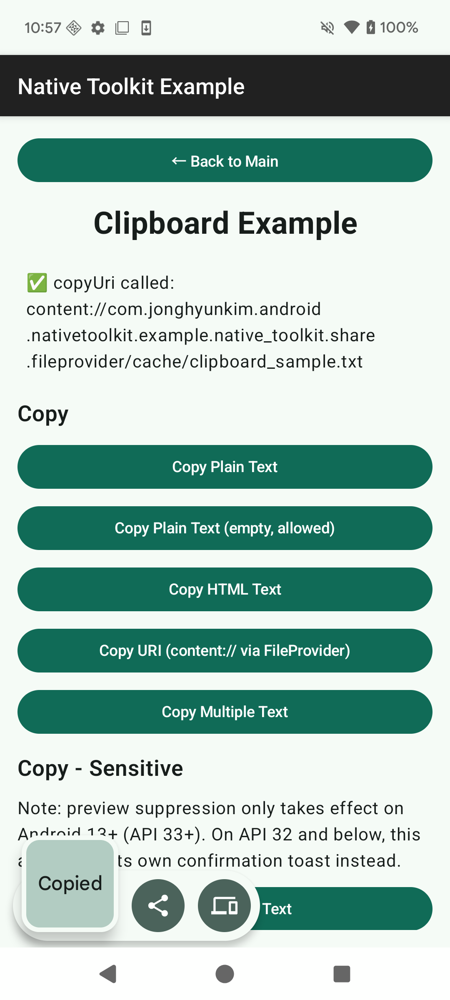
</p>

#### 複数テキストをコピー

複数のプレーンテキストを 1 つのクリップにまとめます（1 つの `ClipData` に、テキストごとに 1 つのアイテムを格納します）。リストは空にできません（`ClipboardDomainError.EmptyItemList`）。

```kotlin
clipboardManager.copyMultipleText(
    ClipContent.MultipleText(texts = listOf("first", "second", "third"))
)
```

<p align="center">
    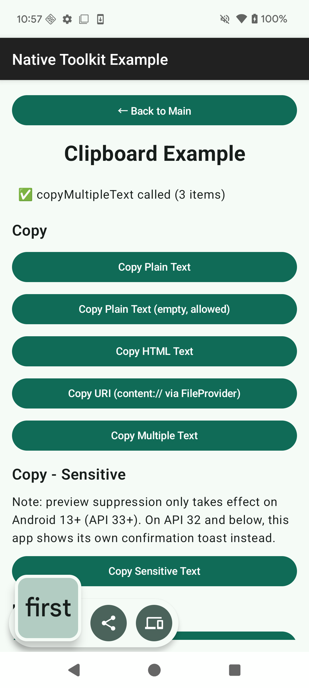
</p>

---

### コピー - 機微情報

`isSensitive = true` を指定すると、コピーした内容を機微情報（パスワード、ワンタイムコードなど）として示せます。ライブラリはクリップに `ClipDescription.EXTRA_IS_SENSITIVE` を設定します。

- Android 13 (API 33) 以上では、システム標準のコピー確認 UI が内容のプレビュー表示を抑止します。
- Android 12L (API 32) 以下ではシステム確認 UI 自体が存在しないため、コピー後に自前でフィードバック（`Toast` など）を表示してください。

#### 機微情報テキストをコピー

```kotlin
clipboardManager.copyPlainText(
    ClipContent.PlainText(text = "P@ssw0rd-sample", isSensitive = true)
)

if (Build.VERSION.SDK_INT <= Build.VERSION_CODES.S_V2) {
    Toast.makeText(context, "Copied (sensitive)", Toast.LENGTH_SHORT).show()
}
```

<p align="center">
    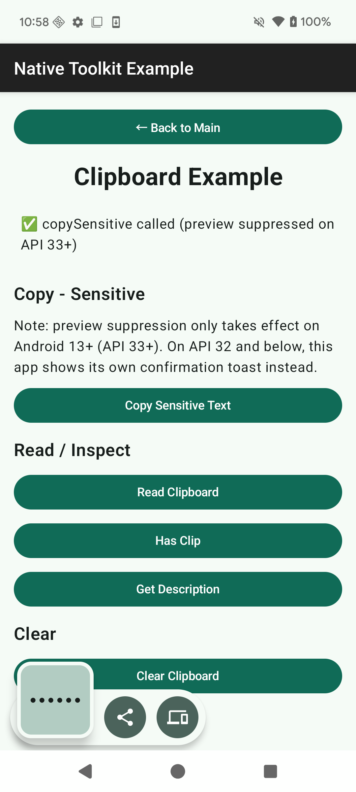
</p>

---

### 読み取り / 確認

#### クリップボードを読み取る

空のクリップボードは**正常系**であり、エラーではありません。`read()` は `null` を返します。

Android 10 以降、クリップボードを読めるのは入力フォーカスを持つアプリ（または既定のキーボード）だけです。フォーカスがないとき、たとえばウィンドウがまだフォーカスを得ていないときは、システムが何も返さず、`read()` はやはり `null` を返します。空のクリップボードとは区別できません。サンプルアプリと同じく、ユーザーの操作に応じて読み取ってください。`ClipboardDomainError.ReadNotAllowed` を送出するのは、システムが `SecurityException` で読み取りを拒否した場合だけです。

```kotlin
try {
    val result = clipboardManager.read()
    if (result != null) {
        // result.label, result.mimeTypes
        // result.items: 各アイテムの text / htmlText / uri / coercedText
    } else {
        // クリップボードが空（正常系）か、アプリに入力フォーカスがない
    }
} catch (e: ClipboardDomainError) {
    // エラー処理（エラー処理の節を参照）
}
```

各 `ClipItemData` には `text`、`htmlText`、`uri` があり、アイテムがそれを持たない場合はそれぞれ `null` です。`coercedText` は、できる範囲でプレーンテキストにした形（テキスト、なければ URI の文字列）です。`coercedText` は `content://` URI を解決してその内容を読むことはしません。

<p align="center">
    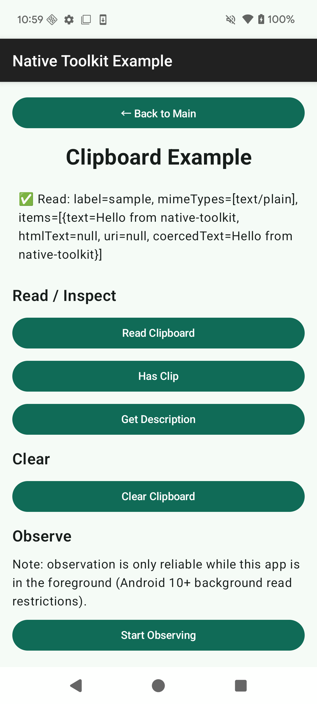
</p>

#### データ有無を確認

```kotlin
val hasClip: Boolean = clipboardManager.hasClip()
```

<p align="center">
    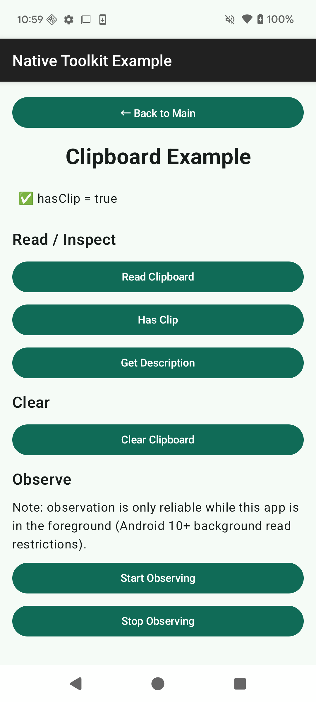
</p>

#### メタデータを取得

クリップの本体に触れず、メタデータだけを読み取ります（Android 12 以降の「クリップボードから貼り付けました」というアクセス通知を避けられます）。こちらもクリップボードが空の場合は `null`（正常系）を返します。

```kotlin
val info = clipboardManager.getDescription()
if (info != null) {
    // info.label, info.mimeTypes
    // info.isStyledText: 書式付き（リッチ）テキストかどうか
    // info.classificationStatus: ClipDescription.CLASSIFICATION_* の生値。取得できない場合は null
}
```

<p align="center">
    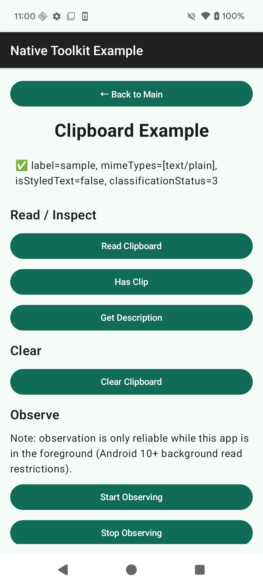
</p>

---

### クリア

#### クリップボードをクリア

```kotlin
clipboardManager.clear()
```

<p align="center">
    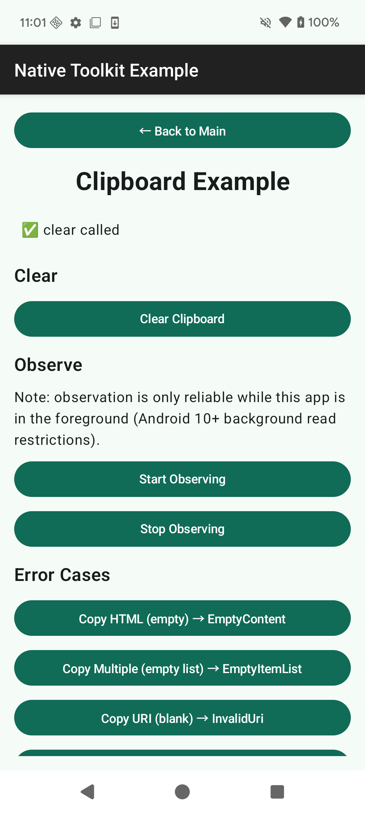
</p>

---

### 変更監視

クリップボードの監視はプロセスに 1 つで、`changes` のすべてのリスナー（と C ABI のリスナー）が共有します。監視とリスナーの登録は別のものです。

- `startObserving()` と `stopObserving()` は、1 つのシステムリスナーを開始・停止します。どちらも、すでにその状態であれば何もしません。状態は `isObserving()` で確認できます。
- `changes.addListener` はリスナーを追加し、その `EventHub.Registration` を返します。リスナーが変更を受け取るのは監視中だけです。リスナーが 1 つも登録されていない間に届いた変更は破棄されます。
- リスナーを削除しても監視は止まりません。監視を停止すると、すべてのリスナーに対して止まります。

これらはすべてメインスレッド専用で、リスナーもメインスレッドで呼ばれます。監視が確実に動作するのはアプリが前面にある間だけです。アプリに入力フォーカスがない間、システムは変更を通知しません（Android 10 以降）。

#### 監視を開始

サンプルアプリでは、監視するのはクリップボード画面だけなので、この画面が監視を所有します。表示されたときにリスナーを追加し、ボタンから監視を開始し、閉じるときにリスナーの削除と監視の停止の両方を行います。

```kotlin
// この画面が監視を所有します。表示中は、変更がメインスレッドで届きます。
DisposableEffect(clipboardManager) {
    val registration = clipboardManager.changes.addListener { _, _ ->
        changeCount++
        statusText = "Clipboard changed ($changeCount)"
    }
    onDispose {
        registration.remove()
        // この画面が監視の唯一の所有者だからこそ停止します。
        clipboardManager.stopObserving()
    }
}

clipboardManager.startObserving()
val isObserving: Boolean = clipboardManager.isObserving()
```

リスナーの第 2 引数はそのリスナー自身の `Registration` なので、リスナーは実行中に自分を削除できます。システムの `ClipboardManager` を取得できない場合、`startObserving()` は開始せず、`isObserving()` は `false` のままです。

#### 監視を停止

```kotlin
clipboardManager.stopObserving()
```

購読する側は、それぞれ破棄されるときに自分のリスナーを削除します。停止は事情が異なります。監視はプロセスに 1 つなので、`stopObserving()` は `changes` のすべての購読者（と C ABI のリスナー）に対して監視を止めます。上の例のように監視の所有者が 1 つの場合と違い、各購読者の破棄処理から呼ぶと、最初に閉じた画面がほかのすべての画面の監視を止めてしまいます。複数の場所から監視するアプリは、開始と停止を 1 か所に任せます。たとえばアプリ側で参照カウントを持ち、最初の購読者が来たときに `startObserving()` を、最後の購読者が去ったときに `stopObserving()` を呼びます。

---

### エラー処理

同期の操作は `ClipboardDomainError` のサブタイプを送出します。`errorCodeOf(error)` は、どの失敗も 7 つの `ClipboardErrorCode` の値のいずれかに分類します。C ABI が返すものと同じ分類です（`ClipboardErrorCode.of(error)` も同じです）。例外を読むだけで、送出される型は変わりません。

| `ClipboardDomainError` | `ClipboardErrorCode` | 送出する操作 | 原因 |
|---|---|---|---|
| `EmptyContent` | `EMPTY_CONTENT` | `copyHtmlText` | `htmlText` が空 |
| `EmptyItemList` | `EMPTY_ITEMS` | `copyMultipleText` | `texts` が空 |
| `InvalidUri` | `INVALID_URI` | `copyUri` | `uri` が空、またはスキームが `content` でも `file` でもありません。`uri` プロパティに拒否された値が入ります |
| `ClipboardUnavailable` | `UNAVAILABLE` | コピー・読み取り・確認・クリアのすべての操作 | システムの `ClipboardManager` を取得できない |
| `ReadNotAllowed` | `READ_NOT_ALLOWED` | `read` | システムが読み取りを拒否した（`SecurityException`） |
| （システムからの `SecurityException`） | `SECURITY` | それ以外の操作 | そのまま送出されます |
| （それ以外） | `UNKNOWN` | - | - |

空のクリップボードはこれらのエラーに**含まれません**。`read()` と `getDescription()` は正常系として `null` を返します。

サンプルアプリは、エラーの名前にそのコードを添えて表示します。

```kotlin
try {
    clipboardManager.copyUri(ClipContent.UriContent(uri = ""))
} catch (e: ClipboardDomainError) {
    statusText = clipboardErrorMessage(e, clipboardManager)
}

private fun clipboardErrorMessage(e: ClipboardDomainError, manager: AndroidClipboardManager): String {
    val text = when (e) {
        is ClipboardDomainError.EmptyContent -> "EmptyContent: HTML body is empty"
        is ClipboardDomainError.EmptyItemList -> "EmptyItemList: no items to copy"
        is ClipboardDomainError.InvalidUri -> "InvalidUri: ${e.uri}"
        is ClipboardDomainError.ClipboardUnavailable -> "ClipboardUnavailable"
        is ClipboardDomainError.ReadNotAllowed -> "ReadNotAllowed: app must be in foreground"
    }
    return "$text [errorCode=${manager.errorCodeOf(e)}]"
}
```

### C ABI

- C から、そして C の関数を呼べる言語（C#、Dart、Rust、Go など）から同じクリップボードを使うための API です。Kotlin と Java のアプリは、代わりに `AndroidClipboardManager` を直接呼びます。
- どの関数も任意のスレッドから呼べ、メインスレッドを**待ちません**。コピー・クリア・読み取り・問い合わせは呼び出したスレッドで実行し、結果を返します。`ntk_clipboard_start_observing` と `ntk_clipboard_stop_observing` はメインスレッドにポストされます。`NTK_CLIPBOARD_ERROR_NONE` は要求を受け付けたという意味で、監視が始まったという意味ではありません。
- 変更イベントと、受け付けたリスナーの `release` は **Android のメインスレッド**で呼ばれます。メインスレッドをブロックしないでください。また、コールバックから例外を外に出さないでください。ライブラリまで届いた例外はプロセスを終了させます。
- 読み取りは、呼び出し側が所有するハンドルで返ります。`ntk_clipboard_content` と `ntk_clipboard_description` があり、それぞれ対応する `_free` で解放します。ハンドルから取り出したポインターは、そのハンドルを解放するまで有効です。リスナーの `user_data` は呼び出し側のもので、`release` が呼ばれた後に解放して構いません。
- コピーのオプションは `ntk_clipboard_copy_options` 構造体です。`NULL` はラベルなし・機微情報でない、という意味です。
- C ABI があるのは 64 ビットの ABI（`arm64-v8a`、`x86_64`）だけです。アプリには Kotlin または Java のコードも必要です（C ABI は JNI を通じて Kotlin のライブラリを呼び出します）。また、C ABI を自分で初期化しない限り、アプリの既定のプロセスから呼び出します。

#### ビルド

両方の AAR を追加し、Prefab を有効にして、APK と CMake のビルドの両方を 64 ビットの ABI に限定します。AGP は CMake のビルドが対象とするすべての ABI について Prefab パッケージを確認するため、32 ビットの ABI も対象にした CMake のビルドは CXX1210 で失敗します（マニュアルトップの [C ABI](index.ja.md#c-abi) を参照）。32 ビットのコードも同梱するアプリは、32 ビットの端末には `libntk.so` なしでインストールされます。クラッシュはしませんが、ライブラリの読み込みが失敗し（C# では `DllNotFoundException`、Dart では `DynamicLibrary.open` からの例外）、アプリ側でそれを処理する必要があります。

**app/build.gradle.kts:**

```kotlin
android {
    defaultConfig {
        minSdk = 31
        // APK に含める ABI です。
        ndk { abiFilters += listOf("arm64-v8a", "x86_64") }
        // CMake のビルドが対象とする ABI です。ここに挙げる ABI はすべて Prefab パッケージに存在する必要があります。
        externalNativeBuild {
            cmake { abiFilters("arm64-v8a", "x86_64") }
        }
    }
    externalNativeBuild {
        cmake { path = file("src/main/cpp/CMakeLists.txt") }
    }
    buildFeatures { prefab = true }
}

dependencies {
    implementation("io.github.kimjh4941:android-native-toolkit-capi:2.0.0")
    implementation("io.github.kimjh4941:android-native-toolkit:2.0.0")
}
```

**CMakeLists.txt:**

```cmake
find_package(ntk REQUIRED CONFIG)

add_library(app SHARED app.c)
target_link_libraries(app PRIVATE ntk::ntk)
```

ヘッダーは `NativeToolkitC/Common.h`、`NativeToolkitC/Android.h`、`NativeToolkitC/Clipboard.h` です。AAR は R8 の keep ルールを同梱しています。バインディング生成ツール（ClangSharp、bindgen、ffigen）向けに、同じヘッダーが `dist/1.13.0/android/include/NativeToolkitC/` にもあります。

#### 初期化

既定では呼ぶものはありません。capi の AAR が、アプリの起動時に androidx.startup を通じて C ABI を初期化します。初期化が済むまで、`ntk_clipboard_error` を返すクリップボードの関数はすべて `NTK_CLIPBOARD_ERROR_NOT_INITIALIZED` を返します（引数のエラーが先に報告されます）。読み取り用の関数と `_free` の関数は、初期化に関係なく動作します。

アプリが androidx.startup を無効にしている場合、既定以外のプロセスで動く場合、`libntk.so` を `dlopen` だけで読み込む場合、独自の `ContentProvider`（androidx.startup より先に動くことがあります）から呼び出す場合は、`ntk_android_init` を自分で呼びます。この関数は待たず、何度呼んでも構いません。初期化が済んでいれば `NTK_ANDROID_ERROR_NONE` を返します。

```c
#include <NativeToolkitC/Common.h>
#include <NativeToolkitC/Android.h>

/* JNI のコードから呼びます。env: 呼び出しスレッドの JNIEnv*。context: 任意の Context
   （jobject）。ヘッダーが jni.h を必要としないように、どちらも void* で渡します。 */
static int32_t init_native_toolkit(void* env, void* context)
{
    ntk_android_error error = ntk_android_init(env, context);
    if (error == NTK_ANDROID_ERROR_IN_PROGRESS || error == NTK_ANDROID_ERROR_JNI_FAILURE) {
        /* まだ準備ができていません。後でもう一度呼びます。 */
    } else if (error == NTK_ANDROID_ERROR_CLASS_NOT_FOUND) {
        /* Kotlin のクラスがないか、名前が変わっています（R8）。呼び直しても解決しません。 */
    }
    return ntk_android_is_initialized();   /* 初期化済みなら 0 以外 */
}
```

Kotlin のコードからは、代わりに `NativeToolkitCApi.init(context)` を呼べます。

#### コピーとクリア

```c
#include <string.h>
#include <NativeToolkitC/Common.h>
#include <NativeToolkitC/Clipboard.h>

/* プレーンテキストです。NULL のオプションはラベルなし・機微情報でない、です。空文字列も有効です。 */
ntk_clipboard_error error = ntk_clipboard_copy_text("Hello from native-toolkit", NULL);

/* ラベルや機微情報のフラグを指定する場合は、構造体を 0 で埋めてから struct_size を設定します。 */
ntk_clipboard_copy_options options;
memset(&options, 0, sizeof(options));
options.struct_size = (uint32_t)sizeof(options);
options.label = "sample";
error = ntk_clipboard_copy_text("Hello from native-toolkit", &options);

memset(&options, 0, sizeof(options));
options.struct_size = (uint32_t)sizeof(options);
options.sensitive = 1;
error = ntk_clipboard_copy_text("P@ssw0rd-sample", &options);

/* HTML とそのプレーンテキストです。空の html は EMPTY_CONTENT、NULL の plain_text は "" です。 */
error = ntk_clipboard_copy_html("<b>Hello</b>", "Hello", NULL);

/* content:// URI です。空の URI やほかのスキームは INVALID_URI です。 */
const char* uri = "content://com.example.app.native_toolkit.share.fileprovider/cache/clipboard_sample.txt";
error = ntk_clipboard_copy_uri(uri, NULL);

/* 複数のテキストを 1 つのクリップにまとめます。count が 0 なら EMPTY_ITEMS です。 */
const char* texts[3];
texts[0] = "first";
texts[1] = "second";
texts[2] = "third";
error = ntk_clipboard_copy_texts(texts, 3, NULL);

/* クリップボードを空にします。 */
error = ntk_clipboard_clear();
```

#### 読み取りと問い合わせ

```c
#include <NativeToolkitC/Common.h>
#include <NativeToolkitC/Clipboard.h>

ntk_clipboard_content* content = NULL;
ntk_clipboard_error error = ntk_clipboard_read(&content);
if (error == NTK_CLIPBOARD_ERROR_NONE && content == NULL) {
    /* 空か、アプリに入力フォーカスがありません。この 2 つは区別できません。 */
} else if (error == NTK_CLIPBOARD_ERROR_NONE) {
    const char* label = ntk_clipboard_content_label(content, NULL);   /* ない場合は NULL */
    size_t mime_count = ntk_clipboard_content_mime_type_count(content);
    size_t item_count = ntk_clipboard_content_item_count(content);
    size_t i;
    for (i = 0; i < mime_count; ++i) {
        const char* mime_type = ntk_clipboard_content_mime_type_at(content, i, NULL);
        (void)mime_type;
    }
    for (i = 0; i < item_count; ++i) {
        size_t size = 0;
        /* アイテムがそれを持たない場合は、それぞれ NULL です。 */
        const char* text = ntk_clipboard_content_item_text_at(content, i, &size);
        const char* html = ntk_clipboard_content_item_html_at(content, i, NULL);
        const char* uri = ntk_clipboard_content_item_uri_at(content, i, NULL);
        const char* coerced = ntk_clipboard_content_item_coerced_text_at(content, i, NULL);
        (void)text; (void)html; (void)uri; (void)coerced;
    }
    (void)label;
    ntk_clipboard_content_free(content);
} else if (error == NTK_CLIPBOARD_ERROR_READ_NOT_ALLOWED) {
    /* システムが読み取りを拒否しました。 */
}

/* クリップがあるかどうかです。失敗はエラーとして返り、0 にはなりません。 */
int32_t has_clip = 0;
error = ntk_clipboard_has_clip(&has_clip);

/* クリップの本体を読まずに、メタデータを取得します。クリップボードが空なら NULL です。 */
ntk_clipboard_description* description = NULL;
error = ntk_clipboard_get_description(&description);
if (error == NTK_CLIPBOARD_ERROR_NONE && description != NULL) {
    const char* label = ntk_clipboard_description_label(description, NULL);
    size_t mime_count = ntk_clipboard_description_mime_type_count(description);
    const char* first = ntk_clipboard_description_mime_type_at(description, 0, NULL);   /* 範囲外なら NULL */
    int32_t styled = ntk_clipboard_description_is_styled_text(description);
    int32_t classification = ntk_clipboard_description_classification_status(description);   /* -1: 報告なし */
    (void)label; (void)mime_count; (void)first; (void)styled; (void)classification;
    ntk_clipboard_description_free(description);
}
```

`Common.h` は Windows と共通で、`ntk_string`、`ntk_bytes`、`ntk_string_list` のハンドルも宣言しています。Android 2.0.0 には `ntk_bytes` や `ntk_string_list` のハンドルを返す関数はありません。これらの補助関数は共通ヘッダーのために存在し、ほかの読み取り用の関数と同じく `NULL` を受け付けます。

```c
#include <NativeToolkitC/Common.h>

/* 読み取り用の関数は NULL のハンドルに NULL か 0 を返し、_free は NULL に対して何もしません。 */
ntk_bytes* bytes = NULL;
const uint8_t* data = ntk_bytes_data(bytes);       /* NULL */
size_t byte_count = ntk_bytes_size(bytes);         /* 0 */
ntk_bytes_free(bytes);

ntk_string_list* list = NULL;
size_t count = ntk_string_list_count(list);        /* 0 */
const char* first = ntk_string_list_at(list, 0, NULL);   /* NULL */
ntk_string_list_free(list);

ntk_string* text = NULL;
size_t length = ntk_string_size(text);             /* 0 */
ntk_string_free(text);
(void)data; (void)byte_count; (void)count; (void)first; (void)length;
```

#### 変更イベント

リスナーを追加しただけでは監視は始まらず、削除しても監視は止まりません。監視はそれぞれ専用の関数で開始・停止します。監視は Kotlin API が使うものと同じなので、`ntk_clipboard_stop_observing` は Kotlin のリスナーに対しても監視を止めます。`isObserving` にあたる C の関数はありません。

```c
#include <NativeToolkitC/Common.h>
#include <NativeToolkitC/Clipboard.h>

static void NTK_CALL on_clipboard_changed(void* user_data)
{
    /* Android のメインスレッドで呼ばれます。短く済ませ、例外を外に出さないでください。 */
    (void)user_data;
}

static void NTK_CALL release_listener_state(void* user_data)
{
    /* 必ず 1 回だけ呼ばれます。リスナーを削除した後にメインスレッドで、または失敗した場合は
       ntk_clipboard_add_change_listener が戻る前に呼ばれます。user_data はここで解放します。 */
    (void)user_data;
}

void* state = NULL;   /* 独自の状態です。user_data として渡し返されます */
ntk_clipboard_listener* listener = NULL;
ntk_clipboard_error error = ntk_clipboard_add_change_listener(
    &on_clipboard_changed, state, &release_listener_state, &listener);   /* release は NULL でも構いません */

/* メインスレッドにポストされます。NONE は受け付けたという意味です。再度呼んでも何もしません。 */
error = ntk_clipboard_start_observing();

/* 後で。remove の後はハンドルが無効になります。メインスレッドで削除した場合、リスナーはそれ以降
   呼ばれません。別のスレッドから削除した場合は、release が実行されるまで呼び出しが届くことがあります。 */
ntk_clipboard_listener_remove(listener);
listener = NULL;
error = ntk_clipboard_stop_observing();
```

#### エラー値

`ntk_clipboard_error` は、上の関数のうち、読み取り用の関数、`_free` の関数、`ntk_clipboard_listener_remove` を除くすべての戻り値です。Android では `ntk_last_system_code()` は常に 0 です。引数は初期化より先に確認されるため、C ABI の初期化前でも、不正な引数にはそれぞれのエラーが返ります。

| 値 | 名前 | 条件 | `ClipboardErrorCode` |
|---|---|---|---|
| 0 | `NTK_CLIPBOARD_ERROR_NONE` | 成功 | - |
| 1 | `NTK_CLIPBOARD_ERROR_INVALID_PARAMETER` | `NULL` の引数、不正な UTF-8、2.0.0 のサイズ未満または 4096 を超える `struct_size`、0 以外の予約フィールド | - |
| 2 | `NTK_CLIPBOARD_ERROR_NOT_INITIALIZED` | C ABI の初期化前に呼ばれた | - |
| 3 | `NTK_CLIPBOARD_ERROR_NOT_SUPPORTED` | このバージョンが知らない構造体の部分に 0 以外の値がある | - |
| 4 | `NTK_CLIPBOARD_ERROR_UNKNOWN` | それ以外のすべて。JNI の失敗も含みます（詳細は logcat にあります） | `UNKNOWN` |
| 5 | `NTK_CLIPBOARD_ERROR_OUT_OF_MEMORY` | メモリの確保に失敗した | - |
| 6 | `NTK_CLIPBOARD_ERROR_EMPTY_CONTENT` | `ntk_clipboard_copy_html` の `html` が空 | `EMPTY_CONTENT` |
| 7 | `NTK_CLIPBOARD_ERROR_EMPTY_ITEMS` | `ntk_clipboard_copy_texts` の `count` が 0 | `EMPTY_ITEMS` |
| 8 | `NTK_CLIPBOARD_ERROR_INVALID_URI` | 空の URI、または `content` と `file` 以外のスキーム | `INVALID_URI` |
| 9 | `NTK_CLIPBOARD_ERROR_UNAVAILABLE` | システムの `ClipboardManager` を取得できない | `UNAVAILABLE` |
| 10 | `NTK_CLIPBOARD_ERROR_READ_NOT_ALLOWED` | システムが読み取りを拒否した | `READ_NOT_ALLOWED` |
| 11 | `NTK_CLIPBOARD_ERROR_SECURITY` | システムからのそれ以外の `SecurityException` | `SECURITY` |

| Kotlin API | C ABI |
|---|---|
| `AndroidClipboardManager.getInstance` | なし（関数はグローバルです） |
| `copyPlainText` / `copyHtmlText` / `copyUri` / `copyMultipleText` | `ntk_clipboard_copy_text` / `_copy_html` / `_copy_uri` / `_copy_texts` |
| `ClipContent` の `label` と `isSensitive` | `ntk_clipboard_copy_options`（`label`、`sensitive`） |
| `clear` | `ntk_clipboard_clear` |
| `read` と `ClipReadResult` | `ntk_clipboard_read` と `ntk_clipboard_content_label` / `_content_mime_type_count` / `_content_mime_type_at` / `_content_item_count` / `_content_item_text_at` / `_content_item_html_at` / `_content_item_uri_at` / `_content_item_coerced_text_at` / `_content_free` |
| `hasClip` | `ntk_clipboard_has_clip` |
| `getDescription` と `ClipDescriptionInfo` | `ntk_clipboard_get_description` と `ntk_clipboard_description_label` / `_description_mime_type_count` / `_description_mime_type_at` / `_description_is_styled_text` / `_description_classification_status` / `_description_free` |
| `startObserving` / `stopObserving` | `ntk_clipboard_start_observing` / `_stop_observing` |
| `isObserving` | なし |
| `changes.addListener` / `EventHub.Registration.remove` | `ntk_clipboard_add_change_listener` / `ntk_clipboard_listener_remove` |
| `errorCodeOf` と `ClipboardErrorCode` | 戻り値の `ntk_clipboard_error` |

---

## iOS

- ライブラリ: `ios-native-toolkit-1.3.0.xcframework`
- 最小デプロイメントターゲット: iOS 18
- 対応範囲: コピー / 追記、同期読み取り、メタデータのスナップショット、名前付き・ユニークペーストボードのライフサイクル、`NSItemProvider` による非同期ロード、パターン検出、変更監視、そして配置するだけで使える `UIPasteControl` ペーストボタンを提供します。

### IosClipboardManager

`IosClipboardManager` は、`UIPasteboard` をラップするシングルトンクラスです。

### セットアップ

1. `ios-native-toolkit-1.3.0.xcframework` を Xcode プロジェクトに追加します（プロジェクトにドラッグし、ターゲットの Frameworks, Libraries, and Embedded Content で "Embed & Sign" に設定します）。
2. クリップボードを使用するファイルでライブラリをインポートします。

```swift
import IosLibrary
```

追加の初期化も `Info.plist` への記載も不要です。

#### スレッド

`IosClipboardManager` は `@MainActor` に隔離されています。メインアクター上（SwiftUI / UIKit のコードは既にメインアクター上です）から呼び出してください。メインアクター以外から呼び出す場合は `await MainActor.run { ... }` を使用します。

#### 2 つの呼び出し方式

値を扱うすべての操作に、次の 2 つの形式があります。

- `async throws`（ネイティブ Swift 呼び出し元に推奨）: 型付きの値を返し、失敗時は `ClipboardError` を throw します。
- コールバック: `(isSuccess, value?, errorCode?, errorMessage?)`。戻り値のない操作は `(isSuccess, errorCode?, errorMessage?)` です。

```swift
// async throws（Swift 呼び出し元に推奨）
Task {
    do {
        try await IosClipboardManager.shared.copy(.plainText("Hello"))
    } catch let error as ClipboardError {
        print(error.errorCode, error.errorDescription ?? "nil")
    }
}

// コールバック（同等）
IosClipboardManager.shared.copy(.plainText("Hello")) { isSuccess, errorCode, errorMessage in
    print(isSuccess, errorCode ?? "nil", errorMessage ?? "nil")
}
```

`cancelAllLoads` / `startObserving` / `stopObserving` / `checkForegroundChange` / `makePasteControl` は同期的に完了するため、同期形式のみを提供します。

以降の例は `async throws` 形式を使用します。SwiftUI の `Button` アクションは同期のため、各呼び出しを `Task { ... }` で包んでいます。

#### 既定値

| 設定 | 既定値 |
|---|---|
| コピーの最大サイズ | 64 MiB |
| ロードの最大サイズ | 64 MiB |
| 画像の最大ピクセル数 | 100,000,000 |
| 検出のタイムアウト | 5 秒 |
| プロバイダロードのタイムアウト | 15 秒 |
| 画像エンコードのタイムアウト | 10 秒 |

別の値を使う場合は `IosClipboardManager(timeouts:limits:)` でインスタンスを生成します。通常は `shared` を使用してください。

---

### スコープ

すべての操作は `scope: PasteboardScope` パラメータを受け取り、既定値は `.general` です。一般ペーストボードはすべてのアプリと共有され、起動をまたいで保持されます。名前付き・ユニークペーストボードは、起動中のアプリ同士でデータを受け渡すためのものです。

```swift
public enum PasteboardScope {
    case general
    case named(String)   // 同一 Team ID のアプリと共有
    case unique(String)  // withUniqueName() で作成。名前は出力値
}
```

#### 一般ペーストボードを使う

`.general` は既定値のため、省略もできます。

```swift
let scope: PasteboardScope = .general
```

#### 名前付きペーストボードを作成

`createPasteboard(.named(_:))` は、その名前のペーストボードが存在すれば解決し、なければ作成します。戻り値の `PasteboardScope` を以降の呼び出しに渡してください。

```swift
Task {
    let scope = try await IosClipboardManager.shared.createPasteboard(
        .named("com.jonghyunkim.nativetoolkit.example.sample")
    )
    // scope == .named("com.jonghyunkim.nativetoolkit.example.sample")
}
```

<p align="center">
    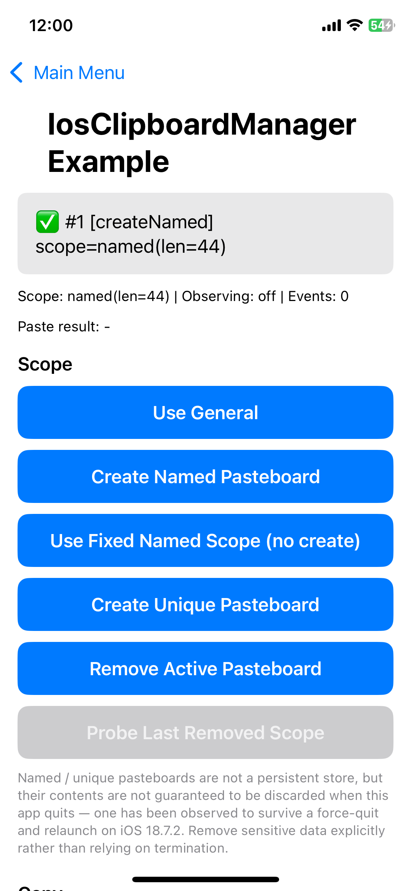
</p>

#### 名前付きスコープを参照（作成しない）

作成せずに名前を参照することもできますが、何かが作成するまでは、その名前に対する操作はすべて `CLIPBOARD_UNAVAILABLE` で失敗します。

```swift
let scope = PasteboardScope.named("com.jonghyunkim.nativetoolkit.example.sample")
```

#### ユニークペーストボードを作成

`.unique` は名前の生成をシステムに任せます。生成された名前は戻り値のスコープに含まれるため、そのペーストボードを再度使う場合は保持しておく必要があります。

```swift
Task {
    let scope = try await IosClipboardManager.shared.createPasteboard(.unique)
    // scope == .unique("<システムが生成した名前>")
}
```

<p align="center">
    
</p>

#### アクティブなペーストボードを削除

```swift
Task {
    try await IosClipboardManager.shared.removePasteboard(scope)
}
```

`.general` を削除しようとすると `ClipboardError.cannotRemoveGeneralPasteboard` を throw します。

<p align="center">
    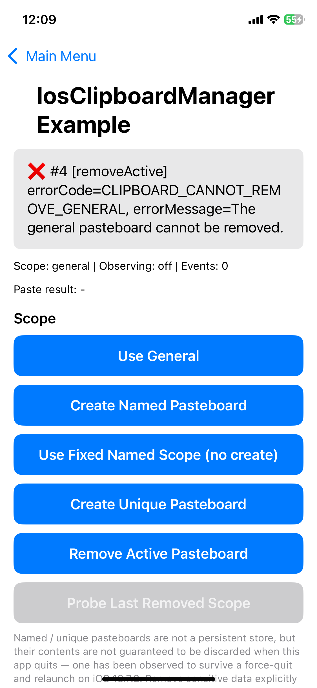
</p>

#### 名前付き / ユニークペーストボードは永続ストアではありません

`createPasteboard(.named(_:))` や `.unique` で作成したペーストボードは永続化を意図したものではありませんが、**作成したアプリの終了時に内容が破棄される保証もありません**。iOS 18.7.2 での実測では、アプリを強制終了して再起動した後も、終了前に書き込んだ名前付きペーストボードを読み取れました。システムは、そうしたペーストボードがいつ回収されるかを規定していません。

これらのスコープは起動中のアプリ同士でデータを受け渡す用途にのみ使用し、**機微データは `removePasteboard(_:)` で明示的に削除してください**。アプリの終了に破棄を期待しないでください。強制終了では `deinit` が実行されないため、ライブラリが終了時にクリーンアップを行っても、この状況には対処できません。

設計上、作成元アプリより長く存続させる必要がある共有には、App Group の共有コンテナを使用してください。これは本ライブラリの対応範囲外です。

---

### コピー

`copy` はペーストボードの内容を置き換えます。`ClipboardContent` が、対応するすべての形式を表します。

#### プレーンテキストをコピー

```swift
Task {
    try await IosClipboardManager.shared.copy(
        .plainText("Hello from IosLibraryExample"),
        scope: scope
    )
}
```

<p align="center">
    
</p>

#### プレーンテキストをコピー（空文字）

空文字も許容され、throw しません。

```swift
Task {
    try await IosClipboardManager.shared.copy(.plainText(""), scope: scope)
}
```

<p align="center">
    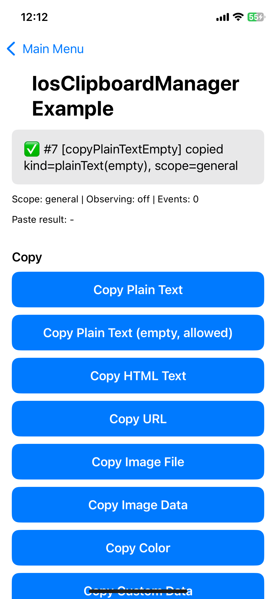
</p>

#### HTML テキストをコピー

2 つの表現を持つ 1 つのアイテムとして書き込まれるため、HTML を扱えないアプリでもプレーンテキストのフォールバックを取得できます。

```swift
Task {
    try await IosClipboardManager.shared.copy(
        .htmlText(plain: "plain body", html: "<b>html body</b>"),
        scope: scope
    )
}
```

<p align="center">
    
</p>

#### URL をコピー

URL は文字列として渡し、ライブラリ内で検証します。`http` / `https` / `file` スキームのみを受け付け、それ以外は `ClipboardError.invalidURL` を throw します。

```swift
Task {
    try await IosClipboardManager.shared.copy(.url("https://www.apple.com"), scope: scope)
}
```

<p align="center">
    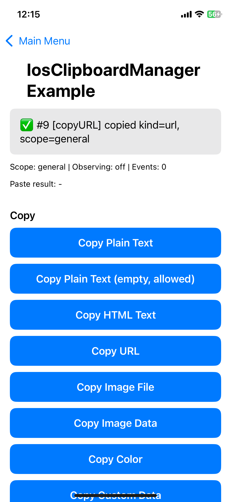
</p>

#### 画像ファイルをコピー

ファイルパスから画像を読み込みます。パスが存在しない場合は `ClipboardError.fileNotFound`、画像としてデコードできない場合は `ClipboardError.imageLoadFailed` を throw します。

```swift
Task {
    guard let path = Bundle.main.url(forResource: "app-icon-attachment", withExtension: "png")?.path else { return }
    try await IosClipboardManager.shared.copy(.imageFile(path: path), scope: scope)
}
```

<p align="center">
    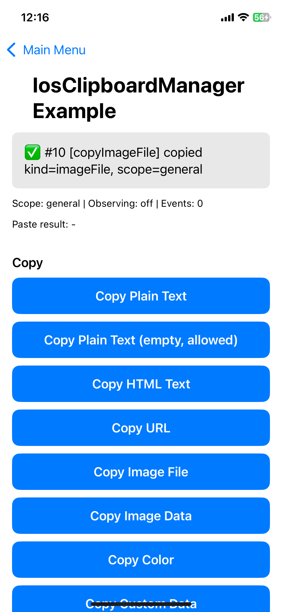
</p>

#### 画像データをコピー

画像のバイト列を、既知の画像 UTI を明示して書き込みます。画像としてデコードできないデータは `ClipboardError.invalidImageData` を throw します。

```swift
Task {
    guard let url = Bundle.main.url(forResource: "app-icon-attachment", withExtension: "png"),
          let data = try? Data(contentsOf: url) else { return }
    try await IosClipboardManager.shared.copy(
        .imageData(data, utType: "public.png"),
        scope: scope
    )
}
```

<p align="center">
    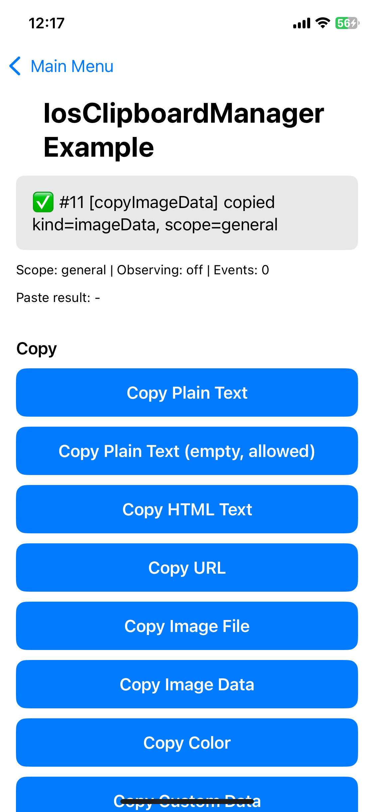
</p>

#### 色をコピー

RGBA の各成分は有限値かつ `0.0...1.0` の範囲である必要があります。範囲外の場合は `ClipboardError.invalidColor` を throw します。

```swift
Task {
    try await IosClipboardManager.shared.copy(
        .color(red: 0.2, green: 0.4, blue: 0.8, alpha: 1.0),
        scope: scope
    )
}
```

<p align="center">
    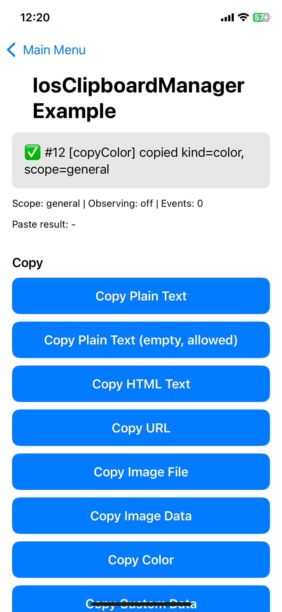
</p>

#### カスタムデータをコピー

アプリ定義の UTI で任意のバイト列を書き込みます。UTI は構文が検証され、不正な場合は `ClipboardError.invalidTypeIdentifier` を throw します。

```swift
Task {
    try await IosClipboardManager.shared.copy(
        .customData(Data([0xCA, 0xFE]), utType: "com.jonghyunkim.nativetoolkit.example.custom"),
        scope: scope
    )
}
```

<p align="center">
    
</p>

アプリの `Info.plist` に宣言していないカスタム UTI は `public.data` に適合しないため、`public.data` としてのファイルロードでは見つかりません。汎用ファイルとしてロードさせたい場合は、`public.data` 自体を指定してください。

```swift
Task {
    try await IosClipboardManager.shared.copy(
        .customData(Data(repeating: 0x41, count: 64), utType: "public.data"),
        scope: scope
    )
}
```

<p align="center">
    
</p>

#### 複数テキストをコピー

同じ形式のプレーンテキストを複数書き込みます。空配列は `ClipboardError.emptyItemList` を throw します。

```swift
Task {
    try await IosClipboardManager.shared.copy(
        .multipleText(["first", "second", "third"]),
        scope: scope
    )
}
```

<p align="center">
    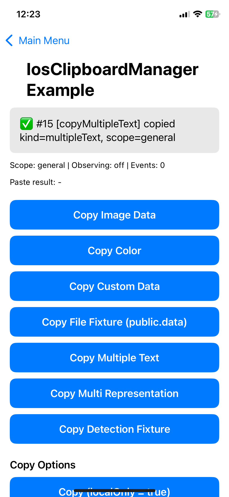
</p>

#### 複数表現をコピー

1 つのアイテムに複数の表現を UTI をキーとして持たせます。受け取る側のアプリが解釈できる表現を選びます。空の辞書は `ClipboardError.emptyItemList` を throw します。

```swift
Task {
    try await IosClipboardManager.shared.copy(
        .multiRepresentation([
            "public.plain-text": Data("multi representation".utf8),
            "public.utf8-plain-text": Data("multi representation".utf8)
        ]),
        scope: scope
    )
}
```

<p align="center">
    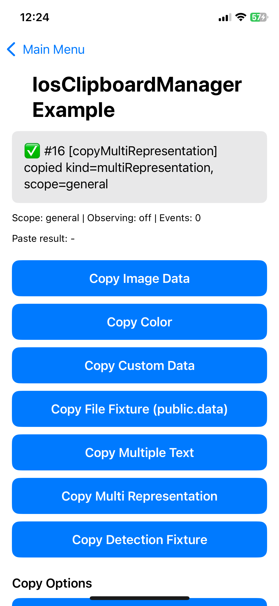
</p>

---

### コピーオプション

`ClipboardCopyOptions` は `copy` のプライバシー設定を表します。既定値は `localOnly: true`、有効期限なしです。

```swift
public struct ClipboardCopyOptions {
    public let localOnly: Bool       // 近くのデバイスへ転送しない（ユニバーサルクリップボード）
    public let expirationDate: Date? // この時刻を過ぎるとシステムがアイテムを破棄する
    public static let `default` = ClipboardCopyOptions(localOnly: true, expirationDate: nil)
}
```

#### localOnly を指定してコピー

`localOnly: true` は、ユニバーサルクリップボードで近くのデバイスへアイテムを渡さないようシステムに要求します。デバイス間の転送を意図する場合にのみ `false` を指定してください。

```swift
Task {
    try await IosClipboardManager.shared.copy(
        .plainText("LOCALONLY-BODY"),
        options: ClipboardCopyOptions(localOnly: true, expirationDate: nil),
        scope: scope
    )
}
```

<p align="center">
    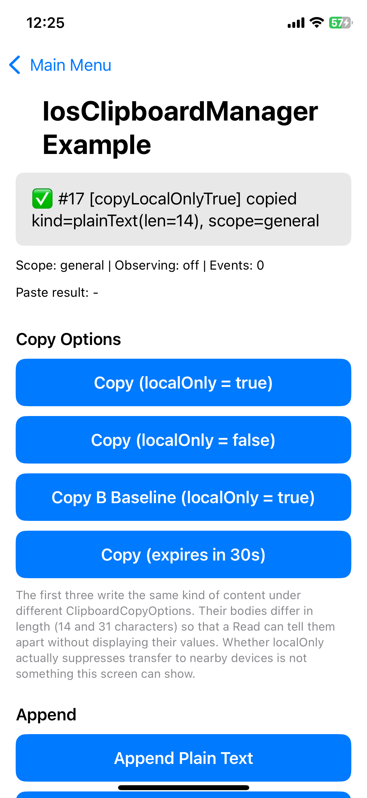
</p>

#### expirationDate を指定してコピー

指定する日時は未来である必要があります。過去の日時は `ClipboardError.invalidExpirationDate` を throw します。

```swift
Task {
    try await IosClipboardManager.shared.copy(
        .plainText("expiring body"),
        options: ClipboardCopyOptions(
            localOnly: true,
            expirationDate: Date().addingTimeInterval(30)
        ),
        scope: scope
    )
}
```

<p align="center">
    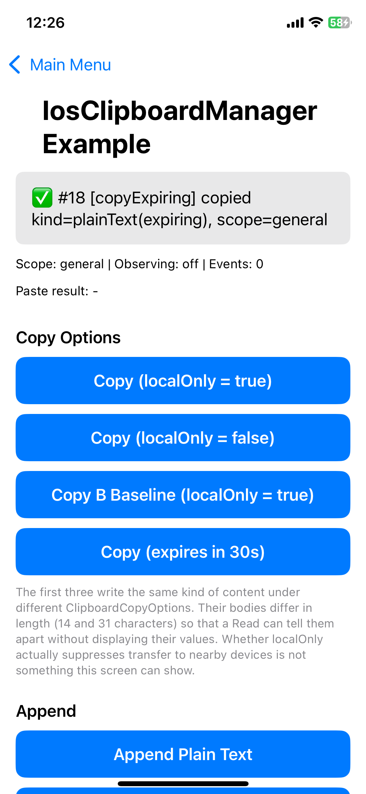
</p>

---

### 追記

`append` は、既にペーストボードにある内容を置き換えずにアイテムを追加します。

#### プレーンテキストを追記

```swift
Task {
    try await IosClipboardManager.shared.append(.plainText("appended item"), scope: scope)
}
```

<p align="center">
    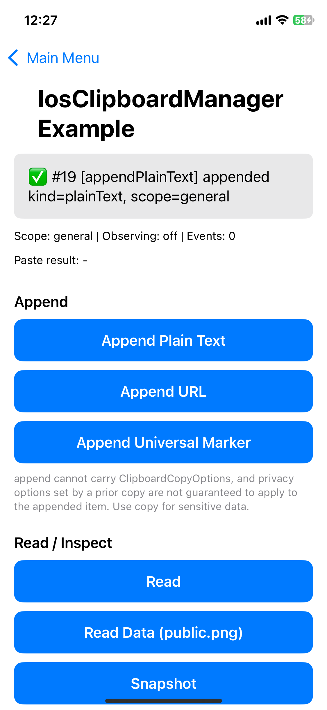
</p>

#### URL を追記

```swift
Task {
    try await IosClipboardManager.shared.append(.url("https://developer.apple.com"), scope: scope)
}
```

<p align="center">
    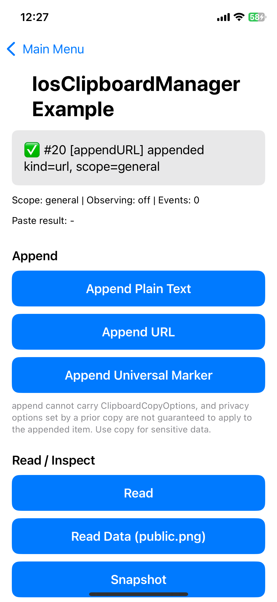
</p>

#### 追記はプライバシーオプションを引き継ぎません

`append` は `ClipboardCopyOptions` を受け取れず、直前の `copy` で指定した `localOnly` / `expirationDate` が追記したアイテムに適用される保証もありません。**機微データには必ず `copy(_:options:)` を使用してください。**

---

### 読み取り / 確認

#### 読み取り

ペーストボードを同期的に読み取ります。大きなペイロード（画像のバイト列）は結果に含まれず、UTI のみが報告されます。空のペーストボードはエラーではなく**正常な状態**で、`numberOfItems` が `0` になります。

```swift
Task {
    let result = try await IosClipboardManager.shared.read(scope: scope)
    print(result.numberOfItems)
    for item in result.items {
        // item.typeIdentifiers, item.text, item.urlString, item.imageDataUTType
    }
}
```

<p align="center">
    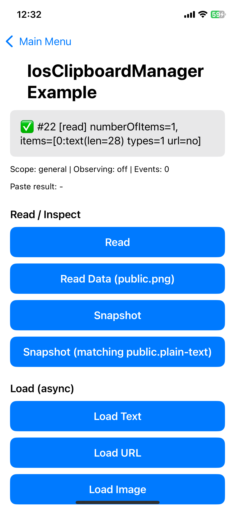
</p>

#### データを読み取り

指定した UTI で登録されたバイト列を返します。一致するアイテムがない場合は `nil` を返します。

```swift
Task {
    let data = try await IosClipboardManager.shared.readData(utType: "public.png", scope: scope)
    print(data?.count ?? 0)
}
```

<p align="center">
    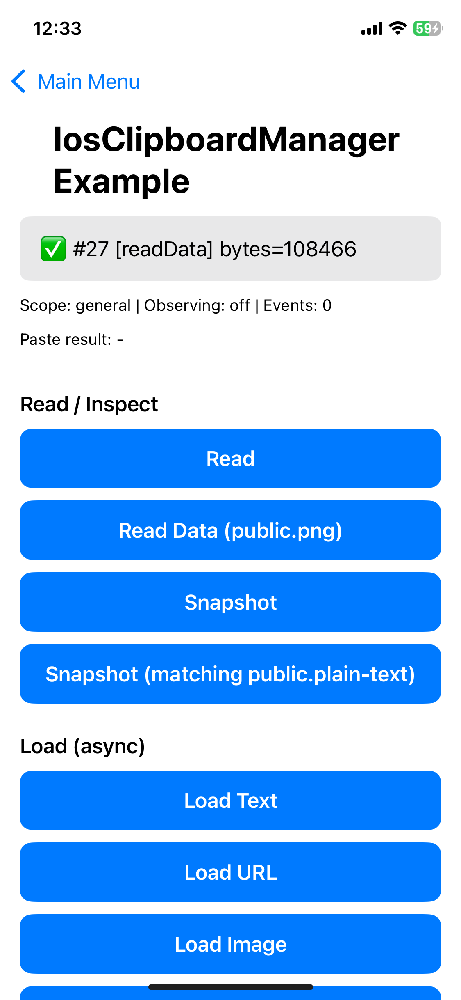
</p>

#### スナップショット

本文に触れず、メタデータのみを読み取ります。事前確認にはこちらを使用してください。iOS 16 以降の許可ダイアログと iOS 14 以降のアクセス通知のいずれも発生させないと Apple が明記している API のみで構成しています。

```swift
Task {
    let snapshot = try await IosClipboardManager.shared.snapshot(scope: scope)
    // snapshot.hasStrings, snapshot.hasURLs, snapshot.hasImages, snapshot.hasColors
    // snapshot.numberOfItems, snapshot.typeIdentifiers, snapshot.allTypeIdentifiers
    if snapshot.hasStrings {
        // ペースト用の UI を表示する
    }
}
```

<p align="center">
    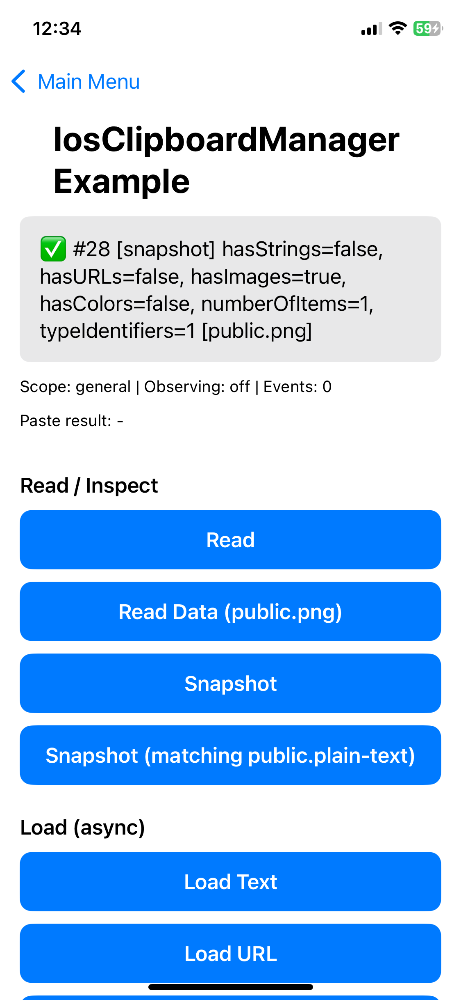
</p>

`hasStrings` では、特定の型としてのペーストが成功するかどうかは判断できません。たとえば `public.vcard` は `public.plain-text` のサブタイプではなく兄弟型のため、`hasStrings` を満たしていてもプレーンテキストとしてはロードできません。受け付ける型は明示的に宣言してください（[ペーストコントロール](#ペーストコントロール)を参照）。

#### スナップショット（型を指定）

`matchingTypes` を渡すと、指定した型を持つアイテムのインデックスも取得できます。`matchingTypes` を指定しなかった場合、`matchingItemIndexes` は `nil` になります。

```swift
Task {
    let snapshot = try await IosClipboardManager.shared.snapshot(
        matchingTypes: ["public.plain-text"],
        scope: scope
    )
    print(snapshot.matchingItemIndexes ?? [])
}
```

<p align="center">
    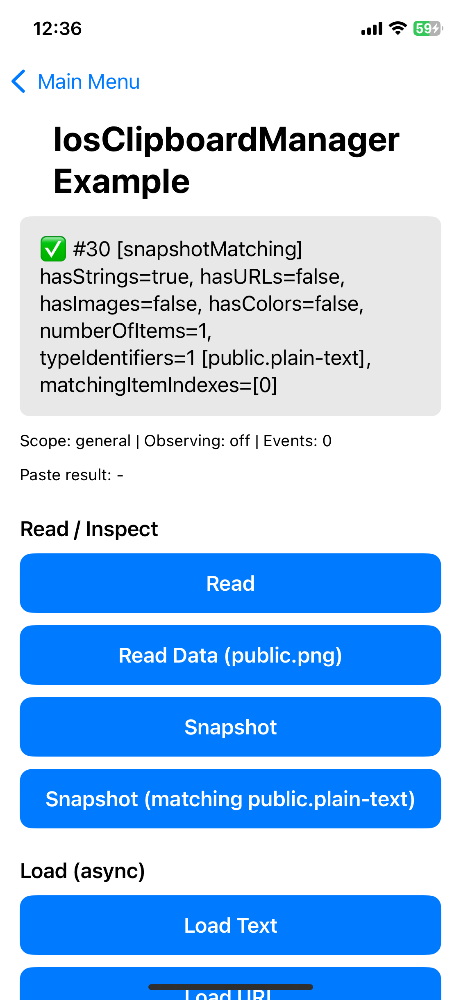
</p>

#### プライバシー: 確認ダイアログと通知

`read` / `readData` / `loadItem` はペーストボードからデータを取得するため、システムの判断により iOS 16 以降の許可ダイアログや iOS 14 以降のアクセス通知が表示されることがあります。事前確認には `snapshot` を使用してください。

`UIPasteControl`（`makePasteControl` 経由）は iOS 16 以降の許可ダイアログを回避しますが、iOS 14 以降のアクセス通知も回避すると Apple は明記していません。いずれかが表示されないことを前提にする場合は、対象 OS バージョンの実機で確認してください。

---

### 非同期ロード

`loadItem` は `NSItemProvider` 経由でアイテムを解決します。表現の変換や、メインスレッド外での画像デコードが可能です。`read` だけでは足りない場合に使用してください。

#### テキストをロード

```swift
Task {
    let item = try await IosClipboardManager.shared.loadItem(.text, scope: scope)
    if case .text(let value) = item {
        print(value.count)
    }
}
```

<p align="center">
    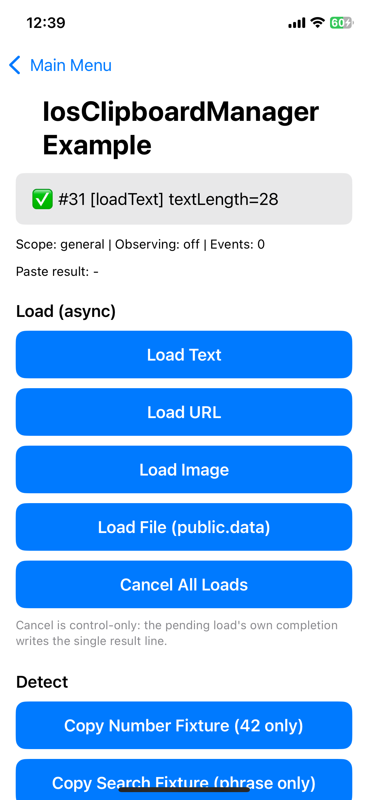
</p>

#### URL をロード

```swift
Task {
    let item = try await IosClipboardManager.shared.loadItem(.url, scope: scope)
    if case .url(let value) = item {
        print(value)
    }
}
```

<p align="center">
    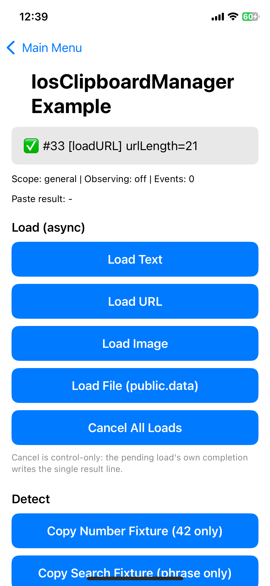
</p>

#### 画像をロード

画像はバックグラウンドの executor 上で PNG に再エンコードされるため、戻り値の UTI は常に `public.png` になります。

```swift
Task {
    let item = try await IosClipboardManager.shared.loadItem(.image, scope: scope)
    if case .imageData(let data, let utType) = item {
        print(data.count, utType)
    }
}
```

<p align="center">
    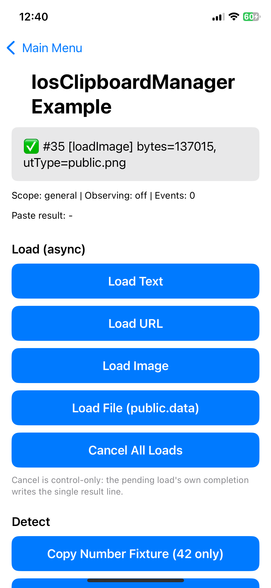
</p>

#### ファイルをロード

アイテムを一時ファイルにコピーし、その URL を引き渡します。**戻り値の URL とその親ディレクトリの所有権は呼び出し元に移る**ため、使い終わったら削除してください。引き渡されなかったファイル（失敗・キャンセル・タイムアウト）は、ライブラリ内部でクリーンアップします。

```swift
Task {
    let item = try await IosClipboardManager.shared.loadItem(
        .file(utType: "public.data"),
        scope: scope
    )
    if case .file(let url) = item {
        let size = (try? url.resourceValues(forKeys: [.fileSizeKey]).fileSize) ?? -1
        print(size)
        // ファイル単体ではなく、ライブラリが引き渡したディレクトリを削除します。
        try? FileManager.default.removeItem(at: url.deletingLastPathComponent())
    }
}
```

<p align="center">
    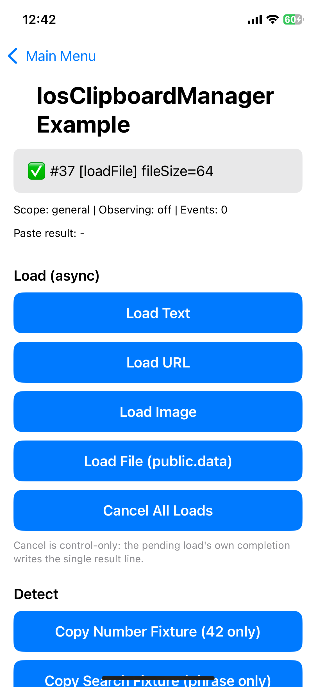
</p>

#### すべてのロードをキャンセル

保留中のロードをすべてキャンセルします。キャンセルされたロードは、`async throws` 形式では `ClipboardError.cancelled`（`CLIPBOARD_CANCELLED`）を throw し、コールバック形式では同じコードとともに `isSuccess == false` を報告します。呼び出し元は、これを無視してよい正常な結果として扱えます。

```swift
IosClipboardManager.shared.cancelAllLoads()
```

コールバック形式は `ClipboardLoadToken` を返すため、個別のロードだけをキャンセルすることもできます。

```swift
let token = IosClipboardManager.shared.loadItem(.image, scope: scope) { isSuccess, item, errorCode, errorMessage in
    print(isSuccess, errorCode ?? "nil")
}
token.cancel()
```

---

### 検出

データ検出は、本文を読み取らずに（したがって許可ダイアログを出さずに）、ペーストボードが何を含むかを報告します。

```swift
public enum ClipboardDetectionPattern: String, CaseIterable {
    case probableWebURL, probableWebSearch, number, link, emailAddress, phoneNumber
    case postalAddress, calendarEvent, flightNumber, moneyAmount, shipmentTrackingNumber
}
```

#### パターンを検出

要求したパターンのうち、検出されたものを返します。空のパターン集合を渡すと `ClipboardError.emptyDetectionPatterns` を throw します。

```swift
Task {
    let patterns = try await IosClipboardManager.shared.detectPatterns(
        Set(ClipboardDetectionPattern.allCases),
        scope: scope
    )
    print(patterns.map(\.rawValue).sorted())
}
```

<p align="center">
    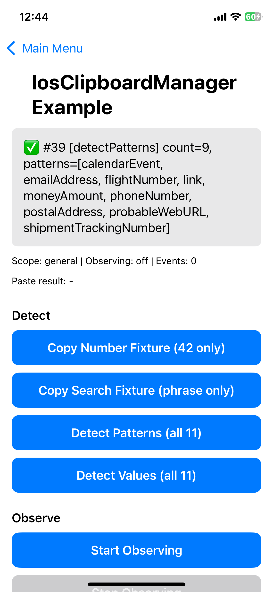
</p>

#### 値を検出

検出された値そのものを返します。この操作は内容を読み取るため、プライバシー上は `read` と同じ扱いにしてください。

```swift
Task {
    let values = try await IosClipboardManager.shared.detectValues(
        Set(ClipboardDetectionPattern.allCases),
        scope: scope
    )
    print(values.detectedPatterns.count)
    // values.links, values.emailAddresses, values.phoneNumbers, values.postalAddresses,
    // values.calendarEvents, values.flightNumbers, values.moneyAmounts,
    // values.shipmentTrackingNumbers, values.number, values.probableWebURL, values.probableWebSearch
}
```

<p align="center">
    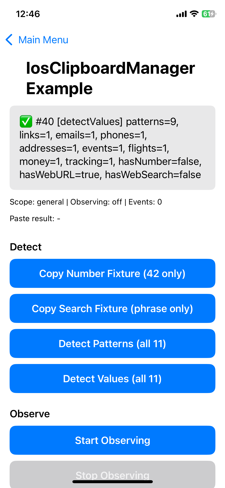
</p>

#### number と probableWebSearch はクリップボード全体を分類します

`number` と `probableWebSearch` は、内容から出現箇所を抽出するのではなく、クリップボード**全体**を分類します。数値に言及しているだけの文章は、数値でも検索語句でもありません。そのため、混在した内容ではこの 2 つのパターンは検出されません。これらを確認する場合は、値だけを単独でコピーしてください。

```swift
try await IosClipboardManager.shared.copy(.plainText("42"), scope: scope)                 // number
try await IosClipboardManager.shared.copy(.plainText("swift concurrency"), scope: scope)  // probableWebSearch
```

#### 検出にキャンセルトークンはありません

`detectPatterns` / `detectValues` は `UIPasteboard` の `async` 検出 API をラップしていますが、この API はキャンセルに対応していません。Task のキャンセルや内部の 5 秒タイムアウトは直ちに呼び出し元へ制御を返しますが、その裏でシステム呼び出しが動き続ける可能性があります。その結果は破棄されます。

---

### 変更監視

#### 監視を開始

1 つのスコープについて変更の監視を開始します。2 回目の呼び出し（同じスコープでも別のスコープでも）は、まず直前の監視を停止するため、同時に有効な購読は常に 1 つだけです。

イベントはメインスレッド上で配信されます。

```swift
do {
    try IosClipboardManager.shared.startObserving(scope: scope) { event in
        switch event.kind {
        case .changed(let typesAdded, let typesRemoved):
            print(typesAdded, typesRemoved)
        case .changedDetectedOnForeground:
            // フォアグラウンド復帰時の changeCount 比較で検出された変更
            break
        case .removed:
            // 名前付きペーストボード自体が削除された
            break
        }
    }
} catch let error as ClipboardError {
    // pasteboardUnavailable: スコープを解決できず、監視は開始されていません
    print(error.errorCode)
}
```

`UIPasteboard.changedNotification` は、**このアプリがフォアグラウンドにある間にこのアプリが行った変更**に対してのみ通知されます。他のアプリによる変更や、バックグラウンド中の変更では通知が発生しません。その場合は `checkForegroundChange` を使用してください。

#### 監視を停止

```swift
IosClipboardManager.shared.stopObserving()
```

監視を行っている画面を破棄するときに呼び出してください。

```swift
.onDisappear {
    IosClipboardManager.shared.stopObserving()
}
```

#### フォアグラウンド復帰時の変更確認

ペーストボードの `changeCount` を、このマネージャーが最後に記録した値と比較し、変化したかどうかを返します。通知が発生しない変更を拾うため、アプリがフォアグラウンドへ復帰したときに呼び出してください。

```swift
let changed = IosClipboardManager.shared.checkForegroundChange(scope: scope)
```

あるスコープに対する最初の呼び出しは基準値を確立するため、必ず `false` を返します。基準値は `startObserving` や変更通知の受信によっても更新されます。戻り値の `Bool` では「解決できて変化がない」と「解決できない」を区別できません。その違いが必要な場合は `snapshot` を使用してください。

---

### ペーストコントロール

`UIPasteControl` はシステムのペーストボタンです。ユーザーのタップ自体が同意にあたるため、iOS 16 以降の許可ダイアログを回避できます。

#### ペーストコントロールを作成

`makePasteControl` は、配置するだけで使える 1 つのビューを返します。内部のレシーバーは自動的にレスポンダチェーンへ加わるため、返されたビューをそのままビュー階層に追加してください。

`acceptedTypes` は空にできず（`ClipboardError.invalidRequest`）、各要素は有効な UTI である必要があります（`ClipboardError.invalidTypeIdentifier`）。

```swift
let pasteView = try IosClipboardManager.shared.makePasteControl(
    acceptedTypes: ["public.plain-text", "public.url", "public.image"],
    onPaste: { items in
        print(items.count)
    },
    onPartialFailure: { errors in
        // ペーストされたアイテムの一部をロードできなかった場合
        print(errors.map(\.errorCode))
    },
    onPasteFailure: { error in
        // ペースト自体が失敗した場合
        print(error.errorCode)
    }
)
```

`displayMode` の既定値は `.iconAndLabel` です。ボタンの見た目を変える場合は `.iconOnly` / `.labelOnly` / `.arrowAndLabel` を指定します。ペーストの動作はどのモードでも同じです。

SwiftUI では `UIViewRepresentable` でラップします。

```swift
struct ClipboardPasteControlView: UIViewRepresentable {
    let acceptedTypes: [String]
    let onPaste: ([ClipboardLoadedItem]) -> Void
    let onPartialFailure: ([ClipboardError]) -> Void
    let onPasteFailure: (ClipboardError) -> Void
    let onCreationFailure: (ClipboardError) -> Void

    func makeUIView(context: Context) -> UIView {
        do {
            return try IosClipboardManager.shared.makePasteControl(
                acceptedTypes: acceptedTypes,
                onPaste: onPaste,
                onPartialFailure: onPartialFailure,
                onPasteFailure: onPasteFailure
            )
        } catch let error as ClipboardError {
            // makeUIView 内で同期的に報告すると "Modifying state during view update" が発生する
            // ため、次のメインアクターのターンへ遅延させます。
            Task { @MainActor in onCreationFailure(error) }
            return UIView()
        } catch {
            Task { @MainActor in onCreationFailure(.unknown(ClipboardFailureDetail(systemError: error))) }
            return UIView()
        }
    }

    func updateUIView(_ uiView: UIView, context: Context) {}
}
```

<p align="center">
    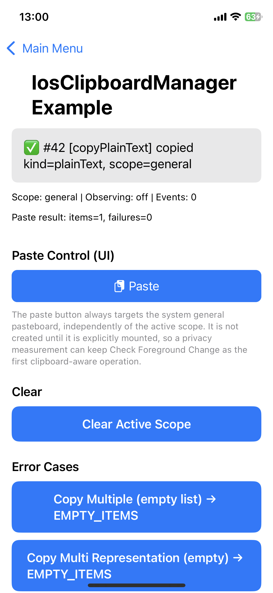
</p>

ペーストボタンは、他の箇所で使用している `scope` とは無関係に、常にシステムの一般ペーストボードを対象とします。

保留中のペーストがキャンセルされた場合（新しいペーストが発生した場合や、ビューが破棄された場合）、`onPaste` / `onPartialFailure` / `onPasteFailure` は**呼び出されません**。キャンセルは呼び出し元が起点であり、ペースト結果としては通知しません。

ボタンとレシーバーを個別に配置する必要がある高度なケースには `PasteControlFactory.makeComponents` を使用できます。その場合、レシーバーの保持と配置は**呼び出し元の責任**になります。

---

### クリア

スコープからすべてのアイテムを削除します。ペーストボード自体は残ります。

```swift
Task {
    try await IosClipboardManager.shared.clear(scope: scope)
}
```

<p align="center">
    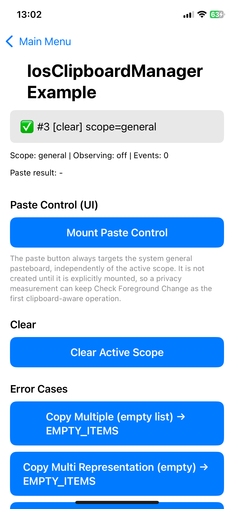
</p>

---

### エラー処理

`async throws` 形式は `ClipboardError` を throw します。コールバック形式は同じ失敗を `errorCode` / `errorMessage` で報告し、成功時はいずれも `nil` になります。

`errorMessage` はケースごとに固定の英語文字列で、**入力値を埋め込みません**。そのままログに出力しても安全です。

| `errorCode` | ケース | 原因 | エラーメッセージ |
|---|---|---|---|
| `CLIPBOARD_EMPTY_CONTENT` | `emptyContent` | テキストも HTML も含まない内容 | `"Clipboard content is empty. Please provide text or HTML."` |
| `CLIPBOARD_EMPTY_ITEMS` | `emptyItemList` | `.multipleText([])` または `.multiRepresentation([:])` | `"No items provided for clipboard copy."` |
| `CLIPBOARD_EMPTY_PATTERNS` | `emptyDetectionPatterns` | 空のパターン集合で検出を呼び出した | `"No detection patterns were specified."` |
| `CLIPBOARD_INVALID_URL` | `invalidURL` | URL が空、またはスキームが `http` / `https` / `file` 以外 | `"The URL is invalid."` |
| `CLIPBOARD_INVALID_TYPE` | `invalidTypeIdentifier` | UTI の構文が不正 | `"The uniform type identifier is invalid."` |
| `CLIPBOARD_INVALID_NAME` | `invalidPasteboardName` | ペーストボード名が空、または使用できない | `"The pasteboard name is invalid."` |
| `CLIPBOARD_INVALID_COLOR` | `invalidColor` | RGBA の成分が有限値でない、または `0.0...1.0` の範囲外 | `"Color components must be finite and within 0.0...1.0."` |
| `CLIPBOARD_INVALID_IMAGE_DATA` | `invalidImageData` | 渡されたバイト列を画像としてデコードできない | `"The provided image data could not be decoded."` |
| `CLIPBOARD_INVALID_EXPIRATION` | `invalidExpirationDate` | `expirationDate` が未来ではない | `"expirationDate must be in the future."` |
| `CLIPBOARD_INVALID_REQUEST` | `invalidRequest` | リクエストが不正（`acceptedTypes` が空など） | `"The request is invalid."` |
| `CLIPBOARD_CONTENT_TOO_LARGE` | `contentTooLarge` | ペイロードが上限（既定 64 MiB）を超えた | `"The clipboard content exceeds the configured size limit."` |
| `CLIPBOARD_FILE_NOT_FOUND` | `fileNotFound` | `.imageFile(path:)` のパスが存在しない | `"The requested file was not found."` |
| `CLIPBOARD_IMAGE_LOAD_FAILED` | `imageLoadFailed` | ファイルは存在するが画像としてデコードできない | `"Failed to load the image."` |
| `CLIPBOARD_IMAGE_ENCODE_FAILED` | `imageEncodingFailed` | ペーストされた画像を PNG に再エンコードできない | `"Failed to encode the pasted image."` |
| `CLIPBOARD_UNAVAILABLE` | `pasteboardUnavailable` | 名前付き / ユニークペーストボードを解決できない | `"The requested pasteboard is unavailable."` |
| `CLIPBOARD_CANNOT_REMOVE_GENERAL` | `cannotRemoveGeneralPasteboard` | `removePasteboard(.general)` を呼び出した | `"The general pasteboard cannot be removed."` |
| `CLIPBOARD_NO_MATCHING_ITEM` | `noMatchingItem` | 要求した型を持つアイテムがない | `"No clipboard item matches the requested type."` |
| `CLIPBOARD_LOAD_FAILED` | `providerLoadFailed` | `NSItemProvider` がアイテムのロードに失敗した | `"Failed to load the clipboard item."` |
| `CLIPBOARD_UNEXPECTED_TYPE` | `unexpectedType` | アイテムを要求した型へ変換できない | `"The clipboard item could not be converted to the requested type."` |
| `CLIPBOARD_FILE_COPY_FAILED` | `fileCopyFailed` | ペーストされたファイルの一時領域へのコピーに失敗した | `"Failed to copy the pasted file."` |
| `CLIPBOARD_CANCELLED` | `cancelled` | 呼び出し元がロードをキャンセルした | `"The clipboard load was cancelled."` |
| `CLIPBOARD_TIMED_OUT` | `timedOut` | 操作がタイムアウトした | `"The clipboard operation timed out."` |
| `CLIPBOARD_DETECTION_FAILED` | `detectionFailed` | データ検出システムが失敗を報告した | `"Pattern detection failed."` |
| `CLIPBOARD_UNKNOWN` | `unknown` | 分類できないシステムエラー | `"An unknown error occurred."` |

空のクリップボードは、これらのエラーには**該当しません**。`read` は `numberOfItems == 0` を返し、`readData` は `nil` を返します。いずれも正常な状態です。

```swift
Task {
    do {
        try await IosClipboardManager.shared.copy(.url("example.com"), scope: scope)
    } catch ClipboardError.invalidURL {
        // スキームがない
    } catch let error as ClipboardError {
        print(error.errorCode, error.errorDescription ?? "nil")
    }
}
```

---

## macOS

- ライブラリ: `mac-native-toolkit-1.3.0.xcframework`
- 最小デプロイメントターゲット: macOS 15
- 対応範囲: コピー / 追記、読み取りとスナップショット、名前付き・ユニークペーストボードのライフサイクル、パターン検出（macOS 15.4 以降）、変更監視、そして配置するだけで使える `PasteButton` を提供します。

### MacClipboardManager

`MacClipboardManager` は、`NSPasteboard` をラップするシングルトンクラスです。

本節のスクリーンショットは `MacLibraryExample` のものです。同アプリの Clipboard 画面は、以下の節と同じ順序で操作をまとめています。

<p align="center">
    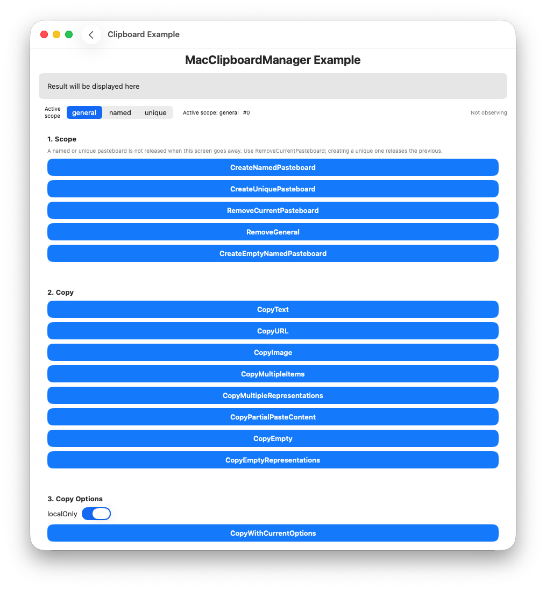
</p>

### セットアップ

1. `mac-native-toolkit-1.3.0.xcframework` を Xcode プロジェクトに追加します（プロジェクトにドラッグし、ターゲットの Frameworks, Libraries, and Embedded Content で "Embed & Sign" に設定します）。
2. クリップボードを使用するファイルでライブラリをインポートします。

```swift
import MacLibrary
```

追加の初期化や entitlement は不要です。

#### スレッド

すべての操作はメインアクター上で `NSPasteboard` に到達します。非同期メソッドは `async throws` なので、`Task` から呼び出してください。即座に完了する 4 つの操作は同期メソッドです: `accessBehavior(scope:)`、`startObserving(scope:interval:onEvent:)`、`stopObserving()`、`checkForegroundChange(scope:)`、および `makePasteButton` ファクトリです。

#### 2 つの呼び出し形式

各非同期操作には 2 つの形式があります。`async throws` 形式は Swift の呼び出し側向けです。`completion:` 形式は Unity ブリッジ向けで、C ABI をまたいで Swift のエラー処理を運べないため、`(isSuccess, value, errorCode, errorMessage)` として結果を返します。

```swift
// Swift
let ownership = try await MacClipboardManager.shared.copy(content)

// コールバック
MacClipboardManager.shared.copy(content) { isSuccess, ownership, errorCode, errorMessage in
    // メインアクター上でちょうど 1 回だけ実行されます
}
```

#### コンテンツは型識別子とバイト列の辞書です

`ClipboardContent` は item の順序付きリストを持ち、各 item は uniform type identifier からバイト列への辞書を持ちます。`.plainText` のような便宜的な case はありません。**書いたものがそのままペーストボードに載ります。**

```swift
let content = ClipboardContent(items: [
    ClipboardItemData(representations: [
        "public.utf8-plain-text": Data("Copied from MacLibraryExample.".utf8)
    ])
])
```

#### 既定値

| パラメータ | 既定値 | 意味 |
|---|---|---|
| `scope` | `.general` | システムのペーストボード |
| `options` | `.default` | `localOnly: true` |
| `interval`（監視） | `0.5` 秒 | ポーリング間隔。0 より大きく 60 秒以下 |
| `timeout`（ペーストボタン） | `15` 秒 | 貼り付けた item をロードする期限 |

### スコープ

スコープは `.general`、`.named(String)`、`.unique(String)` のいずれかです。general ペーストボードは常に存在します。名前付き・ユニークペーストボードは作成が必要で、**アプリを終了しても解放されません**。`removePasteboard(_:)` で解放してください。

#### 名前付きペーストボードの作成

`createPasteboard` はペーストボードを作成しますが、**同じ名前が既にある場合はそれを取得します**。そのため同じ名前で 2 回呼んでも、内容を保ったまま同じペーストボードが返ります。

```swift
Task {
    let scope = try await MacClipboardManager.shared.createPasteboard(.named("nt-sample"))
}
```

#### ユニークペーストボードの作成

ユニークペーストボードには毎回新しいシステム名が割り当てられます。2 つ目を作成すると 1 つ目を指す名前が失われるため、新しく作る前に前のものを解放してください。

```swift
Task {
    let scope = try await MacClipboardManager.shared.createPasteboard(.unique)
}
```

#### 現在のペーストボードの削除

```swift
Task {
    try await MacClipboardManager.shared.removePasteboard(scope)
}
```

#### general の削除（エラー 1508）

標準ペーストボードは解放できません。

```swift
Task {
    do {
        try await MacClipboardManager.shared.removePasteboard(.general)
    } catch let error as ClipboardError {
        print(error.errorCode)   // 1508
    }
}
```

#### 空の名前でのペーストボード作成（エラー 1505）

空の名前は拒否されます。

```swift
Task {
    do {
        _ = try await MacClipboardManager.shared.createPasteboard(.named(""))
    } catch let error as ClipboardError {
        print(error.errorCode)   // 1505
    }
}
```

### コピー

`copy` はペーストボードの所有権を取得して内容を置き換え、後で `append` が必要とする `PasteboardOwnership` を返します。

#### テキストのコピー

```swift
Task {
    let ownership = try await MacClipboardManager.shared.copy(
        ClipboardContent(items: [
            ClipboardItemData(representations: [
                "public.utf8-plain-text": Data("Copied from MacLibraryExample.".utf8)
            ])
        ]),
        scope: scope
    )
}
```

#### URL のコピー

```swift
Task {
    _ = try await MacClipboardManager.shared.copy(
        ClipboardContent(items: [
            ClipboardItemData(representations: [
                "public.url": Data("https://www.apple.com".utf8)
            ])
        ]),
        scope: scope
    )
}
```

#### 画像のコピー

```swift
Task {
    _ = try await MacClipboardManager.shared.copy(
        ClipboardContent(items: [
            ClipboardItemData(representations: ["public.png": pngData])
        ]),
        scope: scope
    )
}
```

#### 複数 item のコピー

すべての item がペーストボードに載ります。**そのうちどれを使うかは、受け取る側のアプリが決めます。** 例えば TextEdit はすべてを貼り付けます。

```swift
Task {
    _ = try await MacClipboardManager.shared.copy(
        ClipboardContent(items: [
            ClipboardItemData(representations: ["public.utf8-plain-text": Data("first".utf8)]),
            ClipboardItemData(representations: ["public.utf8-plain-text": Data("second".utf8)]),
        ]),
        scope: scope
    )
}
```

#### 複数 representation のコピー

1 つの item が同じ内容を 2 つの形式で持ちます。片方を読めないアプリでも、もう片方を見つけられます。

```swift
Task {
    _ = try await MacClipboardManager.shared.copy(
        ClipboardContent(items: [
            ClipboardItemData(representations: [
                "public.utf8-plain-text": Data(text.utf8),
                "public.rtf": Data(rtf.utf8),
            ])
        ]),
        scope: scope
    )
}
```

#### 空のコピー（エラー 1501）

```swift
Task {
    do {
        _ = try await MacClipboardManager.shared.copy(ClipboardContent(items: []), scope: scope)
    } catch let error as ClipboardError {
        print(error.errorCode)   // 1501
    }
}
```

#### representation が空の item のコピー（エラー 1502）

representation を持たない item は拒否されます。

```swift
Task {
    do {
        _ = try await MacClipboardManager.shared.copy(
            ClipboardContent(items: [ClipboardItemData(representations: [:])]),
            scope: scope
        )
    } catch let error as ClipboardError {
        print(error.errorCode)   // 1502
    }
}
```

### コピーオプション

`ClipboardCopyOptions(localOnly:)` は、内容を Universal Clipboard で他のデバイスへ提供するかどうかを決めます。

#### localOnly の既定値は true です

**明示的に指定しない限り、コピーした内容は他のデバイスへ共有されません。** `ClipboardCopyOptions.default` は `localOnly: true` であり、options を渡さない `copy` はこれを使用します。内容を他のデバイスへ渡したい場合は、`localOnly: false` を明示的に指定してください。

```swift
Task {
    let ownership = try await MacClipboardManager.shared.copy(
        content,
        options: ClipboardCopyOptions(localOnly: false),   // 他のデバイスへ共有する
        scope: scope
    )
}
```

2026-09-03 に macOS 26.3 と iOS 18.7.2 の間で Handoff 経由で計測しました。`localOnly: false` では約 1 秒で相手のデバイスに到達し、`localOnly: true` では到達せず、相手のデバイスは自身のクリップボードを保持し続けました。これは 1 組のデバイスでの計測であるため、すべてのデバイスと OS での保証ではなく、その組み合わせでの根拠として扱ってください。

### 追記

`append` は **ownership が指すペーストボード**に item を追加します。`append` 自体は scope を取りません。ownership が scope を運びます。

#### コピーしてから追記する

```swift
Task {
    let ownership = try await MacClipboardManager.shared.copy(content, scope: scope)
    let appended = try await MacClipboardManager.shared.append(more, ownership: ownership)
}
```

#### append は追記先のプライバシー設定を引き継ぎます

`localOnly: true` でコピーした内容に追記しても、ペーストボードが再公開されることはありません。元の内容も追記した item も、他のデバイスには届きません。上記と同じデバイスの組み合わせで 2026-09-03 に計測しました。

#### 所有権を失った状態での追記（エラー 1511）

他のアプリを含め、何かがペーストボードに書き込んだ時点で所有権は失われます。`append` は先に changeCount を照合し、書き込まずに throw します。

```swift
Task {
    do {
        _ = try await MacClipboardManager.shared.append(late, ownership: stale)
    } catch let error as ClipboardError {
        print(error.errorCode)   // 1511
    }
}
```

自分のアプリが所有権を奪った場合も、他のアプリが奪った場合も、エラーは同じです。ライブラリは「所有権がもう成立しない」ことを報告するのであって、誰が奪ったかは報告しません。

### 読み取り / 検査

#### Read

`read` はすべての item を、その全 representation とともに返します。

```swift
Task {
    let result = try await MacClipboardManager.shared.read(scope: scope)
    for (index, item) in result.items.enumerated() {
        print(index, item.totalBytes, item.representations.keys.sorted())
    }
}
```

返ってくる内容について、コードを書く前に知っておくべきことが 2 つあります。

**item は、書いた側が指定した数より多くの representation を持ちます。** AppKit が独自にテキスト形式を追加するためです。TextEdit からリッチテキストをコピーすると、`public.rtf`、`public.utf8-plain-text`、`public.utf16-external-plain-text` が同時に載ります。必要な型を照合してください。型の集合を完全一致で比較しないでください。

**`totalBytes` は全 item・全 representation の合計であり、コピーした対象の大きさではありません。** Finder でテキストファイルを 1 つコピーすると約 850 KB になりました。ペーストボードがファイルのアイコンを `com.apple.icns` として一緒に運ぶためです。

#### 特定の型の読み取り

`readData` は 1 つの型のバイト列を返し、その型が無い場合は `nil` を返します。**型が無いことは通常の結果であり、エラーではありません。**

```swift
Task {
    let data = try await MacClipboardManager.shared.readData(
        utType: "public.utf8-plain-text",
        scope: scope
    )
    print(data?.count ?? -1)   // 平文が無い場合は nil
}
```

Finder でコピーしたファイルは `public.utf8-plain-text` を持っており、そのバイト列は一般にファイルの完全パスです。読み取った内容は、利用者が渡すつもりでなかった情報を含みうるものとして扱ってください。

#### Snapshot

`snapshot` は内容を読まずに、型と changeCount を報告します。

```swift
Task {
    let snapshot = try await MacClipboardManager.shared.snapshot(scope: scope)
    print(snapshot.itemTypes.count, snapshot.changeCount)
}
```

#### 型フィルタ付きの Snapshot

```swift
Task {
    let snapshot = try await MacClipboardManager.shared.snapshot(
        matchingTypes: ["public.utf8-plain-text"],
        scope: scope
    )
    print(snapshot.matchingItemIndexes)
}
```

#### 空フィルタでの Snapshot（エラー 1512）

空のフィルタは何にも一致しません。それは呼び出し側から見ると「ペーストボードが空」と区別がつかないため、拒否されます。

```swift
Task {
    do {
        _ = try await MacClipboardManager.shared.snapshot(matchingTypes: [], scope: scope)
    } catch let error as ClipboardError {
        print(error.errorCode)   // 1512
    }
}
```

#### Access Behavior

同期メソッドです。システムがこのペーストボードのプログラムからの読み取りをどう扱うかを報告します。

```swift
let behavior = try MacClipboardManager.shared.accessBehavior(scope: scope)
```

### 検出

検出には **macOS 15.4 以降**が必要です。それ未満では、内容を読まずに `detectionUnavailable`（1513）を throw します。

#### パターンの検出

内容を読まずに、どのパターンが一致するかを報告します。

```swift
Task {
    let found = try await MacClipboardManager.shared.detectPatterns(
        [.probableWebURL, .links, .emailAddresses],
        scope: scope
    )
}
```

#### 値の検出

一致した値を返します。**この操作は内容を読み取ります**ので、利用者の操作を起点に呼び出してください。

```swift
Task {
    let values = try await MacClipboardManager.shared.detectValues(
        [.probableWebURL, .links, .emailAddresses],
        scope: scope
    )
    print(values.links.count, values.emailAddresses.count)
}
```

#### メタデータの検出

```swift
Task {
    let metadata = try await MacClipboardManager.shared.detectMetadata(scope: scope)
}
```

#### パターンを指定しない検出（エラー 1503）

```swift
Task {
    do {
        _ = try await MacClipboardManager.shared.detectPatterns([], scope: scope)
    } catch let error as ClipboardError {
        print(error.errorCode)   // 1503
    }
}
```

### 監視

#### 監視の開始

同期メソッドです。`onEvent` は、ペーストボードが変化するたびにメインアクター上で実行されます。

```swift
try MacClipboardManager.shared.startObserving(scope: scope) { event in
    print(event.changeCount)
}
```

アプリが非アクティブの間、監視は停止し、復帰時に照合します。**バックグラウンドの間に 3 回変化があっても、届くイベントは 1 回です。** ペーストボードは過去に保持していた内容の履歴を持たないためです。

#### 不正な間隔（エラー 1523）

間隔は 0 より大きく、60 秒以下である必要があります。

```swift
do {
    try MacClipboardManager.shared.startObserving(scope: scope, interval: 0) { _ in }
} catch let error as ClipboardError {
    print(error.errorCode)   // 1523
}
```

#### 監視の停止

冪等で、throw しません。画面が破棄されるときに呼び出してください。マネージャは共有されているため、呼ばないとポーリングが続きます。

```swift
MacClipboardManager.shared.stopObserving()
```

#### 前面復帰時の変更確認

同期メソッドです。このアプリが最後に見た時点からペーストボードが変化したかを報告し、そのスコープでの初回呼び出しでは `true` を返します。

```swift
let changed = try MacClipboardManager.shared.checkForegroundChange(scope: scope)
```

**監視と併用せず、監視の代わりに使用してください。** 両者は同じ基準を共有するため、監視が動作している間は、この呼び出しはほぼ常に `false` を返します。ポーリングが既に変化を検出し、`onEvent` で報告済みだからです。

### ペーストコントロール

`makePasteButton` は、システムのペーストボタンを `NSView` として返します。同期メソッドです。ビューの生成は即座に完了するファクトリ操作であり、押下時に始まるロードは `onPaste` で報告されます。

```swift
let button = try MacClipboardManager.shared.makePasteButton(
    acceptedTypes: ["public.utf8-plain-text", "public.png"],
    timeout: 5
) { result in
    print(result.items.count, result.failures.count, result.isPartial)
}
```

SwiftUI では `NSViewRepresentable` でホストし、**生成は 1 回だけ**にしてください。呼び出すたびにローダーが登録されます。

```swift
struct PasteButtonHost: NSViewRepresentable {
    let view: NSView
    func makeNSView(context: Context) -> NSView { view }
    func updateNSView(_ nsView: NSView, context: Context) {}
}
```

<p align="center">
    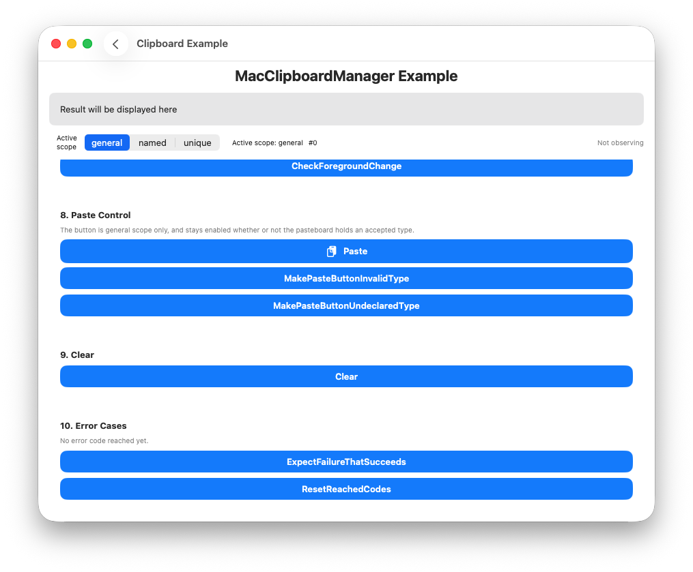
</p>

システムのコントロールの挙動から、次の 3 点が導かれます。

**このボタンは general スコープ専用です。** 他の呼び出しがどのスコープを使っていても、システムのペーストボードから貼り付けます。

**システムは `acceptedTypes` に一致するものだけをローダーに渡します。** 受け入れていない型の item は届きません。受け入れる item と受け入れない item を 1 つずつ持つペーストボードを貼り付けても、結果は item 1 件であり、部分失敗にはなりません。

**ボタンは常に押せる状態です。** 受け入れる型がペーストボードに無くても無効化されません。

#### 不正な型識別子（エラー 1504）

システムが解決できない型識別子は、押下時ではなくボタンの生成時に拒否されます。

```swift
do {
    _ = try MacClipboardManager.shared.makePasteButton(acceptedTypes: ["not a uti"]) { _ in }
} catch let error as ClipboardError {
    print(error.errorCode)   // 1504
}
```

### クリア

`clear` はペーストボードを空にし、**ペーストボードの新しい changeCount** を返します。これは `clearContents()` が返す値であり、削除した item の数ではありません。

```swift
Task {
    let changeCount = try await MacClipboardManager.shared.clear(scope: scope)
}
```

### エラー処理

すべての操作は `ClipboardError` を throw します。このエラーは `errorCode` と `errorMessage` を持ちます。

```swift
Task {
    do {
        _ = try await MacClipboardManager.shared.copy(content, scope: scope)
    } catch let error as ClipboardError {
        print(error.errorCode, error.errorMessage)
    }
}
```

| コード | ケース | 発生条件 |
|---|---|---|
| 1501 | `emptyContent` | item が 0 件の `copy` / `append` |
| 1502 | `emptyRepresentations` | representation を持たない item |
| 1503 | `emptyDetectionPatterns` | パターン集合が空の検出 |
| 1504 | `invalidTypeIdentifier` | システムが解決できない型識別子 |
| 1505 | `invalidPasteboardName` | 空、または不正なペーストボード名 |
| 1506 | `contentTooLarge` | 内容がサイズ上限を超えた |
| 1507 | `pasteboardUnavailable` | 名前付きペーストボードを解決できない |
| 1508 | `cannotReleaseStandardPasteboard` | 標準ペーストボードへの `removePasteboard` |
| 1509 | `writeRejected` | ペーストボードが書き込みを拒否した |
| 1510 | `appendRejected` | 所有権は成立しているが、ペーストボードが追記を拒否した |
| 1511 | `ownershipLost` | コピー以降に他の何かがペーストボードに書き込んだ |
| 1512 | `emptyTypeFilter` | フィルタが空の `snapshot` |
| 1513 | `detectionUnavailable` | macOS 15.4 未満での検出 |
| 1514 | `detectionDenied` | 検出中に利用者がアクセスを拒否した（後述） |
| 1515 | `detectionFailed` | それ以外の理由で検出が失敗した |
| 1521 | `pasteLoadFailed` | 貼り付け後に item をロードできなかった |
| 1522 | `pasteLoadTimedOut` | 貼り付けのロードが期限を超えた |
| 1523 | `invalidConfiguration` | 監視間隔が 0〜60 秒の範囲外 |
| 1524 | `cancelled` | 操作がキャンセルされた |
| 1599 | `unknown` | それ以外 |

#### 1514 について

1514 は、検出中に利用者がペーストボードの内容へのアクセスを拒否したことを表します。**ただし macOS でこの経路が発生することは未確認です。** 検証時に検出のプロンプトは一度も表示されておらず、拒否は 1515 として届く可能性があります。

**1514 だけで分岐しないでください。** 拒否と通常の検出失敗を同じ扱いにし、どちらも「内容を検出できなかった」として処理してください。この扱いであれば、どちらに転んでも正しく動作します。

#### 通常の利用では発生しないエラーコード

1506、1507、1509、1510、1521、1522、1524 は、API が報告しうるものの、アプリケーションから意図的に発生させることが難しい条件を表します。受け取ったコードを調べられるように一覧に載せているだけであり、それぞれに分岐を書く必要はありません。

---

## Windows

Win32 のクリップボードと WinRT のクリップボード履歴です。Windows 11 以降が必要です。Windows ライブラリは、1 つの実装を 2 つの公開 API から提供します。サンプルアプリは C++ API を使用しています。

| API | 名前 | ヘッダー | NuGet パッケージ |
|---|---|---|---|
| C++ API | `NativeToolkit::Clipboard` | `<NativeToolkit/Clipboard.h>` | `NativeToolkit` |
| C ABI | `ntk_clipboard_*` | `<NativeToolkitC/Clipboard.h>` | `NativeToolkit.CApi` |

- 対応範囲: テキスト・HTML・ファイル・画像・独自形式のコピーと貼り付け、複数形式の同時書き込み、内容の検査、変更の監視、遅延レンダリング、クリップボード履歴です。

この節のスクリーンショットは `WindowsLibraryExample` のものです。サンプルのクリップボード画面は、以下の節と同じ順序で操作を並べています。

<p align="center">
    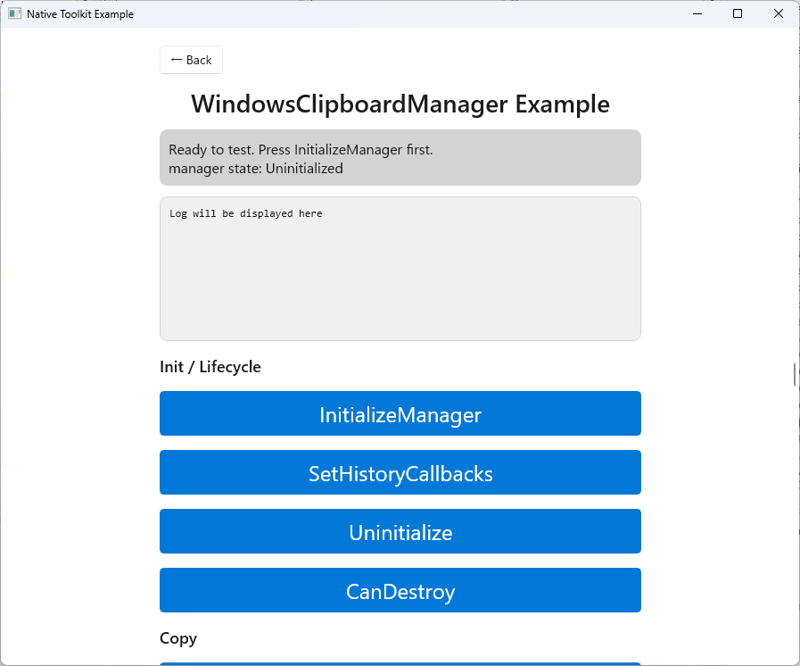
</p>

---

### セットアップ

```cpp
#include <NativeToolkit/Clipboard.h>

namespace Clipboard = NativeToolkit::Clipboard;
```

#### オーナー STA スレッド

`Clipboard::Session::Create` を呼んだスレッドがセッションの所有者になり、次の 2 つの責任を負います。

1. セッションが生きている間、メッセージループを回し続けること。実行時には確認できないため、エラーではなく呼び出し側との約束です。
2. すでに STA（シングルスレッドアパートメント）であること（`CoInitializeEx` に `COINIT_APARTMENTTHREADED`、または `winrt::init_apartment(winrt::apartment_type::single_threaded)`）。こちらは**確認します**。MTA や未初期化のスレッドでは `ErrorCode::WrongApartment` になり、セッションは作られません。

アパートメントの初期化・解除はツールキットでは行いません。ホスト側のものです。

クリップボードはプロセスに 1 つなので、2 回目の `Create` は失敗します。所有スレッドからなら `ErrorCode::NotSupported`、ほかのスレッドからなら `ErrorCode::WrongThread` です。

プロセス全体の状態を触る操作は所有スレッド専用で、ほかのスレッドからは `ErrorCode::WrongThread` になります: `SetHistoryHandlers`、`Close`、`ReserveDeferred`、`RecoverDeferredState` です。ハンドラーはすべて所有スレッドで呼ばれます。

ハンドラーの中でセッションを破棄しないでください。`Close` と `SetHistoryHandlers` も呼べません。渡すハンドラーでセッションを捕捉するのも循環になるため避けてください。

#### 同期と非同期の操作

| 形式 | 結果 | 対象 |
|---|---|---|
| 同期 | 戻る前に `Clipboard::Result<T>` | コピー・貼り付け・検査のすべて |
| 非同期リクエスト | `Clipboard::Result<RequestId>`。ハンドラーはちょうど 1 回 | 履歴の 5 つの操作 |

受け付けられたリクエストは `RequestId` を返し、そのハンドラーは所有スレッドでちょうど 1 回呼ばれます。受け付けられなかった場合は失敗が返り、ハンドラーは呼ばれません。

値には型が付きます。読み取りは `std::wstring` や `std::vector<std::byte>` をそのまま返すので、サイズを問い合わせる呼び出しもバッファの管理もありません。

#### 書き込みオプション

コピー系の操作はすべて `Clipboard::WriteOptions` を受け取ります。Windows が内容をどこまで広げてよいかを指定します。どちらの項目も既定は許可です。

| 項目 | 効果 |
|---|---|
| 何も設定しない | 制限しません |
| `excludeFromHistory` | クリップボード履歴（Win+V）に残しません |
| `excludeFromRoaming` | 他の端末へ同期しません |
| 両方 | C ABI が SENSITIVE と呼ぶ状態です |

これらは履歴と同期にのみ効きます。いずれを指定して書き込んだ内容も、Ctrl+V では通常どおり貼り付けられます。マーカーの設定はベストエフォートではありません。失敗した場合は書き込み全体が巻き戻ります。

---

### 初期化 / ライフサイクル

#### セッションの作成

```cpp
#include <optional>

// ムーブ専用で、作成した画面より長く生きます。
std::optional<Clipboard::Session> g_session;

void OnClipboardChanged()
{
    // このセッション以外がクリップボードに書き込みました。
    // 所有スレッドで呼ばれ、原因となった呼び出しの中では呼ばれません。
}

Clipboard::SessionOptions options;
// 空のままにすると、リスナーの登録自体を行いません。
options.onClipboardChanged = &OnClipboardChanged;

auto created = Clipboard::Session::Create(options);
if (created.has_value())
{
    g_session.emplace(std::move(created).value());
}
else
{
    // WrongApartment: 呼び出したスレッドが初期化済みの STA ではありません。
    const Clipboard::ErrorCode code = created.error().code;
}
```

#### 履歴イベントのハンドラー

所有スレッド専用です。既定構築した `HistoryHandlers` を渡すと、すべての登録が解除されます。`onHistoryChanged` は項目が追加されたときに呼ばれます。削除やクリアでは呼ばれません。

```cpp
Clipboard::HistoryHandlers handlers;
handlers.onHistoryChanged = &OnHistoryChanged;                  // void()
handlers.onHistoryEnabledChanged = &OnHistoryEnabledChanged;    // void(bool)
handlers.onRoamingEnabledChanged = &OnRoamingEnabledChanged;    // void(bool)

const auto result = g_session->SetHistoryHandlers(std::move(handlers));
// 失敗した場合は、以前のハンドラーがそのまま残ります。
```

#### 終了処理

所有スレッド専用です。閉じるのは呼び出し側の責任です。`Close` は終えられなかった理由を返すので、受け取った側でやり直してください。`WrongThread` 以外の失敗では、セッションは開いたままで、後の試行で解消することがあります。所有スレッドのメッセージループから（たとえば毎フレーム）、成功するまで `Close` を呼んでください。

処理中のリクエストは取り消され、その完了は `Close` の中で届きます。取り消された履歴のリクエストが始めていた処理は、取り消しでは止まりません。その WinRT の処理が終わるまで `Close` は `Busy` を返し、処理は所有スレッドがメッセージを処理している間にしか終わりません。メッセージを処理せずにやり直し続けると、`Busy` のままです。

```cpp
const auto closed = g_session->Close();
if (closed.has_value())
{
    g_session.reset();
}
else
{
    // まだ閉じていません: Busy（履歴のリクエストの WinRT の処理か、別スレッドの
    // 読み書きが残っている）、Canceled、PartialState、MonitorRegisterFailed。
    // メッセージの処理を続け、もう一度 Close を呼びます。
}
```

閉じることに成功しないまま破棄すると、セッションは**放棄**されます。ウィンドウ・リスナー・処理中のリクエストはプロセス終了まで残り、以後 `Create` は失敗し続け、元に戻す方法はありません。

#### 破棄可能かの確認

2 回の `Close` の間で、始まった終了処理に待つものが残っていないかを答えます。まだ閉じ始めていない開いたセッションは false、閉じたセッションは true を返します。そのため、最初に `Close` を呼ぶかどうかの判断には使えません。

```cpp
const bool canClose = !g_session.has_value() || g_session->CanClose();
```

---

### コピー

#### プレーンテキストのコピー

```cpp
const auto result = g_session->CopyText(L"Hello from native-toolkit", Clipboard::WriteOptions{});
```

#### 空文字列のコピー

空文字列は正しい値であり、エラーではありません。

```cpp
const auto result = g_session->CopyText(L"", Clipboard::WriteOptions{});
```

#### HTML のコピー

CF_HTML のヘッダーはライブラリの中で組み立てます。2 番目の引数は、同時に書き込むプレーンテキストの代替です。

```cpp
const auto result = g_session->CopyHtml(
    L"<b>Hello</b> from native-toolkit",   // HTML の断片
    L"Hello from native-toolkit",          // プレーンテキストの代替
    Clipboard::WriteOptions{});
```

#### ファイルのコピー

各パスはフルパスで、一覧を空にはできません。

```cpp
const std::vector<std::wstring> paths{ firstFilePath, secondFilePath };
const auto result = g_session->CopyFiles(paths, Clipboard::WriteOptions{});
```

#### 画像のコピー

バイト列はパックされた DIB（`BITMAPINFOHEADER`、あればカラーテーブル、画素）です。ヘッダーはライブラリが検査します。

```cpp
const std::vector<std::byte> dib = BuildSampleDib();  // 8x8、32bpp、BI_RGB
const auto result = g_session->CopyDib(dib, Clipboard::WriteOptions{});
```

#### 独自形式のコピー

標準の形式名でない場合は、Windows に登録されます。

```cpp
const std::vector<std::byte> blob = ToBytes("native-toolkit-sample-payload");
const auto result = g_session->CopyCustom(L"NativeToolkitSample", blob, Clipboard::WriteOptions{});
```

#### 複数形式の同時コピー

1 回の書き込みで複数の形式を配置します。1 項目はテキスト・HTML・バイト列のいずれかで、混ざることはありません。配置の順序は受け取るアプリから見える情報なので、いちばん豊かな形式を先頭に置きます。

```cpp
const std::vector<Clipboard::FormatPayload> items{
    Clipboard::HtmlPayload{ L"HTML Format", L"<b>Hello</b> from native-toolkit" },
    Clipboard::TextPayload{ L"CF_UNICODETEXT", L"Hello from native-toolkit" },
    Clipboard::BytesPayload{ L"CF_DIB", BuildSampleDib() },
};
const auto result = g_session->CopyMultiple(items, Clipboard::WriteOptions{});
```

形式名が重複している場合や、形式に合わない値を入れた項目がある場合は `ErrorCode::InvalidParameter` になり、何も書き込まれません。

---

### 書き込みオプション

```cpp
// 両方の除外を同時に指定します。C ABI が SENSITIVE と呼ぶ状態です。
const Clipboard::WriteOptions sensitive{ true, true };
const auto result = g_session->CopyText(L"Sensitive sample value", sensitive);

// 片方ずつ指定することもできます。
const Clipboard::WriteOptions excludeHistory{ true, false };
const Clipboard::WriteOptions excludeRoaming{ false, true };
```

---

### 貼り付け

#### プレーンテキストの貼り付け

```cpp
const auto text = g_session->PasteText();
if (text.has_value())
{
    const std::wstring& value = text.value();
}
else if (text.error().code == Clipboard::ErrorCode::FormatUnavailable)
{
    // クリップボードにテキストがありません。
}
```

#### HTML の貼り付け

CF_HTML のヘッダーを取り除いた断片を返します。

```cpp
const auto html = g_session->PasteHtml();
```

#### ファイルの貼り付け

```cpp
const auto files = g_session->PasteFiles();
if (files.has_value())
{
    for (const std::wstring& path : files.value())
    {
        // 受け取ったファイル 1 件です。
    }
}
```

#### 画像の貼り付け

クリップボードにあるパックされた DIB をそのまま返します。

```cpp
const auto pasted = g_session->PasteDib();
if (pasted.has_value())
{
    const std::vector<std::byte>& dib = pasted.value();
}
```

#### 独自形式の貼り付け

```cpp
const auto pasted = g_session->PasteCustom(L"NativeToolkitSample");
```

---

### 検査 / クリア

#### 形式の有無

```cpp
const auto present = g_session->HasFormat(L"CF_UNICODETEXT");
const bool yes = present.has_value() && present.value();
```

#### 形式一覧の取得

いまクリップボードにある形式を名前で返します。

```cpp
const auto formats = g_session->GetFormats();
```

#### 優先形式の取得

Windows が最初に渡す形式です。空文字列は候補が無いことを意味します。

```cpp
const auto name = g_session->GetPreferredFormat();
```

#### クリップボードのクリア

```cpp
const auto result = g_session->Clear();
```

---

### 遅延レンダリング

バイト列を用意せずに形式だけを提示し、他のアプリが貼り付けたときに初めてプロバイダーへ要求します。

#### 形式の予約

所有スレッド専用です。プロバイダーは所有スレッドで、データを集めるメッセージの中から呼ばれます。そのため 3 つの厳しい制限があります。クリップボードの操作を一切呼べないこと、ブロックしないこと、セッションを捕捉しないことです。

```cpp
Clipboard::Result<std::vector<std::byte>> RenderDeferredFormat(std::wstring_view formatName)
{
    const auto it = g_deferredPayloads.find(std::wstring(formatName));
    if (it == g_deferredPayloads.end())
    {
        return NativeToolkit::Unexpected{ Clipboard::Error{ Clipboard::ErrorCode::FormatUnavailable } };
    }
    return it->second;   // 形式を提示した時点で確定させたバイト列です。
}

const std::vector<std::wstring> formats{ L"HTML Format", L"CF_UNICODETEXT" };
const auto result = g_session->ReserveDeferred(formats, &RenderDeferredFormat);
```

失敗を返したり例外を投げたりすると、その形式は空として渡ります。その時点で相手のアプリは貼り付けの途中で、報告できる相手がいないためです。どちらもログには残ります。

#### 部分状態からの復旧

所有スレッド専用です。`ErrorCode::PartialState` の後に、中途半端に残った予約を片付けます。

```cpp
const auto result = g_session->RecoverDeferredState();
```

---

### 履歴

履歴の 5 つの操作は非同期です。`RequestId` を返し、ハンドラーを所有スレッドでちょうど 1 回呼びます。`ErrorCode::HistoryDisabled` は、Windows の設定で履歴が無効になっていることを意味します。

#### 履歴の利用可否

```cpp
const auto accepted = g_session->GetHistoryAvailability(
    [](Clipboard::RequestId id, Clipboard::Result<Clipboard::HistoryAvailability> result)
    {
        if (result.has_value())
        {
            const bool historyEnabled = result.value().historyEnabled;
            const bool roamingEnabled = result.value().roamingEnabled;
        }
    });
```

#### 履歴一覧の取得

```cpp
const auto accepted = g_session->GetHistory(
    [](Clipboard::RequestId id, Clipboard::Result<std::vector<Clipboard::HistoryItem>> result)
    {
        if (!result.has_value()) return;
        for (const Clipboard::HistoryItem& item : result.value())
        {
            const std::wstring& id = item.id;                    // 復元・削除に使います
            const std::optional<std::wstring>& text = item.text;  // テキストを持たない項目では空です
            const std::vector<std::wstring>& types = item.contentTypes;
            const int64_t ticks = item.timestampTicks;
        }
    });
```

#### 履歴項目の復元

項目をクリップボードに戻します。id は `GetHistory` で得たものです。

完了が成功であることは、シェルが要求を受け付けたという意味で、クリップボードがその項目になったことまでは保証しません。置き換える対象の内容が `excludeFromHistory`（`sensitive` はこれを含みます）で書かれていた場合、Windows は成功を返したままクリップボードを変えず、断ったことを示す状態も返しません。確実にする必要がある場合は、クリップボードを読み戻すか、呼び出しの前後で `GetClipboardSequenceNumber` を比べてください。

```cpp
const auto accepted = g_session->RestoreHistoryItem(itemId,
    [](Clipboard::RequestId id, Clipboard::Result<void> result) { /* ... */ });
```

#### 履歴項目の削除

`ErrorCode::ItemDeleted` は、その項目がすでに無いことを意味します。

```cpp
const auto accepted = g_session->DeleteHistoryItem(itemId,
    [](Clipboard::RequestId id, Clipboard::Result<void> result) { /* ... */ });
```

#### 未固定履歴のクリア

利用者が固定していない項目をすべて削除します。

```cpp
const auto accepted = g_session->ClearUnpinnedHistory(
    [](Clipboard::RequestId id, Clipboard::Result<void> result) { /* ... */ });
```

#### リクエストのキャンセル

完了していないリクエストを取り消します。ハンドラーは `ErrorCode::Canceled` で 1 回呼ばれます。

```cpp
if (accepted.has_value())
{
    const auto result = g_session->CancelRequest(accepted.value());
}
```

---

### エラー処理

同期の操作は戻り値の `Result` で、非同期のリクエストはハンドラーが受け取る `Result` で報告します。`Clipboard::Error` は区分と OS の生の値 `systemCode` を持ちます。

```cpp
const auto result = g_session->CopyText(text, Clipboard::WriteOptions{});
if (!result.has_value())
{
    const Clipboard::ErrorCode code = result.error().code;
    const uint32_t systemCode = result.error().systemCode;
}
```

`Clipboard::ErrorCode`（`NativeToolkit::ClipboardError`）です。同じ数値が C ABI の `NTK_CLIPBOARD_ERROR_*` になります。

| コード | 名前 | 発生する場面 |
|---|---|---|
| 0 | `None` | 成功 |
| 1 | `InvalidParameter` | 引数が不正、ファイル一覧が空、複数形式の項目が重複または不一致、`CF_BITMAP` |
| 2 | `NotInitialized` | `Create` の前、または `Close` の後に使用しました |
| 3 | `Busy` | クリップボードを開けなかったか、`Close` の処理がまだ残っています（履歴のリクエストの WinRT の処理か、別スレッドの読み書き） |
| 4 | `Empty` | 形式はありますがデータが空です |
| 5 | `FormatUnavailable` | 要求した形式がクリップボードにありません |
| 6 | `InvalidData` | 構造の検査に失敗しました（壊れた DIB など） |
| 7 | `BufferTooSmall` | 予約済みで返りません。1.x の C ABI で呼び出し側のバッファが小さかった場合の値です |
| 8 | `OutOfMemory` | 確保に失敗しました |
| 9 | `AccessDenied` | システムが操作を拒否しました |
| 10 | `HistoryDisabled` | Windows の設定でクリップボード履歴が無効です |
| 11 | `ItemDeleted` | その履歴項目はすでにありません |
| 12 | `MonitorRegisterFailed` | リスナーやイベントトークンを登録・解除できませんでした |
| 13 | `PartialState` | 配置に失敗し、巻き戻しにも失敗しました。`RecoverDeferredState` を呼んでください |
| 14 | `WrongThread` | 所有スレッド専用の操作を別スレッドから呼びました |
| 15 | `Canceled` | 取り消された、または `Close` により打ち切られました |
| 16 | `NotSupported` | Windows に対応する機能が無い、または 2 つ目のセッションです |
| 17 | `NotForeground` | このプロセスが前面にありません。コールバックで報告されます |
| 18 | `WrongApartment` | 呼び出したスレッドが STA ではありません |
| 19 | `Unknown` | それ以外 |

### C ABI

- C から、そして C の DLL を呼べる言語から同じクリップボードを使うための API です。
- セッションはハンドルです。メッセージループを回す STA スレッドで `ntk_clipboard_session_create` を呼び、同じスレッドで `ntk_clipboard_session_close` を呼んでから `ntk_clipboard_session_free` します。
- `ntk_clipboard_reserve_deferred` は `user_data` と `release` を受け取ります。`release` は呼び出しの結果にかかわらず必ず 1 回呼ばれます。バインディングが確保したものは、ここで解放します。セッションのオプションと履歴のハンドラーは `user_data` だけを持ち、セッションと同じだけ生きます。
- 読み取りはハンドルで返ります。`ntk_string`、`ntk_bytes`、`ntk_string_list` があり、それぞれ対応する `_free` で解放します。ハンドルから取り出したポインターは、そのハンドルを解放するまで有効です。
- 書き込みのフラグは `NTK_CLIPBOARD_WRITE_DEFAULT`、`_EXCLUDE_HISTORY`、`_EXCLUDE_ROAMING`、`_SENSITIVE`（両方の除外）です。

#### セッション・リスナー・終了

```c
#include <string.h>
#include <NativeToolkitC/Common.h>
#include <NativeToolkitC/Clipboard.h>

static void NTK_CALL on_clipboard_changed(void* user_data)
{
    /* 所有スレッドで呼ばれ、原因となった呼び出しの中では呼ばれません。
       このセッション自身の書き込みは通知されません。 */
    (void)user_data;
}

static void NTK_CALL on_history_changed(void* user_data)         { (void)user_data; }
static void NTK_CALL on_history_enabled(void* user_data, int32_t enabled) { (void)user_data; (void)enabled; }
static void NTK_CALL on_roaming_enabled(void* user_data, int32_t enabled) { (void)user_data; (void)enabled; }

/* 呼び出すスレッドは STA で、メッセージループを回している必要があります。 */
ntk_clipboard_session_options options;
memset(&options, 0, sizeof(options));
options.struct_size = (uint32_t)sizeof(options);
options.on_clipboard_changed = &on_clipboard_changed;   /* NULL ならリスナー無し */
options.user_data = NULL;

ntk_clipboard_session* session = NULL;
ntk_clipboard_error error = ntk_clipboard_session_create(&options, &session);
if (error != NTK_CLIPBOARD_ERROR_NONE) {
    return;   /* STA でないスレッドなら WRONG_APARTMENT です */
}

/* 履歴のイベントです。所有スレッド専用で、0 で埋めた構造体を渡すと
   3 つとも登録を解除します。 */
ntk_clipboard_history_handlers handlers;
memset(&handlers, 0, sizeof(handlers));
handlers.struct_size = (uint32_t)sizeof(handlers);
handlers.on_history_changed = &on_history_changed;
handlers.on_history_enabled_changed = &on_history_enabled;
handlers.on_roaming_enabled_changed = &on_roaming_enabled;
handlers.user_data = NULL;
error = ntk_clipboard_set_history_handlers(session, &handlers);

/* 閉じるのは呼び出し側の責任で、失敗することがあります。所有スレッドの
   メッセージループから（たとえば毎フレーム）、成功するまで close を呼びます。
   WRONG_THREAD 以外の失敗では開いたままで、後で解消することがあります。 */
error = ntk_clipboard_session_close(session);
if (error == NTK_CLIPBOARD_ERROR_NONE) {
    ntk_clipboard_session_free(session);
    session = NULL;
} else if (error != NTK_CLIPBOARD_ERROR_WRONG_THREAD) {
    /* まだ閉じていません（履歴のリクエストの WinRT の処理か、別スレッドの
       読み書きが残っていれば BUSY）。メッセージを処理してから close を呼び直します。
       can_close は、待つものが残っているかを答えます。 */
    int32_t nothing_left = ntk_clipboard_session_can_close(session);
    (void)nothing_left;
}
```

#### 書き込み

```c
#include <NativeToolkitC/Common.h>
#include <NativeToolkitC/Clipboard.h>

/* テキストです。空文字列も正しい値です。 */
ntk_clipboard_error error =
    ntk_clipboard_copy_text(session, "Hello from native-toolkit", NTK_CLIPBOARD_WRITE_DEFAULT);

/* SENSITIVE: 履歴に残さず、他の端末にも同期しません。 */
error = ntk_clipboard_copy_text(session, "Sensitive sample value", NTK_CLIPBOARD_WRITE_SENSITIVE);

/* HTML です。CF_HTML のヘッダーはライブラリの中で組み立てます。2 番目の
   文字列は、同時に書き込むプレーンテキストの代替です。 */
error = ntk_clipboard_copy_html(session, "<b>Hello</b> from native-toolkit",
                                "Hello from native-toolkit", NTK_CLIPBOARD_WRITE_DEFAULT);

/* ファイルです。各パスはフルパスで、一覧を空にはできません。 */
const char* paths[2];
paths[0] = "C:\\temp\\native-toolkit-1.txt";
paths[1] = "C:\\temp\\native-toolkit-2.txt";
error = ntk_clipboard_copy_files(session, paths, 2, NTK_CLIPBOARD_WRITE_DEFAULT);

/* 画像です。パックされた DIB で、ヘッダーは検査されます。 */
error = ntk_clipboard_copy_dib(session, dib_bytes, dib_size, NTK_CLIPBOARD_WRITE_DEFAULT);

/* 独自形式です。標準の名前でなければ Windows に登録されます。 */
error = ntk_clipboard_copy_custom(session, "NativeToolkitSample",
                                  payload_bytes, payload_size, NTK_CLIPBOARD_WRITE_DEFAULT);

/* 1 回の書き込みで複数の形式を置きます。一覧を組んでからコピーします。
   配置の順序は受け取るアプリから見えるので、豊かな形式を先頭にします。 */
ntk_clipboard_items* items = NULL;
if (ntk_clipboard_items_create(&items) == NTK_CLIPBOARD_ERROR_NONE) {
    ntk_clipboard_items_add_html(items, "HTML Format", "<b>Hello</b> from native-toolkit");
    ntk_clipboard_items_add_text(items, "CF_UNICODETEXT", "Hello from native-toolkit");
    ntk_clipboard_items_add_bytes(items, "CF_DIB", dib_bytes, dib_size);
    error = ntk_clipboard_copy_multiple(session, items, NTK_CLIPBOARD_WRITE_DEFAULT);
    ntk_clipboard_items_free(items);
}

/* クリップボードを空にします。 */
error = ntk_clipboard_clear(session);
```

#### 読み取りと検査

```c
#include <NativeToolkitC/Common.h>
#include <NativeToolkitC/Clipboard.h>

/* テキストと HTML は ntk_string で返ります。 */
ntk_string* text = NULL;
ntk_clipboard_error error = ntk_clipboard_paste_text(session, &text);
if (error == NTK_CLIPBOARD_ERROR_NONE) {
    const char* utf8 = ntk_string_data(text);   /* ntk_string_free までは有効 */
    size_t size = ntk_string_size(text);
    (void)utf8; (void)size;
    ntk_string_free(text);
} else if (error == NTK_CLIPBOARD_ERROR_FORMAT_UNAVAILABLE) {
    /* クリップボードにテキストがありません。 */
}

ntk_string* html = NULL;
if (ntk_clipboard_paste_html(session, &html) == NTK_CLIPBOARD_ERROR_NONE) {
    ntk_string_free(html);   /* CF_HTML のヘッダーを取り除いた断片です */
}

/* ファイルは一覧で返ります。 */
ntk_string_list* files = NULL;
if (ntk_clipboard_paste_files(session, &files) == NTK_CLIPBOARD_ERROR_NONE) {
    size_t count = ntk_string_list_count(files);
    size_t i;
    for (i = 0; i < count; ++i) {
        const char* path = ntk_string_list_at(files, i, NULL);
        (void)path;
    }
    ntk_string_list_free(files);
}

/* 画像と独自形式はバイト列で返ります。 */
ntk_bytes* dib = NULL;
if (ntk_clipboard_paste_dib(session, &dib) == NTK_CLIPBOARD_ERROR_NONE) {
    const uint8_t* data = ntk_bytes_data(dib);
    size_t size = ntk_bytes_size(dib);
    (void)data; (void)size;
    ntk_bytes_free(dib);
}

ntk_bytes* custom = NULL;
if (ntk_clipboard_paste_custom(session, "NativeToolkitSample", &custom) == NTK_CLIPBOARD_ERROR_NONE) {
    ntk_bytes_free(custom);
}

/* クリップボードの中身の検査です。特定の形式の有無、形式の一覧、優先形式。 */
int32_t present = 0;
error = ntk_clipboard_has_format(session, "CF_UNICODETEXT", &present);

ntk_string_list* formats = NULL;
if (ntk_clipboard_get_formats(session, &formats) == NTK_CLIPBOARD_ERROR_NONE) {
    ntk_string_list_free(formats);
}

ntk_string* preferred = NULL;
if (ntk_clipboard_get_preferred_format(session, &preferred) == NTK_CLIPBOARD_ERROR_NONE) {
    /* 空文字列は候補が無いことを意味します。 */
    ntk_string_free(preferred);
}
```

#### 遅延レンダリング

所有スレッド専用です。プロバイダーは所有スレッドで、データを集めるメッセージの中から呼ばれます。クリップボードの関数を一切呼べず、ブロックもできません。バイト列は `ntk_clipboard_render_target_set` で 1 回だけ渡します。

```c
#include <NativeToolkitC/Common.h>
#include <NativeToolkitC/Clipboard.h>

static ntk_clipboard_error NTK_CALL render(void* user_data, const char* format_name,
                                           ntk_clipboard_render_target* target)
{
    const uint8_t* bytes = NULL;
    size_t size = 0;
    if (!lookup_payload(user_data, format_name, &bytes, &size)) {
        return NTK_CLIPBOARD_ERROR_FORMAT_UNAVAILABLE;   /* 空として渡ります */
    }
    return ntk_clipboard_render_target_set(target, bytes, size);
}

static void NTK_CALL release_payloads(void* user_data)
{
    /* ちょうど 1 回呼ばれます。予約が終わったとき（次の予約、書き込み、
       クリア、他のプログラムがクリップボードを空にしたとき、復旧、close の
       成功、free）と、呼び出しが失敗したときは戻る前に呼ばれます。 */
    (void)user_data;
}

const char* formats[2];
formats[0] = "HTML Format";
formats[1] = "CF_UNICODETEXT";

ntk_clipboard_error error =
    ntk_clipboard_reserve_deferred(session, formats, 2, &render, payloads, &release_payloads);

/* PARTIAL_STATE の後は、失敗した予約が残したものを片付けます。 */
if (error == NTK_CLIPBOARD_ERROR_PARTIAL_STATE) {
    error = ntk_clipboard_recover_deferred_state(session);
}
```

#### クリップボード履歴

5 つとも非同期です。呼び出しはリクエストが受け付けられたかどうかを返し、完了はあとから所有スレッドでちょうど 1 回届きます。開始した呼び出しの中では呼ばれません。`NTK_CLIPBOARD_ERROR_HISTORY_DISABLED` は、利用者が履歴を無効にしていることを意味します。

```c
#include <NativeToolkitC/Common.h>
#include <NativeToolkitC/Clipboard.h>

static void NTK_CALL on_availability(void* user_data, uint32_t request_id,
                                     ntk_clipboard_error error, uint32_t system_code,
                                     int32_t history_enabled, int32_t roaming_enabled)
{
    (void)user_data; (void)request_id; (void)system_code;
    if (error == NTK_CLIPBOARD_ERROR_NONE) {
        (void)history_enabled; (void)roaming_enabled;
    }
}

static void NTK_CALL on_history(void* user_data, uint32_t request_id,
                                ntk_clipboard_error error, uint32_t system_code,
                                const ntk_clipboard_history* history)
{
    (void)user_data; (void)request_id; (void)system_code;
    if (error != NTK_CLIPBOARD_ERROR_NONE) {
        return;   /* 失敗のときは history が NULL です */
    }
    /* この呼び出しの間だけ有効です。 */
    size_t count = ntk_clipboard_history_count(history);
    size_t i;
    for (i = 0; i < count; ++i) {
        const char* id = ntk_clipboard_history_item_id(history, i, NULL);
        const char* text = ntk_clipboard_history_item_text(history, i, NULL);  /* 持たない項目では NULL */
        int64_t when = ntk_clipboard_history_item_timestamp_unix_ms(history, i);
        size_t types = ntk_clipboard_history_item_content_type_count(history, i);
        size_t t;
        for (t = 0; t < types; ++t) {
            const char* type = ntk_clipboard_history_item_content_type_at(history, i, t, NULL);
            (void)type;
        }
        (void)id; (void)text; (void)when;
    }
}

static void NTK_CALL on_done(void* user_data, uint32_t request_id,
                             ntk_clipboard_error error, uint32_t system_code)
{
    /* 取り消されたか close で打ち切られたときは CANCELED です。 */
    (void)user_data; (void)request_id; (void)error; (void)system_code;
}

uint32_t request = 0;
ntk_clipboard_error error =
    ntk_clipboard_get_history_availability(session, &on_availability, NULL, &request);

error = ntk_clipboard_get_history(session, &on_history, NULL, &request);

/* item_id は ntk_clipboard_history_item_id の値を、コールバックの中で複写して
   持っておいたものです。 */
error = ntk_clipboard_restore_history_item(session, item_id, &on_done, NULL, &request);
error = ntk_clipboard_delete_history_item(session, item_id, &on_done, NULL, &request);
error = ntk_clipboard_clear_unpinned_history(session, &on_done, NULL, &request);

/* 完了していないリクエストを取り消します。完了は CANCELED で 1 回呼ばれます。 */
error = ntk_clipboard_cancel_request(session, request);
```

| C++ API | C ABI |
|---|---|
| `Session::Create` | `ntk_clipboard_session_create` |
| `Session::Close` / デストラクター | `ntk_clipboard_session_close` / `ntk_clipboard_session_free` |
| `Session::CanClose` | `ntk_clipboard_session_can_close` |
| `Session::SetHistoryHandlers` | `ntk_clipboard_set_history_handlers` |
| `CopyText` / `CopyHtml` / `CopyFiles` / `CopyDib` / `CopyCustom` | `ntk_clipboard_copy_text` / `_copy_html` / `_copy_files` / `_copy_dib` / `_copy_custom` |
| `CopyMultiple` と `FormatPayload` | `ntk_clipboard_items_create` と `_add_text` / `_add_html` / `_add_bytes`、そして `ntk_clipboard_copy_multiple` |
| `PasteText` / `PasteHtml` / `PasteFiles` / `PasteDib` / `PasteCustom` | `ntk_clipboard_paste_text` / `_paste_html` / `_paste_files` / `_paste_dib` / `_paste_custom` |
| `HasFormat` / `GetFormats` / `GetPreferredFormat` / `Clear` | `ntk_clipboard_has_format` / `_get_formats` / `_get_preferred_format` / `_clear` |
| `ReserveDeferred` / `RecoverDeferredState` | `ntk_clipboard_reserve_deferred`（`ntk_clipboard_render_target_set` と組で） / `_recover_deferred_state` |
| `GetHistory` / `RestoreHistoryItem` / `DeleteHistoryItem` / `ClearUnpinnedHistory` / `GetHistoryAvailability` | `ntk_clipboard_get_history` / `_restore_history_item` / `_delete_history_item` / `_clear_unpinned_history` / `_get_history_availability` |
| `HistoryItem` | `ntk_clipboard_history_count` / `_item_id` / `_item_text` / `_item_content_type_at` / `_item_timestamp_unix_ms` |
| `CancelRequest` | `ntk_clipboard_cancel_request` |
| `WriteOptions` | `flags` 引数: `NTK_CLIPBOARD_WRITE_DEFAULT` / `_EXCLUDE_HISTORY` / `_EXCLUDE_ROAMING` / `_SENSITIVE` |
