# Dialog

Language:

- English (this page)
- 日本語: [dialog.ja.md](dialog.ja.md)
- 한국어: [dialog.ko.md](dialog.ko.md)

← [Back to manual top](index.md)

---

## Table of Contents

- [Android](#android)
  - [AndroidDialogManager](#androiddialogmanager)
    - [Basic dialog](#basic-dialog)
    - [Confirmation dialog](#confirmation-dialog)
    - [Single-choice dialog](#single-choice-dialog)
    - [Multi-choice dialog](#multi-choice-dialog)
    - [Text input dialog](#text-input-dialog)
    - [Login dialog](#login-dialog)
    - [Waiting with a coroutine](#waiting-with-a-coroutine)
    - [Closing with Back or an outside tap](#closing-with-back-or-an-outside-tap)
    - [Canceling a dialog](#canceling-a-dialog)
  - [C ABI](#c-abi)
    - [Alert and confirmation dialogs](#alert-and-confirmation-dialogs)
    - [Choice list dialogs](#choice-list-dialogs)
    - [Text input and login dialogs](#text-input-and-login-dialogs)
- [iOS](#ios)
  - [iOSDialogManager](#iosdialogmanager)
- [Windows](#windows)
  - [NativeToolkit::Dialog](#nativetoolkitdialog)
    - [ShowAlert - Basic dialog](#showalert---basic-dialog-1)
    - [ShowOpenFile - File picker dialog](#showopenfile---file-picker-dialog)
    - [ShowOpenFiles - Multi-file picker dialog](#showopenfiles---multi-file-picker-dialog)
    - [ShowPickFolder - Folder picker dialog](#showpickfolder---folder-picker-dialog)
    - [ShowPickFolders - Multi-folder picker dialog](#showpickfolders---multi-folder-picker-dialog)
    - [ShowSaveFile - Save file dialog](#showsavefile---save-file-dialog)
  - [C ABI](#c-abi-1)
    - [Message box](#message-box)
    - [File pickers](#file-pickers)
    - [Folder pickers](#folder-pickers)
- [macOS](#macos)
  - [MacDialogManager](#macdialogmanager)

---

## Android

The Android library offers the same dialogs through two public APIs. Both come from one implementation, and the sample app uses the Kotlin API.

| API | Names | Package / header | AAR (Maven coordinate) |
|---|---|---|---|
| Kotlin API | `AndroidDialogManager` | `com.jonghyunkim.nativetoolkit.dialog` | `android-native-toolkit-2.0.0.aar` (`io.github.kimjh4941:android-native-toolkit:2.0.0`) |
| C ABI | `ntk_dialog_*` | `<NativeToolkitC/Dialog.h>` | `android-native-toolkit-capi-2.0.0.aar` (`io.github.kimjh4941:android-native-toolkit-capi:2.0.0`) |

- The library needs minSdk 31 and compileSdk 36. Kotlin apps need Kotlin 2.1 or later.
- Code written for the 1.x library has to be updated, because the package name and the API changed: see [Migrating the Android library to 2.0.0](index.md#migrating-the-android-library-to-200). `AndroidDialogFragment` and its listeners are still public in `com.jonghyunkim.nativetoolkit.dialog`, but new code should use `AndroidDialogManager`.

### AndroidDialogManager

- `AndroidDialogManager.getInstance(context)` returns the process-wide instance. Any `Context` will do, and it is not kept.
- No Activity or `FragmentManager` is passed in. The dialog appears on the foreground Activity of the app. When that Activity is not a `FragmentActivity` (for example a plain `ComponentActivity` or a game's Activity), the library opens a transparent Activity of its own to hold the dialog.
- The app has to be in the foreground. Called from the background, the request ends with `DialogResult.Failed(DialogError.NOT_FOREGROUND)`.
- The library initializes itself at app start through androidx.startup, so there is nothing to call first. An app that removes the Startup initializer calls `LibraryRuntime.ensureInitialized(activity)` (`com.jonghyunkim.nativetoolkit.common.runtime`) from its first Activity's `onCreate`, passing that Activity; until then a request ends with `DialogResult.Failed(DialogError.NOT_INITIALIZED)`. Given only the application context, the library misses the Activity already on screen, and dialogs end with `DialogError.NOT_FOREGROUND` until the next Activity starts.
- `show(request, onResult)` may be called from any thread. It returns the request ID (`Long`) that `cancel` takes. `onResult` is called exactly once, on the main thread, and never inside `show`.
- A dialog survives a configuration change such as a rotation: the library restores it, and the result is still delivered to the same `onResult`.
- An invalid request (an empty item list, a `checked` list whose size differs from the items, a `checkedIndex` out of range) makes `show` throw `IllegalArgumentException`.

The result is one of four `DialogResult` values.

| Result | When |
|---|---|
| `DialogResult.Button(which, text, value)` | The user pressed a button. `which` is `DialogButton.POSITIVE` or `DialogButton.NEGATIVE`, `text` is its label |
| `DialogResult.Dismissed` | The user closed the dialog with Back or a tap outside (only when `DialogOptions` allows it) |
| `DialogResult.Canceled(reason)` | The request ended without an answer. `CancelReason.REQUESTED` after `cancel`, `CancelReason.HOST_DESTROYED` when the Activity showing the dialog was destroyed for good |
| `DialogResult.Failed(error)` | The dialog could not be shown: `DialogError.NOT_INITIALIZED`, `NOT_FOREGROUND`, `HOST_START_FAILED` (the transparent Activity did not start) or `SHOW_FAILED` |

`Button.value` carries what the user entered. The negative button always gives `DialogValue.None`. `DialogValue.Text` and `DialogValue.Login` hide their contents in `toString()`, so printing a result does not log what the user typed.

| Request | `value` of the positive button |
|---|---|
| `DialogRequest.Alert`, `DialogRequest.Confirm` | `DialogValue.None` |
| `DialogRequest.SingleChoice` | `DialogValue.SingleChoice(index)`. `index` is `null` when nothing is selected |
| `DialogRequest.MultiChoice` | `DialogValue.MultiChoice(checked)`, one `Boolean` per item |
| `DialogRequest.TextInput` | `DialogValue.Text(text)` |
| `DialogRequest.Login` | `DialogValue.Login(username, password)` |

#### Basic dialog

- Displays a message with one button.

```kotlin
import com.jonghyunkim.nativetoolkit.dialog.AndroidDialogManager
import com.jonghyunkim.nativetoolkit.dialog.domain.model.DialogOptions
import com.jonghyunkim.nativetoolkit.dialog.domain.model.DialogRequest
import com.jonghyunkim.nativetoolkit.dialog.domain.model.DialogResult

// Any Context. It is not kept.
val manager = AndroidDialogManager.getInstance(context)

val request = DialogRequest.Alert(
    // Set the title. This field is required.
    title = "Hello from Android",
    // Set the message. This field is required.
    message = "This is a native Android dialog!",
    // Set the button text. If not set, "OK" is used.
    buttonText = "OK",
    // Set whether Back and a tap outside close the dialog. If not set, both do.
    options = DialogOptions(cancelable = false, cancelableOnTouchOutside = false)
)

// Returns the request ID used with cancel().
// Throws IllegalArgumentException when the request is invalid.
val requestId = manager.show(request) { result ->
    // Called once, on the main thread.
    when (result) {
        is DialogResult.Button -> Log.d(TAG, "button: ${result.which} (${result.text})")
        DialogResult.Dismissed -> Log.d(TAG, "Dismissed")
        is DialogResult.Canceled -> Log.d(TAG, "Canceled: ${result.reason}")
        is DialogResult.Failed -> Log.d(TAG, "Unavailable: ${result.error}")
    }
}
```

<p align="center">
    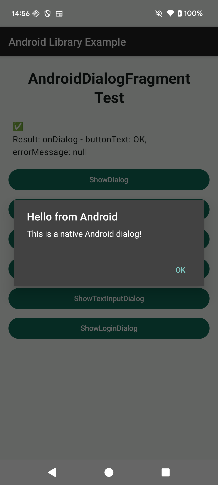
</p>

#### Confirmation dialog

- Displays a message with a negative and a positive button.

```kotlin
import com.jonghyunkim.nativetoolkit.dialog.AndroidDialogManager
import com.jonghyunkim.nativetoolkit.dialog.domain.model.DialogButton
import com.jonghyunkim.nativetoolkit.dialog.domain.model.DialogOptions
import com.jonghyunkim.nativetoolkit.dialog.domain.model.DialogRequest
import com.jonghyunkim.nativetoolkit.dialog.domain.model.DialogResult

val request = DialogRequest.Confirm(
    // Set the title. This field is required.
    title = "Confirmation",
    // Set the message. This field is required.
    message = "Do you want to proceed with this action?",
    // Set the negative button text. If not set, "No" is used.
    negativeText = "No",
    // Set the positive button text. If not set, "Yes" is used.
    positiveText = "Yes",
    options = DialogOptions(cancelable = false, cancelableOnTouchOutside = false)
)

AndroidDialogManager.getInstance(context).show(request) { result ->
    when (result) {
        is DialogResult.Button -> {
            if (result.which == DialogButton.POSITIVE) {
                // The user pressed "Yes".
            }
        }
        else -> Log.d(TAG, "result: $result")
    }
}
```

<p align="center">
    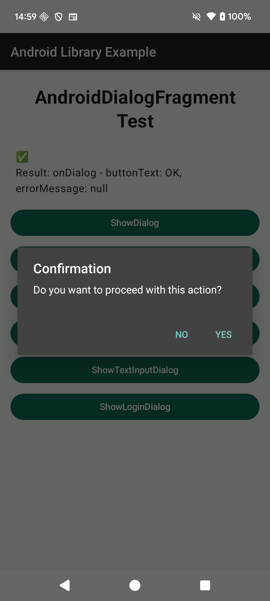
</p>

#### Single-choice dialog

- Displays a list in which one item can be selected.

```kotlin
import com.jonghyunkim.nativetoolkit.dialog.AndroidDialogManager
import com.jonghyunkim.nativetoolkit.dialog.domain.model.DialogOptions
import com.jonghyunkim.nativetoolkit.dialog.domain.model.DialogRequest
import com.jonghyunkim.nativetoolkit.dialog.domain.model.DialogResult
import com.jonghyunkim.nativetoolkit.dialog.domain.model.DialogValue

val request = DialogRequest.SingleChoice(
    // Set the title. This field is required.
    title = "Please select one",
    // Set the items. This field is required and must not be empty.
    items = listOf("Option 1", "Option 2", "Option 3"),
    // Set the item selected first, or null for none. If not set, 0 is used.
    checkedIndex = 0,
    // Set the negative button text. If not set, "Cancel" is used.
    negativeText = "Cancel",
    // Set the positive button text. If not set, "OK" is used.
    positiveText = "OK",
    options = DialogOptions(cancelable = false, cancelableOnTouchOutside = false)
)

AndroidDialogManager.getInstance(context).show(request) { result ->
    if (result is DialogResult.Button) {
        // DialogValue.SingleChoice for the positive button, DialogValue.None for the negative one.
        val value = result.value
        if (value is DialogValue.SingleChoice) {
            // The selected index, or null when nothing is selected.
            Log.d(TAG, "button: ${result.which}, index: ${value.index}")
        }
    }
}
```

<p align="center">
    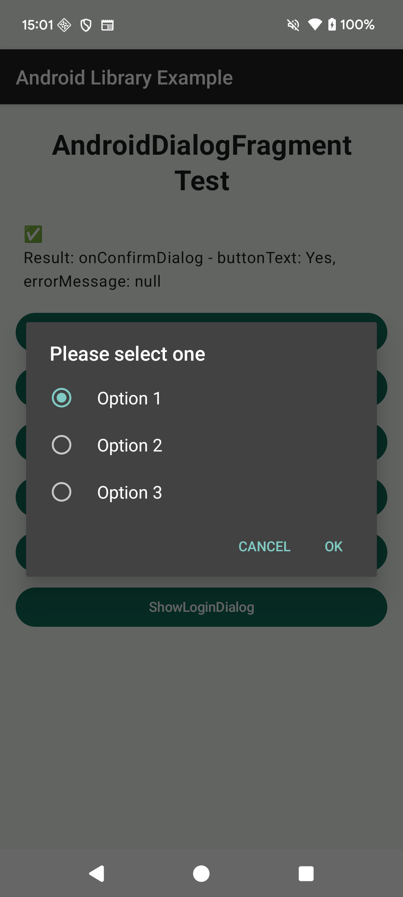
</p>

#### Multi-choice dialog

- Displays a list in which any number of items can be selected.

```kotlin
import com.jonghyunkim.nativetoolkit.dialog.AndroidDialogManager
import com.jonghyunkim.nativetoolkit.dialog.domain.model.DialogOptions
import com.jonghyunkim.nativetoolkit.dialog.domain.model.DialogRequest
import com.jonghyunkim.nativetoolkit.dialog.domain.model.DialogResult
import com.jonghyunkim.nativetoolkit.dialog.domain.model.DialogValue

val request = DialogRequest.MultiChoice(
    // Set the title. This field is required.
    title = "Multiple Selection",
    // Set the items. This field is required and must not be empty.
    items = listOf("Option 1", "Option 2", "Option 3", "Option 4"),
    // Set the initial selection. This field is required, with one value per item.
    checked = listOf(false, true, false, true),
    // Set the negative button text. If not set, "Cancel" is used.
    negativeText = "Cancel",
    // Set the positive button text. If not set, "OK" is used.
    positiveText = "OK",
    options = DialogOptions(cancelable = false, cancelableOnTouchOutside = false)
)

AndroidDialogManager.getInstance(context).show(request) { result ->
    if (result is DialogResult.Button) {
        val value = result.value
        if (value is DialogValue.MultiChoice) {
            // One value per item: true for checked.
            Log.d(TAG, "button: ${result.which}, checked: ${value.checked}")
        }
    }
}
```

<p align="center">
    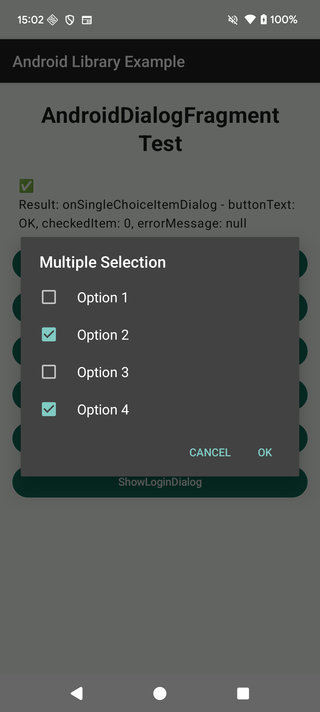
</p>

#### Text input dialog

- Displays a message with one text field.

```kotlin
import com.jonghyunkim.nativetoolkit.dialog.AndroidDialogManager
import com.jonghyunkim.nativetoolkit.dialog.domain.model.DialogOptions
import com.jonghyunkim.nativetoolkit.dialog.domain.model.DialogRequest
import com.jonghyunkim.nativetoolkit.dialog.domain.model.DialogResult
import com.jonghyunkim.nativetoolkit.dialog.domain.model.DialogValue

val request = DialogRequest.TextInput(
    // Set the title. This field is required.
    title = "Text Input",
    // Set the message. This field is required.
    message = "Please enter your name",
    // Set the hint. If not set, an empty string is used.
    hint = "Enter here...",
    // Set the negative button text. If not set, "Cancel" is used.
    negativeText = "Cancel",
    // Set the positive button text. If not set, "OK" is used.
    positiveText = "OK",
    // Set whether the positive button works while the field is empty. If not set, false is used.
    enablePositiveWhenEmpty = false,
    options = DialogOptions(cancelable = false, cancelableOnTouchOutside = false)
)

AndroidDialogManager.getInstance(context).show(request) { result ->
    if (result is DialogResult.Button) {
        val value = result.value
        if (value is DialogValue.Text) {
            // value.text is what the user entered. Log its length, not the text.
            Log.d(TAG, "button: ${result.which}, textLength: ${value.text.length}")
        }
    }
}
```

<p align="center">
    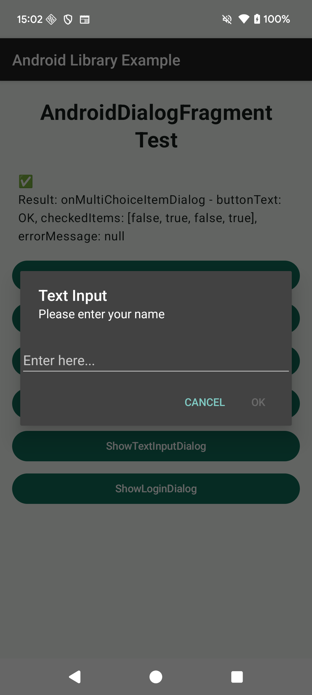
</p>

#### Login dialog

- Displays a message with a username field and a password field.

```kotlin
import com.jonghyunkim.nativetoolkit.dialog.AndroidDialogManager
import com.jonghyunkim.nativetoolkit.dialog.domain.model.DialogOptions
import com.jonghyunkim.nativetoolkit.dialog.domain.model.DialogRequest
import com.jonghyunkim.nativetoolkit.dialog.domain.model.DialogResult
import com.jonghyunkim.nativetoolkit.dialog.domain.model.DialogValue

val request = DialogRequest.Login(
    // Set the title. This field is required.
    title = "Login",
    // Set the message. This field is required.
    message = "Please enter your credentials",
    // Set the username hint. If not set, "Username" is used.
    usernameHint = "Username",
    // Set the password hint. If not set, "Password" is used.
    passwordHint = "Password",
    // Set the negative button text. If not set, "Cancel" is used.
    negativeText = "Cancel",
    // Set the positive button text. If not set, "Login" is used.
    positiveText = "Login",
    // Set whether the positive button works while a field is empty. If not set, false is used.
    enablePositiveWhenEmpty = false,
    options = DialogOptions(cancelable = false, cancelableOnTouchOutside = false)
)

AndroidDialogManager.getInstance(context).show(request) { result ->
    if (result is DialogResult.Button) {
        val value = result.value
        if (value is DialogValue.Login) {
            // value.username and value.password are what the user entered. Never log the password.
            Log.d(TAG, "usernameLength: ${value.username.length}, passwordLength: ${value.password.length}")
        }
    }
}
```

<p align="center">
    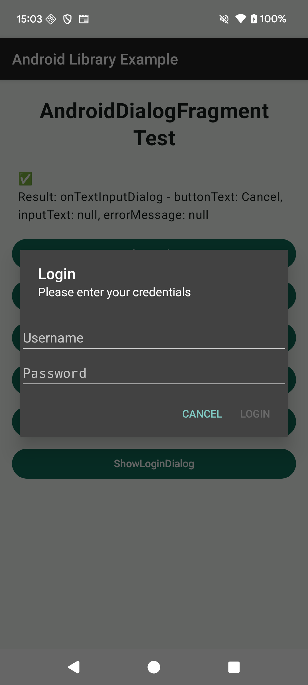
</p>

#### Waiting with a coroutine

- `show(request)` without a callback is a `suspend` function. It returns the answer, `DialogResult.Button` or `DialogResult.Dismissed` (both are `DialogResult.Answer`).
- A request that ends without an answer throws `DialogDomainError.Canceled(reason)`, and a dialog that cannot be shown throws `DialogDomainError.Unavailable(error)`.
- Canceling the coroutine closes the dialog. Tie the coroutine to the screen (in Compose, `rememberCoroutineScope()`), so that leaving the screen closes the dialog too.

```kotlin
import com.jonghyunkim.nativetoolkit.dialog.AndroidDialogManager
import com.jonghyunkim.nativetoolkit.dialog.domain.error.DialogDomainError
import com.jonghyunkim.nativetoolkit.dialog.domain.model.DialogOptions
import com.jonghyunkim.nativetoolkit.dialog.domain.model.DialogRequest
import com.jonghyunkim.nativetoolkit.dialog.domain.model.DialogResult
import kotlinx.coroutines.launch

val manager = AndroidDialogManager.getInstance(context)
val request = DialogRequest.Confirm(
    title = "Confirmation",
    message = "Do you want to proceed with this action?",
    negativeText = "No",
    positiveText = "Yes",
    options = DialogOptions(cancelable = false, cancelableOnTouchOutside = false)
)

scope.launch {
    try {
        when (val answer = manager.show(request)) {
            is DialogResult.Button -> Log.d(TAG, "button: ${answer.which} (${answer.text})")
            DialogResult.Dismissed -> Log.d(TAG, "Dismissed")
        }
    } catch (e: DialogDomainError.Canceled) {
        // e.reason is CancelReason.REQUESTED or CancelReason.HOST_DESTROYED.
        Log.d(TAG, "Canceled: ${e.reason}")
    } catch (e: DialogDomainError.Unavailable) {
        // e.error is a DialogError, for example NOT_FOREGROUND.
        Log.d(TAG, "Unavailable: ${e.error}")
    }
}
```

#### Closing with Back or an outside tap

- `DialogOptions()` with no arguments lets Back and a tap outside close the dialog. The result is then `DialogResult.Dismissed`, which carries no value.

```kotlin
import com.jonghyunkim.nativetoolkit.dialog.AndroidDialogManager
import com.jonghyunkim.nativetoolkit.dialog.domain.model.DialogOptions
import com.jonghyunkim.nativetoolkit.dialog.domain.model.DialogRequest
import com.jonghyunkim.nativetoolkit.dialog.domain.model.DialogResult

val request = DialogRequest.Alert(
    title = "Cancelable",
    message = "Tap outside or press Back.",
    buttonText = "OK",
    // cancelable = true and cancelableOnTouchOutside = true.
    options = DialogOptions()
)

AndroidDialogManager.getInstance(context).show(request) { result ->
    if (result == DialogResult.Dismissed) {
        // The user pressed Back or tapped outside the dialog.
    }
}
```

#### Canceling a dialog

- `cancel(requestId)` closes a dialog from code. Its result becomes `DialogResult.Canceled(CancelReason.REQUESTED)`, unless it already has one.
- `cancel` may be called from any thread. An unknown ID, or the ID of a dialog that already has its result, is ignored.

```kotlin
import android.os.Handler
import android.os.Looper
import com.jonghyunkim.nativetoolkit.dialog.AndroidDialogManager

val manager = AndroidDialogManager.getInstance(context)
// request: any DialogRequest, for example the one of the basic dialog.
val requestId = manager.show(request) { result ->
    // DialogResult.Canceled(CancelReason.REQUESTED) when cancel() came first.
    Log.d(TAG, "result: $result")
}

// Close the dialog after 2 seconds.
Handler(Looper.getMainLooper()).postDelayed({ manager.cancel(requestId) }, 2_000)
```

### C ABI

- The same dialogs for C, and for any language that can call a C function (C#, Dart, Rust and others). A Kotlin or Java app calls `AndroidDialogManager` instead: the C ABI calls it through JNI, so it would only add a round trip.
- Add both AARs to the app: `android-native-toolkit-capi-2.0.0.aar` holds `libntk.so` and the headers, and it needs `android-native-toolkit-2.0.0.aar` next to it. `libntk.so` exists for 64-bit ABIs only (`arm64-v8a`, `x86_64`). An app installed as 32-bit still starts, but `libntk.so` is missing, so loading it fails.
- The headers and `libntk.so` come through Prefab. Turn Prefab on and limit the app's ABIs and its CMake build to the 64-bit ABIs, both of them; [Setup](index.md#c-abi) explains why (an `if()` in `CMakeLists.txt` does not avoid the `CXX1210` build error, and 32-bit native code of your own goes in a separate module without Prefab):

```kotlin
android {
    buildFeatures { prefab = true }
    defaultConfig {
        ndk { abiFilters += listOf("arm64-v8a", "x86_64") }
        externalNativeBuild {
            cmake { abiFilters("arm64-v8a", "x86_64") }
        }
    }
}
```

```cmake
find_package(ntk REQUIRED CONFIG)
target_link_libraries(your_library PRIVATE ntk::ntk)
```

- androidx.startup initializes the library at app start. An app that turns Startup off, calls from a process other than the default one, or loads `libntk.so` only with `dlopen`, calls `ntk_android_init(env, context)` (`<NativeToolkitC/Android.h>`) first. Until the library is initialized, the `ntk_dialog_show_*_async` functions return `NTK_DIALOG_ERROR_NOT_INITIALIZED`. The argument checks come first, so a bad argument still gets `NTK_DIALOG_ERROR_INVALID_PARAMETER`, and `ntk_dialog_cancel` returns `NTK_DIALOG_ERROR_NONE` without doing anything. The result readers and `ntk_dialog_result_free` work regardless.
- The headers are plain C99 and include nothing but `<stddef.h>` and `<stdint.h>`. Strings are NUL-terminated UTF-8. A `NULL` button or hint text takes the Kotlin default (`"OK"`, `"Cancel"` and so on), a `NULL` title or message is an empty string.
- A request struct is filled with zeros and given its own `sizeof` in `struct_size`; the zeros are the defaults. That inverts two flag names against the Kotlin API, so that the default stays zero: `not_cancelable` is the opposite of `cancelable`, and `not_cancelable_on_touch_outside` the opposite of `cancelableOnTouchOutside`.
- Every function may be called from any thread and never waits for the main thread. The return value only says whether the request was accepted. A call rejected on entry (an invalid argument, `NOT_INITIALIZED`) never calls the callback, and calls `release` on the calling thread before it returns.
- An accepted request completes exactly once, on the Android main thread, and `release` follows. Neither runs inside the call that started the request. Called off the main thread, the completion may arrive before that call returns, so tie a completion to its request through `user_data`. Called while the app is in the background, a request completes with `NTK_DIALOG_ERROR_NOT_FOREGROUND`.
- The `ntk_dialog_result` handed to the callback is owned by the receiver, which frees it with `ntk_dialog_result_free`, during the callback or later. It is `NULL` unless the error is `NTK_DIALOG_ERROR_NONE`. `system_code` and `ntk_last_system_code()` are always 0 on Android.
- Request IDs are `uint64_t` and never reused. `ntk_dialog_cancel` takes one from any thread, and ignores an unknown ID or a request that already completed.
- A callback must not block the main thread or let an exception escape: the library does not catch it, and the process ends.

#### Alert and confirmation dialogs

```c
#include <string.h>
#include <NativeToolkitC/Common.h>
#include <NativeToolkitC/Android.h>
#include <NativeToolkitC/Dialog.h>

static void NTK_CALL on_dialog_result(void* user_data, uint64_t request_id, ntk_dialog_error error,
                                      uint32_t system_code, ntk_dialog_result* result)
{
    /* On the Android main thread, once per accepted request. system_code is always 0. */
    (void)user_data; (void)request_id; (void)system_code;
    if (error != NTK_DIALOG_ERROR_NONE) {
        /* result is NULL. CANCELED after ntk_dialog_cancel, CANCELED_BY_SYSTEM when the
           Activity went away, NOT_FOREGROUND when the app was in the background. */
        return;
    }
    if (ntk_dialog_result_answer(result) == NTK_DIALOG_ANSWER_BUTTON) {
        ntk_dialog_button button = ntk_dialog_result_button(result);
        size_t size = 0;
        const char* label = ntk_dialog_result_button_text(result, &size);
        (void)button; (void)label;
    } else {
        /* NTK_DIALOG_ANSWER_DISMISSED: Back or a tap outside. It carries no value. */
    }
    /* The result belongs to the receiver. Free it here, or later on any thread. */
    ntk_dialog_result_free(result);
}

static void NTK_CALL release_user_data(void* user_data)
{
    /* Called exactly once: on the main thread after the completion, or on the calling
       thread before the call returns when the call was rejected. */
    (void)user_data;
}

/* The headers and libntk.so have to be the same version. */
if (ntk_version() != NTK_VERSION) {
    return;
}
/* androidx.startup initializes the library at app start. An app that turned Startup
   off calls ntk_android_init(env, context) first. */
if (!ntk_android_is_initialized()) {
    return;
}

/* --- Basic dialog --------------------------------------------------- */
ntk_dialog_alert_request alert;
memset(&alert, 0, sizeof(alert));
alert.struct_size = (uint32_t)sizeof(alert);
alert.title = "Hello from Android";
alert.message = "This is a native Android dialog!";
alert.button_text = "OK";                    /* NULL: "OK" */
alert.not_cancelable = 1;                    /* Back does not close it */
alert.not_cancelable_on_touch_outside = 1;   /* nor does a tap outside */

uint64_t request_id = 0;
ntk_dialog_error error = ntk_dialog_show_alert_async(&alert, &on_dialog_result, NULL,
                                                     &release_user_data, &request_id);
if (error != NTK_DIALOG_ERROR_NONE) {
    /* Rejected: the callback is never called, and release_user_data has already run. */
    return;
}

/* Later, for example when the screen closes: the dialog closes and completes with
   NTK_DIALOG_ERROR_CANCELED. A finished or unknown ID does nothing. */
ntk_dialog_cancel(request_id);

/* --- Confirmation dialog -------------------------------------------- */
ntk_dialog_confirm_request confirm;
memset(&confirm, 0, sizeof(confirm));
confirm.struct_size = (uint32_t)sizeof(confirm);
confirm.title = "Confirmation";
confirm.message = "Do you want to proceed with this action?";
confirm.negative_text = "No";                /* NULL: "No" */
confirm.positive_text = "Yes";               /* NULL: "Yes" */
confirm.not_cancelable = 1;
confirm.not_cancelable_on_touch_outside = 1;

/* out_request_id may be NULL when the dialog is never canceled. */
error = ntk_dialog_show_confirm_async(&confirm, &on_dialog_result, NULL, &release_user_data, NULL);
```

#### Choice list dialogs

`ntk_dialog_result_checked_index` reads the single-choice answer and is -1 when nothing is checked; `ntk_dialog_result_checked_count` and `ntk_dialog_result_checked_at` read the multi-choice answer, nonzero for a checked item. The negative button carries no selection.

```c
#include <string.h>
#include <NativeToolkitC/Common.h>
#include <NativeToolkitC/Dialog.h>

static void NTK_CALL on_single_choice(void* user_data, uint64_t request_id, ntk_dialog_error error,
                                      uint32_t system_code, ntk_dialog_result* result)
{
    (void)user_data; (void)request_id; (void)system_code;
    if (error != NTK_DIALOG_ERROR_NONE) {
        return;
    }
    if (ntk_dialog_result_answer(result) == NTK_DIALOG_ANSWER_BUTTON
        && ntk_dialog_result_button(result) == NTK_DIALOG_BUTTON_POSITIVE) {
        int32_t index = ntk_dialog_result_checked_index(result);   /* -1: none checked */
        (void)index;
    }
    ntk_dialog_result_free(result);
}

static void NTK_CALL on_multi_choice(void* user_data, uint64_t request_id, ntk_dialog_error error,
                                     uint32_t system_code, ntk_dialog_result* result)
{
    (void)user_data; (void)request_id; (void)system_code;
    if (error != NTK_DIALOG_ERROR_NONE) {
        return;
    }
    if (ntk_dialog_result_answer(result) == NTK_DIALOG_ANSWER_BUTTON
        && ntk_dialog_result_button(result) == NTK_DIALOG_BUTTON_POSITIVE) {
        size_t count = ntk_dialog_result_checked_count(result);
        size_t i;
        for (i = 0; i < count; ++i) {
            int32_t checked = ntk_dialog_result_checked_at(result, i);   /* nonzero: checked */
            (void)checked;
        }
    }
    ntk_dialog_result_free(result);
}

/* --- One item ------------------------------------------------------- */
const char* const single_items[] = { "Option 1", "Option 2", "Option 3" };

ntk_dialog_single_choice_request single;
memset(&single, 0, sizeof(single));
single.struct_size = (uint32_t)sizeof(single);
single.title = "Please select one";
single.items = single_items;
single.item_count = 3;                       /* must not be 0 */
single.checked_index = 0;                    /* -1: none checked */
single.negative_text = "Cancel";             /* NULL: "Cancel" */
single.positive_text = "OK";                 /* NULL: "OK" */
single.not_cancelable = 1;
single.not_cancelable_on_touch_outside = 1;

/* user_data and release may be NULL when there is nothing to free. */
ntk_dialog_error error = ntk_dialog_show_single_choice_async(&single, &on_single_choice, NULL, NULL, NULL);

/* --- Any number of items -------------------------------------------- */
const char* const multi_items[] = { "Option 1", "Option 2", "Option 3", "Option 4" };
const int32_t multi_checked[] = { 0, 1, 0, 1 };

ntk_dialog_multi_choice_request multi;
memset(&multi, 0, sizeof(multi));
multi.struct_size = (uint32_t)sizeof(multi);
multi.title = "Multiple Selection";
multi.items = multi_items;
multi.item_count = 4;
multi.checked = multi_checked;               /* NULL: none checked; else item_count values */
multi.negative_text = "Cancel";
multi.positive_text = "OK";
multi.not_cancelable = 1;
multi.not_cancelable_on_touch_outside = 1;

error = ntk_dialog_show_multi_choice_async(&multi, &on_multi_choice, NULL, NULL, NULL);
```

#### Text input and login dialogs

The text, the username and the password point into the result and stay valid until it is freed.

```c
#include <string.h>
#include <NativeToolkitC/Common.h>
#include <NativeToolkitC/Dialog.h>

static void NTK_CALL on_text_input(void* user_data, uint64_t request_id, ntk_dialog_error error,
                                   uint32_t system_code, ntk_dialog_result* result)
{
    (void)user_data; (void)request_id; (void)system_code;
    if (error != NTK_DIALOG_ERROR_NONE) {
        return;
    }
    if (ntk_dialog_result_answer(result) == NTK_DIALOG_ANSWER_BUTTON
        && ntk_dialog_result_button(result) == NTK_DIALOG_BUTTON_POSITIVE) {
        size_t size = 0;
        const char* text = ntk_dialog_result_text(result, &size);   /* UTF-8 */
        (void)text;
    }
    ntk_dialog_result_free(result);
}

static void NTK_CALL on_login(void* user_data, uint64_t request_id, ntk_dialog_error error,
                              uint32_t system_code, ntk_dialog_result* result)
{
    (void)user_data; (void)request_id; (void)system_code;
    if (error != NTK_DIALOG_ERROR_NONE) {
        return;
    }
    if (ntk_dialog_result_answer(result) == NTK_DIALOG_ANSWER_BUTTON
        && ntk_dialog_result_button(result) == NTK_DIALOG_BUTTON_POSITIVE) {
        const char* username = ntk_dialog_result_username(result, NULL);
        const char* password = ntk_dialog_result_password(result, NULL);   /* never log it */
        (void)username; (void)password;
    }
    ntk_dialog_result_free(result);
}

/* --- Text input ----------------------------------------------------- */
ntk_dialog_text_input_request input;
memset(&input, 0, sizeof(input));
input.struct_size = (uint32_t)sizeof(input);
input.title = "Text Input";
input.message = "Please enter your name";
input.hint = "Enter here...";                /* NULL: no hint */
input.negative_text = "Cancel";              /* NULL: "Cancel" */
input.positive_text = "OK";                  /* NULL: "OK" */
input.enable_positive_when_empty = 0;
input.not_cancelable = 1;
input.not_cancelable_on_touch_outside = 1;

ntk_dialog_error error = ntk_dialog_show_text_input_async(&input, &on_text_input, NULL, NULL, NULL);

/* --- Login ---------------------------------------------------------- */
ntk_dialog_login_request login;
memset(&login, 0, sizeof(login));
login.struct_size = (uint32_t)sizeof(login);
login.title = "Login";
login.message = "Please enter your credentials";
login.username_hint = "Username";            /* NULL: "Username" */
login.password_hint = "Password";            /* NULL: "Password" */
login.negative_text = "Cancel";              /* NULL: "Cancel" */
login.positive_text = "Login";               /* NULL: "Login" */
login.enable_positive_when_empty = 0;
login.not_cancelable = 1;
login.not_cancelable_on_touch_outside = 1;

error = ntk_dialog_show_login_async(&login, &on_login, NULL, NULL, NULL);
```

| Error | Returned or completed | Meaning |
|---|---|---|
| `NTK_DIALOG_ERROR_NONE` | Both | Accepted, or answered |
| `NTK_DIALOG_ERROR_INVALID_PARAMETER` | Returned (rarely completed) | A `NULL` callback or request, invalid UTF-8, no items, an index out of range, a `struct_size` below the 2.0.0 size or above 4096, a nonzero reserved field. It can also complete a request the Kotlin API rejected with `IllegalArgumentException` after it was accepted |
| `NTK_DIALOG_ERROR_NOT_INITIALIZED` | Returned | Called before initialization. The argument checks come first, and `ntk_dialog_cancel` returns `NONE` |
| `NTK_DIALOG_ERROR_NOT_SUPPORTED` | Returned | A newer `struct_size` with nonzero fields this library does not know |
| `NTK_DIALOG_ERROR_UNKNOWN` | Both | Anything else (logcat has the detail) |
| `NTK_DIALOG_ERROR_OUT_OF_MEMORY` | Both | Out of memory |
| `NTK_DIALOG_ERROR_CANCELED` | Completed | `ntk_dialog_cancel` (`CancelReason.REQUESTED`) |
| `NTK_DIALOG_ERROR_CANCELED_BY_SYSTEM` | Completed | The Activity showing the dialog was destroyed (`CancelReason.HOST_DESTROYED`) |
| `NTK_DIALOG_ERROR_NOT_FOREGROUND` | Completed | The app was not in the foreground (`DialogError.NOT_FOREGROUND`) |
| `NTK_DIALOG_ERROR_HOST_START_FAILED` | Completed | The transparent Activity did not start (`DialogError.HOST_START_FAILED`) |
| `NTK_DIALOG_ERROR_SHOW_FAILED` | Completed | Showing the dialog failed (`DialogError.SHOW_FAILED`) |

| Kotlin API | C ABI |
|---|---|
| `show(DialogRequest.Alert(...))` | `ntk_dialog_show_alert_async` |
| `show(DialogRequest.Confirm(...))` | `ntk_dialog_show_confirm_async` |
| `show(DialogRequest.SingleChoice(...))` | `ntk_dialog_show_single_choice_async` |
| `show(DialogRequest.MultiChoice(...))` | `ntk_dialog_show_multi_choice_async` |
| `show(DialogRequest.TextInput(...))` | `ntk_dialog_show_text_input_async` |
| `show(DialogRequest.Login(...))` | `ntk_dialog_show_login_async` |
| `cancel(requestId)` | `ntk_dialog_cancel` |
| `DialogResult.Button` / `DialogResult.Dismissed` | `ntk_dialog_result_answer` |
| `DialogResult.Button.which` / `text` | `ntk_dialog_result_button`, `ntk_dialog_result_button_text` |
| `DialogValue` | `ntk_dialog_result_checked_index`, `ntk_dialog_result_checked_count`, `ntk_dialog_result_checked_at`, `ntk_dialog_result_text`, `ntk_dialog_result_username`, `ntk_dialog_result_password` |
| - | `ntk_dialog_result_free` |

---

## iOS

### iOSDialogManager

#### ShowAlert - Basic dialog

- Displays a dialog.

```swift
IosDialogManager.shared.showAlert(
    // Set the title.
    title: "Hello from iOS",
    // Set the message.
    message: "This is a native iOS dialog!",
    // Set the button text. If not set, "OK" is used.
    buttonText: "OK",
    // Set event for button tap.
    onButton: { buttonText, isSuccess, errorMessage in
        // buttonText: text of the pressed button. Returns nil on error.
        // isSuccess: success flag for dialog display. Returns true on success.
        // errorMessage: error detail if an error occurs. Returns nil on success.
    },
    // Set event for dialog completion.
    completion: { isSuccess, errorMessage in
        // isSuccess: success flag for dialog display. Returns true on success.
        // errorMessage: error detail if an error occurs. Returns nil on success.
    }
)
```

<p align="center">
    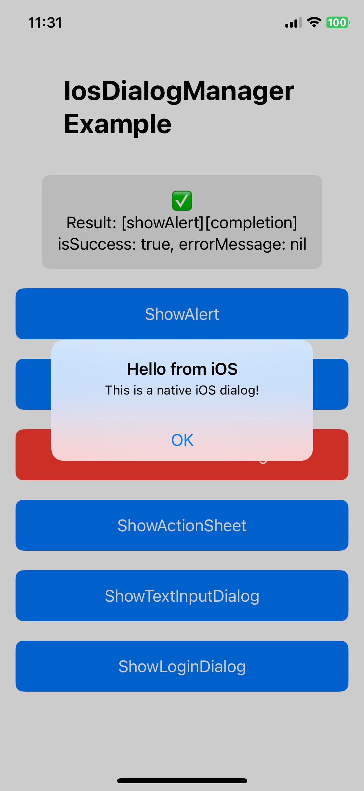
</p>

#### ShowConfirmDialog - Confirmation dialog

- Displays a dialog.

```swift
IosDialogManager.shared.showConfirmDialog(
    // Set the title.
    title: "Confirm Action",
    // Set the message.
    message: "Are you sure you want to proceed?",
    // Set confirmation button text. If not set, "OK" is used.
    confirmTitle: "Yes",
    // Set cancel button text. If not set, "Cancel" is used.
    cancelTitle: "No",
    // Set event for confirmation button tap.
    onConfirm: { confirmButtonText, isSuccess, errorMessage in
        // confirmButtonText: text of the pressed button. Returns nil on error.
        // isSuccess: success flag for dialog display. Returns true on success.
        // errorMessage: error detail if an error occurs. Returns nil on success.
    },
    // Set event for cancel button tap.
    onCancel: { cancelButtonText, isSuccess, errorMessage in
        // cancelButtonText: text of the pressed button. Returns nil on error.
        // isSuccess: success flag for dialog display. Returns true on success.
        // errorMessage: error detail if an error occurs. Returns nil on success.
    },
    // Set event for dialog completion.
    completion: { isSuccess, errorMessage in
        // isSuccess: success flag for dialog display. Returns true on success.
        // errorMessage: error detail if an error occurs. Returns nil on success.
    }
)
```

<p align="center">
    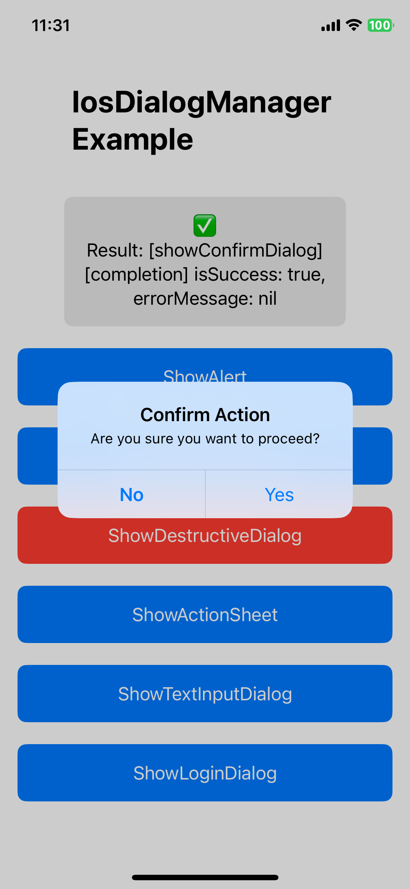
</p>

#### ShowDestructiveDialog - Destructive dialog

- Displays a dialog.

```swift
IosDialogManager.shared.showDestructiveDialog(
    // Set the title.
    title: "Delete File",
    // Set the message.
    message: "This action cannot be undone. Are you sure?",
    // Set destructive action button text. If not set, "Delete" is used.
    destructiveTitle: "Delete",
    // Set cancel button text. If not set, "Cancel" is used.
    cancelTitle: "Cancel",
    // Set event for destructive action button tap.
    onDestructive: { destructiveButtonText, isSuccess, errorMessage in
        // destructiveButtonText: text of the pressed button. Returns nil on error.
        // isSuccess: success flag for dialog display. Returns true on success.
        // errorMessage: error detail if an error occurs. Returns nil on success.
    },
    // Set event for cancel button tap.
    onCancel: { cancelButtonText, isSuccess, errorMessage in
        // cancelButtonText: text of the pressed button. Returns nil on error.
        // isSuccess: success flag for dialog display. Returns true on success.
        // errorMessage: error detail if an error occurs. Returns nil on success.
    },
    // Set event for dialog completion.
    completion: { isSuccess, errorMessage in
        // isSuccess: success flag for dialog display. Returns true on success.
        // errorMessage: error detail if an error occurs. Returns nil on success.
    }
)
```

<p align="center">
    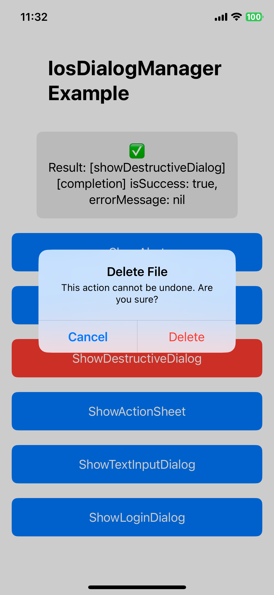
</p>

#### ShowActionSheet - Action sheet

- Displays an action sheet.

```swift
if let rootVC = IosDialogManager.shared.getRootViewController() {
    IosDialogManager.shared.showActionSheet(
        // Set the title.
        title: "Please select",
        // Set the message.
        message: "Please choose an option",
        // Set options. This field is required.
        options: ["Camera", "Photo Library", "Documents"],
        // Set cancel button text. If not set, "Cancel" is used.
        cancelTitle: "Cancel",
        // Set the source view for presenting the action sheet. This field is required.
        sourceView: rootVC.view,
        // Set the source rectangle of the presenting view.
        sourceRect: nil,
        // Set whether to animate presentation. If not set, true is used.
        animated: true,
        // Set event for action button tap.
        onAction: { action, isSuccess, errorMessage in
            // action: selected item. Returns nil on error.
            // isSuccess: success flag for dialog display. Returns true on success.
            // errorMessage: error detail if an error occurs. Returns nil on success.
        },
        completion: { isSuccess, errorMessage in
            // isSuccess: success flag for dialog display. Returns true on success.
            // errorMessage: error detail if an error occurs. Returns nil on success.
        }
    )
}
```

<p align="center">
    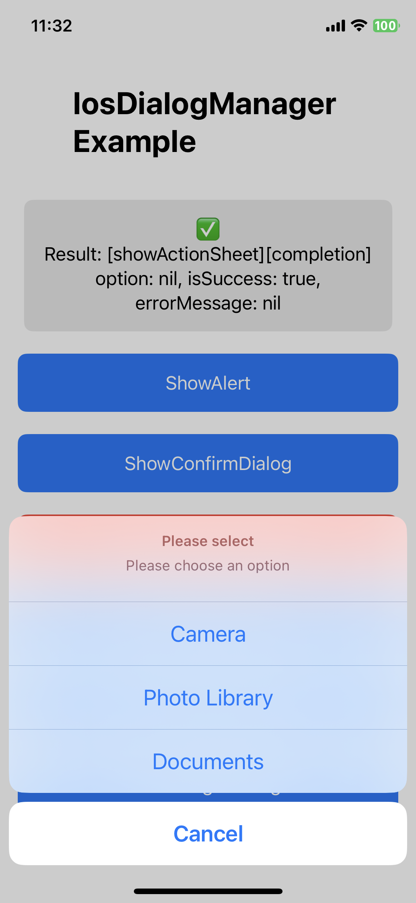
</p>

#### ShowTextInputDialog - Text input dialog

- Displays a dialog.

```swift
IosDialogManager.shared.showTextInputDialog(
    // Set the title.
    title: "Enter Name",
    // Set the message.
    message: "Please enter your name",
    // Set the placeholder.
    placeholder: "Your name here",
    // Set confirmation button text. If not set, "OK" is used.
    confirmTitle: "OK",
    // Set cancel button text. If not set, "Cancel" is used.
    cancelTitle: "Cancel",
    // Set whether confirm button is enabled when input is empty. If not set, true is used.
    enableConfirmWhenEmpty: false,
    // Set event for confirm button tap.
    onConfirm: { confirmButtonText, inputText, isSuccess, errorMessage in
        // confirmButtonText: text of the pressed button. Returns nil on error.
        // inputText: entered text. Returns nil on error.
        // isSuccess: success flag for dialog display. Returns true on success.
        // errorMessage: error detail if an error occurs. Returns nil on success.
    },
    // Set event for cancel button tap.
    onCancel: { cancelButtonText, isSuccess, errorMessage in
        // cancelButtonText: text of the pressed button. Returns nil on error.
        // inputText: entered text. Returns nil on error.
        // isSuccess: success flag for dialog display. Returns true on success.
        // errorMessage: error detail if an error occurs. Returns nil on success.
    },
    // Set event for dialog completion.
    completion: { isSuccess, errorMessage in
        // isSuccess: success flag for dialog display. Returns true on success.
        // errorMessage: error detail if an error occurs. Returns nil on success.
    }
)
```

<p align="center">
    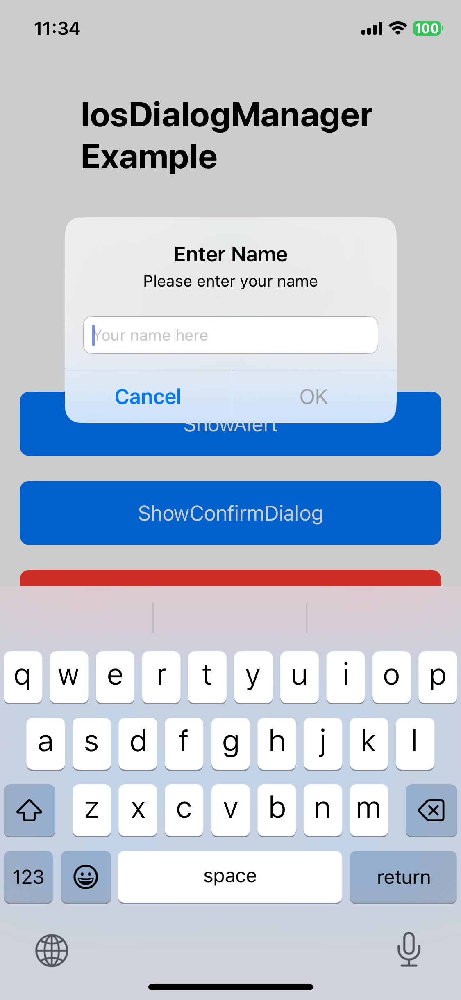
</p>

#### ShowLoginDialog - Login dialog

- Displays a dialog.

```swift
IosDialogManager.shared.showLoginDialog(
    // Set the title.
    title: "Login Required",
    // Set the message.
    message: "Please enter your credentials",
    // Set username placeholder. If not set, "Username" is used.
    usernamePlaceholder: "Username",
    // Set password placeholder. If not set, "Password" is used.
    passwordPlaceholder: "Password",
    // Set login button text. If not set, "Login" is used.
    loginTitle: "Login",
    // Set cancel button text. If not set, "Cancel" is used.
    cancelTitle: "Cancel",
    // Set whether login button is enabled when input is empty. If not set, true is used.
    enableLoginWhenEmpty: false,
    // Set event for login button tap.
    onLogin: { loginButtonText, username, password, isSuccess, errorMessage in
        // loginButtonText: text of the pressed button. Returns nil on error.
        // username: entered username. Returns nil on error.
        // password: entered password. Returns nil on error.
        // isSuccess: success flag for dialog display. Returns true on success.
        // errorMessage: error detail if an error occurs. Returns nil on success.
    },
    // Set event for cancel button tap.
    onCancel: { cancelButtonText, isSuccess, errorMessage in
        // cancelButtonText: text of the pressed button. Returns nil on error.
        // isSuccess: success flag for dialog display. Returns true on success.
        // errorMessage: error detail if an error occurs. Returns nil on success.
    },
    // Set event for dialog completion.
    completion: { isSuccess, errorMessage in
        // isSuccess: success flag for dialog display. Returns true on success.
        // errorMessage: error detail if an error occurs. Returns nil on success.
    }
)
```

<p align="center">
    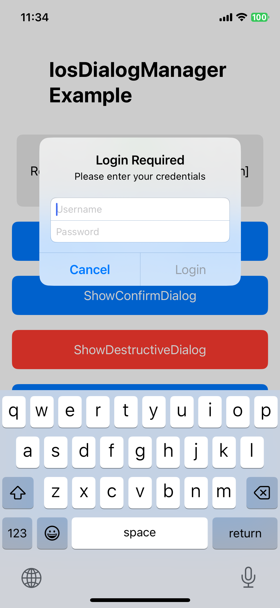
</p>

---

## Windows

The Windows library offers the same dialogs through two public APIs. Both come from one implementation, and the sample app uses the C++ API.

| API | Names | Header | NuGet package |
|---|---|---|---|
| C++ API | `NativeToolkit::Dialog` | `<NativeToolkit/Dialog.h>` | `NativeToolkit` |
| C ABI | `ntk_dialog_*` | `<NativeToolkitC/Dialog.h>` | `NativeToolkit.CApi` |

### NativeToolkit::Dialog

- Every dialog is modal and blocks the calling thread, so call these functions from the UI thread.
- A call returns `Dialog::Result<T>`. `has_value()` tells the two cases apart, `value()` is the result and `error()` is a `Dialog::Error`, which carries the documented `code` and the raw `systemCode` the OS reported.
- The user dismissing a dialog is not a failure of the call, but it is not a value either: it arrives as `Dialog::ErrorCode::Canceled`.
- The headers never include `<windows.h>`. `request.owner` takes a `NativeToolkit::WindowHandle`, which is `HWND`.

#### ShowAlert - Basic dialog

- Displays a message box and reports which button was pressed.

```cpp
#include <NativeToolkit/Dialog.h>

namespace Dialog = NativeToolkit::Dialog;

Dialog::AlertRequest request;
// Set the title.
request.title = L"Native Windows Dialog";
// Set the message.
request.message = L"This is a native Windows dialog!";
// Set which buttons are shown. Here, OK and Cancel.
request.buttons = Dialog::AlertButtons::OkCancel;
// Set the icon. Here, an information icon.
request.icon = Dialog::AlertIcon::Information;
// Set which button starts out focused. Here, the second one.
request.defaultButton = Dialog::AlertDefaultButton::Second;
// Optional: the window the dialog belongs to, and MB_TOPMOST / MB_HELP.
// request.owner = hwnd;
// request.topMost = true;
// request.showHelpButton = true;

const auto result = Dialog::ShowAlert(request);
if (result.has_value())
{
    // Cancel is a button like any other, so it arrives as
    // AlertResult::Cancel rather than as a failure.
    const Dialog::AlertResult pressed = result.value();
    if (pressed == Dialog::AlertResult::Ok)
    {
        // The user pressed OK.
    }
}
else
{
    // code is the documented case, systemCode the raw value from the OS.
    const Dialog::ErrorCode code = result.error().code;
    const uint32_t systemCode = result.error().systemCode;
}
```

<p align="center">
    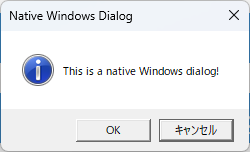
</p>

#### ShowOpenFile - File picker dialog

- Asks for one existing file and returns its full path.

```cpp
#include <NativeToolkit/Dialog.h>

namespace Dialog = NativeToolkit::Dialog;

Dialog::FileRequest request;
// Set the title.
request.title = L"Open File";
// Set the type list. An entry is a description and its patterns.
// With no filters at all the dialog offers every file.
request.filters = { Dialog::FileFilter{ L"All Files", { L"*.*" } } };
// The picked file has to exist (OFN_FILEMUSTEXIST). This is the default.
request.fileMustExist = true;

const auto result = Dialog::ShowOpenFile(request);
if (result.has_value())
{
    // A full path.
    const std::wstring& filePath = result.value();
}
else if (result.error().code == Dialog::ErrorCode::Canceled)
{
    // The user dismissed the dialog.
}
else
{
    const uint32_t systemCode = result.error().systemCode;
}
```

<p align="center">
    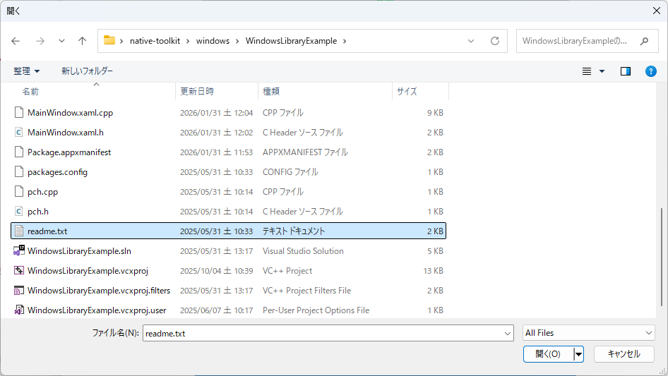
</p>

#### ShowOpenFiles - Multi-file picker dialog

- Asks for one or more existing files, in the order the dialog returned them.

```cpp
#include <NativeToolkit/Dialog.h>

namespace Dialog = NativeToolkit::Dialog;

Dialog::FileRequest request;
// Set the title.
request.title = L"Open Files";
// Set the type list.
request.filters = { Dialog::FileFilter{ L"All Files", { L"*.*" } } };

const auto result = Dialog::ShowOpenFiles(request);
if (result.has_value())
{
    // Every entry is a full path, and the folder is not an entry of its own.
    const std::vector<std::wstring>& paths = result.value();
    for (const std::wstring& path : paths)
    {
        // One selected file.
    }
}
else if (result.error().code == Dialog::ErrorCode::Canceled)
{
    // The user dismissed the dialog.
}
```

<p align="center">
    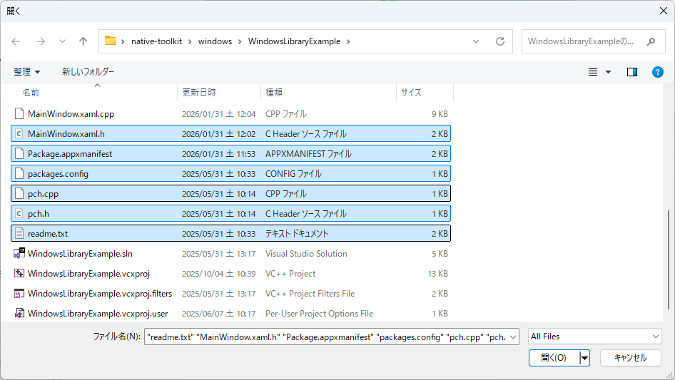
</p>

#### ShowPickFolder - Folder picker dialog

- Asks for one folder.

```cpp
#include <NativeToolkit/Dialog.h>

namespace Dialog = NativeToolkit::Dialog;

Dialog::FolderRequest request;
// Set the title. An empty title leaves the system default.
request.title = L"Select Folder";

const auto result = Dialog::ShowPickFolder(request);
if (result.has_value())
{
    const std::wstring& folderPath = result.value();
}
else if (result.error().code == Dialog::ErrorCode::Canceled)
{
    // The user dismissed the dialog.
}
```

<p align="center">
    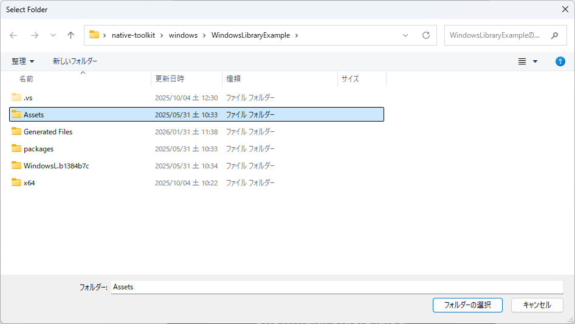
</p>

#### ShowPickFolders - Multi-folder picker dialog

- Asks for one or more folders.

```cpp
#include <NativeToolkit/Dialog.h>

namespace Dialog = NativeToolkit::Dialog;

Dialog::FolderRequest request;
// Set the title.
request.title = L"Select Folders";

const auto result = Dialog::ShowPickFolders(request);
if (result.has_value())
{
    // Every entry is a full path.
    const std::vector<std::wstring>& paths = result.value();
}
else if (result.error().code == Dialog::ErrorCode::Canceled)
{
    // The user dismissed the dialog.
}
```

<p align="center">
    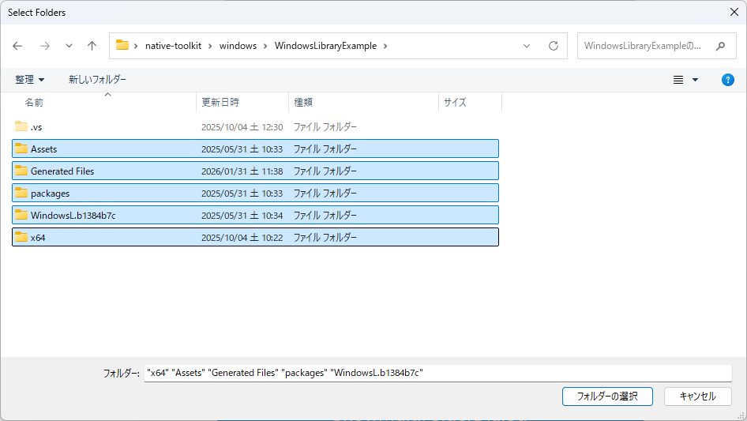
</p>

#### ShowSaveFile - Save file dialog

- Asks where to save a file. The file itself is not created.

```cpp
#include <NativeToolkit/Dialog.h>

namespace Dialog = NativeToolkit::Dialog;

Dialog::SaveFileRequest request;
// Set the title.
request.title = L"Save File";
// Set the type list.
request.filters = { Dialog::FileFilter{ L"All Files", { L"*.*" } } };
// Set the extension appended when the user types none.
request.defaultExtension = L"txt";
// Ask before an existing file is picked (OFN_OVERWRITEPROMPT). This is the default.
request.overwritePrompt = true;

const auto result = Dialog::ShowSaveFile(request);
if (result.has_value())
{
    const std::wstring& savePath = result.value();
}
else if (result.error().code == Dialog::ErrorCode::Canceled)
{
    // The user dismissed the dialog.
}
```

<p align="center">
    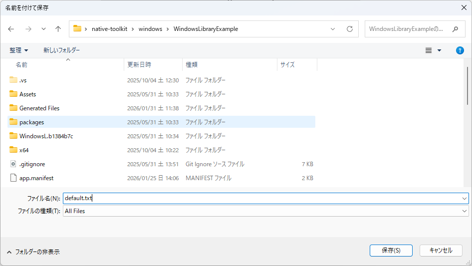
</p>

### C ABI

- The same dialogs for C, and for any language that can call a C DLL. The header is plain C99 and includes nothing but `<stddef.h>` and `<stdint.h>`.
- Strings are NUL-terminated UTF-8 in both directions. `NULL` means an empty string.
- A request struct is filled with zeros and given its own `sizeof` in `struct_size`; the zeros are the defaults. That inverts two flag names against the C++ API, so that the default stays zero: `allow_missing_file` is the opposite of `fileMustExist`, and `skip_overwrite_prompt` the opposite of `overwritePrompt`.
- A function reports its error as the return value. The raw value the OS gave is `ntk_last_system_code()`, read on the same thread right after the failure.
- Anything the library hands back is a handle that the caller frees with the matching `_free`. A pointer read out of a handle stays valid until that handle is freed.

#### Message box

```c
#include <string.h>
#include <NativeToolkitC/Common.h>
#include <NativeToolkitC/Dialog.h>

/* The headers and the DLL have to be the same version. */
if (ntk_version() != NTK_VERSION) {
    return;
}

/* Zero-filled means "the defaults"; struct_size is what tells the DLL
   which version of the struct this is. */
ntk_dialog_alert_request request;
memset(&request, 0, sizeof(request));
request.struct_size = (uint32_t)sizeof(request);
request.title = "Native Windows Dialog";
request.message = "This is a native Windows dialog!";
request.buttons = NTK_DIALOG_ALERT_BUTTONS_OK_CANCEL;
request.icon = NTK_DIALOG_ALERT_ICON_INFORMATION;
request.default_button = NTK_DIALOG_ALERT_DEFAULT_BUTTON_SECOND;
/* Optional: request.top_most = 1; request.show_help_button = 1;
   request.owner = hwnd; */

ntk_dialog_alert_result pressed = 0;
ntk_dialog_error error = ntk_dialog_show_alert(&request, &pressed);
if (error == NTK_DIALOG_ERROR_NONE) {
    /* Cancel is a button, so it is NTK_DIALOG_ALERT_RESULT_CANCEL here. */
} else if (error == NTK_DIALOG_ERROR_SYSTEM_ERROR) {
    uint32_t system_code = ntk_last_system_code();
    (void)system_code;
}
```

#### File pickers

`ntk_dialog_show_open_file` and `ntk_dialog_show_save_file` hand back one path as an `ntk_string`; `ntk_dialog_show_open_files` hands back an `ntk_string_list`, whose entries are read by index and are valid until the list is freed.

```c
#include <string.h>
#include <NativeToolkitC/Common.h>
#include <NativeToolkitC/Dialog.h>

/* The type list. Patterns are separated by ';'. Pass NULL with a count of 0
   for every file. */
ntk_dialog_filter filters[1];
filters[0].name = "All Files";
filters[0].patterns = "*.*";

/* --- One existing file --------------------------------------------- */
ntk_dialog_file_request open_request;
memset(&open_request, 0, sizeof(open_request));
open_request.struct_size = (uint32_t)sizeof(open_request);
open_request.title = "Open File";
/* Zero means the picked file has to exist (OFN_FILEMUSTEXIST). */
open_request.allow_missing_file = 0;

ntk_string* path = NULL;
ntk_dialog_error error = ntk_dialog_show_open_file(&open_request, filters, 1, &path);
if (error == NTK_DIALOG_ERROR_NONE) {
    /* Borrowed: valid until ntk_string_free. */
    const char* utf8 = ntk_string_data(path);
    size_t size = ntk_string_size(path);
    (void)utf8; (void)size;
    ntk_string_free(path);
} else if (error == NTK_DIALOG_ERROR_CANCELED) {
    /* The user dismissed the dialog; path stays NULL. */
}

/* --- One or more existing files ------------------------------------ */
ntk_string_list* paths = NULL;
error = ntk_dialog_show_open_files(&open_request, filters, 1, &paths);
if (error == NTK_DIALOG_ERROR_NONE) {
    size_t count = ntk_string_list_count(paths);
    size_t i;
    for (i = 0; i < count; ++i) {
        size_t size = 0;
        const char* entry = ntk_string_list_at(paths, i, &size);  /* a full path */
        (void)entry; (void)size;
    }
    ntk_string_list_free(paths);
}

/* --- Where to save ------------------------------------------------- */
ntk_dialog_save_file_request save_request;
memset(&save_request, 0, sizeof(save_request));
save_request.struct_size = (uint32_t)sizeof(save_request);
save_request.title = "Save File";
save_request.default_extension = "txt";
/* Zero means the dialog asks before an existing file is picked. */
save_request.skip_overwrite_prompt = 0;

ntk_string* save_path = NULL;
error = ntk_dialog_show_save_file(&save_request, filters, 1, &save_path);
if (error == NTK_DIALOG_ERROR_NONE) {
    ntk_string_free(save_path);
}
```

#### Folder pickers

```c
#include <string.h>
#include <NativeToolkitC/Common.h>
#include <NativeToolkitC/Dialog.h>

ntk_dialog_folder_request request;
memset(&request, 0, sizeof(request));
request.struct_size = (uint32_t)sizeof(request);
/* NULL or "" leaves the system title. */
request.title = "Select Folder";

/* --- One folder ----------------------------------------------------- */
ntk_string* folder = NULL;
ntk_dialog_error error = ntk_dialog_show_pick_folder(&request, &folder);
if (error == NTK_DIALOG_ERROR_NONE) {
    const char* utf8 = ntk_string_data(folder);
    (void)utf8;
    ntk_string_free(folder);
}

/* --- One or more folders -------------------------------------------- */
request.title = "Select Folders";

ntk_string_list* folders = NULL;
error = ntk_dialog_show_pick_folders(&request, &folders);
if (error == NTK_DIALOG_ERROR_NONE) {
    size_t count = ntk_string_list_count(folders);
    size_t i;
    for (i = 0; i < count; ++i) {
        size_t size = 0;
        const char* entry = ntk_string_list_at(folders, i, &size);
        (void)entry; (void)size;
    }
    ntk_string_list_free(folders);
}
```

| C++ API | C ABI |
|---|---|
| `Dialog::ShowAlert` | `ntk_dialog_show_alert` |
| `Dialog::ShowOpenFile` | `ntk_dialog_show_open_file` |
| `Dialog::ShowOpenFiles` | `ntk_dialog_show_open_files` |
| `Dialog::ShowSaveFile` | `ntk_dialog_show_save_file` |
| `Dialog::ShowPickFolder` | `ntk_dialog_show_pick_folder` |
| `Dialog::ShowPickFolders` | `ntk_dialog_show_pick_folders` |
## macOS

### MacDialogManager

#### ShowDialog - Basic dialog

- Displays a dialog.

```swift
// Set the title. This field is required.
let title = "Hello from macOS"
// Set the message. If omitted, it is not shown.
let message = "This is a native macOS dialog!"
// Configure buttons. At least one button is required.
let buttons = [
    // title: button title. Required.
    // isDefault: set true to make this the default button. Defaults to false. Only one default button is allowed per dialog.
    // keyEquivalent: keyboard shortcut for the button. Defaults to null. If isDefault is true, Enter is automatically assigned.
    DialogButton(title: "OK", isDefault: true),
    DialogButton(title: "Cancel", keyEquivalent: "\u{1b}"),
    DialogButton(title: "Delete", keyEquivalent: "d")
]
// Configure options. Required.
let options = DialogOptions(
    // alertStyle: dialog style. Required.
    alertStyle: .informational,
    // buttons: array of buttons shown in the dialog. Required.
    buttons: buttons,
    // showsHelp: set true to show a help button. Defaults to false.
    showsHelp: true,
    // showsSuppressionButton: set true to show suppression checkbox. Defaults to false.
    showsSuppressionButton: true,
    // suppressionButtonTitle: title for suppression checkbox. If omitted, OS default is used. Ignored when showsSuppressionButton is false.
    suppressionButtonTitle: "Don't show this again",
    // icon: icon shown in the dialog.
    icon: IconConfiguration(
        // Examples for each icon type are shown below. Configure as needed.
        ...
    ),
    // accessoryView: accessory view shown in the dialog. Defaults to nil.
    accessoryView: nil
)

// Example when icon type is a system symbol icon.
let options = DialogOptions(
    ...
    icon: IconConfiguration(
        // type: icon type is system symbol. Required.
        type: .systemSymbol,
        // value: system symbol name. Required.
        value: "info.square.fill",
        // renderingMode: icon rendering mode. Required.
        renderingMode: .palette,
        // colors: icon color array. For Palette mode, 1 to 3 colors are required. For Hierarchical mode, 1 color can be set. Colors use #RRGGBB or color name format.
        colors: ["white", "systemblue", "systemblue"],
        // size: icon size in points. OS default is used when omitted. In dialogs, this may be ignored due to platform constraints.
        size: 64,
        // weight: icon weight. OS default is used when omitted.
        weight: .regular,
        // scale: icon scale. OS default is used when omitted. In dialogs, this may be ignored due to platform constraints.
        scale: .medium
    )
)

// Example when icon type is file path.
let options = DialogOptions(
    ...
    icon: IconConfiguration(
        // type: icon type is file path. Required.
        type: .filePath,
        // value: file path. Required.
        value: "/Users/user/Downloads/test.png"
    )
);

// Example when icon type is named image.
let options = DialogOptions(
    ...
    icon: IconConfiguration(
        // type: icon type is named image. Required.
        type: .namedImage,
        // value: named image identifier. Required.
        value: "test-image"
    )
);

// Example when icon type is app icon.
let options = DialogOptions(
    ...
    icon: IconConfiguration(
        // type: icon type is app icon. Required.
        type: .appIcon
    )
);

// Example when icon type is system image.
let options = DialogOptions(
    ...
    icon: IconConfiguration(
        // type: icon type is system image. Required.
        type: .systemImage,
        // value: system image name. Required.
        value: "cautionName"
    )
)

MacDialogManager.shared.showDialog(
    title: title,
    message: message,
    options: options
    // Set event to receive dialog result.
) { result in
    // result: dialog result.
    switch result {
    // buttonIndex: index of pressed button.
    // buttonTitle: title of pressed button.
    // suppressionButtonState: suppression checkbox state.
    // helpButtonPressed: whether the help button was pressed.
    // isSuccess: success flag for dialog display. Returns true on success.
    case .success(let dialogResult):
        Log.d(TAG, "[ShowDialog] success: \(dialogResult)")
    // error: error details.
    case .failure(let error):
        Log.e(TAG, "[ShowDialog] error: \(error)")
    }
}
```

<p align="center">
    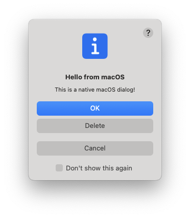
</p>

#### ShowFileDialog - File picker dialog

- Displays a dialog.

```swift
MacDialogManager.shared.showFileDialog(
    // Set the title. This field is required.
    title: "Select a file",
    // Set the message. If omitted, it is not shown.
    message: "Please select a file to open.",
    // Set allowed file extensions. If omitted, OS defaults are used.
    allowedContentTypes: ["txt", "png"],
    // Set initial directory. If omitted, OS defaults are used.
    directoryURL: nil
    // Set event to receive file picker result.
) { result in
    // result: file picker result.
    switch result {
    // filePaths: array of selected file paths. Returns [] when canceled.
    // fileCount: number of returned files. 0 when canceled.
    // directoryURL: directory URL where selection was made. Returns "" when canceled.
    // isCancelled: whether the user canceled the dialog.
    // isSuccess: success flag for dialog display. Returns true on success.
    case .success(let openResult):
        Log.d(TAG, "[ShowFileDialog] success: \(openResult)")
    // error: error details.
    case .failure(let error):
        Log.e(TAG, "[ShowFileDialog] error: \(error)")
    }
}
```

<p align="center">
    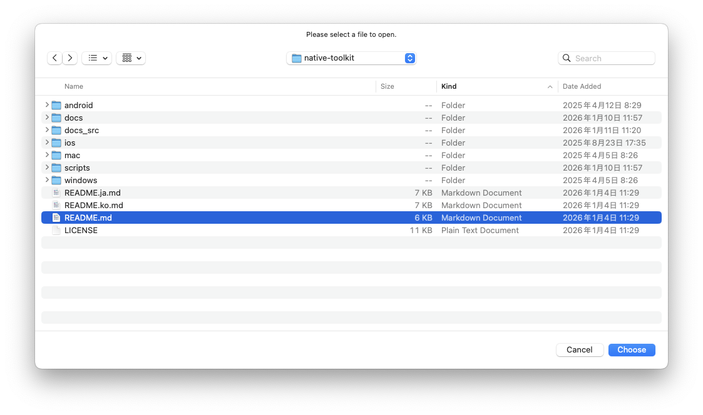
</p>

#### ShowMultiFileDialog - Multi-file picker dialog

- Displays a dialog.

```swift
MacDialogManager.shared.showMultiFileDialog(
    // Set the title. This field is required.
    title: "Select files",
    // Set the message. If omitted, it is not shown.
    message: "Please select files to open.",
    // Set allowed file extensions. If omitted, OS defaults are used.
    allowedContentTypes: ["txt", "png"],
    // Set initial directory. If omitted, OS defaults are used.
    directoryURL: nil
    // Set event to receive multi-file picker result.
) { result in
    // result: multi-file picker result.
    switch result {
    // filePaths: array of selected file paths. Returns [] when canceled.
    // fileCount: number of returned files. 0 when canceled.
    // directoryURL: directory URL where selection was made. Returns "" when canceled.
    // isCancelled: whether the user canceled the dialog.
    // isSuccess: success flag for dialog display. Returns true on success.
    case .success(let openResult):
        Log.d(TAG, "[ShowMultiFileDialog] success: \(openResult)")
    // error: error details.
    case .failure(let error):
        Log.e(TAG, "[ShowMultiFileDialog] error: \(error)")
    }
}
```

<p align="center">
    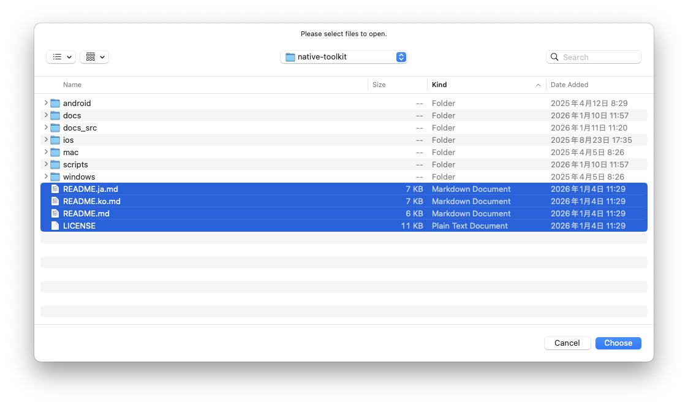
</p>

#### ShowFolderDialog - Folder picker dialog

- Displays a dialog.

```swift
MacDialogManager.shared.showFolderDialog(
    // Set the title. This field is required.
    title: "Select a folder",
    // Set the message. If omitted, it is not shown.
    message: "Please select a folder to open.",
    // Set initial directory. If omitted, OS defaults are used.
    directoryURL: nil
    // Set event to receive folder picker result.
) { result in
    // result: folder picker result.
    switch result {
    // filePaths: array of selected folder paths. Returns [] when canceled.
    // fileCount: number of returned folders. 0 when canceled.
    // directoryURL: directory URL where selection was made. Returns "" when canceled.
    // isCancelled: whether the user canceled the dialog.
    // isSuccess: success flag for dialog display. Returns true on success.
    case .success(let openResult):
        Log.d(TAG, "[ShowFolderDialog] success: \(openResult)")
    case .failure(let error):
        Log.e(TAG, "[ShowFolderDialog] error: \(error)")
    }
}
```

<p align="center">
    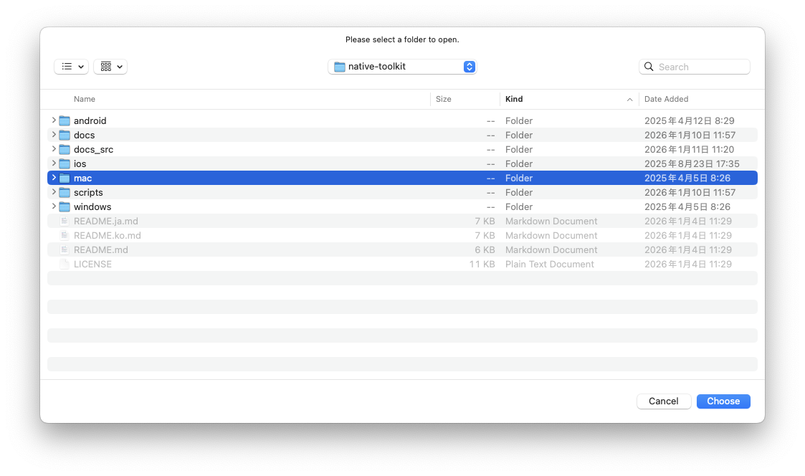
</p>

#### ShowMultiFolderDialog - Multi-folder picker dialog

- Displays a dialog.

```swift
MacDialogManager.shared.showMultiFolderDialog(
    // Set the title. This field is required.
    title: "Select folders",
    // Set the message. If omitted, it is not shown.
    message: "Please select folders to open.",
    // Set initial directory. If omitted, OS defaults are used.
    directoryURL: nil
    // Set event to receive multi-folder picker result.
) { result in
    // result: multi-folder picker result.
    switch result {
    // filePaths: array of selected folder paths. Returns [] when canceled.
    // fileCount: number of returned folders. 0 when canceled.
    // directoryURL: directory URL where selection was made. Returns "" when canceled.
    // isCancelled: whether the user canceled the dialog.
    // isSuccess: success flag for dialog display. Returns true on success.
    case .success(let openResult):
        Log.d(TAG, "[ShowMultiFolderDialog] success: \(openResult)")
    // error: error details.
    case .failure(let error):
        Log.e(TAG, "[ShowMultiFolderDialog] error: \(error)")
    }
}
```

<p align="center">
    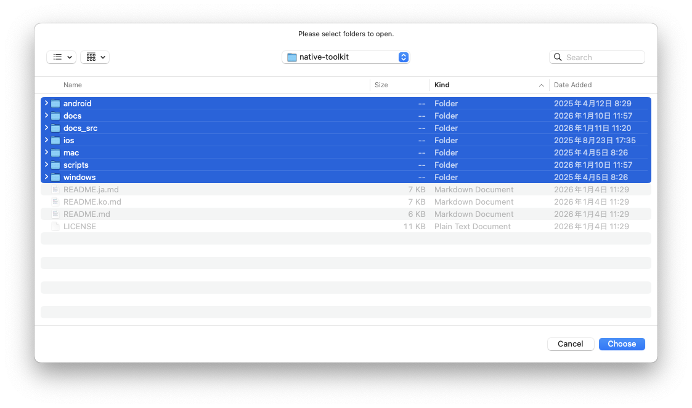
</p>

#### ShowSaveFileDialog - Save file dialog

- Displays a dialog.

```swift
MacDialogManager.shared.showSaveFileDialog(
    // Set the title. This field is required.
    title: "Save File",
    // Set the message. If omitted, it is not shown.
    message: "Choose a destination",
    // Set default file name. If omitted, OS defaults are used.
    nameFieldStringValue: "default",
    // Set allowed file extensions. If omitted, OS defaults are used.
    allowedContentTypes: ["txt"],
    // Set initial directory. If omitted, OS defaults are used.
    directoryURL: nil
    // Set event to receive save file dialog result.
) { result in
    // result: save file dialog result.
    switch result {
    // filePath: saved file path. Returns "" when canceled.
    // fileCount: number of returned paths. 1 on success, 0 when canceled.
    // directoryURL: directory URL where save was performed. Returns "" when canceled.
    // isCancelled: whether the user canceled the dialog.
    // isSuccess: success flag for dialog display. Returns true on success.
    case .success(let saveResult):
        Log.d(TAG, "[ShowSaveFileDialog] success: \(saveResult)")
    // error: error details.
    case .failure(let error):
        Log.e(TAG, "[ShowSaveFileDialog] error: \(error)")
    }
}
```

<p align="center">
    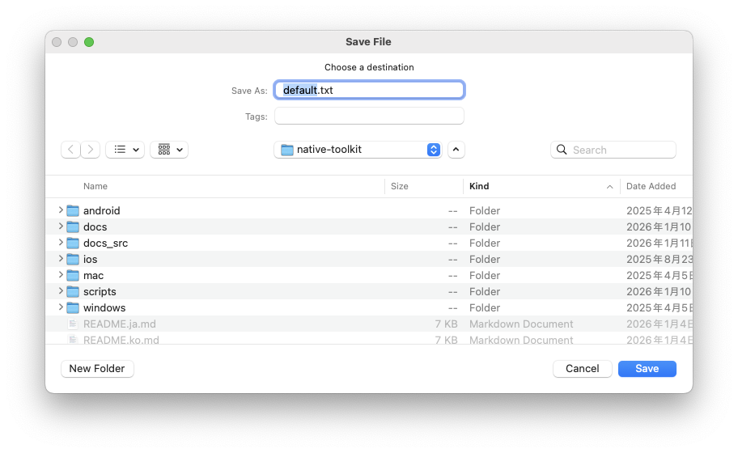
</p>
