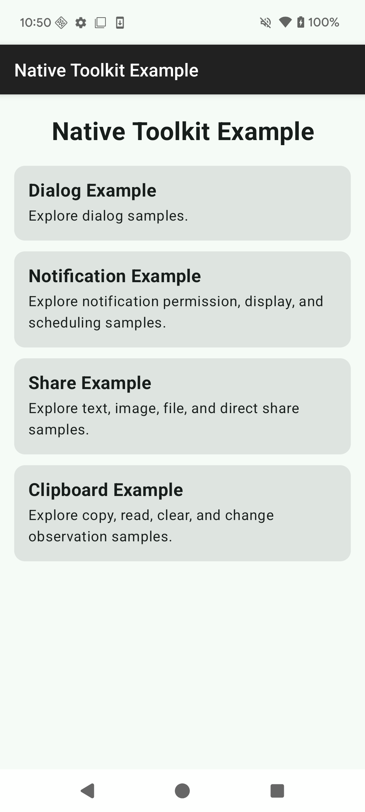
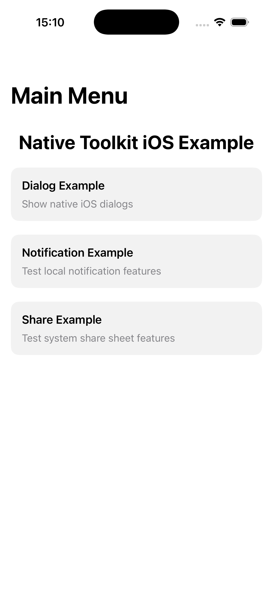
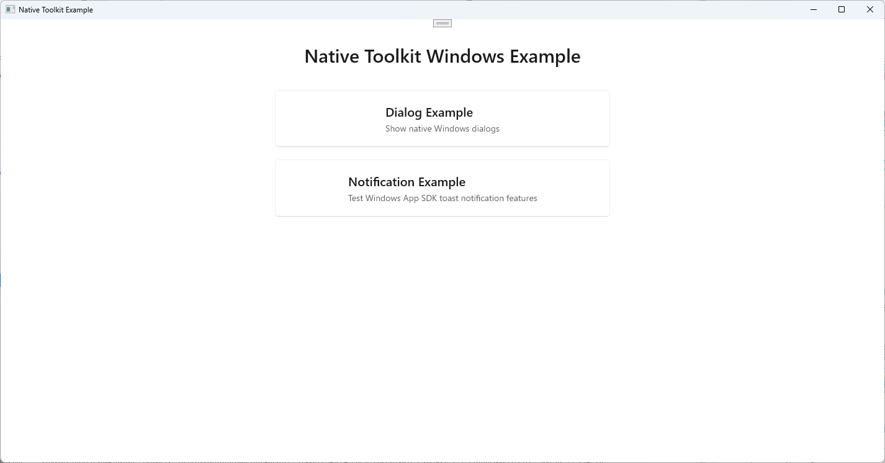
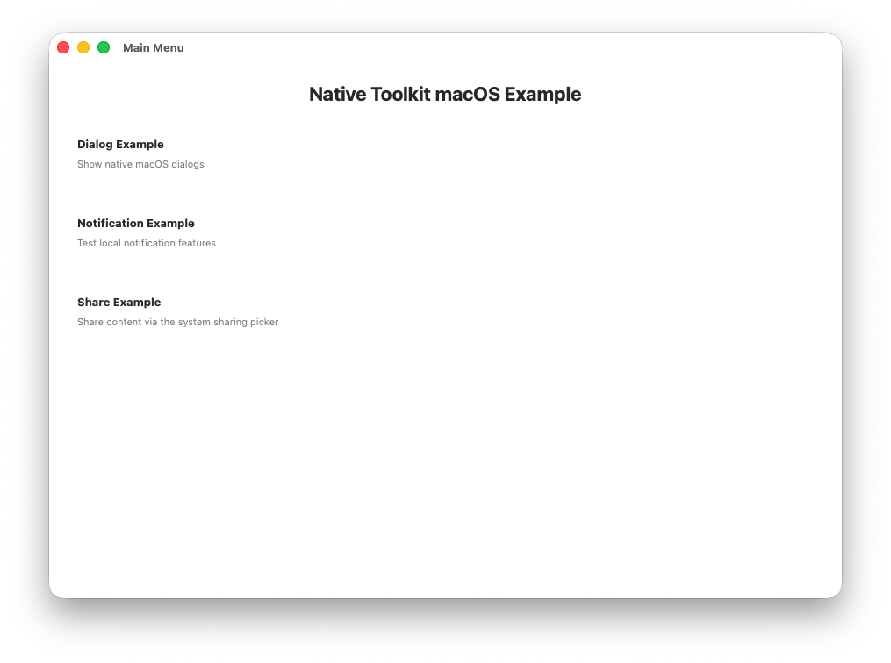

# native-toolkit マニュアル

言語:

- 日本語（このページ）
- English: [index.md](index.md)
- 한국어: [index.ko.md](index.ko.md)

このディレクトリの Markdown は、バージョン付きドキュメントとして `docs/<version>/manual/` に公開されます。

# このマニュアルの目的

- 自動生成ドキュメント（Dokka / DocC / Doxygen）だけでは補いにくい、導入手順や実運用のポイントをまとめる
- 手書きドキュメントを生成物（`docs/`）と分離し、publish 時に上書きされないようにする

# このページで分かること

- インストール / 導入
- プラットフォーム別セットアップ
  - Android (Gradle)
  - iOS (Xcode)
  - Windows (Visual Studio)
  - macOS (Xcode)
- API 使用例

# 自動生成ドキュメント（API リファレンス）

- Android: `docs/<version>/android/`
- iOS: `docs/<version>/ios/`
- Windows: `docs/<version>/windows/`
- macOS: `docs/<version>/mac/`

# 配布物の場所（`dist/<version>/`）

- Android (Kotlin API): `dist/1.13.0/android/android-native-toolkit-2.0.0.aar`
- Android (C ABI): `dist/1.13.0/android/android-native-toolkit-capi-2.0.0.aar`、ヘッダーは `dist/1.13.0/android/include/NativeToolkitC/`
- Android（両方の AAR、POM、Gradle Module Metadata を収めた Maven リポジトリ）: `dist/1.13.0/android/m2/`
- iOS: `dist/1.13.0/ios/ios-native-toolkit-1.3.0.xcframework`
- Windows (C++ API): `dist/1.13.0/windows/windows-native-toolkit-2.0.0.nupkg`
- Windows (C ABI): `dist/1.13.0/windows/windows-native-toolkit-capi-2.0.0.nupkg`
- macOS: `dist/1.13.0/mac/mac-native-toolkit-1.3.0.xcframework`

# Native Toolkit

- native-toolkit は、各プラットフォームのネイティブ機能を統一的に扱うためのツールキットです。
- パッケージには Android / iOS / Windows / macOS 向けのネイティブプラグインとサンプルが含まれ、各プラットフォームのネイティブ機能をシングルトン API で利用できます。

# バージョン

## 1.13.0

- Android ライブラリは 2.0.0 になりました。パッケージ名の変更、機能ごとのマネージャー、C ABI を含みます。[Android ライブラリを 2.0.0 へ移行する](#android-ライブラリを-200-へ移行する) を参照してください。

# 対応 OS バージョン

- Android 12 以降
- iOS 18 以降
- Windows 11 以降
- macOS 15 以降

# 機能一覧

## Android

- ダイアログ機能
  - 基本ダイアログ
  - 確認ダイアログ
  - シングル選択ダイアログ
  - マルチ選択ダイアログ
  - 入力ダイアログ
  - ログインダイアログ
  - コルーチンで結果を待つ
  - ダイアログのキャンセル
- 通知機能
  - 通知の権限（確認、リクエスト、リクエストの取り消し、設定画面を開く）
  - 通知の表示 / 更新 / 取り消し
  - 通知チャンネル管理
  - インタラクションイベント（タップ、アクション、消去）
  - 進捗通知
  - フォアグラウンドサービス通知
  - スケジュール通知
- シェア機能
  - テキスト / URL シェア
  - 画像シェア
  - ファイルシェア
  - リッチプレビュー
  - カスタム Chooser Action（Android 14 以降）
  - Direct Share Target
  - コールバック付きシェア
  - 選択イベント（選ばれたアプリ）
  - 共有コンテンツの受信
- クリップボード機能
  - コピー（プレーンテキスト・HTML・URI・複数テキスト）
  - 機微情報コピー（プレビュー抑止、Android 13 以降）
  - 読み取り / データ有無確認 / メタデータ確認
  - クリア
  - クリップボード変更監視

上の Android の機能は、C ABI（`libntk.so` の `ntk_*` 関数）を通じて C、C++、その他の言語（C#、Rust、Dart など）からも使えます。ただし、共有コンテンツの受信はアプリ自身の Activity で行う処理のため対象外です。C の関数は各機能ページに記載しています。「ライブラリ組み込み方法」の [C ABI](#c-abi) も参照してください。

## iOS

- ダイアログ機能
  - 基本ダイアログ
  - 確認ダイアログ
  - ディストラクティブなダイアログ
  - アクションシート
  - 入力ダイアログ
  - ログインダイアログ
- 通知機能
  - パーミッション
  - 通知の表示 / 更新 / 取り消し
  - スケジュール通知
  - 添付ファイル付き通知
  - バッジ
  - カテゴリとアクション
- 共有機能
  - テキスト / URL 共有
  - リッチプレビュー
  - 画像 / ファイル共有（単一・複数）
  - 組み合わせコンテンツ（件名、アクティビティタイプの除外）
- クリップボード機能
  - コピー（プレーンテキスト、HTML、URL、画像ファイル / データ、色、カスタムデータ、複数テキスト、複数表現）
  - コピーオプション（localOnly、有効期限）
  - 追記
  - 読み取り / データ読み取り / メタデータのスナップショット
  - 名前付き・ユニークペーストボードのライフサイクル
  - 非同期ロード（テキスト / URL / 画像 / ファイル）
  - パターン検出（11 種類）
  - クリップボード変更監視
  - システムペーストボタン（UIPasteControl）

## Windows

- ダイアログ機能
  - 基本ダイアログ
  - ファイル選択ダイアログ
  - 複数ファイル選択ダイアログ
  - フォルダ選択ダイアログ
  - 複数フォルダ選択ダイアログ
  - ファイル保存ダイアログ
- 通知機能
  - 通知の表示 / 更新 / 取り消し
  - スケジュール通知
  - 進捗通知
  - バッジ（パッケージ済みアプリ）
  - アクションボタンとテキスト入力

- クリップボード機能
  - コピー（テキスト、HTML、ファイル、画像、独自形式、複数形式の同時指定）
  - 書き込みオプション（履歴から除外、同期から除外、機密）
  - 貼り付け（テキスト、HTML、ファイル、画像、独自形式）
  - 形式の検査（有無、一覧、優先形式）
  - クリア
  - クリップボード変更の監視
  - 遅延レンダリング（形式の予約、要求時の生成）
  - クリップボード履歴（利用可否、一覧、復元、削除、未固定のクリア、キャンセル）

## Mac

- ダイアログ機能
  - 基本ダイアログ
  - ファイル選択ダイアログ
  - 複数ファイル選択ダイアログ
  - フォルダ選択ダイアログ
  - 複数フォルダ選択ダイアログ
  - ファイル保存ダイアログ
- 通知機能
  - パーミッション
  - 通知の表示 / 更新 / 取り消し
  - スケジュール通知
  - バッジ
  - カテゴリとアクション
- Share 機能
  - ピッカー経由のテキスト / URL / 画像 / ファイル共有（単数・複数）
  - ピッカーからのサービス除外
  - 個別サービスの直接実行（recipients、subject）
  - サービスが実行可能かの確認
- クリップボード機能
  - コピー（テキスト、URL、画像、複数アイテム、複数表現）
  - コピーオプション（localOnly、既定で有効）
  - 追記
  - 読み取り / データ読み取り / 型で絞ったスナップショット
  - 名前付き・ユニークペーストボードのライフサイクル
  - 検出（パターン、値、メタデータ。macOS 15.4 以降）
  - クリップボード変更監視
  - システムペーストボタン（PasteButton）
  - クリア

## サンプル

- Android サンプル
  - Android Studio をインストールします。
    - <a href="https://developer.android.com/studio?hl=ja" target="_blank" rel="noopener noreferrer">参考サイト</a>
  - Android Studio を起動します。
  - 「File」→「Open...」 を選択します。
  - 「native-toolkit/android/AndroidLibraryExample」を選択して「開く」ボタンをクリックします。
  - Android 端末を接続します。
  - 「Run」ボタンをクリックして、サンプルアプリをインストールします。
    <p align="center">
        
    </p>

- iOS サンプル
  - Xcode をインストールしてください。
    - <a href="https://developer.apple.com/jp/xcode" target="_blank" rel="noopener noreferrer">参考サイト</a>
  - Xcode を起動します。
  - 「Open Existing Project...」 を選択します。
  - 「native-toolkit/ios/IosWorkspace.xcworkspace」を選択して「Open」ボタンをクリックします。
  - 「Run」ボタンをクリックして、サンプルアプリをインストールします。
    <p align="center">
        
    </p>

- Windows サンプル
  - Visual Studio 2022 をインストールしてください。
    - <a href="https://visualstudio.microsoft.com/ja/vs/" target="_blank" rel="noopener noreferrer">参考サイト</a>
  - Visual Studio 2022 を起動します。
  - 「プロジェクトやソリューションを開く(P)」 を選択します。
  - 「native-toolkit\windows\WindowsLibraryExample\WindowsLibraryExample.sln」を選択して「開く」ボタンをクリックします。
  - 「デバッグ(D)」→「デバッグ開始(S)」 を選択して、サンプルアプリをインストールします。
    <p align="center">
        
    </p>

- Mac サンプル
  - Xcode をインストールしてください。
    - <a href="https://developer.apple.com/jp/xcode" target="_blank" rel="noopener noreferrer">参考サイト</a>
  - Xcode を起動します。
  - 「Open Existing Project...」 を選択します。
  - 「native-toolkit/mac/MacWorkspace.xcworkspace」を選択して「Open」ボタンをクリックします。
  - 「Run」ボタンをクリックして、サンプルアプリをインストールします。
    <p align="center">
        
    </p>

## ライブラリ組み込み方法

### Android

#### 対応プラットフォーム: Android 12（API 31）以降

Android ライブラリは 2 つの AAR で配布します。

| AAR | 対象 | 内容 |
|---|---|---|
| `android-native-toolkit-2.0.0.aar` | Kotlin・Java から呼ぶ場合 | Kotlin の API（`com.jonghyunkim.nativetoolkit.*`） |
| `android-native-toolkit-capi-2.0.0.aar` | C、C++、その他の言語から呼ぶ場合 | C ABI。`libntk.so`（`arm64-v8a`、`x86_64`）、Prefab で提供するそのヘッダー、そこから呼ぶ Kotlin 側を含みます。Kotlin の API の AAR に依存します |

要件:

- `minSdk` 31 以降、`compileSdk` 36 以降
- Android Gradle Plugin 8.9.1 以降（AndroidX の依存が必要とするため）
- アプリを Kotlin で書く場合は Kotlin 2.1 以降（ライブラリは実行時に `kotlin-stdlib` 2.2 以降を必要とし、Gradle がこれを解決します）

##### 方法 A: Maven リポジトリ（推奨）

`dist/1.13.0/android/m2/` は、2 つの AAR とその依存情報を収めた Maven リポジトリです。AAR が必要とする AndroidX と Kotlin のライブラリは Gradle が解決します。

1. `dist/1.13.0/android/m2/` をプロジェクトにコピーします（例: `third_party/native-toolkit-m2/`）。
2. `settings.gradle.kts` にリポジトリとして追加します。
3. `app/build.gradle.kts` に依存関係を追加します。
4. Gradle 同期を実行し、ビルドします。

**settings.gradle.kts:**

```kotlin
dependencyResolutionManagement {
    repositoriesMode.set(RepositoriesMode.FAIL_ON_PROJECT_REPOS)
    repositories {
        google()
        mavenCentral()
        maven { url = uri("third_party/native-toolkit-m2") }
    }
}
```

**app/build.gradle.kts:**

```kotlin
dependencies {
    // Kotlin の API です。
    implementation("io.github.kimjh4941:android-native-toolkit:2.0.0")
    // C ABI です。C や他の言語からライブラリを呼ぶ場合に追加します。実行時に Kotlin の API を必要とし、
    // それを実行時の依存として取り込みます。アプリ自身の Kotlin・Java のコードも Kotlin の API を
    // 呼ぶ場合は、上の行も残してください。
    implementation("io.github.kimjh4941:android-native-toolkit-capi:2.0.0")
}
```

##### 方法 B: AAR ファイル

AAR ファイルを自分で配置する場合、Gradle はそれらの依存先を知らないため、下の依存関係もあわせて追加してください。

1. `android-native-toolkit-2.0.0.aar`（C ABI を使う場合は `android-native-toolkit-capi-2.0.0.aar` も）を `app/libs` に配置します。
2. `app/build.gradle.kts` に AAR と依存関係を追加します。

**app/build.gradle.kts:**

```kotlin
dependencies {
    implementation(files("libs/android-native-toolkit-2.0.0.aar"))
    implementation(files("libs/android-native-toolkit-capi-2.0.0.aar")) // C ABI を使う場合のみ

    // AAR が実行時に必要とするものです。
    implementation("org.jetbrains.kotlin:kotlin-stdlib:2.2.21")
    implementation("org.jetbrains.kotlin:kotlin-parcelize-runtime:2.2.21")
    implementation("androidx.core:core-ktx:1.18.0")
    implementation("androidx.fragment:fragment:1.9.1")
    implementation("androidx.media:media:1.8.0")
    implementation("androidx.startup:startup-runtime:1.2.0")
    implementation("org.jetbrains.kotlinx:kotlinx-coroutines-core:1.9.0")
}
```

<!-- ntk-android-dependencies: the list above is checked against the Gradle Module Metadata of the release by scripts/check_android_dist.py -->

##### 初期化

ライブラリは、アプリの起動時に AndroidX App Startup（`androidx.startup.InitializationProvider`。AAR がマージ後のマニフェストに追加します）を通じて自動で初期化されます。呼び出す必要のあるものはありません。

App Startup が先に動かない次の場合は、最初の呼び出しの前に自分で初期化してください。

- アプリが App Startup を無効にしている（またはマージ後のマニフェストからライブラリの initializer を取り除いている）場合
- アプリの既定のプロセス以外のプロセスからライブラリを呼ぶ場合（App Startup は既定のプロセスでしか動きません）
- 自前の `ContentProvider` から呼ぶ場合（App Startup のものより先に生成されることがあります）

方法:

- Kotlin の API: 最初の Activity の `onCreate` から、その Activity を渡して `LibraryRuntime.ensureInitialized(activity)`（`com.jonghyunkim.nativetoolkit.common.runtime`）を呼びます。ライブラリはそれ以降、前面の Activity を追跡します。アプリケーションコンテキストだけを渡すと、すでに画面に出ている Activity を取りこぼし、次の Activity が始まるまでダイアログと権限リクエストは「前面にない」として完了します
- C ABI: C からは `ntk_android_init(env, activity)`、Kotlin からは `NativeToolkitCApi.init(activity)` を呼びます。ダイアログなど前面で動く機能が Activity を見つけられるよう、現在の Activity があれば渡してください。どちらも待ちません。`ntk_android_init` は `NTK_ANDROID_ERROR_IN_PROGRESS`（別のスレッドが初期化中）や `NTK_ANDROID_ERROR_JNI_FAILURE` を、`NativeToolkitCApi.init` は `IN_PROGRESS` や `RETRYABLE_ERROR` を返すことがあります。その場合は後でもう一度呼んでください。C ABI の準備ができているかは `ntk_android_is_initialized()` で確認できます

##### アプリに加わる権限とコンポーネント

Kotlin の API の AAR は通知機能が使う権限を宣言しており、それらはアプリのマニフェストにマージされます。不要なものは `tools:node="remove"` で取り除いてください。

| 権限 | ない場合に動かなくなること | あわせて取り除くもの |
|---|---|---|
| `POST_NOTIFICATIONS` | Android 13 以降で通知が表示されません。`hasPermission` は false になり、権限リクエストはすぐに拒否されます | - |
| `RECEIVE_BOOT_COMPLETED` | 端末の再起動後にスケジュール通知が復元されません | - |
| `SCHEDULE_EXACT_ALARM` | スケジュールは不正確なアラームを使います（`canScheduleExactAlarms` は false） | - |
| `USE_FULL_SCREEN_INTENT` | フルスクリーンインテントはヘッドアップ通知として表示されます | - |
| `FOREGROUND_SERVICE` | 進捗通知と通話スタイルの通知がフォアグラウンドサービスを開始できません | 下の 2 つのサービス。あわせてそれらの API も呼ばないでください |
| `FOREGROUND_SERVICE_DATA_SYNC` | 進捗通知がフォアグラウンドサービスを開始できません | `com.jonghyunkim.nativetoolkit.notification.presentation.progress.ProgressForegroundService` |
| `FOREGROUND_SERVICE_SPECIAL_USE` | 通話スタイルの通知がフォアグラウンドサービスを開始できません | `com.jonghyunkim.nativetoolkit.notification.presentation.call.CallStyleForegroundService` |

**AndroidManifest.xml（アプリ側）:**

```xml
<manifest xmlns:android="http://schemas.android.com/apk/res/android"
    xmlns:tools="http://schemas.android.com/tools">

    <uses-permission android:name="android.permission.FOREGROUND_SERVICE_DATA_SYNC" tools:node="remove" />

    <application>
        <service
            android:name="com.jonghyunkim.nativetoolkit.notification.presentation.progress.ProgressForegroundService"
            tools:node="remove" />
    </application>
</manifest>
```

##### C ABI

C ABI は、C、C++、その他の言語からライブラリを呼ぶアプリ向けです。Kotlin・Java のアプリは Kotlin の API を直接呼んでください。C ABI を経由しても、JNI の往復が増えるだけです。

- アプリは Kotlin・Java のコードを持つ通常の Android アプリです（`android:hasCode="true"`）。C の関数は JNI を通じて Kotlin の API を呼ぶため、AAR の Kotlin のクラスとマニフェストのエントリがアプリに含まれている必要があります。`libntk.so` だけをコピーしても動きません
- `libntk.so` は `arm64-v8a` と `x86_64` 向けにだけビルドしています。32 ビットの端末や、32 ビットの ABI だけでビルドしたアプリにはこのライブラリがありません。アプリは起動しますが、`libntk.so` の読み込みに失敗します（たとえば C# では `DllNotFoundException`）。これに対処するか、アプリを 64 ビットの ABI だけでビルドしてください
- 完了、イベント、受け付けた呼び出しの `release` は Android のメインスレッドで届き、呼び出し元のスレッドではありません。コールバックを登録したスレッドでしか受け取れないランタイムは、C ABI をそのままでは使えません。（入口で拒否された呼び出しは、エラーを返し、戻る前に呼び出し元のスレッドで `release` を呼びます。完了は届きません）
- ダイアログ、Share、設定画面、まだ許可されていない通知権限のリクエストは、アプリが前面にある必要があります。バックグラウンドから呼ぶと `NOT_FOREGROUND` で完了します

CMake を使う C・C++ では、AAR が Prefab を通じてヘッダーと `libntk.so` を提供します。

**app/build.gradle.kts:**

```kotlin
android {
    buildFeatures { prefab = true }
    defaultConfig {
        ndk { abiFilters += listOf("arm64-v8a", "x86_64") }
        externalNativeBuild {
            cmake { abiFilters("arm64-v8a", "x86_64") }
        }
    }
}
```

**CMakeLists.txt:**

```cmake
find_package(ntk REQUIRED CONFIG)
target_link_libraries(your_library PRIVATE ntk::ntk)
```

`ntk::ntk` を使う CMake のビルドは、上のように 64 ビットの ABI に限定してください。Prefab には 32 ビットの ABI 向けの `libntk.so` がありません。Android Gradle Plugin は CMake のビルドが対象とするすべての ABI について Prefab パッケージを検査し、`CXX1210` で停止します。`CMakeLists.txt` の `if()` では回避できません。アプリが独自の 32 ビットのネイティブコードも含む場合は、Prefab を使わない別のモジュールでビルドしてください。

他の言語からは、アプリの起動後に `libntk.so` を名前（`ntk`）で読み込みます。関数、スレッド、エラーは、各機能ページの Android の節にある C ABI の項に記載しています。

C ABI の AAR には R8 のルールが含まれているため、minify を有効にしたリリースビルドでも追加の設定は不要です。アプリが App Startup を無効にし、`NativeToolkitCApi.init` をリフレクションや別のランタイムから呼ぶ場合は、そのクラスを keep してください。`NativeToolkitCApi` は Kotlin の `object` で、`init` は static ではありません。たとえば Unity からは `new AndroidJavaClass("com.jonghyunkim.nativetoolkit.capi.NativeToolkitCApi").GetStatic<AndroidJavaObject>("INSTANCE").Call<AndroidJavaObject>("init", activity)` のように呼びます。

```
-keep class com.jonghyunkim.nativetoolkit.capi.NativeToolkitCApi { *; }
-keep class com.jonghyunkim.nativetoolkit.capi.NativeToolkitCApi$InitResult { *; }
```

##### Android ライブラリを 2.0.0 へ移行する

2.0.0 は 1.x と互換性がありません。1.x 向けに書いたコードは変更が必要です。

| 1.x | 2.0.0 |
|---|---|
| パッケージ `android.library.*` | パッケージ `com.jonghyunkim.nativetoolkit.*` |
| 機能ごとのユースケースとヘルパー | 機能ごとに 1 つのマネージャー: `AndroidDialogManager`、`AndroidNotificationManager`、`AndroidShareManager`、`AndroidClipboardManager`（`getInstance(context)`） |
| 1.x でスケジュールした通知 | アプリが初めて 2.0.0 で動いたときに **一度だけ破棄されます**（保存形式が変わったため）。もう一度スケジュールしてください |
| 1.x が表示し、まだ画面に残っている通知 | 更新後はタップやアクションに反応しません（レシーバーの名前が変わったため）。必要なら表示し直してください |
| 1.x のマニュアルに従ってシェア用に宣言した `FileProvider` | **削除してください。** ライブラリが独自のもの（authority `${applicationId}.native_toolkit.share.fileprovider`）を宣言します。マニフェストで `androidx.core.content.FileProvider` を再度宣言すると、マニフェストのマージで衝突します。独自の provider は `FileProvider` のサブクラスにする必要があります |
| Unity ブリッジの AAR `unity-android-native-toolkit-*.aar`（`android.unity.*`） | **削除しました。** Unity は Unity パッケージの中で、P/Invoke を通じて C ABI（`android-native-toolkit-capi`）を呼びます。Kotlin・Java のアプリがブリッジを使うことは想定していませんでした |
| アプリの起動時にライブラリは何も追加しませんでした | AndroidX App Startup（`InitializationProvider`）を追加し、自動で初期化します（上の「初期化」を参照） |
| 1 つの AAR ファイル | これまでどおりの Kotlin の API の AAR（Kotlin・Java のアプリはこれだけで足ります）に加え、C や他の言語向けの C ABI の AAR と、両方を収めた Maven リポジトリ（上の「方法 A」と「方法 B」を参照） |

操作ごとの変更は、各機能ページの Android の節に記載しています。

**Unity:** 2.0.0 では Unity パッケージが C ABI を呼びます。Unity プロジェクトには、Minimum API Level 31 以降、C ABI のための 64 ビット（ARM64）ビルド、Unity 6000.0.61f1、6000.3.1f1、6000.4.1f1 以降が必要です（AndroidX の依存が Android Gradle Plugin 8.9.1 を必要とするため）。

### iOS

#### 対応プラットフォーム: iOS（実機: arm64 / Simulator: arm64, x86_64）

1. `ios-native-toolkit-1.3.0.xcframework` を、作成した Xcode プロジェクト直下の `Frameworks` フォルダ（なければ作成）にコピーします。
2. Xcode 26.2 で対象プロジェクトを開き、**Project Navigator** でアプリのターゲットを選択します。
3. **General** タブを開き、**Frameworks, Libraries, and Embedded Content** の **+** を押します。
4. **Add Other...** → **Add Files...** を選択し、`Frameworks/ios-native-toolkit-1.3.0.xcframework` を追加します。
5. 追加後、`ios-native-toolkit-1.3.0.xcframework` の Embed 設定を **Embed & Sign** に変更します。
6. 同じターゲットの **Build Settings** を開き、`Framework Search Paths` に `$(PROJECT_DIR)/Frameworks` を追加します。（通常は non-recursive）
7. **Signing & Capabilities** で Team が正しく設定されていることを確認します。
8. **Product** → **Clean Build Folder** を実行してから、**Run** でビルド・起動します。
9. エラーなく起動できれば組み込み完了です。

### Windows

#### 対応プラットフォーム: Windows x64（win-x64）

Windows ライブラリは、1 つの実装を 2 つの NuGet パッケージとして配布します。呼び出し方に合う方を入れてください。両方入れても構いません。

| パッケージ | 対象 | 内容 |
|---|---|---|
| `NativeToolkit` | C++ から呼ぶ場合 | C++ API の公開ヘッダー（`NativeToolkit/`）と静的ライブラリ |
| `NativeToolkit.CApi` | C から、また他の言語から呼ぶ場合 | C ABI の公開ヘッダー（`NativeToolkitC/`）、`NativeToolkitC.dll`、その import ライブラリ |

`NativeToolkit` は MSVC v143、`/std:c++20`、DLL ランタイム（`/MD`、`/MDd`）、x64 で作った静的ライブラリです。これらの設定が異なるプロジェクトは LNK2038 でリンクに失敗します。`NativeToolkit.CApi` にはこの制約はありません。ヘッダーが C99 だけで書かれているためです。

どちらも `Microsoft.WindowsAppSDK` を依存として宣言しており、NuGet が一緒に復元します。パッケージ識別子を持たないアプリでは、`Microsoft.WindowsAppRuntime.Bootstrap.dll` を実行ファイルの隣に置く必要もあります。

1. `windows-native-toolkit-2.0.0.nupkg` と `windows-native-toolkit-capi-2.0.0.nupkg` を `C:\packages` にコピーします。
2. Visual Studio 2022 を起動し、**ツール** → **オプション** → **NuGet パッケージ マネージャー** → **パッケージ ソース** を開きます。
3. 右上の **+** を押し、次の内容を入力します。
   - 名前: LocalPackages
   - ソース: C:\packages  
     入力後、**更新** ボタンを押して保存します。
4. 対象のソリューションを開きます。
5. **ソリューション エクスプローラー** でプロジェクトを右クリックし、**NuGet パッケージの管理** を選択します。
6. 右上の **パッケージ ソース** を **LocalPackages** に切り替えます。
7. 検索欄で **NativeToolkit** または **NativeToolkit.CApi** を検索し、**インストール** をクリックします。
8. ライセンス確認が表示された場合は承諾し、インストール完了です。

#### 1.x からの移行

1.x は C ABI だけを公開する 1 つのパッケージでした（`showAlertDialog`、`initNotificationManager`、`initClipboardManager` など）。2.0.0 はそれを置き換えます。すべての関数の名前とシグネチャが変わるため、1.x 向けに書いたコードはそのままではコンパイルできません。

| 1.x | 2.0.0 |
|---|---|
| `<common.h>`、`<WindowsDialogManager.h>`、`<WindowsNotificationManager.h>`、`<WindowsClipboardManager.h>` | `<NativeToolkit/Dialog.h>` など、または `<NativeToolkitC/Dialog.h>` など |
| JSON の文字列 | 型のある構造体（C++）、または内容のビルダー（C ABI） |
| `wchar_t*` のバッファーと 2 回の呼び出し | 呼び出しが返す値（C++）、または `_free` で解放するハンドル（C ABI） |
| `DWORD* pError` | `Result<T>`（C++）、または戻り値と `ntk_last_system_code()`（C ABI） |
| プロセス全体の状態を持つ自由関数 | 寿命が明示された `Clipboard::Session` と `Notification::Manager` |

操作ごとの対応は、各機能ページの Windows の節にあります。まだ移行できないプロジェクトは、1.11.0 のリリースのままで使えます。そちらの Windows のパッケージには 1.x の C ABI が残っています。

### macOS

#### 対応プラットフォーム: macOS arm64, x86_64

1. `mac-native-toolkit-1.3.0.xcframework` を、作成した Xcode プロジェクト直下の `Frameworks` フォルダ（なければ作成）にコピーします。
2. Xcode 26.2 で対象プロジェクトを開き、Project Navigator でアプリのターゲットを選択します。
3. **General** タブを開き、**Frameworks, Libraries, and Embedded Content** の `+` を押します。
4. 「Add Other...」→「Add Files...」を選択し、`Frameworks/mac-native-toolkit-1.3.0.xcframework` を追加します。
5. 追加後、`mac-native-toolkit-1.3.0.xcframework` の Embed 設定を **Embed & Sign** に変更します。
6. 同じターゲットの **Build Settings** を開き、`Framework Search Paths` に `$(PROJECT_DIR)/Frameworks` を追加します。（通常は non-recursive）
7. **Signing & Capabilities** で Team が正しく設定されていることを確認します。
8. **Product** → **Clean Build Folder** を実行してから、**Run** でビルド・起動します。
9. エラーなく起動できれば組み込み完了です。

# API 使用方法

- [ダイアログ機能](dialog.ja.md)
- [通知機能](notification.ja.md)
- [シェア機能](share.ja.md)
- [クリップボード機能](clipboard.ja.md)
