# Notification Feature

Language:

- 日本語: [notification.ja.md](notification.ja.md)
- English (this page)
- 한국어: [notification.ko.md](notification.ko.md)

← [Back to Manual Top](index.md)

---

## Table of Contents

- [Android](#android)
  - [AndroidNotificationManager](#androidnotificationmanager)
  - [Changes from 1.x](#changes-from-1x)
  - [Setup](#setup)
    - [Permissions and Components](#permissions-and-components)
    - [Initialization](#initialization)
    - [Getting the Manager](#getting-the-manager)
  - [Permission](#permission)
    - [Check the Permission State](#check-the-permission-state)
    - [Request the Permission (Callback)](#request-the-permission-callback)
    - [Request the Permission (Coroutine)](#request-the-permission-coroutine)
    - [Cancel a Permission Request](#cancel-a-permission-request)
    - [Open a Settings Screen](#open-a-settings-screen)
  - [Channel Management](#channel-management)
  - [Basic Notification Operations](#basic-notification-operations)
  - [Notification Styles](#notification-styles)
  - [Platform Options](#platform-options)
  - [Custom View Styles](#custom-view-styles)
  - [Group Notifications](#group-notifications)
  - [Interaction](#interaction)
    - [Receiving Events](#receiving-events)
    - [Body Tap Event](#body-tap-event)
    - [Action Buttons](#action-buttons)
    - [DeleteIntent (Dismiss Event)](#deleteintent-dismiss-event)
    - [FullScreenIntent (Full-Screen Display)](#fullscreenintent-full-screen-display)
  - [Progress Notifications](#progress-notifications)
  - [Foreground Service Notifications](#foreground-service-notifications)
  - [Scheduled Notifications](#scheduled-notifications)
    - [Cancel Scheduled Notifications](#cancel-scheduled-notifications)
    - [Check Scheduled Status](#check-scheduled-status)
    - [Restore After Reboot](#restore-after-reboot)
    - [Schedules Saved by 1.x](#schedules-saved-by-1x)
  - [C ABI](#c-abi)
    - [Initialization, the permission and settings](#initialization-the-permission-and-settings)
    - [Channels and the content builder](#channels-and-the-content-builder)
    - [Styles, taps and actions](#styles-taps-and-actions)
    - [Scheduling and progress](#scheduling-and-progress)
    - [Interaction and shown events](#interaction-and-shown-events)
    - [Notification errors](#notification-errors)
- [iOS](#ios)
  - [IosNotificationManager](#iosnotificationmanager)
  - [Setup](#setup-1)
  - [Permission](#permission-1)
    - [Request Notification Permission](#request-notification-permission)
    - [Check Permission](#check-permission)
    - [Get Authorization Status](#get-authorization-status)
    - [Open Notification Settings](#open-notification-settings)
  - [Show Notification](#show-notification)
    - [Immediate](#immediate)
    - [Immediate with Attachment](#immediate-with-attachment)
    - [Time Interval Trigger](#time-interval-trigger)
    - [Calendar Trigger](#calendar-trigger)
    - [Location Trigger](#location-trigger)
  - [Attachment](#attachment)
  - [Update Notification](#update-notification)
  - [Cancel / Remove Notification](#cancel--remove-notification)
  - [Scheduled Notifications](#scheduled-notifications-1)
    - [Cancel Scheduled](#cancel-scheduled)
  - [Query](#query)
  - [Badge](#badge)
  - [Category and Actions](#category-and-actions)
    - [Register Category](#register-category)
    - [Attach Category to Notification](#attach-category-to-notification)
    - [Remove Category](#remove-category)
    - [Action Received Callbacks](#action-received-callbacks)
- [Windows](#windows)
  - [NativeToolkit::Notification](#nativetoolkitnotification)
  - [Setup](#setup-2)
    - [Package.appxmanifest (Packaged apps)](#packageappxmanifest-packaged-apps)
    - [Create the manager (packaged app)](#create-the-manager-packaged-app)
    - [Create the manager (unpackaged app)](#create-the-manager-unpackaged-app)
    - [Close](#close)
  - [Init / Setting](#init--setting)
    - [Get Notification Setting](#get-notification-setting)
    - [Open Notification Settings](#open-notification-settings-1)
  - [Show Notification](#show-notification-1)
    - [Basic](#basic)
    - [With Buttons](#with-buttons)
    - [With Image](#with-image)
    - [With Input](#with-input)
    - [With Progress](#with-progress)
    - [With Expiration](#with-expiration)
    - [With Audio](#with-audio)
  - [Schedule Notification](#schedule-notification)
    - [Cancel Scheduled](#cancel-scheduled-1)
  - [Update Progress](#update-progress)
  - [Badge](#badge-1)
  - [Remove / Query](#remove--query)
    - [Get All Notifications](#get-all-notifications)
    - [Remove by ID](#remove-by-id)
    - [Remove by Tag](#remove-by-tag)
    - [Remove All](#remove-all)
  - [Activation handler](#activation-handler)
  - [Error Codes](#error-codes)
  - [C ABI](#c-abi-1)
    - [The runtime, the manager and activations](#the-runtime-the-manager-and-activations)
    - [Building the content, showing and scheduling](#building-the-content-showing-and-scheduling)
    - [Progress, badge and the OS settings](#progress-badge-and-the-os-settings)
    - [Listing and removing](#listing-and-removing)
- [macOS](#macos)
  - [MacNotificationManager](#macnotificationmanager)
  - [Setup](#setup-2)
  - [Permission](#permission-2)
    - [Request Permission](#request-permission)
    - [Check Permission](#check-permission-1)
    - [Get Authorization Status](#get-authorization-status-1)
    - [Open Notification Settings](#open-notification-settings-1)
    - [Reset Notification Permission (macOS 26.3)](#reset-notification-permission-macos-263)
  - [Show Notification](#show-notification-2)
    - [Immediate](#immediate-1)
    - [Time Interval Trigger](#time-interval-trigger-1)
    - [Calendar Trigger](#calendar-trigger-1)
  - [Update / Cancel / Remove](#update--cancel--remove)
    - [Update by ID](#update-by-id)
    - [Cancel by ID](#cancel-by-id)
    - [Cancel All](#cancel-all)
    - [Remove Delivered by ID](#remove-delivered-by-id)
    - [Remove All Delivered](#remove-all-delivered)
  - [Schedule](#schedule)
    - [Schedule with Time Interval](#schedule-with-time-interval)
    - [Schedule with Calendar](#schedule-with-calendar)
    - [Cancel Scheduled by ID](#cancel-scheduled-by-id)
    - [Cancel All Scheduled](#cancel-all-scheduled)
  - [Query](#query-1)
    - [Get Scheduled](#get-scheduled)
    - [Get Delivered](#get-delivered)
  - [Badge](#badge-1)
  - [Category](#category)
    - [Register Category](#register-category-1)
    - [Remove Category](#remove-category-1)
  - [Error Codes](#error-codes)

---

## Android

Local notifications on Android 12 (API 31) and later. The Android library 2.0.0 offers them through two public APIs over one implementation, and the sample app uses the Kotlin API.

| API | Names | Package / header | AAR |
|---|---|---|---|
| Kotlin API | `AndroidNotificationManager` | `com.jonghyunkim.nativetoolkit.notification` | `android-native-toolkit-2.0.0.aar` |
| C ABI | `ntk_notification_*` | `<NativeToolkitC/Notification.h>` | `android-native-toolkit-capi-2.0.0.aar` |

The C ABI is described in [C ABI](#c-abi) at the end of this section. Coming from 1.x, read [Changes from 1.x](#changes-from-1x) and [Migrating the Android library to 2.0.0](index.md#migrating-the-android-library-to-200).

### AndroidNotificationManager

- `AndroidNotificationManager.getInstance(context)` returns the one manager of the process. It keeps only the Application Context, so any Context can be passed.
- The operations that post, change or remove notifications return `Result<Unit>`, except the progress foreground service calls (`startProgress`, `updateProgress`, `completeProgress`, `stopProgress`), which return `Unit` and throw when Android refuses the service. The queries (`hasPermission`, `areNotificationsEnabled`, `canScheduleExactAlarms`, `isScheduled`, `getActive`) return their value directly. These calls are synchronous, may be made from any thread, and never wait for the main thread.
- `schedule`, `cancelScheduled` and `cancelAllScheduled` write the saved schedules to a file on the calling thread. Called on the main thread, they touch the disk there and may wait for another thread's write.
- `requestPermission` is asynchronous: its result arrives on the main thread, never inside the call.
- `interactions` and `shown` are event hubs (`EventHub`). Add and remove their listeners on the main thread only (`IllegalStateException` otherwise). Listeners are called on the main thread, and an exception a listener throws is caught and logged.
- `NotificationUseCases`, `NotificationPermissionHelper` and `ProgressForegroundNotifications` remain public with their 1.x behavior. This page uses the manager.

---

### Changes from 1.x

| 1.x | 2.0.0 |
|---|---|
| Packages `android.library.notification.*` | Packages `com.jonghyunkim.nativetoolkit.notification.*`, with the same sub-packages (`domain.model`, `application.model`, `presentation.*`) |
| `NotificationUseCases(context)` | `AndroidNotificationManager.getInstance(context)`, with the same operation names. `isScheduled(context, id)` becomes `isScheduled(id, tag)` |
| `NotificationPermissionHelper(activity).requestPermission { granted -> }` | `manager.requestPermission { result -> }`, or the `suspend` version. No Activity is needed |
| `openNotificationSettings()` / `openExactAlarmSettings()` | `manager.openSettings(NotificationSettingsTarget.NOTIFICATIONS, activity)` / `manager.openSettings(NotificationSettingsTarget.EXACT_ALARM, activity)` |
| `ProgressForegroundNotifications.start(context, command)` and the others | `manager.startProgress(command)` / `updateProgress` / `completeProgress` / `stopProgress` |
| Your own `BroadcastReceiver` for action buttons and dismissals | `NotificationEventIntents` and `manager.interactions` (see [Interaction](#interaction)) |
| `<service>` and `<receiver>` entries for the library in your manifest | Not needed: the AAR declares them under the new names. Delete the `android.library.*` entries the 1.x manual had you add |
| Notifications scheduled with 1.x | Discarded once when the app first runs 2.0.0 (see [Schedules Saved by 1.x](#schedules-saved-by-1x)) |
| Notifications shown by 1.x and still on screen | No longer respond to taps or action buttons after the update: the receivers they point to have new class names. Show them again if needed |

---

### Setup

Add the AAR to your app as described in the [manual top](index.md#option-a-the-maven-repository-recommended).

#### Permissions and Components

The AAR declares everything notifications need, and the manifest merge adds it to your app. Nothing has to be added to your own `AndroidManifest.xml`.

- Permissions: `POST_NOTIFICATIONS`, `RECEIVE_BOOT_COMPLETED`, `SCHEDULE_EXACT_ALARM`, `USE_FULL_SCREEN_INTENT`, `FOREGROUND_SERVICE`, `FOREGROUND_SERVICE_DATA_SYNC`, `FOREGROUND_SERVICE_SPECIAL_USE`
- Components: the receivers for notification events and scheduled notifications (including the one that restores schedules after a reboot), an invisible Activity that opens the app from a notification, a transparent Activity that hosts the permission dialog when needed, and the progress (`dataSync`) and call (`specialUse`) foreground services

To remove a permission your app does not use, see [Permissions and components added to your app](index.md#permissions-and-components-added-to-your-app).

#### Initialization

The library initializes itself when the app starts, through AndroidX App Startup. An app that disables App Startup calls `LibraryRuntime.ensureInitialized(activity)` itself in its first Activity's `onCreate`, passing that Activity. Until then, a permission request completes with `Failed(NOT_INITIALIZED)`, unless the permission is already granted or the device runs Android 12L (API 32) or lower: then it completes with `Granted` even before initialization. The other operations work without it.

```kotlin
import com.jonghyunkim.nativetoolkit.common.runtime.LibraryRuntime

// In the first Activity's onCreate, only when App Startup is disabled. Pass the Activity:
// it is taken as the foreground Activity.
when (LibraryRuntime.ensureInitialized(this)) {
    LibraryRuntime.InitState.DONE -> Unit        // initialized (also on every later call)
    LibraryRuntime.InitState.IN_PROGRESS -> Unit // another thread is initializing; call again later
    LibraryRuntime.InitState.ERROR -> Unit       // this call failed and undid its work; call again to retry
}
```

#### Getting the Manager

```kotlin
import com.jonghyunkim.nativetoolkit.notification.AndroidNotificationManager

val manager = AndroidNotificationManager.getInstance(activity)
```

---

### Permission

#### Check the Permission State

```kotlin
// Always true on Android 12L (API 32) and lower, where no runtime permission exists.
val permissionGranted: Boolean = manager.hasPermission()

// False when the user turned the app's notifications off in the settings.
val notificationsEnabled: Boolean = manager.areNotificationsEnabled()

// Whether exact alarms are allowed ("Alarms & reminders").
val exactAlarmAllowed: Boolean = manager.canScheduleExactAlarms()
```

Whether to show a rationale before asking needs an Activity, so it stays on `NotificationPermissionHelper`. Create the helper in the Activity's `onCreate`: it registers an Activity Result launcher, which an Activity accepts only before it is started.

```kotlin
import com.jonghyunkim.nativetoolkit.notification.presentation.permission.NotificationPermissionHelper

class MainActivity : AppCompatActivity() {

    private lateinit var notificationPermissionHelper: NotificationPermissionHelper

    override fun onCreate(savedInstanceState: Bundle?) {
        super.onCreate(savedInstanceState)
        notificationPermissionHelper = NotificationPermissionHelper(this)
    }

    fun shouldShowRationale(): Boolean =
        notificationPermissionHelper.shouldShowPermissionRationale()
}
```

#### Request the Permission (Callback)

The library shows the system dialog over the app's foreground Activity; the caller passes no Activity. The call may be made from any thread and returns a request ID.

```kotlin
import com.jonghyunkim.nativetoolkit.notification.domain.model.PermissionRequestResult

// The request outlives a recreation of the Activity, so the result goes to the screen shown
// when it comes, not into the state of the screen that asked.
val requestId: Long = manager.requestPermission { result ->
    // On the main thread, exactly once, never inside requestPermission.
    ScreenResults.notificationStatus.deliver(when (result) {
        PermissionRequestResult.Granted -> "Notification permission granted."
        PermissionRequestResult.Denied ->
            "Notification permission is not granted. Use 'Open Notification Settings' above to enable it."
        is PermissionRequestResult.Canceled -> "Permission request ended: ${result.reason}"
        is PermissionRequestResult.Failed -> "Permission request ended: ${result.reason}"
    })
}
```

| Result | When |
|---|---|
| `Granted` | The user allowed it, or it was already granted, or the device runs Android 12L or lower (no dialog is shown in the last two cases) |
| `Denied` | The user denied it, or the system denied it without asking |
| `Canceled(CancelReason.REQUESTED)` | `cancelPermissionRequest` was called |
| `Canceled(CancelReason.HOST_DESTROYED)` | The Activity that showed the dialog was destroyed (not by a configuration change) |
| `Failed(UiUnavailableReason.NOT_FOREGROUND)` | No Activity of the app was in the foreground |
| `Failed(UiUnavailableReason.NOT_INITIALIZED)` | The library was not initialized and the permission is not granted yet (see [Initialization](#initialization)) |
| `Failed(UiUnavailableReason.HOST_START_FAILED)` | The library could not start its transparent host Activity |

`CancelReason` and `UiUnavailableReason` are in `com.jonghyunkim.nativetoolkit.common.domain`.

- A request made while another one is waiting for the dialog shares its answer.
- The request survives a configuration change of the Activity, so the callback can come after the Activity that asked is gone. Do not write into the state of the screen that asked: the sample app passes the result to whichever screen is shown at that time (`ScreenResults.notificationStatus`, a small holder the shown screen attaches to).

#### Request the Permission (Coroutine)

The `suspend` version returns whether the permission is granted and throws when there is no answer. Cancelling the coroutine cancels the request.

```kotlin
import com.jonghyunkim.nativetoolkit.notification.domain.error.PermissionRequestDomainError

scope.launch {
    statusText = try {
        if (manager.requestPermission()) {
            "Notification permission granted (coroutine)."
        } else {
            "Notification permission is not granted (coroutine)."
        }
    } catch (e: PermissionRequestDomainError.Canceled) {
        "Permission request ended: ${e.reason}"
    } catch (e: PermissionRequestDomainError.Unavailable) {
        "Permission request ended: ${e.reason}"
    }
}
```

#### Cancel a Permission Request

The request then completes with `Canceled(REQUESTED)`, unless it already has a result. The system dialog, if shown, stays for the other requests. An unknown ID is ignored.

```kotlin
manager.cancelPermissionRequest(requestId)
```

#### Open a Settings Screen

`openSettings` opens one of the app's settings screens and falls back to the app details screen when the requested one is not available. Pass the Activity to open it from; with `null` it opens from the Application Context in a new task. Whether the app is in the foreground is not checked.

```kotlin
import com.jonghyunkim.nativetoolkit.notification.domain.model.NotificationSettingsOpenResult
import com.jonghyunkim.nativetoolkit.notification.domain.model.NotificationSettingsTarget

// The app's notification settings.
val opened = manager.openSettings(NotificationSettingsTarget.NOTIFICATIONS, activity) != NotificationSettingsOpenResult.FAILED

// The app details screen.
manager.openSettings(NotificationSettingsTarget.APP_DETAILS, activity)

// "Alarms & reminders", where the user allows exact alarms.
manager.openSettings(NotificationSettingsTarget.EXACT_ALARM, activity)
```

| `NotificationSettingsOpenResult` | Meaning |
|---|---|
| `OPENED` | The requested screen opened |
| `OPENED_FALLBACK` | The requested screen was not available, and the app details screen opened instead |
| `FAILED` | No screen could be opened |

---

### Channel Management

A notification posts to a channel. `show` creates the channel of its content when it does not exist yet; create channels ahead to control when their settings are registered.

```kotlin
import com.jonghyunkim.nativetoolkit.notification.domain.model.NotificationChannel

val sampleChannel = NotificationChannel(
    id = "native_toolkit_sample",
    name = "Native Toolkit Sample",
    description = "Notification sample channel"
)

// Create
manager.createChannel(sampleChannel)
    .onFailure { Log.w(TAG, "[ensureChannel] failed: channelId=${sampleChannel.id}", it) }

// Create multiple at once
manager.createChannels(listOf(sampleChannel, scheduleSampleChannel))

// Delete
manager.deleteChannel("native_toolkit_sample")
```

- `NotificationChannel` here is the library's type (`com.jonghyunkim.nativetoolkit.notification.domain.model`), not `android.app.NotificationChannel`.
- `importance` takes the `android.app.NotificationManager` constants; the default is `IMPORTANCE_DEFAULT` (3). A value the library does not know, such as `IMPORTANCE_MAX`, becomes `IMPORTANCE_DEFAULT`.
- Android keeps a channel's importance, sound and vibration as first created; the user owns them afterwards. Use a new channel ID to change them.

---

### Basic Notification Operations

#### Show

A notification is an `AndroidNotificationCommand`: the content (`NotificationContent`) and the Android-specific options (`AndroidNotificationPlatformOptions`, see [Platform Options](#platform-options)).

```kotlin
import android.app.PendingIntent
import android.content.Intent
import com.jonghyunkim.nativetoolkit.notification.application.model.AndroidNotificationCommand
import com.jonghyunkim.nativetoolkit.notification.application.model.AndroidNotificationPlatformOptions
import com.jonghyunkim.nativetoolkit.notification.application.model.AndroidPendingIntentRequest
import com.jonghyunkim.nativetoolkit.notification.domain.model.NotificationContent
import com.jonghyunkim.nativetoolkit.notification.domain.model.NotificationStyle

val command = AndroidNotificationCommand(
    content = NotificationContent(
        id = 1001,
        title = "Native Toolkit",
        message = "Default style notification sample",
        channel = sampleChannel,
        subText = "Default",
        style = NotificationStyle.Default
    ),
    platformOptions = AndroidNotificationPlatformOptions(
        // Tapping the notification opens MainActivity.
        contentIntent = AndroidPendingIntentRequest(
            intent = Intent(activity, MainActivity::class.java).apply {
                action = "native.toolkit.notification.open"
                flags = Intent.FLAG_ACTIVITY_SINGLE_TOP or Intent.FLAG_ACTIVITY_CLEAR_TOP
            },
            requestCode = 1001,
            flags = PendingIntent.FLAG_UPDATE_CURRENT
        )
    )
)

// show succeeds without posting anything when the permission is missing or notifications are off.
if (!manager.hasPermission() || !manager.areNotificationsEnabled()) {
    statusText = "Unable to show notifications. Check permissions or notification settings."
    return
}

manager.show(command)
    .onSuccess { statusText = "Displayed Default style notification." }
    .onFailure { throwable ->
        statusText = "Failed to show notification: ${throwable.message ?: throwable::class.java.simpleName}"
    }
```

- Without `smallIconResId`, the notification uses `android.R.drawable.ic_dialog_info`.
- The other `NotificationContent` properties (`tag`, `largeIconResId`, `priority`, `autoCancel`, `ongoing`, `showTimestamp`, `timestampMillis`, `soundUri`, `category`, `visibility`, `color`, `number`, `ticker`, `onlyAlertOnce`, `localOnly`, `silent`, `usesChronometer`, `timeoutAfterMillis`, and the group and progress properties below) are optional.

#### Update

Pass a command with the same `id` and `tag` to replace a notification that is showing.

```kotlin
manager.update(updatedCommand)
```

#### Cancel

```kotlin
// Remove one notification
manager.cancel(command.content.id, command.content.tag)
    .onSuccess { statusText = "Deleted Default Style notification." }

// Remove every notification of the app
manager.cancelAll()
```

#### Get Active Notifications

Returns the notifications the app shows now.

```kotlin
import com.jonghyunkim.nativetoolkit.notification.domain.model.ActiveNotification

val activeList: List<ActiveNotification> = manager.getActive()
activeList.forEach { it.id; it.tag; it.channelId; it.title; it.message; it.isOngoing; it.groupKey }
```

---

### Notification Styles

Set the `style` property of `NotificationContent`. The values below are the sample app's.

#### Default

```kotlin
style = NotificationStyle.Default
```

<p align="center">
    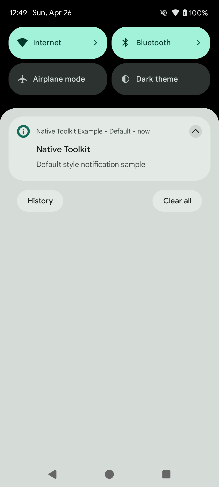
</p>

#### BigText

Displays long text when the notification is expanded.

```kotlin
style = NotificationStyle.BigText(
    bigText = "This is a BigText notification sample from Native Toolkit Example. Expand the notification to verify the full body text rendering.",
    summaryText = "BigText",
    bigContentTitle = "BigText Style"
)
```

<p align="center">
    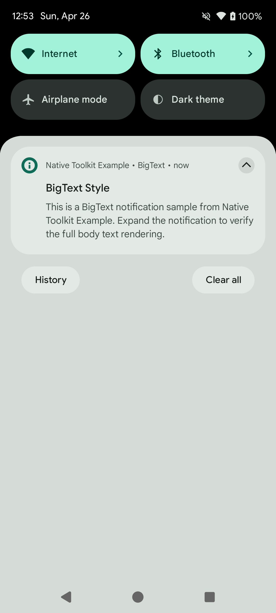
</p>

#### Inbox

Displays multiple lines in a list format when expanded.

```kotlin
style = NotificationStyle.Inbox(
    lines = listOf(
        "• Permission status checked",
        "• Channel created successfully",
        "• Immediate notification sent",
        "• Scheduled notification ready"
    ),
    summaryText = "4 sample events",
    bigContentTitle = "Inbox Style"
)
```

<p align="center">
    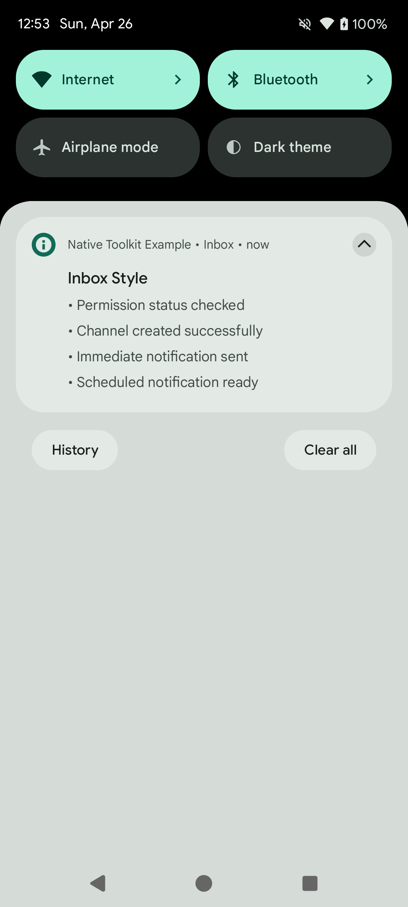
</p>

#### BigPicture

Displays an image when the notification is expanded. Give the picture as `pictureResId` or as `pictureUriString`.

```kotlin
style = NotificationStyle.BigPicture(
    pictureResId = R.mipmap.ic_launcher,
    summaryText = "Launcher image preview",
    bigContentTitle = "BigPicture Style",
    largeIconResId = R.mipmap.ic_launcher_round  // shown when expanded; hideExpandedLargeIcon = true hides it
)
```

<p align="center">
    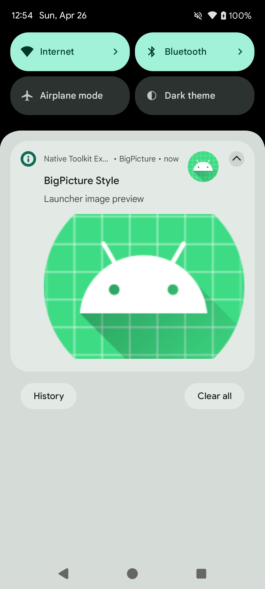
</p>

#### Messaging

Displays chat history in conversation format.

```kotlin
import com.jonghyunkim.nativetoolkit.notification.domain.model.NotificationMessage

val now = System.currentTimeMillis()

style = NotificationStyle.Messaging(
    userDisplayName = "You",
    conversationTitle = "Native Toolkit Example",
    isGroupConversation = true,
    messages = listOf(
        NotificationMessage(
            text = "Can you verify the notification styles?",
            timestampMillis = now - 120_000L,
            senderName = "Alex"
        ),
        NotificationMessage(
            text = "Sure, BigText / Inbox / BigPicture / Messaging are ready.",
            timestampMillis = now - 60_000L,
            senderName = "Jordan"
        ),
        NotificationMessage(
            text = "Confirmed. This is the Messaging sample.",
            timestampMillis = now,
            senderName = "You"         // null = the local user
        )
    )
)
```

<p align="center">
    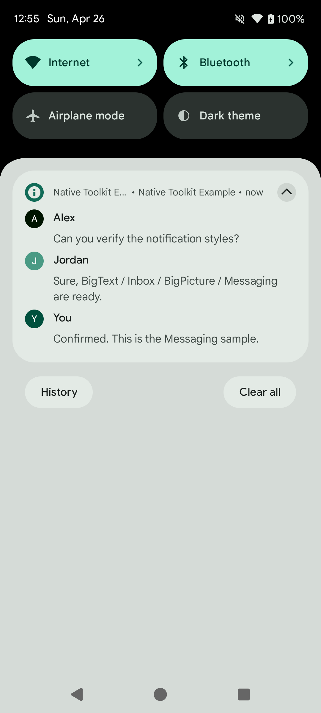
</p>

#### Media

Displays in media player format. `compactActionIndices` lists the action buttons shown in the compact view (up to 3).

```kotlin
import androidx.core.app.NotificationCompat
import com.jonghyunkim.nativetoolkit.notification.application.model.AndroidNotificationAction
import com.jonghyunkim.nativetoolkit.notification.presentation.event.NotificationEventIntents

// The media buttons report their taps as events and bring the app to the front.
fun buildMediaActions(notificationId: Int): List<AndroidNotificationAction> {
    fun action(actionId: String, label: String, iconResId: Int) = AndroidNotificationAction(
        title = label,
        pendingIntent = NotificationEventIntents.action(
            context = activity,
            notificationId = notificationId,
            tag = null,
            actionId = actionId,
            data = mapOf("label" to label),
            launchApp = true
        ),
        iconResId = iconResId
    )
    return listOf(
        action("previous", "Previous", android.R.drawable.ic_media_previous),
        action("play", "Play", android.R.drawable.ic_media_play),
        action("next", "Next", android.R.drawable.ic_media_next)
    )
}

val command = AndroidNotificationCommand(
    content = NotificationContent(
        id = 1006,
        title = "Native Toolkit Player",
        message = "Media style notification sample",
        channel = sampleChannel,
        subText = "Media",
        largeIconResId = R.mipmap.ic_launcher_round,
        category = NotificationCompat.CATEGORY_TRANSPORT,
        priority = NotificationCompat.PRIORITY_LOW,
        ongoing = true,
        autoCancel = false,
        style = NotificationStyle.Media(compactActionIndices = listOf(0, 1, 2))
    ),
    platformOptions = AndroidNotificationPlatformOptions(
        // buildActivityPendingIntentRequest: see Platform Options
        contentIntent = buildActivityPendingIntentRequest(2000, "native.toolkit.media.open"),
        actions = buildMediaActions(1006)
    )
)
```

<p align="center">
    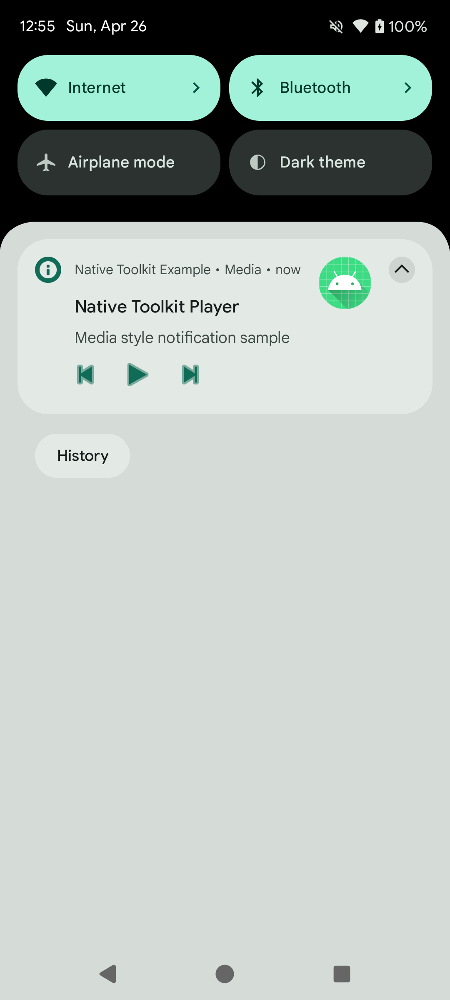
</p>

`NotificationStyle.Call` (call notifications) is described in [Call Style FGS](#call-style-fgs-call-notifications).

---

### Platform Options

`AndroidNotificationPlatformOptions` holds what only Android has. Each `PendingIntent` is described by an `AndroidPendingIntentRequest`, which the library turns into a `PendingIntent` when it posts the notification.

| Property | Type | Use |
|---|---|---|
| `contentIntent` | `AndroidPendingIntentRequest?` | Fired when the notification body is tapped |
| `deleteIntent` | `AndroidPendingIntentRequest?` | Fired when the notification is dismissed |
| `fullScreenIntent` | `AndroidPendingIntentRequest?` | Full-screen presentation (see [FullScreenIntent](#fullscreenintent-full-screen-display)) |
| `actions` | `List<AndroidNotificationAction>` | Action buttons |
| `largeIconBitmap` | `Bitmap?` | Large icon as a bitmap. Do not combine with `NotificationContent.largeIconResId` |
| `callStyleOptions` | `AndroidNotificationCallPlatformOptions?` | `answerIntent`, `declineIntent` and `hangUpIntent` of a `NotificationStyle.Call` notification |
| `customViewOptions` | `AndroidNotificationCustomViewPlatformOptions?` | Contents of a custom view (see [Custom View Styles](#custom-view-styles)) |

`AndroidPendingIntentRequest(intent, requestCode, type, flags, mutable)` takes the `Intent` to wrap, the request code, the target (`AndroidPendingIntentType.ACTIVITY` by default, or `BROADCAST`, `SERVICE`, `FOREGROUND_SERVICE`), extra `PendingIntent` flags, and whether the `PendingIntent` is mutable (`false` by default). The sample app builds its Activity requests with a helper:

```kotlin
import android.app.PendingIntent
import android.content.Intent
import com.jonghyunkim.nativetoolkit.notification.application.model.AndroidPendingIntentRequest

fun buildActivityPendingIntentRequest(
    targetActivityClass: Class<*>,
    requestCode: Int,
    action: String
): AndroidPendingIntentRequest {
    return AndroidPendingIntentRequest(
        intent = Intent(activity, targetActivityClass).apply {
            this.action = action
            flags = Intent.FLAG_ACTIVITY_SINGLE_TOP or Intent.FLAG_ACTIVITY_CLEAR_TOP
        },
        requestCode = requestCode,
        flags = PendingIntent.FLAG_UPDATE_CURRENT
    )
}

fun buildActivityPendingIntentRequest(requestCode: Int, action: String): AndroidPendingIntentRequest =
    buildActivityPendingIntentRequest(MainActivity::class.java, requestCode, action)
```

For body taps, action buttons and dismissals that your code should hear about, use the requests `NotificationEventIntents` builds instead: the library then delivers them as events, without a receiver of your own (see [Interaction](#interaction)).

`AndroidNotificationAction` has `title`, `pendingIntent` and, optionally, `iconResId`, `allowGeneratedReplies`, `semanticAction` (a `NotificationCompat.Action` constant), `contextual` and `showsUserInterface`.

`NotificationResourceResolver(context)` (`com.jonghyunkim.nativetoolkit.notification.presentation.resource`) turns a resource name into an ID, for apps that keep icon or layout names in data: `resolve(name, type)` looks the name up as `type` (`drawable`, `mipmap`, `layout` or `id`; with `null`, `drawable` and then `mipmap`), and `defaultSmallIcon()` returns the app icon.

---

### Custom View Styles

Display notifications using a custom layout. `RemoteViewAction` sets view content and click targets.

#### DecoratedCustomView

```kotlin
import com.jonghyunkim.nativetoolkit.notification.application.model.AndroidNotificationCustomViewPlatformOptions
import com.jonghyunkim.nativetoolkit.notification.application.model.RemoteViewAction
import com.jonghyunkim.nativetoolkit.notification.domain.model.NotificationCustomViewStyleData

val command = AndroidNotificationCommand(
    content = NotificationContent(
        id = 1007,
        title = "Native Toolkit",
        message = "Decorated custom view notification sample",
        channel = sampleChannel,
        subText = "DecoratedCustomView",
        style = NotificationStyle.DecoratedCustomView(
            customView = NotificationCustomViewStyleData(
                layoutResId = R.layout.notification_custom_style_sample,             // collapsed view
                bigLayoutResId = R.layout.notification_custom_style_sample_expanded  // expanded view (optional)
            )
        )
    ),
    platformOptions = AndroidNotificationPlatformOptions(
        contentIntent = buildActivityPendingIntentRequest(2100, "native.toolkit.custom.open"),
        customViewOptions = AndroidNotificationCustomViewPlatformOptions(
            viewActions = listOf(
                // Set text
                RemoteViewAction.SetText(R.id.notification_title, "Native Toolkit"),
                RemoteViewAction.SetText(R.id.notification_message, "Decorated custom view sample"),
                // Set image
                RemoteViewAction.SetImage(R.id.notification_icon, R.mipmap.ic_launcher_round),
                // A click on the view arrives as an ACTION event with this action ID
                RemoteViewAction.SetClickIntent(
                    viewId = R.id.notification_btn_dismiss,
                    pendingIntent = NotificationEventIntents.action(
                        context = activity,
                        notificationId = 1007,
                        tag = null,
                        actionId = "custom_view_dismiss",
                        data = mapOf("label" to "Dismiss")
                    )
                )
            )
        )
    )
)

manager.show(command)
```

<p align="center">
    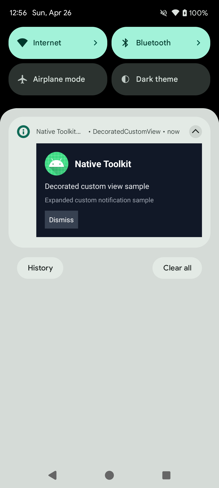
</p>

> **Note:** Due to `RemoteViews` constraints, use `LinearLayout` + `TextView` instead of `Button` for clickable elements. Click events are set via `setOnClickPendingIntent`.

#### DecoratedMediaCustomView

Combines Media style with a custom view.

```kotlin
style = NotificationStyle.DecoratedMediaCustomView(
    customView = NotificationCustomViewStyleData(
        layoutResId = R.layout.notification_media_custom_style_sample,
        bigLayoutResId = R.layout.notification_media_custom_style_sample_expanded
    ),
    compactActionIndices = listOf(0, 1, 2)
)
```

<p align="center">
    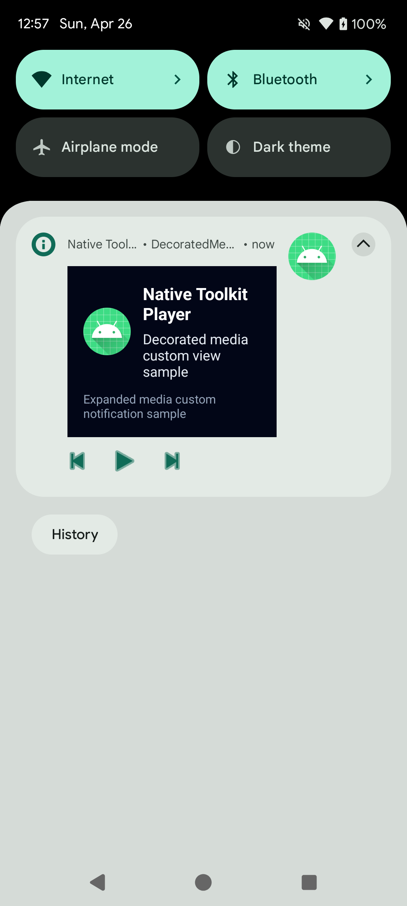
</p>

`customViewOptions` works as for `DecoratedCustomView`, and the media buttons go in `actions` as for [Media](#media).

---

### Group Notifications

Group multiple notifications together.

```kotlin
val GROUP_SAMPLE_KEY = "native.toolkit.grouping.sample"

// Child notification 1
val child1 = AndroidNotificationCommand(
    content = NotificationContent(
        id = 1101,
        title = "Native Toolkit Group",
        message = "Group child notification #1",
        channel = interactionGroupingSampleChannel,
        groupKey = GROUP_SAMPLE_KEY,
        groupAlertBehavior = NotificationCompat.GROUP_ALERT_SUMMARY,
        sortKey = "01"
    )
)

// Child notification 2
val child2 = AndroidNotificationCommand(
    content = NotificationContent(
        id = 1102,
        title = "Native Toolkit Group",
        message = "Group child notification #2",
        channel = interactionGroupingSampleChannel,
        groupKey = GROUP_SAMPLE_KEY,
        groupAlertBehavior = NotificationCompat.GROUP_ALERT_SUMMARY,
        sortKey = "02"
    )
)

// Summary notification (group header)
val summary = AndroidNotificationCommand(
    content = NotificationContent(
        id = 1100,
        title = "Native Toolkit Group Summary",
        message = "2 notifications grouped together",
        channel = interactionGroupingSampleChannel,
        groupKey = GROUP_SAMPLE_KEY,
        isGroupSummary = true,
        groupAlertBehavior = NotificationCompat.GROUP_ALERT_SUMMARY,
        sortKey = "00",
        style = NotificationStyle.Inbox(
            lines = listOf("Group child notification #1", "Group child notification #2"),
            summaryText = "2 grouped notifications",
            bigContentTitle = "Grouping / Summary"
        )
    )
)

runCatching {
    listOf(child1, child2, summary).forEach { manager.show(it).getOrThrow() }
}
```

<p align="center">
    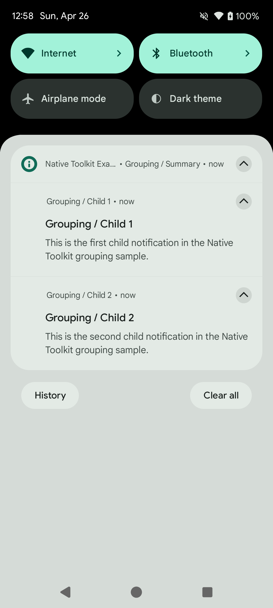
</p>

> **Tip:** Setting `groupAlertBehavior = GROUP_ALERT_SUMMARY` makes only the summary play sound and vibration; child notifications are silent.

---

### Interaction

In 2.0.0 the library delivers body taps, action buttons and dismissals to your code as events. `NotificationEventIntents` builds the `AndroidPendingIntentRequest` for each; put it in `AndroidNotificationPlatformOptions` and listen on `manager.interactions`. No `BroadcastReceiver` of your own is needed, and the requests also work in scheduled notifications.

| Function | Use as | Default of `launchApp` |
|---|---|---|
| `NotificationEventIntents.bodyTap(context, notificationId, tag, data, launchApp)` | `contentIntent` | `true` |
| `NotificationEventIntents.action(context, notificationId, tag, actionId, data, launchApp)` | `AndroidNotificationAction.pendingIntent`, `RemoteViewAction.SetClickIntent` | `false` |
| `NotificationEventIntents.dismiss(context, notificationId, tag, data)` | `deleteIntent` | - |
| `NotificationEventIntents.fullScreenLaunch(context, notificationId, tag)` | `fullScreenIntent` | - |

- `data` is a map of strings delivered with the event.
- With `launchApp = true`, the tap also opens the app: the library goes through an invisible Activity of its own, reports the event and starts the app's launch Activity as the launcher does (bringing a running app to the front). This works on Android 12 and later, which do not let a broadcast from a notification start an Activity. With `false`, the event arrives through a broadcast and the app stays where it is.
- `fullScreenLaunch` opens the app's launch Activity as the full-screen intent and returns `null` when the app has none. It reports no event.
- Each request is told apart by its data URI and uses request code 0, so two notifications never share a `PendingIntent`.

#### Receiving Events

`manager.interactions` delivers `NotificationInteraction`: `kind` (`BODY_TAP`, `ACTION` or `DISMISS`), `notificationId`, `tag`, `actionId` (for `ACTION`) and `data`. `manager.shown` delivers `NotificationShown` (`notificationId`, `tag`, `channelId`) when a scheduled notification fires.

The sample app registers its listeners in `MainActivity.onCreate` and removes them in `onDestroy`:

```kotlin
import com.jonghyunkim.nativetoolkit.common.event.EventHub
import com.jonghyunkim.nativetoolkit.notification.AndroidNotificationManager
import com.jonghyunkim.nativetoolkit.notification.presentation.event.NotificationInteraction

class MainActivity : AppCompatActivity() {

    private var eventRegistrations: List<EventHub.Registration> = emptyList()

    override fun onCreate(savedInstanceState: Bundle?) {
        super.onCreate(savedInstanceState)
        val notifications = AndroidNotificationManager.getInstance(this)
        // Events kept by the library while no listener was registered arrive inside this call.
        eventRegistrations = listOf(
            notifications.interactions.addListener { event, _ ->
                val label = event.data["label"] ?: "Notification"
                when (event.kind) {
                    NotificationInteraction.Kind.BODY_TAP -> { /* event.notificationId, event.tag */ }
                    NotificationInteraction.Kind.ACTION -> { /* event.actionId, label */ }
                    NotificationInteraction.Kind.DISMISS -> { /* "$label dismissed (deleteIntent)" */ }
                }
            },
            notifications.shown.addListener { event, _ ->
                // A scheduled notification fired: event.notificationId, event.tag, event.channelId
            }
        )
    }

    override fun onDestroy() {
        eventRegistrations.forEach { it.remove() }
        eventRegistrations = emptyList()
        super.onDestroy()
    }
}
```

- While `interactions` has no listener, it keeps up to 32 events (dropping the oldest) and hands them to the next listener inside `addListener`, in the order they arrived. A tap that started the app therefore reaches a listener added in the first Activity's `onCreate`. `shown` keeps nothing.
- `addListener` and `Registration.remove` are main-thread only. The listener receives its own `Registration` as the second argument and may remove itself there.
- `NotificationInteraction.toString()` hides the values of `data`.

#### Body Tap Event

```kotlin
val EVENT_SAMPLE_NOTIFICATION_ID = 1120

val command = AndroidNotificationCommand(
    content = NotificationContent(
        id = EVENT_SAMPLE_NOTIFICATION_ID,
        title = "Native Toolkit Event",
        message = "Tap this notification to send a body tap event.",
        channel = interactionGroupingSampleChannel,
        subText = "Interaction / Body Tap Event"
    ),
    platformOptions = AndroidNotificationPlatformOptions(
        // Opens the app and reports BODY_TAP.
        contentIntent = NotificationEventIntents.bodyTap(
            context = activity,
            notificationId = EVENT_SAMPLE_NOTIFICATION_ID,
            tag = null,
            launchApp = true
        )
    )
)
```

#### Action Buttons

```kotlin
val ACTION_SAMPLE_NOTIFICATION_ID = 1112

fun buildAcceptDeclineActions(): List<AndroidNotificationAction> {
    fun action(actionId: String, label: String, iconResId: Int) = AndroidNotificationAction(
        title = label,
        pendingIntent = NotificationEventIntents.action(
            context = activity,
            notificationId = ACTION_SAMPLE_NOTIFICATION_ID,
            tag = null,
            actionId = actionId,
            data = mapOf("label" to label),
            launchApp = false
        ),
        iconResId = iconResId
    )
    return listOf(
        action("accept", "Accept", android.R.drawable.ic_menu_call),
        action("decline", "Decline", android.R.drawable.ic_menu_close_clear_cancel)
    )
}

val command = AndroidNotificationCommand(
    content = NotificationContent(
        id = ACTION_SAMPLE_NOTIFICATION_ID,
        title = "Native Toolkit Action Sample",
        message = "Use Accept / Decline action buttons",
        channel = interactionGroupingSampleChannel,
        autoCancel = false
    ),
    platformOptions = AndroidNotificationPlatformOptions(
        contentIntent = buildActivityPendingIntentRequest(5130, "native.toolkit.notification.grouping.open"),
        actions = buildAcceptDeclineActions()
    )
)

// In the interactions listener:
// NotificationInteraction.Kind.ACTION -> "Action button pressed: ${event.data["label"]} (id=${event.actionId})"
```

<p align="center">
    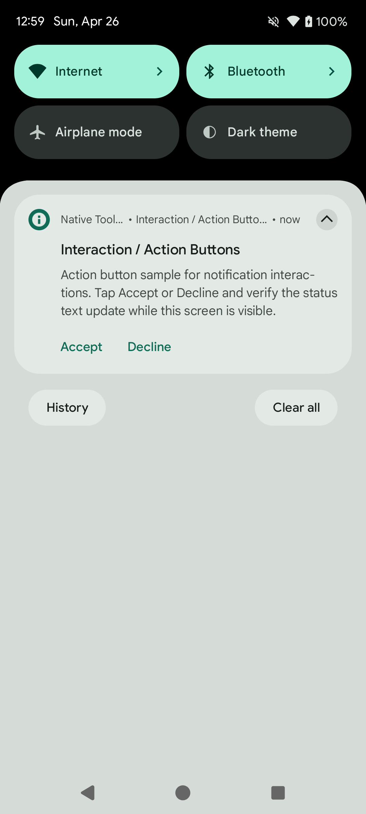
</p>

#### DeleteIntent (Dismiss Event)

Reported as `DISMISS` when the user swipes the notification away.

```kotlin
platformOptions = AndroidNotificationPlatformOptions(
    contentIntent = buildActivityPendingIntentRequest(5110, "native.toolkit.notification.grouping.open"),
    deleteIntent = NotificationEventIntents.dismiss(
        context = activity,
        notificationId = 1110,
        tag = null,
        data = mapOf("label" to "DeleteIntent Sample")
    )
)
```

#### FullScreenIntent (Full-Screen Display)

Launches a full-screen activity when the device is locked or the screen is off (e.g. alarms, incoming calls). The sample app opens an Activity of its own:

```kotlin
// Requires a high-priority channel and an appropriate category
val fullScreenSampleChannel = NotificationChannel(
    id = "native_toolkit_fullscreen_sample",
    name = "Native Toolkit FullScreen Sample",
    importance = NotificationManager.IMPORTANCE_HIGH,
    description = "Reference fullScreenIntent notification sample channel"
)

val command = AndroidNotificationCommand(
    content = NotificationContent(
        id = 1111,
        title = "Native Toolkit Alarm Sample",
        message = "Reference fullScreenIntent notification sample",
        channel = fullScreenSampleChannel,
        category = NotificationCompat.CATEGORY_ALARM,
        priority = NotificationCompat.PRIORITY_HIGH
    ),
    platformOptions = AndroidNotificationPlatformOptions(
        contentIntent = buildActivityPendingIntentRequest(5120, "native.toolkit.notification.grouping.open"),
        fullScreenIntent = buildActivityPendingIntentRequest(
            targetActivityClass = NotificationFullScreenSampleActivity::class.java,
            requestCode = 5121,
            action = "native.toolkit.notification.fullscreen.open"
        )
    )
)
```

<p align="center">
    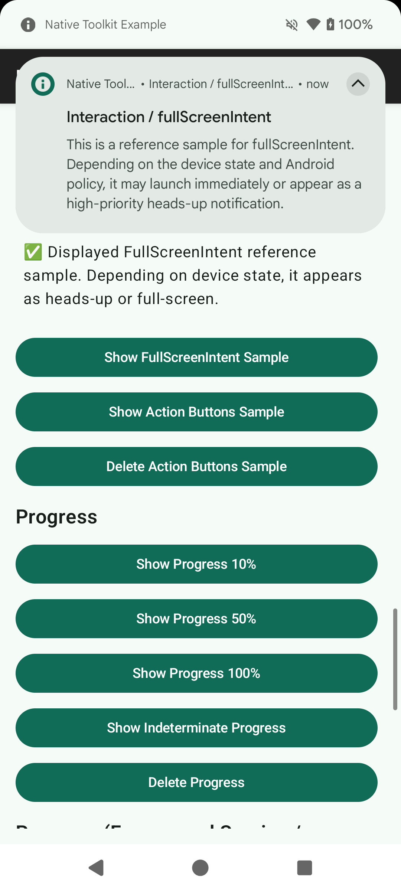
</p>

To open the app's launch Activity instead, pass `NotificationEventIntents.fullScreenLaunch(activity, 1111, null)`.

> **Note:** Depending on device state and Android policy, the notification may appear as a heads-up notification instead of full-screen.

---

### Progress Notifications

Display a progress bar for downloads or long-running operations. Showing the same `id` again updates the bar.

```kotlin
import com.jonghyunkim.nativetoolkit.notification.domain.model.NotificationProgress

fun buildProgressCommand(progressValue: Int, max: Int = 100): AndroidNotificationCommand {
    val safeProgress = progressValue.coerceIn(0, max)
    val isComplete = safeProgress >= max
    return AndroidNotificationCommand(
        content = NotificationContent(
            id = 1009,
            title = "Native Toolkit Download",
            message = if (isComplete) "Download completed" else "Downloading sample asset... $safeProgress%",
            channel = sampleChannel,
            subText = "Progress",
            ongoing = !isComplete,
            autoCancel = isComplete,
            progress = NotificationProgress(max = max, current = safeProgress, indeterminate = false)
        )
    )
}

manager.show(buildProgressCommand(progressValue = 50))

// Indeterminate progress bar (max and current are ignored)
val indeterminate = NotificationProgress(max = 0, current = 0, indeterminate = true)
```

<p align="center">
    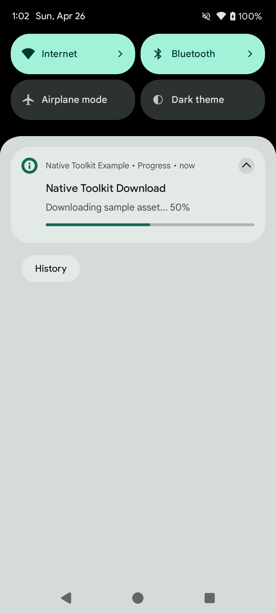
</p>

---

### Foreground Service Notifications

The AAR declares both services below; your manifest needs nothing.

#### Progress FGS (Long-Running Background Tasks)

The manager shows a progress notification tied to a `dataSync` foreground service. The calls return nothing and throw when Android refuses to start or reach the service (for example when started from the background), so wrap them.

```kotlin
val progressForegroundSampleChannel = NotificationChannel(
    id = "native_toolkit_progress_fgs",
    name = "Native Toolkit Progress FGS",
    importance = NotificationManager.IMPORTANCE_LOW,
    description = "Foreground service progress sample channel"
)

// Start the foreground service (also shows the notification)
runCatching { manager.startProgress(buildProgressForegroundCommand(progressValue = 10)) }
    .onFailure { throwable -> statusText = "Failed to start progress foreground service: ${throwable.message}" }

// Update progress
runCatching { manager.updateProgress(buildProgressForegroundCommand(progressValue = 50)) }

// Complete (stop the service and leave a regular notification)
runCatching { manager.completeProgress(buildProgressForegroundCompleteCommand()) }

// Force stop (also removes the notification)
runCatching { manager.stopProgress() }
```

`buildProgressForegroundCommand` builds a command like `buildProgressCommand` above with `id = 1011`, `channel = progressForegroundSampleChannel`, `ongoing = true` and `autoCancel = false`; `buildProgressForegroundCompleteCommand` uses the same `id` with `ongoing = false`, `autoCancel = true` and a `BigText` style.

<p align="center">
    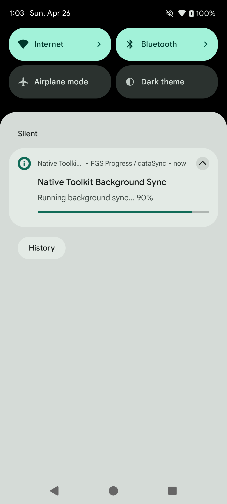
</p>

#### Call Style FGS (Call Notifications)

`CallStyleForegroundService` shows a `CallStyle` notification (incoming, ongoing or screening) from a `specialUse` foreground service. It shows a fixed sample call from `CallStyleNotificationFactory` and is meant for demonstration: a real calling app uses a `phoneCall` foreground service and has to meet Android's requirements for calling apps.

```kotlin
import androidx.core.content.ContextCompat
import com.jonghyunkim.nativetoolkit.notification.presentation.call.CallStyleForegroundService
import com.jonghyunkim.nativetoolkit.notification.presentation.call.CallStyleNotificationFactory

// The channel the call notification uses
manager.createChannel(CallStyleNotificationFactory.createChannel())

// Start the incoming call notification
ContextCompat.startForegroundService(activity, CallStyleForegroundService.createIncomingStartIntent(activity))

// Switch to the ongoing call notification
ContextCompat.startForegroundService(activity, CallStyleForegroundService.createOngoingStartIntent(activity))

// Switch to the screening call notification
ContextCompat.startForegroundService(activity, CallStyleForegroundService.createScreeningStartIntent(activity))

// Stop
activity.startService(CallStyleForegroundService.createStopIntent(activity))
```

<p align="center">
    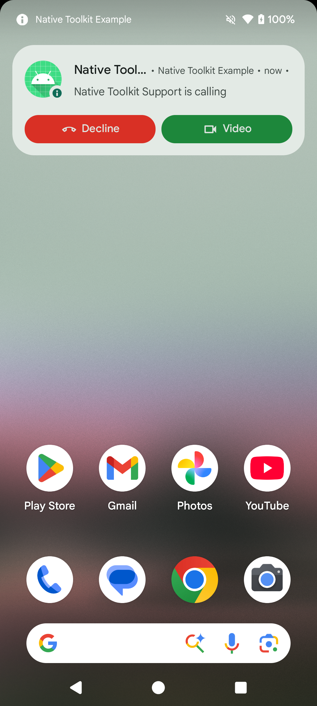
</p>

To post a call notification of your own, set `style = NotificationStyle.Call(callType, person, isVideo, verificationText)` and give the buttons in `callStyleOptions`: `answerIntent` and `declineIntent` for `INCOMING`, `hangUpIntent` for `ONGOING`, `hangUpIntent` and `answerIntent` for `SCREENING`.

---

### Scheduled Notifications

Shows a notification at a specified time.

```kotlin
import com.jonghyunkim.nativetoolkit.notification.domain.model.NotificationSchedule

manager.createChannel(scheduleSampleChannel)
if (!manager.hasPermission() || !manager.areNotificationsEnabled()) {
    statusText = "Unable to schedule notifications. Check permissions or notification settings."
} else if (!manager.canScheduleExactAlarms()) {
    statusText = "Exact alarms are not allowed. Use 'Open Exact Alarm Settings' above to enable them."
} else {
    val triggerAt = System.currentTimeMillis() + 15_000L // 15 seconds from now
    manager.schedule(
        buildScheduledCommand(),
        NotificationSchedule(triggerAtMillis = triggerAt)
    ).onSuccess {
        val command = buildScheduledCommand()
        val scheduled = manager.isScheduled(command.content.id, command.content.tag)
        statusText = "Scheduled a high-priority notification for 15 seconds later. (isScheduled=$scheduled)"
    }.onFailure { throwable ->
        statusText = "Failed to schedule notification: ${throwable.message ?: throwable::class.java.simpleName}"
    }
}
```

<p align="center">
    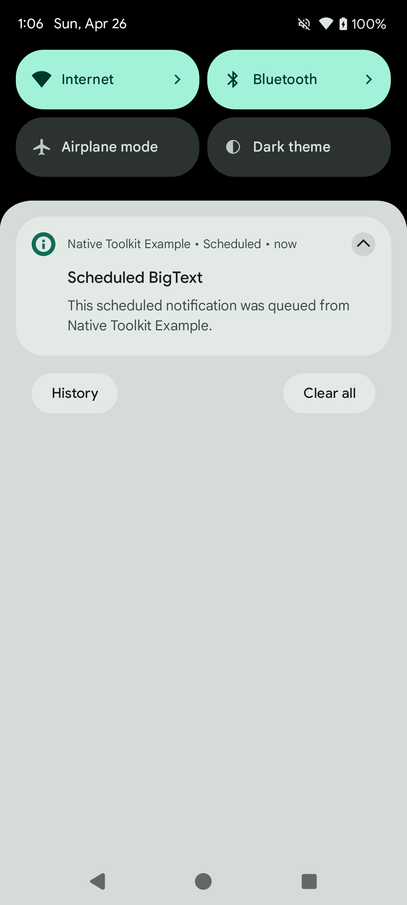
</p>

| `NotificationSchedule` property | Default | Meaning |
|---|---|---|
| `triggerAtMillis` | - | Unix time in milliseconds. Must be greater than 0 (`IllegalArgumentException` otherwise) |
| `exact` | `true` | An exact alarm. Without the exact alarm permission the library uses an inexact alarm instead, without an error |
| `allowWhileIdle` | `true` | Fires in Doze mode too |
| `persistAcrossBoot` | `true` | Saved, and restored after a reboot or an app update |
| `alarmType` | `0` (`AlarmManager.RTC_WAKEUP`) | The `AlarmManager` alarm type |

- A time that has already passed shows the notification at once, without an alarm. `manager.shown` is not reported for it.
- `manager.shown` is reported when an alarm fires. The permission is checked at that time: without it, nothing is shown, but `manager.shown` is still reported.
- A saved schedule keeps the command as JSON in the app's files (`files/ntk/notification_schedules.json`, included in Auto Backup). An `Intent` in it (for example in `contentIntent`) is saved as a URI: when the schedule is restored after a reboot, an app reinstall or a device transfer, its extras that are not strings or primitive values (`Parcelable`, arrays, `Bundle`, `Uri` and so on) and its `ClipData` are gone.

#### Cancel Scheduled Notifications

```kotlin
// Cancel one schedule, then remove the notification in case it already fired.
manager.cancelScheduled(command.content.id, command.content.tag)
    .mapCatching { manager.cancel(command.content.id, command.content.tag).getOrThrow() }

// Cancel every saved schedule
manager.cancelAllScheduled()
```

`cancelAllScheduled` cancels the saved schedules (`persistAcrossBoot = true`) only; cancel the others by ID.

#### Check Scheduled Status

```kotlin
val isScheduled: Boolean = manager.isScheduled(command.content.id, command.content.tag)
```

`isScheduled` sees the saved schedules (`persistAcrossBoot = true`) only.

#### Restore After Reboot

The library restores the saved schedules by itself after a reboot (`BOOT_COMPLETED`, `LOCKED_BOOT_COMPLETED`) and after an app update (`MY_PACKAGE_REPLACED`); the receiver comes with the AAR. To do the same at another time:

```kotlin
manager.restoreScheduled()
```

#### Schedules Saved by 1.x

2.0.0 saves schedules in a new format and cannot read the ones 1.x saved. When the app first runs 2.0.0, the library cancels the alarms of the schedules 1.x saved and deletes them, once. Schedule them again after the update. A 1.x schedule made with `persistAcrossBoot = false` cannot be found and stays with Android, but shows nothing when it fires.

Notifications that 1.x showed and that are still on screen after the update no longer respond to taps or action buttons, because the receivers they point to have new class names. Show them again with 2.0.0 if they are still needed.

---

### C ABI

- The same notifications for C, and for any language that can call a C library (C#, Rust, Dart, Go and others). The functions are in `libntk.so` in `android-native-toolkit-capi-2.0.0.aar`, which needs `android-native-toolkit-2.0.0.aar` in the app too. Setup, including the requirements, is in [C ABI](index.md#c-abi) on the manual top.
- `libntk.so` exists for 64-bit ABIs only (`arm64-v8a`, `x86_64`). In an app installed as 32-bit, loading it fails while the app keeps running.
- C and C++ with CMake get the headers and the library through Prefab. Limit both the APK and your CMake build to the 64-bit ABIs: the Android Gradle Plugin checks the Prefab package for every ABI CMake builds, and stops with `CXX1210` on a 32-bit one (see [C ABI](index.md#c-abi) on the manual top).

```kotlin
android {
    buildFeatures { prefab = true }
    defaultConfig {
        ndk { abiFilters += listOf("arm64-v8a", "x86_64") }
        externalNativeBuild {
            cmake { abiFilters("arm64-v8a", "x86_64") }
        }
    }
}
```

```cmake
find_package(ntk REQUIRED CONFIG)
target_link_libraries(your_library PRIVATE ntk::ntk)
```

- **Threads.** Every function may be called from any thread, and none waits for the main thread. Completions, events and the `release` of an accepted registration are called on the Android main thread, never inside the call that registered them. Called from the main thread, a completion comes after the function returns; called from another thread, it may come before the function returns, so match completions by `user_data`.
- **`release`.** A registration carries `user_data` and a `release` callback, called exactly once. A call rejected at the entry (a bad argument, not initialized) returns the error, never calls the completion, and calls `release` on the calling thread before returning. When the process ends, neither the completion nor `release` is called.
- **Handles.** The content and channel builders start from the library's defaults, copy what their setters receive, may be used before initialization, and are not thread-safe. They are freed with `ntk_notification_content_free` and `ntk_notification_channel_free`. An event handle passed to a callback belongs to the receiver: it stays valid after the callback returns, until the receiver frees it.
- **Request IDs** are `uint64_t` and never reused. Cancelling after completion, or with an unknown ID, does nothing.
- **Initialization.** App Startup initializes the C ABI when the app starts. An app that disables App Startup, or calls from a process other than its default one, calls `ntk_android_init` first. Before initialization, operations return `NTK_NOTIFICATION_ERROR_NOT_INITIALIZED` (an argument error is reported first; a cancellation returns `NONE`).
- **Foreground.** `ntk_notification_request_permission` (when the permission is not granted yet) and `ntk_notification_open_settings_async` need the app in the foreground. Called from the background, they are accepted and complete with `NTK_NOTIFICATION_ERROR_NOT_FOREGROUND`: their return value only says that the request was accepted.
- **Callbacks must not throw.** A C++ exception, a C# exception or a Rust panic that leaves a callback ends the process.
- **No silent corrections.** Where the Kotlin API adjusts a value, the C ABI returns `NTK_NOTIFICATION_ERROR_INVALID_PARAMETER`: channel importance 0 to 4, lock-screen visibility and `visibility` -1 to 1, `priority` -2 to 2, `group_alert_behavior` 0 to 2, timestamps and timeouts 0 or more, `0 <= current <= max` for a determinate progress bar, `alarm_type` 0 (`RTC_WAKEUP`) or 1 (`RTC`). Strings are NUL-terminated UTF-8, and `NULL` in a setter resets that item to its default.
- **Permission checks.** Where the Kotlin API succeeds without doing anything, the C ABI checks first, at the time of the call: `show`, `update` and a schedule whose time has passed return `PERMISSION_DENIED` when the permission is missing or notifications are off, and an exact schedule for a future time returns `EXACT_ALARM_NOT_ALLOWED` without the exact alarm permission. A change after the check is not caught: notifications turned off between the check and the call, or a schedule a few milliseconds ahead that has passed when it is made, can still return `NONE` and show nothing.
- **Resource names.** Icons, BigPicture images, layouts and view IDs are given by name and looked up when the content is passed to `ntk_notification_show`, `_update`, `_schedule` or a progress function (icons and images as `drawable`, then `mipmap`, layouts as `layout`, view IDs as `id`): a name that is not found makes that function return `RESOURCE_NOT_FOUND`. The setters do not look names up. Resource shrinking removes resources that only a name refers to, so keep them, for example in `res/raw/keep.xml`:

```xml
<resources xmlns:tools="http://schemas.android.com/tools"
    tools:keep="@drawable/ic_notification,@layout/notification_custom_style_sample" />
```

#### Initialization, the permission and settings

```c
#include <NativeToolkitC/Common.h>
#include <NativeToolkitC/Android.h>
#include <NativeToolkitC/Notification.h>

/* Only for an app that disables App Startup or calls from another process. env is the
   calling thread's JNIEnv*, context any Context: pass the Activity when there is one. */
static void initialize_without_startup(void* env, void* context)
{
    ntk_android_error result = ntk_android_init(env, context);
    if (result == NTK_ANDROID_ERROR_IN_PROGRESS || result == NTK_ANDROID_ERROR_JNI_FAILURE) {
        /* It never waits: call it again later. CLASS_NOT_FOUND does not pass by retrying. */
    }
}

static void NTK_CALL on_permission(void* user_data, uint64_t request_id, ntk_notification_error error,
                                   uint32_t system_code, ntk_notification_permission_result result)
{
    /* On the Android main thread, once per accepted request. system_code is always 0. */
    (void)user_data; (void)request_id; (void)system_code;
    if (error == NTK_NOTIFICATION_ERROR_NONE && result == NTK_NOTIFICATION_PERMISSION_RESULT_GRANTED) {
        /* Granted, already granted, or not needed (Android 12L and lower). */
    } else if (error == NTK_NOTIFICATION_ERROR_NONE && result == NTK_NOTIFICATION_PERMISSION_RESULT_DENIED) {
        /* Denied. */
    } else if (error == NTK_NOTIFICATION_ERROR_NOT_FOREGROUND) {
        /* Asked while the app was in the background. */
    } else if (error == NTK_NOTIFICATION_ERROR_CANCELED || error == NTK_NOTIFICATION_ERROR_CANCELED_BY_SYSTEM) {
        /* Cancelled by the caller, or the Activity showing the dialog was destroyed. */
    }
}

static void NTK_CALL on_settings(void* user_data, ntk_notification_error error, uint32_t system_code,
                                 ntk_notification_settings_result result)
{
    (void)user_data; (void)system_code;
    if (error == NTK_NOTIFICATION_ERROR_NONE && result == NTK_NOTIFICATION_SETTINGS_RESULT_OPENED_FALLBACK) {
        /* The requested screen was not available; the app details screen opened. */
    } else if (error == NTK_NOTIFICATION_ERROR_SETTINGS_NOT_OPENED) {
        /* No screen could be opened. */
    }
}

static void NTK_CALL release_user_data(void* user_data)
{
    /* Called exactly once per registration, even when the registering call failed. */
    (void)user_data;
}

/* The headers' version and the library's. */
if (ntk_version() != NTK_VERSION) {
    return;
}
if (!ntk_android_is_initialized()) {
    return;   /* App Startup has not run yet, or initialize_without_startup is needed. */
}

/* The permission state. */
int32_t granted = 0;
int32_t enabled = 0;
int32_t exact_alarms = 0;
ntk_notification_error error = ntk_notification_has_permission(&granted);
error = ntk_notification_are_enabled(&enabled);
error = ntk_notification_can_schedule_exact_alarms(&exact_alarms);
uint32_t system_code = ntk_last_system_code();   /* always 0 on Android */

/* Asking for the permission. */
uint64_t request_id = 0;
error = ntk_notification_request_permission(&on_permission, NULL, &release_user_data, &request_id);
if (error != NTK_NOTIFICATION_ERROR_NONE) {
    /* Rejected at the entry: on_permission is not called, release_user_data already was. */
}

/* No longer interested: the request completes with CANCELED unless it already completed. */
error = ntk_notification_cancel_permission_request(request_id);

/* A settings screen: NOTIFICATIONS, APP_DETAILS or EXACT_ALARM. */
error = ntk_notification_open_settings_async(NTK_NOTIFICATION_SETTINGS_TARGET_EXACT_ALARM,
                                             &on_settings, NULL, &release_user_data);
```

#### Channels and the content builder

```c
#include <NativeToolkitC/Common.h>
#include <NativeToolkitC/Notification.h>

/* A channel: id, name and importance (0 to 4; 3 is IMPORTANCE_DEFAULT). */
ntk_notification_channel* channel = NULL;
if (ntk_notification_channel_create("native_toolkit_sample", "Native Toolkit Sample", 3, &channel)
        != NTK_NOTIFICATION_ERROR_NONE) {
    return;
}
ntk_notification_channel_set_description(channel, "Notification sample channel");
ntk_notification_channel_set_show_badge(channel, 1);
ntk_notification_channel_set_enable_lights(channel, 1);
ntk_notification_channel_set_light_color(channel, 0xFF2196F3u);   /* ARGB */
ntk_notification_channel_set_enable_vibration(channel, 1);
const int64_t pattern[] = { 0, 200, 100, 200 };                    /* milliseconds */
ntk_notification_channel_set_vibration_pattern(channel, pattern, 4);
ntk_notification_channel_set_sound(channel, NULL);                 /* NULL: the default sound */
ntk_notification_channel_set_lockscreen_visibility(channel, 1);   /* -1 to 1 */
ntk_notification_channel_set_group(channel, "samples", "Samples");
ntk_notification_error error = ntk_notification_create_channel(channel);

/* The content: id, title and message are required. */
ntk_notification_content* content = NULL;
error = ntk_notification_content_create(1001, "Native Toolkit", "Default style notification sample", &content);
if (error != NTK_NOTIFICATION_ERROR_NONE) {
    ntk_notification_channel_free(channel);
    return;
}
ntk_notification_content_set_channel(content, channel);           /* copied */
ntk_notification_channel_free(channel);

/* Text and identity. UTF-8 throughout; NULL resets an item. */
ntk_notification_content_set_tag(content, NULL);
ntk_notification_content_set_sub_text(content, "Default");
ntk_notification_content_set_ticker(content, "Native Toolkit");
ntk_notification_content_set_category(content, "status");
ntk_notification_content_set_sound(content, NULL);

/* Icons by resource name, looked up by show, update, schedule and the progress functions.
   Without a small icon, the app icon is used. */
ntk_notification_content_set_small_icon(content, "ic_notification");
ntk_notification_content_set_large_icon(content, "ic_launcher_round");

/* Numbers. priority -2 to 2, visibility -1 to 1. */
ntk_notification_content_set_priority(content, 0);
ntk_notification_content_set_visibility(content, 1);
ntk_notification_content_set_color(content, 0xFF2196F3u);
ntk_notification_content_set_number(content, 1);
ntk_notification_content_set_timestamp(content, 1760054400000);   /* Unix milliseconds */
ntk_notification_content_set_timeout_after(content, 600000);      /* removed after 10 minutes */

/* Flags. */
ntk_notification_content_set_auto_cancel(content, 1);
ntk_notification_content_set_ongoing(content, 0);
ntk_notification_content_set_show_timestamp(content, 1);
ntk_notification_content_set_only_alert_once(content, 0);
ntk_notification_content_set_local_only(content, 0);
ntk_notification_content_set_silent(content, 0);
ntk_notification_content_set_uses_chronometer(content, 0);

/* Groups: the key, whether this is the summary, which notification alerts (0 to 2), the order. */
ntk_notification_content_set_group(content, "native.toolkit.grouping.sample");
ntk_notification_content_set_group_summary(content, 0);
ntk_notification_content_set_group_alert_behavior(content, 1);    /* GROUP_ALERT_SUMMARY */
ntk_notification_content_set_sort_key(content, "01");

/* A progress bar: max, current, indeterminate. */
ntk_notification_content_set_progress(content, 100, 50, 0);

/* Show it, replace it, remove it. */
error = ntk_notification_show(content);
if (error == NTK_NOTIFICATION_ERROR_PERMISSION_DENIED) {
    /* No permission, or the app's notifications are off. */
} else if (error == NTK_NOTIFICATION_ERROR_RESOURCE_NOT_FOUND) {
    /* An icon, image, layout or view name was not found. */
}
error = ntk_notification_update(content);
ntk_notification_content_free(content);

error = ntk_notification_remove(1001, NULL);   /* the tag, or NULL */
error = ntk_notification_remove_all();
error = ntk_notification_delete_channel("native_toolkit_sample");
```

#### Styles, taps and actions

The last style set wins. `add_message` and `add_view_click` need their style to be set first.

```c
#include <string.h>
#include <NativeToolkitC/Common.h>
#include <NativeToolkitC/Notification.h>

ntk_notification_content* content = NULL;
ntk_notification_error error = ntk_notification_content_create(1002, "Native Toolkit",
                                                               "BigText style notification sample", &content);
if (error != NTK_NOTIFICATION_ERROR_NONE) {
    return;
}

/* BigText: big_text is required. */
ntk_notification_content_set_style_big_text(content,
    "This is a BigText notification sample from Native Toolkit Example.", "BigText", "BigText Style");

/* Inbox. */
const char* const lines[] = { "Permission status checked", "Channel created successfully" };
ntk_notification_content_set_style_inbox(content, lines, 2, "2 sample events", "Inbox Style");

/* BigPicture: a picture name or a URI (the name wins), then the large icon of the expanded view. */
ntk_notification_content_set_style_big_picture(content, "ic_launcher", NULL, "Launcher image preview",
                                               "BigPicture Style", "ic_launcher_round", 0);

/* Messaging: group_conversation -1 leaves it unset. A NULL sender is the local user. */
ntk_notification_content_set_style_messaging(content, "You", "Native Toolkit Example", 1);
ntk_notification_content_add_message(content, "Can you verify the notification styles?", 1760054280000, "Alex");
ntk_notification_content_add_message(content, "Confirmed. This is the Messaging sample.", 1760054400000, NULL);

/* DecoratedCustomView: layout names, then clicks that arrive as ACTION events. */
ntk_notification_content_set_style_custom_view(content, "notification_custom_style_sample",
                                               "notification_custom_style_sample_expanded");
ntk_notification_content_add_view_click(content, "notification_btn_dismiss", "custom_view_dismiss");

/* The body tap: OPEN_APP (the default) opens the app and sends BODY_TAP,
   EVENT_ONLY sends BODY_TAP only, NONE does nothing. */
ntk_notification_content_set_tap(content, NTK_NOTIFICATION_TAP_OPEN_APP);

/* Strings delivered with every event of this notification (tap, actions, clicks, dismissal). */
ntk_notification_content_add_data(content, "label", "Sample");

/* The DISMISS event is sent by default; 0 turns it off. */
ntk_notification_content_set_dismiss_event(content, 1);

/* A full-screen intent that opens the app's launch Activity. */
ntk_notification_content_set_full_screen(content, 0);

/* An action button. */
ntk_notification_action accept;
memset(&accept, 0, sizeof(accept));
accept.struct_size = (uint32_t)sizeof(accept);
accept.title = "Accept";
accept.action_id = "accept";        /* delivered in the ACTION event */
accept.icon_name = NULL;            /* or a drawable / mipmap name */
accept.launch_app = 0;              /* nonzero: also open the app */
error = ntk_notification_content_add_action(content, &accept);

error = ntk_notification_show(content);
ntk_notification_content_free(content);
```

#### Scheduling and progress

```c
#include <string.h>
#include <NativeToolkitC/Common.h>
#include <NativeToolkitC/Notification.h>

ntk_notification_content* content = NULL;
if (ntk_notification_content_create(1010, "Native Toolkit", "Scheduled notification sample", &content)
        != NTK_NOTIFICATION_ERROR_NONE) {
    return;
}

/* Zero-filled with trigger_at_millis set: exact, also in Doze, kept across a reboot, RTC_WAKEUP. */
const int64_t now_unix_ms = 1760054400000;   /* the current time, from your clock */
ntk_notification_schedule_options schedule;
memset(&schedule, 0, sizeof(schedule));
schedule.struct_size = (uint32_t)sizeof(schedule);
schedule.trigger_at_millis = now_unix_ms + 15000;

/* Writes the saved schedules on the calling thread. */
ntk_notification_error error = ntk_notification_schedule(content, &schedule);
if (error == NTK_NOTIFICATION_ERROR_EXACT_ALARM_NOT_ALLOWED) {
    /* Ask the user through NTK_NOTIFICATION_SETTINGS_TARGET_EXACT_ALARM, or set inexact. */
} else if (error == NTK_NOTIFICATION_ERROR_STORAGE_FAILED) {
    /* The schedule could not be saved. */
}
ntk_notification_content_free(content);

/* Saved schedules only (not_persist_across_boot == 0), as in the Kotlin API. */
int32_t scheduled = 0;
error = ntk_notification_is_scheduled(1010, NULL, &scheduled);
error = ntk_notification_cancel_scheduled(1010, NULL);
error = ntk_notification_cancel_all_scheduled();

/* A progress notification in a foreground service. The library sets ongoing, auto cancel
   and alert once itself; a content without a progress bar is INVALID_PARAMETER. */
ntk_notification_content* progress = NULL;
if (ntk_notification_content_create(1011, "Native Toolkit Background Sync", "Running background sync... 10%",
                                    &progress) != NTK_NOTIFICATION_ERROR_NONE) {
    return;
}
ntk_notification_content_set_progress(progress, 100, 10, 0);
error = ntk_notification_start_progress(progress);
if (error == NTK_NOTIFICATION_ERROR_SERVICE_START_NOT_ALLOWED) {
    /* Android refused to start the service, for example from the background. */
}
ntk_notification_content_set_progress(progress, 100, 50, 0);
error = ntk_notification_update_progress(progress);
error = ntk_notification_complete_progress(progress);   /* the bar is filled; a regular notification stays */
ntk_notification_content_free(progress);

error = ntk_notification_stop_progress();               /* stops and removes the notification */
```

The progress functions report whether the request reached the service. A failure inside the service, such as a missing foreground service permission, only appears in logcat.

#### Interaction and shown events

```c
#include <NativeToolkitC/Common.h>
#include <NativeToolkitC/Notification.h>

static void NTK_CALL on_interaction(void* user_data, ntk_notification_interaction* event)
{
    /* On the Android main thread. The event is yours: free it, now or later. */
    ntk_notification_event_kind kind = ntk_notification_interaction_kind(event);
    int32_t id = ntk_notification_interaction_notification_id(event);
    const char* tag = ntk_notification_interaction_tag(event, NULL);              /* NULL: no tag */
    const char* action_id = ntk_notification_interaction_action_id(event, NULL);  /* ACTION only */
    size_t count = ntk_notification_interaction_data_count(event);
    size_t i;
    for (i = 0; i < count; ++i) {
        const char* key = ntk_notification_interaction_data_key_at(event, i, NULL);
        const char* value = ntk_notification_interaction_data_value_at(event, i, NULL);
        (void)key; (void)value;
    }
    if (kind == NTK_NOTIFICATION_EVENT_KIND_BODY_TAP) {
        /* The body was tapped. */
    } else if (kind == NTK_NOTIFICATION_EVENT_KIND_ACTION) {
        /* A button or a custom view click: action_id. */
    } else if (kind == NTK_NOTIFICATION_EVENT_KIND_DISMISS) {
        /* Swiped away. */
    }
    (void)user_data; (void)id; (void)tag; (void)action_id;
    ntk_notification_interaction_free(event);
}

static void NTK_CALL on_shown(void* user_data, ntk_notification_shown* event)
{
    /* A scheduled notification fired. */
    int32_t id = ntk_notification_shown_notification_id(event);
    const char* tag = ntk_notification_shown_tag(event, NULL);
    const char* channel_id = ntk_notification_shown_channel_id(event, NULL);
    (void)user_data; (void)id; (void)tag; (void)channel_id;
    ntk_notification_shown_free(event);
}

static void NTK_CALL release_user_data(void* user_data)
{
    (void)user_data;
}

/* Taps, actions and dismissals that came while no listener was registered (up to 32)
   arrive at the first listener added; shown events are not kept. */
ntk_notification_listener* interactions = NULL;
ntk_notification_error error = ntk_notification_add_interaction_listener(&on_interaction, NULL,
                                                                         &release_user_data, &interactions);
ntk_notification_listener* shown = NULL;
error = ntk_notification_add_shown_listener(&on_shown, NULL, &release_user_data, &shown);

/* From the main thread, no event reaches the callback after this returns; from another
   thread, events may still come until release_user_data is called. The handle is invalid
   afterwards. The library never removes a listener by itself. */
ntk_notification_listener_remove(interactions);
ntk_notification_listener_remove(shown);
```

#### Notification errors

`ntk_notification_error`. Values 0 to 5 mean the same in every feature of the Android C ABI.

| Value | Name | When |
|---|---|---|
| 0 | `NTK_NOTIFICATION_ERROR_NONE` | Success |
| 1 | `NTK_NOTIFICATION_ERROR_INVALID_PARAMETER` | A bad argument: `NULL`, invalid UTF-8, a value out of range, a wrong `struct_size` |
| 2 | `NTK_NOTIFICATION_ERROR_NOT_INITIALIZED` | Called before initialization |
| 3 | `NTK_NOTIFICATION_ERROR_NOT_SUPPORTED` | A struct carries nonzero values in a part this version does not know |
| 4 | `NTK_NOTIFICATION_ERROR_UNKNOWN` | Any other failure |
| 5 | `NTK_NOTIFICATION_ERROR_OUT_OF_MEMORY` | Memory ran out |
| 6 | `NTK_NOTIFICATION_ERROR_CANCELED` | The permission request was cancelled with `ntk_notification_cancel_permission_request` |
| 7 | `NTK_NOTIFICATION_ERROR_CANCELED_BY_SYSTEM` | The Activity showing the permission dialog was destroyed |
| 8 | `NTK_NOTIFICATION_ERROR_NOT_FOREGROUND` | The permission request or a settings screen was asked for from the background |
| 9 | `NTK_NOTIFICATION_ERROR_HOST_START_FAILED` | The library could not start its transparent host Activity |
| 10 | `NTK_NOTIFICATION_ERROR_PERMISSION_DENIED` | `show`, `update` or a past-time `schedule` without the permission, or with notifications off |
| 11 | `NTK_NOTIFICATION_ERROR_EXACT_ALARM_NOT_ALLOWED` | An exact `schedule` for a future time without the exact alarm permission |
| 12 | `NTK_NOTIFICATION_ERROR_RESOURCE_NOT_FOUND` | An icon, image, layout or view name was not found |
| 13 | `NTK_NOTIFICATION_ERROR_STORAGE_FAILED` | The saved schedules could not be written |
| 14 | `NTK_NOTIFICATION_ERROR_SERVICE_START_NOT_ALLOWED` | Android refused to start or reach the progress foreground service |
| 15 | `NTK_NOTIFICATION_ERROR_SETTINGS_NOT_OPENED` | No settings screen could be opened |

`ntk_android_init` returns `ntk_android_error`: `NONE` (0), `INVALID_PARAMETER` (1, `env` or `context` is `NULL`), `CLASS_NOT_FOUND` (2, the AAR's classes are missing or were renamed by R8; retrying does not help), `JNI_FAILURE` (3, transient; call again later, logcat tag `ntk` has the detail) and `IN_PROGRESS` (4, another thread is initializing; call again later).

| Kotlin API | C ABI |
|---|---|
| `AndroidNotificationManager.getInstance` | - (the functions need no manager) |
| `LibraryRuntime.ensureInitialized` | `ntk_android_init` / `ntk_android_is_initialized` |
| `NotificationChannel` | `ntk_notification_channel_create` and its 9 setters |
| `AndroidNotificationCommand` | `ntk_notification_content_create` and its setters |
| `NotificationEventIntents` | `ntk_notification_content_set_tap` / `_add_action` / `_add_view_click` / `_set_dismiss_event` / `_set_full_screen` / `_add_data` |
| `show` / `update` | `ntk_notification_show` / `ntk_notification_update` |
| `cancel` / `cancelAll` | `ntk_notification_remove` / `ntk_notification_remove_all` |
| `createChannel` / `deleteChannel` | `ntk_notification_create_channel` / `ntk_notification_delete_channel` |
| `schedule` / `cancelScheduled` / `cancelAllScheduled` / `isScheduled` | `ntk_notification_schedule` / `_cancel_scheduled` / `_cancel_all_scheduled` / `_is_scheduled` |
| `startProgress` / `updateProgress` / `completeProgress` / `stopProgress` | `ntk_notification_start_progress` / `_update_progress` / `_complete_progress` / `_stop_progress` |
| `hasPermission` / `areNotificationsEnabled` / `canScheduleExactAlarms` | `ntk_notification_has_permission` / `_are_enabled` / `_can_schedule_exact_alarms` |
| `requestPermission` / `cancelPermissionRequest` | `ntk_notification_request_permission` / `ntk_notification_cancel_permission_request` |
| `openSettings` | `ntk_notification_open_settings_async` (from the foreground Activity) |
| `interactions` / `shown` | `ntk_notification_add_interaction_listener` / `ntk_notification_add_shown_listener` |
| `EventHub.Registration.remove` | `ntk_notification_listener_remove` |

Not in the C ABI: `createChannels`, `getActive`, `restoreScheduled`, the Media, DecoratedMediaCustomView and Call styles, `largeIconBitmap`, `PendingIntent`s of your own, and the call foreground service.

---

## iOS

### IosNotificationManager

`IosNotificationManager` is a singleton class that provides all local notification operations on iOS.

<p align="center">
    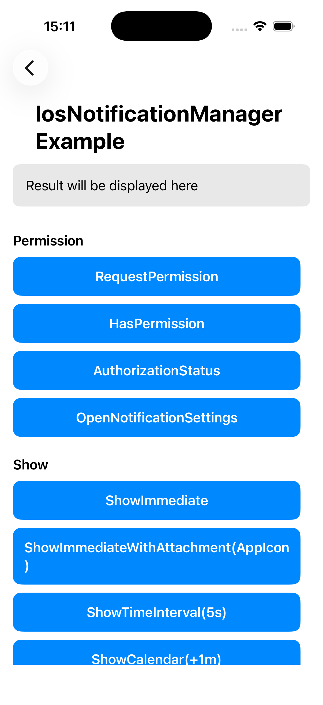
</p>

### Setup

Call `setup()` once at app launch (e.g. in `AppDelegate.application(_:didFinishLaunchingWithOptions:)`).

```swift
import IosLibrary

IosNotificationManager.setup()
```

### Permission

#### Request Notification Permission

```swift
IosNotificationManager.shared.requestPermission { isSuccess, errorMessage in
    if isSuccess {
        // Granted
    } else {
        // Denied. User must enable manually in Settings.
    }
}
```

<p align="center">
    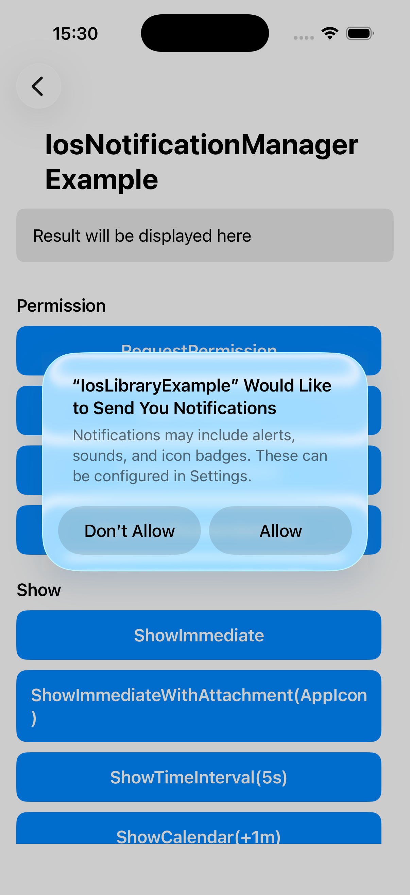
</p>

#### Check Permission

```swift
IosNotificationManager.shared.hasPermission { hasPermission in
    print(hasPermission) // true / false
}
```

#### Get Authorization Status

```swift
IosNotificationManager.shared.authorizationStatus { status in
    // .notDetermined / .denied / .authorized / .provisional / .ephemeral / .unknown
    print(status)
}
```

#### Open Notification Settings

```swift
IosNotificationManager.shared.openNotificationSettings()
```

### Show Notification

Create a `NotificationContent` and call `show()`.

#### Immediate

```swift
let content = NotificationContent(
    id: "sample-notification",
    title: "Immediate Notification",
    body: "Displayed now",
    categoryIdentifier: "sample-category",
    userInfo: ["source": "IosLibraryExample", "id": "sample-notification"]
)

IosNotificationManager.shared.show(content: content) { isSuccess, errorMessage in
    print(isSuccess, errorMessage ?? "")
}
```

<p align="center">
    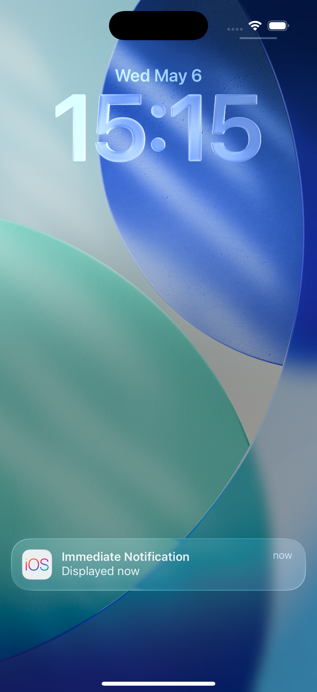
</p>

#### Immediate with Attachment

Show a notification with an image file bundled in the app.
Expand the notification (long-press) to see the attachment thumbnail.

```swift
guard let imageURL = Bundle.main.url(forResource: "app-icon-attachment", withExtension: "png") else { return }

let attachment = NotificationAttachment(identifier: "app-icon", fileURL: imageURL)
let content = NotificationContent(
    id: "sample-notification",
    title: "Immediate Notification with Attachment",
    body: "Displayed with app icon attachment",
    categoryIdentifier: "sample-category",
    userInfo: ["source": "IosLibraryExample", "id": "sample-notification"],
    attachments: [attachment]
)

IosNotificationManager.shared.show(content: content) { isSuccess, errorMessage in
    print(isSuccess, errorMessage ?? "")
}
```

<p align="center">
    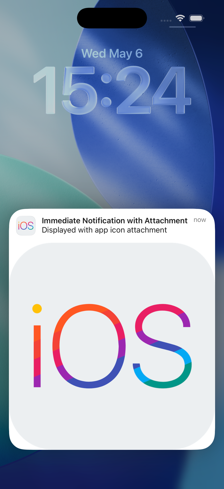
</p>

#### Time Interval Trigger

```swift
IosNotificationManager.shared.show(
    content: content,
    trigger: .timeInterval(5.0, repeats: false)
) { isSuccess, errorMessage in
    print(isSuccess, errorMessage ?? "")
}
```

#### Calendar Trigger

```swift
var components = DateComponents()
components.hour = 9
components.minute = 0

IosNotificationManager.shared.show(
    content: content,
    trigger: .calendar(components, repeats: true)
) { isSuccess, errorMessage in
    print(isSuccess, errorMessage ?? "")
}
```

#### Location Trigger

Location notifications use CoreLocation. Add a location usage description to `Info.plist`.

```swift
IosNotificationManager.shared.show(
    content: content,
    trigger: .location(
        identifier: "tokyo-station",
        latitude: 35.6812,
        longitude: 139.7671,
        radius: 100,
        notifyOnEntry: true,
        notifyOnExit: false
    )
) { isSuccess, errorMessage in
    print(isSuccess, errorMessage ?? "")
}
```

### Attachment

Use `NotificationAttachment` to attach images, audio, or video to a notification.
The attachment thumbnail is shown when the notification is expanded (long-press).

```swift
guard let imageURL = Bundle.main.url(forResource: "app-icon-attachment", withExtension: "png") else { return }

let attachment = NotificationAttachment(identifier: "app-icon", fileURL: imageURL)
let content = NotificationContent(
    id: "sample-notification",
    title: "Notification with Image",
    body: "Expand to see the image",
    attachments: [attachment]
)

IosNotificationManager.shared.show(content: content) { isSuccess, errorMessage in
    print(isSuccess, errorMessage ?? "")
}
```

### Update Notification

Update the content or trigger of a pending notification.

```swift
let updatedContent = NotificationContent(
    id: "sample-notification",
    title: "Updated Title",
    body: "Content has changed"
)

IosNotificationManager.shared.update(
    identifier: "sample-notification",
    content: updatedContent,
    trigger: nil
) { isSuccess, errorMessage in
    print(isSuccess, errorMessage ?? "")
}
```

### Cancel / Remove Notification

```swift
// Cancel a specific pending notification
IosNotificationManager.shared.cancel(identifier: "sample-notification")

// Cancel all pending notifications
IosNotificationManager.shared.cancelAll()

// Remove a specific delivered notification from Notification Center
IosNotificationManager.shared.removeDelivered(identifier: "sample-notification")

// Remove all delivered notifications from Notification Center
IosNotificationManager.shared.removeAllDelivered()
```

### Scheduled Notifications

Schedule a notification for future delivery with a specific identifier.

```swift
let content = NotificationContent(
    id: "scheduled-notification",
    title: "Scheduled Notification",
    body: "Displayed after 10 seconds"
)

IosNotificationManager.shared.schedule(
    content: content,
    trigger: .timeInterval(10.0, repeats: false),
    identifier: "scheduled-notification"
) { isSuccess, errorMessage in
    print(isSuccess, errorMessage ?? "")
}
```

#### Cancel Scheduled

```swift
// Cancel a specific scheduled notification
IosNotificationManager.shared.cancelScheduled(identifier: "scheduled-notification")

// Cancel all scheduled notifications
IosNotificationManager.shared.cancelAllScheduled()
```

### Query

```swift
// Get all pending (not yet delivered) notification requests
IosNotificationManager.shared.getScheduled { requests in
    requests.forEach { print($0.identifier) }
}

// Get all notifications visible in Notification Center
IosNotificationManager.shared.getDelivered { notifications in
    notifications.forEach { print($0.identifier) }
}
```

### Badge

```swift
// Set badge count (use 0 to clear)
IosNotificationManager.shared.setBadgeCount(1) { isSuccess, errorMessage in
    print(isSuccess, errorMessage ?? "")
}

IosNotificationManager.shared.setBadgeCount(0) { isSuccess, errorMessage in
    print(isSuccess, errorMessage ?? "")
}
```

### Category and Actions

Add action buttons or text input to notifications.

#### Register Category

```swift
let category = NotificationCategory(
    identifier: "sample-category",
    actions: [
        NotificationAction(
            identifier: "open",
            title: "Open",
            options: [.foreground]
        ),
        NotificationAction(
            identifier: "delete",
            title: "Delete",
            options: [.destructive]
        )
    ],
    textInputActions: [
        TextInputNotificationAction(
            identifier: "reply",
            title: "Reply",
            buttonTitle: "Send",
            textInputPlaceholder: "Type a message"
        )
    ],
    options: [.customDismissAction, .allowAnnouncement]
)

IosNotificationManager.shared.registerCategory(category)
```

#### Attach Category to Notification

Set the `categoryIdentifier` in `NotificationContent`.
Long-press the notification to see the action buttons.

```swift
let content = NotificationContent(
    id: "sample-notification",
    title: "Notification with Actions",
    body: "Long-press to see actions",
    categoryIdentifier: "sample-category"
)
```

#### Remove Category

```swift
IosNotificationManager.shared.removeCategory(identifier: "sample-category")
```

<p align="center">
    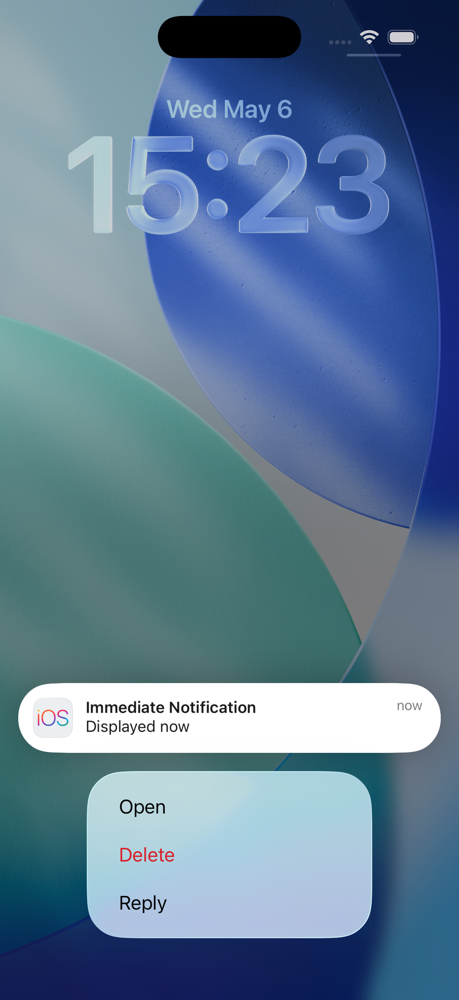
</p>

#### Action Received Callbacks

```swift
// Receive action button taps
IosNotificationManager.shared.onActionReceived = { notificationId, actionId, userInfo in
    print("notification: \(notificationId), action: \(actionId)")
}

// Receive text input action submissions
IosNotificationManager.shared.onTextInputActionReceived = { notificationId, actionId, userText, userInfo in
    print("notification: \(notificationId), action: \(actionId), text: \(userText)")
}
```

---

## Windows

Toast notifications for **packaged** (MSIX) and **unpackaged** (plain Win32) apps, on Windows 11 or later. The Windows library offers them through two public APIs over one implementation, and the sample app uses the C++ API.

| API | Names | Header | NuGet package |
|---|---|---|---|
| C++ API | `NativeToolkit::Notification` | `<NativeToolkit/Notification.h>` | `NativeToolkit` |
| C ABI | `ntk_notification_*` | `<NativeToolkitC/Notification.h>` | `NativeToolkit.CApi` |

### NativeToolkit::Notification

- `Notification::Manager` is the notification service of the process. Windows registers one activation handler per process, so there is one `Manager` at a time: a second `Create` fails with `ErrorCode::NotSupported`.
- Every operation is synchronous and blocks the calling thread.
- A call returns `Notification::Result<T>`: `has_value()` tells the two cases apart, and `error()` carries a `Notification::ErrorCode` plus the raw `systemCode`.
- `Manager::Create` puts the calling thread into a multi-threaded apartment. A thread left as an MTA cannot create a `Clipboard::Session`, which needs an STA - initialise the thread as an STA first when both run on it.
- Unpackaged apps get `ErrorCode::NotSupported` from `SetBadge`, `RemoveById` and `GetAll`, which the platform offers to packaged apps only.

---

### Setup

#### Package.appxmanifest (Packaged apps)

Add the following extensions inside the `<Application>` element to enable toast activation:

```xml
<Extensions>
  <com:Extension Category="windows.comServer">
    <com:ComServer>
      <com:ExeServer Executable="YourApp.exe"
                     DisplayName="Native Toolkit Notification Activator"
                     Arguments="----AppNotificationActivated:">
        <com:Class Id="5F6A1B27-7C0B-4E1B-9070-6F1966502BAF"
                   DisplayName="Toast Activator"/>
      </com:ExeServer>
    </com:ComServer>
  </com:Extension>
  <desktop:Extension Category="windows.toastNotificationActivation">
    <desktop:ToastNotificationActivation
        ToastActivatorCLSID="5F6A1B27-7C0B-4E1B-9070-6F1966502BAF"/>
  </desktop:Extension>
</Extensions>
```

Replace the CLSID with the one registered in your own manifest. The sample app uses `5F6A1B27-7C0B-4E1B-9070-6F1966502BAF`.

#### Create the manager (packaged app)

```cpp
#include <NativeToolkit/Notification.h>

#include <optional>

namespace Notification = NativeToolkit::Notification;

// The one Manager this process may have. It is move only, so keep it where it
// outlives the screen that created it.
std::optional<Notification::Manager> g_manager;

void OnNotificationInvoked(Notification::ActivationArgs const& args)
{
    // Runs on a thread the OS picks. Marshal to the UI thread before touching
    // UI elements; see "Activation handler" below.
}

Notification::ManagerOptions options;
// Called when the user acts on a notification. Leaving it empty drops activations.
options.onInvoked = &OnNotificationInvoked;
// A packaged (MSIX) app needs neither a display name nor an icon.
options.isPackaged = true;

auto created = Notification::Manager::Create(options);
if (created.has_value())
{
    g_manager.emplace(std::move(created).value());
}
else
{
    // NotSupported: a Manager already exists in this process.
    const Notification::ErrorCode code = created.error().code;
}
```

#### Create the manager (unpackaged app)

An app without package identity loads the Windows App SDK runtime first and keeps the token alive for as long as notifications are used.

```cpp
#include <NativeToolkit/Notification.h>

namespace Notification = NativeToolkit::Notification;

// Step 1: bootstrap the Windows App SDK runtime. 0x00010007 is 1.7.
auto runtime = Notification::Runtime::Initialize(Notification::RuntimeVersion{ 0x00010007 });
if (!runtime.has_value())
{
    // HResultFailure: systemCode holds the bootstrapper's HRESULT.
    return;
}
// Keep the value alive; destroying it shuts the runtime down again.
Notification::Runtime held = std::move(runtime).value();

// Step 2: create the manager with a display name and an icon, both required here.
Notification::ManagerOptions options;
options.onInvoked = &OnNotificationInvoked;
options.isPackaged = false;
options.displayName = L"MyApp";
options.iconUri = L"C:\\path\\to\\app-icon.png";

auto created = Notification::Manager::Create(options);
```

`displayName` is more than a label here: it becomes the app's AppUserModelID (AUMID). `Create` names the Start Menu shortcut after it, derives the activator's CLSID from it, and writes `HKCU\Software\Classes\AppUserModelId\<displayName>`, including `CustomActivator`, which routes an activation to the running process. These writes overwrite, so give each app its own name: two apps that pass the same `displayName` take each other's activations. The same holds for `display_name` in the C ABI.

#### Close

```cpp
// Unregisters the process and stops activations. Doing it twice does nothing.
g_manager->Close();
g_manager.reset();
```

---

### Init / Setting

#### Get Notification Setting

```cpp
const auto setting = g_manager->GetSetting();
if (setting.has_value())
{
    switch (setting.value())
    {
    case Notification::NotificationSetting::Enabled:                break; // 0
    case Notification::NotificationSetting::DisabledForApplication: break; // 1
    case Notification::NotificationSetting::DisabledForUser:        break; // 2
    case Notification::NotificationSetting::DisabledByGroupPolicy:  break; // 3
    case Notification::NotificationSetting::DisabledByManifest:     break; // 4
    }
}
```

#### Open Notification Settings

Opens the Windows notification settings page. Use it when `GetSetting` reports anything but `Enabled`, to let the user turn notifications back on.

```cpp
const auto result = g_manager->OpenSettings();
```

---

### Show Notification

Everything a toast can carry lives in `NotificationContent`. The sample fills a title, a body and a tag, and adds one thing at a time from there.

```cpp
Notification::NotificationContent MakeContent(std::wstring title, std::wstring body, std::wstring tag)
{
    Notification::NotificationContent content;
    content.title = std::move(title);
    content.body = std::move(body);
    content.tag = std::move(tag);
    return content;
}
```

#### Basic

```cpp
const auto content = MakeContent(L"Hello", L"Basic toast", L"sample");
const auto result = g_manager->Show(content);
```

<p align="center">
    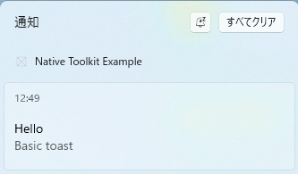
</p>

#### With Buttons

A button carries its own arguments, which reach the activation handler when it is pressed. At most five buttons.

```cpp
Notification::Button MakeButton(std::wstring label, std::wstring action)
{
    Notification::Button button;
    button.label = std::move(label);
    // Any keys you like; they come back in ActivationArgs::values.
    button.args = Notification::ArgumentPairs{ { L"action", std::move(action) } };
    return button;
}

auto content = MakeContent(L"Actionable", L"Toast with buttons", L"sample");
content.buttons = { MakeButton(L"Open", L"open"), MakeButton(L"Dismiss", L"dismiss") };
const auto result = g_manager->Show(content);
```

<p align="center">
    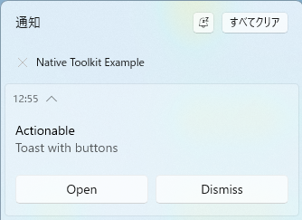
</p>

#### With Image

```cpp
auto content = MakeContent(L"With Image", L"Toast with hero image", L"sample");
// A packaged app can use ms-appx:///; a file:/// or http(s):// URI works too.
content.heroImage = L"ms-appx:///Assets/StoreLogo.png";
const auto result = g_manager->Show(content);
```

<p align="center">
    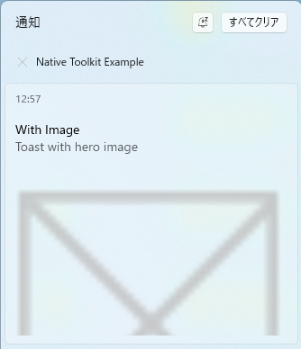
</p>

#### With Input

The values the user typed or picked arrive in the activation handler, keyed by the field ids.

```cpp
auto content = MakeContent(L"Reply", L"Type a reply and pick an option", L"sample");

Notification::TextInput reply;
reply.id = L"reply";
reply.placeholder = L"Type a message";
content.textInputs = { reply };

Notification::ComboInput status;
status.id = L"opt";
status.title = L"Status";
// Not checked against items; an id that is not there leaves the field unset.
status.defaultSelection = L"busy";
status.items = { { L"free", L"Free" }, { L"busy", L"Busy" } };
content.comboInputs = { status };

content.buttons = { MakeButton(L"Send", L"send") };
const auto result = g_manager->Show(content);
```

<p align="center">
    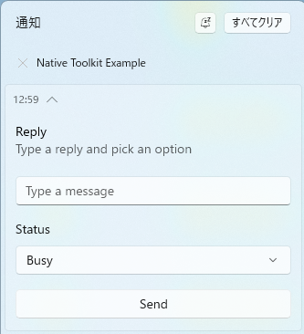
</p>

#### With Progress

Shows a progress bar. Update it later with `UpdateProgress` and the same tag.

```cpp
auto content = MakeContent(L"Downloading", L"In progress", L"progress-sample");

Notification::ProgressSpec progress;
progress.title = L"Toolkit.zip";
// 0.0 - 1.0. The value is not range checked here.
progress.value = 0.3;
progress.valueStr = L"30%";
progress.status = L"Downloading";
content.progress = progress;

const auto result = g_manager->Show(content);
```

<p align="center">
    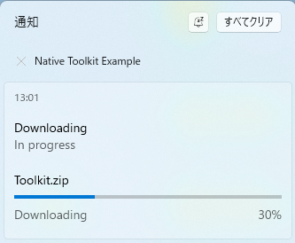
</p>

#### With Expiration

The notification leaves the action centre once the time has passed. It is relative to delivery, and `Schedule` ignores it.

```cpp
auto content = MakeContent(L"Expires", L"This toast expires in 10 seconds", L"sample");
content.expiration = std::chrono::seconds(10);
const auto result = g_manager->Show(content);
```

#### With Audio

```cpp
auto content = MakeContent(L"Reminder", L"Toast with reminder sound", L"sample");

Notification::AudioSpec audio;
// Event: a named system sound. Mute: no sound. Uri: the sound at audio.uri.
audio.kind = Notification::AudioKind::Event;
audio.eventName = L"reminder";
content.audio = audio;

const auto result = g_manager->Show(content);
```

---

### Schedule Notification

`Schedule` takes an absolute time as a `std::chrono::system_clock::time_point`. `expiration` and `progress` are ignored when scheduling.

```cpp
#include <chrono>

const auto when = std::chrono::system_clock::now() + std::chrono::seconds(60);
const auto content = MakeContent(L"Scheduled", L"Fires in ~1 minute", L"scheduled");
const auto result = g_manager->Schedule(content, when);
```

> **Note:** Notifications scheduled more than 5 minutes in the past may be discarded by the OS if the app was not running at delivery time.

#### Cancel Scheduled

```cpp
// The tag and the group of the scheduled notification.
const auto result = g_manager->CancelScheduled(L"scheduled", L"");
```

---

### Update Progress

Updates the progress bar of a notification that is already showing one. `ErrorCode::ProgressNotFound` means there is no such notification in the action centre, or the sequence number was stale.

```cpp
Notification::ProgressUpdate update;
// Must match the tag and group given to Show.
update.tag = L"progress-sample";
update.group = L"";
update.value = 0.6;
update.valueString = L"60%";
update.status = L"Downloading";
// Yours to increase; the OS drops an update that goes backwards.
update.sequenceNumber = seq++;

const auto result = g_manager->UpdateProgress(update);
if (!result.has_value() && result.error().code == Notification::ErrorCode::ProgressNotFound)
{
    // Nothing to update: show a progress notification first.
}
```

<p align="center">
    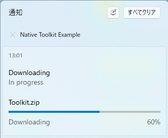
</p>

---

### Badge

Sets the badge on the taskbar icon. Packaged apps only: an unpackaged app gets `ErrorCode::NotSupported`.

```cpp
g_manager->SetBadge(5);   // numeric badge
g_manager->SetBadge(-1);  // glyph: alert
g_manager->SetBadge(0);   // clear the badge
```

**Glyph values:** `-1`=alert, `-2`=activity, `-3`=newMessage, `-4`=available, `-5`=busy, `-6`=away. A value below -6 is `ErrorCode::InvalidParameter`.

<p align="center">
    
</p>

---

### Remove / Query

#### Get All Notifications

Lists what is in the action centre. Packaged apps only.

```cpp
const auto result = g_manager->GetAll();
if (result.has_value())
{
    for (const Notification::NotificationRef& notification : result.value())
    {
        const uint32_t id = notification.id;
        const std::wstring& tag = notification.tag;
        const std::wstring& group = notification.group;
    }
}
```

#### Remove by ID

Removes one notification by the id `GetAll` reported. Packaged apps only.

```cpp
const auto result = g_manager->RemoveById(notificationId);
```

#### Remove by Tag

```cpp
const auto result = g_manager->RemoveByTag(L"sample", L"");
```

#### Remove All

```cpp
const auto result = g_manager->RemoveAll();
```

---

### Activation handler

The handler runs on whichever thread the OS delivers the activation on, and it is not moved to yours. `ActivationArgs::values` holds the arguments of the button that was pressed merged with the contents of every text and selection field, keyed by their ids; `rawArguments` is the untouched argument string.

When an unpackaged app is launched by clicking a toast (cold start), that activation comes the same way as any other, exactly once, and it can arrive before `Manager::Create` returns: with the calling thread an STA, it has been seen to arrive inside `Create`, on that thread. A handler must not assume the manager it belongs to already exists. The process's command line only says that COM launched it (`-ToastActivated -Embedding`); it carries nothing of the toast.

The sample app installs the handler once, at creation, and forwards it to whichever page is on screen:

```cpp
namespace
{
    std::function<void(winrt::hstring)> g_notificationHandler;

    void OnNotificationInvoked(Notification::ActivationArgs const& args)
    {
        if (g_notificationHandler)
        {
            g_notificationHandler(winrt::hstring{ args.rawArguments });
        }
    }
}

// In OnNavigatedTo - register, and marshal to the UI thread.
auto weakText = winrt::make_weak(ResultTextBlock());
auto dq = DispatcherQueue();
g_notificationHandler = [weakText, dq](winrt::hstring args)
{
    dq.TryEnqueue([weakText, args]()
    {
        if (auto text = weakText.get())
            text.Text(L"\U0001F514 Notification invoked:\n" + args);
    });
};

// In OnNavigatedFrom - unregister.
g_notificationHandler = nullptr;
```

---

### Error Codes

`Notification::ErrorCode` (`NativeToolkit::NotificationError`). The same numbers are the C ABI's `NTK_NOTIFICATION_ERROR_*`.

| Code | Name | Description |
|---|---|---|
| 0 | `None` | Success |
| 1 | `NotInitialized` | Used before `Create`, or after `Close` |
| 2 | `Disabled` | Notifications are off for this app or user |
| 3 | `InvalidPayload` | Reserved: never returned. The 1.x C ABI's JSON payload did not parse |
| 4 | `ProgressNotFound` | No notification to update, or a stale sequence number |
| 5 | `HResultFailure` | Registration, the shortcut, or the runtime bootstrap failed |
| 6 | `BadgeFailed` | The badge update failed |
| 7 | `InvalidParameter` | A bad argument, such as a badge value below -6 |
| 8 | `NotSupported` | Not available for this app type (`SetBadge` / `RemoveById` / `GetAll` for unpackaged apps), or a second manager |

### C ABI

- The same notifications for C, and for any language that can call a C DLL.
- The content is built through a handle instead of a struct, one setter at a time, and freed with `ntk_notification_content_free`.
- A registration carries `user_data` and a `release` callback. `release` is called exactly once for every registration, whatever the registering function returned, so it is where a binding frees what it allocated.
- Handles are freed with `ntk_notification_manager_free`, `ntk_notification_runtime_free` and `ntk_notification_list_free`.
- Every function may be called from any thread. Activations arrive on a thread the OS picks, and everything the activation hands over is valid only during that call.

#### The runtime, the manager and activations

```c
#include <string.h>
#include <NativeToolkitC/Common.h>
#include <NativeToolkitC/Notification.h>

static void NTK_CALL on_invoked(void* user_data, const ntk_notification_activation* activation)
{
    /* On a thread the OS picks. Nothing read here outlives the call. */
    size_t size = 0;
    const char* raw = ntk_notification_activation_raw_arguments(activation, &size);
    (void)raw; (void)user_data;

    /* The button's arguments and the user's input, merged, keyed by id. */
    size_t count = ntk_notification_activation_value_count(activation);
    size_t i;
    for (i = 0; i < count; ++i) {
        const char* key = ntk_notification_activation_key_at(activation, i, NULL);
        const char* value = ntk_notification_activation_value_at(activation, i, NULL);
        (void)key; (void)value;
    }
}

static void NTK_CALL release_user_data(void* user_data)
{
    /* Called exactly once, even when the registering call failed. */
    (void)user_data;
}

/* An app without package identity loads the Windows App SDK runtime first and
   keeps the handle for as long as notifications are used. 0x00010007 is 1.7.
   A packaged app skips this. */
ntk_notification_runtime* runtime = NULL;
ntk_notification_error error = ntk_notification_runtime_initialize(0x00010007u, &runtime);
if (error != NTK_NOTIFICATION_ERROR_NONE) {
    return;
}

ntk_notification_manager_options options;
memset(&options, 0, sizeof(options));
options.struct_size = (uint32_t)sizeof(options);
options.on_invoked = &on_invoked;
options.user_data = NULL;
options.release = &release_user_data;
options.is_unpackaged = 1;                 /* 0 for a packaged (MSIX) app */
options.display_name = "MyApp";            /* required when unpackaged */
options.icon_uri = "C:\\path\\to\\app-icon.png";

ntk_notification_manager* manager = NULL;
error = ntk_notification_manager_create(&options, &manager);
if (error != NTK_NOTIFICATION_ERROR_NONE) {
    ntk_notification_runtime_free(runtime);
    return;
}

/* Replacing the handler later: the previous registration's release follows
   once no activation is still running it. */
error = ntk_notification_manager_set_invoked_handler(manager, &on_invoked, NULL, &release_user_data);

/* Shutting down: close, free the manager, then free the runtime. */
ntk_notification_manager_close(manager);
ntk_notification_manager_free(manager);
ntk_notification_runtime_free(runtime);
```

#### Building the content, showing and scheduling

Every setter is optional except what the OS itself requires. `add_button` and `add_combo` hand back the index of what they added, which the argument and item setters then address.

```c
#include <NativeToolkitC/Common.h>
#include <NativeToolkitC/Notification.h>

ntk_notification_content* content = NULL;
if (ntk_notification_content_create(&content) != NTK_NOTIFICATION_ERROR_NONE) {
    return;
}

/* Text and identity. UTF-8 throughout. */
ntk_notification_content_set_title(content, "Hello");
ntk_notification_content_set_body(content, "Basic toast");
ntk_notification_content_set_tag(content, "sample");
ntk_notification_content_set_group(content, "");
ntk_notification_content_set_attribution(content, "native-toolkit");
ntk_notification_content_set_scenario(content, NTK_NOTIFICATION_SCENARIO_DEFAULT);
ntk_notification_content_set_duration(content, NTK_NOTIFICATION_DURATION_SHORT);

/* Images. */
ntk_notification_content_set_hero_image(content, "ms-appx:///Assets/StoreLogo.png");
ntk_notification_content_set_inline_image(content, NULL);   /* NULL removes it */
ntk_notification_content_set_app_logo(content, "ms-appx:///Assets/StoreLogo.png",
                                      NTK_NOTIFICATION_LOGO_CROP_CIRCLE);

/* Sound: a named system sound, no looping. */
ntk_notification_content_set_audio(content, NTK_NOTIFICATION_AUDIO_KIND_EVENT,
                                   "reminder", NULL, 0);

/* Buttons. with_arguments non-zero starts an argument list to add to. */
size_t button = 0;
ntk_notification_content_add_button(content, "Open", NULL, 1, &button);
ntk_notification_content_add_button_argument(content, button, "action", "open");

/* A text field and a selection field. */
ntk_notification_content_add_text_input(content, "reply", "Type a message", NULL);

size_t combo = 0;
ntk_notification_content_add_combo(content, "opt", "Status", "busy", &combo);
ntk_notification_content_add_combo_item(content, combo, "free", "Free");
ntk_notification_content_add_combo_item(content, combo, "busy", "Busy");

/* A progress bar, and the timings. Both are ignored when scheduling. */
ntk_notification_content_set_progress(content, "Toolkit.zip", 0.3, "30%", "Downloading");
ntk_notification_content_set_expiration(content, 10);            /* seconds after delivery */
ntk_notification_content_set_expires_on_reboot(content, 0);      /* packaged apps only */
ntk_notification_content_set_timestamp(content, 1758585600000);  /* Unix milliseconds */

/* Show it now... */
ntk_notification_error error = ntk_notification_show(manager, content);

/* ...or at an absolute time, again in Unix milliseconds. */
error = ntk_notification_schedule(manager, content, 1758585660000);

ntk_notification_content_free(content);

/* Cancel a scheduled notification by tag and group. */
error = ntk_notification_cancel_scheduled(manager, "scheduled", "");
```

#### Progress, badge and the OS settings

```c
#include <string.h>
#include <NativeToolkitC/Common.h>
#include <NativeToolkitC/Notification.h>

/* Update the bar of a notification that is already showing one. */
ntk_notification_progress_update update;
memset(&update, 0, sizeof(update));
update.struct_size = (uint32_t)sizeof(update);
update.tag = "progress-sample";      /* as given to ntk_notification_show */
update.group = "";
update.value = 0.6;
update.value_string = "60%";
update.status = "Downloading";
update.sequence_number = 2;          /* yours to increase */

ntk_notification_error error = ntk_notification_update_progress(manager, &update);
if (error == NTK_NOTIFICATION_ERROR_PROGRESS_NOT_FOUND) {
    /* Nothing to update, or the sequence number was stale. */
}

/* Badge on the taskbar icon. Packaged apps only: NOT_SUPPORTED otherwise.
   5 is a number, -1 the alert glyph, 0 clears it. */
error = ntk_notification_set_badge(manager, 5);

/* What the OS reports, and the page that changes it. */
ntk_notification_setting setting = NTK_NOTIFICATION_SETTING_ENABLED;
error = ntk_notification_get_setting(manager, &setting);
if (setting != NTK_NOTIFICATION_SETTING_ENABLED) {
    error = ntk_notification_open_settings(manager);
}
```

#### Listing and removing

```c
#include <NativeToolkitC/Common.h>
#include <NativeToolkitC/Notification.h>

/* What is in the action centre. Packaged apps only. */
ntk_notification_list* list = NULL;
ntk_notification_error error = ntk_notification_get_all(manager, &list);
if (error == NTK_NOTIFICATION_ERROR_NONE) {
    size_t count = ntk_notification_list_count(list);
    size_t i;
    for (i = 0; i < count; ++i) {
        uint32_t id = ntk_notification_list_id_at(list, i);
        const char* tag = ntk_notification_list_tag_at(list, i, NULL);
        const char* group = ntk_notification_list_group_at(list, i, NULL);
        (void)id; (void)tag; (void)group;
    }
    /* The pointers above are valid until this call. */
    ntk_notification_list_free(list);
}

/* Removing: by the id get_all reported (packaged apps only), by tag and
   group, or everything this app put there. */
error = ntk_notification_remove_by_id(manager, 1u);
error = ntk_notification_remove_by_tag(manager, "sample", "");
error = ntk_notification_remove_all(manager);
```

| C++ API | C ABI |
|---|---|
| `Runtime::Initialize` / destructor | `ntk_notification_runtime_initialize` / `ntk_notification_runtime_free` |
| `Manager::Create` | `ntk_notification_manager_create` |
| `Manager::SetInvokedHandler` | `ntk_notification_manager_set_invoked_handler` |
| `Manager::Close` | `ntk_notification_manager_close` / `ntk_notification_manager_free` |
| `NotificationContent` | `ntk_notification_content_create` and its 22 setters |
| `ActivationArgs` | `ntk_notification_activation_raw_arguments` / `_value_count` / `_key_at` / `_value_at` |
| `Manager::Show` | `ntk_notification_show` |
| `Manager::Schedule` | `ntk_notification_schedule` (the time is Unix milliseconds) |
| `Manager::CancelScheduled` | `ntk_notification_cancel_scheduled` |
| `Manager::UpdateProgress` | `ntk_notification_update_progress` |
| `Manager::SetBadge` | `ntk_notification_set_badge` |
| `Manager::GetAll` | `ntk_notification_get_all` and `ntk_notification_list_*` |
| `Manager::RemoveById` / `RemoveByTag` / `RemoveAll` | `ntk_notification_remove_by_id` / `_by_tag` / `_all` |
| `Manager::GetSetting` | `ntk_notification_get_setting` |
| `Manager::OpenSettings` | `ntk_notification_open_settings` |

---

## macOS

### MacNotificationManager

`MacNotificationManager` is a singleton class that provides all local notification operations on macOS.

**Requirements:** macOS 15+. Calls on earlier OS versions return `unsupportedOS` (error code 1001).

**Thread safety:** Public APIs can be called from any thread. All completion callbacks are dispatched to the **main queue**.

<p align="center">
    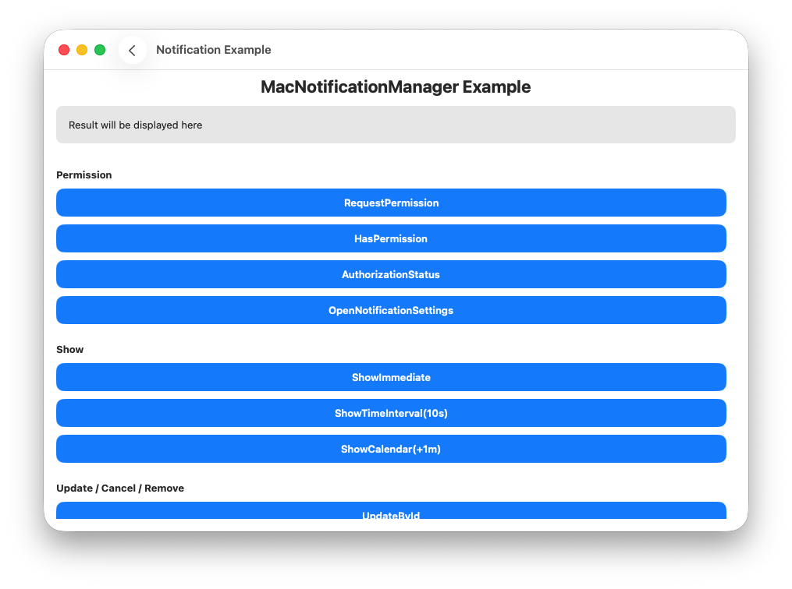
</p>

### Setup

Call `setup()` once at app launch (e.g. in `applicationDidFinishLaunching`). Register action callbacks here.

```swift
import MacLibrary

MacNotificationManager.shared.setup()

// Receive action button taps
MacNotificationManager.shared.setActionReceivedHandler { notificationId, actionId, userInfoJson in
    print("Action received: \(notificationId), \(actionId)")
}

// Receive text input action submissions
MacNotificationManager.shared.setTextInputActionReceivedHandler { notificationId, actionId, userText, userInfoJson in
    print("Text input received: \(userText)")
}
```

### Permission

#### Request Permission

```swift
MacNotificationManager.shared.requestPermission { result in
    // runs on main queue
    switch result {
    case .success:
        print("Notification permission granted")
    case .failure(let error):
        if error.errorCode == 1002 || error.errorCode == 1003 {
            // denied — user must enable notifications manually in Settings
            print("Permission denied. Please enable notifications in Settings.")
        } else {
            print("Error \(error.errorCode): \(error.errorMessage)")
        }
    }
}
```

<p align="center">
    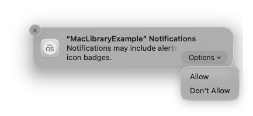
</p>

#### Check Permission

Returns a boolean indicating whether notifications are allowed.

```swift
MacNotificationManager.shared.getAuthorizationStatus { result in
    switch result {
    case .success(let status):
        let hasPermission = status == .authorized || status == .provisional
        print("Has permission: \(hasPermission)")
    case .failure(let error):
        print("Error \(error.errorCode): \(error.errorMessage)")
    }
}
```

<p align="center">
    
</p>

#### Get Authorization Status

Returns the detailed authorization status.

```swift
MacNotificationManager.shared.getAuthorizationStatus { result in
    switch result {
    case .success(let status):
        // .notDetermined / .denied / .authorized / .provisional / .unsupported
        print(status)
    case .failure(let error):
        print("Error \(error.errorCode): \(error.errorMessage)")
    }
}
```

<p align="center">
    
</p>

#### Open Notification Settings

```swift
MacNotificationManager.shared.openNotificationSettings { result in
    if case .failure(let error) = result {
        print("Error \(error.errorCode): \(error.errorMessage)")
    }
}
```

<p align="center">
    
</p>

#### Reset Notification Permission (macOS 26.3)

Use this procedure during development to reset a previously denied permission.

1. Open **System Settings** → **Notifications**
2. **Right-click** the target app in the app list
3. Select **"Reset Notifications..."**
4. Press **"Reset Notifications"** in the confirmation dialog
5. The permission dialog will appear again on the next app launch

### Show Notification

Create a `NotificationContent` and call `show()`.

**`NotificationContent` constraints:**
- `id`: 1–128 chars (`[A-Za-z0-9\-_]`)
- `title`: 1–128 chars
- `body`: 0–1024 chars (optional)

#### Immediate

```swift
import MacLibrary

let content = NotificationContent(
    id: "mac-sample-notification",
    title: "Immediate Notification",
    body: "Displayed now",
    subtitle: "MacLibraryExample",
    categoryIdentifier: "mac-sample-category",
    userInfo: ["source": "MacLibraryExample", "id": "mac-sample-notification"],
    badge: nil
)

MacNotificationManager.shared.show(content: content) { result in
    // runs on main queue
    switch result {
    case .success:
        print("Notification shown")
    case .failure(let error):
        print("Error \(error.errorCode): \(error.errorMessage)")
    }
}
```

<p align="center">
    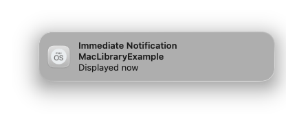
</p>

#### Time Interval Trigger

```swift
MacNotificationManager.shared.show(
    content: content,
    trigger: .timeInterval(seconds: 10, repeats: false)
) { result in
    switch result {
    case .success:
        print("Scheduled for 10 seconds")
    case .failure(let error):
        print("Error \(error.errorCode): \(error.errorMessage)")
    }
}
```

<p align="center">
    
</p>

#### Calendar Trigger

```swift
let nextDate = Calendar.current.date(byAdding: .minute, value: 1, to: Date()) ?? Date()
var components = Calendar.current.dateComponents([.year, .month, .day, .hour, .minute], from: nextDate)
components.second = 0

MacNotificationManager.shared.show(
    content: content,
    trigger: .calendar(dateComponents: components, repeats: false)
) { result in
    switch result {
    case .success:
        print("Scheduled for 1 minute later")
    case .failure(let error):
        print("Error \(error.errorCode): \(error.errorMessage)")
    }
}
```

<p align="center">
    
</p>

### Update / Cancel / Remove

#### Update by ID

Replaces a pending notification with new content.

```swift
let updatedContent = NotificationContent(
    id: "mac-sample-notification",
    title: "Updated Notification",
    body: "This content was updated",
    subtitle: "MacLibraryExample",
    categoryIdentifier: "mac-sample-category",
    userInfo: ["source": "MacLibraryExample", "id": "mac-sample-notification"],
    badge: nil
)

MacNotificationManager.shared.update(
    identifier: "mac-sample-notification",
    content: updatedContent,
    trigger: .immediate
) { result in
    switch result {
    case .success:
        print("Updated")
    case .failure(let error):
        // error code 1104 if notification not found
        print("Error \(error.errorCode): \(error.errorMessage)")
    }
}
```

<p align="center">
    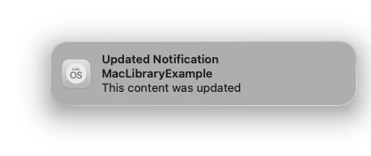
</p>

#### Cancel by ID

```swift
MacNotificationManager.shared.cancelScheduled(identifier: "mac-sample-notification")
```

#### Cancel All

```swift
MacNotificationManager.shared.cancelAllScheduled()
```

<p align="center">
    
</p>

#### Remove Delivered by ID

Removes a specific notification from Notification Center.

```swift
MacNotificationManager.shared.removeDelivered(identifier: "mac-sample-notification")
```

#### Remove All Delivered

```swift
MacNotificationManager.shared.removeAllDelivered()
```

<p align="center">
    
</p>

### Schedule

Use `schedule()` to register a future notification. The trigger must not be `.immediate`.

#### Schedule with Time Interval

```swift
let content = NotificationContent(
    id: "mac-sample-scheduled",
    title: "Scheduled Notification",
    body: "Scheduled in 10 seconds",
    subtitle: "MacLibraryExample",
    categoryIdentifier: "mac-sample-category",
    userInfo: ["source": "MacLibraryExample", "id": "mac-sample-scheduled"],
    badge: nil
)

MacNotificationManager.shared.schedule(
    content: content,
    trigger: .timeInterval(seconds: 10, repeats: false)
) { result in
    switch result {
    case .success:
        print("Scheduled")
    case .failure(let error):
        print("Error \(error.errorCode): \(error.errorMessage)")
    }
}
```

<p align="center">
    
</p>

#### Schedule with Calendar

```swift
let nextDate = Calendar.current.date(byAdding: .minute, value: 1, to: Date()) ?? Date()
var components = Calendar.current.dateComponents([.year, .month, .day, .hour, .minute], from: nextDate)
components.second = 0

MacNotificationManager.shared.schedule(
    content: content,
    trigger: .calendar(dateComponents: components, repeats: false)
) { result in
    switch result {
    case .success:
        print("Calendar scheduled")
    case .failure(let error):
        print("Error \(error.errorCode): \(error.errorMessage)")
    }
}
```

<p align="center">
    
</p>

#### Cancel Scheduled by ID

```swift
MacNotificationManager.shared.cancelScheduled(identifier: "mac-sample-scheduled")
```

#### Cancel All Scheduled

```swift
MacNotificationManager.shared.cancelAllScheduled()
```

### Query

#### Get Scheduled

```swift
MacNotificationManager.shared.getScheduled { result in
    switch result {
    case .success(let items):
        let ids = items.map { $0.identifier }.joined(separator: ", ")
        print("Scheduled: \(items.count) item(s), ids=[\(ids)]")
    case .failure(let error):
        print("Error \(error.errorCode): \(error.errorMessage)")
    }
}
```

<p align="center">
    
</p>

#### Get Delivered

```swift
MacNotificationManager.shared.getDelivered { result in
    switch result {
    case .success(let items):
        let ids = items.map { $0.identifier }.joined(separator: ", ")
        print("Delivered: \(items.count) item(s), ids=[\(ids)]")
    case .failure(let error):
        print("Error \(error.errorCode): \(error.errorMessage)")
    }
}
```

<p align="center">
    
</p>

### Badge

#### Set Badge Count (1)

```swift
MacNotificationManager.shared.setBadgeCount(1) { result in
    switch result {
    case .success:
        print("Badge set to 1")
    case .failure(let error):
        print("Error \(error.errorCode): \(error.errorMessage)")
    }
}
```

<p align="center">
    
</p>

#### Clear Badge (0)

```swift
MacNotificationManager.shared.setBadgeCount(0) { result in
    switch result {
    case .success:
        print("Badge cleared")
    case .failure(let error):
        print("Error \(error.errorCode): \(error.errorMessage)")
    }
}
```

<p align="center">
    
</p>

### Category

#### Register Category

```swift
let category = NotificationCategory(
    id: "mac-sample-category",
    actions: [
        NotificationAction(id: "open", title: "Open", isForeground: true),
        NotificationAction(id: "reply", title: "Reply", isTextInput: true, textInputPlaceholder: "Type message")
    ]
)

MacNotificationManager.shared.registerCategory(category) { result in
    switch result {
    case .success:
        // Send a notification and right-click to see the actions (Open, Reply)
        print("Category registered")
    case .failure(let error):
        print("Error \(error.errorCode): \(error.errorMessage)")
    }
}
```

Attach the category to a notification by setting `categoryIdentifier` in `NotificationContent`.

```swift
let content = NotificationContent(
    id: "mac-sample-notification",
    title: "Notification with Actions",
    body: "Right-click to see actions",
    subtitle: "MacLibraryExample",
    categoryIdentifier: "mac-sample-category",
    userInfo: ["source": "MacLibraryExample", "id": "mac-sample-notification"],
    badge: nil
)
```

<p align="center">
    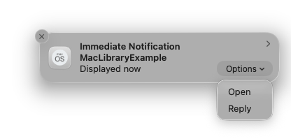
</p>

#### Remove Category

```swift
MacNotificationManager.shared.removeCategory(identifier: "mac-sample-category") { result in
    if case .failure(let error) = result {
        print("Error \(error.errorCode): \(error.errorMessage)")
    }
}
```

<p align="center">
    
</p>

### Error Codes

| Code | Case | Description |
|---|---|---|
| 1001 | `unsupportedOS` | macOS 15+ required |
| 1002 | `permissionDenied` | User denied notification permission |
| 1003 | `permissionRequestFailed` | Failed to request permission |
| 1101 | `invalidContent` | Invalid id, title, or body |
| 1102 | `invalidTrigger` | Invalid trigger (e.g. `timeInterval` < 1 second) |
| 1103 | `invalidCategory` | Invalid category |
| 1104 | `notificationNotFound` | No pending notification for the given identifier |
| 1201 | `addFailed` | Failed to add notification request |
| 1202 | `removeFailed` | Failed to remove notification |
| 1203 | `queryFailed` | Failed to query notifications |
| 1204 | `setBadgeFailed` | Failed to set badge count |
| 1205 | `openSettingsFailed` | Failed to open notification settings |
| 1999 | `unknown` | Unknown error |
