# Share Feature

Language:

- 日本語: [share.ja.md](share.ja.md)
- English (this page)
- 한국어: [share.ko.md](share.ko.md)

← [Back to Manual Top](index.md)

---

## Table of Contents

- [Android](#android)
  - [AndroidShareManager](#androidsharemanager)
  - [Setup](#setup)
    - [Add the library](#add-the-library)
    - [FileProvider](#fileprovider)
    - [Threads and events](#threads-and-events)
  - [Text Share](#text-share)
    - [Share Text](#share-text)
    - [Share URL](#share-url)
    - [Share Text with Rich Preview](#share-text-with-rich-preview)
    - [Share Text with Custom Chooser Action](#share-text-with-custom-chooser-action)
    - [Chooser Action Events](#chooser-action-events)
    - [Share Text with Invalid Action](#share-text-with-invalid-action)
    - [Share with Subject and Title](#share-with-subject-and-title)
  - [Image Share](#image-share)
  - [Multiple Images](#multiple-images)
  - [File Share](#file-share)
  - [Multiple Files](#multiple-files)
  - [Direct Share Target](#direct-share-target)
    - [Register Direct Share Target](#register-direct-share-target)
    - [Remove Direct Share Target](#remove-direct-share-target)
  - [Share with Callback](#share-with-callback)
    - [Basic Callback](#basic-callback)
    - [Callback with Rich Preview](#callback-with-rich-preview)
    - [Cancel Pending Callback](#cancel-pending-callback)
  - [Selection Event](#selection-event)
    - [Share For Selection](#share-for-selection)
    - [Cancel Share Selection](#cancel-share-selection)
  - [Receiving Incoming Shares](#receiving-incoming-shares)
  - [Error Handling](#error-handling)
  - [C ABI](#c-abi)
    - [Building](#building)
    - [Opening the Sharesheet](#opening-the-sharesheet)
    - [Selection and chooser action events](#selection-and-chooser-action-events)
    - [Direct Share targets](#direct-share-targets)
    - [Error values](#error-values)
- [iOS](#ios)
  - [IosShareManager](#iossharemanager)
  - [Setup](#setup-1)
  - [Text Share](#text-share-1)
    - [Share Text](#share-text-1)
    - [Share URL](#share-url-1)
    - [Share URL with Preview](#share-url-with-preview)
  - [Image Share](#image-share-1)
    - [Share Image](#share-image)
    - [Share Multiple Images](#share-multiple-images)
  - [File Share](#file-share-1)
    - [Share File](#share-file)
    - [Share Multiple Files](#share-multiple-files)
  - [Combined Content](#combined-content)
    - [Share Multiple Items](#share-multiple-items)
    - [Share with Subject](#share-with-subject)
    - [Exclude Activity Types](#exclude-activity-types)
  - [Error Handling](#error-handling-1)
- [macOS](#macos)
  - [MacShareManager](#macsharemanager)
  - [Setup](#setup-2)
  - [Picker - Basic](#picker---basic)
    - [Share Text](#share-text-2)
    - [Share URL](#share-url-2)
    - [Share Image](#share-image-1)
    - [Share File](#share-file-1)
  - [Picker - Multiple](#picker---multiple)
    - [Share Multiple Images](#share-multiple-images-1)
    - [Share Multiple Files](#share-multiple-files-1)
    - [Share Text and URL](#share-text-and-url)
  - [Picker - Filter](#picker---filter)
    - [Share Excluding Services](#share-excluding-services)
  - [Direct Service](#direct-service)
    - [Share via Mail](#share-via-mail)
    - [Check if a Service Can Perform](#check-if-a-service-can-perform)
  - [Error Handling](#error-handling-2)

---

## Android

The Android Sharesheet: text, URLs, images and files, rich previews, custom chooser actions, Direct Share targets, and the app the user picked. Android library 2.0.0 offers them through two public APIs over one implementation, and the sample app (`AndroidLibraryExample`) uses the Kotlin API.

| API | Names | Header / package | Maven coordinates |
|---|---|---|---|
| Kotlin API | `AndroidShareManager` | `com.jonghyunkim.nativetoolkit.share` | `io.github.kimjh4941:android-native-toolkit:2.0.0` |
| C ABI | `ntk_share_*` | `<NativeToolkitC/Share.h>` | `io.github.kimjh4941:android-native-toolkit-capi:2.0.0` |

- Libraries: `android-native-toolkit-2.0.0.aar` (Kotlin API) and `android-native-toolkit-capi-2.0.0.aar` (C ABI)
- Minimum SDK: Android 12 (API 31). The app compiles with compileSdk 36 or later, and Kotlin code that calls the library needs Kotlin 2.1 or later.
- Custom chooser actions: Android 14 (API 34)+
- Coming from 1.x: see [Migrating the Android library to 2.0.0](index.md#migrating-the-android-library-to-200).

The sections below follow the Share screen of the sample app. [C ABI](#c-abi) at the end covers the same operations for C.

---

### AndroidShareManager

`AndroidShareManager` is the entry point for sharing. There is one instance per process, and it keeps only the Application Context, so any Context can be passed to `getInstance`.

```kotlin
import com.jonghyunkim.nativetoolkit.share.AndroidShareManager

val shareManager = AndroidShareManager.getInstance(activity)
```

| Member | Description |
|---|---|
| `shareText(content, preview)` | Shares text or a URL |
| `shareTextWithActions(content, actions, preview)` | Shares text with custom chooser actions |
| `shareImage(filePath, mimeType)` / `shareImages(filePaths)` | Shares one image / several images |
| `shareFile(filePath)` / `shareFiles(filePaths)` | Shares one file / several files |
| `registerDirectShareTarget(target, iconBytes)` / `removeDirectShareTargets(ids)` | Adds / removes Direct Share targets |
| `shareWithCallback(content, preview, onResult, onFinished)` / `cancelPendingCallback()` | Shares text and reports the picked app to a callback / stops waiting |
| `shareForSelection(content, preview)` / `cancelShareSelection(token)` | Shares text and returns a token; the picked app arrives as a `selections` event / stops waiting |
| `chooserActions` | `EventHub<String>`: taps on custom chooser actions, as the action ID |
| `selections` | `EventHub<ShareSelection>`: apps picked in Sharesheets opened by `shareForSelection` |

The model types (`ShareContent`, `SharePreviewOptions`, `ShareChooserAction`, `DirectShareTarget`, `ShareSelection`) are in `com.jonghyunkim.nativetoolkit.share.domain.model`, and `ShareDomainError` is in `com.jonghyunkim.nativetoolkit.share.domain.error`. `preview` defaults to `SharePreviewOptions()` (no preview) wherever it appears.

---

### Setup

#### Add the library

The release ships a Maven repository in `dist/1.13.0/android/m2/`. Copy it into your project, for example as `third_party/native-toolkit-m2/`, and add it to the repositories:

**settings.gradle.kts:**

```kotlin
dependencyResolutionManagement {
    repositoriesMode.set(RepositoriesMode.FAIL_ON_PROJECT_REPOS)
    repositories {
        google()
        mavenCentral()
        maven { url = uri("third_party/native-toolkit-m2") }
    }
}
```

**app/build.gradle.kts:**

```kotlin
dependencies {
    implementation("io.github.kimjh4941:android-native-toolkit:2.0.0")
}
```

The repository carries the POM and Gradle Module Metadata, so Gradle also resolves the androidx libraries the library depends on. The AAR file alone does not carry them; see [Library integration](index.md#library-integration) if you add the AAR file directly.

#### FileProvider

The AAR declares its own `FileProvider` with the authority `${applicationId}.native_toolkit.share.fileprovider`, and image, file and thumbnail sharing go through it. The app does not declare a `FileProvider` for sharing. It covers these directories:

| Path element | Directory |
|---|---|
| `files-path` | `context.filesDir` |
| `cache-path` | `context.cacheDir` |
| `external-files-path` | `context.getExternalFilesDir(...)` |

A file anywhere else, including `context.externalCacheDir`, fails with `ShareDomainError.IllegalFileAccess`.

Do not declare `androidx.core.content.FileProvider` in your own manifest: the manifest merger matches providers by `android:name`, so it conflicts with the library's. The 1.x manual told apps to declare it for sharing; remove that declaration when moving to 2.0.0 (see [Migrating the Android library to 2.0.0](index.md#migrating-the-android-library-to-200)). A provider the app needs for its own purposes must be a subclass of `FileProvider` with its own authority; the library does not use it.

#### Threads and events

- The share operations can be called from any thread. The sample prepares files on `Dispatchers.IO` and calls the library on the main thread.
- `onResult` and `onFinished` of `shareWithCallback`, and the `chooserActions` and `selections` events, are called on the main thread.
- `addListener` and `EventHub.Registration.remove` are main-thread only; elsewhere they throw `IllegalStateException`.
- Neither `chooserActions` nor `selections` keeps events: an event that arrives while no listener is registered is dropped. Register the listener before opening the Sharesheet.
- An exception thrown by an event listener is caught and logged, and the other listeners still run.
- Sharing does not depend on the library's androidx.startup initializer. An app that disables Startup still calls `LibraryRuntime.ensureInitialized(activity)` for the other features, passing the Activity (see [Initialization](index.md#initialization)).

---

### Text Share

#### Share Text

```kotlin
val shareManager = AndroidShareManager.getInstance(activity)

try {
    shareManager.shareText(
        ShareContent(text = "Hello from native-toolkit")
    )
} catch (e: ShareDomainError) {
    // See Error Handling
}
```

<p align="center">
    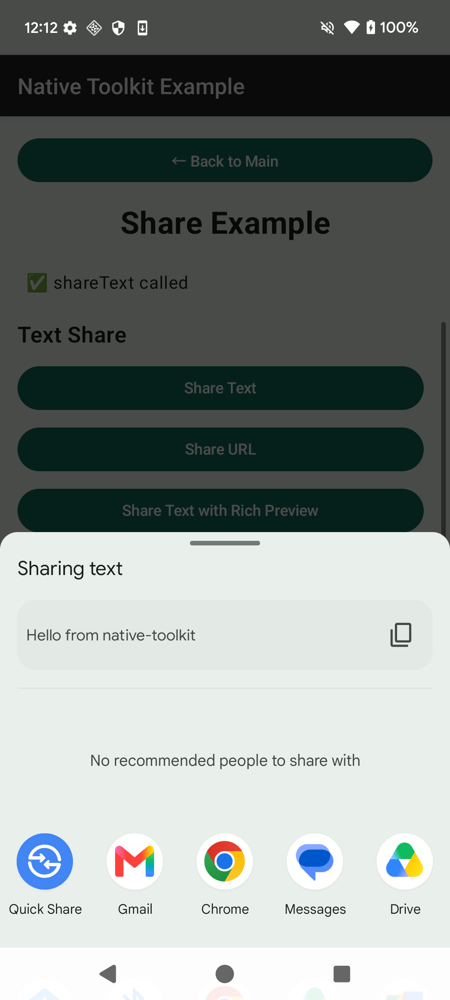
</p>

#### Share URL

```kotlin
shareManager.shareText(
    ShareContent(text = "https://developer.android.com/", mimeType = "text/plain")
)
```

<p align="center">
    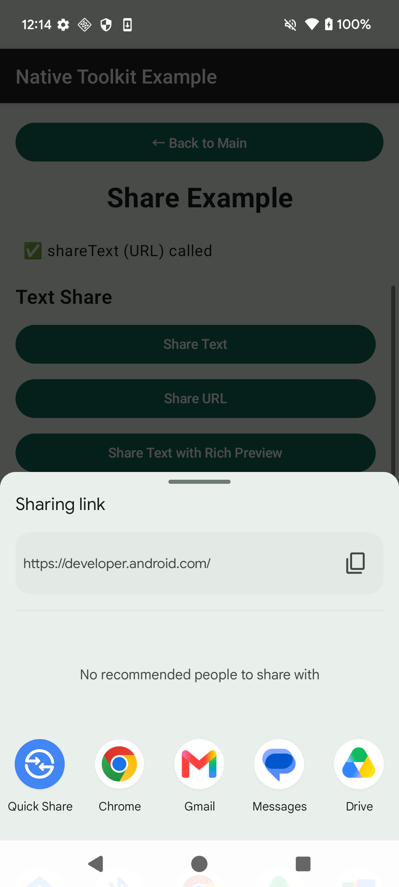
</p>

#### Share Text with Rich Preview

`SharePreviewOptions` adds a title and a thumbnail to the Sharesheet preview. The thumbnail must be a file in one of the [FileProvider](#fileprovider) directories. A thumbnail that is missing or outside them is skipped with a warning in logcat, and the text is still shared.

```kotlin
val bmp = BitmapFactory.decodeResource(context.resources, android.R.mipmap.sym_def_app_icon)
val file = File(context.cacheDir, "share_preview.png")
file.outputStream().use { bmp.compress(Bitmap.CompressFormat.PNG, 100, it) }

shareManager.shareText(
    ShareContent(
        text = "https://developer.android.com/",
        mimeType = "text/plain"
    ),
    SharePreviewOptions(
        title = "Introducing content previews",
        thumbnailPath = file.absolutePath
    )
)
```

<p align="center">
    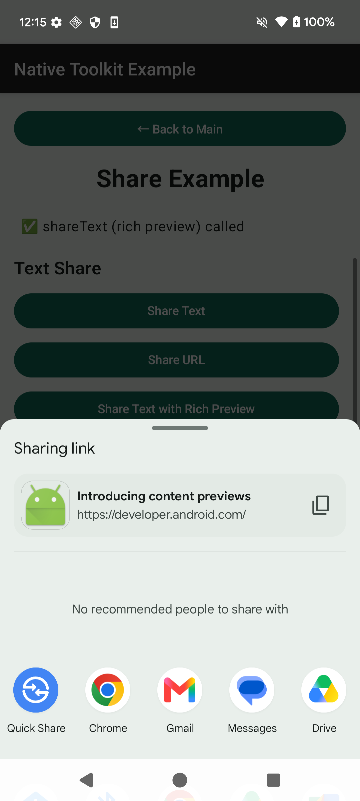
</p>

#### Share Text with Custom Chooser Action

`shareTextWithActions` adds `ShareChooserAction`s to the Sharesheet. They are shown on Android 14 (API 34) and later; on older versions the text is shared without them, but the actions are still checked.

| Field | Description |
|---|---|
| `id` | Comes back in the [`chooserActions` event](#chooser-action-events). Must not be empty, and must be unique within one call |
| `label` | The text shown under the icon |
| `iconBytes` | An image `BitmapFactory` can decode (PNG, JPEG, WebP) |

Each call makes the actions of earlier calls stop working: a tap on an action of an older Sharesheet is not delivered. A call rejected with `InvalidChooserAction` leaves the earlier actions working. No `BroadcastReceiver` or manifest entry is needed.

```kotlin
val bmp = BitmapFactory.decodeResource(context.resources, android.R.drawable.ic_menu_edit)
val iconBytes = ByteArrayOutputStream().use { baos ->
    bmp.compress(Bitmap.CompressFormat.PNG, 100, baos)
    baos.toByteArray()
}

shareManager.shareTextWithActions(
    ShareContent(
        text = "Shared with a custom chooser action",
        mimeType = "text/plain"
    ),
    listOf(ShareChooserAction(id = "custom", label = "Custom", iconBytes = iconBytes))
)
```

<p align="center">
    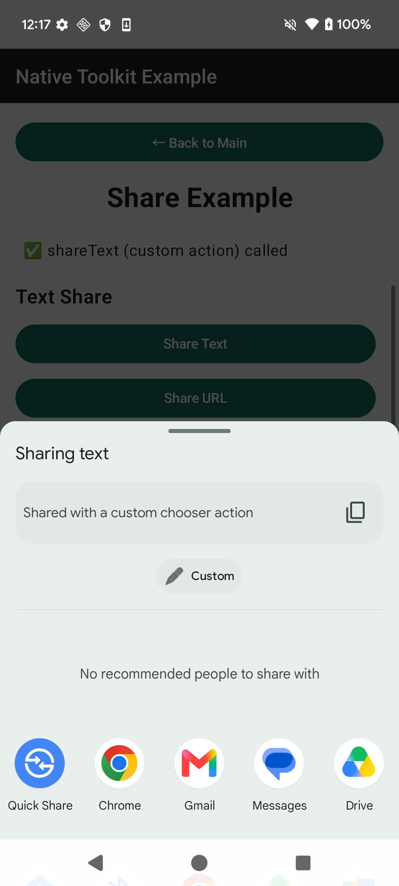
</p>

#### Chooser Action Events

A tap on a custom action arrives through `chooserActions` as the action's `id`, on the main thread. The sample registers the listener for the lifetime of `MainActivity`, so a tap is received whichever screen is shown.

```kotlin
class MainActivity : AppCompatActivity() {

    private var chooserActionRegistration: EventHub.Registration? = null

    override fun onCreate(savedInstanceState: Bundle?) {
        super.onCreate(savedInstanceState)
        val appContext = applicationContext
        val share = AndroidShareManager.getInstance(this)
        chooserActionRegistration = share.chooserActions.addListener { id, _ ->
            // id is the ShareChooserAction.id that was tapped ("custom" above)
            Toast.makeText(appContext, "Custom chooser action tapped", Toast.LENGTH_SHORT).show()
        }
    }

    override fun onDestroy() {
        chooserActionRegistration?.remove()
        chooserActionRegistration = null
        super.onDestroy()
    }
}
```

`EventHub` is `com.jonghyunkim.nativetoolkit.common.event.EventHub`. The second parameter of the listener is its own `Registration`, which it can remove from inside the listener.

#### Share Text with Invalid Action

Two actions with the same `id` are rejected before the Sharesheet opens, with `ShareDomainError.InvalidChooserAction`. An empty `id`, or an icon that is not a readable image, is rejected the same way.

```kotlin
val icon = ByteArrayOutputStream().use { out ->
    Bitmap.createBitmap(4, 4, Bitmap.Config.ARGB_8888).compress(Bitmap.CompressFormat.PNG, 100, out)
    out.toByteArray()
}

try {
    shareManager.shareTextWithActions(
        ShareContent(text = "This share is rejected"),
        listOf(ShareChooserAction("dup", "First", icon), ShareChooserAction("dup", "Second", icon))
    )
} catch (e: ShareDomainError.InvalidChooserAction) {
    // e.id == "dup". Nothing opened, and the actions of the previous share still work.
}
```

#### Share with Subject and Title

`subject` is sent as the email subject line (`Intent.EXTRA_SUBJECT`). `title` sets the Sharesheet title.

```kotlin
shareManager.shareText(
    ShareContent(
        text = "Body text shared from native-toolkit",
        title = "Choose an app",
        subject = "Sample subject line",
        mimeType = "text/plain"
    )
)
```

<p align="center">
    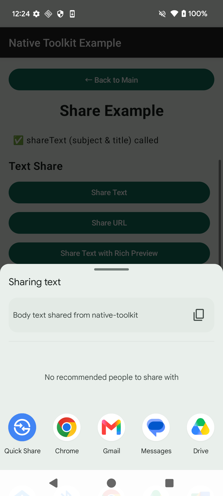
</p>

---

### Image Share

The file must be in one of the [FileProvider](#fileprovider) directories.

```kotlin
val bmp = BitmapFactory.decodeResource(context.resources, android.R.drawable.ic_menu_share)
val file = File(context.cacheDir, "share_sample.png")
file.outputStream().use { bmp.compress(Bitmap.CompressFormat.PNG, 100, it) }

shareManager.shareImage(file.absolutePath, "image/png")
```

<p align="center">
    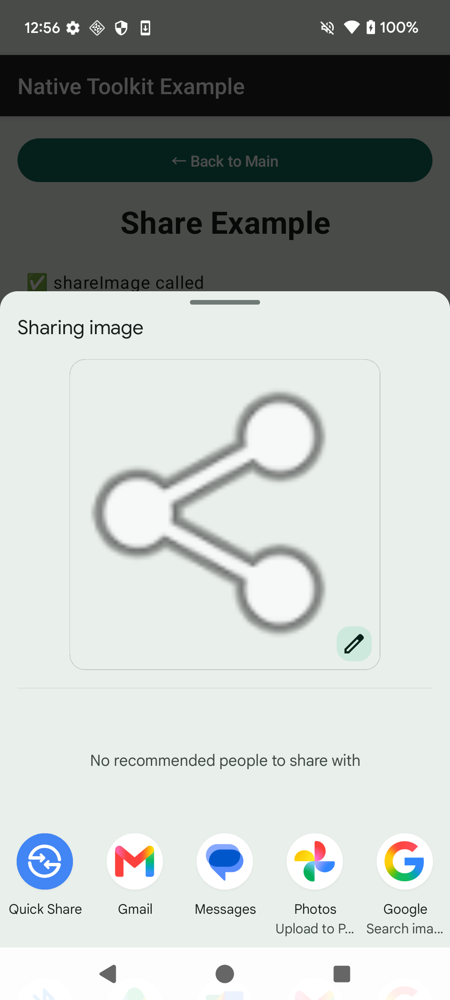
</p>

---

### Multiple Images

The MIME type comes from the file extensions: the common type when all images share one, `image/*` otherwise.

```kotlin
val bmp = BitmapFactory.decodeResource(context.resources, android.R.drawable.ic_menu_share)
val file1 = File(context.cacheDir, "share_sample_1.png")
val file2 = File(context.cacheDir, "share_sample_2.png")
file1.outputStream().use { bmp.compress(Bitmap.CompressFormat.PNG, 100, it) }
file2.outputStream().use { bmp.compress(Bitmap.CompressFormat.PNG, 100, it) }

shareManager.shareImages(listOf(file1.absolutePath, file2.absolutePath))
```

<p align="center">
    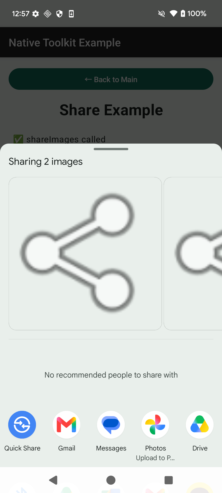
</p>

---

### File Share

The MIME type comes from the file extension (`*/*` for an extension the library does not know).

```kotlin
val file = File(context.cacheDir, "share_sample.txt")
    .apply { writeText("Share sample from native-toolkit") }

shareManager.shareFile(file.absolutePath)
```

<p align="center">
    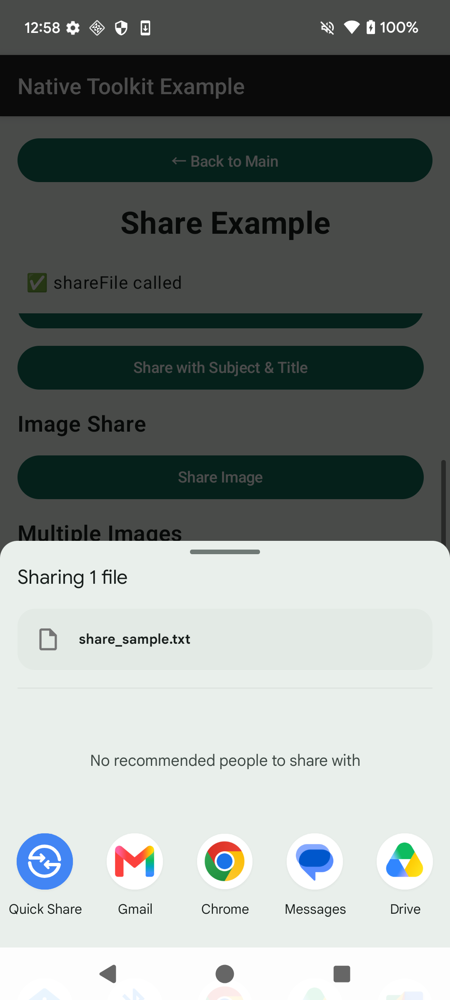
</p>

---

### Multiple Files

The MIME type is the common type when all files share one, `*/*` otherwise.

```kotlin
val file1 = File(context.cacheDir, "share_sample_1.txt")
    .apply { writeText("Share sample 1 from native-toolkit") }
val file2 = File(context.cacheDir, "share_sample_2.txt")
    .apply { writeText("Share sample 2 from native-toolkit") }

shareManager.shareFiles(listOf(file1.absolutePath, file2.absolutePath))
```

<p align="center">
    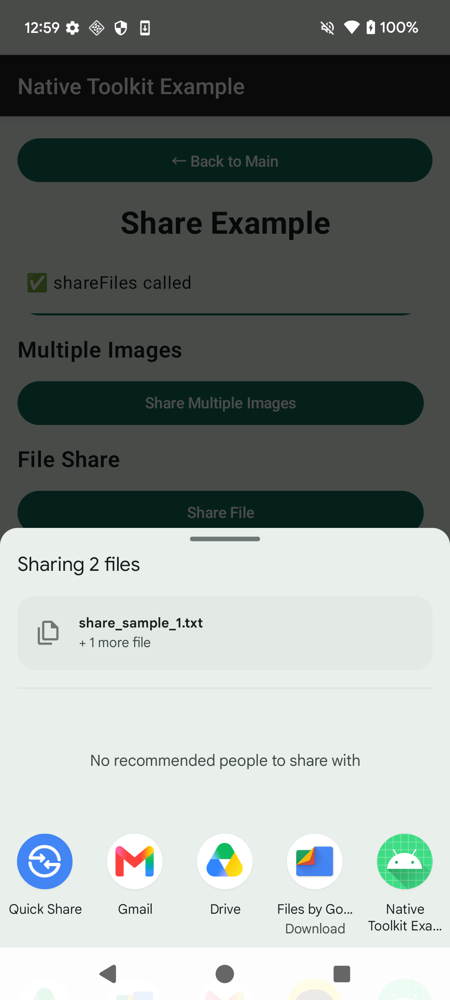
</p>

---

### Direct Share Target

Direct Share targets appear in the Sharesheet as suggested recipients in your app. The library publishes each target as a long-lived dynamic shortcut. For the Sharesheet to show it, the app declares a share target whose category matches the target's `category`, as the sample does. Replace `com.example.app.ShareReceiverActivity` below with your own Activity that is registered in the manifest and receives `ACTION_SEND`:

**AndroidManifest.xml** (inside the `<activity>` that receives shares):

```xml
<meta-data
    android:name="android.app.shortcuts"
    android:resource="@xml/shortcuts" />
```

**res/xml/shortcuts.xml:**

```xml
<?xml version="1.0" encoding="utf-8"?>
<shortcuts xmlns:android="http://schemas.android.com/apk/res/android">
    <share-target android:targetClass="com.example.app.ShareReceiverActivity">
        <data android:mimeType="text/plain" />
        <category android:name="android.shortcut.conversation" />
    </share-target>
</shortcuts>
```

#### Register Direct Share Target

`iconBytes` is an image `BitmapFactory` can decode. Registering an `id` again replaces that target.

```kotlin
val bmp = BitmapFactory.decodeResource(context.resources, android.R.mipmap.sym_def_app_icon)
val baos = ByteArrayOutputStream()
bmp.compress(Bitmap.CompressFormat.PNG, 100, baos)
val iconBytes = baos.toByteArray()

shareManager.registerDirectShareTarget(
    DirectShareTarget(
        id = "sample_1",
        label = "Sample User",
        category = "android.shortcut.conversation"
    ),
    iconBytes
)
```

<p align="center">
    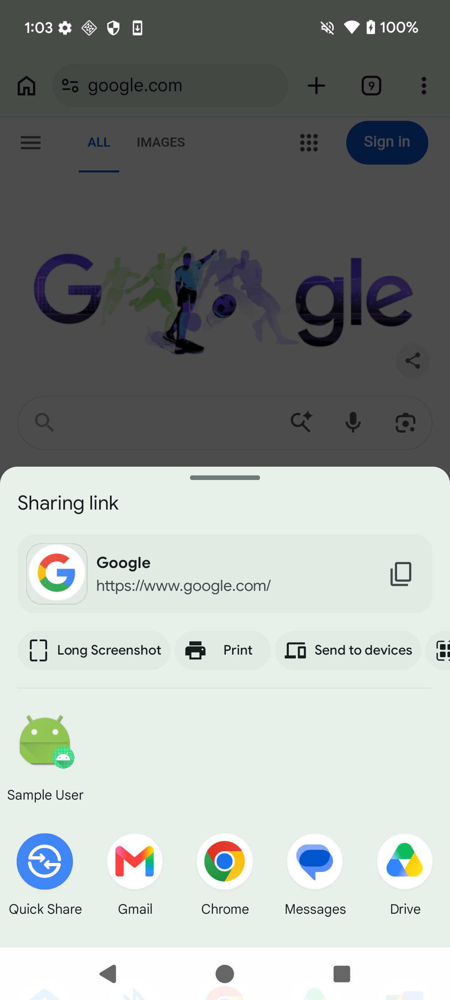
</p>

#### Remove Direct Share Target

```kotlin
shareManager.removeDirectShareTargets(listOf("sample_1"))
```

<p align="center">
    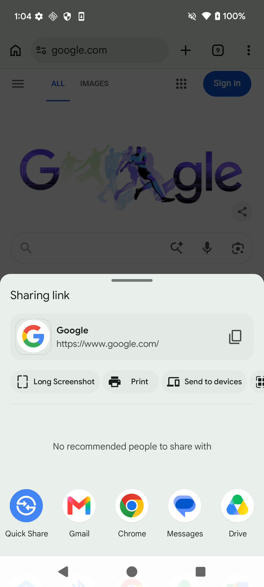
</p>

---

### Share with Callback

`shareWithCallback` opens the Sharesheet for text and calls `onResult` with the package of the app the user picked, or `null` when Android did not report it. `onFinished` runs once after any result the Sharesheet reports. On Android 15 (API 35) and later that includes Copy and Edit, which call `onFinished` without `onResult`; on earlier versions only a picked app is reported. Closing the Sharesheet without picking reports nothing, so neither callback runs.

The library waits for one result at a time, shared with [`shareForSelection`](#selection-event). Opening another Sharesheet with either function replaces the wait: the replaced callbacks are never called, and a pick in the older Sharesheet is not delivered to the newer one. Exceptions thrown by `onResult` and `onFinished` are not caught by the library.

#### Basic Callback

```kotlin
shareManager.shareWithCallback(
    ShareContent(text = "Hello with callback from native-toolkit"),
    onResult = { pkg ->
        // Called only when an app was picked; pkg == null when Android did not report its package
        val status = if (pkg != null) "Selected: $pkg" else "Shared (package unavailable)"
    }
)
```

<p align="center">
    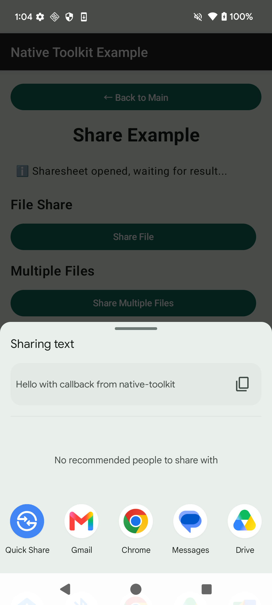
</p>

#### Callback with Rich Preview

```kotlin
val bmp = BitmapFactory.decodeResource(context.resources, android.R.mipmap.sym_def_app_icon)
val file = File(context.cacheDir, "callback_preview.png")
file.outputStream().use { bmp.compress(Bitmap.CompressFormat.PNG, 100, it) }

shareManager.shareWithCallback(
    ShareContent(
        text = "https://developer.android.com/",
        mimeType = "text/plain"
    ),
    SharePreviewOptions(
        title = "Callback with rich preview",
        thumbnailPath = file.absolutePath
    ),
    onResult = { pkg ->
        val status = if (pkg != null) "Selected: $pkg" else "Shared (package unavailable)"
    },
    onFinished = {
        // Runs once after the result is handled
    }
)
```

<p align="center">
    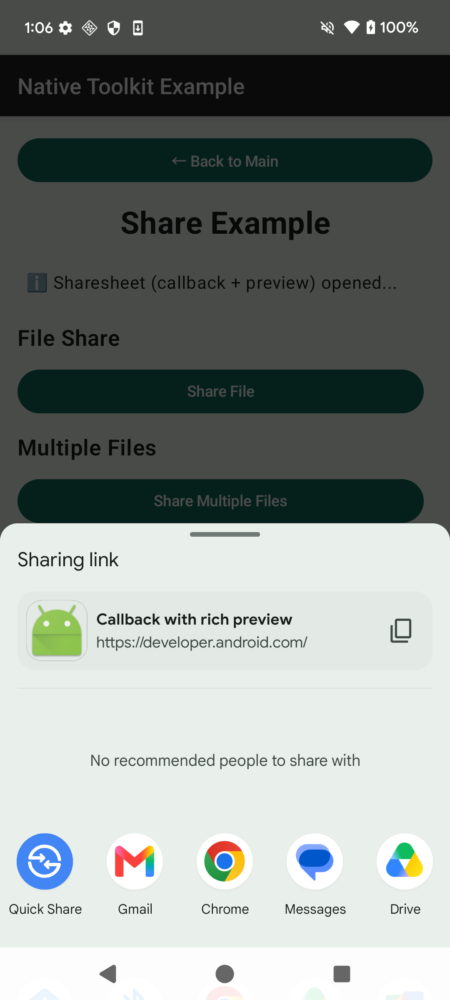
</p>

#### Cancel Pending Callback

Stops waiting: neither callback runs afterward. Because the wait is shared, it also stops a wait started by `shareForSelection`. Call it when the screen that asked goes away, so that a late pick does not update a screen that no longer exists; the sample does so in the `onDispose` shown in [Selection Event](#selection-event).

```kotlin
shareManager.cancelPendingCallback()
```

---

### Selection Event

`shareForSelection` opens the Sharesheet for text and returns a token (a `Long` that is not reused within the process). The app the user picks arrives through `selections` as a `ShareSelection` carrying that token and the package name (`null` when Android did not report it). Closing the Sharesheet, and results that are not an app (Copy, Edit), send nothing. Only Sharesheets opened by `shareForSelection` produce `selections` events.

The sample registers the listener while its Share screen is shown:

```kotlin
@Composable
fun ShareSampleScreen(activity: AppCompatActivity) {
    val shareManager = remember(activity) { AndroidShareManager.getInstance(activity) }
    var statusText by remember { mutableStateOf("Result will be displayed here") }
    // The token of the Sharesheet opened by shareForSelection, while its pick is awaited
    var selectionToken by remember { mutableStateOf<Long?>(null) }

    DisposableEffect(shareManager) {
        val registration = shareManager.selections.addListener { selection, _ ->
            if (selection.token == selectionToken) selectionToken = null
            statusText = "Selected (token=${selection.token}): ${selection.packageName ?: "(unknown package)"}"
        }
        onDispose {
            registration.remove()
            shareManager.cancelPendingCallback()
        }
    }

    // The buttons below
}
```

#### Share For Selection

```kotlin
try {
    val token = shareManager.shareForSelection(
        ShareContent(text = "Hello with a selection event from native-toolkit")
    )
    selectionToken = token
} catch (e: ShareDomainError) {
    statusText = e.javaClass.simpleName
}
```

<p align="center">
    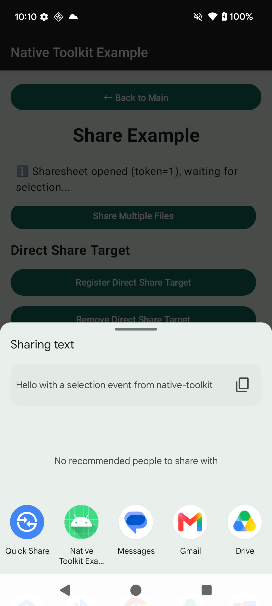
</p>

#### Cancel Share Selection

Stops waiting for the pick of `token`. It does nothing when another Sharesheet was opened since.

```kotlin
val token = selectionToken
if (token != null) {
    shareManager.cancelShareSelection(token)
    selectionToken = null
}
```

---

### Receiving Incoming Shares

The sample app also receives content shared from other apps via `ACTION_SEND` and `ACTION_SEND_MULTIPLE`. This is plain Android and does not use the library. Declare intent filters on the receiving `Activity` and read the Intent in `onCreate` and `onNewIntent`:

```xml
<activity
    android:name=".MainActivity"
    android:exported="true"
    android:launchMode="singleTask">
    <intent-filter>
        <action android:name="android.intent.action.SEND" />
        <category android:name="android.intent.category.DEFAULT" />
        <data android:mimeType="text/plain" />
    </intent-filter>
    <intent-filter>
        <action android:name="android.intent.action.SEND" />
        <category android:name="android.intent.category.DEFAULT" />
        <data android:mimeType="image/*" />
    </intent-filter>
    <intent-filter>
        <action android:name="android.intent.action.SEND_MULTIPLE" />
        <category android:name="android.intent.category.DEFAULT" />
        <data android:mimeType="text/plain" />
    </intent-filter>
    <intent-filter>
        <action android:name="android.intent.action.SEND_MULTIPLE" />
        <category android:name="android.intent.category.DEFAULT" />
        <data android:mimeType="image/*" />
    </intent-filter>
</activity>
```

---

### Error Handling

The operations throw `ShareDomainError` subtypes. They carry no message (`message` is `null`), so tell them apart by type and read their properties.

| Error | Thrown by | Cause |
|---|---|---|
| `EmptyContent` | `shareText`, `shareTextWithActions`, `shareWithCallback`, `shareForSelection` | `text` is blank |
| `InvalidMimeType(mimeType)` | `shareText`, `shareTextWithActions`, `shareImage` | The MIME type is blank |
| `InvalidChooserAction(id)` | `shareTextWithActions` | An action's `id` is empty or repeated, or its icon is not a readable image |
| `FileNotFound(path)` | `shareImage`, `shareImages`, `shareFile`, `shareFiles` | The file does not exist |
| `IllegalFileAccess(path)` | `shareImage`, `shareImages`, `shareFile`, `shareFiles` | The file is outside the [FileProvider](#fileprovider) directories |
| `EmptyFileList` | `shareImages`, `shareFiles` | The list is empty |
| `NoShareTarget` | Every operation that opens the Sharesheet | No activity can handle the share |
| `DirectShareRegistrationFailed(reason)` | `registerDirectShareTarget` | Android did not publish the shortcut |
| `InvalidBase64Icon(id)` | `registerDirectShareTarget` | The icon is not a readable image. The name is kept from 1.x, where the icon was Base64 |
| `EmptyIdList` | `removeDirectShareTargets` | The list is empty |

```kotlin
try {
    shareManager.shareText(ShareContent(text = "Hello"))
} catch (e: ShareDomainError.NoShareTarget) {
    // No app can handle this share
} catch (e: ShareDomainError.EmptyContent) {
    // Text was blank
} catch (e: ShareDomainError) {
    // Other domain error
}
```

---

### C ABI

- The same sharing for C, and for any language that can call a C function in a shared library. Kotlin and Java code calls `AndroidShareManager` instead.
- `android-native-toolkit-capi-2.0.0.aar` carries `libntk.so` for `arm64-v8a` and `x86_64` only, and the headers `NativeToolkitC/*.h` as a Prefab package. An app installed as 32-bit has no `libntk.so`.
- The C ABI calls the Kotlin API through JNI, so both AARs and their dependencies are part of the app's Gradle build. androidx.startup initializes the C ABI when the app starts. An app that disables Startup, or calls from a process other than the default one, calls `ntk_android_init(env, context)` (`<NativeToolkitC/Android.h>`) first; until then the operations return `NTK_SHARE_ERROR_NOT_INITIALIZED`.
- Every function can be called from any thread and never waits for the main thread. Completions, events and accepted `release` calls arrive on the Android main thread. Do not block in them, and do not let an exception leave a callback: the process terminates.
- Opening the Sharesheet is asynchronous and needs the app in the foreground. The return value says whether the request was accepted. The completion (`ntk_share_done_fn`) then runs once, with `NTK_SHARE_ERROR_NONE` when the Sharesheet opened or the reason it did not; called from the background, that is `NTK_SHARE_ERROR_NOT_FOREGROUND`. The completion says nothing about what the user picks: the chosen app arrives later as a selection event carrying the request ID.
- Called from a thread other than the main thread, the completion can arrive before the function returns. Match completions to requests with `user_data`.
- A call rejected on entry (a `NULL` argument, invalid UTF-8, an empty list, an empty text, an empty or repeated chooser action ID) returns the error, never calls the completion, and calls `release` once on the calling thread before returning. An accepted call's `release` runs on the main thread after the completion. `release` may be `NULL`.
- The library copies every input (strings, arrays, icon bytes) before the call returns.
- Handles passed to a callback (`ntk_string*`) belong to the receiver, which frees them with `ntk_string_free`, during the callback or later, on any thread.
- Request IDs are `uint64_t` and never reused within the process.
- The Direct Share functions are synchronous and do not need the foreground.
- `ntk_last_system_code()` and every completion's `system_code` are always 0 on Android.

#### Building

**app/build.gradle.kts:**

```kotlin
android {
    defaultConfig {
        // libntk.so exists for these ABIs only. Restrict CMake too: AGP checks the Prefab
        // package for every ABI CMake builds and fails with CXX1210 when one is missing.
        ndk { abiFilters += listOf("arm64-v8a", "x86_64") }
        externalNativeBuild {
            cmake { abiFilters("arm64-v8a", "x86_64") }
        }
    }
    buildFeatures { prefab = true }
}

dependencies {
    implementation("io.github.kimjh4941:android-native-toolkit-capi:2.0.0")
    // Declare the Kotlin API too when your own Kotlin or Java code calls it:
    // the capi POM depends on it for run time only.
    implementation("io.github.kimjh4941:android-native-toolkit:2.0.0")
}
```

**CMakeLists.txt:**

```cmake
find_package(ntk REQUIRED CONFIG)

add_library(myapp SHARED myapp.c)
target_link_libraries(myapp PRIVATE ntk::ntk)
```

See [C ABI](index.md#c-abi) in index.md for the whole setup.

Only when androidx.startup is disabled, or in a process other than the default one:

```c
#include <NativeToolkitC/Android.h>

/* env: the JNIEnv* of the calling thread. context: any Context (jobject); an Activity is also
   taken as the current foreground Activity. */
static void initialize_native_toolkit(void* env, void* context)
{
    /* Never waits; safe to call more than once. */
    ntk_android_error init_error = ntk_android_init(env, context);
    if (init_error == NTK_ANDROID_ERROR_IN_PROGRESS || init_error == NTK_ANDROID_ERROR_JNI_FAILURE) {
        /* Call it again later. NTK_ANDROID_ERROR_CLASS_NOT_FOUND does not recover: the AAR's
           classes are missing (for example removed by R8). */
    }
}
```

#### Opening the Sharesheet

Paths are full paths in the [FileProvider](#fileprovider) directories (files, cache, external files), and the thumbnail follows the same rule. A `NULL` MIME type for `ntk_share_image` means `image/*`.

```c
#include <string.h>
#include <NativeToolkitC/Common.h>
#include <NativeToolkitC/Share.h>

static void NTK_CALL on_share_done(void* user_data, ntk_share_error error, uint32_t system_code)
{
    /* Main thread, exactly once for an accepted call. NONE: the Sharesheet opened. */
    (void)user_data; (void)system_code;
    if (error == NTK_SHARE_ERROR_NOT_FOREGROUND) {
        /* The app was in the background; nothing opened. */
    }
}

/* icon_png: PNG, JPEG or WebP bytes. */
static void open_sharesheets(const char* thumbnail_path, const uint8_t* icon_png, size_t icon_png_size,
                             const char* image_path_1, const char* image_path_2,
                             const char* file_path_1, const char* file_path_2)
{
    /* Text. Zeroed fields are the defaults: no title, subject or preview, and "text/plain". */
    ntk_share_text_content content;
    memset(&content, 0, sizeof(content));
    content.struct_size = (uint32_t)sizeof(content);
    content.text = "Hello from native-toolkit";

    ntk_share_error error = ntk_share_text(&content, NULL, 0, &on_share_done, NULL, NULL);

    /* Subject, title and a rich preview. */
    content.title = "Choose an app";
    content.subject = "Sample subject line";
    content.preview_title = "Introducing content previews";
    content.preview_thumbnail_path = thumbnail_path;
    error = ntk_share_text(&content, NULL, 0, &on_share_done, NULL, NULL);

    /* Custom chooser actions (shown on API 34 and later). Every ntk_share_text call, even with
       no actions, makes the actions of earlier Sharesheets stop working. */
    ntk_share_chooser_action actions[1];
    actions[0].id = "custom";
    actions[0].label = "Custom";
    actions[0].icon = icon_png;
    actions[0].icon_size = icon_png_size;
    memset(&content, 0, sizeof(content));
    content.struct_size = (uint32_t)sizeof(content);
    content.text = "Shared with a custom chooser action";
    error = ntk_share_text(&content, actions, 1, &on_share_done, NULL, NULL);

    /* Images and files. */
    error = ntk_share_image(image_path_1, "image/png", &on_share_done, NULL, NULL);

    const char* images[2];
    images[0] = image_path_1;
    images[1] = image_path_2;
    error = ntk_share_images(images, 2, &on_share_done, NULL, NULL);

    error = ntk_share_file(file_path_1, &on_share_done, NULL, NULL);

    const char* files[2];
    files[0] = file_path_1;
    files[1] = file_path_2;
    error = ntk_share_files(files, 2, &on_share_done, NULL, NULL);
}
```

#### Selection and chooser action events

```c
#include <string.h>
#include <NativeToolkitC/Common.h>
#include <NativeToolkitC/Share.h>

static void NTK_CALL on_share_done(void* user_data, ntk_share_error error, uint32_t system_code)
{
    /* As in "Opening the Sharesheet": NONE when the Sharesheet opened. */
    (void)user_data; (void)error; (void)system_code;
}

static void NTK_CALL on_selection(void* user_data, uint64_t request_id, ntk_string* package_name)
{
    /* Main thread. package_name is NULL when Android did not report it; the receiver frees it. */
    (void)user_data; (void)request_id;
    if (package_name != NULL) {
        const char* name = ntk_string_data(package_name);   /* valid until ntk_string_free */
        size_t size = ntk_string_size(package_name);
        (void)name; (void)size;
        ntk_string_free(package_name);
    }
}

static void NTK_CALL on_chooser_action(void* user_data, ntk_string* action_id)
{
    /* Main thread. action_id is the id of the tapped ntk_share_chooser_action. */
    const char* id = ntk_string_data(action_id);
    size_t size = ntk_string_size(action_id);
    (void)user_data; (void)id; (void)size;
    ntk_string_free(action_id);
}

/* Register before opening: neither event is kept while no listener is registered. */
ntk_share_listener* selection_listener = NULL;
ntk_share_error error = ntk_share_add_selection_listener(&on_selection, NULL, NULL, &selection_listener);

ntk_share_listener* action_listener = NULL;
error = ntk_share_add_chooser_action_listener(&on_chooser_action, NULL, NULL, &action_listener);

/* Open the Sharesheet; the pick arrives in on_selection with this request ID. */
ntk_share_text_content content;
memset(&content, 0, sizeof(content));
content.struct_size = (uint32_t)sizeof(content);
content.text = "Hello with a selection event from native-toolkit";

uint64_t request_id = 0;
error = ntk_share_text_for_selection(&content, &on_share_done, NULL, NULL, &request_id);

/* Stop waiting for the pick. Never waits, and does nothing unless request_id is the request
   being waited for. It cancels the wait for the pick, not the open (which has no CANCELED). */
error = ntk_share_cancel_selection(request_id);

/* Removing a listener only removes it: the wait for the pick and the current actions stay.
   Removed on the main thread, nothing more is delivered; removed elsewhere, events can arrive
   until its release runs. The handle is invalid afterwards. */
ntk_share_listener_remove(selection_listener);
ntk_share_listener_remove(action_listener);
```

- Only one pick is awaited at a time, as in the Kotlin API: opening another Sharesheet with `ntk_share_text_for_selection` ends the wait for the previous one.
- A request that failed before the Sharesheet was requested (`NTK_SHARE_ERROR_NOT_FOREGROUND`, or `NTK_SHARE_ERROR_EMPTY_CONTENT` for a text of white space) leaves the previous request's wait in place. A request that failed after (`NTK_SHARE_ERROR_NO_SHARE_TARGET`, `NTK_SHARE_ERROR_UNKNOWN`) has ended it.
- `out_request_id` may be `NULL`, but then the selection cannot be matched to the request.
- Selections of Sharesheets that the app's Kotlin code opened with `shareForSelection` are not delivered to C.

#### Direct Share targets

```c
#include <string.h>
#include <NativeToolkitC/Share.h>

/* icon_png: PNG, JPEG or WebP bytes. */
static void update_direct_share_targets(const uint8_t* icon_png, size_t icon_png_size)
{
    ntk_share_direct_target target;
    memset(&target, 0, sizeof(target));
    target.struct_size = (uint32_t)sizeof(target);
    target.id = "sample_1";
    target.label = "Sample User";
    target.category = NULL;              /* "android.shortcut.conversation" */
    target.icon = icon_png;              /* NULL or empty: NTK_SHARE_ERROR_INVALID_ICON */
    target.icon_size = icon_png_size;

    ntk_share_error error = ntk_share_register_direct_target(&target);

    const char* ids[1];
    ids[0] = "sample_1";
    error = ntk_share_remove_direct_targets(ids, 1);
}
```

The app still declares the share target in `shortcuts.xml`, as in [Direct Share Target](#direct-share-target).

#### Error values

`ntk_share_error`. 0 to 5 mean the same in every feature of the C ABI.

| Code | Name | When | Returned by |
|---|---|---|---|
| 0 | `NTK_SHARE_ERROR_NONE` | Success; for an open, the Sharesheet opened | Both |
| 1 | `NTK_SHARE_ERROR_INVALID_PARAMETER` | A `NULL` argument or callback, invalid UTF-8, a `struct_size` that is too small | Return value |
| 2 | `NTK_SHARE_ERROR_NOT_INITIALIZED` | Called before initialization. The argument checks come first, and `ntk_share_cancel_selection` returns `NONE` | Return value |
| 3 | `NTK_SHARE_ERROR_NOT_SUPPORTED` | A nonzero value in the part of a struct this version does not know | Return value |
| 4 | `NTK_SHARE_ERROR_UNKNOWN` | Anything else; logcat (tag `ntk`) has the detail | Both |
| 5 | `NTK_SHARE_ERROR_OUT_OF_MEMORY` | An allocation failed | Both |
| 6 | `NTK_SHARE_ERROR_NOT_FOREGROUND` | The app is not in the foreground; nothing opened | Completion |
| 7 | `NTK_SHARE_ERROR_EMPTY_CONTENT` | The text is empty (return value) or white space only (completion) | Both |
| 8 | `NTK_SHARE_ERROR_NO_SHARE_TARGET` | No activity can handle the share | Completion |
| 9 | `NTK_SHARE_ERROR_FILE_NOT_FOUND` | The file does not exist | Completion |
| 10 | `NTK_SHARE_ERROR_ILLEGAL_FILE_ACCESS` | The file is outside the FileProvider directories | Completion |
| 11 | `NTK_SHARE_ERROR_INVALID_MIME_TYPE` | The MIME type is blank | Completion |
| 12 | `NTK_SHARE_ERROR_DIRECT_SHARE_REGISTRATION_FAILED` | Android did not publish the shortcut | Return value |
| 13 | `NTK_SHARE_ERROR_EMPTY_ID_LIST` | `ntk_share_remove_direct_targets` with no IDs | Return value |
| 14 | `NTK_SHARE_ERROR_EMPTY_FILE_LIST` | `ntk_share_images` or `ntk_share_files` with no paths | Return value |
| 15 | `NTK_SHARE_ERROR_INVALID_ICON` | The Direct Share icon is `NULL`, empty, or not a readable image | Return value |
| 16 | `NTK_SHARE_ERROR_INVALID_CHOOSER_ACTION` | An empty or repeated action ID, or a `NULL` or empty icon (return value); an icon that is not a readable image (completion). The actions of the previous Sharesheet keep working | Both |

There is no `CANCELED`: the open completes as soon as the Sharesheet opens, and cancelling the wait for the pick is separate from it.

| Kotlin API | C ABI |
|---|---|
| `shareText` / `shareTextWithActions` | `ntk_share_text` with `ntk_share_text_content` and `ntk_share_chooser_action` |
| `shareImage` / `shareImages` / `shareFile` / `shareFiles` | `ntk_share_image` / `_images` / `_file` / `_files` |
| `registerDirectShareTarget` / `removeDirectShareTargets` | `ntk_share_register_direct_target` with `ntk_share_direct_target` / `ntk_share_remove_direct_targets` |
| `shareForSelection` / `cancelShareSelection` | `ntk_share_text_for_selection` / `ntk_share_cancel_selection` |
| `selections.addListener` | `ntk_share_add_selection_listener` |
| `chooserActions.addListener` | `ntk_share_add_chooser_action_listener` |
| `EventHub.Registration.remove` | `ntk_share_listener_remove` |
| `shareWithCallback` / `cancelPendingCallback` | None; use `ntk_share_text_for_selection` |
| `ShareDomainError` | `ntk_share_error` 7 to 16, in the same order |

---

## iOS

- Library: `ios-native-toolkit-1.3.0.xcframework`
- Minimum Deployment Target: iOS 18
- Scope: sending only (presenting the system share sheet via `UIActivityViewController`). Receiving incoming shares (Share Extension) is not included.

### IosShareManager

`IosShareManager` is a singleton class that presents the system share sheet on iOS.

<p align="center">
    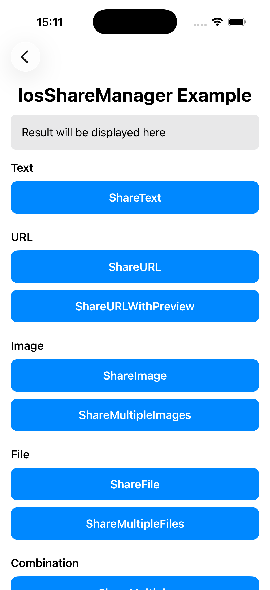
</p>

### Setup

1. Add `ios-native-toolkit-1.3.0.xcframework` to your Xcode project (drag it into the project and set "Embed & Sign" in the target's Frameworks, Libraries, and Embedded Content).
2. Import the library where you present the share sheet:

```swift
import IosLibrary
```

No additional initialization is required.

`IosShareManager.share` offers two calling styles:

- `async throws` (preferred for native Swift callers): returns a typed `ShareResult` and throws `ShareError` on failure.
- Callback (used by the Unity Bridge, also available in Swift): `(isSuccess, completed, activityType, errorMessage)`.

```swift
// async throws (recommended for Swift callers)
Task {
    do {
        let result = try await IosShareManager.shared.share(
            content: ShareContent(items: [.text("Hello")])
        )
        // result.completed == false means the user cancelled (not an error)
        print(result.completed, result.activityType ?? "nil")
    } catch {
        print(error.localizedDescription)
    }
}

// callback (equivalent)
IosShareManager.shared.share(
    content: ShareContent(items: [.text("Hello")])
) { isSuccess, completed, activityType, errorMessage in
    print(isSuccess, completed, activityType ?? "nil", errorMessage ?? "nil")
}
```

The examples below use the `async throws` style. Because SwiftUI `Button` actions are synchronous, each call is wrapped in `Task { ... }`.

### Text Share

#### Share Text

```swift
Task {
    let result = try await IosShareManager.shared.share(
        content: ShareContent(items: [.text("Shared from IosLibraryExample")])
    )
    print(result.completed, result.activityType ?? "nil")
}
```

<p align="center">
    
</p>

#### Share URL

A URL is passed as a raw string. It is validated in the library: only `http`, `https`, and `file` schemes with a valid host are accepted (otherwise `ShareError.invalidURL` is thrown).

```swift
Task {
    let result = try await IosShareManager.shared.share(
        content: ShareContent(items: [.url("https://www.apple.com")])
    )
    print(result.completed, result.activityType ?? "nil")
}
```

<p align="center">
    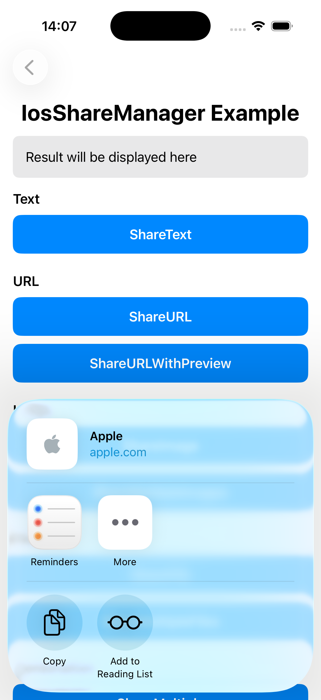
</p>

#### Share URL with Preview

Set `previewTitle` to show a rich link preview in the share sheet header immediately, without waiting for a network fetch.

```swift
Task {
    let result = try await IosShareManager.shared.share(
        content: ShareContent(
            items: [.url("https://www.apple.com")],
            previewTitle: "Apple"
        )
    )
    print(result.completed, result.activityType ?? "nil")
}
```

<p align="center">
    
</p>

### Image Share

#### Share Image

Pass the local file path of an image with `.imageFile(path:)`. The library loads it as a `UIImage` (throws `ShareError.imageLoadFailed` if it cannot be read).

```swift
guard let imagePath = Bundle.main.url(forResource: "app-icon-attachment", withExtension: "png")?.path else {
    return
}

Task {
    let result = try await IosShareManager.shared.share(
        content: ShareContent(items: [.imageFile(path: imagePath)])
    )
    print(result.completed, result.activityType ?? "nil")
}
```

<p align="center">
    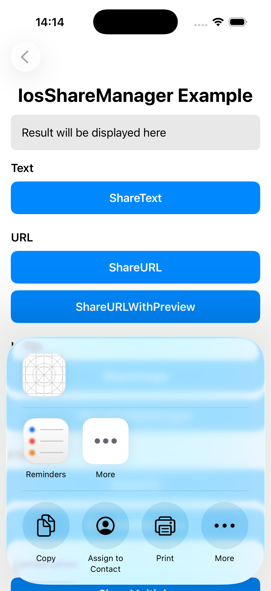
</p>

#### Share Multiple Images

`ShareContent.items` accepts multiple entries, so several images can be shared at once.

```swift
let imagePaths: [String] = /* local image file paths */

Task {
    let result = try await IosShareManager.shared.share(
        content: ShareContent(items: imagePaths.map { .imageFile(path: $0) })
    )
    print(result.completed, result.activityType ?? "nil")
}
```

<p align="center">
    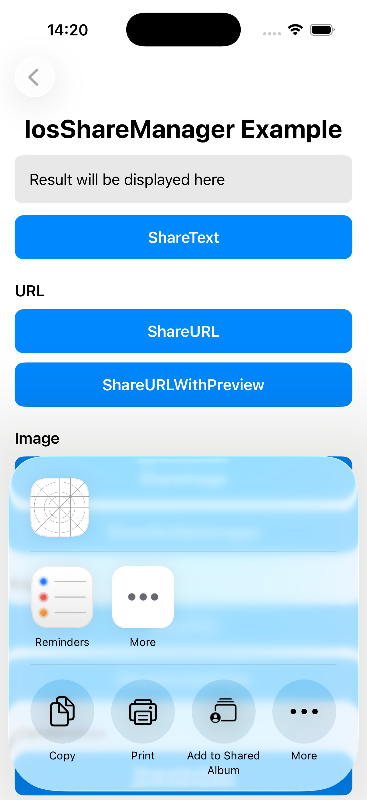
</p>

### File Share

#### Share File

Pass the local file path with `.file(path:)`. The library checks that the file exists (throws `ShareError.fileNotFound` otherwise).

```swift
let fileURL = FileManager.default.temporaryDirectory.appendingPathComponent("share-sample.txt")
try "Shared from IosLibraryExample.".write(to: fileURL, atomically: true, encoding: .utf8)

Task {
    let result = try await IosShareManager.shared.share(
        content: ShareContent(items: [.file(path: fileURL.path)])
    )
    print(result.completed, result.activityType ?? "nil")
}
```

<p align="center">
    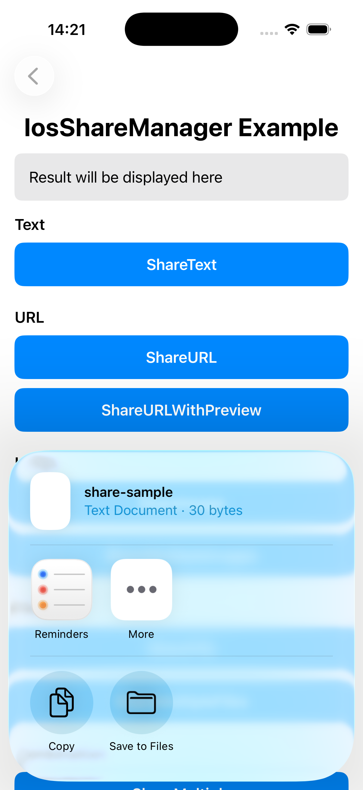
</p>

#### Share Multiple Files

```swift
let fileURLs: [URL] = /* local file URLs */

Task {
    let result = try await IosShareManager.shared.share(
        content: ShareContent(items: fileURLs.map { .file(path: $0.path) })
    )
    print(result.completed, result.activityType ?? "nil")
}
```

<p align="center">
    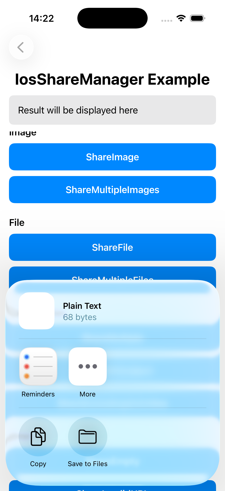
</p>

### Combined Content

#### Share Multiple Items

Mix different item types (text, URL, image, file) in a single share.

```swift
Task {
    let result = try await IosShareManager.shared.share(
        content: ShareContent(items: [
            .text("Check this out"),
            .url("https://www.apple.com")
        ])
    )
    print(result.completed, result.activityType ?? "nil")
}
```

<p align="center">
    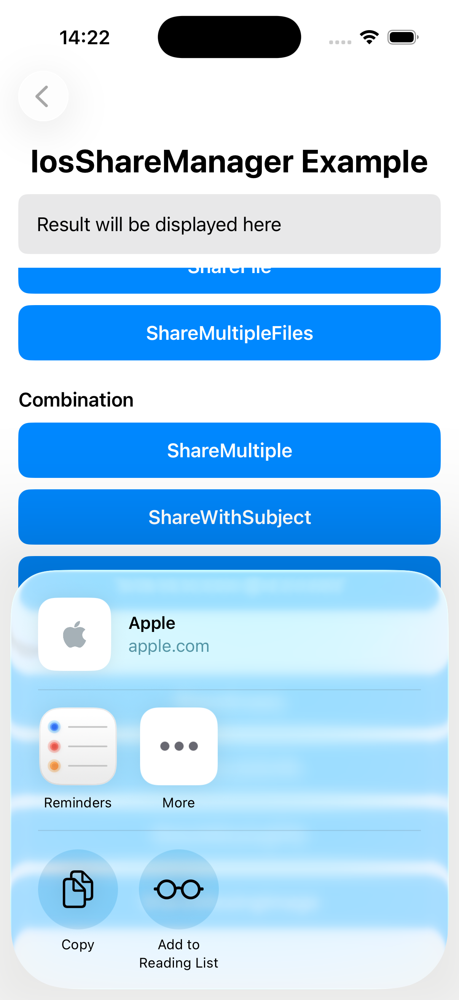
</p>

#### Share with Subject

`subject` is used by activities that support it (for example, the subject line in Mail).

```swift
Task {
    let result = try await IosShareManager.shared.share(
        content: ShareContent(
            items: [.text("Body text")],
            subject: "Sample Subject"
        )
    )
    print(result.completed, result.activityType ?? "nil")
}
```

<p align="center">
    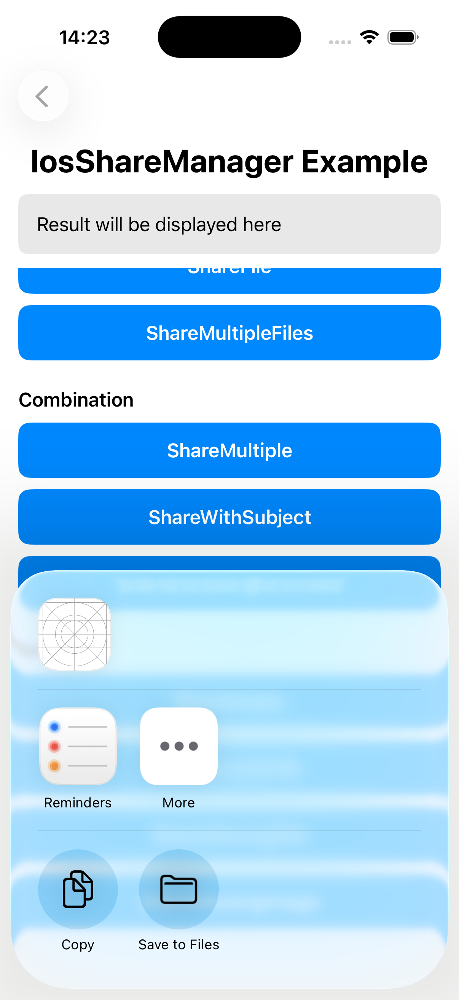
</p>

#### Exclude Activity Types

Pass raw activity type identifiers in `excludedActivityTypes` to hide them from the share sheet.

```swift
Task {
    let result = try await IosShareManager.shared.share(
        content: ShareContent(
            items: [.url("https://www.apple.com")],
            excludedActivityTypes: [
                "com.apple.UIKit.activity.CopyToPasteboard",
                "com.apple.UIKit.activity.PostToFacebook"
            ]
        )
    )
    print(result.completed, result.activityType ?? "nil")
}
```

<p align="center">
    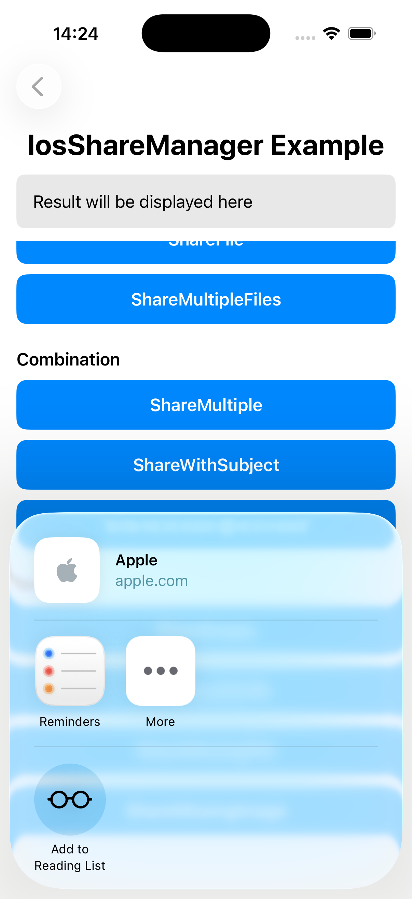
</p>

### Error Handling

The `async throws` API throws `ShareError` on failure. User cancellation is not an error: it is reported as `ShareResult.completed == false`.

| Error | Cause | Error message |
|---|---|---|
| `noValidItems` | `items` is empty | `"No shareable items were provided."` |
| `invalidURL(String)` | URL string is not a valid `http`/`https`/`file` URL | `"Invalid URL: <value>."` |
| `imageLoadFailed(path:)` | Image at the path could not be loaded | `"Failed to load image at path: <path>."` |
| `fileNotFound(path:)` | File at the path does not exist | `"File not found at path: <path>."` |
| `noRootViewController` | No root view controller available to present | `"No root view controller available to present the share sheet."` |
| `presentationFailed(Error)` | Presentation failed or the system reported an error | `"Failed to present the share sheet: <detail>."` |
| `unknown(Error)` | An unexpected error occurred | `"An unknown error occurred: <detail>."` |

```swift
Task {
    do {
        let result = try await IosShareManager.shared.share(
            content: ShareContent(items: [.text("Hello")])
        )
        if result.completed {
            // Shared successfully via result.activityType
        } else {
            // User cancelled
        }
    } catch let error as ShareError {
        // Typed error (e.g. .noValidItems, .invalidURL, .fileNotFound)
        print(error.localizedDescription)
    } catch {
        // Other error
    }
}
```

When using the callback API, failures are delivered as `isSuccess == false` with a non-nil `errorMessage`:

```swift
IosShareManager.shared.share(
    content: ShareContent(items: [])
) { isSuccess, completed, activityType, errorMessage in
    // isSuccess == false, errorMessage == "No shareable items were provided."
}
```

---

## macOS

- Library: `mac-native-toolkit-1.3.0.xcframework`
- Minimum Deployment Target: macOS 15
- Scope: sending only, via `NSSharingServicePicker` (picker) and `NSSharingService` (direct service execution). Receiving incoming shares is not included.
- macOS offers two ways to share: a **picker** that lets the user choose a service (`NSSharingServicePicker`), and **direct service execution** that runs a single named service without showing the picker (`NSSharingService`, for example launching Mail with prefilled `recipients`/`subject`).

### MacShareManager

`MacShareManager` is a singleton class that presents the system sharing service picker and performs individual sharing services on macOS.

**Important:** Present the picker only in response to a user-initiated action (for example, a button click). `NSSharingServicePicker.show(...)` requires a `mouseDown` event context, and the picker call path hops through `Task { @MainActor in ... }` internally, which does not formally guarantee that context is preserved. In the sample app included with this toolkit, the picker was confirmed to appear correctly and resolve (appear / cancel / complete) when triggered by a real click. Direct service execution (`shareViaService`, `share(content:serviceName:completion:)`) does not depend on `mouseDown` context and is the more robust path when reliability matters.

<p align="center">
    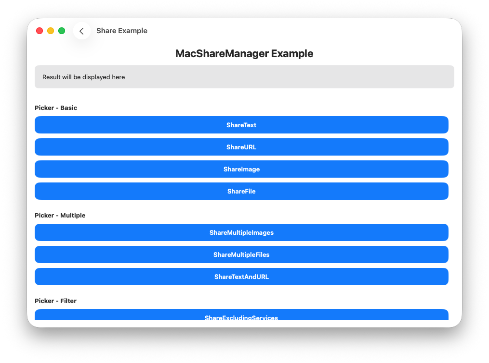
</p>

### Setup

1. Add `mac-native-toolkit-1.3.0.xcframework` to your Xcode project (drag it into the project and set "Embed & Sign" in the target's Frameworks, Libraries, and Embedded Content).
2. Import the library where you present the share picker or run a service:

```swift
import MacLibrary
```

No additional initialization is required.

`MacShareManager` offers two calling styles for each operation:

- `async throws` (preferred for native Swift callers): returns a typed `ShareResult` and throws `ShareError` on failure.
- Callback (used by the Unity Bridge, also available in Swift): `(isSuccess, completed, serviceName, errorMessage)`.

```swift
// async throws (recommended for Swift callers)
Task {
    do {
        let result = try await MacShareManager.shared.share(
            content: ShareContent(items: [.text("Hello")])
        )
        // result.completed == false means the user cancelled (not an error)
        print(result.completed, result.serviceName ?? "nil")
    } catch {
        print(error.localizedDescription)
    }
}

// callback (equivalent)
MacShareManager.shared.share(
    content: ShareContent(items: [.text("Hello")])
) { isSuccess, completed, serviceName, errorMessage in
    print(isSuccess, completed, serviceName ?? "nil", errorMessage ?? "nil")
}
```

The examples below use the `async throws` style. Because SwiftUI `Button` actions are synchronous, each call is wrapped in `Task { ... }`.

### Picker - Basic

#### Share Text

```swift
Task {
    let result = try await MacShareManager.shared.share(
        content: ShareContent(items: [.text("Shared from MacLibraryExample")])
    )
    print(result.completed, result.serviceName ?? "nil")
}
```

<p align="center">
    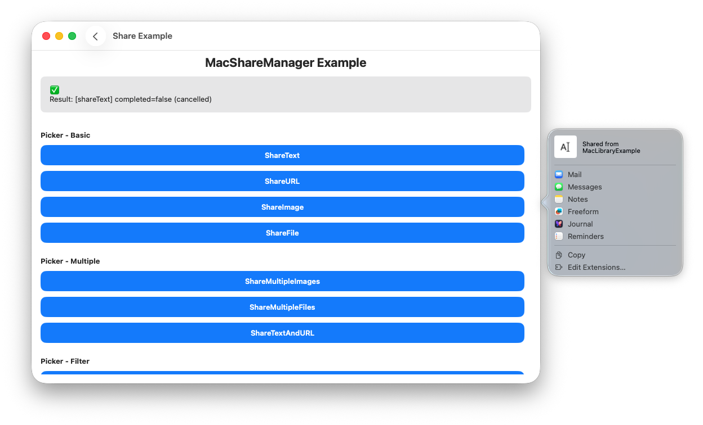
</p>

#### Share URL

A URL is passed as a raw string. It is validated in the library: only `http`, `https`, and `file` schemes with a valid host are accepted (otherwise `ShareError.invalidURL` is thrown).

```swift
Task {
    let result = try await MacShareManager.shared.share(
        content: ShareContent(items: [.url("https://www.apple.com")])
    )
    print(result.completed, result.serviceName ?? "nil")
}
```

<p align="center">
    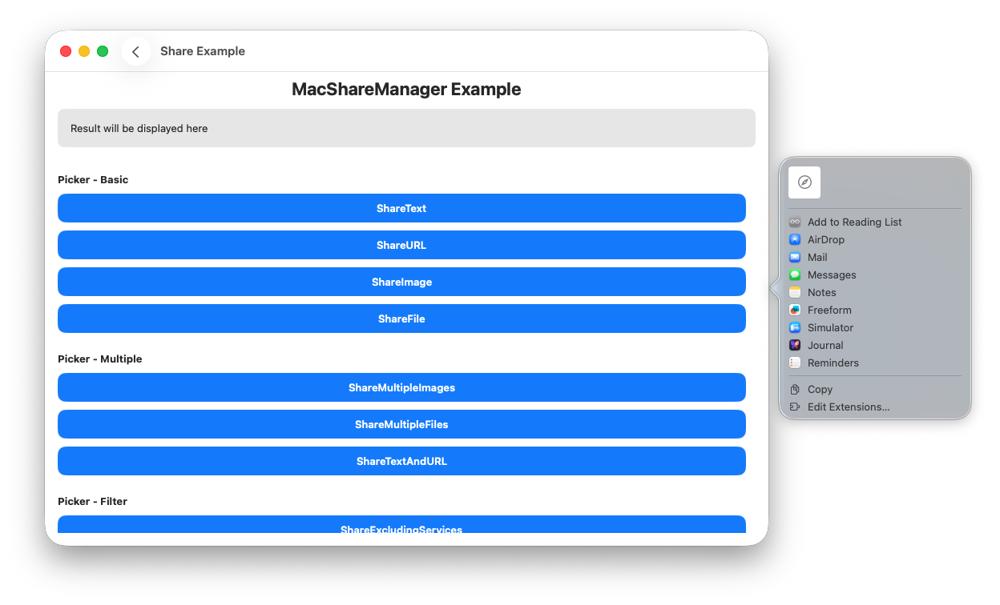
</p>

#### Share Image

Pass the local file path of an image with `.imageFile(path:)`. The library loads it as an `NSImage` (throws `ShareError.imageLoadFailed` if it cannot be read).

```swift
guard let image = NSImage(named: "test-image") else { return }
guard let tiffData = image.tiffRepresentation,
      let bitmap = NSBitmapImageRep(data: tiffData),
      let pngData = bitmap.representation(using: .png, properties: [:])
else { return }

let imageURL = FileManager.default.temporaryDirectory.appendingPathComponent("share-sample-image.png")
try pngData.write(to: imageURL)

Task {
    let result = try await MacShareManager.shared.share(
        content: ShareContent(items: [.imageFile(path: imageURL.path)])
    )
    print(result.completed, result.serviceName ?? "nil")
}
```

<p align="center">
    
</p>

#### Share File

Pass the local file path with `.file(path:)`. The library checks that the file exists (throws `ShareError.fileNotFound` otherwise).

```swift
let fileURL = FileManager.default.temporaryDirectory.appendingPathComponent("share-sample.txt")
try "Shared from MacLibraryExample.".write(to: fileURL, atomically: true, encoding: .utf8)

Task {
    let result = try await MacShareManager.shared.share(
        content: ShareContent(items: [.file(path: fileURL.path)])
    )
    print(result.completed, result.serviceName ?? "nil")
}
```

<p align="center">
    
</p>

### Picker - Multiple

#### Share Multiple Images

`ShareContent.items` accepts multiple entries, so several images can be shared at once (there is only one bundled sample image, so it is copied to distinct temporary files).

```swift
let imagePaths: [String] = /* local image file paths */

Task {
    let result = try await MacShareManager.shared.share(
        content: ShareContent(items: imagePaths.map { .imageFile(path: $0) })
    )
    print(result.completed, result.serviceName ?? "nil")
}
```

<p align="center">
    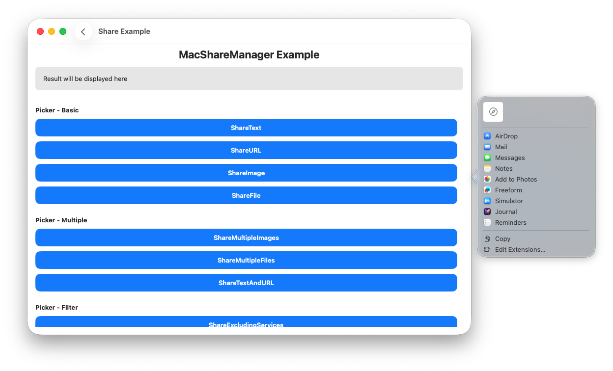
</p>

#### Share Multiple Files

```swift
let fileURLs: [URL] = /* local file URLs */

Task {
    let result = try await MacShareManager.shared.share(
        content: ShareContent(items: fileURLs.map { .file(path: $0.path) })
    )
    print(result.completed, result.serviceName ?? "nil")
}
```

<p align="center">
    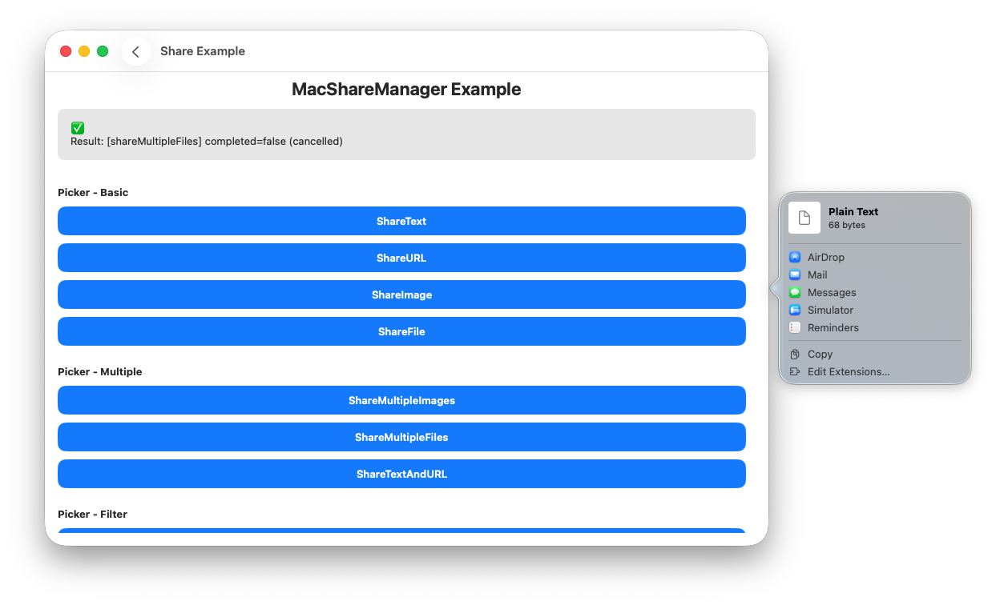
</p>

#### Share Text and URL

Mix different item types (text, URL, image, file) in a single share.

```swift
Task {
    let result = try await MacShareManager.shared.share(
        content: ShareContent(items: [
            .text("Check this out"),
            .url("https://www.apple.com")
        ])
    )
    print(result.completed, result.serviceName ?? "nil")
}
```

<p align="center">
    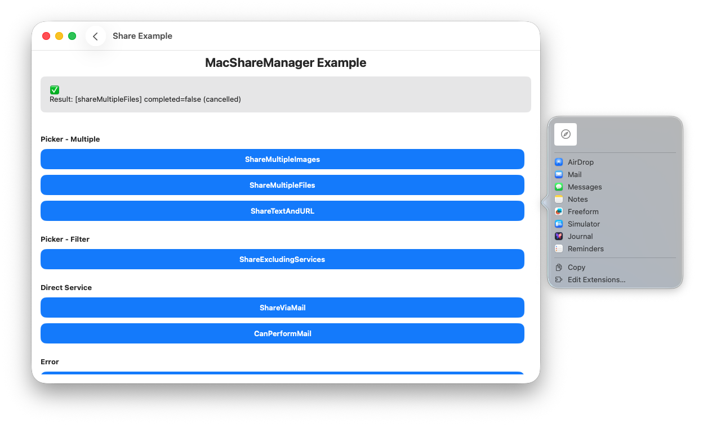
</p>

### Picker - Filter

#### Share Excluding Services

Pass service display titles in `excludedServiceTitles` to hide them from the picker. This is **best-effort**: `NSSharingService` does not expose a stable raw identifier to the caller, so the match is against the service's display `title`, which can be localized and may not match in every environment. Where reliable control is required, use direct service execution (`shareViaService`) instead.

```swift
Task {
    let result = try await MacShareManager.shared.share(
        content: ShareContent(
            items: [.url("https://www.apple.com")],
            excludedServiceTitles: ["Add to Reading List"]
        )
    )
    print(result.completed, result.serviceName ?? "nil")
}
```

<p align="center">
    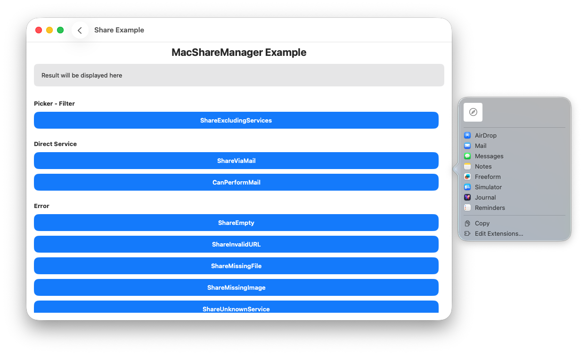
</p>

### Direct Service

#### Share via Mail

Run a single named service directly, bypassing the picker. `serviceName` is a raw `NSSharingService.Name` value (for example `"com.apple.share.Mail.compose"`). `recipients` and `subject` are applied to the service before it runs; they have no effect in picker mode.

```swift
Task {
    let result = try await MacShareManager.shared.shareViaService(
        content: ShareContent(
            items: [.text("Body text")],
            recipients: ["test@example.com"],
            subject: "Sample Subject"
        ),
        serviceName: "com.apple.share.Mail.compose"
    )
    print(result.completed, result.serviceName ?? "nil")
}
```

<p align="center">
    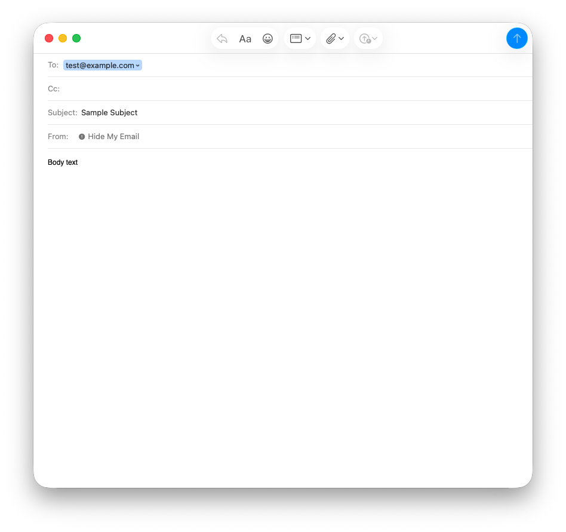
</p>

#### Check if a Service Can Perform

Query whether a named service can share the given content, for example to enable/disable a button before the user taps it.

```swift
Task {
    let canPerform = try await MacShareManager.shared.canPerform(
        content: ShareContent(items: [.text("Body text")]),
        serviceName: "com.apple.share.Mail.compose"
    )
    print(canPerform)
}
```

### Error Handling

The `async throws` API throws `ShareError` on failure. User cancellation is not an error: it is reported as `ShareResult.completed == false`.

| Error | Cause | Error message |
|---|---|---|
| `noValidItems` | `items` is empty | `"No shareable items were provided."` |
| `invalidURL(String)` | URL string is not a valid `http`/`https`/`file` URL | `"Invalid URL: <value>."` |
| `imageLoadFailed(path:)` | Image at the path could not be loaded | `"Failed to load image at path: <path>."` |
| `fileNotFound(path:)` | File at the path does not exist | `"File not found at path: <path>."` |
| `noAnchorView` | No key window was available to anchor the picker | `"No key window available to anchor the sharing picker."` |
| `serviceUnavailable(name:)` | The named service is unknown or cannot share the content | `"Sharing service unavailable: <name>."` |
| `alreadyInProgress` | Another share operation is already in progress | `"A share operation is already in progress."` |
| `presentationFailed(Error)` | Presentation failed or the system reported an error | `"Failed to share: <detail>."` |
| `unknown(Error)` | An unexpected error occurred | `"An unknown share error occurred: <detail>."` |

```swift
Task {
    do {
        let result = try await MacShareManager.shared.share(
            content: ShareContent(items: [.text("Hello")])
        )
        if result.completed {
            // Shared successfully via result.serviceName
        } else {
            // User cancelled
        }
    } catch let error as ShareError {
        // Typed error with errorCode / errorMessage (e.g. .noValidItems, .invalidURL, .fileNotFound)
        print(error.errorCode, error.errorMessage)
    } catch {
        // Other error
    }
}
```

When using the callback API, failures are delivered as `isSuccess == false` with a non-nil `errorMessage`:

```swift
MacShareManager.shared.share(
    content: ShareContent(items: [])
) { isSuccess, completed, serviceName, errorMessage in
    // isSuccess == false, errorMessage == "No shareable items were provided."
}
```
